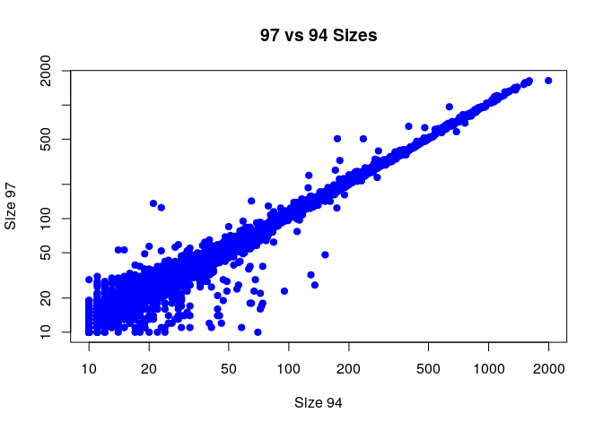

Reading in Data files
---------------------

    cocoli_dat <- read.table("~/Desktop/eeb234/eeb-177/classwork/feb-21/cocoli.txt", header = TRUE)
    sizes_94<-cocoli_dat$dbh1
    names(sizes_94)<- cocoli_dat$tag
    sizes_94["000009"]

    ## 000009 
    ##     29

    sizes_94[c("000009","000099")]

    ## 000009 000099 
    ##     29     62

    sizes_97<-cocoli_dat$dbh2

    r_gr1<- (sizes_97-sizes_94)/sizes_94/3

    cocoli_dat$rgr1<-r_gr1

    #bar graph made with barplot()

    #boxplot - make with boxplot()

    #scatter plot - make with plot()

    #histogram make with hist()

    #hist(sizes_94, xlab = "DBH (mm)", main="Distribution of Tree Sizes in Cocoli (1994)")

    plot(x=sizes_94, y= sizes_97, main = "97 vs 94 Sizes", xlab = "Size 94", ylab = 'Size 97', pch =19,col='blue', log = 'xy')

    ## Warning in xy.coords(x, y, xlabel, ylabel, log): 1283 x values <= 0 omitted
    ## from logarithmic plot

    ## Warning in xy.coords(x, y, xlabel, ylabel, log): 1176 y values <= 0 omitted
    ## from logarithmic plot

    library(dplyr)

    ## 
    ## Attaching package: 'dplyr'

    ## The following objects are masked from 'package:stats':
    ## 
    ##     filter, lag

    ## The following objects are masked from 'package:base':
    ## 
    ##     intersect, setdiff, setequal, union

    cocoli_dat

    ##         tag spcode     x     y dbh1 dbh2 dbh3 recr1 recr2 recr3 pom1 pom2
    ## 1    000001 PROTTE   3.0   0.9  171  267  277     A     A     A    1    2
    ## 2    000002 COCCPA   0.1   0.6   13   14   17     A     A     A    1    1
    ## 3    000003 EUGEPR   1.3   2.3   26   33   39     A     A     A    1    2
    ## 4    000004 PROTTE   2.2   3.4   10   17   19     A     A     A    1    1
    ## 5    000005 CLAVME   3.5   3.7   14   15   15     A     A     A    1    1
    ## 6    000006 PROTTE   4.3   4.7   12   26   25     A     A     A    1    2
    ## 7    000007 POUTCA   3.7   7.0   15   19   19     A     A     A    1    1
    ## 8    000008 SWARS1   4.1   6.3   78   78   78     A     A     A    1    1
    ## 9    000009 RINOLI   1.5  11.0   29   30   29     A     A     A    1    1
    ## 10   000010 COCCPA   0.9  14.0   28   29   33     A     A     A    1    1
    ## 11   000011 CAL2CA   4.0  13.2   69   69   65     A     A     A    1    1
    ## 12   000012 CLAVME   3.4  12.7   11   11   10     A     A     A    1    1
    ## 13   000013 BACTMA   2.0  16.2   33   38    0     A     A     B    1    1
    ## 14   000014 TRI2PL   3.8  19.7  316  323  330     A     A     A    1    2
    ## 15   000015 FARAOC   4.9  18.6   15   15   16     A     A     A    1    1
    ## 16   000016 FARAOC   4.0  18.7   54   57   57     A     A     A    1    1
    ## 17   000017 EUGEPR   3.6  18.4   14   14   13     A     A     A    1    1
    ## 18   000018 PROTTE   8.8  16.3   11   21   24     A     A     A    1    1
    ## 19   000019 ALIBED   8.8  15.6   21   28   29     A     A     A    1    1
    ## 20   000020 CUPASY   8.3  15.5   12   18   20     A     A     A    1    1
    ## 21   000021 POSOLA   7.1  15.6   26   25   25     A     A     A    1    2
    ## 22   000022 CLAVME   6.3  17.0   13   12   11     A     A     A    1    1
    ## 23   000023 CLAVME   7.2  16.9   10    0    0     A     B     B    1    2
    ## 24   000024 POSOLA   8.6  19.3   49   55   54     A     A     A    1    1
    ## 25   000025 SWARS1   6.0  10.1   68   29   35     A     A     A    1    1
    ## 26   000026 COCCPA   6.8  10.5   73   73   74     A     A     A    1    1
    ## 27   000027 THEVAH   9.3  14.8   14   27   27     A     A     A    1    1
    ## 28   000028 SWARS1   9.7  13.7   73   76   76     A     A     A    1    1
    ## 29   000029 MICOAR   9.0   5.1   15   -1   -1     A     D     D    1    0
    ## 30   000030 LACIAG   6.9   8.7   12   27   27     A     A     A    1    1
    ## 31   000031 SWARS1   9.6   8.3  201  205  205     A     A     A    1    1
    ## 32   000032 POSOLA   9.6   7.2   27   31   32     A     A     A    1    1
    ## 33   000033 FARAOC   9.1   6.3   41   49   49     A     A     A    1    1
    ## 34   000034 HEISCO   8.3   6.4   15   23   27     A     A     A    1    1
    ## 35   000035 AST2GR   6.7   0.3   58   61   60     A     A     A    1    1
    ## 36   000036 EUGEPR   6.2   0.7   10   11   11     A     A     A    1    1
    ## 37   000037 POUTCA  10.9  38.9   15   13   15     A     A     A    1    1
    ## 38   000038 COCCPA   6.9   3.5   19   22   23     A     A     A    1    1
    ## 39   000039 TRI2HI  14.5   0.9  485  490  491     A     A     A    1    1
    ## 40   000040 POSOLA  12.7   0.6   11   11   12     A     A     A    1    1
    ## 41   000041 EUGEPR  11.7   0.9   18   20   20     A     A     A    1    1
    ## 42   000042 ARDIRE  10.3   3.7  115  118  127     A     A     A    1    1
    ## 43   000043 GUARGL  12.2   4.6   31   36   36     A     A     A    1    1
    ## 44   000044 EUGEPR  12.7   4.5   14   15   16     A     A     A    1    1
    ## 45   000045 POSOLA  13.7   2.4   38   45   46     A     A     A    1    1
    ## 46   000046 AST2GR  13.3   3.3   95   99  102     A     A     A    1    1
    ## 47   000047 EUGEPR  13.8   3.6   12   16   17     A     A     A    1    1
    ## 48   000048 BACTMA  13.1   5.8   28   31   30     A     A     A    1    1
    ## 49   000049 SLOATE  11.1   8.5   24   31   32     A     A     A    1    1
    ## 50   000050 BURSSI  13.7   8.9  352  362  371     A     A     A    1    1
    ## 51   000051 POUTCA  13.8   8.4   34   36   37     A     A     A    1    1
    ## 52   000052 PROTTE  14.8   9.8   13   30   30     A     A     A    1    1
    ## 53   000053 EUGEPR  13.2   9.0   21   21    0     A     A     B    1    1
    ## 54   000054 EUGEPR  12.1   9.9   28   20   22     A     A     A    1    1
    ## 55   000055 FARAOC  13.1  11.6   12   14   17     A     A     A    1    1
    ## 56   000056 SWARS1  12.9  11.8   15   19   21     A     A     A    1    1
    ## 57   000057 BACTMA  11.6  10.8   31   40   40     A     A     A    1    1
    ## 58   000058 CUPASY  10.2  10.5   41   44   45     A     A     A    1    1
    ## 59   000059 PALIGU  11.0  13.7   18   23   -1     A     A     D    1    1
    ## 60   000060 CLAVME  10.5  13.9   17   17   19     A     A     A    1    1
    ## 61   000061 SOROAF  12.3  13.5   19   18   18     A     A     A    1    1
    ## 62   000062 EUGECO  11.4  14.9   18   23   23     A     A     A    1    1
    ## 63   000063 CHR2CA  11.5  14.5   13   17   17     A     A     A    1    1
    ## 64   000064 EUGECO  12.9  14.7   15   20   21     A     A     A    1    1
    ## 65   000065 COU2CU  14.0  14.1   13   16   21     A     A     A    1    1
    ## 66   000066 TRI2PL  14.3  13.4  241  258  260     A     A     A    1    1
    ## 67   000067 SWARS1  14.6  12.6   25   27   29     A     A     A    1    1
    ## 68   000068 EUGEPR  13.5  12.9   12   12   13     A     A     A    1    1
    ## 69   000069 COCCPA  13.2  15.5   21   26   27     A     A     A    1    1
    ## 70   000070 FARAOC  12.7  15.3   30   33   34     A     A     A    1    1
    ## 71   000071 POUTCA  12.4  16.0   16   19   20     A     A     A    1    1
    ## 72   000072 PICRLA  12.2  15.6   23   32   37     A     A     A    1    1
    ## 73   000073 FARAOC  10.1  16.2   20   22   -1     A     A     D    1    1
    ## 74   000074 CAVAPL  10.8  17.9 1332 1375 1361     A     A     A    1    1
    ## 75   000075 COU2CU  13.0  19.5   56   26   27     A     A     A    1    1
    ## 76   000076 SWARS1  14.4  18.4   62   67   69     A     A     A    1    1
    ## 77   000077 FARAOC  14.7  16.8   27   33   36     A     A     A    1    1
    ## 78   000078 EUGEPR  14.3  16.3   14   21   22     A     A     A    1    1
    ## 79   000079 SLOATE  13.7  17.0   15   14   14     A     A     A    1    1
    ## 80   000080 CUPARU  19.1  16.0   16   18   20     A     A     A    1    1
    ## 81   000081 PICRLA  17.7  13.5   19    0   -1     A     B     D    1    2
    ## 82   000082 ACALDI  17.1  17.5   49   23   44     A     A     A    1    1
    ## 83   000083 MYRCGA  15.6  18.0   21   23   26     A     A     A    1    1
    ## 84   000084 EUGEPR  15.7  19.6   15   27   16     A     A     A    1    1
    ## 85   000085 NECTMA  18.6  18.9   21   35   39     A     A     A    1    1
    ## 86   000086 BROSAL  18.8  19.0   22   23   24     A     A     A    1    1
    ## 87   000087 PICRLA  19.4  19.8   26   39   41     A     A     A    1    1
    ## 88   000088 CUPASY  19.0  18.2   28   31   34     A     A     A    1    1
    ## 89   000089 FARAOC  19.5  17.3   38   60   59     A     A     A    1    1
    ## 90   000090 PROTTE  18.0  11.8   28   34   35     A     A     A    1    1
    ## 91   000091 CAL2CA  16.7  11.6   74   88   88     A     A     A    1    1
    ## 92   000092 FARAOC  16.4  12.7   22   31   32     A     A     A    1    1
    ## 93   000093 FARAOC  15.2  13.8   12   18   20     A     A     A    1    1
    ## 94   000094 COCCPA  15.5  14.7   11   14   13     A     A     A    1    1
    ## 95   000095 CUPASY  17.0  14.5   32   34   34     A     A     A    1    1
    ## 96   000096 NECTMA  18.8  12.1   15    0   10     A     B     A    1    2
    ## 97   000097 TROPRA  19.8   5.8   20   25   24     A     A     A    1    1
    ## 98   000098 CAVAPL  16.1   7.4 1500 1515 1517     A     A     A    1    2
    ## 99   000099 SWARS1  15.4   5.2   62   63   64     A     A     A    1    1
    ## 100  000100 AST2GR  15.8   7.4   17   20   20     A     A     A    1    1
    ## 101  000101 GUARGL  16.1   8.1   68   69   69     A     A     A    1    1
    ## 102  000102 EUGEPR  15.8   9.4   24   38   28     A     A     A    1    1
    ## 103  000103 FARAOC  17.0   9.8   12   15   18     A     A     A    1    1
    ## 104  000104 CLAVME  17.6   9.4   27   26   26     A     A     A    1    1
    ## 105  000105 TRIPCU  18.7   8.9   13   17   17     A     A     A    1    1
    ## 106  000106 PROTTE  18.1   8.1   25   34   39     A     A     A    1    1
    ## 107  000107 TROPRA  18.1   7.6   16   18   18     A     A     A    1    1
    ## 108  000108 CLAVME  17.2   7.8   22   22   22     A     A     A    1    1
    ## 109  000109 BROSAL  16.6   7.5   13   15   16     A     A     A    1    1
    ## 110  000110 COU2CU  16.0   3.0   39   44   48     A     A     A    1    1
    ## 111  000111 BACTMA  15.3   4.8   28   31   31     A     A     A    1    1
    ## 112  000112 TRI2PL  17.6   4.4  139  139  139     A     A     A    1    1
    ## 113  000113 ALIBED  18.4   4.4   15   11   12     A     A     A    1    1
    ## 114  000114 MYRCGA  18.8   4.8   68   74   -1     A     A     D    1    1
    ## 115  000115 ANNOHA  19.8   2.5   36   37   41     A     A     A    1    1
    ## 116  000116 COU2CU  18.9   2.5   25   29   30     A     A     A    1    1
    ## 117  000117 EUGEPR  18.2   3.1   11   10   10     A     A     A    1    1
    ## 118  000118 PROTTE  17.5   3.2  128  157  160     A     A     A    1    1
    ## 119  000119 SWARS1   3.5  20.2   22   24   23     A     A     A    1    1
    ## 120  000120 COCCPA   3.1  20.5   66   69   65     A     A     A    1    1
    ## 121  000121 GUARGL   4.2 296.1   22   25   25     A     A     A    1    1
    ## 122  000122 COCCPA   2.0  20.4   12   16   17     A     A     A    1    1
    ## 123  000123 COU2CU   1.7  24.5   23   33   35     A     A     A    1    1
    ## 124  000124 TRI2PL   2.7  23.5  108  111  111     A     A     A    1    1
    ## 125  000125 FARAOC   4.2  22.1   20   21   23     A     A     A    1    1
    ## 126  000126 CUPASY   1.9  22.6   18   19   22     A     A     A    1    1
    ## 127  000127 CUPASY   1.9  22.8   23   24   26     A     A     A    1    1
    ## 128  000128 EUGEPR   3.9  25.9   12   14   14     A     A     A    1    1
    ## 129  000129 AST2GR   1.3  29.6   10    0   10     A     B     A    1    2
    ## 130  000130 POUTCA   4.7  29.7  105  112  114     A     A     A    1    1
    ## 131  000131 SLOATE   2.9  31.1   23   26   26     A     A     A    1    1
    ## 132  000132 CAVAPL   2.6  33.6 1363 1355 1361     A     A     A    1    1
    ## 133  000133 ALSEBL   4.8  32.6  181  188  190     A     A     A    1    1
    ## 134  000134 SWARS2   2.2  34.4   91   97   98     A     A     A    1    1
    ## 135  000135 DALBRE   2.5  34.3  301  316  322     A     A     A    1    2
    ## 136  000136 COU2CU   0.2  35.6   52   54   54     A     A     A    1    1
    ## 137  000137 COU2CU   0.2  37.9   51   57   59     A     A     A    1    1
    ## 138  000138 SWARS1   7.8  36.0  112  122  127     A     A     A    1    1
    ## 139  000139 CAL2CA   6.7  35.2  126  240  247     A     A     A    1    1
    ## 140  000140 COU2CU   6.6  35.6   34   37   40     A     A     A    1    1
    ## 141  000141 IXORFL   6.8  39.3   65   76   77     A     A     A    1    1
    ## 142  000142 HEISCO   8.5  38.9   11   18   18     A     A     A    1    1
    ## 143  000143 CASEGU   9.7  38.6  129   32   35     A     A     A    1    1
    ## 144  000144 EUGEPR   9.3  37.7   13   17   18     A     A     A    1    1
    ## 145  000145 SWARS1   7.9  31.7   44   54   55     A     A     A    1    1
    ## 146  000146 AST2GR   5.1  32.6   29   19   20     A     A     A    1    1
    ## 147  000147 ALBIAD   5.7  34.4   14   14   14     A     A     A    1    1
    ## 148  000148 AST2GR   5.8  34.8   22   23   23     A     A     A    1    1
    ## 149  000149 EUGEPR   9.6  31.4   12   19   20     A     A     A    1    1
    ## 150  000150 POUTCA   8.4  25.4   10   10   11     A     A     A    1    1
    ## 151  000151 NEEADE   6.7  26.5   34   34   35     A     A     A    1    1
    ## 152  000152 SWARS1   5.5  29.8   35   47   55     A     A     A    1    1
    ## 153  000153 PROTTE   8.4  20.0   57   78   85     A     A     A    1    1
    ## 154  000154 TRIPCU   6.4  24.5   21   23   23     A     A     A    1    1
    ## 155  000155 CUPASY   6.7  23.7   75   79   57     A     A     A    1    1
    ## 156  000156 HEISCO   9.6  25.9   15   22   24     A     A     A    1    1
    ## 157  000157 SWARS1  11.5  24.9  110  121  126     A     A     A    1    1
    ## 158  000158 NEEADE  14.8  22.3   13   16   16     A     A     A    1    1
    ## 159  000159 CAL2CA  14.7  22.4   50   51   51     A     A     A    1    1
    ## 160  000161 EUGECO  12.9  22.5   11   19    0     A     A     B    1    1
    ## 161  000162 POSOLA  12.4  25.3   25   25   28     A     A     A    1    1
    ## 162  000163 IXORFL  12.2  25.1   31   29   30     A     A     A    1    1
    ## 163  000164 BROSAL  10.0  28.8   10   14   15     A     A     A    1    1
    ## 164  000166 ANTITR  12.1  29.9  212  222  221     A     A     A    1    1
    ## 165  000167 SOROAF   1.5 228.9   11   11   11     A     A     A    1    1
    ## 166  000168 COU2CU  16.2 274.2   33   34   32     A     A     A    1    1
    ## 167  000169 AST2GR  11.7  28.4   45   48   50     A     A     A    1    1
    ## 168  000170 CUPASY  14.2  29.1   39   33   44     A     A     A    1    1
    ## 169  000171 ALBIAD  12.9  30.0   58   66   68     A     A     A    1    1
    ## 170  000172 COU2CU  10.1  31.8   20   31   32     A     A     A    1    1
    ## 171  000173 AST2GR  11.4  34.0   62   67   66     A     A     A    1    1
    ## 172  000174 MACLTI  19.2  38.9   -2   16   17     P     A     A    0    1
    ## 173  000175 COU2CU  12.7  33.9   19   20   22     A     A     A    1    1
    ## 174  000176 CASEGU  14.7  32.9   62   63   63     A     A     A    1    1
    ## 175  000177 CAL2CA  14.0  36.4   83   76   76     A     A     A    1    1
    ## 176  000178 EUGEPR  13.4  35.9   24   26   28     A     A     A    1    1
    ## 177  000179 CAL2CA  11.1  35.7  320  345  344     A     A     A    1    1
    ## 178  000180 AST2GR  10.4  37.3   37   45   45     A     A     A    1    1
    ## 179  000181 VITECO  10.1  38.0   17   17   17     A     A     A    1    1
    ## 180  000182 CAL2CA  11.0  37.7  143  171  174     A     A     A    1    2
    ## 181  000183 TRI2PL  14.1  39.1  129  133  133     A     A     A    1    1
    ## 182  000184 AST2GR  14.8  39.5   59   68   73     A     A     A    1    1
    ## 183  000185 EUGEPR  13.1  37.1   23   27   30     A     A     A    1    1
    ## 184  000186 EUGEPR  14.7  37.9   11   28   19     A     A     A    1    1
    ## 185  000187 EUGEPR  15.1  39.5   13   15   15     A     A     A    1    1
    ## 186  000188 AST2GR  16.3  39.3   25   34   38     A     A     A    1    1
    ## 187  000189 EUGEPR  18.2  39.1   31   33   37     A     A     A    1    1
    ## 188  000190 UN2_CO  18.7  39.7   11   -1   -1     A     D     D    1    0
    ## 189  000191 TRIPCU  19.7  38.1   68   63   65     A     A     A    1    1
    ## 190  000192 NECTMA  18.1  37.9   11   14   15     A     A     A    1    1
    ## 191  000193 EUGEPR  17.3  37.1   28   21   21     A     A     A    1    1
    ## 192  000194 AST2GR  18.9  31.1   16    0    0     A     B     B    1    2
    ## 193  000195 CAL2CA  15.8  31.4   65   -9   66     A     *     A    1    0
    ## 194  000196 SWARS1  16.4  33.9   91   95   95     A     A     A    1    1
    ## 195  000197 COU2CU  18.6  33.2   11   13   15     A     A     A    1    1
    ## 196  000198 COU2CU  18.0  33.0   19   23   24     A     A     A    1    1
    ## 197  000199 PROTTE  18.2  25.7   38   42   46     A     A     A    1    1
    ## 198  000200 SWARS1  18.3  26.2   99   99  101     A     A     A    1    1
    ## 199  000201 CAL2CA  15.8  25.4   71   64   64     A     A     A    1    1
    ## 200  000202 OURALU  15.5  29.0   13   13   14     A     A     A    1    1
    ## 201  000203 ALBIAD  15.1  29.5   26   27   28     A     A     A    1    1
    ## 202  000204 COU2CU  16.3  29.2   12   14   14     A     A     A    1    1
    ## 203  000205 COU2CU  19.2  27.7   34   38   38     A     A     A    1    1
    ## 204  000206 PIT1RU  18.6  28.9   14   -9    0     A     *     B    1    0
    ## 205  000207 BROSAL  19.5  26.8   13   17   17     A     A     A    1    1
    ## 206  000208 COU2CU  16.5  28.0   13   14    0     A     A     B    1    1
    ## 207  000209 CAVAPL  17.0  28.7  331  331  335     A     A     A    1    1
    ## 208  000210 PROTTE  15.2 276.2   13   15   16     A     A     A    1    1
    ## 209  000211 INGAVE  15.4  21.4   62   62   63     A     A     A    1    1
    ## 210  000212 BROSAL  16.1  22.4   15   18   20     A     A     A    1    1
    ## 211  000213 TAB1RO  16.4  23.4  344  344  343     A     A     A    1    1
    ## 212  000214 SWARS1   0.4  42.8   99   96   96     A     A     A    1    1
    ## 213  000215 CAL2CA   3.7  43.3   21   26   28     A     A     A    1    1
    ## 214  000216   ANN1   1.0  46.8   15   16   16     A     A     A    1    1
    ## 215  000217 GENIAM   0.5  47.1   14   16   17     A     A     A    1    1
    ## 216  000218 SWARS1   0.4  47.6   61   67   67     A     A     A    1    1
    ## 217  000219 CAVAPL   1.8  48.4  910  957  982     A     A     A    1    1
    ## 218  000220 AST2GR   3.3  48.1   14   15   17     A     A     A    1    1
    ## 219  000221 EUGEPR   4.2  52.3   -2   22   20     P     A     A    0    1
    ## 220  000222 TRIPCU   4.8  48.1   14   23   25     A     A     A    1    1
    ## 221  000223 PROTTE   4.3  45.6  168  198  194     A     A     A    1    1
    ## 222  000224 PROTTE   3.2  50.2   24   39   40     A     A     A    1    1
    ## 223  000225 PROTTE   3.8  52.9   20   24   23     A     A     A    1    1
    ## 224  000226 SWARS1   5.0 277.5   11   12   13     A     A     A    1    1
    ## 225  000227 COCCPA   6.8  56.9   63   72   74     A     A     A    1    2
    ## 226  000228 THEVAH   8.6  56.4   29   43   45     A     A     A    1    1
    ## 227  000229 SWARS1   9.8  58.4   40   45   46     A     A     A    1    1
    ## 228  000230 EUGEPR   9.6  51.7   37   43   47     A     A     A    1    1
    ## 229  000231 CLAVME   9.2  51.2   18   19   20     A     A     A    1    1
    ## 230  000232 EUGEPR   6.3  54.2   29   27   33     A     A     A    1    1
    ## 231  000233 CAL2CA   5.3  52.1   91  124  132     A     A     A    1    1
    ## 232  000234 AST2GR   6.5  49.4   32   14   14     A     A     A    1    2
    ## 233  000235 ANNOHA   8.4  47.9   30   34   33     A     A     A    1    1
    ## 234  000236 ANNOHA   7.0  46.4   41   37   42     A     A     A    1    1
    ## 235  000237 EUGEPR   6.7  44.7   17   16   12     A     A     A    1    1
    ## 236  000238 FARAOC  17.5 279.4   16   16   16     A     A     A    1    1
    ## 237  000239 AST2GR  12.1  40.5   14   13   14     A     A     A    1    1
    ## 238  000240 PROTTE  10.4  41.5   33   32   33     A     A     A    1    1
    ## 239  000241 AST2GR  13.4  43.3   65   75   81     A     A     A    1    1
    ## 240  000242 SPONRA  12.7  39.9   23   28   30     A     A     A    1    1
    ## 241  000243 SWARS1  10.9  45.1  182  190  190     A     A     A    1    1
    ## 242  000244 TRIPCU  11.1  48.4   37   46   55     A     A     A    1    1
    ## 243  000245 EUGEPR  10.6  47.6   25   -9    0     A     *     B    1    0
    ## 244  000246 EUGEPR  10.4  47.2   11   -9    0     A     *     B    1    0
    ## 245  000247 CUPASY  11.1  53.0   25   24   25     A     A     A    1    1
    ## 246  000248 ERY2PA  16.3 264.1   16   18   18     A     A     A    1    1
    ## 247  000249 BACTMA   4.0 231.6   28   28   28     A     A     A    1    1
    ## 248  000250 RANDFO  11.8  54.4   30   14   15     A     A     A    1    1
    ## 249  000251 ALIBED  14.4  54.8   13   12   12     A     A     A    1    1
    ## 250  000252 AST2GR  13.5  53.8   18   31   32     A     A     A    1    1
    ## 251  000253 TRIPCU  14.5  56.2   37   -9    0     A     *     B    1    0
    ## 252  000254 EUGEPR  13.5  55.9   39   28   30     A     A     A    1    1
    ## 253  000255 EUGEPR  11.4  56.1   14   19   19     A     A     A    1    1
    ## 254  000256 EUGEPR  10.7  59.2   42   46   46     A     A     A    1    1
    ## 255  000257 TRI2PL  12.3  58.2  125  140  141     A     A     A    1    1
    ## 256  000258 FARAOC  14.5  57.6   27   39   40     A     A     A    1    1
    ## 257  000259 SWARS1  14.7  57.1   11   15   15     A     A     A    1    2
    ## 258  000260 EUGEPR  12.9  56.7   34   36   40     A     A     A    1    1
    ## 259  000261 CAL2CA  18.6  55.2   11   11   -1     A     A     D    1    1
    ## 260  000262 ANTITR  17.5  55.9   37   40   43     A     A     A    1    1
    ## 261  000263 CLAVME  16.2  56.2   13   13   14     A     A     A    1    1
    ## 262  000264 POUTCA  15.3  56.4   24   25    0     A     A     B    1    1
    ## 263  000265 TRI2PL  15.4  56.6  205  225  225     A     A     A    1    1
    ## 264  000266 CLAVME  16.3  56.7   19   19   19     A     A     A    1    1
    ## 265  000267 CASECO  16.7  58.0   18   24   24     A     A     A    1    1
    ## 266  000268 SWARS1  15.9  58.6   23   25   25     A     A     A    1    1
    ## 267  000269 CHR2CA  15.8  59.3  360  400  297     A     A     A    1    2
    ## 268  000270 SWARS1  16.6  59.3   26   26   29     A     A     A    1    1
    ## 269  000271 HEISCO  17.3  59.8   20   24   25     A     A     A    1    1
    ## 270  000272 CLAVME  18.2  59.7   18   18   18     A     A     A    1    1
    ## 271  000273 SWARS1  18.6  59.7   19   19   21     A     A     A    1    1
    ## 272  000274 POCHSE  19.3  59.8   40   -1   -1     A     D     D    1    0
    ## 273  000275 EUGEPR  19.3  59.0   25   25   28     A     A     A    1    2
    ## 274  000276 COCCPA  17.2  52.0   28   36   38     A     A     A    1    1
    ## 275  000277 EUGEPR  17.3  52.4   17   19   22     A     A     A    1    1
    ## 276  000278 COU2CU  18.2  54.2   24   32   32     A     A     A    1    2
    ## 277  000279 SWARS1  17.7  54.3   55   62   65     A     A     A    1    1
    ## 278  000280 EUGEPR  17.5  54.2   16   -9    0     A     *     B    1    0
    ## 279  000281 CLAVME  16.3  54.8   10   10    0     A     A     B    1    1
    ## 280  000282 LUEHSE  18.5  54.9   24   25   27     A     A     A    1    1
    ## 281  000283 SWARS1  18.7  54.4   15   20   19     A     A     A    1    1
    ## 282  000284 EUGEPR  19.2  54.1   10   14   16     A     A     A    1    1
    ## 283  000285 COCCPA  19.0  53.9   32   30   28     A     A     A    1    1
    ## 284  000286 CLAVME  19.0  53.1   11   10    0     A     A     B    1    1
    ## 285  000287 BROSAL  18.6  52.8   10   11   12     A     A     A    1    1
    ## 286  000288 IXORFL  18.8  45.0   28   36   37     A     A     A    1    1
    ## 287  000289 BROSAL  18.6  45.8   11   19   21     A     A     A    1    1
    ## 288  000290 GENIAM  16.3  45.9   47   53   50     A     A     A    1    1
    ## 289  000291 POUTCA  17.2  48.8   16   32   34     A     A     A    1    1
    ## 290  000292 CUPARU  19.1  41.5   29   47   47     A     A     A    1    1
    ## 291  000293 CHR2CA  17.7  40.2   22   22   23     A     A     A    1    1
    ## 292  000294 COCCPA   6.5  60.4   14   -9   21     A     *     A    1    0
    ## 293  000295 EUGEPR  16.3  40.4   13   18   18     A     A     A    1    1
    ## 294  000296 BROSAL  15.9  40.6   12   14   14     A     A     A    1    1
    ## 295  000297 AST2GR  15.9  41.8   24   27   28     A     A     A    1    1
    ## 296  000298 POSOLA  15.9  43.1   25   23   23     A     A     A    1    1
    ## 297  000299 SWARS1  19.3  44.1   18   38   34     A     A     A    1    1
    ## 298  000300 EUGEPR   3.1  61.7   57   58   58     A     A     A    1    1
    ## 299  000301 FARAOC  10.9  62.4   14   22   25     A     A     A    1    1
    ## 300  000302 TRIPCU   0.7  60.5   59   95  100     A     A     A    1    1
    ## 301  000303 ANTITR   3.6  64.9   13   15   15     A     A     A    1    1
    ## 302  000304 COU2CU   4.0  63.6   14   11   17     A     A     A    1    1
    ## 303  000305 CAL2CA   2.0  62.9   25   28   30     A     A     A    1    2
    ## 304  000306 TRI2PL   4.4  66.2  267  299  303     A     A     A    1    1
    ## 305  000307 FISSFE   2.3  65.7   38   43   43     A     A     A    1    1
    ## 306  000308 EUGEPR   0.6  65.4   17   19   20     A     A     A    1    2
    ## 307  000309 EUGEPR   0.2  66.7   15   16   16     A     A     A    1    1
    ## 308  000310 CUPASY   1.5  68.8   33   36   37     A     A     A    1    1
    ## 309  000311 EUGEPR   4.8  69.5   11   17   18     A     A     A    1    1
    ## 310  000312 FARAOC   4.3  68.4   14   29   25     A     A     A    1    1
    ## 311  000313 TURNPA   2.7  66.7   14   18   19     A     A     A    1    1
    ## 312  000314 NEEADE   2.4  67.2   19   33   41     A     A     A    1    1
    ## 313  000315 COU2CU   0.4  70.5   25   24   25     A     A     A    1    1
    ## 314  000316 FARAOC   4.6  72.2   13   16   17     A     A     A    1    1
    ## 315  000317 PROTTE   0.5  79.6   11   26   34     A     A     A    1    1
    ## 316  000318 EUGEPR   4.5  77.1   27   28   28     A     A     A    1    1
    ## 317  000319 FARAOC   3.4  77.7   22   27   28     A     A     A    1    1
    ## 318  000320 PROTTE   6.5  75.0   12   14   16     A     A     A    1    1
    ## 319  000321 FARAOC   7.0  76.1   18   17    0     A     A     B    1    1
    ## 320  000322 EUGEPR   5.4  79.6   32   32   32     A     A     A    1    1
    ## 321  000323 TRI2PL   9.7  70.2  261  263  258     A     A     A    1    1
    ## 322  000324 FARAOC   5.9  70.4   14   19   21     A     A     A    1    1
    ## 323  000325 EUGEPR   5.6  72.2   13   15   18     A     A     A    1    1
    ## 324  000326 CUPASY   6.8  74.1  134  138  141     A     A     A    1    1
    ## 325  000327 COCCPA   7.9  73.2  114  128  129     A     A     A    1    1
    ## 326  000328 EUGEPR   8.1  71.8   21   24   25     A     A     A    1    1
    ## 327  000329 SWARS1   9.7  65.3   17   19   19     A     A     A    1    1
    ## 328  000330 HEISCO   6.2  65.4   23   28   32     A     A     A    1    1
    ## 329  000331 FARAOC   5.1  69.5   22   31   35     A     A     A    1    1
    ## 330  000332 FARAOC   8.1  69.6   29   38   40     A     A     A    1    1
    ## 331  000333 ANTITR   9.5  68.5   15   15   15     A     A     A    1    1
    ## 332  000334 EUGEPR   9.6  67.7   12   14   14     A     A     A    1    1
    ## 333  000335 CHOMSP   8.7  66.4   27   31   35     A     A     A    1    1
    ## 334  000336 EUGEPR   8.0  66.6   35   39   40     A     A     A    1    2
    ## 335  000337 EUGEPR   7.0  67.7   24   28   30     A     A     A    1    1
    ## 336  000338 SWARS1   7.9  60.3   22   31   32     A     A     A    1    1
    ## 337  000339 MACLTI   5.8  61.2   17   19   20     A     A     A    1    1
    ## 338  000340 STERAP   6.9  61.6   23   27   30     A     A     A    1    1
    ## 339  000341 EUGEPR   5.5  63.1   17   22   23     A     A     A    1    1
    ## 340  000342 GENIAM   5.2  64.6   12   13   13     A     A     A    1    1
    ## 341  000343 FARAOC   7.0  63.8   21   29   31     A     A     A    1    1
    ## 342  000344 ARDIRE   7.2  64.0  109  110  115     A     A     A    1    1
    ## 343  000345 EUGEPR   7.3  64.9   12   15   18     A     A     A    1    1
    ## 344  000346 EUGEPR   8.3  64.6   10   13   16     A     A     A    1    1
    ## 345  000347 FARAOC   8.2  63.8   12   13   17     A     A     A    1    1
    ## 346  000348 TRIPCU   8.0  63.4   32   44   46     A     A     A    1    1
    ## 347  000349 EUGEPR   7.7  63.3   15   15   18     A     A     A    1    1
    ## 348  000350 SWARS1   9.5  64.1   17   39   38     A     A     A    1    1
    ## 349  000351 TRI2PL   9.1  63.4  250  259  263     A     A     A    1    2
    ## 350  000352 SWARS1   9.1  62.5   23   32   35     A     A     A    1    1
    ## 351  000353 HEISCO  10.3  62.5   17   25   30     A     A     A    1    1
    ## 352  000354 CLAVME   9.9  61.6   23   29   31     A     A     A    1    1
    ## 353  000355 PICRLA  14.6  60.6   39   51   52     A     A     A    1    1
    ## 354  000356 EUGEPR  11.6  62.0   20   25   26     A     A     A    1    1
    ## 355  000357 SWARS1  12.2  64.8   29    0    0     A     B     B    1    2
    ## 356  000358 OURALU  12.2  64.5   16   16   18     A     A     A    1    1
    ## 357  000359 STEMGR  12.7  65.0   60   58   65     A     A     A    1    1
    ## 358  000360 FARAOC  14.9  64.9   16   21   22     A     A     A    1    1
    ## 359  000361 PROTTE  14.7  64.1   12   28   28     A     A     A    1    1
    ## 360  000362 ANTITR  14.0  62.3   50   68   75     A     A     A    1    1
    ## 361  000363 ANTITR  12.1  62.2   35   49   50     A     A     A    1    1
    ## 362  000364 CUPARU  11.5  62.7   11   19   20     A     A     A    1    1
    ## 363  000365 ANTITR  14.4  61.9   14   -1   -1     A     D     D    1    0
    ## 364  000366 THEVAH   4.7 296.2   15   27   28     A     A     A    1    1
    ## 365  000367 BROSAL  11.2  66.0   12   13   12     A     A     A    1    1
    ## 366  000368 COU2CU  10.3  66.4   14   53   56     A     A     A    1    1
    ## 367  000369 CASECO  10.9  69.0   43   57   59     A     A     A    1    1
    ## 368  000370 COU2CU  11.2  68.9   23   31   33     A     A     A    1    1
    ## 369  000371 LUEHSE  14.7  69.3   40   57   63     A     A     A    1    1
    ## 370  000372 SPONRA  13.2  67.8   20   29   30     A     A     A    1    1
    ## 371  000373 TRIPCU  11.6  70.3  204  221  224     A     A     A    1    1
    ## 372  000374 BURSSI  14.5  73.4   22    0   22     A     B     A    1    2
    ## 373  000375 TRI2PL  12.4  79.5  132  135  134     A     A     A    1    1
    ## 374  000376 CUPASY  12.4  79.2   40   43   45     A     A     A    1    1
    ## 375  000377 COU2CU  13.2  76.3   38   39   38     A     A     A    1    1
    ## 376  000378 HEISCO  14.3  75.7   18   20   19     A     A     A    1    1
    ## 377  000379 DALBRE  17.4  75.0   17   18   18     A     A     A    1    1
    ## 378  000380 INGAVE  15.8  75.5   57   61   59     A     A     A    1    1
    ## 379  000381 COU2CU  15.5  78.6   75   87   78     A     A     A    1    1
    ## 380  000382 EUGEPR  17.5  78.5   14   17   18     A     A     A    1    1
    ## 381  000383 PROTTE  19.5  79.2   14   20   20     A     A     A    1    1
    ## 382  000384 HEISCO  18.9  77.8   15   19   21     A     A     A    1    1
    ## 383  000385 AST2GR  19.0  70.7   29   38   38     A     A     A    1    1
    ## 384  000386 ANTITR  15.5  73.4   50   85   91     A     A     A    1    1
    ## 385  000387 CAVAPL  15.2  74.1   56   67   68     A     A     A    1    1
    ## 386  000388 IXORFL  17.5  73.9   16   15   17     A     A     A    1    1
    ## 387  000389 AST2GR  19.7  73.7   15   16   17     A     A     A    1    1
    ## 388  000390 ANTITR  17.6  72.9   70   88   92     A     A     A    1    2
    ## 389  000391 NEEADE  15.6  65.6   43   47   48     A     A     A    1    1
    ## 390  000392 EUGEPR  15.1  65.2   11   16   17     A     A     A    1    1
    ## 391  000393 CAVAPL  17.6  68.8   51   53   55     A     A     A    1    1
    ## 392  000394 TRIPCU  18.1  68.6   89   88   88     A     A     A    1    1
    ## 393  000395 LUEHSE  19.9  68.8   64   83   96     A     A     A    1    1
    ## 394  000396 SPONRA  19.5  68.7   22   33   31     A     A     A    1    1
    ## 395  000397 FARAOC   9.2 281.7   13    0    0     A     B     B    1    2
    ## 396  000398 EUGEPR  18.0  67.5   23   24   22     A     A     A    1    1
    ## 397  000399 AST2GR  19.2  60.8   29   29   31     A     A     A    1    1
    ## 398  000400 FARAOC  18.2  60.3   24   30   33     A     A     A    1    1
    ## 399  000401 TRI2PL  18.0  60.6  146  150  154     A     A     A    1    1
    ## 400  000402 EUGEPR  16.1  60.3   16   18   18     A     A     A    1    1
    ## 401  000403 EUGEPR  15.6  62.8   13   16   18     A     A     A    1    1
    ## 402  000404 SWARS1  15.7  63.3   53   66   68     A     A     A    1    1
    ## 403  000405 AST2GR  17.4  64.3   41   44   45     A     A     A    1    1
    ## 404  000406 BROSAL  19.0  64.6   33   34   34     A     A     A    1    1
    ## 405  000407 EUGEPR  19.6  62.5   21   21   21     A     A     A    1    1
    ## 406  000408 CLAVME  18.7  62.5   14   14   14     A     A     A    1    1
    ## 407  000409 ANNOHA  18.2  62.3   42   46   45     A     A     A    1    1
    ## 408  000410 CLAVME  17.4  62.7   18   18   19     A     A     A    1    1
    ## 409  000411 EUGEPR   4.5  81.2   21   22   22     A     A     A    1    1
    ## 410  000412 EUGECO   2.4  81.8   18   27   30     A     A     A    1    1
    ## 411  000413 FARAOC   1.8  81.6   20   32   32     A     A     A    1    1
    ## 412  000414 EUGEPR   0.5  80.8   11   12   12     A     A     A    1    1
    ## 413  000415 PROTTE   1.0  82.6   32   47   51     A     A     A    1    1
    ## 414  000416 COU2CU   0.1  83.9   40   42   42     A     A     A    1    1
    ## 415  000417 CUPASY   2.4  84.1   24   36   46     A     A     A    1    1
    ## 416  000418 SOROAF   2.9  84.3   13   20   17     A     A     A    1    1
    ## 417  000419 FARAOC   3.7 233.9   10   11   11     A     A     A    1    1
    ## 418  000420 ANNOHA   4.8  84.9   31   43   43     A     A     A    1    1
    ## 419  000421 HEISCO   4.7  84.0   27   29   41     A     A     A    1    1
    ## 420  000422 HEISCO   4.6  82.5   15   28   31     A     A     A    1    1
    ## 421  000423 SOROAF   1.4  83.2   15   16   17     A     A     A    1    1
    ## 422  000424 FARAOC   1.1  83.9   16   25   25     A     A     A    1    1
    ## 423  000425 OURALU   1.1  82.4   24   25   23     A     A     A    1    1
    ## 424  000426 FARAOC   2.9  82.3   15   -1   -1     A     D     D    1    0
    ## 425  000427 FARAOC   1.7  85.5   17   23   25     A     A     A    1    1
    ## 426  000428 HEISCO   0.9  85.5   25   29   31     A     A     A    1    1
    ## 427  000429 FARAOC   0.4  85.3   13   15   15     A     A     A    1    1
    ## 428  000430 FARAOC   0.2  85.3   13   16   16     A     A     A    1    2
    ## 429  000431 GUARGL   0.4  87.4   64   67   68     A     A     A    1    1
    ## 430  000432 OURALU   0.2  88.8   26   26   26     A     A     A    1    1
    ## 431  000433 PROTTE   0.6  89.8   18   29   20     A     A     A    1    2
    ## 432  000434 PROTTE   1.2  89.2   14   16   16     A     A     A    1    1
    ## 433  000435 TRI2PL   1.6  88.8   67   71   75     A     A     A    1    1
    ## 434  000436 COU2CU   1.8  89.1   33   37   38     A     A     A    1    1
    ## 435  000437 HEISCO   2.7  85.9   29   38   38     A     A     A    1    1
    ## 436  000438 HEISCO   2.7  87.1   51   64   66     A     A     A    1    1
    ## 437  000439 BROSAL   2.1  88.9   11   12   11     A     A     A    1    1
    ## 438  000440 BROSAL   3.4  90.4  277  314  325     A     A     A    1    1
    ## 439  000441 EUGEPR   0.8  91.4   30   32   32     A     A     A    1    1
    ## 440  000442 FARAOC   0.8  93.9   10   13   14     A     A     A    1    1
    ## 441  000443 COU2CU   0.7  94.9   13   14   16     A     A     A    1    1
    ## 442  000444 EUGEPR   1.6  93.9   13   15   15     A     A     A    1    1
    ## 443  000445 SOROAF   2.8  92.3   14   16   17     A     A     A    1    1
    ## 444  000446 FARAOC   1.8  93.3   19   19   -1     A     A     D    1    1
    ## 445  000447 EUGEPR   2.2  93.2   14   15   15     A     A     A    1    2
    ## 446  000448 POSOLA   2.5  96.7  144  144  143     A     A     A    1    1
    ## 447  000449 SWARS1   0.9  95.2   74   75   77     A     A     A    1    1
    ## 448  000450 EUGEPR   3.8  97.6   31   29   30     A     A     A    1    1
    ## 449  000451 EUGEPR   0.1  96.5   20   21   21     A     A     A    1    1
    ## 450  000452 SWARS1   9.7  95.5  213  248  235     A     A     A    1    2
    ## 451  000453 EUGEPR   5.3  97.2   10   11   14     A     A     A    1    1
    ## 452  000454 EUGEPR   5.1  98.7   17   18   18     A     A     A    1    1
    ## 453  000455 EUGEPR   5.9  98.1   15   15   15     A     A     A    1    1
    ## 454  000456 OURALU   6.0  98.8   11   12   11     A     A     A    1    1
    ## 455  000457 SPONMO   7.9  98.9  699  706  714     A     A     A    1    2
    ## 456  000458 EUGEPR   7.6  99.1   22   22   23     A     A     A    1    1
    ## 457  000459 AST2GR   9.2  99.8  111  112  112     A     A     A    1    1
    ## 458  000460 EUGEPR   9.4  98.2   11   10   11     A     A     A    1    1
    ## 459  000461 EUGEPR   9.0  97.1   13   14   15     A     A     A    1    1
    ## 460  000462 COU2CU   8.7  90.6   29   29   30     A     A     A    1    1
    ## 461  000463 SWARS1   8.4  90.8   38   38   41     A     A     A    1    1
    ## 462  000464 FARAOC   5.5  90.4   11   14   18     A     A     A    1    1
    ## 463  000465 HEISCO   6.3  91.8   10   11   13     A     A     A    1    2
    ## 464  000466 SOROAF   4.0 226.6   14   16   16     A     A     A    1    1
    ## 465  000467 PROTTE   5.5  92.6   17   18   22     A     A     A    1    1
    ## 466  000468 CAVAPL   5.3  93.5  264  255   -1     A     A     D    1    1
    ## 467  000469 GUARGL   5.8  93.5   45   46   46     A     A     A    1    1
    ## 468  000470 EUGEPR   9.8  92.1   10   11   11     A     A     A    1    1
    ## 469  000471 COU2CU   5.2 277.7   10   10   -1     A     A     D    1    1
    ## 470  000472 EUGEPR   9.1  91.5   13   15   18     A     A     A    1    1
    ## 471  000473 EUGEPR   8.9  92.4   11   13   13     A     A     A    1    1
    ## 472  000474 AST2GR   8.7  92.6   24   27   27     A     A     A    1    1
    ## 473  000475 EUGEPR   8.3  92.6   14   28   18     A     A     A    1    1
    ## 474  000476 CUPASY   9.7  85.5   11    0   -1     A     B     D    1    2
    ## 475  000477 SWARS1   7.1  85.6   28   33   31     A     A     A    1    2
    ## 476  000478 SOROAF   5.4  85.8   23   23   22     A     A     A    1    1
    ## 477  000479 PROTTE   5.1  87.3   18   26   26     A     A     A    1    1
    ## 478  000480 TRI2PL   9.5  87.2   95  106  106     A     A     A    1    1
    ## 479  000481 COU2CU   9.8  86.1   26   32   34     A     A     A    1    1
    ## 480  000482 ALIBED   7.4  86.7   25   26   27     A     A     A    1    1
    ## 481  000483 COU2CU   6.6  86.4   29   37   40     A     A     A    1    1
    ## 482  000484 COU2CU   6.9  87.3   26   31   33     A     A     A    1    2
    ## 483  000485 ANACEX   9.8  81.8  790  800  803     A     A     A    1    1
    ## 484  000486 EUGEPR   6.4  81.3   14   14   14     A     A     A    1    1
    ## 485  000487 CLAVME   6.7  81.9   18   19   19     A     A     A    1    1
    ## 486  000488 SOROAF   5.8  83.9   15   15   14     A     A     A    1    1
    ## 487  000489 SOROAF   7.2  83.7   27   29   32     A     A     A    1    2
    ## 488  000490 EUGECO   7.4  84.5   36   37   40     A     A     A    1    1
    ## 489  000491 SOROAF   6.2  84.8   12   15   13     A     A     A    1    1
    ## 490  000492 PROTTE   8.8  83.8   11   13   14     A     A     A    1    1
    ## 491  000493 SOROAF   9.8  84.2   13   15   17     A     A     A    1    1
    ## 492  000494 FARAOC  13.2  80.9   24   28   29     A     A     A    1    1
    ## 493  000495 HEISCO  11.4  82.7   13   16   19     A     A     A    1    1
    ## 494  000496 EUGEPR  13.7  81.8   18   19   19     A     A     A    1    1
    ## 495  000497 EUGEPR  14.4  85.2   11   12   12     A     A     A    1    1
    ## 496  000498 COU2CU  12.9  86.0   30   28   30     A     A     A    1    1
    ## 497  000499 BROSAL  12.0  85.2   24   25   26     A     A     A    1    1
    ## 498  000500 COU2CU  10.2  86.2   23   -1   -1     A     D     D    1    0
    ## 499  000501 FARAOC  10.3  87.5   25   26   27     A     A     A    1    1
    ## 500  000502 COU2CU  11.3  89.5   35   49   49     A     A     A    1    1
    ## 501  000503 COU2CU  13.6  89.9   17   17   17     A     A     A    1    1
    ## 502  000504 COU2CU  14.6  88.5   26   18   27     A     A     A    1    1
    ## 503  000505 COU2CU  14.8  87.9   16   17   17     A     A     A    1    1
    ## 504  000506 EUGEPR  14.2  87.4   14   15   16     A     A     A    1    2
    ## 505  000507 EUGEPR  14.7  86.4   35   39   40     A     A     A    1    1
    ## 506  000508 SOROAF  12.6  86.4   14   18   21     A     A     A    1    1
    ## 507  000509 SLOATE  12.4  86.2   66   67   66     A     A     A    1    1
    ## 508  000510 BROSAL  12.0  86.4   18   17   17     A     A     A    1    1
    ## 509  000511 COU2CU  14.3  90.1   38   43   43     A     A     A    1    1
    ## 510  000512 COU2CU  13.5  90.6   42   47   50     A     A     A    1    1
    ## 511  000513 EUGEPR  12.4  90.8   21   24   22     A     A     A    1    1
    ## 512  000514 EUGEPR  11.7  90.2   11   12   15     A     A     A    1    1
    ## 513  000515 EUGEPR  10.3  91.8   15   17   18     A     A     A    1    1
    ## 514  000516 COU2CU  10.1  93.4   58   66   66     A     A     A    1    1
    ## 515  000517 ALBIAD  11.0  93.5   18   18   18     A     A     A    1    1
    ## 516  000518 EUGEPR  12.7  94.1   24   25   25     A     A     A    1    1
    ## 517  000519 FARAOC  13.6  94.5   58   62   63     A     A     A    1    1
    ## 518  000520 EUGEPR  13.6  93.7   16   15   15     A     A     A    1    1
    ## 519  000521 EUGEPR  14.2  94.8   14   14   13     A     A     A    1    1
    ## 520  000522 COU2CU  14.7  93.2   31   -1   -1     A     D     D    1    0
    ## 521  000523 COU2CU  14.1  92.5   17   19   21     A     A     A    1    1
    ## 522  000524 COU2CU  14.4  91.5   16   17   19     A     A     A    1    1
    ## 523  000525 COU2CU  14.8  91.0   19   22   25     A     A     A    1    1
    ## 524  000526 ANACEX  14.6  95.1  193  194   -1     A     A     D    1    1
    ## 525  000527 COU2CU  13.3  95.6   18   18   18     A     A     A    1    1
    ## 526  000528 TAB1RO  10.1  98.2  105  105  105     A     A     A    1    1
    ## 527  000529 CUPASY  12.4  99.8   88   89   89     A     A     A    1    1
    ## 528  000530 COU2CU  14.8  98.5   27   29   29     A     A     A    1    1
    ## 529  000531 COU2CU  13.7  98.7   27   26   26     A     A     A    1    2
    ## 530  000532 EUGEPR  14.5  97.8   12   -1   -1     A     D     D    1    0
    ## 531  000533 BROSAL  19.0  95.3   36   36   35     A     A     A    1    1
    ## 532  000534 EUGECO  16.7  95.1   25   25   25     A     A     A    1    1
    ## 533  000535 COU2CU  14.8  97.4   35   39   40     A     A     A    1    1
    ## 534  000536 COU2CU  15.4  96.4   12   13   13     A     A     A    1    1
    ## 535  000537 COU2CU  16.8  97.3   21   22   23     A     A     A    1    1
    ## 536  000538 EUGEPR  19.3  98.9   24   25   26     A     A     A    1    1
    ## 537  000539 CAL1WA  19.8  98.7  118  121  121     A     A     A    1    1
    ## 538  000540 FARAOC  18.1  97.2   12   15   16     A     A     A    1    1
    ## 539  000541 COU2CU  18.5  96.2   27   -1   -1     A     D     D    1    0
    ## 540  000542 COU2CU  19.1  95.9   13   15   17     A     A     A    1    1
    ## 541  000543 EUGEPR  18.3  90.3   24   24   24     A     A     A    1    1
    ## 542  000544 FARAOC  17.6  90.7   23   27   27     A     A     A    1    1
    ## 543  000545 COU2CU  16.4  91.3   31   35   36     A     A     A    1    2
    ## 544  000546 COU2CU  15.5  91.1   13   12   13     A     A     A    1    1
    ## 545  000547 EUGEPR  16.2  91.4   13   11   12     A     A     A    1    1
    ## 546  000548 HIRTRA  15.7  92.9   16   -1   -1     A     D     D    1    0
    ## 547  000549 EUGEPR  16.0  94.8   36   38   38     A     A     A    1    1
    ## 548  000550 COU2CU  16.7  94.8   14   26   16     A     A     A    1    1
    ## 549  000551 HEISCO  18.3  94.7   32   45   49     A     A     A    1    1
    ## 550  000552 COU2CU  19.7  91.7   28   33   34     A     A     A    1    1
    ## 551  000553 EUGEPR  17.7  85.3   18   23   22     A     A     A    1    1
    ## 552  000554 COU2CU  15.8  86.6   35   34   34     A     A     A    1    1
    ## 553  000555 IXORFL  15.5  87.1   17   22   24     A     A     A    1    1
    ## 554  000556 COU2CU  15.2  88.1   32   35   36     A     A     A    1    1
    ## 555  000557 ANNOPU  15.7  88.1  216   -1   -1     A     D     D    1    0
    ## 556  000558 COU2CU  17.1  89.8   12   10   12     A     A     A    1    1
    ## 557  000559 COU2CU  18.7  89.3   26   33   36     A     A     A    1    1
    ## 558  000560 COCCPA  12.9  99.9   10   10   10     A     A     A    1    1
    ## 559  000561 EUGEPR  19.1  87.5   32   42   42     A     A     A    1    1
    ## 560  000562 TRI2PL  19.3  80.3  118  118   -1     A     A     D    1    1
    ## 561  000563 TRI2PL  18.7  80.8   82   83   82     A     A     A    1    1
    ## 562  000564 EUGEPR  17.0  80.7   13   15   16     A     A     A    1    1
    ## 563  000565 CASECO  15.0  82.4   51   55   50     A     A     A    1    1
    ## 564  000566 CAL2CA  16.4  82.5  236  504  510     A     A     A    1    2
    ## 565  000567 EUGEPR  17.4  84.8   14   13   15     A     A     A    1    1
    ## 566  000568 BROSAL  18.3  83.1   49   51   51     A     A     A    1    1
    ## 567  000569 EUGEPR  18.7  82.7   34   39   37     A     A     A    1    1
    ## 568  000570 AST2GR   0.9 100.2   54   53   52     A     A     A    1    1
    ## 569  000571 ANNOHA   0.6 101.1   43   42   42     A     A     A    1    1
    ## 570  000572 PROTTE   1.6 101.2   12   13   14     A     A     A    1    1
    ## 571  000573 ANTITR   0.8 102.8  425  432  431     A     A     A    1    1
    ## 572  000574 SOROAF   0.3 103.8   44   45   45     A     A     A    1    1
    ## 573  000575 TRI2PL   3.8 102.2  249  254  254     A     A     A    1    1
    ## 574  000576 PROTTE   2.6 106.3   50    0    0     A     B     B    1    2
    ## 575  000577 EUGEPR   1.4 105.4   28   29   31     A     A     A    1    1
    ## 576  000578 HEISCO   1.1 106.6   14   19   20     A     A     A    1    1
    ## 577  000579 SOROAF   2.1 106.8   13   17   17     A     A     A    1    2
    ## 578  000580 EUGEPR   0.3 108.1   10   13   13     A     A     A    1    1
    ## 579  000581 AST2GR   2.3 109.3   20   19   20     A     A     A    1    2
    ## 580  000582 FARAOC   3.5 108.5   10    0   -1     A     B     D    1    2
    ## 581  000583 CLAVME   4.7 106.7   10   12   13     A     A     A    1    1
    ## 582  000584 COU2CU   4.4 110.2   27   29   30     A     A     A    1    1
    ## 583  000585 EUGEPR   3.9 111.0   12   14   16     A     A     A    1    1
    ## 584  000586 COU2CU   2.5 111.2   20   19    0     A     A     B    1    1
    ## 585  000587 COU2CU   0.5 110.1   11   15   14     A     A     A    1    1
    ## 586  000588 FARAOC   0.8 110.3   24   35   36     A     A     A    1    1
    ## 587  000589 COU2CU   1.2 114.2   15   22   25     A     A     A    1    1
    ## 588  000590 OURALU   2.9 114.2   23   22   22     A     A     A    1    1
    ## 589  000591 AST2GR   2.4 113.5   69   67   66     A     A     A    1    1
    ## 590  000592 FARAOC   4.8 114.8   58   63   65     A     A     A    1    1
    ## 591  000593 COU2CU   4.2 115.4   18   23   26     A     A     A    1    1
    ## 592  000594 SOROAF   0.6 118.8   30   32   31     A     A     A    1    1
    ## 593  000595 SOROAF   2.2 118.5   22   29   33     A     A     A    1    1
    ## 594  000596 BROSAL   3.2 119.5   12   13   14     A     A     A    1    1
    ## 595  000597 EUGEPR   4.1 119.6   16   13   12     A     A     A    1    1
    ## 596  000598 COU2CU   4.4 116.7   12   13   15     A     A     A    1    1
    ## 597  000599 CUPASY   3.7 116.9   25   -9   14     A     *     A    1    0
    ## 598  000600 COU2CU   5.0 116.2   19   20   20     A     A     A    1    1
    ## 599  000601 COU2CU   6.1 116.2   10   10   10     A     A     A    1    1
    ## 600  000602 INGAFA   6.5 117.9  201  205  206     A     A     A    1    1
    ## 601  000603 ANTITR   6.9 118.7  360  362  377     A     A     A    1    2
    ## 602  000604 OURALU   5.5 119.9   36   36   38     A     A     A    1    1
    ## 603  000605 SWARS1   6.2 119.9  141  146  149     A     A     A    1    1
    ## 604  000606 SOROAF   6.7 119.4   15   15   15     A     A     A    1    1
    ## 605  000607 FARAOC   9.4 119.3   20   57   65     A     A     A    1    1
    ## 606  000608 INGAVE   9.4 118.9  122    0   -1     A     B     D    1    2
    ## 607  000609 SOROAF   8.3 116.7   25   27   28     A     A     A    1    1
    ## 608  000610 FARAOC   9.7 110.9   11   12   12     A     A     A    1    1
    ## 609  000611 CHR2CA   8.1 111.0   31   30   30     A     A     A    1    1
    ## 610  000612 FARAOC   5.2 111.2   67   73   76     A     A     A    1    1
    ## 611  000613 PROTTE   5.1 110.2   59   68   69     A     A     A    1    1
    ## 612  000614 SOROAF   5.1 112.1   14   19   19     A     A     A    1    1
    ## 613  000615 SOROAF   7.2 112.5   20   19   21     A     A     A    1    2
    ## 614  000616 FARAOC   5.4 114.8   12   12   13     A     A     A    1    2
    ## 615  000617 AST2GR   5.9 114.8   90   91   91     A     A     A    1    1
    ## 616  000618 COCCPA   9.8 114.5   48   55   54     A     A     A    1    1
    ## 617  000619 EUGEPR   9.5 112.2   23   25   26     A     A     A    1    1
    ## 618  000620 INGAFA   6.8 105.2  281  285  291     A     A     A    1    2
    ## 619  000621 TAB1RO   6.0 105.3   75   75   74     A     A     A    1    1
    ## 620  000622 ANNOHA   5.1 105.3   35   32   37     A     A     A    1    1
    ## 621  000623 EUGEPR   7.4 109.8   11   12   11     A     A     A    1    1
    ## 622  000624 NEEADE   9.8 108.8   53   55   57     A     A     A    1    1
    ## 623  000625 EUGEPR   9.4 108.9   30   31   31     A     A     A    1    1
    ## 624  000626 BROSAL   9.2 107.0   11   13   13     A     A     A    1    1
    ## 625  000627 EUGEPR   9.3 100.5   33   34   35     A     A     A    1    1
    ## 626  000628 EUGEPR   5.4 102.5   33   34   35     A     A     A    1    1
    ## 627  000629 COCCPA   5.2 103.9   24   24   25     A     A     A    1    1
    ## 628  000630 HEISCO   5.4 104.3   11   12   12     A     A     A    1    2
    ## 629  000631 SOROAF   6.8 104.7   14   17   17     A     A     A    1    1
    ## 630  000632 PROTTE   6.6 104.1   57   57   58     A     A     A    1    1
    ## 631  000633 COU2CU   6.6 102.8   19   24   25     A     A     A    1    1
    ## 632  000634 COU2CU   8.7 104.8   13   16   18     A     A     A    1    1
    ## 633  000635 FARAOC   9.7 101.5   17   19   20     A     A     A    1    1
    ## 634  000636 FARAOC  13.8 100.3   13   14   14     A     A     A    1    1
    ## 635  000637 COU2CU  13.5 101.2   19   26   22     A     A     A    1    2
    ## 636  000638 COU2CU  11.6 100.2   27   31   32     A     A     A    1    1
    ## 637  000639 EUGEPR  10.3 102.5   11   13   13     A     A     A    1    1
    ## 638  000640 HEISCO  11.3 102.4   15   18   20     A     A     A    1    1
    ## 639  000641 FARAOC   3.0 110.1   11   14   15     A     A     A    1    1
    ## 640  000642 EUGEPR  12.0 104.3   12   13   14     A     A     A    1    1
    ## 641  000643 ANDIIN  13.2 104.9  167  168  167     A     A     A    1    1
    ## 642  000644 FARAOC  13.4 103.3   22   23   24     A     A     A    1    1
    ## 643  000645 COU2CU  14.1 104.3   53   54   57     A     A     A    1    1
    ## 644  000646 COU2CU  14.9 104.5   16   16   16     A     A     A    1    1
    ## 645  000647 HEISCO  13.4 105.4   37   41   44     A     A     A    1    1
    ## 646  000648 SOROAF  10.7 108.8   19   20   19     A     A     A    1    1
    ## 647  000649 ANNOHA  11.0 109.1   28   34   36     A     A     A    1    1
    ## 648  000650 HIRTRA  12.2 109.9   24   24   -1     A     A     D    1    1
    ## 649  000651 COU2CU  14.4 107.9   25   30   34     A     A     A    1    2
    ## 650  000652 COU2CU  13.3 109.9   19   23   25     A     A     A    1    1
    ## 651  000653 ALIBED  11.6 111.1   23   23   23     A     A     A    1    1
    ## 652  000654 COU2CU  10.1 112.1   51   52   52     A     A     A    1    2
    ## 653  000655 COU2CU  11.3 113.4   11   10   10     A     A     A    1    1
    ## 654  000656 CHR2CA  13.4 112.0   11   11   11     A     A     A    1    1
    ## 655  000657 COU2CU  13.6 115.7   13   14   15     A     A     A    1    1
    ## 656  000658 ALBIAD  12.0 114.8   18   19   19     A     A     A    1    1
    ## 657  000659 PROTTE  10.4 118.6  173  188  203     A     A     A    1    2
    ## 658  000660 CUPASY  19.9 116.6   55   24   25     A     A     A    1    1
    ## 659  000661 COU2CU  18.0 115.3   61   64   64     A     A     A    1    1
    ## 660  000662 FARAOC  15.8 118.2   48   -1   -1     A     D     D    1    0
    ## 661  000663 POSOLA  18.4 118.0   22   24   25     A     A     A    1    1
    ## 662  000664 PIPERE  15.1 112.3   25   24   26     A     A     A    1    1
    ## 663  000665 LACIAG  16.2 112.5   40   39   40     A     A     A    1    1
    ## 664  000666 INGAFA  15.4 113.0   23   21   21     A     A     A    1    1
    ## 665  000667 EUGEPR  17.8 114.5   15   19   16     A     A     A    1    2
    ## 666  000668 ANNOHA  19.2 113.9   12   -1   -1     A     D     D    1    0
    ## 667  000669 PROTTE  19.0 113.3  188  191  194     A     A     A    1    2
    ## 668  000670 AST2GR  18.4 112.1  148  149  149     A     A     A    1    1
    ## 669  000671 PSE1SE  17.1 105.7  350  374  381     A     A     A    1    1
    ## 670  000672 COU2CU  15.5 105.2   13   18   19     A     A     A    1    1
    ## 671  000673 SOROAF  16.2 109.9   13   14   15     A     A     A    1    1
    ## 672  000674 COU2CU  16.6 109.8   34   31    0     A     A     B    1    1
    ## 673  000675 COU2CU  16.7 109.2   12   15   16     A     A     A    1    1
    ## 674  000676 SCH2MO  19.6 108.0   44   50   50     A     A     A    1    1
    ## 675  000677 PIPERE  17.7 106.9   31   34   34     A     A     A    1    2
    ## 676  000678 BROSAL  16.4 100.2   27   27   27     A     A     A    1    1
    ## 677  000679 COU2CU  15.2 100.3   30   31   31     A     A     A    1    1
    ## 678  000680 PROTTE  15.2 101.5   10   12   11     A     A     A    1    1
    ## 679  000681 POSOLA  16.8 102.6   33   32   33     A     A     A    1    1
    ## 680  000682 TRI2PL  15.7 104.9  231  231  233     A     A     A    1    1
    ## 681  000683 FARAOC  17.7 104.7   42   41   42     A     A     A    1    1
    ## 682  000684 COU2CU   3.8 120.5   53   60   66     A     A     A    1    1
    ## 683  000685 FARAOC   3.7 120.1   51   54   57     A     A     A    1    1
    ## 684  000686 ACALDI   0.4 122.5   23   -1   -1     A     D     D    1    0
    ## 685  000687 FARAOC   0.3 123.8   13   19   20     A     A     A    1    1
    ## 686  000688 SOROAF   4.9 124.9   17   20   20     A     A     A    1    1
    ## 687  000689 BROSAL   3.3 122.6   10   10   10     A     A     A    1    1
    ## 688  000690 PROTTE   3.4 122.2   12   14   14     A     A     A    1    1
    ## 689  000691 PROTTE   2.8 122.1   51   51   51     A     A     A    1    1
    ## 690  000692 FARAOC   3.2 121.5   36   38   39     A     A     A    1    1
    ## 691  000693 EUGEPR   4.9 120.7   14   12   13     A     A     A    1    1
    ## 692  000694 FARAOC   3.3 125.1   24   30   32     A     A     A    1    1
    ## 693  000695 ELAEOL   0.7 126.1  276  307  295     A     A     A    1    2
    ## 694  000696 COU2CU   4.0 127.2   11   12   12     A     A     A    1    1
    ## 695  000697 SOROAF   4.3 131.5   20   21   21     A     A     A    1    1
    ## 696  000698 FARAOC   4.2 131.2   15   15   -1     A     A     D    1    1
    ## 697  000699 SOROAF   0.2 131.5   15   16   16     A     A     A    1    1
    ## 698  000700 EUGEPR   0.7 131.6   14   14    0     A     A     B    1    1
    ## 699  000701 HEISCO   0.8 132.1  152  157  159     A     A     A    1    1
    ## 700  000702 BROSAL   1.1 132.1   17   17   17     A     A     A    1    1
    ## 701  000703 SOROAF   1.2 134.8   13   13   13     A     A     A    1    1
    ## 702  000704 COU2CU   1.6 134.5   15   18   20     A     A     A    1    1
    ## 703  000705 AMAICO   2.0 133.4   13   14   15     A     A     A    1    1
    ## 704  000706 FARAOC   4.3 133.0   11   12   13     A     A     A    1    1
    ## 705  000707 SOROAF   2.8 135.8   18   19   19     A     A     A    1    1
    ## 706  000708 PICRLA   0.5 137.8   63   62   64     A     A     A    1    1
    ## 707  000709 HEISCO   0.7 138.1   13   13   13     A     A     A    1    1
    ## 708  000710 SWARS1   8.7 135.1   12   13   13     A     A     A    1    1
    ## 709  000711 PIPERE   6.9 135.1   35   36   36     A     A     A    1    1
    ## 710  000712 SOROAF   5.7 138.1   10   11   11     A     A     A    1    1
    ## 711  000713 SOROAF   5.8 138.5   18   18   19     A     A     A    1    1
    ## 712  000714 SOROAF   6.1 138.9   32   34   34     A     A     A    1    1
    ## 713  000715 EUGEPR   5.3 139.0   10   12   12     A     A     A    1    1
    ## 714  000716 SOROAF   5.7 139.9   19   19   19     A     A     A    1    1
    ## 715  000717 SOROAF   6.8 139.6   11   11   11     A     A     A    1    1
    ## 716  000718 SOROAF   8.5 137.1   14   14   14     A     A     A    1    1
    ## 717  000719 SOROAF   7.7 136.5   14   16   16     A     A     A    1    1
    ## 718  000720 POSOLA   7.4 136.3   15   16   16     A     A     A    1    1
    ## 719  000721 PROTTE   9.1 130.4   16   13   13     A     A     A    1    1
    ## 720  000722 TET4JO   7.5 130.5   21   22   23     A     A     A    1    2
    ## 721  000723 PROTTE   5.1 133.1   79   83   85     A     A     A    1    1
    ## 722  000724 PICRLA   5.4 134.2   35   34   -1     A     A     D    1    1
    ## 723  000725 TET4JO   8.3 134.3   15   17   17     A     A     A    1    1
    ## 724  000726 TET4JO   6.4 128.2  585  590  660     A     A     A    1    1
    ## 725  000727 SOROAF   5.1 127.1   13   16   16     A     A     A    1    1
    ## 726  000728 COCCPA   5.3 128.9   75   79   80     A     A     A    1    1
    ## 727  000729 BACTMA   6.4 128.5   43   40   41     A     A     A    1    1
    ## 728  000730 COU2CU   8.7 129.6   15   18   19     A     A     A    1    1
    ## 729  000731 PROTTE   8.8 120.0   10   11   11     A     A     A    1    1
    ## 730  000732 SOROAF   7.0 120.4   12   13    0     A     A     B    1    2
    ## 731  000733 SOROAF   6.3 120.2   25   26   26     A     A     A    1    1
    ## 732  000734 PIPERE   5.9 123.0   27   27   31     A     A     A    1    1
    ## 733  000735 COU2CU   5.4 123.9   29   34   36     A     A     A    1    1
    ## 734  000736 SOROAF   7.8 123.9   15   16   16     A     A     A    1    1
    ## 735  000737 BACTMA  12.8 123.9   28   -9    0     A     *     B    1    0
    ## 736  000738 FARAOC  13.7 125.4   28   38   42     A     A     A    1    1
    ## 737  000739 POUTCA  10.2 127.0   19   21   21     A     A     A    1    1
    ## 738  000740 EUGEPR  14.3 129.0   31   15   10     A     A     A    1    1
    ## 739  000741 BROSAL  10.9 130.8   24   -1   -1     A     D     D    1    0
    ## 740  000742 BROSAL  14.8 132.5   66   68   67     A     A     A    1    1
    ## 741  000743 PROTTE  12.0 135.2   13   15   15     A     A     A    1    1
    ## 742  000744 EUGEPR  10.1 138.4   18   -9   16     A     *     A    1    0
    ## 743  000745 FARAOC  11.7 139.9   39   41   43     A     A     A    1    1
    ## 744  000746 FARAOC  11.6 139.2   19   22   21     A     A     A    1    1
    ## 745  000747 PROTTE  11.8 139.2   21   21   23     A     A     A    1    1
    ## 746  000748 TRI2PL  11.5 138.2   73   75   71     A     A     A    1    2
    ## 747  000749 TRI2PL  13.8 139.5   91   93   94     A     A     A    1    1
    ## 748  000750 ANACEX  13.7 137.5  816  849  831     A     A     A    1    1
    ## 749  000751 PICRLA  19.6 136.1   18   20   20     A     A     A    1    1
    ## 750  000752 SOROAF  15.2 135.2   10   10   10     A     A     A    1    1
    ## 751  000753 FARAOC  15.4 139.0   20   23   25     A     A     A    1    1
    ## 752  000754 POUTCA  18.6 139.9   11   11   11     A     A     A    1    1
    ## 753  000755 POUTCA  17.6 130.9  115  118  120     A     A     A    1    1
    ## 754  000756 FARAOC  15.1 130.1  101  111  115     A     A     A    1    1
    ## 755  000757 FARAOC  15.8 131.6   36   37   38     A     A     A    1    1
    ## 756  000758 SWARS1  15.4 133.1   30   29   29     A     A     A    1    1
    ## 757  000759 HEISCO  15.5 134.8  198  201  204     A     A     A    1    1
    ## 758  000760 FARAOC   1.7 228.8   10   11   12     A     A     A    1    1
    ## 759  000761 PROTTE  18.3 126.0   25   27   27     A     A     A    1    1
    ## 760  000762 FARAOC  15.2 126.3   19   23   25     A     A     A    1    2
    ## 761  000763 BACTMA  15.4 127.5   27   27   27     A     A     A    1    1
    ## 762  000764 ALBIAD  15.2 128.8   21    0    0     A     B     B    1    2
    ## 763  000765 OURALU  17.5 129.4   32   33   34     A     A     A    1    1
    ## 764  000766 EUGEPR  18.6 129.3   18   18   18     A     A     A    1    2
    ## 765  000767 FARAOC  17.9 128.0   44   53   53     A     A     A    1    1
    ## 766  000768 BACTMA  15.2 123.3   21   18   -1     A     A     D    1    1
    ## 767  000769 BACTMA  16.0 124.5   37   39   37     A     A     A    1    1
    ## 768  000770 FARAOC   4.2 140.7   25   27   27     A     A     A    1    1
    ## 769  000771 FARAOC   3.8 140.1  130  134  155     A     A     A    1    2
    ## 770  000772 SOROAF   2.4 141.7   12   16   17     A     A     A    1    1
    ## 771  000773 BACTMA   0.2 150.2   36   38   37     A     A     A    1    1
    ## 772  000774 IXORFL   0.3 153.1   22   22   23     A     A     A    1    1
    ## 773  000775 IXORFL   0.2 154.2   34   37   38     A     A     A    1    1
    ## 774  000776 ANACEX   1.3 154.6  682  697  709     A     A     A    1    1
    ## 775  000777 FARAOC   3.5 153.9   78   80   79     A     A     A    1    1
    ## 776  000778 FARAOC   2.7 152.0  108  114  116     A     A     A    1    1
    ## 777  000779 FARAOC   1.4 156.4   19   24   27     A     A     A    1    1
    ## 778  000780 COU2CU   0.4 159.8   47   49   53     A     A     A    1    2
    ## 779  000781 TRI2PL   1.0 156.6   16   18   18     A     A     A    1    1
    ## 780  000782 COU2CU   1.1 157.9   20   16   -1     A     A     D    1    1
    ## 781  000783 PIPERE   0.5 157.9   16   22   26     A     A     A    1    1
    ## 782  000784 EUGEPR   2.4 159.3   17   18   18     A     A     A    1    1
    ## 783  000785 COU2CU   6.6 159.8   53   59   60     A     A     A    1    1
    ## 784  000786 TRI2PL   7.8 158.8   64   64   64     A     A     A    1    1
    ## 785  000787 SOROAF   8.1 159.0   15   11   12     A     A     A    1    1
    ## 786  000788 TRI2HI   5.6 154.1  336  334  337     A     A     A    1    1
    ## 787  000789 HEISCO   6.8 154.6  159  162  165     A     A     A    1    1
    ## 788  000790 ANACEX   9.3 145.5  913  945  948     A     A     A    1    1
    ## 789  000791 BACTMA   6.3 146.1   41   40   41     A     A     A    1    1
    ## 790  000792 FARAOC   6.2 146.9   13   12   13     A     A     A    1    1
    ## 791  000793 FARAOC   6.8 149.0   24   29   32     A     A     A    1    1
    ## 792  000794 CLAVME   9.1 149.3   31   31   31     A     A     A    1    1
    ## 793  000795 SOROAF   8.8 140.8   25   27   27     A     A     A    1    1
    ## 794  000796 PROTTE   8.0 141.2   19   -1   -1     A     D     D    1    0
    ## 795  000797 FARAOC   5.7 140.2   11   -1   -1     A     D     D    1    0
    ## 796  000798 FARAOC   5.7 141.5   35   36   40     A     A     A    1    1
    ## 797  000799 HEISCO   5.3 142.1   36   -1   -1     A     D     D    1    0
    ## 798  000800 SOROAF   5.1 142.3   16   15   -1     A     A     D    1    1
    ## 799  000801 SOROAF   6.3 143.7   19   20   20     A     A     A    1    1
    ## 800  000802 PICRLA   8.7 144.7   15   17   21     A     A     A    1    2
    ## 801  000803 SOROAF   9.8 141.8   13   13   -1     A     A     D    1    1
    ## 802  000804 TRI2PL  12.4 140.7   90   -1   -1     A     D     D    1    0
    ## 803  000805 BROSAL  10.8 145.1   36   36   37     A     A     A    1    1
    ## 804  000806 HEISCO  11.6 149.8   27   29   32     A     A     A    1    1
    ## 805  000807 FARAOC  13.2 149.7   54   54   54     A     A     A    1    1
    ## 806  000808 FARAOC  14.5 149.1   30   32   32     A     A     A    1    1
    ## 807  000809 TRI2PL  12.5 154.8  132  133  133     A     A     A    1    1
    ## 808  000810 PICRLA  12.6 154.0   29   29   29     A     A     A    1    1
    ## 809  000811 ANACEX  14.0 156.1  324  338  336     A     A     A    1    1
    ## 810  000812 FARAOC  10.9 156.1   47   51   52     A     A     A    1    1
    ## 811  000813 TRI2PL  10.4 156.5   57   59   59     A     A     A    1    1
    ## 812  000814 FARAOC  11.2 159.9   24   28   29     A     A     A    1    1
    ## 813  000815 ANACEX  11.8 159.3  415  418  417     A     A     A    1    1
    ## 814  000816 INGAFA  13.0 156.2   32   -1   -1     A     D     D    1    0
    ## 815  000817 CAVAPL  18.0 155.6 1130 1187 1180     A     A     A    1    1
    ## 816  000818 SOROAF  16.7 155.2   20   19   19     A     A     A    1    1
    ## 817  000819 SWARS1  15.2 155.9   34   36   37     A     A     A    1    1
    ## 818  000820 ALIBED  15.2 158.0   12   13    0     A     A     B    1    1
    ## 819  000821 COU2CU  16.3 157.9   27   29   28     A     A     A    1    1
    ## 820  000822 FARAOC  19.9 158.6   24   33   35     A     A     A    1    1
    ## 821  000823 LACIAG  17.8 157.5   28   31   32     A     A     A    1    1
    ## 822  000824 EUGEPR  19.4 146.1   12   15   16     A     A     A    1    1
    ## 823  000825 CUPASY  16.0 147.1   62   62   62     A     A     A    1    1
    ## 824  000826 SOROAF  15.7 147.3   14   15   15     A     A     A    1    1
    ## 825  000827 FARAOC  17.5 149.4   79   83   84     A     A     A    1    1
    ## 826  000828 FARAOC  18.5 140.4   12   12   12     A     A     A    1    1
    ## 827  000829 ANACEX  16.5 140.7  301  313  311     A     A     A    1    1
    ## 828  000830 TRI2PL  16.1 141.1  133  139  130     A     A     A    1    1
    ## 829  000831 EUGEPR  16.1 140.7   24   23   25     A     A     A    1    1
    ## 830  000832 PROTTE  16.6 144.3   12   14   15     A     A     A    1    1
    ## 831  000833 COU2CU  19.7 144.6   67   -1   -1     A     D     D    1    0
    ## 832  000834 SOROAF   4.3 160.6   49   54   52     A     A     A    1    1
    ## 833  000835 CLAVME   1.0 162.0   19   18   17     A     A     A    1    1
    ## 834  000836 INGAFA   4.2 165.8  192  197  197     A     A     A    1    1
    ## 835  000837 SOROAF   3.3 165.9   12   12   12     A     A     A    1    1
    ## 836  000838 SWARS1   0.3 166.4   86   95   96     A     A     A    1    1
    ## 837  000839 POSOLA   1.7 169.8   81   86   85     A     A     A    1    1
    ## 838  000840 BROSAL   4.1 166.5   15   15   15     A     A     A    1    1
    ## 839  000841 COCCPA   0.2 171.5   36   38   40     A     A     A    1    1
    ## 840  000842 SOROAF   1.1 172.5   27   28   30     A     A     A    1    1
    ## 841  000843 SOROAF   0.8 174.0   31   36   33     A     A     A    1    2
    ## 842  000844 SOROAF   0.2 174.5   19   19   20     A     A     A    1    1
    ## 843  000845 CLAVME   3.7 175.3   30   29   29     A     A     A    1    1
    ## 844  000846 CLAVME   3.2 175.9   15   16    0     A     A     B    1    1
    ## 845  000847 SOROAF   0.2 175.3   25   27   27     A     A     A    1    1
    ## 846  000848 HEISCO   4.5 179.0   71   75   78     A     A     A    1    1
    ## 847  000849 SOROAF   8.6 175.9   10   12   14     A     A     A    1    1
    ## 848  000850 SOROAF   5.9 177.5   10   11   11     A     A     A    1    1
    ## 849  000851 EUGEPR   9.8 178.7   24   26   26     A     A     A    1    1
    ## 850  000852 HEISCO   9.4 176.5   13   20   23     A     A     A    1    1
    ## 851  000853 SOROAF   9.6 171.0   29   28   29     A     A     A    1    1
    ## 852  000854 HEISCO   7.4 170.3   15   23   25     A     A     A    1    2
    ## 853  000855 SOROAF   6.2 170.6   11   12   12     A     A     A    1    1
    ## 854  000856 CLAVME   5.3 172.2   14   15   15     A     A     A    1    1
    ## 855  000857 ANACEX   6.8 173.8  690  582  580     A     A     A    1    1
    ## 856  000858 PROTTE   9.2 165.1   11   14   14     A     A     A    1    1
    ## 857  000859 FARAOC   7.0 165.4   12   15   15     A     A     A    1    1
    ## 858  000860 PROTTE   6.7 165.2   13   15   15     A     A     A    1    1
    ## 859  000861 CLAVME   5.9 167.6   13   14   15     A     A     A    1    2
    ## 860  000862 CLAVME   6.5 167.5   10   11   10     A     A     A    1    1
    ## 861  000863 CLAVME   7.2 167.4   19   19   19     A     A     A    1    1
    ## 862  000864 CLAVME   7.2 168.1   13   11   12     A     A     A    1    1
    ## 863  000865 HEISCO   8.0 168.0   12   19   19     A     A     A    1    1
    ## 864  000866 SOROAF   8.3 169.8   43   46   46     A     A     A    1    1
    ## 865  000867 ANDIIN   9.8 168.8  118  137  138     A     A     A    1    1
    ## 866  000868 CAVAPL   9.6 168.0  858  879  880     A     A     A    1    1
    ## 867  000869 PROTTE   9.9 161.2   12   15   16     A     A     A    1    1
    ## 868  000870 TRI2PL   5.4 161.0  108  125  110     A     A     A    1    1
    ## 869  000871 CHR2CA   5.2 163.0  167  170  170     A     A     A    1    1
    ## 870  000872 FARAOC   6.2 162.8   29   28   28     A     A     A    1    1
    ## 871  000873 TRI2PL   7.4 162.8  127  140  144     A     A     A    1    1
    ## 872  000874 EUGEPR   9.3 163.6   11   11   12     A     A     A    1    1
    ## 873  000875 FARAOC  14.2 160.2   14   19   20     A     A     A    1    1
    ## 874  000876 POUTCA  10.7 161.0   54    0   -1     A     B     D    1    2
    ## 875  000877 SOROAF  10.4 161.6   22   22   22     A     A     A    1    1
    ## 876  000878 FARAOC  11.3 162.5   43   44   44     A     A     A    1    1
    ## 877  000879 FARAOC  10.8 163.1   56   58   58     A     A     A    1    1
    ## 878  000880 EUGEPR  14.8 162.8   17   17   18     A     A     A    1    1
    ## 879  000881 LACIAG  14.4 161.5   73   74   74     A     A     A    1    2
    ## 880  000882 SWARS1  14.5 166.1   28   27   27     A     A     A    1    1
    ## 881  000883 FARAOC  11.4 165.2   47   48   54     A     A     A    1    1
    ## 882  000884 TRI2PL  11.0 165.7  129  135  130     A     A     A    1    2
    ## 883  000885 FARAOC  11.6 166.4   45   47   49     A     A     A    1    1
    ## 884  000886 PROTTE  11.0 169.5   10   11    0     A     A     B    1    1
    ## 885  000887 HEISCO  13.7 171.6   40   42   45     A     A     A    1    1
    ## 886  000888 FARAOC  11.7 170.5   45   52   54     A     A     A    1    1
    ## 887  000889 HEISCO  12.0 174.5   18   24   25     A     A     A    1    1
    ## 888  000890 PROTTE  12.5 173.8   72   78   79     A     A     A    1    1
    ## 889  000891 OENOMA  11.8 173.4   63   64    0     A     A     B    1    1
    ## 890  000892 BROSAL  13.9 175.4   52   53   53     A     A     A    1    1
    ## 891  000893 PROTTE  12.3 176.1   13   15   15     A     A     A    1    1
    ## 892  000894 AST2GR  10.8 179.2   25   -1   -1     A     D     D    1    0
    ## 893  000895 JAC1CA  12.5 177.1  398  649  649     A     A     A    1    2
    ## 894  000896 POSOLA  13.2 177.0   11   12   12     A     A     A    1    1
    ## 895  000897 HEISCO  19.6 175.4   10    0   -1     A     B     D    1    2
    ## 896  000898 TRI2PL  17.4 175.5  118  119  120     A     A     A    1    1
    ## 897  000899 CLAVME  16.3 177.0   13   14   13     A     A     A    1    1
    ## 898  000900 HIRTRA  15.3 176.6   22   23   24     A     A     A    1    1
    ## 899  000901 SOROAF  17.5 179.1   40   41   44     A     A     A    1    1
    ## 900  000902 FARAOC  19.7 179.7   10   13   13     A     A     A    1    2
    ## 901  000903 BROSAL  19.7 177.8   30   32   32     A     A     A    1    1
    ## 902  000904 PROTTE  18.9 176.0   17   21   21     A     A     A    1    1
    ## 903  000905 SOROAF  18.5 176.4   24   25   26     A     A     A    1    1
    ## 904  000906 CLAVME  17.5 177.5   18   18   18     A     A     A    1    1
    ## 905  000907 SOROAF  18.7 171.1   26   28   28     A     A     A    1    1
    ## 906  000908 OURALU  17.5 171.1   10   12   13     A     A     A    1    2
    ## 907  000909 CLAVME  16.5 172.2   31   52   40     A     A     A    1    2
    ## 908  000910 INGAFA  17.8 174.1   43   43   -1     A     A     D    1    2
    ## 909  000911 FARAOC  19.9 173.9   40   -1   -1     A     D     D    1    0
    ## 910  000912 HEISCO  19.9 174.8   19   25   27     A     A     A    1    1
    ## 911  000913 HEISCO  17.0 166.5   70   77   80     A     A     A    1    1
    ## 912  000914 BROSAL  16.3 166.0   25   27   27     A     A     A    1    1
    ## 913  000915 PROTTE  15.4 165.9   12   12   13     A     A     A    1    1
    ## 914  000916 PIT1RU  16.9 168.3   23   22   -1     A     A     D    1    2
    ## 915  000917 SOROAF  15.8 169.2   20   20   20     A     A     A    1    1
    ## 916  000918 BROSAL  15.7 169.5   24   25   26     A     A     A    1    1
    ## 917  000919 AST2GR  17.3 169.7   12    0    0     A     B     B    1    2
    ## 918  000920 TRI2PL  18.7 169.9  109  109  109     A     A     A    1    1
    ## 919  000921 INGAFA  18.7 169.6   45   48   46     A     A     A    1    1
    ## 920  000922 INGAFA  19.3 168.7   49   50   -1     A     A     D    1    2
    ## 921  000923 CEDROD  19.3 167.7  582  570  585     A     A     A    1    2
    ## 922  000924 TRI2PL  17.5 160.3  123  131  131     A     A     A    1    1
    ## 923  000925 EUGEPR  17.5 163.3   18   14   14     A     A     A    1    2
    ## 924  000926 POSOLA  18.0 163.7   16   16   16     A     A     A    1    1
    ## 925  000927 ANTITR   0.2 182.0  329  335  330     A     A     A    1    1
    ## 926  000928 HEISCO   4.5 183.4   52   58   60     A     A     A    1    1
    ## 927  000929 SWARS1   3.6 186.1   89   89   90     A     A     A    1    1
    ## 928  000930 SOROAF   5.2 191.2   40   39   42     A     A     A    1    1
    ## 929  000931 PROTTE   4.0 191.2   20   22   22     A     A     A    1    1
    ## 930  000932 SOROAF   2.9 191.0   16   19   20     A     A     A    1    1
    ## 931  000933 SOROAF   2.7 191.9   15   17   18     A     A     A    1    1
    ## 932  000934 SWARS1   2.4 191.8   19   19   21     A     A     A    1    1
    ## 933  000935 SOROAF   2.9 192.8   17   18   18     A     A     A    1    1
    ## 934  000936 SWARS1   1.5 192.0   16   19   20     A     A     A    1    1
    ## 935  000937 SOROAF   2.2 193.4   25   28   29     A     A     A    1    1
    ## 936  000938 SOROAF   3.6 193.4   22   26   26     A     A     A    1    2
    ## 937  000939 SWARS1   4.0 193.2   19   23   23     A     A     A    1    1
    ## 938  000940 PROTTE   2.7 196.2   21    0    0     A     B     B    1    2
    ## 939  000941 HEISCO   9.7 195.5  175  185  192     A     A     A    1    1
    ## 940  000942 PROTTE   9.0 195.2   15   19   21     A     A     A    1    1
    ## 941  000943 ANACEX   5.3 195.7  977 1040 1039     A     A     A    1    1
    ## 942  000944 IXORFL   5.1 199.8   43   43   44     A     A     A    1    1
    ## 943  000945 POSOLA   5.3 199.9   33   37   40     A     A     A    1    1
    ## 944  000946 CHR2CA  13.5 110.0   10   10   10     A     A     A    1    1
    ## 945  000947 SOROAF   9.9 196.7   10   10    0     A     A     B    1    1
    ## 946  000948 PROTTE   8.3 195.8   24   24   24     A     A     A    1    1
    ## 947  000949 ANACEX   6.7 191.0  653  691  694     A     A     A    1    1
    ## 948  000950 SOROAF   7.1 192.2   66   67   69     A     A     A    1    1
    ## 949  000951 ACALDI  16.7  17.7   23   38   40     A     A     A    1    1
    ## 950  000952 EUGEPR   8.7 189.5   19   20   21     A     A     A    1    1
    ## 951  000953 TRI2PL  14.4 168.5   57   60   60     A     A     A    1    1
    ## 952  000954 HIRTRA   9.4 189.4   17   17   17     A     A     A    1    1
    ## 953  000955 EUGEPR   9.4 187.9   15   15   15     A     A     A    1    1
    ## 954  000956 EUGEPR   9.0 186.4   26   34   34     A     A     A    1    1
    ## 955  000957 SWARS1   9.7 180.9   75   76   77     A     A     A    1    1
    ## 956  000958 SWARS1   7.5 180.9  148  157  158     A     A     A    1    2
    ## 957  000959 COU2CU   7.4 181.0   25   26   27     A     A     A    1    1
    ## 958  000960 SOROAF   8.4 181.4   12   12   13     A     A     A    1    1
    ## 959  000961 INGAVE  14.2 180.7   20   19   20     A     A     A    1    1
    ## 960  000962 SWARS1  13.4 180.8   14   15   17     A     A     A    1    1
    ## 961  000963 HIRTAM  11.8 180.4   11   11   11     A     A     A    1    1
    ## 962  000964 PROTTE  11.3 180.2   11   12   14     A     A     A    1    1
    ## 963  000965 PROTTE  10.6 180.8   16   17   17     A     A     A    1    1
    ## 964  000966 ANACEX  13.4 183.3  453  455  443     A     A     A    1    1
    ## 965  000967 TRI2PL  12.8 183.4  134  137  137     A     A     A    1    1
    ## 966  000968 TRI2PL  13.5 184.2  225  233  234     A     A     A    1    1
    ## 967  000969 SOROAF  10.5 185.4   35   35   35     A     A     A    1    1
    ## 968  000970 COCCPA  10.2 188.9   15   19   21     A     A     A    1    1
    ## 969  000971 PROTTE  12.2 188.8   28   35   37     A     A     A    1    1
    ## 970  000972 SOROAF  13.3 189.5   21   22   22     A     A     A    1    1
    ## 971  000973 PIPERE  13.7 190.7   28   26   27     A     A     A    1    2
    ## 972  000974 FARAOC  12.5 190.3   34   42   43     A     A     A    1    1
    ## 973  000975 ANNOHA  11.7 191.2   15   20   23     A     A     A    1    1
    ## 974  000976 FARAOC  11.9 193.2   33   34   35     A     A     A    1    1
    ## 975  000977 IXORFL  13.1 192.4   14   14   14     A     A     A    1    1
    ## 976  000978 CLAVME  11.6 197.7   12   12   14     A     A     A    1    1
    ## 977  000979 TRI2PL  11.3 198.4  100  107  108     A     A     A    1    1
    ## 978  000980 AST2GR  16.0 197.5   23   23   23     A     A     A    1    1
    ## 979  000981 SOROAF  15.8 190.7   11   11   12     A     A     A    1    1
    ## 980  000982 SWARS1  16.5 192.1  140  131  131     A     A     A    1    1
    ## 981  000983 EUGEPR  19.4 186.2   29   27   28     A     A     A    1    1
    ## 982  000984 FARAOC  15.8 185.7   14   20   22     A     A     A    1    1
    ## 983  000985 FARAOC  16.0 186.3   50   52   53     A     A     A    1    1
    ## 984  000986 ANACEX  16.3 189.3  430  450  454     A     A     A    1    1
    ## 985  000987 TRIPCU  15.7 188.0   39   43   47     A     A     A    1    1
    ## 986  000988 CHR2CA  17.8 189.7   14   18   19     A     A     A    1    1
    ## 987  000989 ANNOHA  17.9 187.9   46   48   50     A     A     A    1    2
    ## 988  000990 FARAOC  19.5 180.4   31   35   37     A     A     A    1    1
    ## 989  000991 NEEADE  17.3 181.6   25   26   26     A     A     A    1    1
    ## 990  000992 TRI2PL  16.0 181.3  115  116  116     A     A     A    1    1
    ## 991  000993 ANACEX  18.5 183.5  863  865  886     A     A     A    1    1
    ## 992  000994 CUPASY  19.5 183.5   36   37   41     A     A     A    1    1
    ## 993  000995 HIRTRA  18.9 182.4   15    0   -1     A     B     D    1    2
    ## 994  000996 INGAFA  19.4 181.7   21   24   24     A     A     A    1    1
    ## 995  000997 ALIBED   3.0 203.9   14   14   14     A     A     A    1    1
    ## 996  000998 HEISCO   4.3 205.3  103  108  109     A     A     A    1    1
    ## 997  000999 IXORFL   2.4 209.9   21   22   22     A     A     A    1    1
    ## 998  001000 CASESY   3.4 212.1   42   43   43     A     A     A    1    1
    ## 999  001001 LACIAG   3.0 211.6   26   27   27     A     A     A    1    1
    ## 1000 001002 FARAOC   1.8 211.6   31   33   35     A     A     A    1    1
    ## 1001 001003 SWARS1   0.3 211.8  176  180  188     A     A     A    1    1
    ## 1002 001004 SOROAF   0.6 213.2   17   17   18     A     A     A    1    1
    ## 1003 001005 SOROAF   1.9 213.1   19   19   20     A     A     A    1    1
    ## 1004 001006 SOROAF   4.2 213.5   24   24   24     A     A     A    1    1
    ## 1005 001007 PROTTE   0.6 216.4  152  155  155     A     A     A    1    1
    ## 1006 001008 FARAOC   0.1 216.8   75   76   76     A     A     A    1    1
    ## 1007 001009 SOROAF   0.6 218.0   27   27   27     A     A     A    1    1
    ## 1008 001010 ANACEX   1.1 218.9  678  690  700     A     A     A    1    1
    ## 1009 001011 NEEADE   4.5 219.5   66   61   60     A     A     A    1    1
    ## 1010 001012 BROSAL   2.6 217.0   40   43   43     A     A     A    1    1
    ## 1011 001013 SOROAF   8.2 216.5   24   25   25     A     A     A    1    1
    ## 1012 001014 SOROAF   5.7 215.1   22   22   22     A     A     A    1    1
    ## 1013 001015 SOROAF  10.0 219.0   25   27   27     A     A     A    1    1
    ## 1014 001016 LACIAG   9.2 218.3   48   52   52     A     A     A    1    1
    ## 1015 001017 PROTTE   9.3 210.5  106  109  112     A     A     A    1    1
    ## 1016 001018 SOROAF   5.7 213.8   38   41   41     A     A     A    1    1
    ## 1017 001019 SOROAF   7.2 214.4   29   29   29     A     A     A    1    1
    ## 1018 001020 SOROAF   9.2 206.1   38   41   41     A     A     A    1    1
    ## 1019 001021 THEVAH   8.5 209.5   13   14   14     A     A     A    1    2
    ## 1020 001022 FARAOC   8.8 209.0   20   19   20     A     A     A    1    1
    ## 1021 001023 SOROAF   9.6 206.9   21   19   19     A     A     A    1    1
    ## 1022 001024 SOROAF   8.4 200.9   30   35   38     A     A     A    1    1
    ## 1023 001025 CUPASY   7.8 202.3   22    0    0     A     B     B    1    2
    ## 1024 001026 PROTTE   5.4 204.7  191  190  197     A     A     A    1    1
    ## 1025 001027 HEISCO   8.9 204.2   12   16   18     A     A     A    1    1
    ## 1026 001028 PROTTE   8.4 203.8  120   -9  165     A     *     A    1    0
    ## 1027 001029 BROSAL   9.0 202.3   15   16   16     A     A     A    1    1
    ## 1028 001030 PROTTE  14.1 200.4   24   25   29     A     A     A    1    1
    ## 1029 001031 SOROAF  10.6 200.8   24   29   31     A     A     A    1    1
    ## 1030 001032 SOROAF  10.1 202.0   19   23   23     A     A     A    1    1
    ## 1031 001033 PICRLA  11.9 204.1   22   21   22     A     A     A    1    1
    ## 1032 001034 SOROAF  14.8 204.3   17   21   21     A     A     A    1    1
    ## 1033 001035 SOROAF  13.9 203.7   16   19   19     A     A     A    1    1
    ## 1034 001036 GUARGL  14.8 201.7   22   26   26     A     A     A    1    1
    ## 1035 001037 ALIBED  14.7 201.0   18   17   18     A     A     A    1    1
    ## 1036 001038 STYLST  13.9 206.4   18   17   18     A     A     A    1    1
    ## 1037 001039 SOROAF  13.6 206.3   20   23   24     A     A     A    1    1
    ## 1038 001040 SOROAF  12.6 205.9   25   29   30     A     A     A    1    1
    ## 1039 001041 BROSAL  12.0 206.3   20   20   21     A     A     A    1    2
    ## 1040 001042 ALIBED  11.7 207.1   15   15   15     A     A     A    1    1
    ## 1041 001043 SOROAF  11.6 207.5   23   27   27     A     A     A    1    1
    ## 1042 001044 EUGEPR  11.1 207.2   15   16   15     A     A     A    1    1
    ## 1043 001045 COU2CU  11.2 207.5   39   42   42     A     A     A    1    1
    ## 1044 001046 LACIAG  11.3 207.9   72   71   75     A     A     A    1    1
    ## 1045 001047 SOROAF  14.1 208.5   29   34   35     A     A     A    1    1
    ## 1046 001048 BROSAL  14.6 207.4   27   28   30     A     A     A    1    1
    ## 1047 001049 SOROAF  13.7 207.3   33   35   36     A     A     A    1    1
    ## 1048 001050 PROTTE  13.8 211.0   63   64   64     A     A     A    1    1
    ## 1049 001051 SOROAF  13.0 210.9   19   21   21     A     A     A    1    1
    ## 1050 001052 HEISCO  11.0 210.8   40   40   44     A     A     A    1    1
    ## 1051 001053 PROTTE  12.6 212.7   33   33   34     A     A     A    1    1
    ## 1052 001054 PROTTE  13.3 214.0   59   60   63     A     A     A    1    1
    ## 1053 001055 SOROAF  15.6 216.9   16   17   16     A     A     A    1    1
    ## 1054 001056 SOROAF  19.3 215.6   30   38   38     A     A     A    1    1
    ## 1055 001057 SOROAF  19.4 219.2   66   67   68     A     A     A    1    1
    ## 1056 001058 BROSAL  16.6 210.7   36   37   39     A     A     A    1    2
    ## 1057 001059 LACIAG  16.6 212.0   18   19   19     A     A     A    1    1
    ## 1058 001060 SOROAF  17.6 211.7   25   25   26     A     A     A    1    1
    ## 1059 001061 HEISCO  16.4 212.6   11   11   11     A     A     A    1    1
    ## 1060 001062 SOROAF  16.2 213.1   50   64   64     A     A     A    1    1
    ## 1061 001063 SWARS1  16.1 213.6   95  102  105     A     A     A    1    1
    ## 1062 001064 PROTTE  16.6 214.3   13   12    0     A     A     B    1    1
    ## 1063 001065 BROSAL  17.7 214.3   15   16   17     A     A     A    1    1
    ## 1064 001066 SOROAF  18.7 212.8   31   -9   32     A     *     A    1    0
    ## 1065 001067 SOROAF  18.8 205.1   27   29   30     A     A     A    1    1
    ## 1066 001068 COCCPA  18.1 205.3   14   15   15     A     A     A    1    1
    ## 1067 001069 LACIAG  17.3 205.1   16   17   17     A     A     A    1    1
    ## 1068 001070 AST2GR  15.9 206.6   17   18   18     A     A     A    1    1
    ## 1069 001071 SWARS1  16.5 207.9   29   27   29     A     A     A    1    1
    ## 1070 001072 SOROAF  16.3 208.4   30   31   32     A     A     A    1    1
    ## 1071 001073 SOROAF  16.8 209.3   25   25   27     A     A     A    1    1
    ## 1072 001074 POUTCA  17.6 209.4   20   -9    0     A     *     B    1    0
    ## 1073 001075 PICRLA  15.4 202.2   18   19   21     A     A     A    1    2
    ## 1074 001076 SOROAF  15.6 204.6   22   25   25     A     A     A    1    1
    ## 1075 001077 CUPASY  16.9 204.1   19   22   23     A     A     A    1    1
    ## 1076 001078 SWARS1  19.1 204.8   11   12   12     A     A     A    1    1
    ## 1077 001079 HEISCO  18.9 203.6   83   90   94     A     A     A    1    1
    ## 1078 001080 IXORFL  18.3 203.7   26   27   27     A     A     A    1    1
    ## 1079 001081 FARAOC  19.0 202.7   27   29   31     A     A     A    1    1
    ## 1080 001082 FARAOC  17.3 202.4   33   36   38     A     A     A    1    1
    ## 1081 001083 FARAOC   1.2 220.9   23   29   32     A     A     A    1    1
    ## 1082 001084 GUARGL   1.4 224.1  160  158  160     A     A     A    1    1
    ## 1083 001085 SOROAF   1.5 223.6   70   68   69     A     A     A    1    1
    ## 1084 001086 BACTMA   0.2 224.7   33   33   34     A     A     A    1    1
    ## 1085 001087 ANACEX   4.4 224.0  871  917  923     A     A     A    1    1
    ## 1086 001088 AST2GR   4.5 225.7   81   83   83     A     A     A    1    2
    ## 1087 001089 SOROAF   2.7 225.8   14   15   15     A     A     A    1    2
    ## 1088 001090 SOROAF   1.8 225.8   15   18   20     A     A     A    1    2
    ## 1089 001091 SOROAF   0.4 226.9   14   17   18     A     A     A    1    1
    ## 1090 001092 BROSAL   7.9 208.9   11   -1   -1     A     D     D    1    0
    ## 1091 001093 PROTTE   2.7 212.2   10   -1   -1     A     D     D    1    0
    ## 1092 001094 FARAOC   2.4 212.7   18   -1   -1     A     D     D    1    0
    ## 1093 001095 SOROAF   0.6 212.7   11   -1   -1     A     D     D    1    0
    ## 1094 001096 BROSAL  16.2 214.6   13   -1   -1     A     D     D    1    0
    ## 1095 001097 FARAOC   3.0 230.7   16   20   22     A     A     A    1    1
    ## 1096 001098 ORMOMA   0.8 230.8  221  223  223     A     A     A    1    1
    ## 1097 001099 BACTMA   0.4 231.5   36   32   32     A     A     A    1    1
    ## 1098 001100 BACTMA   0.9 234.6   37   33   33     A     A     A    1    1
    ## 1099 001101 TRIPCU   2.1 234.3   55   54   56     A     A     A    1    1
    ## 1100 001102 PIPERE   2.2 266.4   39   -1   -1     A     D     D    1    0
    ## 1101 001103 COU2CU   4.2 233.3   29   29   30     A     A     A    1    1
    ## 1102 001104 COU2CU   4.6 231.8   19   22   24     A     A     A    1    1
    ## 1103 001105 FARAOC   4.8 231.3   10   14   15     A     A     A    1    1
    ## 1104 001106 FARAOC   4.7 236.1   20   25   25     A     A     A    1    1
    ## 1105 001107 SCH1ZO   5.8 237.9  424  422  417     A     A     A    1    1
    ## 1106 001108 INGAFA   6.0 239.7  352  379  383     A     A     A    1    1
    ## 1107 001109 BROSAL   8.6 239.7   64   62   64     A     A     A    1    1
    ## 1108 001110 SOROAF   8.7 238.8   15   18   18     A     A     A    1    1
    ## 1109 001111 SOROAF   9.3 239.1   13   13   14     A     A     A    1    1
    ## 1110 001112 BACTMA   8.2 230.9   25   32    0     A     A     B    1    1
    ## 1111 001113 SOROAF   7.8 236.7   17   19   19     A     A     A    1    1
    ## 1112 001114 SOROAF   9.2 231.5   27   30   30     A     A     A    1    1
    ## 1113 001115 SOROAF   7.5 232.6   13   13   13     A     A     A    1    1
    ## 1114 001116 FARAOC   7.6 225.7   17   19   19     A     A     A    1    1
    ## 1115 001117 SOROAF   6.7 225.4   14   16   16     A     A     A    1    1
    ## 1116 001118 COU2CU   9.9 226.8   62   65   67     A     A     A    1    1
    ## 1117 001119 CLAVME   9.8 221.2   41   -1   -1     A     D     D    1    0
    ## 1118 001120 IXORFL   6.9 219.8   52   49   51     A     A     A    1    1
    ## 1119 001121 SOROAF  12.2 221.1   17   17   17     A     A     A    1    1
    ## 1120 001122 PROTTE  11.5 220.1   28   29    0     A     A     B    1    1
    ## 1121 001123 BACTMA  10.6 223.2   39   38    0     A     A     B    1    1
    ## 1122 001124 PICRLA  10.8 224.9   29   27   28     A     A     A    1    1
    ## 1123 001125 SOROAF  12.6 224.7   19   19   20     A     A     A    1    1
    ## 1124 001126 BROSAL  12.6 224.4   19   17   17     A     A     A    1    1
    ## 1125 001127 BROSAL  13.6 224.3   18   19   19     A     A     A    1    1
    ## 1126 001128 SOROAF  13.4 222.9   34   39   -1     A     A     D    1    1
    ## 1127 001129 CAVAPL  13.9 222.4   18   18   18     A     A     A    1    1
    ## 1128 001130 SWARS1  12.0 221.7   83   97   87     A     A     A    1    1
    ## 1129 001131 BROSAL  13.6 226.2   14   14   14     A     A     A    1    1
    ## 1130 001132 SOROAF  13.8 227.0   11   12   12     A     A     A    1    1
    ## 1131 001133 HEISCO  13.5 226.9  164  187  188     A     A     A    1    2
    ## 1132 001134 PROTTE  10.8 229.0  160  176  180     A     A     A    1    1
    ## 1133 001135 EUGEPR  12.0 228.9   19   20   21     A     A     A    1    1
    ## 1134 001136 FARAOC  12.8 228.1   26   29   31     A     A     A    1    1
    ## 1135 001137 FARAOC  14.1 228.7   22   22   24     A     A     A    1    1
    ## 1136 001138 FARAOC  14.6 229.6   28   29   30     A     A     A    1    1
    ## 1137 001139 HYMECO  14.6 227.9   28   26   -1     A     A     D    1    2
    ## 1138 001140 SOROAF  13.5 227.9   16   -1   -1     A     D     D    1    0
    ## 1139 001141 SWARS1  14.5 230.5   52   54   54     A     A     A    1    1
    ## 1140 001142 PROTTE  11.7 230.5   16   15   15     A     A     A    1    1
    ## 1141 001143 SOROAF  12.7 232.5   63   -1   -1     A     D     D    1    0
    ## 1142 001144 CHR2CA  12.7 234.7   83   83   83     A     A     A    1    1
    ## 1143 001145 FARAOC  14.5 235.7   36   34   36     A     A     A    1    1
    ## 1144 001146 TERNTE  13.3 236.1   78   -1   -1     A     D     D    1    0
    ## 1145 001147 BROSAL  12.4 236.1   25   26   26     A     A     A    1    1
    ## 1146 001148 BROSAL  11.5 236.1   32   32   32     A     A     A    1    1
    ## 1147 001149 SOROAF  12.1 237.1   14   16   16     A     A     A    1    1
    ## 1148 001150 PIPERE  12.5 237.1   18   29   18     A     A     A    1    1
    ## 1149 001151 SOROAF  11.4 239.1   15   16   16     A     A     A    1    1
    ## 1150 001152 SOROAF  14.7 236.7   16   17   17     A     A     A    1    1
    ## 1151 001153 CASSEL  14.6 237.2  116  108  110     A     A     A    1    1
    ## 1152 001154 MACRGL  19.3 237.0   17   15   18     A     A     A    1    1
    ## 1153 001155 ANACEX  16.8 238.3  820  861  864     A     A     A    1    2
    ## 1154 001156 BACTMA   5.7 233.2   26   26   27     A     A     A    1    1
    ## 1155 001157 ACALMA  15.9 232.5   12   17   17     A     A     A    1    1
    ## 1156 001158 POUTCA  17.1 234.4   24   24   25     A     A     A    1    1
    ## 1157 001159 PIPECU  18.0 234.6   18    0    0     A     B     B    1    2
    ## 1158 001160 ZUELGU   3.7 244.2  254  261  262     A     A     A    1    1
    ## 1159 001161 MYRCGA   4.6 242.1   25   26   -1     A     A     D    1    1
    ## 1160 001162 SOROAF   2.3 241.7   11   11   11     A     A     A    1    1
    ## 1161 001163 STYLST   2.3 242.4   22   26   26     A     A     A    1    1
    ## 1162 001164 OCOTRU   0.3 244.0   16   15    0     A     A     B    1    1
    ## 1163 001165 CUPASY   0.1 246.2  108  115  115     A     A     A    1    1
    ## 1164 001166 AST2GR   2.5 250.5   33   32   34     A     A     A    1    1
    ## 1165 001167 MACLTI   0.3 251.7  335  355  355     A     A     A    1    1
    ## 1166 001168 SOROAF   1.1 251.3   21   -1   -1     A     D     D    1    0
    ## 1167 001169 CLAVME   0.9 254.6   34   36   43     A     A     A    1    1
    ## 1168 001170 PROTTE   3.0 253.5   78   85   85     A     A     A    1    1
    ## 1169 001171 AEGIPA   4.6 253.8   57   -1   -1     A     D     D    1    0
    ## 1170 001172 SOROAF   4.8 256.3   31   32   30     A     A     A    1    1
    ## 1171 001173 CAS1MO   2.5 255.7  274  308  309     A     A     A    1    1
    ## 1172 001174 CLAVME   1.2 255.3   27   28   28     A     A     A    1    1
    ## 1173 001175 SOROAF   1.7 256.3   17   19   20     A     A     A    1    1
    ## 1174 001176 CAVAPL   2.3 257.8  152  156  162     A     A     A    1    1
    ## 1175 001177 COU2CU   2.7 259.4   35   41   45     A     A     A    1    1
    ## 1176 001178 SOROAF   4.6 259.6   13   14   14     A     A     A    1    1
    ## 1177 001179 PIPERE   4.8 259.2   20   14   -1     A     A     D    1    1
    ## 1178 001180 POSOLA   3.8 256.5   13   13   14     A     A     A    1    1
    ## 1179 001181 SOROAF   5.4 256.7   22   24   24     A     A     A    1    1
    ## 1180 001182 AST2GR   6.4 257.2   77   76   77     A     A     A    1    1
    ## 1181 001183 FARAOC   6.4 253.8   71   -1   -1     A     D     D    1    0
    ## 1182 001184 PIPERE   9.6 254.5   32   33   27     A     A     A    1    1
    ## 1183 001185 SOROAF   7.6 246.3   13   14   15     A     A     A    1    1
    ## 1184 001186 AST2GR   6.7 249.2   31    0   -1     A     B     D    1    2
    ## 1185 001187 HEISCO   8.7 249.6   38   45   48     A     A     A    1    1
    ## 1186 001188 SOROAF  15.3 231.0  143  143  145     A     A     A    1    1
    ## 1187 001189 AST2GR   7.7 241.0   46   46   46     A     A     A    1    1
    ## 1188 001190 SOROAF   7.6 244.3   14   16   16     A     A     A    1    1
    ## 1189 001191 CLAVME  13.7 241.1   15   16   16     A     A     A    1    2
    ## 1190 001192 SOROAF  14.2 243.9   22   27   29     A     A     A    1    1
    ## 1191 001193 BROSAL  14.7 245.1   14   15   15     A     A     A    1    1
    ## 1192 001194 COU2CU  14.4 245.2   20   -1   -1     A     D     D    1    0
    ## 1193 001195 AST2GR  11.8 248.6   59   -1   -1     A     D     D    1    0
    ## 1194 001196 NEEADE  12.8 248.7   49   47   52     A     A     A    1    1
    ## 1195 001197 PROTTE  13.8 249.9   39   41   40     A     A     A    1    1
    ## 1196 001198 BROSAL  13.9 247.3   61   59   60     A     A     A    1    1
    ## 1197 001199 FICUMA  10.3 251.2  241  280  292     A     A     A    1    1
    ## 1198 001200 SOROAF  11.3 253.9   14   17   20     A     A     A    1    1
    ## 1199 001201 ALCHCO  14.0 254.3  109  120  121     A     A     A    1    1
    ## 1200 001202 HEISCO  13.7 256.2   41   44   49     A     A     A    1    1
    ## 1201 001203 SOROAF  12.7 255.9   19   13   24     A     A     A    1    1
    ## 1202 001204 HIRTRA  11.7 255.2   13   14   15     A     A     A    1    1
    ## 1203 001205 MACRGL  11.7 256.7   24   26   27     A     A     A    1    1
    ## 1204 001206 SOROAF  11.2 257.6   15   23   21     A     A     A    1    1
    ## 1205 001207 ANACEX  14.3 260.0  104  111  111     A     A     A    1    1
    ## 1206 001208 CEDROD  13.7 257.6  116  149  154     A     A     A    1    1
    ## 1207 001209 POSOLA  13.4 258.0   31   31   31     A     A     A    1    1
    ## 1208 001210 COU2CU  14.1 168.5   38   41   43     A     A     A    1    1
    ## 1209 001211 DALBRE  17.5 258.7  148  159  153     A     A     A    1    1
    ## 1210 001212 SWARS1  17.6 258.4   25   24   25     A     A     A    1    1
    ## 1211 001213 COU2CU  17.9 258.8   24   26   28     A     A     A    1    1
    ## 1212 001214 CECRLO  19.5 258.9  198   -1   -1     A     D     D    1    0
    ## 1213 001215 SOROAF  15.9 253.4   12   13   14     A     A     A    1    1
    ## 1214 001216 BROSAL  17.7 254.4   72   79   85     A     A     A    1    1
    ## 1215 001217 SOROAF  18.9 167.1   12   12    0     A     A     B    1    1
    ## 1216 001218 HIRTRA  18.6 253.2   12   11   11     A     A     A    1    1
    ## 1217 001219 TRIPCU  18.7 245.4   84   86   92     A     A     A    1    1
    ## 1218 001220 FARAOC  18.4 246.1   16   24   25     A     A     A    1    1
    ## 1219 001221 SOROAF  18.9 246.8   17   18   19     A     A     A    1    1
    ## 1220 001222 BROSAL  19.1 240.5   44   44   44     A     A     A    1    1
    ## 1221 001223 FARAOC  15.9 240.3   18   18   20     A     A     A    1    1
    ## 1222 001224 PROTTE  15.1 242.4   20   -1   -1     A     D     D    1    0
    ## 1223 001225 SOROAF  15.6 244.2   25   26    0     A     A     B    1    1
    ## 1224 001226 PICRLA  16.7 244.4   13   12   12     A     A     A    1    1
    ## 1225 001227 SOROAF  17.6 243.4   15   19   19     A     A     A    1    1
    ## 1226 001228 PROTTE  18.9 244.8   12   14   14     A     A     A    1    1
    ## 1227 001229 ALIBED   4.7  96.2   44   42   44     A     A     A    1    1
    ## 1228 001230 SWARS1  18.9 243.9   24   24   25     A     A     A    1    1
    ## 1229 001231 CASECO  19.6 242.5  131   -1   -1     A     D     D    1    0
    ## 1230 001232 MICOBO   0.5 260.5   50   50   -1     A     A     D    1    1
    ## 1231 001233 BROSAL   0.2 260.4   14   14   16     A     A     A    1    1
    ## 1232 001234 COU2CU   1.1 262.2   17   21   25     A     A     A    1    1
    ## 1233 001235 PIPERE   6.9 298.7   38   33   39     A     A     A    1    1
    ## 1234 001236 HIRTRA   2.2 264.1   15   15   14     A     A     A    1    1
    ## 1235 001237 SOROAF   3.7 263.2   28   33   34     A     A     A    1    1
    ## 1236 001238 LUEHSE   3.3 263.2   90  107  119     A     A     A    1    1
    ## 1237 001239 SOROAF   4.7 261.6   14   15   -1     A     A     D    1    1
    ## 1238 001240 SOROAF   2.8 261.6   21   23   26     A     A     A    1    1
    ## 1239 001241 PIPERE   4.1 265.7   13   14   12     A     A     A    1    1
    ## 1240 001242 FARAOC   7.6 224.1  113  113  113     A     A     A    1    1
    ## 1241 001243 GUARGL   0.4 266.2   11    0    0     A     B     B    1    2
    ## 1242 001244 COU2CU   1.0 266.3   23   27   31     A     A     A    1    1
    ## 1243 001245 SOROAF   0.3 267.5   13   15   14     A     A     A    1    2
    ## 1244 001246 TRI4GA   0.7 268.5   65  143  155     A     A     A    1    1
    ## 1245 001247 TRI2PL   1.9 268.9   15   21   21     A     A     A    1    1
    ## 1246 001248 PIPECU   3.8 268.7   16   27   31     A     A     A    1    1
    ## 1247 001249 HIRTRA   3.5 267.6   13   14   16     A     A     A    1    1
    ## 1248 001250 LUEHSE   4.3 266.2  179  223  223     A     A     A    1    1
    ## 1249 001251 AST2GR   0.8 271.3   57   59   62     A     A     A    1    1
    ## 1250 001252 GUARGL   2.2 277.3   55   57   61     A     A     A    1    2
    ## 1251 001253 TERMAM   1.4 279.4  730  787  778     A     A     A    1    1
    ## 1252 001254 BROSAL   2.7 279.0   48   49   54     A     A     A    1    1
    ## 1253 001255 CASESY   4.0 277.5   51   62   63     A     A     A    1    1
    ## 1254 001256 FARAOC   5.8 279.4   37   40   44     A     A     A    1    1
    ## 1255 001257 BACTMA   7.2 229.7   30   30    0     A     A     B    1    1
    ## 1256 001258 FARAOC   8.8 277.0   25   26   26     A     A     A    1    1
    ## 1257 001259 GUARGL   7.2 276.3  146  155  163     A     A     A    1    1
    ## 1258 001260 ORMOMA   7.3 273.3   36   36   36     A     A     A    1    1
    ## 1259 001261 COU2CU   9.6 263.9   18   23   25     A     A     A    1    1
    ## 1260 001262 HIRTRA   9.5 271.5   42   42   48     A     A     A    1    1
    ## 1261 001263 BACTMA   0.5 238.7   42   40   40     A     A     A    1    1
    ## 1262 001264 AST2GR   6.9 269.5  553  590  601     A     A     A    1    1
    ## 1263 001265 BROSAL   8.8 269.5  132  149  157     A     A     A    1    1
    ## 1264 001266 COU2CU   8.5 268.8   29   39   42     A     A     A    1    1
    ## 1265 001267 CLAVME   9.0 267.5   18   19   20     A     A     A    1    1
    ## 1266 001268 SOROAF   7.2 267.3   14   17   18     A     A     A    1    1
    ## 1267 001269 SCH1ZO   7.4 260.5  348  350  354     A     A     A    1    1
    ## 1268 001270 SOROAF   5.9 262.4   33   36   38     A     A     A    1    1
    ## 1269 001271 SOROAF   5.4 261.8   18   24   24     A     A     A    1    1
    ## 1270 001272 COU2CU   5.3 263.4   15   17   18     A     A     A    1    1
    ## 1271 001273 COU2CU   6.2 264.6   22   -1   -1     A     D     D    1    0
    ## 1272 001274 COU2CU   6.3 263.4   31   31   33     A     A     A    1    1
    ## 1273 001275 COU2CU   9.8 264.9   30   31   32     A     A     A    1    1
    ## 1274 001276 BROSAL  12.1 259.9   65   67   65     A     A     A    1    1
    ## 1275 001277 LUEHSE  10.4 264.0   75   75   73     A     A     A    1    1
    ## 1276 001278 AST2GR  12.3 264.4  115  116  116     A     A     A    1    1
    ## 1277 001279 MACRGL  14.0 263.8   48   -1   -1     A     D     D    1    0
    ## 1278 001280 COU2CU  13.8 266.6   19   21   24     A     A     A    1    1
    ## 1279 001281 COU2CU  10.1 266.2   20   -1   -1     A     D     D    1    0
    ## 1280 001282 FARAOC  13.0 268.5   24   26   27     A     A     A    1    1
    ## 1281 001283 COU2CU  11.2 270.1   20   22   26     A     A     A    1    1
    ## 1282 001284 THEVAH  10.4 271.3   22   22   23     A     A     A    1    1
    ## 1283 001285 FARAOC  12.0 271.3   37   45   46     A     A     A    1    1
    ## 1284 001286 COU2CU  12.5 273.3   13   13   13     A     A     A    1    2
    ## 1285 001287 SWARS1  12.5 274.0   26    0    0     A     B     B    1    2
    ## 1286 001288 HIRTAM  14.7 276.2  191  195  196     A     A     A    1    1
    ## 1287 001289 SOROAF  14.2 275.7   11   13   13     A     A     A    1    1
    ## 1288 001290 COU2CU  10.3 276.8   29   34   37     A     A     A    1    1
    ## 1289 001291 COU2CU  11.4 276.8   40   35   41     A     A     A    1    1
    ## 1290 001292 COU2CU  12.2 277.9   15   22   27     A     A     A    1    1
    ## 1291 001293 AMAICO  13.9 278.1   14   19   21     A     A     A    1    1
    ## 1292 001294 PROTTE  18.8 275.0   10   12   12     A     A     A    1    1
    ## 1293 001295 COU2CU  16.5 275.6   31   31   35     A     A     A    1    2
    ## 1294 001296 CLAVME  16.6 276.5   16   -1   -1     A     D     D    1    0
    ## 1295 001297 CLAVME  17.1 278.5   25   25   25     A     A     A    1    1
    ## 1296 001298 CLAVME  17.5 278.2   14   13   13     A     A     A    1    1
    ## 1297 001299 SWARS1  16.5 279.8   41   45   46     A     A     A    1    1
    ## 1298 001300 SPONMO  19.6 278.5  506  519  522     A     A     A    1    1
    ## 1299 001301 POSOLA  19.7 277.4   18   18   19     A     A     A    1    1
    ## 1300 001302 FARAOC  18.7 277.4   15   14   16     A     A     A    1    1
    ## 1301 001303 CASESY  15.9 271.7   11   15   16     A     A     A    1    1
    ## 1302 001304 COU2CU  15.2 267.9   35   36   36     A     A     A    1    1
    ## 1303 001305 PROTTE  16.1 267.5   32   32   33     A     A     A    1    1
    ## 1304 001306 MACRGL  18.6 269.6  334  336  338     A     A     A    1    1
    ## 1305 001307 COU2CU  19.2 262.2   40   45   47     A     A     A    1    1
    ## 1306 001308 CECRLO  19.8 261.1  195   -1   -1     A     D     D    1    0
    ## 1307 001309 COU2CU  19.2 261.3   24   26   26     A     A     A    1    1
    ## 1308 001310 ANACEX  18.7 261.5  196  213  213     A     A     A    1    1
    ## 1309 001311 COU2CU  18.0 262.0   15   18   18     A     A     A    1    1
    ## 1310 001312 COU2CU  17.6 260.8   18   19   22     A     A     A    1    1
    ## 1311 001313 SWARS1  15.2 262.4  179  184  185     A     A     A    1    1
    ## 1312 001314 XYL1FR   3.6 281.1  111  120  127     A     A     A    1    1
    ## 1313 001315 POSOLA   4.0 281.7   21   21   26     A     A     A    1    1
    ## 1314 001316 SWARS1   3.1 285.9  132  134  135     A     A     A    1    1
    ## 1315 001317 PIPECU   0.7 285.1   45   56   56     A     A     A    1    1
    ## 1316 001318 ZUELGU   0.6 287.8   42   52   54     A     A     A    1    1
    ## 1317 001319 PROTTE   0.3 288.3   41   45   49     A     A     A    1    1
    ## 1318 001320 BROSAL   1.6 289.9   11   22   25     A     A     A    1    1
    ## 1319 001321 BROSAL   0.2 286.6   21   27   29     A     A     A    1    1
    ## 1320 001322 POSOLA   2.2 288.8   23   26   26     A     A     A    1    1
    ## 1321 001323 CHR2CA   3.2 288.9   16   33   39     A     A     A    1    1
    ## 1322 001324 SOROAF   2.8 294.7   14   30   31     A     A     A    1    1
    ## 1323 001325 PIPERE   4.0 292.9   47   61   64     A     A     A    1    1
    ## 1324 001326 PIPEA1   4.3 291.0   15   27   27     A     A     A    1    1
    ## 1325 001327 SPONMO   2.4 290.9   10   29   34     A     A     A    1    1
    ## 1326 001328 COU2CU   0.4 292.4   45   49   49     A     A     A    1    1
    ## 1327 001329 ALIBED   1.2 295.4   38   48   50     A     A     A    1    1
    ## 1328 001330 PROTTE   1.0 295.5   11   14   15     A     A     A    1    1
    ## 1329 001331 SOROAF   4.6 299.5   12   15   15     A     A     A    1    1
    ## 1330 001332 SOROAF   1.4 297.5   21   29   32     A     A     A    1    1
    ## 1331 001333 MACRGL   1.4 299.1  220  235  237     A     A     A    1    1
    ## 1332 001334 HIRTAM   4.4 298.8   51   66   69     A     A     A    1    1
    ## 1333 001336 CAVAPL   5.6 295.6   48   -1   -1     A     D     D    1    0
    ## 1334 001337 CAVAPL   6.1 295.9   33   -1   -1     A     D     D    1    0
    ## 1335 001338 FARAOC   9.6 290.7   19   16   18     A     A     A    1    1
    ## 1336 001339 SOROAF   5.6 290.1   19   16   20     A     A     A    1    1
    ## 1337 001340 PIPERE   6.2 291.2   22   22   24     A     A     A    1    1
    ## 1338 001341 CECRPE   5.9 291.4  214   -1   -1     A     D     D    1    0
    ## 1339 001342 SOROAF   5.6 291.4   18   22   22     A     A     A    1    1
    ## 1340 001343 PIPERE   6.4 285.8   29   11   17     A     A     A    1    1
    ## 1341 001344 SWARS1   8.7 289.4   12   -1   -1     A     D     D    1    0
    ## 1342 001345 PIPERE   9.5 286.4   64   18   17     A     A     A    1    1
    ## 1343 001346 FARAOC   9.8 280.4   20   20   22     A     A     A    1    1
    ## 1344 001347 SWARS1   8.7 280.8  160  175  192     A     A     A    1    1
    ## 1345 001348 BROSAL   7.3 284.2   15   -1   -1     A     D     D    1    0
    ## 1346 001349 PIPERE   8.7 283.5   14   16   21     A     A     A    1    1
    ## 1347 001350 BROSAL   9.7 283.8   18   15   15     A     A     A    1    1
    ## 1348 001351 SOROAF  12.4 280.4   15   19   19     A     A     A    1    1
    ## 1349 001352 PROTTE  11.5 280.5   11   13   16     A     A     A    1    1
    ## 1350 001353 FARAOC  11.2 280.0   57   62   -1     A     A     D    1    1
    ## 1351 001354 HIRTRA  10.2 281.0   14    0    0     A     B     B    1    2
    ## 1352 001355 COU2CU  10.1 283.8   24   23   23     A     A     A    1    1
    ## 1353 001356 MACRGL  11.3 284.8   27   56   59     A     A     A    1    1
    ## 1354 001357 CLAVME  14.9 284.0   17   17   17     A     A     A    1    1
    ## 1355 001358 PIPEA1  14.1 282.6   55   57   59     A     A     A    1    1
    ## 1356 001359 OURALU  14.2 281.7   25   29   29     A     A     A    1    1
    ## 1357 001360 SOROAF  14.7 286.0   22   26   27     A     A     A    1    1
    ## 1358 001361 MACRGL  13.6 286.7   55   65   66     A     A     A    1    1
    ## 1359 001362 COU2CU  10.8 287.1   22   22   22     A     A     A    1    1
    ## 1360 001363 MACRGL  13.6 288.6   54   70   72     A     A     A    1    1
    ## 1361 001364 BROSAL  14.7 287.4   52   52   57     A     A     A    1    1
    ## 1362 001365 ANTITR  13.4 290.5  272  303  305     A     A     A    1    1
    ## 1363 001366 MACRGL  10.3 293.1   97  100  102     A     A     A    1    1
    ## 1364 001367 STERAP  10.1 294.2   21   17   26     A     A     A    1    1
    ## 1365 001368 CLAVME  14.2 296.6   18   18   -1     A     A     D    1    1
    ## 1366 001369 POUTCA  19.2 295.8   20   22   22     A     A     A    1    1
    ## 1367 001370 SOROAF  16.9 295.2   23   28   31     A     A     A    1    1
    ## 1368 001371 CLAVME  16.1 297.1   16   17   17     A     A     A    1    1
    ## 1369 001372 CLAVME  16.9 299.1   27   31   31     A     A     A    1    1
    ## 1370 001373 SWARS1  17.9 299.5  134  154  160     A     A     A    1    1
    ## 1371 001374 CLAVME  19.2 298.9   18   19   20     A     A     A    1    1
    ## 1372 001375 NECTMA  18.6 298.6   16   17   18     A     A     A    1    1
    ## 1373 001376 CLAVME  17.6 298.6   17   17   17     A     A     A    1    1
    ## 1374 001377 EUGEPR  17.9 297.1   38   44   44     A     A     A    1    1
    ## 1375 001378 EUGEPR  17.4 296.7   13   15   16     A     A     A    1    1
    ## 1376 001379 SWARS1  18.9 296.6  128  139  150     A     A     A    1    1
    ## 1377 001380 MACRGL  17.9 290.6  193  209  212     A     A     A    1    1
    ## 1378 001381 CAL2CA  17.3 294.2  357  375  386     A     A     A    1    1
    ## 1379 001382 EUGEPR  13.3 231.4   16   15   15     A     A     A    1    1
    ## 1380 001383 OURALU   4.8 293.4   10   11   11     A     A     A    1    1
    ## 1381 001384 EUGEPR  18.8 291.8   20   21   21     A     A     A    1    1
    ## 1382 001385 CAVAPL  19.8 291.2   42   53   56     A     A     A    1    1
    ## 1383 001386 COCCPA  19.2 290.6   20   27   30     A     A     A    1    1
    ## 1384 001387 SOROAF  15.2 236.5   25   23   24     A     A     A    1    1
    ## 1385 001388 PSYCG3  17.2 289.6   11    0    0     A     B     B    1    2
    ## 1386 001389 PROTTE  18.8 289.3   12   15    0     A     A     B    1    1
    ## 1387 001390 FARAOC  16.6 280.9   23   23   24     A     A     A    1    1
    ## 1388 001391 BROSAL  15.8 283.3   38   42   42     A     A     A    1    1
    ## 1389 001392 BROSAL 101.9   0.5   90   94   96     A     A     A    1    1
    ## 1390 001393 AST2GR 104.7   4.0  122  122  123     A     A     A    1    1
    ## 1391 001394 GUARGL 102.0  11.3   39   40   46     A     A     A    1    1
    ## 1392 001395 POSOLA 100.6  10.9   29   27   28     A     A     A    1    1
    ## 1393 001396 HEISCO 100.4  13.6   19   20   22     A     A     A    1    1
    ## 1394 001397 POSOLA 102.5  14.2   26   25   27     A     A     A    1    1
    ## 1395 001398 TRIPCU 104.8  13.5  100  102  102     A     A     A    1    2
    ## 1396 001399 PROTTE 104.5  12.2   30   31   30     A     A     A    1    1
    ## 1397 001400 EUGEPR 102.9  16.4   15   20   23     A     A     A    1    1
    ## 1398 001401 CUPASY 102.0  15.4   20   20   22     A     A     A    1    1
    ## 1399 001402 TRI2PL 101.8   5.2   97  105  108     A     A     A    1    1
    ## 1400 001403 COU2CU 100.6  17.6   12   14   15     A     A     A    1    1
    ## 1401 001404 TRI2PL 102.8  18.9  173  173  174     A     A     A    1    1
    ## 1402 001405 OURALU 103.4  18.7   11   12   14     A     A     A    1    1
    ## 1403 001406 MYRCGA 104.6  19.5   12   15   13     A     A     A    1    1
    ## 1404 001407 IXORFL 109.1  16.1   37   38   45     A     A     A    1    2
    ## 1405 001408 MYRCGA 108.6  16.8   12   10   12     A     A     A    1    1
    ## 1406 001409 NEEADE 107.1  16.3   29   30   30     A     A     A    1    1
    ## 1407 001410 PROTTE 107.4  19.2   65   67   68     A     A     A    1    1
    ## 1408 001411 ANNOHA 106.1  10.4   44   46   45     A     A     A    1    1
    ## 1409 001412 EUGEPR 107.5  12.6   13   14   15     A     A     A    1    1
    ## 1410 001413 TRI2PL 105.0  13.9  135  150  149     A     A     A    1    1
    ## 1411 001414 CUPASY 107.7  14.7   27   27   29     A     A     A    1    1
    ## 1412 001415 EUGEPR 109.4  14.0   15   16   15     A     A     A    1    1
    ## 1413 001416 COU2CU 109.9   5.1   11   17   20     A     A     A    1    1
    ## 1414 001417 AST2GR 108.0   5.1  129  143  150     A     A     A    1    1
    ## 1415 001418 ALBIAD 109.2   9.7   11   11   13     A     A     A    1    1
    ## 1416 001419 ALIBED 109.4   7.6   36   36   38     A     A     A    1    1
    ## 1417 001420 PROTTE 113.0   0.4   18   21   22     A     A     A    1    1
    ## 1418 001421 TRIPCU 112.6   2.5   70   72   70     A     A     A    1    2
    ## 1419 001422 STYLST 113.0   2.3   13   13    0     A     A     B    1    1
    ## 1420 001423 MYRCGA 114.4   3.8   18   18   18     A     A     A    1    1
    ## 1421 001424 PICRLA 114.8   3.8   13   15   18     A     A     A    1    1
    ## 1422 001425 PROTTE 110.3   2.8   24   26   28     A     A     A    1    1
    ## 1423 001426 ALIBED 114.4   5.2   32   32   32     A     A     A    1    1
    ## 1424 001427 STYLST 112.4   5.1   12   12    0     A     A     B    1    1
    ## 1425 001428 FARAOC 110.9   5.3   15   20   22     A     A     A    1    1
    ## 1426 001429 PROTTE 111.5   7.4   13   15   15     A     A     A    1    1
    ## 1427 001430 TRI2PL 110.8   7.9  165  171  171     A     A     A    1    1
    ## 1428 001431 MYRCGA 112.0   6.6   26   26   28     A     A     A    1    1
    ## 1429 001432 SCH1ZO 114.7   7.4  267  271  267     A     A     A    1    1
    ## 1430 001433 BROSAL 114.5   7.1   15   17   19     A     A     A    1    1
    ## 1431 001434 EUGEPR 104.5   7.3   10   14   14     A     A     A    1    1
    ## 1432 001435 OCOTRU 113.2  10.2   30   30   30     A     A     A    1    1
    ## 1433 001436 TRI2PL 112.4  11.2   89   94   97     A     A     A    1    1
    ## 1434 001437 TRI2PL 111.9  10.4   41   41   -1     A     A     D    1    1
    ## 1435 001438 EUGEPR 110.1  11.2   30   29    0     A     A     B    1    1
    ## 1436 001439 TRI2PL 111.7  12.7  112  116  116     A     A     A    1    1
    ## 1437 001440 TRI2TO 110.8  13.7   14   14   15     A     A     A    1    1
    ## 1438 001441 EUGEPR 110.1  14.3   24   26   25     A     A     A    1    1
    ## 1439 001442 POSOLA 102.6  12.9   12   13   13     A     A     A    1    1
    ## 1440 001443 POSOLA 112.9  13.8   21   21   20     A     A     A    1    1
    ## 1441 001444 BROSAL 113.4  14.1   20   21   21     A     A     A    1    1
    ## 1442 001445 INGAFA 113.6  13.7   20   21   -1     A     A     D    1    1
    ## 1443 001446 FARAOC 114.2  14.0   13   15   17     A     A     A    1    2
    ## 1444 001447 EUGEPR 113.7  12.4   18   18   20     A     A     A    1    1
    ## 1445 001448 MYRCGA 114.1  12.3   46   -1   -1     A     D     D    1    0
    ## 1446 001449 COU2CU 113.5  11.5   14   14   17     A     A     A    1    1
    ## 1447 001450 TRI2TO 114.5  10.6   21   -1   -1     A     D     D    1    0
    ## 1448 001451 TRIPCU 111.3  16.4   58   58   58     A     A     A    1    1
    ## 1449 001452 PROTTE 110.8  16.6   21   21   23     A     A     A    1    1
    ## 1450 001453 TRIPCU 111.9  17.6  132  148  157     A     A     A    1    1
    ## 1451 001454 POSOLA 109.7  16.4   11   12   12     A     A     A    1    1
    ## 1452 001455 PROTTE 111.4  18.1   28   29   30     A     A     A    1    1
    ## 1453 001456 ALBIAD 110.3  18.6  201  217   -1     A     A     D    1    1
    ## 1454 001457 BROSAL 114.6  18.7   93  100  103     A     A     A    1    1
    ## 1455 001458 EUGEPR 118.7  15.2   23   26   25     A     A     A    1    2
    ## 1456 001459 COU2CU 116.3  19.1   24   24   25     A     A     A    1    1
    ## 1457 001460 EUGECO 117.2  18.2   28   29   30     A     A     A    1    2
    ## 1458 001461 SCH1ZO 119.5  11.5  399  403  401     A     A     A    1    1
    ## 1459 001462 COLUGL 118.9  11.0  101  116  116     A     A     A    1    2
    ## 1460 001463 GUARGL 116.1  11.4  155  158  160     A     A     A    1    2
    ## 1461 001464 ANTITR 116.5  11.6  228  242  241     A     A     A    1    2
    ## 1462 001465 EUGEPR 115.1  11.4   13   17   19     A     A     A    1    1
    ## 1463 001466 EUGEPR 115.5  12.0   21   24   25     A     A     A    1    1
    ## 1464 001467 EUGEPR 116.0  14.3   33   37   38     A     A     A    1    1
    ## 1465 001468 POSOLA 116.4  13.4   10   13   13     A     A     A    1    1
    ## 1466 001469 TRIPCU 116.8   5.2   61   67   68     A     A     A    1    2
    ## 1467 001470 MYRCGA 116.2   5.9   32   33   39     A     A     A    1    1
    ## 1468 001471 MYRCGA 116.2   8.7   34   34   34     A     A     A    1    1
    ## 1469 001472 PIT1RU 115.6   9.4   21   22   20     A     A     A    1    1
    ## 1470 001473 DENDAR 115.6   8.9   34   34   31     A     A     A    1    1
    ## 1471 001474 GUARGL 116.9   7.7   72   72   72     A     A     A    1    1
    ## 1472 001475 BROSAL 118.9   9.7  100  111  114     A     A     A    1    1
    ## 1473 001476 GUARGL 118.0   1.9   33   -1   -1     A     D     D    1    0
    ## 1474 001477 GUARGL 116.8   0.8  113  116  117     A     A     A    1    1
    ## 1475 001478 ALIBED 116.8   3.0   43   44   44     A     A     A    1    1
    ## 1476 001479 DALBRE 117.1   4.6  364  396  377     A     A     A    1    2
    ## 1477 001480 GUARGL 100.7  21.6  158  167  169     A     A     A    1    1
    ## 1478 001481 FARAOC 101.6  23.9   14   18   20     A     A     A    1    1
    ## 1479 001482 ANTITR 102.8  25.8  244  278  275     A     A     A    1    2
    ## 1480 001483 ALBIAD 103.9  26.8  277  328  343     A     A     A    1    1
    ## 1481 001484 EUGEPR 100.3  33.2   24   24   20     A     A     A    1    1
    ## 1482 001485 OURALU 100.7  33.8   18   19   20     A     A     A    1    1
    ## 1483 001486 VITECO 100.5  34.2   95   95   97     A     A     A    1    1
    ## 1484 001487 TRI2PL 102.1  33.2  107  120  123     A     A     A    1    2
    ## 1485 001488 ANTITR 103.5  33.2  133  127  127     A     A     A    1    1
    ## 1486 001489 ALIBED 103.8  33.4   67   67   64     A     A     A    1    1
    ## 1487 001490 TRI2HI 102.0  37.3  230  238  235     A     A     A    1    1
    ## 1488 001491 ACACME 102.3  43.5   12   13   14     A     A     A    1    1
    ## 1489 001492 BROSAL 106.3  39.9   44   50   52     A     A     A    1    1
    ## 1490 001493 TRI2PL 107.8  39.1  221  235  238     A     A     A    1    1
    ## 1491 001494 HEISCO 109.3  39.3   15   20   20     A     A     A    1    1
    ## 1492 001495 BROSAL 108.4  31.7   25   26   28     A     A     A    1    1
    ## 1493 001496 CAL2CA 105.8  31.4   18   19   19     A     A     A    1    1
    ## 1494 001497 AST2GR 105.6  34.4   56   56   57     A     A     A    1    1
    ## 1495 001498 EUGEPR 107.5  29.1   22   23   22     A     A     A    1    1
    ## 1496 001499 RINOLI 108.0  20.8   22   22   23     A     A     A    1    1
    ## 1497 001500 POSOLA 106.5  20.9   12   14   15     A     A     A    1    1
    ## 1498 001501 RINOLI 106.2  20.7   11   15   17     A     A     A    1    1
    ## 1499 001502 BROSAL 107.1  11.8   13   14   14     A     A     A    1    1
    ## 1500 001503 TRIPCU 109.2  23.0   98  107  112     A     A     A    1    1
    ## 1501 001504 BROSAL 108.2  22.4   20   25   24     A     A     A    1    1
    ## 1502 001505 ALIBED 107.6  23.3   16   17   18     A     A     A    1    1
    ## 1503 001506 ANTITR 112.5  21.1  134  135  134     A     A     A    1    1
    ## 1504 001507 TRI2PL 110.1  20.8   93  100  100     A     A     A    1    2
    ## 1505 001508 SLOATE 111.7  23.6  137  142  145     A     A     A    1    1
    ## 1506 001509 CAL2CA 114.7  22.9  192  197  195     A     A     A    1    1
    ## 1507 001510 ANTITR 114.4  23.6  267  306  278     A     A     A    1    2
    ## 1508 001511 CAL2CA 110.4  27.3  221  237  242     A     A     A    1    2
    ## 1509 001512 COU2CU 113.2  31.3   19   11   12     A     A     A    1    2
    ## 1510 001513 EUGECO 112.7  32.7   13   13   13     A     A     A    1    1
    ## 1511 001514 GUARGL 114.1  33.9   20   21   21     A     A     A    1    1
    ## 1512 001515 TRI2PL 114.8  36.5  160   -1   -1     A     D     D    1    0
    ## 1513 001516 BROSAL 113.2  36.6  125  141  143     A     A     A    1    1
    ## 1514 001517 CUPASY 111.0  36.3   81   82   81     A     A     A    1    1
    ## 1515 001518 AST2GR 114.0  39.3  322  352  357     A     A     A    1    1
    ## 1516 001519 ANNOHA 114.1  38.9   40   40   36     A     A     A    1    1
    ## 1517 001520 TRI2PL 119.1  36.6  162  179  182     A     A     A    1    1
    ## 1518 001521 AST2GR 119.0  36.9   42   42   43     A     A     A    1    1
    ## 1519 001522 CUPASY 119.4  30.9   41   45   50     A     A     A    1    1
    ## 1520 001523 POSOLA 118.5  33.2   21   21   23     A     A     A    1    1
    ## 1521 001524 TRI2TO 117.6  21.5   17   19   19     A     A     A    1    1
    ## 1522 001525 ALIBED 116.0  20.2   20   21   21     A     A     A    1    1
    ## 1523 001526 ALIBED 116.0  20.6   25   -1   -1     A     D     D    1    0
    ## 1524 001527 GUARGL 116.0  21.3   21   22   22     A     A     A    1    1
    ## 1525 001528 GUARGL 116.1  22.8   17    0    0     A     B     B    1    2
    ## 1526 001529 BROSAL 116.4  23.6   20   20   20     A     A     A    1    1
    ## 1527 001530 BROSAL 102.0  42.9   21   24   25     A     A     A    1    1
    ## 1528 001531 TRIPCU 100.1  43.4  150  160  163     A     A     A    1    1
    ## 1529 001532 AST2GR 101.6  43.5   57   57   56     A     A     A    1    1
    ## 1530 001533 PROTTE 104.3  44.6   26   31   33     A     A     A    1    1
    ## 1531 001534 PICRLA 104.6  41.8   13   14   15     A     A     A    1    1
    ## 1532 001535 EUGEPR 101.5  43.9   15   15   -1     A     A     D    1    1
    ## 1533 001536 BROSAL 100.2  46.2   14   14   15     A     A     A    1    1
    ## 1534 001537 CAL2CA 101.6  45.6  210  226  231     A     A     A    1    1
    ## 1535 001538 AST2GR 102.4  45.5   15   15   16     A     A     A    1    1
    ## 1536 001539 PROTTE 102.3  45.8   26   29   31     A     A     A    1    1
    ## 1537 001540 CASECO 104.5  47.6   13   13   13     A     A     A    1    1
    ## 1538 001541 ANNOHA 103.5  49.4   12   12   -1     A     A     D    1    1
    ## 1539 001542 BROSAL 104.8  50.8   46   55   55     A     A     A    1    1
    ## 1540 001543 ACACME 101.5  50.5   17    0    0     A     B     B    1    2
    ## 1541 001544 TRI2HI 100.8  52.0   61   76   80     A     A     A    1    1
    ## 1542 001545 NECTMA 101.2  53.4   84    0   -1     A     B     D    1    2
    ## 1543 001546 SWARS1 103.8  54.9   12   15   15     A     A     A    1    1
    ## 1544 001547 CUPASY 103.7  53.6   34   38   41     A     A     A    1    1
    ## 1545 001548 CAL2CA 104.5  51.8  200  211  208     A     A     A    1    1
    ## 1546 001549 RAUVLI 103.1  55.1   50   59   59     A     A     A    1    2
    ## 1547 001550 IXORFL 103.7  59.8   22   10   11     A     A     A    1    1
    ## 1548 001551 NEEADE 104.1  59.9   52   52   51     A     A     A    1    1
    ## 1549 001552 MYRCGA 104.2  59.4   19   11   13     A     A     A    1    1
    ## 1550 001553 AST2GR 108.4  56.2   34   36   35     A     A     A    1    2
    ## 1551 001554 CUPASY 106.4  58.0   33   36   36     A     A     A    1    1
    ## 1552 001555 BROSAL 107.7  59.7  216  259  268     A     A     A    1    1
    ## 1553 001556 MACLTI 107.2  57.5   14   14   15     A     A     A    1    1
    ## 1554 001557 CASECO 106.8  51.1   13   13   13     A     A     A    1    1
    ## 1555 001558 TRIPCU 106.5  52.0   17   18   19     A     A     A    1    1
    ## 1556 001559 ALBIAD 106.5  53.4  205  220  217     A     A     A    1    1
    ## 1557 001560 CAL2CA 109.9  45.8   60   61   61     A     A     A    1    1
    ## 1558 001561 PICRLA 104.6  44.7   10   13   13     A     A     A    1    1
    ## 1559 001562 PROTTE 107.8  46.2   19   23   25     A     A     A    1    1
    ## 1560 001563 CAVAPL 105.3  46.4 1992 1640 1650     A     A     A    1    1
    ## 1561 001564 PSE1SE 106.9  47.7  743  822  839     A     A     A    1    1
    ## 1562 001565 ALBIAD 105.9  47.7   11    0    0     A     B     B    1    2
    ## 1563 001566 BROSAL 105.5  49.2   15   16   18     A     A     A    1    1
    ## 1564 001567 AST2GR 105.4  49.5  148  157  172     A     A     A    1    2
    ## 1565 001568 CAL2CA 108.4  48.7  132  135  135     A     A     A    1    1
    ## 1566 001569 AST2GR 108.9  48.4  140  144  145     A     A     A    1    1
    ## 1567 001570 BROSAL 108.1  47.4   14   14   15     A     A     A    1    1
    ## 1568 001571 ALIBED 109.4  41.8   15   14   14     A     A     A    1    1
    ## 1569 001572 EUGEPR 106.6  40.2   16   20   20     A     A     A    1    1
    ## 1570 001573 BROSAL 105.6  43.9   25   30   30     A     A     A    1    1
    ## 1571 001574 PHOECI 109.0  43.7   41   25   25     A     A     A    1    1
    ## 1572 001575 BROSAL 110.5  41.0   48   48   51     A     A     A    1    1
    ## 1573 001576 TRI2PL 111.3  42.0   29   32   34     A     A     A    1    2
    ## 1574 001577 CAL2CA 110.7  44.8  145  150  158     A     A     A    1    1
    ## 1575 001578 PICRLA 111.3  44.8   11   11   12     A     A     A    1    1
    ## 1576 001579 CAL2CA 113.3  44.2  136  155  153     A     A     A    1    2
    ## 1577 001580 ALIBED 114.3  43.4   19   21   21     A     A     A    1    1
    ## 1578 001581 ALIBED 113.7  46.3   11   14   15     A     A     A    1    1
    ## 1579 001582 OURALU 110.7  46.1   15   16   15     A     A     A    1    1
    ## 1580 001583 EUGEPR 111.3  47.8   17   22   23     A     A     A    1    1
    ## 1581 001584 TRI2PL 114.4  49.7  257  262   -1     A     A     D    1    1
    ## 1582 001585 CLAVME 113.6  47.7   11   11   12     A     A     A    1    1
    ## 1583 001586 BROSAL 113.4  51.1   39   39   41     A     A     A    1    1
    ## 1584 001587 AST2GR 112.3  51.5  107  110  112     A     A     A    1    1
    ## 1585 001588 AMAICO 111.9  52.0   13   18   18     A     A     A    1    1
    ## 1586 001589 TRIPCU 113.7  54.3   70   81   83     A     A     A    1    2
    ## 1587 001590 AST2GR 113.4  55.1   54   61   61     A     A     A    1    1
    ## 1588 001591 CECRLO 110.4  55.4  237   -1   -1     A     D     D    1    0
    ## 1589 001592 CASEGU 114.5  56.3   32   -1   -1     A     D     D    1    0
    ## 1590 001593 ALIBED 113.5  53.5   24   23   24     A     A     A    1    1
    ## 1591 001594 BURSSI 111.9  59.2   57   60   65     A     A     A    1    2
    ## 1592 001595 EUGEPR 119.9  55.1   15   18   20     A     A     A    1    1
    ## 1593 001596 BROSAL 117.4  55.3   24   28   30     A     A     A    1    1
    ## 1594 001597 INGAVE 116.4  55.7   18   11   12     A     A     A    1    2
    ## 1595 001598 ANTITR 115.9  56.4   14   -1   -1     A     D     D    1    0
    ## 1596 001599 GENIAM 115.5  58.4   58   64   62     A     A     A    1    1
    ## 1597 001600 ANTITR 115.5  58.7   61   61   60     A     A     A    1    1
    ## 1598 001601 CAL2CA 115.9  59.2   17   17   17     A     A     A    1    1
    ## 1599 001602 PSE1SE 116.9  58.6   84   94   94     A     A     A    1    1
    ## 1600 001603 CAL2CA 118.3  59.3   10   13   13     A     A     A    1    1
    ## 1601 001604 GENIAM 117.4  59.3   19   20   22     A     A     A    1    1
    ## 1602 001605 OURALU 108.0  43.1   14   14   15     A     A     A    1    1
    ## 1603 001606 CASEGU 119.1  57.5   27   28   28     A     A     A    1    2
    ## 1604 001607 CASEGU 118.6  57.0   21   22   22     A     A     A    1    1
    ## 1605 001608 TRIPCU 119.1  56.3   43   54   57     A     A     A    1    1
    ## 1606 001609 CASEGU 117.5  56.5   42   44   44     A     A     A    1    1
    ## 1607 001610 AST2GR 115.5  33.4  239  252  269     A     A     A    1    1
    ## 1608 001611 TRI2PL 119.1  51.2   37   37   41     A     A     A    1    2
    ## 1609 001612 PIT1RU 105.3  49.9   16   18   16     A     A     A    1    1
    ## 1610 001613 CORDAL 118.8  51.6   13   13   13     A     A     A    1    1
    ## 1611 001614 BROSAL 118.0  51.4   16   16   17     A     A     A    1    2
    ## 1612 001615 VITECO 115.7  53.0  101  109  106     A     A     A    1    2
    ## 1613 001616 GUARGL 115.0  54.6   20   -1   -1     A     D     D    1    0
    ## 1614 001617 BROSAL 109.4  50.3   14   17   17     A     A     A    1    1
    ## 1615 001618 ALBIAD 116.3  54.9   23   24    0     A     A     B    1    1
    ## 1616 001619 NEEADE 117.6  53.7   30   33   36     A     A     A    1    1
    ## 1617 001620 PICRLA 119.3  54.9   11   11   12     A     A     A    1    1
    ## 1618 001621 CAL2CA 118.7  54.2  250  256  257     A     A     A    1    1
    ## 1619 001622 CAL2CA 114.2  58.0   13   -1   -1     A     D     D    1    0
    ## 1620 001623 EUGEPR 117.1  45.1   32   33   33     A     A     A    1    1
    ## 1621 001624 ALIBED 116.2  46.8   15   17   19     A     A     A    1    1
    ## 1622 001625 CAL2CA 113.5  56.3   15   16   17     A     A     A    1    1
    ## 1623 001626 TRIPCU 117.4  46.8   57   66   65     A     A     A    1    1
    ## 1624 001627 FARAOC 118.0  46.3   14   22   24     A     A     A    1    1
    ## 1625 001628 TRI2PL 119.0  49.8   53   55   60     A     A     A    1    1
    ## 1626 001629 CAL2CA 117.3  48.2   30   31   35     A     A     A    1    1
    ## 1627 001630 BROSAL 118.5  48.1   51   54   58     A     A     A    1    1
    ## 1628 001631 OURALU 119.4  47.0   13   14   15     A     A     A    1    1
    ## 1629 001632 BROSAL 116.1  40.0   30   37   36     A     A     A    1    1
    ## 1630 001633 GUARGL 115.8  41.0  132  139  132     A     A     A    1    1
    ## 1631 001634 CAL2CA 116.2  44.7  150  155  155     A     A     A    1    1
    ## 1632 001635 TRI2PL 115.2  44.8   10   16   18     A     A     A    1    1
    ## 1633 001636 APHEDE 117.5  44.4   11   11   12     A     A     A    1    1
    ## 1634 001637 HIRTRA 100.6  63.9   10   12   15     A     A     A    1    1
    ## 1635 001638 AST2GR 103.7  66.3   14   14   14     A     A     A    1    1
    ## 1636 001639 CLAVME 101.0  66.6   16   16   17     A     A     A    1    1
    ## 1637 001640 AMAICO 100.2  67.4   17   24   25     A     A     A    1    1
    ## 1638 001641 XYL1FR 100.7  68.3   18   10   -1     A     A     D    1    1
    ## 1639 001642 SCH1ZO 100.1  68.8  338   -1   -1     A     D     D    1    0
    ## 1640 001643 SWARS1 103.9  69.3   77   71   71     A     A     A    1    1
    ## 1641 001644 SWARS1 101.8  70.6  196  215  217     A     A     A    1    2
    ## 1642 001645 TRIPCU 101.5  72.0   42   46   48     A     A     A    1    1
    ## 1643 001646 SOROAF 101.0  72.2   12   15   10     A     A     A    1    1
    ## 1644 001647 CUPASY 103.4  72.5   32   34   35     A     A     A    1    1
    ## 1645 001648 BROSAL 101.7  72.9   12   12   13     A     A     A    1    1
    ## 1646 001649 CUPASY 101.6  79.4   54   53   56     A     A     A    1    1
    ## 1647 001650 CAL2CA 108.1  75.9  187  203  207     A     A     A    1    2
    ## 1648 001651 AST2GR 105.2  77.7   37   38   38     A     A     A    1    1
    ## 1649 001652 AST2GR 107.6  79.1   14   14   15     A     A     A    1    1
    ## 1650 001653 IXORFL 109.7  79.4   24   26   28     A     A     A    1    1
    ## 1651 001654 TRIPCU 109.4  77.4   21   25   26     A     A     A    1    1
    ## 1652 001655 TRIPCU 108.3  70.0   72   93   94     A     A     A    1    2
    ## 1653 001656 EUGEPR 105.0  72.3   10   14   15     A     A     A    1    1
    ## 1654 001657 BROSAL 105.4  72.3   38   39   40     A     A     A    1    1
    ## 1655 001658 CUPASY 106.5  72.1   63   64   70     A     A     A    1    1
    ## 1656 001659 POCHQU 109.1  66.4  539  610  485     A     A     A    1    2
    ## 1657 001660 AST2GR 108.0  65.9   11   13   14     A     A     A    1    1
    ## 1658 001661 ALIBED 106.4  65.4   24   39   36     A     A     A    1    1
    ## 1659 001662 CAL2CA 106.1  67.3   17   18   18     A     A     A    1    1
    ## 1660 001663 EUGEPR 107.5  60.0   11   16   18     A     A     A    1    1
    ## 1661 001664 TRIPCU 102.7  64.1   17   18   19     A     A     A    1    1
    ## 1662 001665 ANTITR 105.1  64.1  157  188  187     A     A     A    1    2
    ## 1663 001666 ALBIAD 107.4  64.6   11   13   15     A     A     A    1    1
    ## 1664 001667 CLAVME 107.9  64.7   10   12   13     A     A     A    1    1
    ## 1665 001668 CAL2CA 114.3  60.6   26   28   28     A     A     A    1    1
    ## 1666 001669 APHEDE 113.9  60.3   29   -1   -1     A     D     D    1    0
    ## 1667 001670 ACACME 110.4  60.0   13    0    0     A     B     B    1    2
    ## 1668 001671 AST2GR 111.6  61.8   34   38   40     A     A     A    1    2
    ## 1669 001672 TRIPCU 112.8  63.0   31   38   38     A     A     A    1    1
    ## 1670 001673 MACLTI 111.0  64.7   17    0    0     A     B     B    1    2
    ## 1671 001674 BURSSI 114.8  64.8   30   -1   -1     A     D     D    1    0
    ## 1672 001675 CAL2CA 113.0  65.3   17   18   17     A     A     A    1    1
    ## 1673 001676 ANTITR 112.3  65.5   18   22   22     A     A     A    1    1
    ## 1674 001677 TRIPCU 111.4  66.3   28   14   15     A     A     A    1    1
    ## 1675 001678 RANDFO 111.2  68.5   27   32   28     A     A     A    1    1
    ## 1676 001679 AST2GR 114.9  69.9   34   39   47     A     A     A    1    1
    ## 1677 001680 RANDFO 114.9  66.7   25   24   23     A     A     A    1    1
    ## 1678 001681 STERAP 113.6  70.1   25   29   30     A     A     A    1    1
    ## 1679 001682 AST2GR 111.4  70.2   28   29   32     A     A     A    1    1
    ## 1680 001683 CAL2CA 110.0  70.7   20   21   22     A     A     A    1    1
    ## 1681 001684 AST2GR 111.4  72.1   28   28   26     A     A     A    1    2
    ## 1682 001685 ACACME 111.9  73.5   25   26    0     A     A     B    1    1
    ## 1683 001686 TRIPCU 114.6  72.4   24   42   46     A     A     A    1    1
    ## 1684 001687 AST2GR 114.7  71.1   15   16   17     A     A     A    1    1
    ## 1685 001688 INGAVE 113.5  76.2   61   66   61     A     A     A    1    1
    ## 1686 001689 BROSAL 113.1  75.9   30   33   33     A     A     A    1    1
    ## 1687 001690 BROSAL 112.8  75.5   12   12   13     A     A     A    1    1
    ## 1688 001691 NEEADE 112.3  75.8   23   30   30     A     A     A    1    1
    ## 1689 001692 ACACME 117.6  75.9   22   22   22     A     A     A    1    1
    ## 1690 001693 MACLTI 115.5  76.7   15   15   16     A     A     A    1    1
    ## 1691 001694 BURSSI 116.7  77.6   28   16   16     A     A     A    1    1
    ## 1692 001695 ALIBED 117.2  79.3   25   28   29     A     A     A    1    1
    ## 1693 001696 PIT1RU 117.6  78.2   11   13   17     A     A     A    1    1
    ## 1694 001697 VITECO 118.4  79.7   42   42   45     A     A     A    1    1
    ## 1695 001698 CAVAPL 118.6  78.1   60   62   62     A     A     A    1    1
    ## 1696 001699 CUPASY 119.8  78.6   19   25   29     A     A     A    1    1
    ## 1697 001700 ACACME 117.4  69.9   18    0    0     A     B     B    1    2
    ## 1698 001701 AST2GR 115.1  70.7   10   14   17     A     A     A    1    1
    ## 1699 001702 ACACME 116.1  71.9   13    0    0     A     B     B    1    2
    ## 1700 001703 TRIPCU 117.5  73.0   16   20   24     A     A     A    1    1
    ## 1701 001704 TRIPCU 119.5  66.4   20   32   35     A     A     A    1    1
    ## 1702 001705 TRIPCU 116.1  66.7  100  111  101     A     A     A    1    1
    ## 1703 001706 CAL2CA 118.2  67.9   17   -1   -1     A     D     D    1    0
    ## 1704 001707 ANTITR 119.3  67.7   77   89   87     A     A     A    1    1
    ## 1705 001708 CASEGU 119.7  61.8   62   68   67     A     A     A    1    1
    ## 1706 001709 PSE1SE 118.9  61.1   46   -1   -1     A     D     D    1    0
    ## 1707 001710 CAL2CA 116.2  60.9   16   16   17     A     A     A    1    1
    ## 1708 001711 ALIBED 116.0  61.6   29   29   31     A     A     A    1    1
    ## 1709 001712 CAL2CA 115.6  61.7   41   41   42     A     A     A    1    1
    ## 1710 001713 CAL2CA 117.2  64.3   26   33   36     A     A     A    1    2
    ## 1711 001714 AST2GR 117.5  64.7   26   33   35     A     A     A    1    2
    ## 1712 001715 TRIPCU 118.6  63.8  175  199  189     A     A     A    1    2
    ## 1713 001716 EUGEPR 119.0  63.9   12   15   18     A     A     A    1    2
    ## 1714 001717 CORDAL 116.5  63.1  116  116  117     A     A     A    1    1
    ## 1715 001718 AST2GR 116.7  63.5   37   46   51     A     A     A    1    1
    ## 1716 001719 BROSAL 103.5  80.9   51   55   57     A     A     A    1    2
    ## 1717 001720 FARAOC 102.1  80.5   28   36   50     A     A     A    1    1
    ## 1718 001721 FARAOC 100.1  81.2   40   48   48     A     A     A    1    1
    ## 1719 001722 ZUELGU 100.8  82.3   77   -1   -1     A     D     D    1    0
    ## 1720 001723 POUTCA 104.9  84.8   74   80   80     A     A     A    1    2
    ## 1721 001724 EUGEPR 102.9  82.1   11   13   11     A     A     A    1    1
    ## 1722 001725 FARAOC 102.9  85.5   54   55   56     A     A     A    1    1
    ## 1723 001726 COCCPA 100.2  87.1   18   22   24     A     A     A    1    1
    ## 1724 001727 EUGEPR 101.8  87.5   31   31   33     A     A     A    1    1
    ## 1725 001728 EUGEPR 104.7  88.8   16   16   15     A     A     A    1    1
    ## 1726 001729 TRIPCU 104.1  90.9   18   19   19     A     A     A    1    1
    ## 1727 001730 SOROAF 102.2  91.3   54   54   57     A     A     A    1    1
    ## 1728 001731 CAVAPL 100.7  90.5  648  653  654     A     A     A    1    1
    ## 1729 001732 SCH1ZO 100.2  93.1  279   -1   -1     A     D     D    1    0
    ## 1730 001733 COU2CU 103.0  92.9   44   46   45     A     A     A    1    1
    ## 1731 001734 FARAOC 103.6  94.9   11   20   24     A     A     A    1    1
    ## 1732 001735 SOROAF 104.8  93.2   13   16   18     A     A     A    1    1
    ## 1733 001736 HEISCO 104.5  93.0   12   17   19     A     A     A    1    1
    ## 1734 001737 IXORFL 100.3  97.4   33   38   39     A     A     A    1    1
    ## 1735 001738 STEMGR 101.3  98.5   75   -1   -1     A     D     D    1    0
    ## 1736 001739 PROTTE 102.9  99.7   44   46   45     A     A     A    1    2
    ## 1737 001740 EUGEPR 103.0  99.0   11   14   15     A     A     A    1    1
    ## 1738 001741 SWARS1 104.7  99.2   50   52   52     A     A     A    1    1
    ## 1739 001742 CLAVME 106.5  97.5   24   25   25     A     A     A    1    1
    ## 1740 001743 ACACME 108.5  97.1   13   14   16     A     A     A    1    1
    ## 1741 001744 AST2GR 105.0  91.0  104  105  108     A     A     A    1    1
    ## 1742 001745 FARAOC 105.0  92.6   14   18   23     A     A     A    1    1
    ## 1743 001746 TRIPCU 108.3  94.3   50   52   50     A     A     A    1    1
    ## 1744 001747 SOROAF 106.1  94.7   10   11   12     A     A     A    1    1
    ## 1745 001748 SPONMO 105.3  89.2  482  502  501     A     A     A    1    2
    ## 1746 001749 FARAOC 105.0  89.1   24   28   31     A     A     A    1    1
    ## 1747 001750 TRIPCU 109.4  88.0  107  118  118     A     A     A    1    2
    ## 1748 001751 STEMGR 105.9  83.0  132  137  135     A     A     A    1    1
    ## 1749 001752 CAL2CA 110.8  81.3  262  271  280     A     A     A    1    1
    ## 1750 001753 COU2CU 113.8  83.3   47   56   56     A     A     A    1    1
    ## 1751 001754 ALIBED 114.3  83.3   37   37   32     A     A     A    1    2
    ## 1752 001755 CUPASY 114.8  85.1   27   27   27     A     A     A    1    1
    ## 1753 001756 AST2GR 113.6  85.8  173  182  185     A     A     A    1    1
    ## 1754 001757 ALBIPR 113.1  85.7   22   27   29     A     A     A    1    1
    ## 1755 001758 BURSSI 110.1  88.8  147  147   -1     A     A     D    1    1
    ## 1756 001759 PROTTE 114.8  89.4   22   29   29     A     A     A    1    1
    ## 1757 001760 INGAVE 114.5  90.3   10   12   13     A     A     A    1    1
    ## 1758 001761 EUGEPR 112.7  90.1   10   19   20     A     A     A    1    1
    ## 1759 001762 POSOLA 114.5  91.8   11   14   16     A     A     A    1    1
    ## 1760 001763 ALBIPR 112.5  94.9   26   32   33     A     A     A    1    1
    ## 1761 001764 INGAVE 114.4  99.3   16   19   19     A     A     A    1    1
    ## 1762 001765 BROSAL 118.5  95.6   42   45   40     A     A     A    1    1
    ## 1763 001766 ANTITR 116.2  95.2  181  210  215     A     A     A    1    2
    ## 1764 001767 CLAVME 115.9  96.8   54   58   57     A     A     A    1    1
    ## 1765 001768 CLAVME 115.5  98.1   46   46   47     A     A     A    1    1
    ## 1766 001769 FARAOC 115.1  98.6   14   16   18     A     A     A    1    1
    ## 1767 001770 STEMGR 116.2  99.7  135  145  148     A     A     A    1    2
    ## 1768 001771 ALBIAD 116.4  99.3   41   43   42     A     A     A    1    1
    ## 1769 001772 INGAVE 119.2  97.9   16   19    0     A     A     B    1    1
    ## 1770 001773 AST2GR 119.8  90.9   89   91   92     A     A     A    1    1
    ## 1771 001774 CAL2CA 116.8  90.2  137  146  146     A     A     A    1    2
    ## 1772 001775 IXORFL 117.7  93.4   29   30   36     A     A     A    1    1
    ## 1773 001776 EUGESA 119.8  92.6  300  330  323     A     A     A    1    2
    ## 1774 001777 CAL2CA 119.2  91.9   54   55   55     A     A     A    1    1
    ## 1775 001778 ANTITR 116.0  88.8  317  320  320     A     A     A    1    1
    ## 1776 001779 CAL2CA 118.0  89.7  158  161  163     A     A     A    1    1
    ## 1777 001780 ZUELGU 119.9  81.4   11   13    0     A     A     B    1    1
    ## 1778 001781 SWARS1 116.5  80.1   66   68   72     A     A     A    1    1
    ## 1779 001814 SOROAF  12.8 191.9   -2   12   14     P     A     A    0    1
    ## 1780 001831 HEISCO  19.9 187.8   14   22   24     A     A     A    1    1
    ## 1781 001890 HEISCO  12.8 191.5   11   15   17     A     A     A    1    1
    ## 1782 001992 BROSAL   8.0 209.0   11   10   10     A     A     A    1    1
    ## 1783 001993 PROTTE   2.8 212.2   10   11   11     A     A     A    1    1
    ## 1784 001994 FARAOC   2.6 212.6   18   17   19     A     A     A    1    1
    ## 1785 001995 SOROAF   0.7 212.7   11    0    0     A     B     B    1    2
    ## 1786 001997 SOROAF   7.9 257.7   21   -1   -1     A     D     D    1    0
    ## 1787 002000 POSOLA 140.5   0.5   76   81   82     A     A     A    1    1
    ## 1788 002001 IXORFL 143.7   2.2   29   30   30     A     A     A    1    1
    ## 1789 002002 TRIPCU 144.8   1.5   57   57   86     A     A     A    1    1
    ## 1790 002003 PROTTE 142.6   5.7   10   13   15     A     A     A    1    1
    ## 1791 002004 GUARGL 141.1   5.1   46   50   50     A     A     A    1    1
    ## 1792 002005 GUARGL 143.9   7.2   64   64   64     A     A     A    1    1
    ## 1793 002006 PROTTE 140.8  12.4   40   45   47     A     A     A    1    1
    ## 1794 002007 THEVAH 144.5  13.6   13   13   12     A     A     A    1    1
    ## 1795 002008 GUARGL 144.4  11.8   12   12   13     A     A     A    1    1
    ## 1796 002009 PROTTE 143.6  11.9   92   99  100     A     A     A    1    1
    ## 1797 002010 TRI2PL 144.6  16.0  121  122  130     A     A     A    1    1
    ## 1798 002011 PROTTE 143.7  16.1   16   16   19     A     A     A    1    1
    ## 1799 002012 GUARGL 140.6  15.9   18   -1   -1     A     D     D    1    0
    ## 1800 002013 TRI2PL 141.6  16.8   27   -1   -1     A     D     D    1    0
    ## 1801 002014 EUGEPR 140.3  18.0   28   32   35     A     A     A    1    1
    ## 1802 002015 GUARGL 148.7  16.3  131  132  133     A     A     A    1    1
    ## 1803 002016 GUARGL 149.5  18.0   74   72   75     A     A     A    1    1
    ## 1804 002017 ZUELGU 149.7  11.1   16   -1   -1     A     D     D    1    0
    ## 1805 002018 AST2GR 148.5  10.7   14    0    0     A     B     B    1    2
    ## 1806 002019 INGAVE 145.7  13.2   22    0    0     A     B     B    1    2
    ## 1807 002020 BROSAL 145.9  13.4   89   97   97     A     A     A    1    1
    ## 1808 002021 MYRCGA 149.2  12.6   17   -1   -1     A     D     D    1    0
    ## 1809 002022 FARAOC 147.3  12.6   12   13   15     A     A     A    1    1
    ## 1810 002023 ANACEX 145.4   7.6  759  810  821     A     A     A    1    2
    ## 1811 002024 POSOLA 153.3   5.8   24   24   23     A     A     A    1    1
    ## 1812 002025 NECTMA 149.2   9.1   25   26   25     A     A     A    1    1
    ## 1813 002026 PROTTE 148.0   9.0   11   14   14     A     A     A    1    1
    ## 1814 002027 GUARGL 147.6   7.3  148  151  151     A     A     A    1    1
    ## 1815 002028 PROTTE 147.3   7.6   21   21   23     A     A     A    1    1
    ## 1816 002029 POSOLA 147.1   7.2   54   55   54     A     A     A    1    1
    ## 1817 002030 TRIPCU 154.8   2.4   69   60   63     A     A     A    1    1
    ## 1818 002031 ELAEOL 153.5   5.1  360  362  341     A     A     A    1    2
    ## 1819 002032 AST2GR 150.3   9.5   22   22   22     A     A     A    1    1
    ## 1820 002033 TROPRA 150.7   9.8   15   15   16     A     A     A    1    1
    ## 1821 002034 SENNDA 151.9  10.3   32   33   33     A     A     A    1    1
    ## 1822 002035 TRI2PL 151.2  14.8  260  266  272     A     A     A    1    1
    ## 1823 002036 SLOATE 156.4  21.0   10   11   14     A     A     A    1    1
    ## 1824 002037 CAL2CA 152.4  11.8   22   22   22     A     A     A    1    1
    ## 1825 002038 BROSAL 153.1  15.7   32   32   34     A     A     A    1    1
    ## 1826 002039 GUARGL 152.1  19.1   36   36   36     A     A     A    1    1
    ## 1827 002040 SCH1ZO 158.1  17.7  364  364  357     A     A     A    1    1
    ## 1828 002041 PIPERE 157.3  12.5   71   72   73     A     A     A    1    1
    ## 1829 002042 PIPERE 156.3  13.2   22   22   22     A     A     A    1    1
    ## 1830 002043 TRIPCU 156.0  14.8   29   36   38     A     A     A    1    1
    ## 1831 002044 PIPERE 157.6  13.4   28   28   29     A     A     A    1    1
    ## 1832 002045 PIPERE 158.5  13.0   44   45   47     A     A     A    1    1
    ## 1833 002046 LAFOPU 159.3  12.8   10   12   11     A     A     A    1    1
    ## 1834 002047 MYRILO 159.6  11.6   61   -1   -1     A     D     D    1    0
    ## 1835 002048 ORMOMA 159.6  10.6   12   16   16     A     A     A    1    1
    ## 1836 002049 ORMOMA 158.7  10.7   17   17   19     A     A     A    1    1
    ## 1837 002050 BROSAL 157.8   5.1   40   41   42     A     A     A    1    1
    ## 1838 002051 HIRTRA 156.9   5.3   38   43   44     A     A     A    1    1
    ## 1839 002052 RINOLI 154.6  29.1   21   20   19     A     A     A    1    1
    ## 1840 002053 PIPERE 157.9   6.3   24   25   25     A     A     A    1    1
    ## 1841 002054 ANACEX 156.8   0.3  654  655  656     A     A     A    1    1
    ## 1842 002055 STYLST 157.4   0.2   14    0    0     A     B     B    1    2
    ## 1843 002056 PROTTE 157.1   1.1   26   26   25     A     A     A    1    1
    ## 1844 002057 POSOLA 155.4   0.8   27   28   30     A     A     A    1    1
    ## 1845 002058 HIRTAM 156.8   2.6   11   11   12     A     A     A    1    1
    ## 1846 002059 TROPRA 159.3   7.8   15   15   16     A     A     A    1    1
    ## 1847 002060 FARAOC 159.4   9.1   47   54   56     A     A     A    1    1
    ## 1848 002061 EUGEPR 142.4  20.6   36   40   43     A     A     A    1    1
    ## 1849 002062 EUGEPR 141.1  23.7   14   17   22     A     A     A    1    1
    ## 1850 002063 SOROAF   1.5 182.3   10   12   12     A     A     A    1    1
    ## 1851 002064 ALIBED 141.3  24.7   28   28   29     A     A     A    1    1
    ## 1852 002065 STYLST 141.4  26.1   31   32   32     A     A     A    1    1
    ## 1853 002066 HIRTRA 140.2  27.2   35   40   40     A     A     A    1    1
    ## 1854 002067 SLOATE 141.8  27.3   39   42   50     A     A     A    1    1
    ## 1855 002068 CAVAPL 143.0  28.0   12    0   -1     A     B     D    1    2
    ## 1856 002069 GUARGL 142.9  29.6   11   15   15     A     A     A    1    1
    ## 1857 002070 PICRLA 143.9  29.0   33   33   35     A     A     A    1    1
    ## 1858 002071 OURALU 141.6  30.7   11   13   16     A     A     A    1    1
    ## 1859 002072 ALIBED 142.4  31.3   21   -9   21     A     *     A    1    0
    ## 1860 002073 TRIPCU 142.9  32.5   69   71   69     A     A     A    1    1
    ## 1861 002074 POSOLA 142.9  33.1   77    0   11     A     B     A    1    2
    ## 1862 002075 RANDFO 140.8  33.6   24   26   30     A     A     A    1    1
    ## 1863 002076 CAL2CA 144.7  32.8   43   46   47     A     A     A    1    1
    ## 1864 002077 TRI2PL 140.6  36.2  237  255  254     A     A     A    1    1
    ## 1865 002078 DENDAR 146.8  36.5   17   17   18     A     A     A    1    1
    ## 1866 002079 TRI2PL 145.0  39.3   37   37   37     A     A     A    1    1
    ## 1867 002080 TROPRA 149.6  36.4   30   32   39     A     A     A    1    1
    ## 1868 002081 PIPERE 149.3  30.7   14   14   14     A     A     A    1    1
    ## 1869 002082 RINOLI 149.7  31.5   12   13   15     A     A     A    1    1
    ## 1870 002083 ANTITR 148.1  32.6  213  217  218     A     A     A    1    1
    ## 1871 002084 TRIPCU 148.0  27.1   36   46   48     A     A     A    1    1
    ## 1872 002085 BROSAL 145.0  27.5   49   49   50     A     A     A    1    1
    ## 1873 002086 EUGEPR 145.3  27.7   19   23   24     A     A     A    1    1
    ## 1874 002087 ALIBED 145.3  31.5   13   13   13     A     A     A    1    1
    ## 1875 002088 COPAAR 149.1  21.2   26   27   29     A     A     A    1    1
    ## 1876 002089 TRI2PL 148.6  22.2  120  129  130     A     A     A    1    1
    ## 1877 002090 BROSAL 148.0  22.2   14   16   19     A     A     A    1    1
    ## 1878 002091 BROSAL 147.5  22.0   10    0    0     A     B     B    1    2
    ## 1879 002092 COPAAR 145.5  22.1   46   50   50     A     A     A    1    1
    ## 1880 002093 TRI2HI 145.4  22.9  309  309   -1     A     A     D    1    2
    ## 1881 002094 ANACEX 147.3  23.5  857  915  920     A     A     A    1    1
    ## 1882 002095 GUARGL 147.5  24.1   55   55   61     A     A     A    1    1
    ## 1883 002096 ANTITR 148.6  24.6  388  390   -1     A     A     D    1    2
    ## 1884 002097 FARAOC 149.2  24.4   10   16   -1     A     A     D    1    1
    ## 1885 002098 ANNOHA 150.9  23.2   26   27   28     A     A     A    1    1
    ## 1886 002099 TRIPCU 151.2  24.4   68   75   67     A     A     A    1    2
    ## 1887 002100 TRIPCU 153.1  25.1   35   38    0     A     A     B    1    1
    ## 1888 002101 OURALU 151.4  27.3   28   28   28     A     A     A    1    1
    ## 1889 002102 GUARGL 151.9  28.5   51   52   53     A     A     A    1    1
    ## 1890 002103 SAP1SA 153.8  26.7  375  405  415     A     A     A    1    1
    ## 1891 002104 SCH1ZO 151.5  31.4  448   -1   -1     A     D     D    1    0
    ## 1892 002105 LUEHSE 153.0  33.9   72   73   70     A     A     A    1    2
    ## 1893 002106 RINOLI 154.1  34.9   35   35   35     A     A     A    1    1
    ## 1894 002107 RINOLI 153.1  31.1   19   22   22     A     A     A    1    1
    ## 1895 002108 RINOLI 152.7  31.0   14   15   18     A     A     A    1    1
    ## 1896 002109 RINOLI 153.3  36.0   23    0    0     A     B     B    1    2
    ## 1897 002110 RINOLI 150.5  36.4   12   12   13     A     A     A    1    1
    ## 1898 002111 RINOLI 150.2  37.4   19   13   16     A     A     A    1    1
    ## 1899 002112 RINOLI 151.3  37.5   22   22   22     A     A     A    1    1
    ## 1900 002113 GUARGL 152.7  38.9   12   12   12     A     A     A    1    1
    ## 1901 002114 BROSAL 154.3  39.7   28   30   31     A     A     A    1    1
    ## 1902 002115 ANNOHA 154.6  38.9   28   27   29     A     A     A    1    1
    ## 1903 002116 PROTTE 153.5  37.4   79   72   73     A     A     A    1    1
    ## 1904 002117 ALIBED 150.7  34.4   31   29   24     A     A     A    1    1
    ## 1905 002118 ALIBED 151.0  33.1   44   45   46     A     A     A    1    1
    ## 1906 002119 RINOLI 152.7  34.7   33   33   34     A     A     A    1    1
    ## 1907 002120 RINOLI 158.2  35.4   15    0    0     A     B     B    1    2
    ## 1908 002121 RINOLI 155.8  35.4   28   28   28     A     A     A    1    1
    ## 1909 002122 ALIBED 155.1  35.2   31   30   30     A     A     A    1    1
    ## 1910 002123 COU2CU 156.4  36.1   16   17   17     A     A     A    1    1
    ## 1911 002124 RINOLI 157.2  39.4   25   27   27     A     A     A    1    1
    ## 1912 002125 RINOLI 158.9  39.8   19   20   21     A     A     A    1    1
    ## 1913 002126 RINOLI 159.8  38.8   28   14   16     A     A     A    1    1
    ## 1914 002127 RINOLI 159.1  37.7   30   31   31     A     A     A    1    1
    ## 1915 002128 RINOLI 157.5  37.0   27   27   22     A     A     A    1    1
    ## 1916 002129 RINOLI 159.3  30.9   33   -1   -1     A     D     D    1    0
    ## 1917 002130 CHR2CA 156.7  30.5   29   28   30     A     A     A    1    1
    ## 1918 002131 RINOLI 155.5  31.1   31   31   24     A     A     A    1    1
    ## 1919 002132 RINOLI 155.3  32.0   23   23   26     A     A     A    1    1
    ## 1920 002133 RINOLI 157.0  33.4   25   27   28     A     A     A    1    1
    ## 1921 002134 RINOLI 159.2  34.8   34   35   35     A     A     A    1    1
    ## 1922 002135 BROSAL 159.0  25.1   64   70   71     A     A     A    1    2
    ## 1923 002136 AST2GR 156.0  26.1   19   19   20     A     A     A    1    1
    ## 1924 002137 BROSAL 159.4  27.7   65   65   65     A     A     A    1    1
    ## 1925 002138 TRIPCU 156.6  24.8   43   44   45     A     A     A    1    1
    ## 1926 002139 RINOLI 157.0  36.9   14   16   -1     A     A     D    1    1
    ## 1927 002140 PHOECI 158.9  28.2  135   26   27     A     A     A    1    1
    ## 1928 002141 BROSAL 141.3  40.9   13   14   14     A     A     A    1    1
    ## 1929 002142 BROSAL 140.8  41.9  102  110  115     A     A     A    1    1
    ## 1930 002143 EUGEPR 141.5  43.2   26   28   29     A     A     A    1    1
    ## 1931 002144 CUPASY 142.3  43.5   28   31   26     A     A     A    1    1
    ## 1932 002145 HEISCO 142.8  44.5   10   16   18     A     A     A    1    1
    ## 1933 002146 TRI2PL 143.1  44.4  154  163  166     A     A     A    1    1
    ## 1934 002147 FICUBU 143.1  41.9  148  148  128     A     A     A    1    1
    ## 1935 002148 ANNOHA 140.9  46.4   18   29   20     A     A     A    1    1
    ## 1936 002149 EUGEPR 141.3  47.7   19   23   26     A     A     A    1    1
    ## 1937 002150 CAL2CA 143.6  47.5  365  371  372     A     A     A    1    1
    ## 1938 002151 POSOLA 144.6  48.2   11   12   15     A     A     A    1    1
    ## 1939 002152 HIRTRA 144.2  48.7   11   11   12     A     A     A    1    1
    ## 1940 002153 ALIBED 144.1  47.9   10   10   10     A     A     A    1    1
    ## 1941 002154 ANNOHA 142.5  50.3   48   48   52     A     A     A    1    1
    ## 1942 002155 PIT1RU 141.7  49.8   10    0    0     A     B     B    1    2
    ## 1943 002156 ALIBED 142.0  50.3   28   26   29     A     A     A    1    1
    ## 1944 002157 TRIPCU 140.1  53.6   80   80   80     A     A     A    1    1
    ## 1945 002158 NEEADE 141.2  54.1   40   40   41     A     A     A    1    1
    ## 1946 002159 TRIPCU 142.3  53.6   51   61   58     A     A     A    1    1
    ## 1947 002160 ALBIAD 142.6  53.7   13   16   16     A     A     A    1    1
    ## 1948 002161 ALIBED 143.3  52.2   39   37   38     A     A     A    1    1
    ## 1949 002162 BROSAL 143.0  57.1   35   43   47     A     A     A    1    1
    ## 1950 002163 TRIPCU 141.5  56.8  121  140  142     A     A     A    1    1
    ## 1951 002164 POSOLA 141.8  56.8   18   18   19     A     A     A    1    1
    ## 1952 002165 ALBIAD 140.7  59.8   18   22   24     A     A     A    1    1
    ## 1953 002166      * 141.1  59.9   45   48   50     A     A     A    1    1
    ## 1954 002167 BROSAL 143.0  59.6   49   62   63     A     A     A    1    1
    ## 1955 002168 CASECO 142.3  59.2   49   55   55     A     A     A    1    1
    ## 1956 002169 SAP1SA 149.1  55.7   74   75   75     A     A     A    1    1
    ## 1957 002170 SOROAF 147.7  56.2   11   15   18     A     A     A    1    1
    ## 1958 002171 PIT1RU 147.3  56.1   10   16   21     A     A     A    1    1
    ## 1959 002172 AST2GR 145.1  57.5   40   53   59     A     A     A    1    1
    ## 1960 002173 CUPASY 145.6  58.8   31   40   49     A     A     A    1    1
    ## 1961 002174 TRI2PL 147.2  58.4   19   20   21     A     A     A    1    1
    ## 1962 002175 BROSAL 147.6  59.7   18   24   27     A     A     A    1    1
    ## 1963 002176 ALIBED 147.8  59.3   17   10   11     A     A     A    1    1
    ## 1964 002177 COU2CU 149.5  57.7   38   39   41     A     A     A    1    1
    ## 1965 002178 PROTTE 149.1  57.0   35   44   46     A     A     A    1    1
    ## 1966 002179 PICRLA 148.5  56.4   25   27   30     A     A     A    1    1
    ## 1967 002180 CHR2CA 145.2  56.9   24   25   26     A     A     A    1    1
    ## 1968 002181 CAVAPL 147.0  52.2  132  139  145     A     A     A    1    1
    ## 1969 002182 CAL2CA 149.6  54.6  106  106  110     A     A     A    1    1
    ## 1970 002183 BROSAL 145.8  48.6   15   19   20     A     A     A    1    1
    ## 1971 002184 ALIBED 146.4  48.5   11   12   12     A     A     A    1    1
    ## 1972 002185 CUPASY 147.7  47.7   38   38   39     A     A     A    1    1
    ## 1973 002186 ANNOHA 149.7  47.5   29   28   28     A     A     A    1    1
    ## 1974 002187 CASEGU 148.9  40.9  119  124  120     A     A     A    1    1
    ## 1975 002188 ANNOHA 146.6  41.9   26   12   12     A     A     A    1    1
    ## 1976 002189 CASEGU 146.5  42.5   13   14   14     A     A     A    1    1
    ## 1977 002190 INGAFA 153.6  40.3   24   18   18     A     A     A    1    1
    ## 1978 002191 SOROAF 152.6  40.2   12   12   13     A     A     A    1    1
    ## 1979 002192 FARAOC   6.7  92.4   26   34   37     A     A     A    1    1
    ## 1980 002193 BROSAL 153.8  45.6   15   17   18     A     A     A    1    1
    ## 1981 002194 DENDAR 153.3  54.7   44   46   46     A     A     A    1    1
    ## 1982 002195 BROSAL 153.4  53.3   23   25   26     A     A     A    1    1
    ## 1983 002196 PSE1SE 151.2  58.4 1052 1070 1163     A     A     A    1    1
    ## 1984 002197 SWARS1 151.1  59.8   65   63   64     A     A     A    1    1
    ## 1985 002198 TRI2PL 148.2  55.4   64   70   66     A     A     A    1    1
    ## 1986 002199 GENIAM 154.6  58.9   12   14   16     A     A     A    1    1
    ## 1987 002200 CAL2CA 153.2  58.7  178  181  180     A     A     A    1    1
    ## 1988 002201 ALIBED 152.9  58.8   12    0    0     A     B     B    1    2
    ## 1989 002202 PROTTE   6.8 204.8   10   13    0     A     A     B    1    1
    ## 1990 002203 INGAFA 158.1  57.2  119  128  131     A     A     A    1    1
    ## 1991 002204 PROTTE 155.8  58.4  119  122  122     A     A     A    1    1
    ## 1992 002205 CAVAPL 155.9  59.1 1064 1065 1127     A     A     A    1    1
    ## 1993 002206 FARAOC 155.8  60.0   19   22   23     A     A     A    1    1
    ## 1994 002207 PROTTE 159.9  59.4   13   13   13     A     A     A    1    1
    ## 1995 002208 SLOATE 157.0  58.3   10   12   13     A     A     A    1    1
    ## 1996 002209 OCOTRU 159.7  57.6   14   16   17     A     A     A    1    1
    ## 1997 002210 GUARGL 157.3  51.4   21   21   21     A     A     A    1    1
    ## 1998 002211 HIRTAM 157.6  51.9   10   11   11     A     A     A    1    1
    ## 1999 002212 ANNOHA 156.2  52.8   28   29   29     A     A     A    1    1
    ## 2000 002213 TROPRA 155.6  54.8   68   68   65     A     A     A    1    1
    ## 2001 002214 BROSAL 155.8  54.7   28   32   36     A     A     A    1    1
    ## 2002 002215 COPAAR 159.1  53.7   32   32   32     A     A     A    1    1
    ## 2003 002216 BROSAL 155.8  47.2   69   69   73     A     A     A    1    1
    ## 2004 002217 NEEADE 155.2  47.4  106  116  107     A     A     A    1    1
    ## 2005 002218 DENDAR 155.9  47.7   61   61   59     A     A     A    1    1
    ## 2006 002219 GUARGL 159.5  48.7   63   66   66     A     A     A    1    1
    ## 2007 002220 PIT1RU 157.3  42.0   18    0    0     A     B     B    1    2
    ## 2008 002221 CHR2CA 156.6  41.4   25   27   27     A     A     A    1    1
    ## 2009 002222 RINOLI 155.4  41.1   23   22   22     A     A     A    1    1
    ## 2010 002223 AST2GR 156.6  44.6   77   77   78     A     A     A    1    1
    ## 2011 002224 NEEADE 159.9  43.3   56   56   51     A     A     A    1    1
    ## 2012 002225 SOROAF 144.0  61.1   17   16   17     A     A     A    1    1
    ## 2013 002226 ALIBED 142.5  60.2   16   -1   -1     A     D     D    1    0
    ## 2014 002227 CAL2CA 140.3  62.1   10   10   11     A     A     A    1    1
    ## 2015 002228 CAL2CA 140.1  62.3   12   12   13     A     A     A    1    1
    ## 2016 002229 ZUELGU 141.4  63.1   17   17   16     A     A     A    1    1
    ## 2017 002230 TROPRA 141.2  63.7   32   38   39     A     A     A    1    1
    ## 2018 002231 INGAVE 142.2  63.6   33   36   38     A     A     A    1    1
    ## 2019 002232 TURNPA 143.0  64.1   38   44   45     A     A     A    1    1
    ## 2020 002233 COU2CU 143.8  64.1   49   51   53     A     A     A    1    1
    ## 2021 002234 SOROAF 143.0  62.5   11   16   19     A     A     A    1    1
    ## 2022 002235 BROSAL 143.7  62.6   13   16   19     A     A     A    1    1
    ## 2023 002236 SOROAF 144.1  65.9   12   14   14     A     A     A    1    1
    ## 2024 002237 TRI2PL 142.3  65.4  252  256  261     A     A     A    1    1
    ## 2025 002238 ALBIAD 141.2  66.3   39   43   43     A     A     A    1    1
    ## 2026 002239 AST2GR 140.5  65.6   39   43   44     A     A     A    1    1
    ## 2027 002240 ALIBED 140.3  67.4   13   14   14     A     A     A    1    1
    ## 2028 002241 AST2GR 142.4  69.6   19   22   22     A     A     A    1    1
    ## 2029 002242 POSOLA 142.4  69.7   21   21   22     A     A     A    1    1
    ## 2030 002243 SWARS2 143.0  69.3  128  135  138     A     A     A    1    1
    ## 2031 002244 ALIBED 143.5  68.2   35   36   36     A     A     A    1    1
    ## 2032 002245 BROSAL 142.3  70.4   43   51   51     A     A     A    1    1
    ## 2033 002246 CLAVME 140.8  70.4   19   18   19     A     A     A    1    1
    ## 2034 002247 EUGEPR  19.0  56.8   19   26   16     A     A     A    1    1
    ## 2035 002248 ANNOHA 144.7  72.6   26   28   26     A     A     A    1    1
    ## 2036 002249 GENIAM 142.4  72.6   12   14   14     A     A     A    1    1
    ## 2037 002250 BROSAL 143.5  74.2   11   14   14     A     A     A    1    1
    ## 2038 002251 SCH1ZO 143.0  76.6  220  230  221     A     A     A    1    1
    ## 2039 002252 FARAOC 141.3  76.0   38   43   54     A     A     A    1    1
    ## 2040 002253 SOROAF   4.8  97.7   16   15   15     A     A     A    1    1
    ## 2041 002254 CASECO 142.2  78.4   30   33   33     A     A     A    1    1
    ## 2042 002255 ALIBED 142.0  77.6   10   -1   -1     A     D     D    1    0
    ## 2043 002256 CLAVME 143.7  78.4   17   18   18     A     A     A    1    1
    ## 2044 002257 ALIBED 145.4  77.5   30   33   34     A     A     A    1    1
    ## 2045 002258 ALIBED 148.1  79.8   74   79   81     A     A     A    1    1
    ## 2046 002259 IXORFL 148.7  70.4   13   15   18     A     A     A    1    1
    ## 2047 002260 ANACEX 147.3  71.4   93   95   95     A     A     A    1    1
    ## 2048 002261 COU2CU 145.1  70.2   36   42   45     A     A     A    1    1
    ## 2049 002262 SOROAF 145.7  70.7   37   38   41     A     A     A    1    1
    ## 2050 002263 POUTCA 145.1  72.3   14    0    0     A     B     B    1    2
    ## 2051 002264 CASECO 149.2  74.5   48   55   52     A     A     A    1    2
    ## 2052 002265 EUGEPR 151.2  74.1   27   27   22     A     A     A    1    1
    ## 2053 002266 SOROAF 149.5  72.4   11    0    0     A     B     B    1    2
    ## 2054 002267 ALIBED 141.7  66.1   24   25   25     A     A     A    1    1
    ## 2055 002268 SOROAF 141.4  67.8   10   11   11     A     A     A    1    1
    ## 2056 002269 MYRCGA 146.1  66.2   18   18   20     A     A     A    1    1
    ## 2057 002270 ALIBED 145.4  66.1   25   25   25     A     A     A    1    1
    ## 2058 002271 SOROAF 145.2  66.2   26   28   32     A     A     A    1    1
    ## 2059 002272 AST2GR 145.1  65.5   13   16   17     A     A     A    1    1
    ## 2060 002273 SOROAF 147.4  68.7   12   17   21     A     A     A    1    1
    ## 2061 002274 AST2GR 146.7  69.1   22   24   24     A     A     A    1    1
    ## 2062 002275 HEISCO 148.7  66.2   15   17   21     A     A     A    1    1
    ## 2063 002276 AST2GR 145.2  61.0   10   16   16     A     A     A    1    1
    ## 2064 002277 CAL2CA 153.3  60.1   93  100  111     A     A     A    1    1
    ## 2065 002278 CAL2CA 150.5  61.6  203  215  220     A     A     A    1    1
    ## 2066 002279 ALIBED 153.7  67.6   62   65   63     A     A     A    1    1
    ## 2067 002280 PROTTE 153.0  67.2   25   29   32     A     A     A    1    1
    ## 2068 002281 SOROAF 153.5  68.5   10   13   13     A     A     A    1    1
    ## 2069 002282 SCH1ZO 152.0  68.6  251   -1   -1     A     D     D    1    0
    ## 2070 002283 COU2CU   0.4  59.5   53   51   53     A     A     A    1    1
    ## 2071 002284 AST2GR 150.7  69.4   17   18   19     A     A     A    1    1
    ## 2072 002285 AST2GR 151.2  69.8   42   50   53     A     A     A    1    1
    ## 2073 002286 PICRLA 151.8  68.9   13   18   21     A     A     A    1    1
    ## 2074 002287 COU2CU 153.7  69.1   26   30   32     A     A     A    1    1
    ## 2075 002288 CAVAPL 151.6  70.9 1205 1302 1255     A     A     A    1    1
    ## 2076 002289 BROSAL 150.7  70.7   28   34   35     A     A     A    1    1
    ## 2077 002290 SOROAF 150.5  72.1   13    0    0     A     B     B    1    2
    ## 2078 002291 BROSAL 150.2  73.0   23   24   24     A     A     A    1    1
    ## 2079 002292 SLOATE 151.3  73.7   82   85   82     A     A     A    1    1
    ## 2080 002293 POSOLA 153.8  73.1  150  155  157     A     A     A    1    1
    ## 2081 002294 GUARGL 150.3  75.8  197   -1   -1     A     D     D    1    0
    ## 2082 002295 EUGEPR 153.4  79.0   17   17   18     A     A     A    1    1
    ## 2083 002296 ANACEX 154.4  79.1  433  439  439     A     A     A    1    2
    ## 2084 002297 TRI2PL 158.9  75.5  180  180  190     A     A     A    1    2
    ## 2085 002298 PROTTE 158.9  67.9   11   12   -1     A     A     D    1    1
    ## 2086 002299 IXORFL 156.4  72.4   18   18   18     A     A     A    1    1
    ## 2087 002300 PROTTE 158.3  66.0   21   19   21     A     A     A    1    1
    ## 2088 002301 PIPERE 156.6  66.0   40   45   48     A     A     A    1    1
    ## 2089 002302 SCH1ZO 155.9  66.3  280  283  283     A     A     A    1    1
    ## 2090 002303 ANNOHA 159.8  67.7   28   28   29     A     A     A    1    1
    ## 2091 002304 PROTTE 140.3  67.1   12   -1   -1     A     D     D    1    0
    ## 2092 002305 ALIBED 159.1  61.0   18   17   18     A     A     A    1    1
    ## 2093 002306 ANACEX 158.9  61.4  818  799  799     A     A     A    1    2
    ## 2094 002307 TRIPCU 155.9  61.4   41   42   45     A     A     A    1    1
    ## 2095 002308 PROTTE 156.7  62.4   43   47   48     A     A     A    1    1
    ## 2096 002309 TROPRA 157.7  63.4   13   14   14     A     A     A    1    1
    ## 2097 002310 FARAOC 159.2  62.9   10   15   17     A     A     A    1    1
    ## 2098 002311 EUGEPR 156.1  64.1   14   17   20     A     A     A    1    1
    ## 2099 002312 ELAEOL 144.4  83.0  320  321  280     A     A     A    1    1
    ## 2100 002313 COU2CU 141.0  82.7   14   15   16     A     A     A    1    1
    ## 2101 002314 BACTMA 143.9  92.4   31   23   25     A     A     A    1    1
    ## 2102 002315 OURALU 142.6  86.2   20   21   21     A     A     A    1    1
    ## 2103 002316 SWARS1 140.6  88.7   30   35   37     A     A     A    1    1
    ## 2104 002317 HIRTRA 141.1  88.7   12   12   11     A     A     A    1    1
    ## 2105 002318 HEISCO 143.5  89.3   34   48   55     A     A     A    1    1
    ## 2106 002319 BACTMA 144.2  91.5   30   25   28     A     A     A    1    1
    ## 2107 002320 PIPERE 142.4  90.3   11   11   12     A     A     A    1    1
    ## 2108 002321 BROSAL 140.1  90.2   44   51   58     A     A     A    1    1
    ## 2109 002323 HEISCO 142.2  93.1   30   36   37     A     A     A    1    1
    ## 2110 002324 BACTMA 149.1  95.2   22   29   23     A     A     A    1    1
    ## 2111 002325 BACTMA 151.3  96.7   23   23   23     A     A     A    1    1
    ## 2112 002326 ANACEX 144.3  96.1  479  481  479     A     A     A    1    1
    ## 2113 002327 PIPERE 143.6  96.0   54   54   56     A     A     A    1    1
    ## 2114 002328 HIRTRA 140.3  97.0   18   19   19     A     A     A    1    1
    ## 2115 002329 PROTTE 144.6  99.9   40   44   42     A     A     A    1    2
    ## 2116 002330 COU2CU 148.5  96.3   76   74   75     A     A     A    1    1
    ## 2117 002331 TRI2PL 147.3  99.8  170  180  175     A     A     A    1    1
    ## 2118 002332 IXORFL 147.7  99.3   35   40   40     A     A     A    1    1
    ## 2119 002333 ALIBED 147.3  98.5   24   24   24     A     A     A    1    1
    ## 2120 002334 SOROAF 149.1  98.3   30   35   36     A     A     A    1    1
    ## 2121 002335 TRIPCU 149.9  97.2   54   54   55     A     A     A    1    1
    ## 2122 002336 HIRTAM 145.3  98.4   20   20   20     A     A     A    1    1
    ## 2123 002337 PIPERE 149.2  90.9   47   52   54     A     A     A    1    1
    ## 2124 002338 ELAEOL 149.3  87.2  400  403  380     A     A     A    1    1
    ## 2125 002339 LONCLA 148.2  86.9   87   92   90     A     A     A    1    1
    ## 2126 002340 BROSAL 145.3  81.7   15   16   15     A     A     A    1    1
    ## 2127 002341 CLAVME 147.2  81.3   12   14   13     A     A     A    1    1
    ## 2128 002342 POSOLA 151.3  80.0   13   16   15     A     A     A    1    1
    ## 2129 002343 POSOLA 150.1  80.6   83   85   86     A     A     A    1    1
    ## 2130 002344 IXORFL 151.3  83.6   18   18   19     A     A     A    1    1
    ## 2131 002345 ELAEOL 154.2  84.4  360  363  320     A     A     A    1    1
    ## 2132 002346 GUARGL 152.4  84.6  238  241  275     A     A     A    1    2
    ## 2133 002347 HYMECO 151.2  85.2  170  176  178     A     A     A    1    1
    ## 2134 002348 PROTTE 150.4  85.9  106  139  145     A     A     A    1    1
    ## 2135 002349 MATAGL 154.7  90.4  143  148  149     A     A     A    1    1
    ## 2136 002350 EUGEPR   4.5  79.7   17   18   24     A     A     A    1    1
    ## 2137 002351 SWARS1 158.7  96.6   65   65   66     A     A     A    1    1
    ## 2138 002352 TRI2PL 157.7  96.6  201  203  203     A     A     A    1    1
    ## 2139 002353 TRI2PL 158.3  97.4  265  265  265     A     A     A    1    1
    ## 2140 002354 HEISCO 155.1  91.5   22   25   27     A     A     A    1    1
    ## 2141 002355 MATAGL 158.5  85.6   48   49   49     A     A     A    1    1
    ## 2142 002356 PROTTE 158.6  89.7   38   38   39     A     A     A    1    1
    ## 2143 002357 SWARS1 158.8  88.5   12   12   13     A     A     A    1    1
    ## 2144 002358 CASECO 158.7  87.8   24   24   23     A     A     A    1    1
    ## 2145 002359 HIRTRA 158.9  82.1   23   23   22     A     A     A    1    1
    ## 2146 002360 LACIAG 158.6  81.6   79   83   83     A     A     A    1    1
    ## 2147 002361 HEISCO 157.9  84.0   60   66   75     A     A     A    1    1
    ## 2148 002362 ANACEX 159.0  84.3  353  385  397     A     A     A    1    1
    ## 2149 002363 FARAOC 143.7  87.1   10   12   15     A     A     A    1    1
    ## 2150 002364 STYLST 143.8  87.8   10   11    0     A     A     B    1    1
    ## 2151 002365 HIRTRA 145.5  86.4   17   17   19     A     A     A    1    1
    ## 2152 002366 EUGEPR 146.3  96.0   13   14   14     A     A     A    1    1
    ## 2153 002367 BACTMA 141.6  93.3   23   25   -1     A     A     D    1    1
    ## 2154 002368 PICRLA 155.1  98.2   13   13   12     A     A     A    1    1
    ## 2155 002369 HIRTRA 157.7  97.5   13   13   17     A     A     A    1    1
    ## 2156 002371 BACTMA 154.4  92.9   30   32   30     A     A     A    1    1
    ## 2157 002372 BACTMA 151.5  92.9   29   31   29     A     A     A    1    1
    ## 2158 002373 BACTMA 149.3  92.7   19   -1   -1     A     D     D    1    0
    ## 2159 002374 BACTMA 152.0  90.2   27   27   27     A     A     A    1    1
    ## 2160 002375 BACTMA 154.0  88.2   30   27   28     A     A     A    1    1
    ## 2161 002376 BACTMA 153.8  90.5   24   21   22     A     A     A    1    1
    ## 2162 002377 PROTTE 154.7  90.9   15   14   14     A     A     A    1    1
    ## 2163 002378 BACTMA 150.7  86.6   32   26    0     A     A     B    1    1
    ## 2164 002379 BACTMA 148.1  88.0   32   32   31     A     A     A    1    1
    ## 2165 003001 POSOLA  22.4   1.6   18   18   20     A     A     A    1    1
    ## 2166 003002 AST2GR  20.8   2.4   33   33   33     A     A     A    1    1
    ## 2167 003003 FARAOC  22.0   3.9   22   24   25     A     A     A    1    1
    ## 2168 003004 ALIBED  22.5   3.4   15   15   15     A     A     A    1    1
    ## 2169 003005 AST2GR  24.7   2.4   26   35   36     A     A     A    1    1
    ## 2170 003006 BROSAL  24.5   2.1   51   52   -1     A     A     D    1    1
    ## 2171 003007 EUGEPR  20.3  15.9   26   27   25     A     A     A    1    1
    ## 2172 003008 CAL2CA  24.4   6.1  205  217  222     A     A     A    1    1
    ## 2173 003009 ALIBED  23.3   5.6   32   33   33     A     A     A    1    1
    ## 2174 003010 SWARS1  22.7   6.3   26   35   33     A     A     A    1    1
    ## 2175 003011 NECTMA  20.3   5.3   22   23   23     A     A     A    1    1
    ## 2176 003012 ORMOMA  20.1   6.6   17   22   22     A     A     A    1    1
    ## 2177 003013 FARAOC  21.6   8.8   39   44   45     A     A     A    1    1
    ## 2178 003014 BACTMA  23.5   7.4   24   25   25     A     A     A    1    1
    ## 2179 003015 POUTCA  31.9   1.0   18   18   -1     A     A     D    1    1
    ## 2180 003016 EUGEPR  22.0   7.4   26   25   25     A     A     A    1    1
    ## 2181 003017 ANTITR  23.6  10.5  123  124  123     A     A     A    1    1
    ## 2182 003018 ANACEX  23.2  10.5  565  590  590     A     A     A    1    1
    ## 2183 003019 CLAVME  22.6  10.3   24   25   25     A     A     A    1    1
    ## 2184 003020 CASEGU  22.2  10.1   74   72   79     A     A     A    1    2
    ## 2185 003021 PIT1RU  22.1  11.9   15   15    0     A     A     B    1    1
    ## 2186 003022 INGAVE  23.4  13.0   23   25   25     A     A     A    1    1
    ## 2187 003023 EUGEPR  22.3  12.6   30   36   36     A     A     A    1    1
    ## 2188 003024 EUGEPR  20.6  13.6   26   30   30     A     A     A    1    1
    ## 2189 003025 ACALDI  21.2  14.7   14   19   20     A     A     A    1    1
    ## 2190 003026 ANNOHA  21.7  14.8   17   22   22     A     A     A    1    1
    ## 2191 003027 SWARS1  24.3  11.4   13   17   18     A     A     A    1    1
    ## 2192 003028 POUTCA  24.2  15.7   17   21   21     A     A     A    1    1
    ## 2193 003029 ALIBED  20.7  35.0   27   -1   -1     A     D     D    1    0
    ## 2194 003030 SAP1SA  23.8  16.8   27   35   35     A     A     A    1    1
    ## 2195 003031 FARAOC  22.5  16.6   26   28   29     A     A     A    1    1
    ## 2196 003032 ACALDI  21.3  15.4   14   17   20     A     A     A    1    1
    ## 2197 003033 TRI2PL  20.3  15.2   74   88   90     A     A     A    1    1
    ## 2198 003034 NECTMA  21.1  16.5   13   16   17     A     A     A    1    1
    ## 2199 003035 PIT1RU  21.6  17.5   30   34   36     A     A     A    1    1
    ## 2200 003036 EUGEPR  20.1  19.9   11   11   12     A     A     A    1    1
    ## 2201 003037 BURSSI  22.7  19.6  226  257  265     A     A     A    1    1
    ## 2202 003038 FARAOC  22.9  19.3   15   19   20     A     A     A    1    1
    ## 2203 003040 TRI2PL  29.5  16.4  131  137  140     A     A     A    1    1
    ## 2204 003041 MARGNO  27.4  23.4   84   90   87     A     A     A    1    1
    ## 2205 003042 COU2CU  28.2  19.5   30   34   37     A     A     A    1    1
    ## 2206 003043 COU2CU  29.2  19.8   25   27   30     A     A     A    1    1
    ## 2207 003044 PIT1RU  29.6  19.3   17   18   18     A     A     A    1    1
    ## 2208 003045 FARAOC  29.2  17.6   26   37   35     A     A     A    1    1
    ## 2209 003046 COCCPA  27.9  18.3   13   17   18     A     A     A    1    1
    ## 2210 003047 COU2CU  27.3  17.7   32   36   38     A     A     A    1    1
    ## 2211 003048 ANNOHA  29.4  10.6   41   41   41     A     A     A    1    1
    ## 2212 003049 BROSAL  32.0  39.4   15   17   18     A     A     A    1    1
    ## 2213 003050 ANNOHA  26.3  14.7   11   19   21     A     A     A    1    1
    ## 2214 003051 BACTMA  28.6  12.4   18    0    0     A     B     B    1    2
    ## 2215 003052 CLAVME  25.8   6.3   18   19   18     A     A     A    1    1
    ## 2216 003053 CUPASY  29.6   1.1   18    0    0     A     B     B    1    2
    ## 2217 003054 PROTTE  27.8   2.0   40   48   48     A     A     A    1    1
    ## 2218 003055 CAL2CA  30.2   5.2  191  197  220     A     A     A    1    1
    ## 2219 003056 HEISCO  30.7   6.4   28   32   34     A     A     A    1    1
    ## 2220 003057 FARAOC  32.3   6.7  106  104  105     A     A     A    1    1
    ## 2221 003058 SOROAF  31.9   8.8   35   39   39     A     A     A    1    1
    ## 2222 003059 HEISCO  30.4  12.5   32   49   55     A     A     A    1    1
    ## 2223 003060 PSE1SE  31.8  14.8  928  959  958     A     A     A    1    1
    ## 2224 003061 CAL2CA  31.3  15.3   60   74   74     A     A     A    1    1
    ## 2225 003062 PIT1RU  31.2  15.6   37   42   43     A     A     A    1    1
    ## 2226 003063 FARAOC  38.7  39.3   17   24   28     A     A     A    1    1
    ## 2227 003064 CLAVME  31.6  17.0   20   20   20     A     A     A    1    1
    ## 2228 003065 CASEGU  32.4  16.8   32   36   37     A     A     A    1    1
    ## 2229 003066 TRI2PL  33.6  19.2   91   94   96     A     A     A    1    1
    ## 2230 003067 FARAOC  33.8  18.5   13   21   22     A     A     A    1    1
    ## 2231 003068 TRI2HI  34.9  18.3  342  343  341     A     A     A    1    1
    ## 2232 003069 FARAOC  34.0  17.4   23   31   34     A     A     A    1    1
    ## 2233 003070 FARAOC  33.1  16.0   11   16   16     A     A     A    1    1
    ## 2234 003071 BACTMA  38.8  15.9   34   32   31     A     A     A    1    1
    ## 2235 003072 GUARGL  38.5  36.6   16   17   -1     A     A     D    1    1
    ## 2236 003073 TRI4GA  20.9  46.9   10   -1   -1     A     D     D    1    0
    ## 2237 003074 EUGEPR  27.8  54.2   16   16   17     A     A     A    1    1
    ## 2238 003075 BACTMA  37.2  16.5   26   -1   -1     A     D     D    1    0
    ## 2239 003076 FARAOC  35.5  16.3   12   16   16     A     A     A    1    1
    ## 2240 003077 CLAVME  36.2  18.0   16   18   18     A     A     A    1    1
    ## 2241 003078 TRI2PL  35.6  19.4  108  114  115     A     A     A    1    1
    ## 2242 003079 CUPASY  37.3  19.4   19   49   46     A     A     A    1    1
    ## 2243 003080 CAL2CA  37.7  19.3   45   46   -1     A     A     D    1    1
    ## 2244 003081 EUGEPR  39.5  19.4   12   15   17     A     A     A    1    1
    ## 2245 003082 COU2CU  38.2  10.7   79   81   83     A     A     A    1    1
    ## 2246 003083 GUARGL  35.8   9.5   60   50   55     A     A     A    1    1
    ## 2247 003084 INGAFA  37.3   8.7   85  102  105     A     A     A    1    1
    ## 2248 003085 OURALU  39.5   1.2   38   41   43     A     A     A    1    1
    ## 2249 003086 PSE1SE  38.5   1.3  785  831  802     A     A     A    1    1
    ## 2250 003087 POSOLA  37.7   1.9   31   39   39     A     A     A    1    1
    ## 2251 003088 PIT1RU  36.9   1.8   27   31   31     A     A     A    1    1
    ## 2252 003089 SLOATE  36.2   4.6   53   53   58     A     A     A    1    1
    ## 2253 003090 COCCPA  22.8  20.3   25   32   35     A     A     A    1    1
    ## 2254 003091 NECTMA  21.3  21.2   13   17   21     A     A     A    1    1
    ## 2255 003092 CUPASY  21.8  21.8   65   56   62     A     A     A    1    1
    ## 2256 003093 EUGEPR  21.3  22.1   18   20   21     A     A     A    1    1
    ## 2257 003094 EUGEPR  20.4  22.7   13   14   16     A     A     A    1    1
    ## 2258 003095 ANTITR  23.2  24.4  193  200  205     A     A     A    1    1
    ## 2259 003096 CAL2CA  24.3  24.8   51   57   61     A     A     A    1    1
    ## 2260 003097 BROSAL  23.7  23.1   16   17   17     A     A     A    1    1
    ## 2261 003098 CAL2CA  21.4  25.2   47   57   56     A     A     A    1    1
    ## 2262 003099 EUGEPR  20.5  25.8   23    0    0     A     B     B    1    2
    ## 2263 003100 CASEGU  21.2  26.7   53   54   54     A     A     A    1    1
    ## 2264 003101 CUPASY  20.1  28.7   41   47   50     A     A     A    1    1
    ## 2265 003102 BROSAL  24.3  29.9   26   32   34     A     A     A    1    1
    ## 2266 003103 BROSAL  21.6  31.3   13   17   20     A     A     A    1    1
    ## 2267 003104 ANTITR  21.6  32.2  135  151  149     A     A     A    1    1
    ## 2268 003105 EUGEPR  23.8  33.3   15    0    0     A     B     B    1    2
    ## 2269 003106 ANTITR  24.7  33.3  120  123  123     A     A     A    1    1
    ## 2270 003107 EUGEPR  24.5  35.4   29   30   36     A     A     A    1    1
    ## 2271 003108 ALBIAD  24.4  36.2   72   73   74     A     A     A    1    1
    ## 2272 003109 AST2GR  23.8  36.5   39   43   45     A     A     A    1    1
    ## 2273 003110 NECTMA  22.2  38.9   20   36   41     A     A     A    1    1
    ## 2274 003111 CASECO  24.8  39.1   45   46   49     A     A     A    1    1
    ## 2275 003112 ANTITR  24.7  38.1  129  143  145     A     A     A    1    1
    ## 2276 003113 NECTMA  26.1  35.6   15   24   26     A     A     A    1    1
    ## 2277 003114 TRI2HI  25.2  39.9  520  531  529     A     A     A    1    1
    ## 2278 003115 PIT1RU  29.0  38.8   11    0    0     A     B     B    1    2
    ## 2279 003116 SWARS1  29.0  38.1   17   20   19     A     A     A    1    1
    ## 2280 003117 TRI2PL  28.7  36.8   30   38   38     A     A     A    1    1
    ## 2281 003118 EUGEPR  29.7  35.9   12   14   14     A     A     A    1    1
    ## 2282 003119 CUPASY  27.6  30.3   61   59   65     A     A     A    1    1
    ## 2283 003120 EUGEPR  25.1  31.2   14   17   20     A     A     A    1    1
    ## 2284 003121 PICRLA  26.1  32.8   26   28   30     A     A     A    1    1
    ## 2285 003122 SWARS2  28.4  34.0   28   34   35     A     A     A    1    1
    ## 2286 003123 FARAOC  29.1  34.9   12   18   18     A     A     A    1    1
    ## 2287 003124 BROSAL  28.8  32.9   12   16   16     A     A     A    1    1
    ## 2288 003125 EUGEPR  29.5  32.1   15   19   19     A     A     A    1    1
    ## 2289 003126 STEMGR  27.8  25.2   13   15   15     A     A     A    1    1
    ## 2290 003127 OURALU  27.1  25.5   12   13   -1     A     A     D    1    1
    ## 2291 003128 NECTMA  26.7  28.3   13   13   13     A     A     A    1    1
    ## 2292 003129 CHR2CA  26.6  29.9   43   49   49     A     A     A    1    1
    ## 2293 003130 COU2CU  28.8  27.0   38   49   51     A     A     A    1    1
    ## 2294 003131 COU2CU  28.5  28.7   21   27   29     A     A     A    1    1
    ## 2295 003132 CUPASY  29.6  28.1   45   48   50     A     A     A    1    1
    ## 2296 003133 CUPASY  28.9  28.5   12    0   -1     A     B     D    1    2
    ## 2297 003134 TRI2PL  29.8  28.7  207  220  223     A     A     A    1    1
    ## 2298 003135 CAL2CA  27.3  20.1   94  113  105     A     A     A    1    1
    ## 2299 003136 CUPASY  26.8  21.1   24   24   28     A     A     A    1    1
    ## 2300 003137 CASEGU  26.3  21.6  115  122  120     A     A     A    1    1
    ## 2301 003138 ALIBED  26.0  21.6   23   24   25     A     A     A    1    1
    ## 2302 003139 BUNCOD  26.3  22.0   64   70   75     A     A     A    1    1
    ## 2303 003140 FARAOC  26.0  23.6   19   20   24     A     A     A    1    1
    ## 2304 003141 CUPASY  27.1  23.2   50   45   52     A     A     A    1    1
    ## 2305 003142 COU2CU  27.3  24.2   41   48   49     A     A     A    1    1
    ## 2306 003143 FARAOC  27.6  23.7   11   17   17     A     A     A    1    1
    ## 2307 003144 EUGEPR  34.7  20.2   21   25   26     A     A     A    1    1
    ## 2308 003145 ANTITR  32.7  20.7  147  157  157     A     A     A    1    1
    ## 2309 003146 CASEGU  31.4  20.3   64   65   65     A     A     A    1    1
    ## 2310 003147 OURALU  31.1  20.6   30   32   32     A     A     A    1    1
    ## 2311 003148 CLAVME  30.7  20.1   23   24   25     A     A     A    1    1
    ## 2312 003149 TRIPCU  31.4  20.9   36   40   41     A     A     A    1    1
    ## 2313 003150 CUPASY  30.2  21.4   27   27   28     A     A     A    1    1
    ## 2314 003151 COLUHE  32.5  21.2   32   36   38     A     A     A    1    1
    ## 2315 003152 CAL2CA  32.2  21.7   18   20   19     A     A     A    1    1
    ## 2316 003153 CLAVME  32.0  22.1   13   13   14     A     A     A    1    1
    ## 2317 003154 COU2CU  33.3  22.4   29   33   41     A     A     A    1    1
    ## 2318 003155 TRI2PL  33.3  22.8   38   43   46     A     A     A    1    1
    ## 2319 003156 CHR2CA  33.1  23.6   23   23   24     A     A     A    1    1
    ## 2320 003157 EUGEPR  33.7  23.3   16   18   18     A     A     A    1    1
    ## 2321 003158 EUGEPR  34.6  25.9   14   18   19     A     A     A    1    1
    ## 2322 003159 EUGEPR  34.2  25.7   37   40   40     A     A     A    1    1
    ## 2323 003160 ALBIAD  30.4  26.9   14   17   17     A     A     A    1    1
    ## 2324 003161 EUGEPR  30.6  27.4   18   22   24     A     A     A    1    1
    ## 2325 003162 EUGEPR  30.7  28.2   22   25   24     A     A     A    1    1
    ## 2326 003163 ANNOHA  31.2  28.8   25   27   28     A     A     A    1    1
    ## 2327 003164 SWARS1  32.1  27.5   13   18   19     A     A     A    1    1
    ## 2328 003165 EUGEPR  33.7  28.5   12   13   16     A     A     A    1    1
    ## 2329 003166 EUGEPR  33.9  28.1   18   20   20     A     A     A    1    1
    ## 2330 003167 FARAOC  34.7  27.2   31   42   44     A     A     A    1    1
    ## 2331 003168 EUGEPR  33.2  31.1   13   15   19     A     A     A    1    1
    ## 2332 003169 EUGEPR  32.2  31.0   21   23   25     A     A     A    1    1
    ## 2333 003170 EUGEPR  30.2  31.2   22   27   27     A     A     A    1    1
    ## 2334 003171 SWARS1  30.2  30.6   14   15   16     A     A     A    1    1
    ## 2335 003172 EUGEPR  30.4  32.5   11   13   16     A     A     A    1    1
    ## 2336 003173 CLAVME  29.7  32.5   11   10   10     A     A     A    1    1
    ## 2337 003174 EUGEPR  30.7  32.7   20   25   26     A     A     A    1    1
    ## 2338 003175 CASEGU  32.8  32.3   35   37   40     A     A     A    1    1
    ## 2339 003176 CLAVME  30.1  34.3   24   27   27     A     A     A    1    1
    ## 2340 003177 BURSSI  33.6  33.2   17   20   20     A     A     A    1    1
    ## 2341 003178 EUGEPR  32.9  35.6   13   17   18     A     A     A    1    1
    ## 2342 003179 PIT1RU  32.7  35.7   14   19   19     A     A     A    1    1
    ## 2343 003180 ALIBED  32.0  35.2   12   17   17     A     A     A    1    1
    ## 2344 003181 BURSSI  31.0  35.8   11   12   12     A     A     A    1    1
    ## 2345 003182 INGAVE  30.6  36.8   15    0    0     A     B     B    1    2
    ## 2346 003183 BROSAL  30.2  38.4   18   18   18     A     A     A    1    1
    ## 2347 003184 EUGEPR  30.5  37.9   18   24   22     A     A     A    1    1
    ## 2348 003185 EUGEPR  34.1  40.0   16   19   23     A     A     A    1    1
    ## 2349 003186 STEMGR  32.9  38.9   23   25   25     A     A     A    1    1
    ## 2350 003187 CAL2CA  34.7  38.0  903   -9  910     A     *     A    1    0
    ## 2351 003188 EUGEPR  35.5  35.7   14   18   20     A     A     A    1    1
    ## 2352 003189 TRI2PL  35.3  39.2  120  122  121     A     A     A    1    1
    ## 2353 003190 COU2CU  39.1  36.7   15   31   34     A     A     A    1    1
    ## 2354 003191 TRI2PL  35.8  34.4   16   20   23     A     A     A    1    1
    ## 2355 003192 SWARS1  39.0  25.3  126  132  135     A     A     A    1    1
    ## 2356 003193 BURSSI  28.3  46.9   14   -9   23     A     *     A    1    0
    ## 2357 003194 CHR2CA  25.2  44.7   11   18   19     A     A     A    1    1
    ## 2358 003195 COU2CU  36.9  25.8   68   69   69     A     A     A    1    1
    ## 2359 003196 EUGEPR  35.7  25.9   12   11   13     A     A     A    1    1
    ## 2360 003197 TRI2PL  35.5  29.0   81   85   86     A     A     A    1    1
    ## 2361 003198 COU2CU  36.4  28.8   13   19   23     A     A     A    1    1
    ## 2362 003199 COU2CU  38.7  28.4   28   29   32     A     A     A    1    1
    ## 2363 003200 EUGEPR  38.8  27.1   39   45   48     A     A     A    1    1
    ## 2364 003201 ANACEX  36.9  21.0  629   -9  655     A     *     A    1    0
    ## 2365 003202 EUGEPR  35.3  23.3   31   35   37     A     A     A    1    1
    ## 2366 003203 ANTITR  36.1  24.5  140  141  141     A     A     A    1    1
    ## 2367 003204 COU2CU  39.5  22.6   72   82   81     A     A     A    1    1
    ## 2368 003205 EUGEPR  39.1  22.0   30   33   33     A     A     A    1    1
    ## 2369 003206 TRI2PL  24.5  40.3   19   31   32     A     A     A    1    1
    ## 2370 003207 TRI2PL  21.8  40.3   25   41   50     A     A     A    1    1
    ## 2371 003208 HEISCO  20.6  43.4   41   58   59     A     A     A    1    1
    ## 2372 003209 CASECO  22.8  43.5   42   57   60     A     A     A    1    1
    ## 2373 003210 PIT1RU  23.8  43.7   24    0    0     A     B     B    1    2
    ## 2374 003211 NECTMA  22.4  45.1   16   31   36     A     A     A    1    1
    ## 2375 003212 NECTMA  20.8  46.2   11   27   31     A     A     A    1    1
    ## 2376 003213 BURSSI  23.8  46.9   13   27   31     A     A     A    1    1
    ## 2377 003214 CAL2CA  20.8  52.5   44   56   61     A     A     A    1    1
    ## 2378 003215 EUGEPR  21.6  53.0   15   21   14     A     A     A    1    1
    ## 2379 003216 ANNOSP  21.1  53.3  123  136  138     A     A     A    1    1
    ## 2380 003217 BROSAL  34.7  46.2   10   10   10     A     A     A    1    1
    ## 2381 003218 COU2CU  21.5  55.8   10   17   18     A     A     A    1    1
    ## 2382 003219 COU2CU  20.8  56.7   30   39   43     A     A     A    1    1
    ## 2383 003220 COU2CU  20.1  58.9   33   38   39     A     A     A    1    1
    ## 2384 003221 GENIAM  23.1  59.2   68   72   72     A     A     A    1    1
    ## 2385 003222 RINOLI  23.7  59.8   23   27   29     A     A     A    1    1
    ## 2386 003223 ANNOHA  24.1  59.1   12   17   17     A     A     A    1    1
    ## 2387 003224 EUGEPR  24.1  58.7   17   21   22     A     A     A    1    1
    ## 2388 003225 RINOLI  22.7  57.5   13   16   16     A     A     A    1    1
    ## 2389 003226 EUGEPR  23.2  57.3   20   24   26     A     A     A    1    1
    ## 2390 003227 RINOLI  23.1  56.9   16   16   16     A     A     A    1    1
    ## 2391 003228 EUGEPR  22.6  56.5   16   19   24     A     A     A    1    1
    ## 2392 003229 COU2CU  27.5  55.6   11   12   12     A     A     A    1    1
    ## 2393 003230 COU2CU  27.6  55.3   32   35   36     A     A     A    1    1
    ## 2394 003231 RINOLI  27.4  57.3   12   19   19     A     A     A    1    1
    ## 2395 003232 ANTITR  26.7  57.8   10   13   12     A     A     A    1    1
    ## 2396 003233 NECTMA  26.3  57.9   11    0    0     A     B     B    1    2
    ## 2397 003234 THEVAH  27.1  58.3   24   25   26     A     A     A    1    1
    ## 2398 003235 RINOLI  27.1  59.0   20   20   21     A     A     A    1    1
    ## 2399 003236 TRI2HI  29.1  59.8  330   -9  333     A     *     A    1    0
    ## 2400 003237 AST2GR  29.4  59.4   14   17   15     A     A     A    1    1
    ## 2401 003238 ANTITR  29.7  57.6   28   30   29     A     A     A    1    1
    ## 2402 003239 GENIAM  28.4  57.2   20   20   20     A     A     A    1    1
    ## 2403 003240 CHR2CA  27.6  51.1   23   28   29     A     A     A    1    1
    ## 2404 003241 EUGEPR  28.1  51.6   30   36   41     A     A     A    1    1
    ## 2405 003242 SWARS1  27.5  54.4  181  184  185     A     A     A    1    1
    ## 2406 003243 COU2CU  28.8  52.9   34   45   46     A     A     A    1    1
    ## 2407 003244 AST2GR  28.5  46.9   14   20   14     A     A     A    1    1
    ## 2408 003245 TRI2TO  26.2  48.7   18   -1   -1     A     D     D    1    0
    ## 2409 003246 EUGEPR  20.0  64.4   28   33   35     A     A     A    1    1
    ## 2410 003247 GENIAM  27.5  41.4   65   80   84     A     A     A    1    1
    ## 2411 003248 BROSAL  25.9  41.5   12   11   12     A     A     A    1    1
    ## 2412 003249 EUGEPR  25.6  44.2   25   26   22     A     A     A    1    1
    ## 2413 003250 ANACEX  29.6  42.2  766   -9  776     A     *     A    1    0
    ## 2414 003251 EUGEPR  29.6  41.3   21   22   22     A     A     A    1    1
    ## 2415 003252 PROTTE  34.7  41.6   19   23   23     A     A     A    1    1
    ## 2416 003253 BROSAL  32.4  41.0   14   15   14     A     A     A    1    1
    ## 2417 003254 NEEADE  31.6  40.3   44   46   49     A     A     A    1    1
    ## 2418 003255 TRI2PL  30.1  40.2  150  160  162     A     A     A    1    1
    ## 2419 003256 TRI2PL  30.8  40.9   40   46   47     A     A     A    1    1
    ## 2420 003257 BURSSI  31.5  42.1   11   18   20     A     A     A    1    1
    ## 2421 003258 ACALDI  38.0  58.6   35   35    0     A     A     B    1    1
    ## 2422 003259 CASEGU  33.9  42.2   21   25   26     A     A     A    1    1
    ## 2423 003260 GUARGL  31.7  47.5   30   38   38     A     A     A    1    1
    ## 2424 003261 DALBRE  32.0  49.2  326  322  327     A     A     A    1    1
    ## 2425 003262 BROSAL  35.5  41.6   12   12   13     A     A     A    1    1
    ## 2426 003263 COPAAR  34.8  50.8   29   30   30     A     A     A    1    1
    ## 2427 003264 CAVAPL  33.2  51.7 1520 1574 1604     A     A     A    1    1
    ## 2428 003265 FARAOC  30.1  54.3   31   33   34     A     A     A    1    1
    ## 2429 003266 CLAVME  30.8  54.8   30   34   32     A     A     A    1    1
    ## 2430 003267 CUPASY  33.0  53.5   30   37   35     A     A     A    1    1
    ## 2431 003268 CASECO  34.7  52.9   28   31   -1     A     A     D    1    1
    ## 2432 003269 PIT1RU  30.4  58.4   10    0    0     A     B     B    1    2
    ## 2433 003270 CLAVME  30.4  58.8   15   17   18     A     A     A    1    1
    ## 2434 003271 EUGEPR  30.5  59.8   13   16   18     A     A     A    1    1
    ## 2435 003272 BURSSI  31.7  59.1   96  100  103     A     A     A    1    1
    ## 2436 003273 HEISCO  34.3  59.0   11   14   14     A     A     A    1    1
    ## 2437 003274 ANNOSP  36.4  55.6  135  141  150     A     A     A    1    1
    ## 2438 003275 EUGEPR  38.4  59.8   16   21   20     A     A     A    1    1
    ## 2439 003276 PICRLA  39.3  50.6   10   15   16     A     A     A    1    1
    ## 2440 003277 POUTCA  38.6  50.6  234  235  240     A     A     A    1    1
    ## 2441 003278 BROSAL  38.0  51.8   30   39   29     A     A     A    1    1
    ## 2442 003279 FARAOC  35.3  51.2   22   28   32     A     A     A    1    1
    ## 2443 003280 ANNOHA  39.5  54.6   40   43   47     A     A     A    1    1
    ## 2444 003281 PROTTE  38.4  45.2   86   91   89     A     A     A    1    1
    ## 2445 003282 RANDFO  36.2  46.2   20   19   22     A     A     A    1    1
    ## 2446 003283 FARAOC  37.4  45.2   35   49   -1     A     A     D    1    1
    ## 2447 003284 TRI2PL  37.6  49.1   87   97   86     A     A     A    1    1
    ## 2448 003285 ALIBED  37.6  48.0   15   16   16     A     A     A    1    1
    ## 2449 003286 COU2CU  38.3  47.0   23   30   36     A     A     A    1    1
    ## 2450 003287 CLAVME  39.5  40.8   14   12   12     A     A     A    1    1
    ## 2451 003288 FARAOC  38.5  41.1   18   23   26     A     A     A    1    1
    ## 2452 003289 ANTITR  36.0  42.7  270  333  289     A     A     A    1    1
    ## 2453 003290 ANNOHA  35.5  42.9   36   34   35     A     A     A    1    1
    ## 2454 003291 TRI2PL  37.6  44.3   15    0   13     A     B     A    1    2
    ## 2455 003292 EUGEPR  37.5  42.8   20   21   22     A     A     A    1    1
    ## 2456 003293 HEISCO  39.1  44.6   14   16   18     A     A     A    1    1
    ## 2457 003294 PICRLA  22.5  60.5   17   17   -1     A     A     D    1    1
    ## 2458 003295 EUGEPR  21.3  60.3   36   40   38     A     A     A    1    1
    ## 2459 003296 EUGEPR  22.4  61.4   12   15   16     A     A     A    1    1
    ## 2460 003297 BROSAL  20.6  62.4   12   12   12     A     A     A    1    1
    ## 2461 003298 RINOLI  21.3  62.2   29   37   38     A     A     A    1    1
    ## 2462 003299 RINOLI  20.1  62.7   20   22   23     A     A     A    1    1
    ## 2463 003300 RINOLI  21.9  63.3   14   15   17     A     A     A    1    1
    ## 2464 003301 CEDROD  23.6  64.8   17   -1   -1     A     D     D    1    0
    ## 2465 003302 RINOLI  24.3  63.3   25   29   29     A     A     A    1    1
    ## 2466 003303 CAL2CA  24.5  62.9  101   -9  265     A     *     A    1    0
    ## 2467 003304 RANDFO  24.8  67.5   42   46   36     A     A     A    1    1
    ## 2468 003305 SWARS1  24.1  66.1   23   32   33     A     A     A    1    1
    ## 2469 003306 SWARS1  21.0  73.4   17   24   25     A     A     A    1    1
    ## 2470 003307 ANTITR  20.9  73.6   16   21   23     A     A     A    1    1
    ## 2471 003308 TRI2TO  22.9  74.8   13   21   23     A     A     A    1    1
    ## 2472 003309 CECRLO  24.5  72.6  161   -9  181     A     *     A    1    0
    ## 2473 003310 COU2CU  24.1  75.6   24   27   28     A     A     A    1    1
    ## 2474 003311 COCCPA  22.4  76.6   24   24   28     A     A     A    1    1
    ## 2475 003312 COCCPA  22.3  76.5   11   19   19     A     A     A    1    1
    ## 2476 003313 FARAOC  21.1  79.5   14   19   21     A     A     A    1    1
    ## 2477 003314 ALIBED  26.9  78.5   19   22   22     A     A     A    1    1
    ## 2478 003315 FARAOC  29.3  77.5   52   61   63     A     A     A    1    1
    ## 2479 003316 BROSAL  27.6  72.4   67   74   73     A     A     A    1    1
    ## 2480 003317 CAL2CA  29.7  73.5  324  335  336     A     A     A    1    1
    ## 2481 003318 RINOLI  26.8  66.0   22   28   28     A     A     A    1    1
    ## 2482 003319 RINOLI  25.1  65.9   13   22   23     A     A     A    1    1
    ## 2483 003320 RINOLI  26.0  67.7   21   26   26     A     A     A    1    1
    ## 2484 003321 RINOLI  27.9  67.4   13   17   17     A     A     A    1    1
    ## 2485 003322 PSYCHO  28.5  67.2   14   19   20     A     A     A    1    1
    ## 2486 003323 RINOLI  26.2  60.7   38   39   41     A     A     A    1    1
    ## 2487 003324 COU2CU  25.9  60.2   17   24   18     A     A     A    1    1
    ## 2488 003325 EUGEPR  25.3  61.6   16   13   19     A     A     A    1    1
    ## 2489 003326 EUGEPR  25.2  62.7   10   19    0     A     A     B    1    1
    ## 2490 003327 RINOLI  25.2  63.8   14   20   20     A     A     A    1    1
    ## 2491 003328 TRIPCU  25.4  64.3   14   14   17     A     A     A    1    1
    ## 2492 003329 RINOLI  26.2  64.5   12   16   16     A     A     A    1    1
    ## 2493 003330 SWARS1  27.7  64.8   21   27   33     A     A     A    1    1
    ## 2494 003331 CAL2CA  28.0  63.8   20   26   27     A     A     A    1    1
    ## 2495 003332 RINOLI  28.8  64.8   11   17   18     A     A     A    1    1
    ## 2496 003333 RINOLI  29.7  64.2   17   20   21     A     A     A    1    1
    ## 2497 003334 EUGEPR  29.8  62.1   31   32   34     A     A     A    1    1
    ## 2498 003335 ANTITR  33.2  60.4   45   52   54     A     A     A    1    1
    ## 2499 003336 SWARS1  30.3  61.7   34   36   38     A     A     A    1    1
    ## 2500 003337 RINOLI  30.7  62.9   13   15   15     A     A     A    1    1
    ## 2501 003338 ALIBED  31.6  62.9   45   49   49     A     A     A    1    1
    ## 2502 003339 TRIPCU  33.1  64.6   12   16   17     A     A     A    1    1
    ## 2503 003340 AST2GR  31.2  65.5   20   24   25     A     A     A    1    1
    ## 2504 003341 RINOLI  30.6  65.4   18   28   29     A     A     A    1    1
    ## 2505 003342 AST2GR  30.9  66.9   22   25   25     A     A     A    1    1
    ## 2506 003343 ANDIIN  33.7  68.9  379  388  384     A     A     A    1    1
    ## 2507 003344 IXORFL  34.6  68.9   63   81   81     A     A     A    1    1
    ## 2508 003345 TROPRA  32.1  70.2   16   27   27     A     A     A    1    1
    ## 2509 003346 CUPASY  31.3  74.7   29   27   29     A     A     A    1    1
    ## 2510 003347 ANDIIN  31.5  74.9   17   -1   -1     A     D     D    1    0
    ## 2511 003348 FICUIN  32.0  76.9  885  901  893     A     A     A    1    1
    ## 2512 003349 EUGEPR  31.1  76.0   12   13   14     A     A     A    1    1
    ## 2513 003350 EUGEPR  30.8  79.5   21   25   25     A     A     A    1    1
    ## 2514 003351 FARAOC  33.4  79.5   33   35   36     A     A     A    1    1
    ## 2515 003352 BROSAL  39.3  75.6   26   27   29     A     A     A    1    1
    ## 2516 003353 CORDAL  35.2  75.2   19   -1   -1     A     D     D    1    0
    ## 2517 003354 PROTTE  35.6  75.7   23   24   25     A     A     A    1    1
    ## 2518 003355 SWARS1  37.1  77.4   15   16   17     A     A     A    1    1
    ## 2519 003356 ANTITR  37.6  77.7   16   -1   -1     A     D     D    1    0
    ## 2520 003357 ELAEOL  38.9  70.5  340   -9  260     A     *     A    1    0
    ## 2521 003358 CUPASY  36.8  72.7   77   83   81     A     A     A    1    1
    ## 2522 003359 CASESY  35.6  74.2   36   42   44     A     A     A    1    1
    ## 2523 003360 PROTTE  35.3  66.9   47   48   48     A     A     A    1    1
    ## 2524 003361 COU2CU  37.6  67.6   52   48   51     A     A     A    1    1
    ## 2525 003362 COU2CU  39.5  66.4   32   55   58     A     A     A    1    1
    ## 2526 003363 EUGEPR  39.8  65.9   14   19   20     A     A     A    1    1
    ## 2527 003364 COU2CU  39.5  60.0   15   16   17     A     A     A    1    1
    ## 2528 003365 COU2CU  36.5  61.2   78   78   81     A     A     A    1    1
    ## 2529 003366 EUGEPR  24.8  80.6   28   30   30     A     A     A    1    1
    ## 2530 003367 OURALU  21.1  84.1   32   32   34     A     A     A    1    1
    ## 2531 003368 FARAOC  22.7  83.4   32   33   -1     A     A     D    1    1
    ## 2532 003369 FARAOC  23.7  84.8   24   30   28     A     A     A    1    1
    ## 2533 003370 EUGEPR  24.7  83.9   33   35   39     A     A     A    1    1
    ## 2534 003371 BROSAL  24.8  82.7   42   47   47     A     A     A    1    1
    ## 2535 003372 EUGEPR  24.2  85.7   13   17   19     A     A     A    1    1
    ## 2536 003373 POSOLA  23.3  85.3   95   96   96     A     A     A    1    1
    ## 2537 003374 COU2CU  22.5  86.2   26   34   34     A     A     A    1    1
    ## 2538 003375 AST2GR  21.5  87.0   11   16   17     A     A     A    1    1
    ## 2539 003376 MATAGL  22.1  87.6   12   18    0     A     A     B    1    1
    ## 2540 003377 EUGEPR  21.2  88.8   24   37   39     A     A     A    1    1
    ## 2541 003378 COU2CU  22.2  89.4   77   -1   -1     A     D     D    1    0
    ## 2542 003379 COU2CU  24.5  87.9   46   60   61     A     A     A    1    1
    ## 2543 003380 COU2CU  20.7  91.0   33   44   49     A     A     A    1    1
    ## 2544 003381 OCOTRU  20.2  91.5   27   28   30     A     A     A    1    1
    ## 2545 003382 BROSAL  22.2  92.5   11   13   13     A     A     A    1    1
    ## 2546 003383 EUGEPR  21.4  94.3   18   19   19     A     A     A    1    1
    ## 2547 003384 COU2CU  23.8  92.7   85   88   90     A     A     A    1    1
    ## 2548 003385 COU2CU  21.1  95.4   15   25   26     A     A     A    1    1
    ## 2549 003386 COCCPA  20.5  97.0  140  148  150     A     A     A    1    1
    ## 2550 003387 COU2CU  21.1  98.8   47   49   55     A     A     A    1    1
    ## 2551 003388 IXORFL  29.6  95.4   19   30   33     A     A     A    1    1
    ## 2552 003389 PROTTE  26.1  95.9   22   26   27     A     A     A    1    1
    ## 2553 003390 COU2CU  25.9  97.2   77   75   72     A     A     A    1    1
    ## 2554 003391 COU2CU  28.8  90.2   37   39   43     A     A     A    1    1
    ## 2555 003392 TRI2PL  27.8  90.3   45   42   42     A     A     A    1    1
    ## 2556 003393 HEISCO  25.6  91.2  125  133  134     A     A     A    1    1
    ## 2557 003394 EUGEPR  26.9  85.9   11   15   16     A     A     A    1    1
    ## 2558 003395 AST2GR  25.8  85.3   61   59   59     A     A     A    1    1
    ## 2559 003396 ANACEX  25.2  89.3  247  252  252     A     A     A    1    1
    ## 2560 003397 COU2CU  26.2  89.9   35   39   40     A     A     A    1    1
    ## 2561 003398 COU2CU  27.4  88.1   30   33   35     A     A     A    1    1
    ## 2562 003399 COU2CU  27.8  88.6   30   35   38     A     A     A    1    1
    ## 2563 003400 CAL2CA  27.6  89.6  107  110  110     A     A     A    1    1
    ## 2564 003401 BROSAL  28.5  89.9   70   70   69     A     A     A    1    1
    ## 2565 003402 COU2CU  29.7  87.8   33   35   36     A     A     A    1    1
    ## 2566 003403 COU2CU  28.9  87.3   20   26   28     A     A     A    1    1
    ## 2567 003404 COU2CU  28.7  80.3   24   29   32     A     A     A    1    1
    ## 2568 003405 EUGEPR  27.0  81.5   18   20   20     A     A     A    1    1
    ## 2569 003406 COU2CU  26.7  81.4   70   70   -1     A     A     D    1    1
    ## 2570 003407 EUGEPR  25.7  80.7   39   43   43     A     A     A    1    1
    ## 2571 003408 ANNOPU  25.2  81.8  225   -1   -1     A     D     D    1    0
    ## 2572 003409 ALBIAD  26.9  83.3  110   -9  108     A     *     A    1    0
    ## 2573 003410 BROSAL  33.6  80.7   32   34   33     A     A     A    1    1
    ## 2574 003411 EUGEPR  30.9  80.9   29   17   16     A     A     A    1    1
    ## 2575 003412 EUGEPR  30.3  81.9   18   14   14     A     A     A    1    1
    ## 2576 003413 ELAEOL  32.0  84.6  262  270  269     A     A     A    1    1
    ## 2577 003414 FARAOC  33.3  84.4   14   -1   -1     A     D     D    1    0
    ## 2578 003416 AST2GR  34.5  81.7   14   15   12     A     A     A    1    1
    ## 2579 003417 CHR2CA  31.2  87.6   83   83   -1     A     A     D    1    1
    ## 2580 003418 EUGEPR  31.0  87.8   29   31   31     A     A     A    1    1
    ## 2581 003419 SPONRA  32.2  89.1  321  335  334     A     A     A    1    1
    ## 2582 003420 HEISCO  32.8  89.8  183  185  186     A     A     A    1    1
    ## 2583 003421 COU2CU  34.5  89.5   65   68   70     A     A     A    1    1
    ## 2584 003422 POSOLA  31.9  92.4   88   95   97     A     A     A    1    1
    ## 2585 003423 CAVAPL  31.5  92.0 1390 1437 1434     A     A     A    1    1
    ## 2586 003424 ANTITR  31.6  92.6  255  258  254     A     A     A    1    1
    ## 2587 003425 COU2CU  33.3  94.7   14   19   21     A     A     A    1    1
    ## 2588 003426 BROSAL  34.2  93.9   28   29   29     A     A     A    1    1
    ## 2589 003427 HEISCO  32.5  96.7   30   36   40     A     A     A    1    1
    ## 2590 003428 COU2CU  32.1  95.6   19   27   28     A     A     A    1    1
    ## 2591 003429 COU2CU  32.8  99.3   16   14   14     A     A     A    1    1
    ## 2592 003430 COU2CU  34.6  98.9   26   34   37     A     A     A    1    1
    ## 2593 003431 ALIBED  33.6  98.5   44   55   55     A     A     A    1    1
    ## 2594 003432 EUGEPR  34.7  98.0   10   12   13     A     A     A    1    1
    ## 2595 003433 COU2CU  37.5  96.3   53   59   63     A     A     A    1    1
    ## 2596 003434 TRI2PL  36.6  91.5  320  323  332     A     A     A    1    1
    ## 2597 003435 EUGEPR  36.2  91.5   12   13    0     A     A     B    1    1
    ## 2598 003436 COU2CU  35.1  92.3   32   35   38     A     A     A    1    1
    ## 2599 003437 EUGEPR  36.0  90.2   14   14   14     A     A     A    1    1
    ## 2600 003438 PROTTE  37.6  80.4   35   35   36     A     A     A    1    1
    ## 2601 003439 HEISCO  37.3  80.4   14   17   16     A     A     A    1    1
    ## 2602 003440 INGAVE  35.3  83.5  199  203  199     A     A     A    1    1
    ## 2603 003441 EUGEPR  38.5  82.8   15   17   19     A     A     A    1    1
    ## 2604 003442 HEISCO  39.4  82.3  233  233  242     A     A     A    1    1
    ## 2605 003443 COU2CU  39.9  82.2   15   15   16     A     A     A    1    1
    ## 2606 003444 PROTTE  39.9  81.0   13   15   14     A     A     A    1    1
    ## 2607 003445 COU2CU  24.1 100.5   41   -1   -1     A     D     D    1    0
    ## 2608 003446 SOROAF  20.3 102.7   56   56   56     A     A     A    1    1
    ## 2609 003447 AST2GR  22.0 103.4   44   44   44     A     A     A    1    1
    ## 2610 003448 EUGEPR  23.8 102.4   10   13   15     A     A     A    1    1
    ## 2611 003449 COU2CU  23.3 105.2   28   31   31     A     A     A    1    1
    ## 2612 003450 SWARS1  21.6 105.9   32   34   34     A     A     A    1    1
    ## 2613 003451 COU2CU  20.7 106.0   31   32   32     A     A     A    1    1
    ## 2614 003452 COU2CU  21.5 109.7   78   78   76     A     A     A    1    1
    ## 2615 003453 OCOTRU  24.1 109.7   29    0    0     A     B     B    1    2
    ## 2616 003454 ALBIAD  24.4 111.1  234  245  248     A     A     A    1    1
    ## 2617 003455 COU2CU  21.0 111.5   15   18   16     A     A     A    1    1
    ## 2618 003456      *  26.1  55.9   27   -1   -1     A     D     D    1    0
    ## 2619 003457 TRI2PL  21.2 112.6  139  140  140     A     A     A    1    1
    ## 2620 003458 BROSAL  39.6  53.3   15   18   14     A     A     A    1    1
    ## 2621 003459 FARAOC  23.9 115.2   26   -1   -1     A     D     D    1    0
    ## 2622 003460 CUPASY  21.9 115.7  105  110  119     A     A     A    1    1
    ## 2623 003461 COU2CU  23.7 119.4   15   16   15     A     A     A    1    1
    ## 2624 003462 EUGEPR  28.9 116.3   14   15   15     A     A     A    1    1
    ## 2625 003463 PROTTE  28.6 116.5   16   16   17     A     A     A    1    1
    ## 2626 003464 FARAOC  25.7 118.1   21   24   27     A     A     A    1    1
    ## 2627 003465 COU2CU  28.2 119.1   16   16   17     A     A     A    1    1
    ## 2628 003466 PIPEHI  20.0  68.3   10   13   13     A     A     A    1    1
    ## 2629 003467 AST2GR  29.5 119.7   65   69   64     A     A     A    1    1
    ## 2630 003468 SOROAF  29.6 119.7   17   19   21     A     A     A    1    1
    ## 2631 003469 EUGEPR  27.8 113.9   17   19   19     A     A     A    1    1
    ## 2632 003470 SOROAF  29.7 112.2   17   19   19     A     A     A    1    1
    ## 2633 003471 FARAOC  28.1 105.3   63   64   65     A     A     A    1    1
    ## 2634 003472 HEISCO  26.7 107.3   15   16   17     A     A     A    1    1
    ## 2635 003473 SCH1ZO  26.6 107.7  288  320  327     A     A     A    1    1
    ## 2636 003474 GUARGL  27.2 107.4   46   47   47     A     A     A    1    1
    ## 2637 003475 AMAICO  24.8 108.6   30   31   30     A     A     A    1    1
    ## 2638 003476 CHR2CA  31.5  62.6   53   53   52     A     A     A    1    1
    ## 2639 003477 AST2GR  27.5 100.8   90   94   95     A     A     A    1    1
    ## 2640 003478 COU2CU  25.1 102.0   44   44   -1     A     A     D    1    1
    ## 2641 003479 PROTTE  25.4 103.6   91  109  101     A     A     A    1    1
    ## 2642 003480 FARAOC  26.4 104.8   49   50   50     A     A     A    1    1
    ## 2643 003482 COU2CU  34.8 101.2   18   20   21     A     A     A    1    1
    ## 2644 003483 COU2CU  34.5 101.0   59   64   66     A     A     A    1    1
    ## 2645 003484 EUGEPR  30.1 101.2   10   14   13     A     A     A    1    1
    ## 2646 003485 COU2CU  30.4 295.5   17   17   17     A     A     A    1    1
    ## 2647 003486 EUGEPR  30.2 104.1   16   15   15     A     A     A    1    1
    ## 2648 003487 COU2CU  33.0 103.2   67   70   72     A     A     A    1    1
    ## 2649 003488 COU2CU  33.4 103.7   16   18   21     A     A     A    1    1
    ## 2650 003489 BROSAL  32.3 106.7   15   16   17     A     A     A    1    1
    ## 2651 003490 HEISCO  31.2 105.8   42   48   56     A     A     A    1    1
    ## 2652 003491 SOROAF  30.7 106.6   21   23   22     A     A     A    1    1
    ## 2653 003492 GUARGL  30.3 107.5   46   46   46     A     A     A    1    1
    ## 2654 003493 EUGEPR  30.2 107.9   34   37   38     A     A     A    1    1
    ## 2655 003494 COU2CU  30.9 109.0   42   44   45     A     A     A    1    1
    ## 2656 003495 FARAOC  32.3 109.8   16   20   22     A     A     A    1    1
    ## 2657 003496 BROSAL  32.1 108.6  101  102  102     A     A     A    1    1
    ## 2658 003497 PROTTE  33.2 109.8  187  190  189     A     A     A    1    1
    ## 2659 003498 COU2CU  34.1 109.6   25   30   32     A     A     A    1    1
    ## 2660 003499 SOROAF  34.3 109.3   70   75   73     A     A     A    1    1
    ## 2661 003500 EUGEPR  28.0  61.9   14   15   18     A     A     A    1    1
    ## 2662 003501 COU2CU  34.7 109.1   12   -1   -1     A     D     D    1    0
    ## 2663 003502 EUGEPR  34.5 110.4   12   14   15     A     A     A    1    1
    ## 2664 003503 BROSAL  32.8 111.1   30   -1   -1     A     D     D    1    0
    ## 2665 003504 COU2CU  31.1 111.1   34   37   40     A     A     A    1    1
    ## 2666 003505 HEISCO  31.0 111.7   12   19   21     A     A     A    1    1
    ## 2667 003506 EUGEPR  30.2 114.0   12   14   13     A     A     A    1    1
    ## 2668 003507 AST2GR  32.6 114.4   21   -1   -1     A     D     D    1    0
    ## 2669 003508 PROTTE  33.9 114.5   12   14   14     A     A     A    1    1
    ## 2670 003509 PROTTE  34.8 114.8   10    0    0     A     B     B    1    2
    ## 2671 003510 DIPHRO  31.7 115.2  156  158  162     A     A     A    1    1
    ## 2672 003511 FARAOC  31.4 115.4   37   40   42     A     A     A    1    1
    ## 2673 003512 SOROAF  31.4 117.0   17   20   20     A     A     A    1    1
    ## 2674 003513 COU2CU  30.2 117.8   19   25   26     A     A     A    1    1
    ## 2675 003514 GUARGL  31.5 119.2   47   49   52     A     A     A    1    1
    ## 2676 003515 GUARGL  36.2 115.1   88   91   91     A     A     A    1    1
    ## 2677 003516 GUARGL  36.2 110.5   93   97   96     A     A     A    1    1
    ## 2678 003517 SOROAF  35.1 111.3   12   16   19     A     A     A    1    1
    ## 2679 003518 SOROAF  36.2 112.2   16   20   20     A     A     A    1    1
    ## 2680 003519 PROTTE  25.3 149.3   13   13   14     A     A     A    1    1
    ## 2681 003520 EUGEPR  37.1 106.6   17   20   21     A     A     A    1    1
    ## 2682 003521 COU2CU  36.5 106.5   16   19   22     A     A     A    1    1
    ## 2683 003522 FARAOC  36.6 107.1   13   16   16     A     A     A    1    1
    ## 2684 003523 PIPERE  35.2 107.8   17   17   18     A     A     A    1    1
    ## 2685 003524 COU2CU  38.5 109.6   60   -1   -1     A     D     D    1    0
    ## 2686 003525 FARAOC  38.5 100.7   11   13   12     A     A     A    1    1
    ## 2687 003526 SWARS1  38.1 101.0   19   24   25     A     A     A    1    1
    ## 2688 003527 SOROAF  37.7 101.4   26   30   31     A     A     A    1    1
    ## 2689 003528 SOROAF  37.0 101.8   19   22   23     A     A     A    1    1
    ## 2690 003529 SOROAF  36.2 100.5   30   39   41     A     A     A    1    1
    ## 2691 003530 ANACEX  35.5 103.7  580  585  575     A     A     A    1    1
    ## 2692 003531 SOROAF  37.7 103.9   18   22   23     A     A     A    1    1
    ## 2693 003532 SOROAF  37.9 104.8   16   21   22     A     A     A    1    1
    ## 2694 003533 SOROAF  39.2 103.1   32   35   35     A     A     A    1    1
    ## 2695 003534 TRI2PL  39.1 103.1  152  152  152     A     A     A    1    1
    ## 2696 003535 COU2CU  23.8 120.4   75   75   76     A     A     A    1    1
    ## 2697 003536 CHR2CA  22.6 120.7   30   30   30     A     A     A    1    1
    ## 2698 003537 CUPASY  22.4 121.6  102  103   82     A     A     A    1    1
    ## 2699 003538 EUGEPR  20.7 120.2   12   15   18     A     A     A    1    1
    ## 2700 003539 OURALU  20.1 122.0   10   12   12     A     A     A    1    1
    ## 2701 003540 EUGEPR  21.9 124.0   11   14   11     A     A     A    1    1
    ## 2702 003541 EUGEPR  22.8 123.0   13   16   13     A     A     A    1    1
    ## 2703 003542 OURALU  23.0 123.0   10   11   14     A     A     A    1    1
    ## 2704 003543 COCCPA  24.8 124.8   42   49   51     A     A     A    1    1
    ## 2705 003544 FARAOC  24.1 125.6   14   19   22     A     A     A    1    1
    ## 2706 003545 COU2CU  23.2 126.4   25   28   32     A     A     A    1    1
    ## 2707 003546 COU2CU  22.3 125.8   15   19   23     A     A     A    1    1
    ## 2708 003547 EUGEPR  20.2 125.2   10   13   14     A     A     A    1    1
    ## 2709 003548 EUGEPR  20.2 126.1   17   19   20     A     A     A    1    1
    ## 2710 003549 COU2CU  23.8 126.8   67   -1   -1     A     D     D    1    0
    ## 2711 003550 PICRLA  23.8 130.1   43   48   50     A     A     A    1    1
    ## 2712 003551 COU2CU  21.7 130.4   25   31   34     A     A     A    1    1
    ## 2713 003552 COU2CU  20.1 132.1   -2   75   77     P     A     A    0    1
    ## 2714 003553 TRI2PL  21.0 134.2   80   82   84     A     A     A    1    1
    ## 2715 003554 COU2CU  22.2 134.6   35   37   38     A     A     A    1    1
    ## 2716 003555 COU2CU  23.3 135.1   27    0    0     A     B     B    1    2
    ## 2717 003556 EUGEPR  23.2 136.5   17   28   18     A     A     A    1    1
    ## 2718 003558 SWARS1  22.5 138.9   34   37   39     A     A     A    1    1
    ## 2719 003559 ALIBED  23.2 139.3   23   -1   -1     A     D     D    1    0
    ## 2720 003560 COU2CU  24.6 139.2   14   15   15     A     A     A    1    1
    ## 2721 003561 COU2CU  24.7 137.0   20   -1   -1     A     D     D    1    0
    ## 2722 003562 TRI2PL  29.5 135.3  220  228  218     A     A     A    1    1
    ## 2723 003563 SOROAF  27.8 135.2   12   16   16     A     A     A    1    1
    ## 2724 003564 EUGEPR  26.2 136.9   24   24   25     A     A     A    1    1
    ## 2725 003565 COU2CU  25.1 138.9   63   65   67     A     A     A    1    1
    ## 2726 003566 HEISCO  27.8 139.8   41   47   52     A     A     A    1    1
    ## 2727 003567 TRI2PL  27.8 139.6   55   60   60     A     A     A    1    1
    ## 2728 003568 COU2CU  28.4 138.7   58   61   63     A     A     A    1    1
    ## 2729 003569 INGAFA  25.4 133.9   47   48   46     A     A     A    1    1
    ## 2730 003570 COU2CU  27.4 134.3   39   42   43     A     A     A    1    1
    ## 2731 003571 PICRLA  28.5 131.7   54   58   58     A     A     A    1    1
    ## 2732 003572 TRI2PL  26.2 125.4  201  201  198     A     A     A    1    1
    ## 2733 003573 COU2CU  25.3 126.3   57   61   63     A     A     A    1    1
    ## 2734 003574 DALBRE  28.2 128.3  310  314  323     A     A     A    1    1
    ## 2735 003575 FICUIN  27.0 121.3  810  810  815     A     A     A    1    1
    ## 2736 003576 CLAVME  26.1 122.9   13   13   13     A     A     A    1    1
    ## 2737 003577 AST2GR  29.8 124.6   95  108   96     A     A     A    1    1
    ## 2738 003578 PROTTE  33.2 121.5   11   12   12     A     A     A    1    1
    ## 2739 003579 SOROAF  31.9 120.9   15   16   15     A     A     A    1    1
    ## 2740 003580 ANACEX  31.4 122.5  430  438  448     A     A     A    1    1
    ## 2741 003581 OURALU  30.6 121.9   30   33   32     A     A     A    1    1
    ## 2742 003582 SOROAF  31.2 123.5   13   -1   -1     A     D     D    1    0
    ## 2743 003583 FARAOC  32.2 124.8   49   50   51     A     A     A    1    1
    ## 2744 003584 PROTTE  34.7 124.7  140  152  150     A     A     A    1    1
    ## 2745 003585 CUPASY  33.6 121.8   80   82   84     A     A     A    1    1
    ## 2746 003586 POSOLA  33.8 125.8   60   67   66     A     A     A    1    1
    ## 2747 003587 COU2CU  31.1 125.9   32   36   39     A     A     A    1    1
    ## 2748 003588 CLAVME  30.7 125.4   10   10   10     A     A     A    1    1
    ## 2749 003589 OURALU  30.4 125.3   14   16   16     A     A     A    1    1
    ## 2750 003590 LINDLA  33.8 126.3   90   90   90     A     A     A    1    1
    ## 2751 003591 COU2CU  32.6 131.1   33   36   37     A     A     A    1    1
    ## 2752 003592 COU2CU  30.7 131.2   38   40   41     A     A     A    1    1
    ## 2753 003593 ALIBED  30.5 133.3   54   57   56     A     A     A    1    1
    ## 2754 003594 EUGEPR  30.3 133.5   13   15   16     A     A     A    1    1
    ## 2755 003595 CLAVME  32.4 134.6   15   15   14     A     A     A    1    1
    ## 2756 003596 COU2CU  33.9 132.2   23   25   27     A     A     A    1    1
    ## 2757 003597 BROSAL  34.1 131.8   69   60   62     A     A     A    1    1
    ## 2758 003598 SOROAF  33.7 135.4   10   13   14     A     A     A    1    1
    ## 2759 003599 FARAOC  33.5 138.3  111  111  113     A     A     A    1    1
    ## 2760 003600 PROTTE  39.4 135.2   11   -1   -1     A     D     D    1    0
    ## 2761 003601 HEISCO  36.1 135.8   20   25   28     A     A     A    1    1
    ## 2762 003602 ANDIIN  35.6 136.8  166  167  167     A     A     A    1    1
    ## 2763 003603 COU2CU  38.8 136.3   70   70   71     A     A     A    1    1
    ## 2764 003605 ANACEX  37.7 130.6 1262 1305 1262     A     A     A    1    1
    ## 2765 003606 MANGIN  35.6 132.3   87   92   88     A     A     A    1    1
    ## 2766 003607 SOROAF  35.9 133.0   11   12   15     A     A     A    1    1
    ## 2767 003608 TRI2PL  35.4 133.3  219  220  221     A     A     A    1    1
    ## 2768 003609 HIRTAM  35.8 133.7   13   14   14     A     A     A    1    1
    ## 2769 003610 SOROAF  36.2 134.9   10   14   14     A     A     A    1    1
    ## 2770 003611 TRI2PL  37.6 134.6  102   -1   -1     A     D     D    1    0
    ## 2771 003612 SOROAF  38.0 125.4   36   37   38     A     A     A    1    1
    ## 2772 003613 COU2CU  37.4 127.8   13   13   14     A     A     A    1    1
    ## 2773 003614 SOROAF  38.6 127.8   10   11   14     A     A     A    1    1
    ## 2774 003615 FARAOC  39.8 128.1   80   80   -1     A     A     D    1    1
    ## 2775 003616 HEISCO  39.1 134.1   16   20   21     A     A     A    1    1
    ## 2776 003617 TRI2PL  38.3 120.6  232  241  242     A     A     A    1    1
    ## 2777 003618 COU2CU  35.2 124.7   45   41   50     A     A     A    1    1
    ## 2778 003619 AST2GR  36.8 124.7   76   -1   -1     A     D     D    1    0
    ## 2779 003620 COU2CU  37.6 123.4   40   46   49     A     A     A    1    1
    ## 2780 003621 ALIBED  38.9 123.6   20   21   22     A     A     A    1    1
    ## 2781 003622 HEISCO  39.5 124.5   39   43   47     A     A     A    1    1
    ## 2782 003623 SOROAF  37.8 121.8   15   19   19     A     A     A    1    1
    ## 2783 003624 CUPASY  20.4 142.4   39   41   42     A     A     A    1    1
    ## 2784 003625 DALBRE  22.4 144.8  436  436  438     A     A     A    1    1
    ## 2785 003626 PROTTE  24.8 143.1   57   60   65     A     A     A    1    1
    ## 2786 003627 EUGEPR  24.5 142.9   11   13   13     A     A     A    1    1
    ## 2787 003628 OURALU  24.1 142.9   16   18   18     A     A     A    1    1
    ## 2788 003629 EUGEPR  20.2 145.1   14   17   16     A     A     A    1    1
    ## 2789 003630 EUGEPR  21.9 146.8   26   29   29     A     A     A    1    1
    ## 2790 003631 PROTTE  21.8 149.0   41   43   40     A     A     A    1    1
    ## 2791 003632 TRI2PL  23.0 148.7  172  173  172     A     A     A    1    1
    ## 2792 003633 ANNOHA  23.3 148.8   24   24   27     A     A     A    1    1
    ## 2793 003634 EUGEPR  24.0 149.5   15   17   18     A     A     A    1    1
    ## 2794 003635 PROTTE  24.6 149.3   19   21   23     A     A     A    1    1
    ## 2795 003636 EUGEPR  22.6 147.1   13   15   14     A     A     A    1    1
    ## 2796 003637 EUGEPR  24.2 147.9   20   21   22     A     A     A    1    1
    ## 2797 003638 COU2CU  24.7 148.0   39   42   46     A     A     A    1    1
    ## 2798 003639 COU2CU  24.6 147.6   50   50   55     A     A     A    1    1
    ## 2799 003640 SWARS1  21.3 152.4   30   31   31     A     A     A    1    1
    ## 2800 003641 ANDIIN  21.6 152.6  111  112  112     A     A     A    1    1
    ## 2801 003642 PROTTE  24.3 153.6   28   32   35     A     A     A    1    1
    ## 2802 003643 OURALU  24.0 153.5   10   11   10     A     A     A    1    1
    ## 2803 003644 TRI2PL  24.1 152.7   52   54   52     A     A     A    1    1
    ## 2804 003645 SOROAF  24.7 155.2   25   30   30     A     A     A    1    1
    ## 2805 003646 EUGEPR  23.3 156.3   10   11   10     A     A     A    1    1
    ## 2806 003647 SWARS1  20.7 155.2   37   40   47     A     A     A    1    1
    ## 2807 003648 FARAOC  21.8 158.2   55   58   63     A     A     A    1    1
    ## 2808 003649 PROTTE  27.2 156.1   12   14   15     A     A     A    1    1
    ## 2809 003650 ANACEX  25.5 157.2  668  680  674     A     A     A    1    1
    ## 2810 003651 COU2CU  28.8 157.3   91   94   96     A     A     A    1    1
    ## 2811 003652 PICRLA  28.5 150.9   28   28   30     A     A     A    1    1
    ## 2812 003653 PIPERE  25.7 151.9   21   -1   -1     A     D     D    1    0
    ## 2813 003654 PROTTE  25.4 152.6   17   18   18     A     A     A    1    1
    ## 2814 003655 BROSAL  27.8 153.1   10   11   11     A     A     A    1    1
    ## 2815 003656 IXORFL  28.6 154.2   53   58   61     A     A     A    1    1
    ## 2816 003657 BROSAL  28.0 151.9   10   13   13     A     A     A    1    1
    ## 2817 003658 CAL2CA  29.9 145.3   83   84   82     A     A     A    1    1
    ## 2818 003659 COU2CU  27.7 145.2   12   16   17     A     A     A    1    1
    ## 2819 003660 PROTTE  27.2 145.4   38   41   40     A     A     A    1    1
    ## 2820 003661 BROSAL  26.1 148.0   11   12   12     A     A     A    1    1
    ## 2821 003662 COU2CU  29.6 147.6   17   19   19     A     A     A    1    1
    ## 2822 003663 PIPEGR  29.2 147.4   16    0    0     A     B     B    1    2
    ## 2823 003664 PICRLA  29.7 146.4   55   58   58     A     A     A    1    1
    ## 2824 003665 COCCPA  28.3 140.3   14   16   16     A     A     A    1    1
    ## 2825 003666 SOROAF  27.6 141.1   10   11   11     A     A     A    1    1
    ## 2826 003667 CUPASY  26.2 142.1   57   42   41     A     A     A    1    1
    ## 2827 003668 IXORFL  25.2 144.8   53   56   62     A     A     A    1    1
    ## 2828 003669 COU2CU  29.7 142.8   17   18   21     A     A     A    1    1
    ## 2829 003670 COU2CU  28.8 141.8   20   24   24     A     A     A    1    1
    ## 2830 003671 POSOLA  31.9 140.8   77   78   77     A     A     A    1    1
    ## 2831 003672 ANTITR  30.3 140.3  415  420  414     A     A     A    1    1
    ## 2832 003673 FARAOC  34.6 143.7   21   21   21     A     A     A    1    1
    ## 2833 003674 COU2CU  33.8 143.4   43   46   44     A     A     A    1    1
    ## 2834 003675 BROSAL  34.2 145.7   15   15   16     A     A     A    1    1
    ## 2835 003676 CUPASY  32.5 145.9   43   45   45     A     A     A    1    1
    ## 2836 003677 PSYCG3  30.7 145.8   11   13   11     A     A     A    1    1
    ## 2837 003678 ELAEOL  23.4 235.5  355  355  350     A     A     A    1    1
    ## 2838 003679 COU2CU  31.2 147.3   21   25   26     A     A     A    1    1
    ## 2839 003680 FARAOC  31.3 149.0   25   28   29     A     A     A    1    1
    ## 2840 003681 LACIAG  32.5 149.2   15   18   18     A     A     A    1    1
    ## 2841 003682 ALIBED  33.6 149.8   12   -1   -1     A     D     D    1    0
    ## 2842 003683 SOROAF  32.3 140.7   12   14   15     A     A     A    1    1
    ## 2843 003684 IXORFL  33.5 146.7   30   37   37     A     A     A    1    1
    ## 2844 003685 COU2CU  32.5 150.5   34   40   37     A     A     A    1    1
    ## 2845 003686 LACIAG  32.3 149.9   11   15   15     A     A     A    1    1
    ## 2846 003687 PROTTE  31.0 153.7   18   21   21     A     A     A    1    1
    ## 2847 003688 TRI2PL  30.2 154.7   51   53   69     A     A     A    1    1
    ## 2848 003689 EUGEPR  34.0 156.1   15   17   16     A     A     A    1    1
    ## 2849 003690 CLAVME  28.5 248.9   19   20   20     A     A     A    1    1
    ## 2850 003691 BROSAL  32.2 155.2   26   27   26     A     A     A    1    1
    ## 2851 003692   ANN1  32.3 156.6   20   23   23     A     A     A    1    1
    ## 2852 003693 THEVAH  30.9 155.6   16   18   18     A     A     A    1    1
    ## 2853 003694 HEISCO  32.8 157.8   13   19   23     A     A     A    1    1
    ## 2854 003695 RINOLI  34.6 159.9   10   14   15     A     A     A    1    1
    ## 2855 003696 BROSAL  38.8 155.9   12   13   13     A     A     A    1    1
    ## 2856 003697 SOROAF  37.6 249.0   25   12   14     A     A     A    1    1
    ## 2857 003698 TAB1RO  35.4 158.7   12   15   15     A     A     A    1    1
    ## 2858 003699 PROTTE  35.9 159.3   11   15   15     A     A     A    1    1
    ## 2859 003700 FARAOC  38.7 158.5   18   21   23     A     A     A    1    1
    ## 2860 003701 PROTTE  39.5 158.3   14   16    0     A     A     B    1    1
    ## 2861 003702 COPAAR  39.6 150.8  181  183  184     A     A     A    1    1
    ## 2862 003703 COPAAR  37.5 145.3   70   70   71     A     A     A    1    1
    ## 2863 003704 HIRTRA  36.9 145.7   10   11   11     A     A     A    1    1
    ## 2864 003705 COU2CU  35.2 146.2   44   -1   -1     A     D     D    1    0
    ## 2865 003706 COCCPA  36.9 147.0   31   34   34     A     A     A    1    1
    ## 2866 003707 CUPASY  37.5 140.9   59   62   64     A     A     A    1    1
    ## 2867 003708 COU2CU  35.4 140.4   33   36   35     A     A     A    1    1
    ## 2868 003709 COU2CU  35.2 140.9   12   17   16     A     A     A    1    1
    ## 2869 003710 FARAOC  35.8 144.3   15   28   29     A     A     A    1    1
    ## 2870 003711 FARAOC  36.4 143.4   69   76   76     A     A     A    1    1
    ## 2871 003712 EUGEPR  36.8 143.4   10   11   11     A     A     A    1    1
    ## 2872 003713 POSOLA  37.2 144.8   12   14   15     A     A     A    1    1
    ## 2873 003714 TRI2PL  37.5 144.7  272  274  273     A     A     A    1    1
    ## 2874 003715 COU2CU  37.6 142.9   25   28   33     A     A     A    1    1
    ## 2875 003716 COU2CU  39.4 142.6   17   17   19     A     A     A    1    1
    ## 2876 003717 EUGEPR  20.9 163.5   14   16   16     A     A     A    1    1
    ## 2877 003718 ALIBED  24.0 164.2   30   30   -1     A     A     D    1    1
    ## 2878 003719 ANACEX  22.5 165.6  432  432  431     A     A     A    1    1
    ## 2879 003720 SWARS1  21.2 165.3   61   63   66     A     A     A    1    1
    ## 2880 003721 ALIBED  20.3 169.1   18   20   19     A     A     A    1    1
    ## 2881 003722 MYRCGA  21.2 169.2   39   -1   -1     A     D     D    1    0
    ## 2882 003723 CAVAPL  22.4 169.4  531  531  540     A     A     A    1    1
    ## 2883 003724 PROTTE  23.0 169.4   13   16   16     A     A     A    1    1
    ## 2884 003725 TRI2PL  23.9 168.6   40   43   45     A     A     A    1    1
    ## 2885 003726 TRI2PL  24.6 167.5  153  153  153     A     A     A    1    1
    ## 2886 003727 BROSAL  24.0 167.3   19   20   20     A     A     A    1    1
    ## 2887 003728 CUPASY  24.0 170.5   49   50   52     A     A     A    1    1
    ## 2888 003729 ANACEX  21.4 174.2  615  625  621     A     A     A    1    1
    ## 2889 003730 FARAOC  20.4 179.3   16   17   16     A     A     A    1    1
    ## 2890 003731 TRI2PL  21.9 179.8  153  153  150     A     A     A    1    1
    ## 2891 003732 SWARS1  23.6 179.0   80   81   84     A     A     A    1    1
    ## 2892 003733 PICRLA  26.8 177.5   54   65   68     A     A     A    1    1
    ## 2893 003734 IXORFL  25.4 178.7   11   12   14     A     A     A    1    1
    ## 2894 003735 COU2CU  25.5 179.8   61   62   63     A     A     A    1    1
    ## 2895 003736 FARAOC  29.0 179.8   11   16   19     A     A     A    1    1
    ## 2896 003737 ALIBED  28.6 179.2   24   27   27     A     A     A    1    1
    ## 2897 003738 TRI2PL  28.6 178.7  257  257   -1     A     A     D    1    1
    ## 2898 003739 ALIBED  27.7 171.0   35   36   36     A     A     A    1    1
    ## 2899 003740 ALIBED  20.6 261.1   14    0    0     A     B     B    1    2
    ## 2900 003741 PROTTE  27.8 174.6   13    0    0     A     B     B    1    2
    ## 2901 003742 EUGEPR  29.6 171.7   10   11   11     A     A     A    1    1
    ## 2902 003743 EUGEPR  26.6 165.2   11   13   13     A     A     A    1    1
    ## 2903 003744 CUPASY  26.4 167.4   46   12   13     A     A     A    1    1
    ## 2904 003745 SOROAF  25.9 167.8   29   31   32     A     A     A    1    1
    ## 2905 003746 CLAVME  25.6 168.9   24   -1   -1     A     D     D    1    0
    ## 2906 003747 INGAFA  27.5 161.3   22   -1   -1     A     D     D    1    0
    ## 2907 003748 OENOMA  25.1 161.3   91   92   89     A     A     A    1    1
    ## 2908 003749 PROTTE  26.0 164.2   18   19   19     A     A     A    1    1
    ## 2909 003750 COU2CU  26.3 164.3   61   62   67     A     A     A    1    1
    ## 2910 003751 HEISCO  27.6 162.1   99  105  109     A     A     A    1    1
    ## 2911 003752 PROTTE  30.8 161.1   15   15   15     A     A     A    1    1
    ## 2912 003753 HEISCO  30.1 162.5   26   34   35     A     A     A    1    1
    ## 2913 003754 HEISCO  31.1 163.4   10   12   14     A     A     A    1    1
    ## 2914 003755 RINOLI  32.4 163.7   10   12   11     A     A     A    1    1
    ## 2915 003756 PROTTE  32.3 165.5  199  200  212     A     A     A    1    1
    ## 2916 003757 COCCPA  30.1 165.8   13   18   24     A     A     A    1    1
    ## 2917 003758 EUGEPR  31.0 168.0   17   19   19     A     A     A    1    1
    ## 2918 003759 ANACEX  34.2 169.3  862  874  873     A     A     A    1    1
    ## 2919 003760 AST2GR  33.0 170.7   73   73   71     A     A     A    1    1
    ## 2920 003761 COU2CU  30.8 171.9  135  137  136     A     A     A    1    1
    ## 2921 003762 COU2CU  30.6 174.1   18   21   24     A     A     A    1    1
    ## 2922 003763 COU2CU  33.0 173.9   14   17   19     A     A     A    1    1
    ## 2923 003764 FARAOC  34.3 174.2   11   16   15     A     A     A    1    1
    ## 2924 003765 EUGEPR  34.6 174.2   10    0    0     A     B     B    1    2
    ## 2925 003766 HYMECO  33.6 173.2   61   61   59     A     A     A    1    1
    ## 2926 003767 COU2CU  34.0 175.5   25   25   28     A     A     A    1    1
    ## 2927 003768 FARAOC  32.9 176.5   19   22   24     A     A     A    1    1
    ## 2928 003769 HEISCO  31.6 175.4   18   23   29     A     A     A    1    1
    ## 2929 003770 COU2CU  30.8 175.7   12   14   15     A     A     A    1    1
    ## 2930 003771 PROTTE  31.2 176.6   11   16   19     A     A     A    1    1
    ## 2931 003772 COU2CU  30.3 177.2   45   -1   -1     A     D     D    1    0
    ## 2932 003773 COPAAR  31.4 178.8   45   49   50     A     A     A    1    1
    ## 2933 003774 COU2CU  33.3 178.5   18   25   29     A     A     A    1    1
    ## 2934 003775 BROSAL  34.8 179.2   33   37   41     A     A     A    1    1
    ## 2935 003776 IXORFL  37.5 176.4   20   22   27     A     A     A    1    1
    ## 2936 003777 PROTTE  37.3 178.2   38   -1   -1     A     D     D    1    0
    ## 2937 003778 BROSAL  37.6 178.5   13   14   -1     A     A     D    1    1
    ## 2938 003779 FARAOC  38.7 179.4   44   45   49     A     A     A    1    1
    ## 2939 003780 PROTTE  39.4 177.0   40   43   43     A     A     A    1    1
    ## 2940 003781 COU2CU  38.7 170.4   42   45   56     A     A     A    1    1
    ## 2941 003782 STYLST  35.1 173.8   20   13    0     A     A     B    1    1
    ## 2942 003783 COU2CU  34.5 299.7   32    0   10     A     B     A    1    2
    ## 2943 003784 CAL2CA  39.1 172.5  138  138  140     A     A     A    1    1
    ## 2944 003785 PROTTE  39.9 173.2   17    0   -1     A     B     D    1    2
    ## 2945 003786 FARAOC  38.9 166.5   22   25   26     A     A     A    1    1
    ## 2946 003787 PROTTE  38.5 166.1   17   18   19     A     A     A    1    1
    ## 2947 003788 CLAVME  37.7 166.1   29   30   29     A     A     A    1    1
    ## 2948 003789 CLAVME  35.1 167.4   10   11   11     A     A     A    1    1
    ## 2949 003790 FARAOC  36.1 167.6   29   32   38     A     A     A    1    1
    ## 2950 003791 INGAFA  39.6 168.7   13   16    0     A     A     B    1    1
    ## 2951 003792 CAVAPL  37.8 160.5 1150 1178 1194     A     A     A    1    1
    ## 2952 003793 PROTTE  36.9 160.9   11   13   14     A     A     A    1    1
    ## 2953 003794 PROTTE  37.5 164.8   11   13   13     A     A     A    1    1
    ## 2954 003795 THEVAH  39.3 164.3   26   28   28     A     A     A    1    1
    ## 2955 003796 EUGEPR  39.6 164.1   18   18   19     A     A     A    1    1
    ## 2956 003797 TRI2PL  39.4 161.5  124  125  127     A     A     A    1    1
    ## 2957 003798 CAL2CA  24.2 180.1  178  180  179     A     A     A    1    1
    ## 2958 003799 SOROAF  22.2 180.9   12   12   12     A     A     A    1    1
    ## 2959 003800 PROTTE  20.9 181.7   31   35   36     A     A     A    1    1
    ## 2960 003801 PROTTE  20.8 183.4   15   21   23     A     A     A    1    1
    ## 2961 003802 COU2CU  22.5 184.9   50   51   51     A     A     A    1    1
    ## 2962 003803 COCCPA  23.7 182.5   36   38   45     A     A     A    1    2
    ## 2963 003804 IXORFL  24.8 182.3   57   58   57     A     A     A    1    1
    ## 2964 003805 ANACEX  24.7 185.3  438  448  451     A     A     A    1    1
    ## 2965 003806 SWARS1  24.2 185.7   88   88   87     A     A     A    1    1
    ## 2966 003807 HEISCO  21.5 187.5   16   23   25     A     A     A    1    1
    ## 2967 003808 GUARGL  20.2 188.8   17   20   19     A     A     A    1    1
    ## 2968 003809 SOROAF  20.6 188.8   13   18   22     A     A     A    1    1
    ## 2969 003810 SOROAF  22.2 189.8   32   34   35     A     A     A    1    1
    ## 2970 003811 SOROAF  22.0 188.7   16   19   21     A     A     A    1    2
    ## 2971 003812 IXORFL  23.0 189.7   36   41   46     A     A     A    1    1
    ## 2972 003813 FARAOC  23.4 191.1   25   31   36     A     A     A    1    1
    ## 2973 003814 ALIBED  21.8 190.5   24   25   25     A     A     A    1    2
    ## 2974 003815 TRI2PL  21.3 193.3  108  111  112     A     A     A    1    1
    ## 2975 003816 COU2CU  21.0 194.1   18   25   29     A     A     A    1    1
    ## 2976 003817 PIPERE  20.5 194.8   11   13   12     A     A     A    1    1
    ## 2977 003818 EUGEPR  22.2 194.3   23   -1   -1     A     D     D    1    0
    ## 2978 003819 COU2CU  22.4 193.9   27   30   34     A     A     A    1    1
    ## 2979 003820 ALIBED  23.1 193.8   12   12   11     A     A     A    1    1
    ## 2980 003821 PROTTE  23.7 194.5   12   17   19     A     A     A    1    1
    ## 2981 003822 HIRTAM  23.2 193.3   20   21   20     A     A     A    1    1
    ## 2982 003823 COU2CU  24.7 192.8   22   23   26     A     A     A    1    1
    ## 2983 003824 EUGEPR  22.7 192.1   24   18   18     A     A     A    1    1
    ## 2984 003825 ALIBED  24.3 192.4   15   15   16     A     A     A    1    1
    ## 2985 003826 INGAFA  24.7 191.5   24   24   25     A     A     A    1    1
    ## 2986 003827 COU2CU  24.3 195.5   41   42   -1     A     A     D    1    1
    ## 2987 003828 SOROAF  20.9 198.7   17   20   20     A     A     A    1    1
    ## 2988 003830 COU2CU  24.6 197.7   61   64   64     A     A     A    1    1
    ## 2989 003831 COU2CU  28.9 195.5   32   35   39     A     A     A    1    1
    ## 2990 003832 COU2CU  26.7 195.8   15   18   20     A     A     A    1    1
    ## 2991 003833 AST2GR  25.2 196.5   47   48   52     A     A     A    1    1
    ## 2992 003834 COU2CU  25.3 198.7   38   -1   -1     A     D     D    1    0
    ## 2993 003835 CAL2CA  26.5 192.6   99  105  107     A     A     A    1    1
    ## 2994 003836 COU2CU  25.1 194.4   40   43   52     A     A     A    1    1
    ## 2995 003837 COU2CU  26.1 194.2   20   24   26     A     A     A    1    1
    ## 2996 003838 FARAOC  26.3 194.8   18   20   22     A     A     A    1    1
    ## 2997 003839 CHR2CA  29.7 191.5   79   82   82     A     A     A    1    1
    ## 2998 003840 COU2CU  29.2 185.8   11   11   12     A     A     A    1    1
    ## 2999 003841 TRI2PL  28.5 185.9   38   42   47     A     A     A    1    1
    ## 3000 003842 EUGEPR  28.1 186.2   16   17   18     A     A     A    1    1
    ## 3001 003843 POSOLA  25.3 185.6   92   95   95     A     A     A    1    1
    ## 3002 003844 COU2CU  26.5 189.0   29   30   28     A     A     A    1    1
    ## 3003 003845 DENDAR  29.2 188.5  230  243  244     A     A     A    1    1
    ## 3004 003846 CAL2CA  29.6 186.3  115  115  115     A     A     A    1    1
    ## 3005 003847 ANACEX  27.1 181.7  346  373  383     A     A     A    1    1
    ## 3006 003848 HEISCO  26.2 184.1   36   39   43     A     A     A    1    1
    ## 3007 003849 SOROAF  27.2 183.9   14   18   20     A     A     A    1    1
    ## 3008 003850 COU2CU  27.6 184.8   44   50   55     A     A     A    1    1
    ## 3009 003851 PROTTE  28.1 184.3   12   13   15     A     A     A    1    1
    ## 3010 003852 ALIBED  28.5 184.8   13   14   -1     A     A     D    1    1
    ## 3011 003853 COU2CU  29.8 184.7   24   26   24     A     A     A    1    1
    ## 3012 003854 ALIBED  29.6 182.7   22   25   24     A     A     A    1    1
    ## 3013 003855 COU2CU  29.7 182.6   11   12   12     A     A     A    1    1
    ## 3014 003856 EUGEPR  29.2 182.5   32   32   32     A     A     A    1    1
    ## 3015 003857 COU2CU  29.5 181.3   23   24   27     A     A     A    1    1
    ## 3016 003858 COU2CU  33.6 180.5   64   56   71     A     A     A    1    1
    ## 3017 003859 COU2CU  30.6 181.5   42   48   52     A     A     A    1    1
    ## 3018 003860 COU2CU  31.1 183.1   49   52   54     A     A     A    1    1
    ## 3019 003861 EUGEPR  30.1 184.9   13   15   14     A     A     A    1    1
    ## 3020 003862 COU2CU  31.5 184.2   19   19   19     A     A     A    1    1
    ## 3021 003863 COU2CU  32.3 184.3   11   12   12     A     A     A    1    1
    ## 3022 003864 HEISCO  34.3 184.9   25   28   36     A     A     A    1    1
    ## 3023 003865 COU2CU  32.8 183.7   14   14   14     A     A     A    1    1
    ## 3024 003866 EUGEPR  34.7 182.8   12   14   14     A     A     A    1    1
    ## 3025 003867 COU2CU  32.9 182.5   29   31   33     A     A     A    1    1
    ## 3026 003868 COU2CU  33.7 182.5   16   18   17     A     A     A    1    1
    ## 3027 003869 COU2CU  33.4 182.1   16   18   19     A     A     A    1    1
    ## 3028 003870 AST2GR  30.1 182.2   12   12   12     A     A     A    1    1
    ## 3029 003871 AST2GR  34.0 185.5   76   79   78     A     A     A    1    1
    ## 3030 003872 ARDIRE  31.9 184.8   77   79   79     A     A     A    1    1
    ## 3031 003873 COU2CU  31.0 185.3   13   15   17     A     A     A    1    1
    ## 3032 003874 BROSAL  30.6 185.1   10   11   12     A     A     A    1    1
    ## 3033 003875 OURALU  32.9 184.8   10   -9    0     A     *     B    1    0
    ## 3034 003876 PROTTE  30.2 187.5   10   13   14     A     A     A    1    1
    ## 3035 003877 PROTTE  32.5 189.9   16   22   23     A     A     A    1    1
    ## 3036 003878 CLAVME  34.2 186.5   22   -1   -1     A     D     D    1    0
    ## 3037 003879 COU2CU  32.9 186.9   21   23   23     A     A     A    1    1
    ## 3038 003880 COU2CU  34.7 190.6   31   31   30     A     A     A    1    1
    ## 3039 003881 PROTTE  33.2 190.8   11   15   14     A     A     A    1    1
    ## 3040 003882 JAC1CA  32.1 190.6   22   25   25     A     A     A    1    1
    ## 3041 003883 SOROAF  31.8 190.7   11   14   14     A     A     A    1    1
    ## 3042 003884 EUGEPR  30.7 191.7   12   14   13     A     A     A    1    1
    ## 3043 003885 EUGEPR  32.8 192.1   12   16   18     A     A     A    1    1
    ## 3044 003886 EUGEPR  31.9 194.7   16   20   19     A     A     A    1    1
    ## 3045 003887 MYRCGA  32.1 194.0   25   -1   -1     A     D     D    1    0
    ## 3046 003888 SOROAF  33.4 193.9   12   17   18     A     A     A    1    1
    ## 3047 003889 BROSAL  32.6 193.7   10   11   11     A     A     A    1    1
    ## 3048 003890 PROTTE  33.0 193.1   12   16   18     A     A     A    1    1
    ## 3049 003891 HIRTRA  33.2 193.2   14   15   15     A     A     A    1    1
    ## 3050 003892 PROTTE  33.3 191.8   34   39   42     A     A     A    1    1
    ## 3051 003893 EUGEPR  33.3 191.4   23   25   26     A     A     A    1    1
    ## 3052 003894 POSOLA  33.8 195.3   53   57   60     A     A     A    1    1
    ## 3053 003895 OCOTRU  32.8 195.3   20   22   24     A     A     A    1    1
    ## 3054 003896 HEISCO  32.9 196.1   12   16   17     A     A     A    1    1
    ## 3055 003897 PROTTE  33.1 196.3   38   40   42     A     A     A    1    1
    ## 3056 003898 TRI2PL  31.4 196.2  219  219  227     A     A     A    1    1
    ## 3057 003899 COU2CU  30.3 196.2   56   61   62     A     A     A    1    1
    ## 3058 003900 EUGEPR  30.6 195.1   15   17   16     A     A     A    1    1
    ## 3059 003901 COU2CU  31.6 198.1   15   16   17     A     A     A    1    1
    ## 3060 003902 COU2CU  31.1 198.5   29   31   36     A     A     A    1    1
    ## 3061 003903 STYLST  31.5 198.8   10    0    0     A     B     B    1    2
    ## 3062 003904 BROSAL  31.9 198.8   19   21   21     A     A     A    1    1
    ## 3063 003905 HEISCO  34.5 199.1   12   17   18     A     A     A    1    1
    ## 3064 003906 INGAVE  37.9 196.5   35   40   48     A     A     A    1    1
    ## 3065 003907 SWARS1  36.2 196.0   44   46   49     A     A     A    1    1
    ## 3066 003908 PROTTE  36.0 196.3   30   43   46     A     A     A    1    1
    ## 3067 003909 PROTTE  37.5 197.1   16   18    0     A     A     B    1    1
    ## 3068 003910 AMAICO  38.0 197.7   16   20   -1     A     A     D    1    1
    ## 3069 003911 EUGEPR  35.3 196.8   10   13   11     A     A     A    1    1
    ## 3070 003912 PROTTE  36.1 199.1   12   15   14     A     A     A    1    1
    ## 3071 003913 PROTTE  35.4 199.6   18   22   24     A     A     A    1    1
    ## 3072 003914 PROTTE  39.8 191.2   29   38   45     A     A     A    1    1
    ## 3073 003915 BROSAL  38.6 190.4   15   15   16     A     A     A    1    1
    ## 3074 003916 COU2CU  38.1 191.4   25   26   26     A     A     A    1    1
    ## 3075 003917 COU2CU  37.2 190.4   14   -1   -1     A     D     D    1    0
    ## 3076 003918 COU2CU  37.2 191.3   13   14   12     A     A     A    1    1
    ## 3077 003919 FARAOC  35.4 191.2   40   41   41     A     A     A    1    1
    ## 3078 003920 EUGEPR  35.3 191.9   12   20   19     A     A     A    1    1
    ## 3079 003921 SLOATE  36.9 191.8   12   15   14     A     A     A    1    1
    ## 3080 003922 FARAOC  37.0 192.0   69   73   75     A     A     A    1    1
    ## 3081 003923 CASECO  37.2 194.0   26   35   38     A     A     A    1    1
    ## 3082 003924 COU2CU  37.6 194.3   29   30   28     A     A     A    1    1
    ## 3083 003925 ALIBED  39.6 193.5   22   22   23     A     A     A    1    1
    ## 3084 003926 PROTTE  39.7 192.9   25   42   47     A     A     A    1    1
    ## 3085 003927 RANDFO  37.4 191.9   17   21   21     A     A     A    1    1
    ## 3086 003928 BACTMA  39.5 185.3   35   30    0     A     A     B    1    1
    ## 3087 003929 EUGEPR  38.9 185.6   10   11   11     A     A     A    1    1
    ## 3088 003930 HIRTAM  37.5 188.7  111  113  118     A     A     A    1    1
    ## 3089 003931 BROSAL  38.9 188.4   19   18   22     A     A     A    1    1
    ## 3090 003932 PROTTE  38.9 188.1   22   26   27     A     A     A    1    1
    ## 3091 003933 CASECO  39.9 181.4  109  112  112     A     A     A    1    1
    ## 3092 003934 ANNOPU  38.9 180.5  310   -1   -1     A     D     D    1    0
    ## 3093 003935 COU2CU  37.5 180.2   30   34   37     A     A     A    1    1
    ## 3094 003936 COU2CU  37.5 181.8   20   20   20     A     A     A    1    1
    ## 3095 003937 COU2CU  36.8 182.0   14   -1   -1     A     D     D    1    0
    ## 3096 003938 COU2CU  36.0 181.4   31   33   39     A     A     A    1    1
    ## 3097 003939 COU2CU  35.5 181.8   20   21   21     A     A     A    1    1
    ## 3098 003940 COU2CU  35.3 181.6   14   16   16     A     A     A    1    1
    ## 3099 003941 SOROAF  35.0 184.3   17   18   18     A     A     A    1    1
    ## 3100 003942 COU2CU  35.2 184.4  104  107  107     A     A     A    1    1
    ## 3101 003943 EUGEPR  36.5 184.7   16   17   16     A     A     A    1    1
    ## 3102 003944 TRI2PL  39.4 183.2  108  123  126     A     A     A    1    1
    ## 3103 003945 EUGEPR  39.2 183.4   14    0    0     A     B     B    1    2
    ## 3104 003946 COU2CU  37.7 182.6   12   13   13     A     A     A    1    1
    ## 3105 003947 COU2CU  37.5 182.6   30   33   35     A     A     A    1    1
    ## 3106 003948 HEISCO  23.9 201.2  109  120  124     A     A     A    1    1
    ## 3107 003949 FARAOC  22.6 200.8   56   58   59     A     A     A    1    1
    ## 3108 003950 PROTTE  21.5 201.2   34   34   37     A     A     A    1    1
    ## 3109 003951 SOROAF  22.1 202.5   24   26   24     A     A     A    1    1
    ## 3110 003952 SOROAF  22.1 203.6   50   51   50     A     A     A    1    1
    ## 3111 003953 ALIBED  21.3 204.5   18   19   19     A     A     A    1    1
    ## 3112 003954 FARAOC  24.2 204.7   13   20   21     A     A     A    1    1
    ## 3113 003955 SOROAF  23.8 205.1   32   33    0     A     A     B    1    1
    ## 3114 003956 GUARGL  20.9 205.3   17   19   21     A     A     A    1    1
    ## 3115 003957 SOROAF  20.2 206.5   13   16   16     A     A     A    1    1
    ## 3116 003958 COU2CU  20.4 206.4   24   27   31     A     A     A    1    2
    ## 3117 003959 ANACEX  20.4 207.5  688  702  695     A     A     A    1    1
    ## 3118 003960 SOROAF  20.6 209.9   22   25   25     A     A     A    1    1
    ## 3119 003961 PROTTE  22.4 209.6   15   18   20     A     A     A    1    1
    ## 3120 003962 EUGEPR  23.7 208.8   11   13   13     A     A     A    1    1
    ## 3121 003963 SWARS1  24.1 211.1   34   37   40     A     A     A    1    1
    ## 3122 003964 COU2CU  21.2 210.1   20   28   30     A     A     A    1    1
    ## 3123 003965 SOROAF  21.7 211.8   40   45   50     A     A     A    1    2
    ## 3124 003966 SOROAF  21.4 212.4   27   29   30     A     A     A    1    1
    ## 3125 003967 SOROAF  21.1 214.8   41   46   46     A     A     A    1    1
    ## 3126 003968 PROTTE  23.8 214.4   18   -1   -1     A     D     D    1    0
    ## 3127 003969 EUGEPR  24.2 214.4   12   15   16     A     A     A    1    1
    ## 3128 003970 EUGEPR  22.8 213.4   10   12   15     A     A     A    1    1
    ## 3129 003971 SOROAF  21.5 216.0   34   37   37     A     A     A    1    1
    ## 3130 003972 SOROAF  20.9 216.2   15   18   18     A     A     A    1    1
    ## 3131 003973 SOROAF  21.5 219.8   31   31   30     A     A     A    1    1
    ## 3132 003974 SOROAF  20.0 215.8   57   57   58     A     A     A    1    1
    ## 3133 003975 COU2CU  27.8 215.9   21   26   29     A     A     A    1    1
    ## 3134 003976 SOROAF  27.4 216.0   12   13   13     A     A     A    1    1
    ## 3135 003977 SWARS1  27.9 218.3   65   65   66     A     A     A    1    1
    ## 3136 003978 BROSAL  28.2 218.1   14   16   15     A     A     A    1    1
    ## 3137 003979 CHR2CA  28.4 219.8   16   18   17     A     A     A    1    1
    ## 3138 003980 SOROAF  27.5 210.7   33   35   37     A     A     A    1    1
    ## 3139 003981 EUGEPR  25.4 211.0   19   23   25     A     A     A    1    1
    ## 3140 003982 SWARS1  26.5 211.5   75   82   85     A     A     A    1    1
    ## 3141 003983 TRI2PL  25.9 214.3  177  182  182     A     A     A    1    1
    ## 3142 003984 SWARS1  25.7 214.4   39   41   42     A     A     A    1    1
    ## 3143 003985 AST2GR  27.1 214.2   13   15   15     A     A     A    1    1
    ## 3144 003986 SOROAF  29.0 214.1   28   35   39     A     A     A    1    1
    ## 3145 003987 POSOLA  29.7 213.2   27   30   30     A     A     A    1    1
    ## 3146 003988 HEISCO  25.7 206.5   14   18   22     A     A     A    1    1
    ## 3147 003989 SOROAF  25.9 206.8   17    0   -1     A     B     D    1    2
    ## 3148 003990 COU2CU  26.3 207.5   23   32   35     A     A     A    1    1
    ## 3149 003991 SOROAF  26.3 208.8   20   -1   -1     A     D     D    1    0
    ## 3150 003992 FARAOC  28.7 209.6   50   57   57     A     A     A    1    1
    ## 3151 003993 SOROAF  29.2 209.6   33   32   34     A     A     A    1    1
    ## 3152 003994 FARAOC  26.7 200.5   34   38   39     A     A     A    1    1
    ## 3153 003995 POSOLA  34.6 201.5   21   22   22     A     A     A    1    2
    ## 3154 003996 IXORFL  34.1 201.5  186  188  188     A     A     A    1    1
    ## 3155 003997 COU2CU  34.4 201.2   18   20   21     A     A     A    1    1
    ## 3156 003998 ANDIIN  34.2 200.4   58   59   60     A     A     A    1    1
    ## 3157 003999 SOROAF  33.3 201.1   10   12   12     A     A     A    1    1
    ## 3158 004000 EUGEPR  33.3 200.4   19   11   11     A     A     A    1    1
    ## 3159 004001 POSOLA  32.5 200.4   59   61   63     A     A     A    1    1
    ## 3160 004002 COU2CU  31.5 200.3   12   14   14     A     A     A    1    1
    ## 3161 004003 IXORFL  31.5 201.1   19   22   23     A     A     A    1    1
    ## 3162 004004 FARAOC  32.5 203.8   31   37   38     A     A     A    1    1
    ## 3163 004005 FARAOC  34.5 206.7   38   38   37     A     A     A    1    1
    ## 3164 004006 EUGEPR  32.9 205.2   11   12   11     A     A     A    1    1
    ## 3165 004007 ANACEX  34.7 211.2  537  555  536     A     A     A    1    1
    ## 3166 004008 EUGEPR  32.6 210.7   17   17   17     A     A     A    1    1
    ## 3167 004009 BROSAL  30.8 210.1   42   44   48     A     A     A    1    1
    ## 3168 004010 SOROAF  31.0 212.2   19   26   27     A     A     A    1    1
    ## 3169 004011 TRI2PL  30.9 211.6   10   14   13     A     A     A    1    1
    ## 3170 004012 COU2CU  30.3 214.9   38   43   47     A     A     A    1    1
    ## 3171 004013 TERMOB  32.8 213.7   62   63   69     A     A     A    1    1
    ## 3172 004014 PROTTE  34.0 214.5   18   19   19     A     A     A    1    1
    ## 3173 004015 OURALU  34.9 213.2   12   15   15     A     A     A    1    1
    ## 3174 004016 POSOLA  33.9 211.8   14   16   16     A     A     A    1    1
    ## 3175 004017 SOROAF  33.7 213.0   26   27   27     A     A     A    1    1
    ## 3176 004018 SOROAF  33.5 212.8   11   12   13     A     A     A    1    1
    ## 3177 004019 SLOATE  32.8 213.0   22   26   24     A     A     A    1    1
    ## 3178 004020 CUPASY  33.9 216.3   13   14   14     A     A     A    1    1
    ## 3179 004021 EUGEPR  33.1 215.9   12   14   15     A     A     A    1    1
    ## 3180 004022 COPAAR  30.8 216.7   69   72   71     A     A     A    1    1
    ## 3181 004023 TRIPCU  31.4 216.6   18   18   20     A     A     A    1    1
    ## 3182 004024 BROSAL  32.2 217.8   34   37   38     A     A     A    1    1
    ## 3183 004025 PROTTE  34.2 218.6   20   22   21     A     A     A    1    1
    ## 3184 004026 COU2CU  34.7 219.0   14   17   18     A     A     A    1    1
    ## 3185 004027 COU2CU  34.9 217.9   11   15   14     A     A     A    1    1
    ## 3186 004028 SOROAF  33.6 217.3   17   20   20     A     A     A    1    1
    ## 3187 004029 COCCPA  39.2 215.3   22   22   24     A     A     A    1    1
    ## 3188 004030 COU2CU  36.7 216.0   13   16   17     A     A     A    1    1
    ## 3189 004031 ANACEX  35.3 215.5  796  815  710     A     A     A    1    2
    ## 3190 004032 PROTTE  35.3 216.5   18   18   19     A     A     A    1    1
    ## 3191 004033 COU2CU  35.5 217.7   74   76   76     A     A     A    1    2
    ## 3192 004034 BROSAL  36.2 218.8   12   14   13     A     A     A    1    1
    ## 3193 004035 EUGEPR  37.8 219.3   12   13   14     A     A     A    1    1
    ## 3194 004036 TRI2PL  39.7 219.8   99  105  106     A     A     A    1    1
    ## 3195 004037 TRIPCU  38.8 218.5   13    0    0     A     B     B    1    2
    ## 3196 004038 COU2CU  38.7 218.0   20   23   23     A     A     A    1    1
    ## 3197 004039 COU2CU  38.1 218.0   28   28   33     A     A     A    1    1
    ## 3198 004040 COU2CU  38.7 217.6   27   29   33     A     A     A    1    1
    ## 3199 004041 COU2CU  38.6 216.2   20   -1   -1     A     D     D    1    0
    ## 3200 004042 ALIBED  37.6 216.8   10   12   11     A     A     A    1    1
    ## 3201 004043 TRI2PL  38.8 210.7   61   77   76     A     A     A    1    1
    ## 3202 004044 EUGEPR  38.6 210.6   16   16   16     A     A     A    1    1
    ## 3203 004045 FARAOC  37.1 211.2   11   12   12     A     A     A    1    1
    ## 3204 004046 ANNOHA  36.5 211.6   27   28   29     A     A     A    1    1
    ## 3205 004047 AST2GR  35.2 211.2   29   31   31     A     A     A    1    1
    ## 3206 004048 POSOLA  24.7 266.9   16   -1   -1     A     D     D    1    0
    ## 3207 004049 TRI2PL  36.3 212.1  162  170  169     A     A     A    1    1
    ## 3208 004050 SOROAF  37.2 213.3   17   19   20     A     A     A    1    1
    ## 3209 004051 EUGEPR  39.8 213.8   15   16   16     A     A     A    1    1
    ## 3210 004052 BROSAL  39.2 213.6   16   16   18     A     A     A    1    1
    ## 3211 004053 BROSAL  39.6 211.8   15   15   14     A     A     A    1    1
    ## 3212 004054 SOROAF  38.8 205.5   14   15    0     A     A     B    1    1
    ## 3213 004055 PROTTE  35.2 205.4   40   40   41     A     A     A    1    1
    ## 3214 004056 EUGEPR  35.1 209.3   13   17   16     A     A     A    1    1
    ## 3215 004057 CUPASY  36.9 208.8   71   75   75     A     A     A    1    1
    ## 3216 004058 OURALU  38.5 208.5   12   13   14     A     A     A    1    1
    ## 3217 004059 SOROAF  38.8 207.1   11   13   14     A     A     A    1    1
    ## 3218 004060 BROSAL  37.6 200.3   12   14   14     A     A     A    1    1
    ## 3219 004061 EUGEPR  35.2 200.4   14   21   22     A     A     A    1    1
    ## 3220 004062 PROTTE  35.6 202.6   17   21   21     A     A     A    1    1
    ## 3221 004063 HEISCO  36.2 203.6   15   20   23     A     A     A    1    1
    ## 3222 004064 PROTTE  36.0 204.7   18   18   18     A     A     A    1    1
    ## 3223 004066 SWARS1  24.8 220.1  130  131  131     A     A     A    1    1
    ## 3224 004067 PROTTE  22.4 221.0  102  106  106     A     A     A    1    1
    ## 3225 004068 SOROAF  22.6 221.1   11   11   11     A     A     A    1    1
    ## 3226 004069 FARAOC  20.2 224.7   62   67   63     A     A     A    1    1
    ## 3227 004071 POUTCA  24.8 221.1  199  199  197     A     A     A    1    1
    ## 3228 004072 SOROAF  22.4 225.2   71   72   75     A     A     A    1    1
    ## 3229 004073 ANACEX  22.4 225.7  705  735  750     A     A     A    1    1
    ## 3230 004074 AST2GR  21.1 229.2   10   10   12     A     A     A    1    1
    ## 3231 004075 SWARS1  22.2 227.9   13   24   25     A     A     A    1    1
    ## 3232 004076 FARAOC  22.9 228.5   43   43   45     A     A     A    1    1
    ## 3233 004078 MACRGL  29.1 238.4  291  295  289     A     A     A    1    1
    ## 3234 004079 SWARS2  28.3 230.4  156  160  160     A     A     A    1    1
    ## 3235 004080 FARAOC  26.4 230.2   25   25   27     A     A     A    1    1
    ## 3236 004081 MACRGL  30.4 233.4   11   11   11     A     A     A    1    1
    ## 3237 004082 SWARS1  25.5 228.2  101  103  102     A     A     A    1    1
    ## 3238 004083 FARAOC  25.4 228.9   60   60   59     A     A     A    1    1
    ## 3239 004084 FARAOC  26.3 229.6   14   15   16     A     A     A    1    1
    ## 3240 004085 PROTTE  27.3 229.6  145  153  143     A     A     A    1    1
    ## 3241 004086 PROTTE  25.3 221.4   92   94   93     A     A     A    1    1
    ## 3242 004087 HEISCO  26.2 222.3   43   44   46     A     A     A    1    1
    ## 3243 004088 FARAOC  27.6 223.8   51   -1   -1     A     D     D    1    0
    ## 3244 004089 TRI2HI  29.5 224.4  188  190  187     A     A     A    1    1
    ## 3245 004090 COCCPA  28.4 222.6   12   14   16     A     A     A    1    1
    ## 3246 004091 COU2CU  33.4 220.3   24   27   26     A     A     A    1    2
    ## 3247 004092 SLOATE  30.2 221.7   26   26   27     A     A     A    1    1
    ## 3248 004093 BACTMA  30.3 222.6   29   30   31     A     A     A    1    1
    ## 3249 004094 EUGEPR  31.6 224.7   10   10   12     A     A     A    1    1
    ## 3250 004095 FARAOC  32.4 223.7   18   22   28     A     A     A    1    1
    ## 3251 004096 SOROAF  33.0 222.5   14   17   18     A     A     A    1    1
    ## 3252 004097 SOROAF  33.3 229.6   11   12   12     A     A     A    1    1
    ## 3253 004098 TRI2PL  34.7 230.2  235   -1   -1     A     D     D    1    0
    ## 3254 004099 SWARS1  32.4 230.2   10   12   12     A     A     A    1    1
    ## 3255 004100 CASSEL  34.3 231.1   15   19   22     A     A     A    1    1
    ## 3256 004101 BROSAL  37.1 237.0   28   29   -1     A     A     D    1    1
    ## 3257 004102 TRI2PL  33.2 235.6  200   -1   -1     A     D     D    1    0
    ## 3258 004103 SOROAF  32.9 235.4   27   28   28     A     A     A    1    1
    ## 3259 004104 SOROAF  38.2 230.2   87   87   82     A     A     A    1    1
    ## 3260 004105 COPAAR  37.5 234.8  144  156  147     A     A     A    1    1
    ## 3261 004106 CAVAPL  37.5 234.3  325   -1   -1     A     D     D    1    0
    ## 3262 004107 PROTTE  38.1 225.2   17    0    0     A     B     B    1    2
    ## 3263 004109 SWARS1  37.1 226.9   77   69   69     A     A     A    1    1
    ## 3264 004110 EUGEPR  37.8 220.3   19   28   29     A     A     A    1    1
    ## 3265 004111 EUGEPR  37.4 221.3   26   26   30     A     A     A    1    1
    ## 3266 004112 EUGEPR  36.9 221.0   15   15   14     A     A     A    1    1
    ## 3267 004113 SOROAF  36.7 220.4   37   39   39     A     A     A    1    1
    ## 3268 004114 COU2CU  35.5 220.2   12   12   14     A     A     A    1    1
    ## 3269 004115 COU2CU  36.1 221.8   15   17   21     A     A     A    1    1
    ## 3270 004116 BROSAL  35.4 222.0   29   29   30     A     A     A    1    1
    ## 3271 004117 ANACEX  35.6 223.7  181  185  191     A     A     A    1    1
    ## 3272 004118 HEISCO  37.0 224.8   43   53   57     A     A     A    1    1
    ## 3273 004119 ANTITR  37.0 223.9  302  305  303     A     A     A    1    1
    ## 3274 004120 TRI2HI  38.6 223.9  323  325  325     A     A     A    1    1
    ## 3275 004121 COU2CU  39.6 221.9   38   38   39     A     A     A    1    1
    ## 3276 004122 PROTTE  23.7 240.3  144  145  142     A     A     A    1    1
    ## 3277 004123 COU2CU  20.5 240.4   12   12   11     A     A     A    1    1
    ## 3278 004124 SWARS1  20.2 240.8  186  187  194     A     A     A    1    1
    ## 3279 004125 COU2CU  21.2 244.2   20   21   23     A     A     A    1    1
    ## 3280 004126 FARAOC  21.8 244.3   28   29   30     A     A     A    1    1
    ## 3281 004127 OURALU  23.2 244.9   27    0   17     A     B     A    1    2
    ## 3282 004128 EUGEPR  22.0 245.4   15   17   18     A     A     A    1    2
    ## 3283 004129 COU2CU  20.6 245.7   53   55   57     A     A     A    1    1
    ## 3284 004130 FARAOC  23.6 249.6   32   33   35     A     A     A    1    1
    ## 3285 004131 OURALU  24.8 248.2   13   15   14     A     A     A    1    1
    ## 3286 004132 TRI2PL  23.6 248.5  145  150  148     A     A     A    1    1
    ## 3287 004133 COU2CU  23.4 247.8   24   27   27     A     A     A    1    1
    ## 3288 004134 FARAOC  21.5 253.5   48   50   51     A     A     A    1    1
    ## 3289 004135 LUEHSE  21.0 254.0   39   39   42     A     A     A    1    1
    ## 3290 004136 SLOATE  24.0 252.8   24   24   25     A     A     A    1    1
    ## 3291 004137 OURALU  22.8 255.4   27   22   23     A     A     A    1    1
    ## 3292 004138 BROSAL  21.6 255.4   11   12   11     A     A     A    1    1
    ## 3293 004139 MACRGL  21.1 255.7   15   18   19     A     A     A    1    1
    ## 3294 004140 COU2CU  20.8 255.8   46   48   50     A     A     A    1    1
    ## 3295 004141 HEISCO  20.4 255.5  117  117  117     A     A     A    1    1
    ## 3296 004142 BROSAL  20.3 257.0   18   18   18     A     A     A    1    1
    ## 3297 004143 LUEHSE  20.7 259.7   38   -9   14     A     *     A    1    0
    ## 3298 004144 COU2CU  21.3 259.5   41   45   45     A     A     A    1    1
    ## 3299 004145 MARGNO  28.7 250.8   32   32   33     A     A     A    1    1
    ## 3300 004146 FARAOC  28.2 250.1   19   22   24     A     A     A    1    1
    ## 3301 004147 ANTITR  26.7 250.4  292  310  305     A     A     A    1    1
    ## 3302 004148 SWARS1  25.5 253.9   14   17   18     A     A     A    1    1
    ## 3303 004149 PROTTE  31.7 275.0   14   16   16     A     A     A    1    1
    ## 3304 004150 BURSSI  28.7 245.4  523  525  555     A     A     A    1    1
    ## 3305 004151 OURALU  28.7 246.3   40   41   40     A     A     A    1    1
    ## 3306 004152 EUGEPR  28.3 246.1   16   16   18     A     A     A    1    1
    ## 3307 004153 SWARS1  26.4 246.6   81   81   88     A     A     A    1    1
    ## 3308 004154 COU2CU  26.3 248.6   64   54   51     A     A     A    1    1
    ## 3309 004155 COU2CU  26.4 249.7   26   28   28     A     A     A    1    1
    ## 3310 004156 OURALU  26.7 249.7   19   20   21     A     A     A    1    1
    ## 3311 004157 THEVAH  29.9 249.3   28   29   30     A     A     A    1    1
    ## 3312 004158 FICUIN  31.5 240.9 1360 1416 1414     A     A     A    1    1
    ## 3313 004159 RINOLI  31.5 240.1   11   14   -1     A     A     D    1    1
    ## 3314 004160 FARAOC  31.2 240.1   15   20   19     A     A     A    1    1
    ## 3315 004161 SWARS1  30.8 240.7  156  157  164     A     A     A    1    1
    ## 3316 004162 EUGEPR  25.5 242.1   16   20   18     A     A     A    1    1
    ## 3317 004163 CHR2CA  39.0 273.5   15   -1   -1     A     D     D    1    0
    ## 3318 004164 MACRGL  34.7 245.4   33   33   34     A     A     A    1    1
    ## 3319 004165 SWARS1  30.2 245.3  137  140  139     A     A     A    1    1
    ## 3320 004166 EUGEPR  30.2 246.5   18   24   20     A     A     A    1    1
    ## 3321 004167 MACRGL  33.2 251.0   33   35   36     A     A     A    1    1
    ## 3322 004168 MACRGL  32.8 250.6   81   81   86     A     A     A    1    1
    ## 3323 004169 MACRGL  31.1 251.8   73   77   83     A     A     A    1    1
    ## 3324 004170 CASESY  30.8 252.0   18   -1   -1     A     D     D    1    0
    ## 3325 004171 MACRGL  32.6 254.1   24   26   26     A     A     A    1    1
    ## 3326 004172 BROSAL  32.9 254.8   11   12   12     A     A     A    1    1
    ## 3327 004173 MACRGL  33.2 253.6   17   17   14     A     A     A    1    1
    ## 3328 004174 MACRGL  34.5 252.9   76   78   78     A     A     A    1    1
    ## 3329 004175 MACRGL  33.5 255.4   13   14   14     A     A     A    1    1
    ## 3330 004176 CECROB  32.6 256.8  206   -9   -1     A     *     D    1    0
    ## 3331 004177 BROSAL  33.8 258.6   37   46   45     A     A     A    1    1
    ## 3332 004178 CLAVME  33.6 257.2   19   19   20     A     A     A    1    1
    ## 3333 004179 SCH1ZO  39.5 255.5  420  420  422     A     A     A    1    1
    ## 3334 004180 COCCPA  36.8 267.4   18   15   14     A     A     A    1    1
    ## 3335 004181 BACTMA  36.3 269.3   22   -1   -1     A     D     D    1    0
    ## 3336 004182 OURALU  36.3 255.3   19   22   19     A     A     A    1    1
    ## 3337 004183 COU2CU  35.3 255.4   20   22   20     A     A     A    1    1
    ## 3338 004184 POSOLA  35.4 255.9   14   15   15     A     A     A    1    1
    ## 3339 004185 ALIBED  36.0 255.9   16   -1   -1     A     D     D    1    0
    ## 3340 004186 BACTMA  36.4 257.7   22   22   21     A     A     A    1    1
    ## 3341 004188 CLAVME  36.3 258.8   13   14   13     A     A     A    1    1
    ## 3342 004189 CHR2CA  36.5 259.1   39   43   45     A     A     A    1    1
    ## 3343 004190 FARAOC  39.2 258.2   54   55   56     A     A     A    1    1
    ## 3344 004191 FARAOC  38.3 250.4   22   22   22     A     A     A    1    1
    ## 3345 004192 BACTMA  35.7 253.7   30   33   32     A     A     A    1    1
    ## 3346 004193 BROSAL  37.5 254.6   31   31   31     A     A     A    1    1
    ## 3347 004196 MACRGL  37.8 240.3   -2   12   12     P     A     A    0    1
    ## 3348 004197 EUGEPR  36.0 244.2   22   25   24     A     A     A    1    1
    ## 3349 004198 MACRGL  37.0 243.3   51   57   57     A     A     A    1    1
    ## 3350 004199 EUGEPR  37.2 242.8   13   16   17     A     A     A    1    1
    ## 3351 004200 ANNOHA  20.6 260.6   22   23   21     A     A     A    1    1
    ## 3352 004201 EUGEPR  20.6 261.1   10   11   11     A     A     A    1    1
    ## 3353 004202 COU2CU  20.5 262.8   28   29   39     A     A     A    1    1
    ## 3354 004203 MACRGL  21.0 264.1   23   24   22     A     A     A    1    1
    ## 3355 004204 BROSAL  21.2 264.0   11   12   12     A     A     A    1    1
    ## 3356 004205 PIPERE  22.3 263.9   43   43   42     A     A     A    1    1
    ## 3357 004206 SWARS1  20.4 267.5  195  195  196     A     A     A    1    1
    ## 3358 004207 EUGEPR  21.5 269.7   25   28   33     A     A     A    1    1
    ## 3359 004208 MACRGL  24.3 269.7   48   49   49     A     A     A    1    1
    ## 3360 004209 SPONMO  24.7 266.6   22   -1   -1     A     D     D    1    0
    ## 3361 004210 BROSAL  24.5 266.5   31   31   30     A     A     A    1    1
    ## 3362 004211 ANACEX  24.4 272.9  732  736  736     A     A     A    1    1
    ## 3363 004212 MACRGL  24.5 275.4   36   37   40     A     A     A    1    1
    ## 3364 004213 PROTTE  21.3 275.1   14   17   18     A     A     A    1    1
    ## 3365 004214 ANACEX  23.8 279.4  231  215  218     A     A     A    1    1
    ## 3366 004215 BACTBA  23.5 279.7   31   32   32     A     A     A    1    1
    ## 3367 004216 BROSAL  28.8 275.8   17   20   18     A     A     A    1    1
    ## 3368 004217 FARAOC  29.6 278.6   14   16   16     A     A     A    1    1
    ## 3369 004218 SCH1ZO  29.6 276.1  277  277  277     A     A     A    1    1
    ## 3370 004219 ALIBED  28.9 270.3   72   72   70     A     A     A    1    2
    ## 3371 004220 TRI2TU  25.2 271.7   94   95   95     A     A     A    1    1
    ## 3372 004221 PIPERE  29.5 272.3   19   21   19     A     A     A    1    1
    ## 3373 004222 MACRGL  29.3 272.1   31   39   39     A     A     A    1    1
    ## 3374 004223 PIPERE  29.4 265.7   44   47   49     A     A     A    1    1
    ## 3375 004224 BROSAL  28.1 265.6   33   34   35     A     A     A    1    1
    ## 3376 004225 MACRGL  27.8 267.0   11   -1   -1     A     D     D    1    0
    ## 3377 004226 MACRGL  27.4 267.1   35   42   57     A     A     A    1    1
    ## 3378 004227 BROSAL  26.9 265.2   15   16   16     A     A     A    1    1
    ## 3379 004228 BACTMA  25.1 265.2   26    0   -1     A     B     D    1    2
    ## 3380 004229 BROSAL  25.5 267.8   16   15   16     A     A     A    1    1
    ## 3381 004230 PROTTE  25.3 269.6   11   12   13     A     A     A    1    1
    ## 3382 004231 SWARS1  26.5 268.5   41   43   44     A     A     A    1    1
    ## 3383 004232 PIPERE  29.6 269.9   70   71   73     A     A     A    1    2
    ## 3384 004233 BROSAL  29.7 267.6   24   25   21     A     A     A    1    1
    ## 3385 004234 CLAVME  25.2 261.1   16   17   16     A     A     A    1    1
    ## 3386 004235 MACRGL  25.0 261.3   39   41   38     A     A     A    1    1
    ## 3387 004236 SOROAF  25.2 263.7   52   54   57     A     A     A    1    1
    ## 3388 004237 THEVAH  26.5 264.2   47   51   51     A     A     A    1    1
    ## 3389 004238 SWARS1  27.6 262.8  103  107  107     A     A     A    1    1
    ## 3390 004239 HEISCO  28.8 262.3   21   22   23     A     A     A    1    1
    ## 3391 004240 CLAVME  33.5 260.7   14   16   15     A     A     A    1    1
    ## 3392 004241 MACRGL  31.0 261.1   20   22   22     A     A     A    1    1
    ## 3393 004242 MACRGL  30.4 265.5   18   -1   -1     A     D     D    1    0
    ## 3394 004243 PIPERE  31.7 267.9   39   51   49     A     A     A    1    1
    ## 3395 004244 NEEADE  30.2 269.0   17   17   15     A     A     A    1    1
    ## 3396 004245 BACTMA  34.6 270.2   37   38   38     A     A     A    1    1
    ## 3397 004246 BACTMA  33.5 271.5   34   33   31     A     A     A    1    1
    ## 3398 004247 BACTMA  32.8 274.0   30   32    0     A     A     B    1    1
    ## 3399 004248 PROTTE  33.8 273.3   32   36   36     A     A     A    1    1
    ## 3400 004249 BROSAL  34.8 272.5   27   26   29     A     A     A    1    1
    ## 3401 004250 CEDROD  31.7 275.6  468  482  485     A     A     A    1    1
    ## 3402 004251 IXORFL  32.8 279.7   56   60   64     A     A     A    1    1
    ## 3403 004252 INGAFA  35.5 275.5   33   34   35     A     A     A    1    1
    ## 3404 004253 PROTTE  39.5 279.5   53   56   59     A     A     A    1    1
    ## 3405 004254 PIPERE  36.5 270.4   42   50   54     A     A     A    1    1
    ## 3406 004255 TURNPA  36.5 271.9   27   28   30     A     A     A    1    2
    ## 3407 004256 CHR2CA  37.1 274.2  125  127  125     A     A     A    1    1
    ## 3408 004257 INGAVE  38.4 265.8   25   -1   -1     A     D     D    1    0
    ## 3409 004258 MACRGL  35.1 268.0   62   71   76     A     A     A    1    1
    ## 3410 004259 BACTMA  37.4 269.8   30   -1   -1     A     D     D    1    0
    ## 3411 004260 BACTMA  38.8 267.8   30   31   30     A     A     A    1    1
    ## 3412 004261 FARAOC  39.7 266.9   33   37   39     A     A     A    1    1
    ## 3413 004262 BROSAL  38.9 260.5   19   24   21     A     A     A    1    1
    ## 3414 004263 PIPERE  37.3 260.1   32   30   32     A     A     A    1    1
    ## 3415 004264 XYL1FR  38.6 264.4  110  116  107     A     A     A    1    1
    ## 3416 004265 GUARGL  39.7 263.8   41   45   46     A     A     A    1    1
    ## 3417 004266 PIT1RU  39.9 260.8   23   -1   -1     A     D     D    1    0
    ## 3418 004267 MACRGL  24.0 280.5   18   19   19     A     A     A    1    1
    ## 3419 004268 SWARS1  23.7 283.4  213  215  240     A     A     A    1    1
    ## 3420 004269 FARAOC  24.7 282.6   16   17   17     A     A     A    1    1
    ## 3421 004270 BURSSI  23.7 282.3  251  252  248     A     A     A    1    1
    ## 3422 004271 MACRGL  24.4 281.5   12   12   12     A     A     A    1    1
    ## 3423 004272 COU2CU  24.0 285.3   16   18   20     A     A     A    1    1
    ## 3424 004273 COU2CU  21.5 286.2   11   14   15     A     A     A    1    1
    ## 3425 004274 FARAOC  20.6 289.4   15   16   15     A     A     A    1    1
    ## 3426 004275 COU2CU  24.5 287.5   16   20   22     A     A     A    1    1
    ## 3427 004276 FARAOC  24.0 286.9   24   25   26     A     A     A    1    1
    ## 3428 004277 FARAOC  23.8 290.2   25   25   25     A     A     A    1    1
    ## 3429 004278 POSOLA  22.6 290.6   92   95   96     A     A     A    1    1
    ## 3430 004279 SWARS1  21.4 291.6   33   43   39     A     A     A    1    1
    ## 3431 004280 COU2CU  21.2 293.1   42   45   41     A     A     A    1    1
    ## 3432 004281 FARAOC  24.3 293.3   12   16   18     A     A     A    1    1
    ## 3433 004282 ANDIIN  24.4 291.9  209  213  218     A     A     A    1    1
    ## 3434 004283 COU2CU  23.8 295.3   39   45   50     A     A     A    1    1
    ## 3435 004284 EUGEPR  22.3 295.1   12   14   15     A     A     A    1    1
    ## 3436 004285 COU2CU  25.1 295.1   16   -1   -1     A     D     D    1    0
    ## 3437 004286 PROTTE  25.9 295.7   31   36   39     A     A     A    1    1
    ## 3438 004287 HEISCO  26.6 297.3   35   41   41     A     A     A    1    1
    ## 3439 004288 FARAOC  27.3 299.7   11   11   12     A     A     A    1    1
    ## 3440 004289 FARAOC  27.2 297.5   43   52   54     A     A     A    1    1
    ## 3441 004290 COU2CU  27.8 297.3   39   39   36     A     A     A    1    1
    ## 3442 004291 POSOLA  28.8 296.2   10   10   10     A     A     A    1    1
    ## 3443 004292 FARAOC  28.0 290.6   30   35   38     A     A     A    1    1
    ## 3444 004293 FARAOC  25.3 291.2   20   20   21     A     A     A    1    1
    ## 3445 004294 POSOLA  25.8 293.3   34   38   38     A     A     A    1    1
    ## 3446 004295 COU2CU  25.2 294.7   18   -1   -1     A     D     D    1    0
    ## 3447 004296 COU2CU  26.2 293.4   24   26   27     A     A     A    1    1
    ## 3448 004297 IXORFL  27.2 294.4   11   17   12     A     A     A    1    1
    ## 3449 004298 FARAOC  29.3 294.2   40   45   43     A     A     A    1    1
    ## 3450 004299 FARAOC  29.3 293.3   65   68   69     A     A     A    1    1
    ## 3451 004300 BROSAL  29.2 292.4   11   11   12     A     A     A    1    1
    ## 3452 004301 FARAOC  28.8 291.3   10   13   15     A     A     A    1    1
    ## 3453 004302 FARAOC  25.7 285.3   17   19   19     A     A     A    1    1
    ## 3454 004303 COU2CU  25.3 285.1   19   19   22     A     A     A    1    1
    ## 3455 004304 COU2CU  26.5 286.8   40   45   47     A     A     A    1    1
    ## 3456 004305 FARAOC  25.2 288.2   25   29   31     A     A     A    1    1
    ## 3457 004306 FARAOC  25.1 289.3   29   20   21     A     A     A    1    1
    ## 3458 004307 COU2CU  26.7 289.5   16   21   24     A     A     A    1    1
    ## 3459 004308 FARAOC  29.6 289.7   13   18   20     A     A     A    1    1
    ## 3460 004309 BACTMA  27.2 280.2   17   17   16     A     A     A    1    1
    ## 3461 004310 SOROAF  25.1 282.0   32   32   30     A     A     A    1    1
    ## 3462 004311 FARAOC  27.1 284.9   11   13   16     A     A     A    1    1
    ## 3463 004312 FARAOC  28.6 284.6   38   41   42     A     A     A    1    1
    ## 3464 004313 ANACEX  32.8 280.4  636  964  646     A     A     A    1    1
    ## 3465 004314 POUTCA  31.1 283.0   91   92   92     A     A     A    1    1
    ## 3466 004315 CHR2CA  30.0 283.6   21   22   22     A     A     A    1    1
    ## 3467 004316 COU2CU  34.6 284.8   69   -1   -1     A     D     D    1    0
    ## 3468 004317 COPAAR  34.1 286.6  175  180  189     A     A     A    1    1
    ## 3469 004318 FARAOC  30.1 286.7   32   -1   -1     A     D     D    1    0
    ## 3470 004319 SWARS1  30.8 288.2   15   16   16     A     A     A    1    1
    ## 3471 004320 SWARS1  30.7 288.5  111  119  118     A     A     A    1    1
    ## 3472 004321 NEEADE  34.6 290.2   48   54   53     A     A     A    1    1
    ## 3473 004322 CLAVME  30.2 291.5   15   15   15     A     A     A    1    1
    ## 3474 004323 POSOLA  33.1 294.0   81   90   90     A     A     A    1    1
    ## 3475 004324 MYRCGA  34.0 291.3   10   12   13     A     A     A    1    1
    ## 3476 004325 COU2CU  30.2 295.3   31   33   34     A     A     A    1    1
    ## 3477 004326 FARAOC  30.1 297.4  118  124  124     A     A     A    1    1
    ## 3478 004327 ANTITR  31.0 299.8  183  187  188     A     A     A    1    1
    ## 3479 004328 FARAOC  33.9 298.7   27   32   32     A     A     A    1    1
    ## 3480 004329 COU2CU  33.5 297.9   22   24   24     A     A     A    1    1
    ## 3481 004330 ALIBED  32.7 297.1   10   -1   -1     A     D     D    1    0
    ## 3482 004331 BROSAL  34.5 297.3   21   24   24     A     A     A    1    1
    ## 3483 004332 FARAOC  36.8 299.9   75   77   78     A     A     A    1    1
    ## 3484 004333 CAL2CA  38.8 298.7  178  180  185     A     A     A    1    1
    ## 3485 004334 HIRTRA  39.6 290.3   30   41   42     A     A     A    1    1
    ## 3486 004335 SPONMO  35.3 292.6  643  660  655     A     A     A    1    1
    ## 3487 004336 PROTTE  35.4 293.2   11   -9    0     A     *     B    1    0
    ## 3488 004337 SOROAF  36.1 294.7   32   34   35     A     A     A    1    1
    ## 3489 004338 MYRCGA  36.8 292.7   14   19   20     A     A     A    1    1
    ## 3490 004339 HIRTAM  39.8 292.3   11   19   14     A     A     A    1    1
    ## 3491 004340 CAL2CA  39.5 291.4  104  115  122     A     A     A    1    1
    ## 3492 004341 PROTTE  37.9 285.6   14   17   18     A     A     A    1    1
    ## 3493 004342 ANNOHA  37.1 285.2   41   33   35     A     A     A    1    1
    ## 3494 004343 ALIBED  35.2 287.5   19   19   20     A     A     A    1    1
    ## 3495 004344 FARAOC  32.5 289.1   60   62   62     A     A     A    1    1
    ## 3496 004345 FARAOC  36.7 288.0   64   68   66     A     A     A    1    1
    ## 3497 004346 ALIBED  37.3 289.8   10   12   11     A     A     A    1    1
    ## 3498 004347 FARAOC  39.5 287.5   17   23   22     A     A     A    1    1
    ## 3499 004348 ALIBED  37.2 282.4   29    0    0     A     B     B    1    2
    ## 3500 004349 EUGEPR  20.2  52.8   10   13   13     A     A     A    1    1
    ## 3501 004350 RINOLI  34.1  64.8   11   14   14     A     A     A    1    1
    ## 3502 004351 BURSSI  34.0  63.4   13   13    0     A     A     B    1    1
    ## 3503 004352 COU2CU  39.9  68.8   16   12   -1     A     A     D    1    1
    ## 3504 004353 PROTTE  38.4  79.2   14   17   17     A     A     A    1    1
    ## 3505 004354 TROPRA  33.4  72.8   30   30   30     A     A     A    1    1
    ## 3506 004355 PROTTE  21.4  81.5   10   12   11     A     A     A    1    1
    ## 3507 004356 EUGEPR  22.6  82.8   12   12   12     A     A     A    1    1
    ## 3508 004357 EUGEPR  23.2  98.9   11   15   15     A     A     A    1    1
    ## 3509 004358 AST2GR  30.2  95.3   13   13   -1     A     A     D    1    1
    ## 3510 004359 SOROAF  32.9  99.4   10   16   16     A     A     A    1    1
    ## 3511 004360 SOROAF  38.7  99.3   14   10   11     A     A     A    1    1
    ## 3512 004361 PROTTE  26.3  89.4   11   13   12     A     A     A    1    1
    ## 3513 004362 SOROAF  27.8 116.0   12   -9   12     A     *     A    1    0
    ## 3514 004363 SOROAF  33.0 109.2   13   16   17     A     A     A    1    1
    ## 3515 004364 SOROAF  37.4 111.3   11   12   12     A     A     A    1    1
    ## 3516 004365 PROTTE  32.6 115.1   19   19   18     A     A     A    1    1
    ## 3517 004366 HIRTAM  31.2 125.1   11   12   13     A     A     A    1    1
    ## 3518 004367 OURALU  35.1 274.8   11   11   12     A     A     A    1    1
    ## 3519 004535 PIPERE  77.9 251.5   -2   15   16     P     A     A    0    1
    ## 3520 004537 PROTTE  77.4 199.9   -2   11   12     P     A     A    0    1
    ## 3521 004538 SOROAF  75.7 192.3   -2   13   14     P     A     A    0    1
    ## 3522 004539 HEISCO  76.9 189.2   -2   13   14     P     A     A    0    1
    ## 3523 004540 PROTTE  76.3 185.3   -2   12   -1     P     A     D    0    1
    ## 3524 004541 PIPERE  76.4 183.7   -2   19   24     P     A     A    0    1
    ## 3525 004542 CLAVME  77.4 182.4   -2   12   13     P     A     A    0    1
    ## 3526 004543 CECROB  64.7 205.2   -2   18   39     P     A     A    0    1
    ## 3527 004544 PROTTE  60.7 208.4   -2   12   12     P     A     A    0    1
    ## 3528 004545 SOROAF  62.8 209.4   -2   11   13     P     A     A    0    1
    ## 3529 004546 SOROAF  70.7 201.9   -2   15   16     P     A     A    0    1
    ## 3530 004547 COU2CU  67.2 228.5   -2   17   13     P     A     A    0    1
    ## 3531 004548 BROSAL  79.7 221.5   -2   12   14     P     A     A    0    1
    ## 3532 004549 EUGEPR  61.6 249.6   -2   12   14     P     A     A    0    1
    ## 3533 004550 BROSAL  62.2 255.3   -2   11   13     P     A     A    0    1
    ## 3534 004601 PROTTE  63.4 283.7   -2   13   14     P     A     A    0    1
    ## 3535 004602 FARAOC  35.3  16.7   -2   12   14     P     A     A    0    1
    ## 3536 006001 AST2GR  40.5   0.6   25   25   26     A     A     A    1    1
    ## 3537 006002 LACIAG  40.3   2.5   32   39   41     A     A     A    1    1
    ## 3538 006003 CHR2CA  44.2   2.7   20   21   21     A     A     A    1    1
    ## 3539 006004 BROSAL  43.8   1.3   13   13   13     A     A     A    1    1
    ## 3540 006005 COU2CU  43.2   1.4   21   23   26     A     A     A    1    1
    ## 3541 006006 PROTTE  40.7   5.5   10   12   21     A     A     A    1    1
    ## 3542 006007 FARAOC  41.3   9.4   40   49   49     A     A     A    1    1
    ## 3543 006008 TRI2PL  42.3  18.3  138  152  156     A     A     A    1    1
    ## 3544 006009 PROTTE  43.7   9.2   21   29   30     A     A     A    1    1
    ## 3545 006010 TURNPA  42.5   5.6   34   37   36     A     A     A    1    1
    ## 3546 006011 CUPASY  40.1  10.5   31   33   37     A     A     A    1    1
    ## 3547 006012 CAL2CA  40.8  11.4  168  174  180     A     A     A    1    1
    ## 3548 006013 COU2CU  40.5  13.8   97  100   99     A     A     A    1    1
    ## 3549 006014 FARAOC  40.6  14.8   12   -9   12     A     *     A    1    0
    ## 3550 006015 FARAOC  40.2  19.3   19   22   24     A     A     A    1    1
    ## 3551 006016 ALBIAD  41.3  19.8   49   50   50     A     A     A    1    1
    ## 3552 006017 AST2GR  42.3  19.1   10   12   12     A     A     A    1    1
    ## 3553 006018 ANTITR  42.4  19.0  174  124  165     A     A     A    1    1
    ## 3554 006019 TRI2PL  43.8  18.5   91   96   92     A     A     A    1    1
    ## 3555 006020 CLAVME  43.9  17.5   14    0   10     A     B     A    1    2
    ## 3556 006021 EUGESA  44.0  16.2  312  325  315     A     A     A    1    1
    ## 3557 006022 CLAVME  45.8  15.4   10   -9   11     A     *     A    1    0
    ## 3558 006023 CUPASY  45.9  20.1   19   20   20     A     A     A    1    1
    ## 3559 006024 EUGEPR  47.0  20.5   24   27   29     A     A     A    1    1
    ## 3560 006025 COU2CU  47.9  21.0   23   36   38     A     A     A    1    1
    ## 3561 006026 POUTCA  49.4  16.1  180  325  280     A     A     A    1    1
    ## 3562 006027 EUGEPR  47.5  15.4   28   28   30     A     A     A    1    1
    ## 3563 006028 CUPASY  46.4  17.7   74   38   -1     A     A     D    1    1
    ## 3564 006029 ANNOHA  45.5  11.4   29   14   14     A     A     A    1    1
    ## 3565 006030 COU2CU  45.2  13.1   61   63   80     A     A     A    1    1
    ## 3566 006031 COU2CU  45.2  14.9   28   -9   41     A     *     A    1    0
    ## 3567 006032 TRI2PL  46.9  14.0   41   41   45     A     A     A    1    1
    ## 3568 006033 ALIBED  49.7  12.3   17   29   19     A     A     A    1    1
    ## 3569 006034 THEVAH  49.2  10.2   24   27   28     A     A     A    1    1
    ## 3570 006035 BROSAL  48.3  11.1   10   11   12     A     A     A    1    1
    ## 3571 006036 INGAFA  48.2  11.0  129  158  145     A     A     A    1    1
    ## 3572 006037 RINOLI  47.5  10.7   11   12   13     A     A     A    1    1
    ## 3573 006038 CUPASY  47.9  12.1   34   38   39     A     A     A    1    1
    ## 3574 006039 THEVAH  45.1   6.7   14   18   19     A     A     A    1    1
    ## 3575 006040 RINOLI  48.8   9.3   17   20   20     A     A     A    1    1
    ## 3576 006041 OURALU  48.9   7.7   11   11   11     A     A     A    1    1
    ## 3577 006043 OCOTRU  48.6   5.7   20   22   23     A     A     A    1    1
    ## 3578 006044 POSOLA  46.6   1.3   25   29   31     A     A     A    1    1
    ## 3579 006045 ANACEX  47.4   1.7  600  648  646     A     A     A    1    1
    ## 3580 006046 TRI2PL  48.9   3.7  160  160  165     A     A     A    1    1
    ## 3581 006047 RINOLI  49.7   2.5   19   19   16     A     A     A    1    1
    ## 3582 006048 RINOLI  50.6   1.9   15   16   18     A     A     A    1    1
    ## 3583 006049 BROSAL  50.1   2.1   34   40   38     A     A     A    1    1
    ## 3584 006050 DENDAR  50.4   3.6   15   16   15     A     A     A    1    1
    ## 3585 006051 POUTCA  51.9   3.4   64   70   68     A     A     A    1    1
    ## 3586 006052 COU2CU  52.5   4.6   17   22   27     A     A     A    1    1
    ## 3587 006053 MICOAR  53.4   4.6   10   11   13     A     A     A    1    1
    ## 3588 006054 FARAOC  53.2   0.7   22   27   26     A     A     A    1    1
    ## 3589 006055 ANNOHA  52.2   2.6   14   17   12     A     A     A    1    1
    ## 3590 006056 PIPERE  50.4   6.7   23   29   29     A     A     A    1    1
    ## 3591 006057 COU2CU  51.7   8.8   12   17   19     A     A     A    1    1
    ## 3592 006058 FARAOC  53.5   9.6   47   51   54     A     A     A    1    1
    ## 3593 006059 ALIBED  53.7   8.3   53   46   47     A     A     A    1    1
    ## 3594 006060 POSOLA  50.7  11.2   28   28   31     A     A     A    1    1
    ## 3595 006061 PROTTE  50.4  12.6   14   19   23     A     A     A    1    1
    ## 3596 006062 CUPASY  54.2  13.7   23   24   27     A     A     A    1    1
    ## 3597 006063 PROTTE  53.8  12.3   14   17   18     A     A     A    1    1
    ## 3598 006064 HIRTRA  54.9  12.4   18   16   18     A     A     A    1    1
    ## 3599 006065 PROTTE  46.1 244.9   26   25    0     A     A     B    1    1
    ## 3600 006066 LACIAG  54.5  10.6   36   38   38     A     A     A    1    1
    ## 3601 006067 EUGEPR  52.5  10.8   32   31   32     A     A     A    1    1
    ## 3602 006068 POUTCA  52.8  11.4  265  280  280     A     A     A    1    1
    ## 3603 006069 PROTTE  51.5  15.2   24   30   33     A     A     A    1    1
    ## 3604 006070 SWARS1  52.0  16.2   22   26   28     A     A     A    1    1
    ## 3605 006071 COU2CU  53.4  19.2   16   15   15     A     A     A    1    1
    ## 3606 006072 EUGEPR  53.9  18.1   16   29   17     A     A     A    1    1
    ## 3607 006073 TRI2PL  52.2  17.4  265   -1   -1     A     D     D    1    0
    ## 3608 006074 GUARGL  52.4  17.5   31   31   12     A     A     A    1    1
    ## 3609 006075 ALIBED  59.0  18.5   28   59   50     A     A     A    1    1
    ## 3610 006076 GUARGL  59.8  18.6   58   59   59     A     A     A    1    1
    ## 3611 006077 COU2CU  55.6  10.0   35   41   42     A     A     A    1    1
    ## 3612 006078 PIPERE  55.6  13.2   24    0    0     A     B     B    1    2
    ## 3613 006079 PROTTE  56.4  13.2   30   32   32     A     A     A    1    1
    ## 3614 006080 CLAVME  56.7  14.2   30   34   35     A     A     A    1    1
    ## 3615 006081 SOROAF  59.7  14.0   28   32   34     A     A     A    1    1
    ## 3616 006082 SCH1ZO  58.2  12.8  407  422  392     A     A     A    1    1
    ## 3617 006083 ALBIAD  54.7  18.3   13   15   14     A     A     A    1    1
    ## 3618 006084 PIT1RU  59.1  10.0  196  219  199     A     A     A    1    1
    ## 3619 006085 AST2GR  55.5   9.1   75   66   64     A     A     A    1    1
    ## 3620 006086 FARAOC  56.4   8.2   12   15   16     A     A     A    1    1
    ## 3621 006087 EUGEPR  58.3   9.8   16   16   17     A     A     A    1    1
    ## 3622 006088 CUPASY  58.5   9.1   74   74   79     A     A     A    1    1
    ## 3623 006089 EUGEPR  59.1   9.8   19   20   19     A     A     A    1    1
    ## 3624 006090 HIRTRA  59.5   8.7   10   10   11     A     A     A    1    1
    ## 3625 006091 FARAOC  59.6   8.1   17   21   21     A     A     A    1    1
    ## 3626 006092 ALIBED  59.8  63.6   35   36   37     A     A     A    1    1
    ## 3627 006093 CAVAPL  59.1   5.1  887  947  978     A     A     A    1    1
    ## 3628 006094 FARAOC  57.7   5.8   83   93   90     A     A     A    1    1
    ## 3629 006095 PIPERE  55.1   4.8   40   40   42     A     A     A    1    1
    ## 3630 006096 COU2CU  56.1   4.8   24   27   30     A     A     A    1    1
    ## 3631 006097 FARAOC  57.4   4.0   19   30   30     A     A     A    1    1
    ## 3632 006098 GUARGL  58.1   4.3  141  147  146     A     A     A    1    1
    ## 3633 006099 CUPASY  59.6   3.3   82   96   85     A     A     A    1    1
    ## 3634 006100 BROSAL  58.3   0.2   12   12   12     A     A     A    1    1
    ## 3635 006101 OURALU  58.2   3.6   10   -1   -1     A     D     D    1    0
    ## 3636 006102 FARAOC  57.4   2.7   19   20   20     A     A     A    1    1
    ## 3637 006103 BROSAL  40.3  21.6   10   11   12     A     A     A    1    1
    ## 3638 006104 TRI2PL  42.6  24.9   22   22   23     A     A     A    1    1
    ## 3639 006105 COU2CU  45.1  20.7   61   72   72     A     A     A    1    1
    ## 3640 006106 ANNOHA  41.7  20.6   44   44   47     A     A     A    1    1
    ## 3641 006107 COU2CU  40.3  27.1   52   57   62     A     A     A    1    1
    ## 3642 006108 ANTITR  43.2  27.7  189  199  190     A     A     A    1    1
    ## 3643 006109 MYRCGA  43.3  29.2   11   12   12     A     A     A    1    1
    ## 3644 006110 COU2CU  42.7  26.0   39   43   49     A     A     A    1    1
    ## 3645 006111 TRI2PL  41.2  31.3  192  200  201     A     A     A    1    1
    ## 3646 006112 EUGEPR  41.3  31.4   14   28   18     A     A     A    1    1
    ## 3647 006113 SOROAF  41.0  32.3   29   35   37     A     A     A    1    1
    ## 3648 006114 ALIBED  40.0  34.0   43   44   44     A     A     A    1    2
    ## 3649 006115 COU2CU  44.6  31.8   17   17   20     A     A     A    1    1
    ## 3650 006116 TRIPCU  43.7  30.7   47   48   50     A     A     A    1    1
    ## 3651 006117 BROSAL  42.2  37.2   45   48   49     A     A     A    1    1
    ## 3652 006118 SWARS1  40.8  36.4   19   36   39     A     A     A    1    1
    ## 3653 006119 TRI2PL  40.0  35.1   17   20   21     A     A     A    1    1
    ## 3654 006120 TRI2PL  44.7  39.7   16   20   20     A     A     A    1    1
    ## 3655 006121 EUGEPR  44.5  39.3   16   18   18     A     A     A    1    1
    ## 3656 006122 PIT1RU  43.7  37.7   37   42   43     A     A     A    1    1
    ## 3657 006123 COU2CU  45.2  39.4  104  112  107     A     A     A    1    1
    ## 3658 006124 ALIBED  45.7  39.2   60   60   60     A     A     A    1    1
    ## 3659 006125 SCH1ZO  46.8  38.9  399  399  398     A     A     A    1    1
    ## 3660 006126 COU2CU  47.8  32.1   13   16   19     A     A     A    1    1
    ## 3661 006127 INGAFA  45.4  31.1   53   54   54     A     A     A    1    1
    ## 3662 006128 HEISCO  48.6  25.2   17   21   26     A     A     A    1    1
    ## 3663 006129 IXORFL  49.3  25.6   15   17   17     A     A     A    1    1
    ## 3664 006130 TRI2PL  48.4  25.7  164  185  176     A     A     A    1    1
    ## 3665 006131 COU2CU  47.2  25.9   35   36   40     A     A     A    1    1
    ## 3666 006132 TRI2PL  46.7  27.3   74   76   74     A     A     A    1    1
    ## 3667 006133 EUGEPR  45.9  27.3   36   36   37     A     A     A    1    1
    ## 3668 006134 EUGEPR  45.1  29.2   20   20   21     A     A     A    1    1
    ## 3669 006135 EUGEPR  46.4  29.5   46   48   50     A     A     A    1    1
    ## 3670 006136 CLAVME  47.5  29.8   15   16   16     A     A     A    1    1
    ## 3671 006137 COU2CU  48.2  29.4   72   74   67     A     A     A    1    1
    ## 3672 006138 POUTCA  48.1  28.7  227  230  232     A     A     A    1    1
    ## 3673 006139 EUGEPR  49.1  29.1   11   11   12     A     A     A    1    1
    ## 3674 006140 SWARS1  44.6 200.6   50   53   58     A     A     A    1    1
    ## 3675 006141 FARAOC  46.8  21.5   17   24   25     A     A     A    1    1
    ## 3676 006142 EUGEPR  46.1  22.2   20   22   24     A     A     A    1    1
    ## 3677 006143 COU2CU  46.4  23.0   15   15   15     A     A     A    1    1
    ## 3678 006144 SWARS1  46.2  24.1  104  113  114     A     A     A    1    1
    ## 3679 006145 EUGEPR  45.6  24.9   14   14   14     A     A     A    1    1
    ## 3680 006146 EUGEPR  46.2  24.9   14   14   16     A     A     A    1    1
    ## 3681 006147 COU2CU  48.1  21.8   34   38   46     A     A     A    1    1
    ## 3682 006148 TAB1RO  54.3  20.1   24   29   31     A     A     A    1    1
    ## 3683 006149 COU2CU  53.4  20.1   20   21   21     A     A     A    1    1
    ## 3684 006150 PICRLA  53.2  20.2   50   67   68     A     A     A    1    1
    ## 3685 006151 FARAOC  50.5  21.8   39   43   48     A     A     A    1    1
    ## 3686 006152 BROSAL  50.3  27.5  114  123  116     A     A     A    1    1
    ## 3687 006153 COU2CU  50.8  27.7   22   22   23     A     A     A    1    1
    ## 3688 006154 ANNOHA  50.2  29.2   36   36   38     A     A     A    1    1
    ## 3689 006155 EUGEPR  51.9  29.4   15   16   18     A     A     A    1    1
    ## 3690 006156 SCH1ZO  54.4  27.1  401  401  401     A     A     A    1    1
    ## 3691 006157 EUGEPR  51.7  30.2   33   33   35     A     A     A    1    1
    ## 3692 006158 TRI2PL  51.3  30.1  118  135  126     A     A     A    1    1
    ## 3693 006159 COU2CU  50.6  32.1   22   27   30     A     A     A    1    1
    ## 3694 006160 GUARGL  50.3  32.7   35   33   -1     A     A     D    1    1
    ## 3695 006161 EUGEPR  50.9  33.8   27   28   30     A     A     A    1    1
    ## 3696 006162 AST2GR  51.1  34.0  116  131  131     A     A     A    1    1
    ## 3697 006163 POUTCA  52.9  34.2  223  232  230     A     A     A    1    1
    ## 3698 006164 COU2CU  54.9  34.6   35   39   42     A     A     A    1    1
    ## 3699 006165 TRI2PL  54.2  31.7   66   72   68     A     A     A    1    1
    ## 3700 006166 EUGEPR  50.5  36.5   29   29   30     A     A     A    1    1
    ## 3701 006167 GUARGL  52.1  39.6   84  115   84     A     A     A    1    1
    ## 3702 006168 EUGEPR  54.4  38.6   23   25   25     A     A     A    1    1
    ## 3703 006169 PROTTE  58.7  36.3   52   55   57     A     A     A    1    1
    ## 3704 006171 EUGEPR  56.5  36.4   43   47   44     A     A     A    1    1
    ## 3705 006172 NEEADE  55.6  36.2  121  121  124     A     A     A    1    1
    ## 3706 006173 GUARGL  56.6  30.4   39   -1   -1     A     D     D    1    0
    ## 3707 006174 CLAVME  57.3  34.8   20   21   21     A     A     A    1    1
    ## 3708 006175 AMAICO  58.1  25.0   10   11   11     A     A     A    1    1
    ## 3709 006176 COU2CU  56.2  26.4   35   -1   -1     A     D     D    1    0
    ## 3710 006177 COPAAR  59.8  28.7   30   32   34     A     A     A    1    1
    ## 3711 006178 EUGEPR  59.0  27.1   26   28   33     A     A     A    1    1
    ## 3712 006179 PICRLA  56.8  24.3   49   68   67     A     A     A    1    1
    ## 3713 006180 EUGEPR  58.3  23.8   27   29   31     A     A     A    1    1
    ## 3714 006181 CUPASY  56.9  65.3   13   12    0     A     A     B    1    1
    ## 3715 006182 TRIPCU  41.8  43.4  129  129  131     A     A     A    1    1
    ## 3716 006183 FARAOC  43.6  44.4   17   20   21     A     A     A    1    1
    ## 3717 006184 PICRLA  42.4  46.3   20   25   25     A     A     A    1    1
    ## 3718 006185 FARAOC  41.3  45.9   17   21   24     A     A     A    1    1
    ## 3719 006186 TAB1RO  40.5  45.6   22   23   24     A     A     A    1    1
    ## 3720 006187 ANDIIN  42.3  49.3  479  632  498     A     A     A    1    2
    ## 3721 006188 PROTTE  42.3  49.7   18   18   18     A     A     A    1    1
    ## 3722 006189 NECTMA  43.5  49.7   13   -9    0     A     *     B    1    0
    ## 3723 006190 SOROAF  44.7  48.5   48   53   54     A     A     A    1    2
    ## 3724 006191 SOROAF  44.0  48.6   21   22   19     A     A     A    1    1
    ## 3725 006192 SWARS1  44.5  51.3   21   22   24     A     A     A    1    1
    ## 3726 006193 FARAOC  44.0  50.8   17   20   21     A     A     A    1    1
    ## 3727 006194 GUARGL  42.7  50.4   17   17   18     A     A     A    1    1
    ## 3728 006195 FARAOC  41.1  50.7   21   23   26     A     A     A    1    1
    ## 3729 006196 FARAOC  40.1  51.3   10   14   15     A     A     A    1    1
    ## 3730 006197 OURALU  43.7  55.6   12   11   11     A     A     A    1    1
    ## 3731 006198 COU2CU  42.8  55.4   26   28   31     A     A     A    1    1
    ## 3732 006199 COCCPA  40.1  56.3   25   28   30     A     A     A    1    1
    ## 3733 006200 GUARGL  40.1  58.5   31   32   32     A     A     A    1    1
    ## 3734 006201 COU2CU  41.8  59.9   13   14   13     A     A     A    1    1
    ## 3735 006202 COU2CU  44.5  59.1   38   40   41     A     A     A    1    1
    ## 3736 006203 ANACEX  44.3  56.2  592  602  601     A     A     A    1    1
    ## 3737 006204 COU2CU  45.1  57.5   17   29   20     A     A     A    1    1
    ## 3738 006205 TRI2PL  46.1  57.6  152  142  142     A     A     A    1    1
    ## 3739 006206 COU2CU  46.5  59.6   68   -1   -1     A     D     D    1    0
    ## 3740 006207 COU2CU  49.3  58.4   43   48   51     A     A     A    1    2
    ## 3741 006208 COU2CU  49.0  56.6   42   45   42     A     A     A    1    1
    ## 3742 006209 EUGEPR  48.5  56.8   20   20   18     A     A     A    1    1
    ## 3743 006210 CAL2CA  47.7  53.7  281  394  382     A     A     A    1    1
    ## 3744 006211 COU2CU  48.4  54.6   74   76   73     A     A     A    1    2
    ## 3745 006212 CAL2CA  49.3  53.7  353  358  360     A     A     A    1    1
    ## 3746 006213 EUGEPR  49.7  52.5   14   15   16     A     A     A    1    1
    ## 3747 006214 EUGEPR  48.6  51.5   11   12   12     A     A     A    1    1
    ## 3748 006215 COU2CU  48.2  51.5   10   12   13     A     A     A    1    1
    ## 3749 006216 CUPASY  45.1  52.3   17   17   17     A     A     A    1    1
    ## 3750 006217 PROTTE  48.4  46.2   33   35   38     A     A     A    1    1
    ## 3751 006218 GUARGL  55.2  71.8  133  135  135     A     A     A    1    1
    ## 3752 006219 TAB1RO  45.2  45.8   13   15   14     A     A     A    1    1
    ## 3753 006220 HEISCO  46.9  49.6   18   24   26     A     A     A    1    1
    ## 3754 006221 CUPASY  48.6  49.7   24   24   24     A     A     A    1    1
    ## 3755 006222 COCCPA  49.6  47.4   21   26   28     A     A     A    1    1
    ## 3756 006223 COU2CU  45.0  40.1   14   29   19     A     A     A    1    1
    ## 3757 006224 PROTTE  48.7  44.1   13   16   16     A     A     A    1    1
    ## 3758 006225 CAL2CA  49.5  42.8  181  193  186     A     A     A    1    1
    ## 3759 006226 COU2CU  48.7  42.5   25   36   35     A     A     A    1    1
    ## 3760 006227 PROTTE  54.9  44.2   27   28   30     A     A     A    1    2
    ## 3761 006228 COU2CU  54.7  45.8   24   29   33     A     A     A    1    1
    ## 3762 006229 ANACEX  51.6  45.8  477  479  477     A     A     A    1    1
    ## 3763 006230 COU2CU  53.4  49.8   24   24   28     A     A     A    1    1
    ## 3764 006231 CLAVME  54.4  50.4   16   16   17     A     A     A    1    1
    ## 3765 006232 COU2CU  50.7  50.1   20   25   29     A     A     A    1    1
    ## 3766 006233 EUGEPR  50.4  54.0   32   32   31     A     A     A    1    1
    ## 3767 006234 CUPASY  53.5  53.8   33   33   36     A     A     A    1    1
    ## 3768 006235 GUARGL  54.0  54.5   19   19   18     A     A     A    1    1
    ## 3769 006236 COU2CU  54.2  54.4   16   19   27     A     A     A    1    1
    ## 3770 006237 COU2CU  54.1  54.9   15   15   15     A     A     A    1    1
    ## 3771 006238 SWARS1  51.3  55.7   11   14   14     A     A     A    1    1
    ## 3772 006239 EUGEPR  51.8  56.4   14   18   20     A     A     A    1    1
    ## 3773 006240 BROSAL  50.8  59.7   12   14   13     A     A     A    1    1
    ## 3774 006241 CLAVME  54.1  57.5   20   20   14     A     A     A    1    2
    ## 3775 006242 POSOLA  59.8  55.7   17   19   20     A     A     A    1    1
    ## 3776 006243 COU2CU  57.4  55.3   15   15   16     A     A     A    1    1
    ## 3777 006244 COU2CU  57.2  55.1   17   19   21     A     A     A    1    1
    ## 3778 006245 COU2CU  57.8  56.2   12   11   12     A     A     A    1    1
    ## 3779 006246 FARAOC  58.0  56.4   34   39   42     A     A     A    1    1
    ## 3780 006247 BROSAL  56.0  56.0   10   10   11     A     A     A    1    1
    ## 3781 006248 COU2CU  55.8  57.3   25   25   27     A     A     A    1    1
    ## 3782 006249 FARAOC  56.0  58.8   13   18   18     A     A     A    1    1
    ## 3783 006250 COU2CU  57.4  59.0   65   70   71     A     A     A    1    1
    ## 3784 006251 CLAVME  59.9  58.3   10    0    0     A     B     B    1    2
    ## 3785 006252 EUGEPR  42.1  57.8   10   11   12     A     A     A    1    1
    ## 3786 006253 FARAOC  58.5  57.8   34   36   38     A     A     A    1    1
    ## 3787 006254 ALIBED  58.7  57.2   14   14   14     A     A     A    1    1
    ## 3788 006255 COU2CU  57.3  57.1   14   13   15     A     A     A    1    1
    ## 3789 006256 COU2CU  57.6  56.5   35   39   42     A     A     A    1    1
    ## 3790 006257 EUGEPR  56.1  51.0   10   13   17     A     A     A    1    1
    ## 3791 006258 EUGEPR  58.8  54.1   12   14   17     A     A     A    1    1
    ## 3792 006259 TRI2PL  58.9  53.4  149  149  151     A     A     A    1    1
    ## 3793 006260 PROTTE  59.5  53.3   17   -1   -1     A     D     D    1    0
    ## 3794 006261 FARAOC  59.3  52.3   12   14   14     A     A     A    1    1
    ## 3795 006262 CUPASY  55.6  48.5   26   27   26     A     A     A    1    1
    ## 3796 006263 GUARGL  55.3  49.3   31   31   33     A     A     A    1    1
    ## 3797 006264 HEISCO  55.1  41.3   25   27   31     A     A     A    1    1
    ## 3798 006265 POSOLA  55.3  41.9   53   53   56     A     A     A    1    1
    ## 3799 006266 ANNOHA  55.6  41.9   24   29   34     A     A     A    1    1
    ## 3800 006267 COCCPA  55.6  42.2   14   15   20     A     A     A    1    1
    ## 3801 006268 GUARGL  56.3  41.5   93   96   98     A     A     A    1    1
    ## 3802 006269 EUGEPR  56.0  44.0   19   23   26     A     A     A    1    1
    ## 3803 006270 COU2CU  58.6  44.8   17   18   21     A     A     A    1    1
    ## 3804 006271 SOROAF  59.5  41.8   21   26   26     A     A     A    1    1
    ## 3805 006272 POSOLA  44.9  61.2   73   76   77     A     A     A    1    1
    ## 3806 006273 COU2CU  44.7  61.2   25   27   30     A     A     A    1    1
    ## 3807 006274 SPONMO  44.1  61.6  487  490  493     A     A     A    1    1
    ## 3808 006275 COU2CU  43.0  61.2   15   19   18     A     A     A    1    1
    ## 3809 006276 EUGEPR  42.4  61.1   21   21   20     A     A     A    1    1
    ## 3810 006277 COU2CU  40.1  63.5   72   81   78     A     A     A    1    2
    ## 3811 006278 EUGEPR  41.2  64.8   13   14   15     A     A     A    1    1
    ## 3812 006279 COU2CU  41.5  64.9   63   68   68     A     A     A    1    1
    ## 3813 006280 EUGEPR  43.1  63.7   12   12   12     A     A     A    1    2
    ## 3814 006281 COU2CU  44.4  64.4   63   75   74     A     A     A    1    1
    ## 3815 006282 FARAOC  44.6  63.2   39   46   48     A     A     A    1    1
    ## 3816 006283 ALIBED  44.9  63.1   47   50   49     A     A     A    1    1
    ## 3817 006284 COU2CU  43.8  62.8   29   32   36     A     A     A    1    1
    ## 3818 006285 TRI2PL  41.2  67.2  223  227  223     A     A     A    1    1
    ## 3819 006286 COU2CU  41.8  67.5   12   16   15     A     A     A    1    1
    ## 3820 006287 COCCPA  43.6  68.4   14   18   20     A     A     A    1    1
    ## 3821 006288 POSOLA  43.6  68.2   13   13   15     A     A     A    1    1
    ## 3822 006289 BROSAL  43.5  73.2   24   22   22     A     A     A    1    1
    ## 3823 006290 AST2GR  44.9  70.6   26   26   25     A     A     A    1    2
    ## 3824 006291 POSOLA  43.1  75.0   78   79   78     A     A     A    1    1
    ## 3825 006292 FARAOC  41.3  77.4   18   22   24     A     A     A    1    1
    ## 3826 006293 PROTTE  41.2  78.2   18   19    0     A     A     B    1    1
    ## 3827 006294 PROTTE  41.9  79.7   25   23   24     A     A     A    1    1
    ## 3828 006295 PIPERE  44.0  78.7   29   30   30     A     A     A    1    2
    ## 3829 006296 STYLST  44.7  79.6   14   14   17     A     A     A    1    1
    ## 3830 006297 PROTTE  43.9  77.6   13   13   13     A     A     A    1    1
    ## 3831 006298 HEISCO  43.5  77.2   22   26   29     A     A     A    1    1
    ## 3832 006299 PROTTE  43.4  76.5   29   31   31     A     A     A    1    1
    ## 3833 006300 HEISCO  43.1  76.2   14   17   20     A     A     A    1    1
    ## 3834 006301 COPAAR  46.3  75.1   17   19   18     A     A     A    1    1
    ## 3835 006302 PROTTE  46.7  77.3   22   23   24     A     A     A    1    1
    ## 3836 006303 PROTTE  45.9  79.2   24   27   26     A     A     A    1    1
    ## 3837 006304 BROSAL  45.7  79.8   16   16   17     A     A     A    1    1
    ## 3838 006305 HEISCO  47.5  79.8   17   26   29     A     A     A    1    1
    ## 3839 006306 EUGEPR  48.6  77.4   22   24   24     A     A     A    1    1
    ## 3840 006307 COU2CU  47.4  78.5   42   44   40     A     A     A    1    1
    ## 3841 006308 SCH1ZO  49.3  70.1  397  393  388     A     A     A    1    1
    ## 3842 006309 CLAVME  45.3  73.5   12   11   11     A     A     A    1    1
    ## 3843 006310 SLOATE  45.1  74.0   23   -1   -1     A     D     D    1    0
    ## 3844 006311 GUARGL  48.0  74.7   51   -1   -1     A     D     D    1    0
    ## 3845 006312 COU2CU  49.7  74.5   23   28   30     A     A     A    1    1
    ## 3846 006313 PROTTE  46.2  73.7   23   26   27     A     A     A    1    1
    ## 3847 006314 THEVAH  48.9  66.0   12   24   15     A     A     A    1    1
    ## 3848 006315 COU2CU  48.3  65.4   61   74   74     A     A     A    1    1
    ## 3849 006316 EUGEPR  45.1  66.2   12   18   15     A     A     A    1    1
    ## 3850 006317 EUGEPR  48.5  67.5   18   20   22     A     A     A    1    1
    ## 3851 006318 EUGEPR  47.6  60.5   37   38   39     A     A     A    1    1
    ## 3852 006319 EUGEPR  45.7  60.7   21   21   21     A     A     A    1    1
    ## 3853 006320 EUGEPR  46.3  62.6   20   20   21     A     A     A    1    1
    ## 3854 006321 TRI2TO  46.7  64.7   28   28   29     A     A     A    1    1
    ## 3855 006322 COU2CU  48.2  64.6   29   30   30     A     A     A    1    1
    ## 3856 006323 EUGEPR  48.7  64.7   29   28   30     A     A     A    1    1
    ## 3857 006324 CLAVME  49.4  63.0   12   12   12     A     A     A    1    2
    ## 3858 006325 PROTTE  51.6  61.2   90   93   92     A     A     A    1    1
    ## 3859 006326 CHR2CA  54.1  64.9   25   24   27     A     A     A    1    1
    ## 3860 006327 EUGEPR  53.9  61.2   11   15   15     A     A     A    1    1
    ## 3861 006328 SLOATE  51.0  68.1   29   27   28     A     A     A    1    1
    ## 3862 006329 AST2GR  52.5  69.8  212  217  217     A     A     A    1    1
    ## 3863 006330 CAVAPL  54.9  69.4   17   19   19     A     A     A    1    1
    ## 3864 006331 EUGEPR  53.7  67.2   27   27   27     A     A     A    1    1
    ## 3865 006332 COCCPA  50.3  72.3  111  117  117     A     A     A    1    2
    ## 3866 006333 PICRLA  50.9  73.8   10   15   18     A     A     A    1    1
    ## 3867 006334 HEISCO  54.4  73.2   14   16   16     A     A     A    1    1
    ## 3868 006335 HEISCO  54.0  72.9   18   24   25     A     A     A    1    1
    ## 3869 006336 GUARGL  54.2  75.9  111  114  114     A     A     A    1    1
    ## 3870 006337 ALIBED  56.0 268.7   18   -1   -1     A     D     D    1    0
    ## 3871 006338 FARAOC  50.9  78.7   14   16   17     A     A     A    1    1
    ## 3872 006339 PICRLA  53.6  79.9   89   91   91     A     A     A    1    2
    ## 3873 006340 HIRTAM  56.6  79.9   11   11   11     A     A     A    1    1
    ## 3874 006341 EUGEPR  57.6  79.9   25   26   26     A     A     A    1    1
    ## 3875 006342 HEISCO  55.6  73.6   15   15   15     A     A     A    1    1
    ## 3876 006343 ELAEOL  57.6  74.8  345  362  329     A     A     A    1    1
    ## 3877 006344 COU2CU  56.3  65.8   38   49   47     A     A     A    1    1
    ## 3878 006345 COU2CU  55.5  65.6   22   24   24     A     A     A    1    1
    ## 3879 006346 SOROAF  56.2  68.6   26   28   20     A     A     A    1    1
    ## 3880 006347 ANNOHA  57.4  68.6   13   15   13     A     A     A    1    1
    ## 3881 006348 COU2CU  59.4  60.1   11   13   13     A     A     A    1    1
    ## 3882 006349 COU2CU  57.4  60.1   52   60   61     A     A     A    1    1
    ## 3883 006350 EUGEPR  57.2  61.0   26   27   26     A     A     A    1    1
    ## 3884 006351 COU2CU  55.8  60.8   25   29   32     A     A     A    1    1
    ## 3885 006352 HEISCO  55.3  63.2   12   17   20     A     A     A    1    1
    ## 3886 006353 SOROAF  55.2  64.7   14   17   16     A     A     A    1    1
    ## 3887 006354 COU2CU  56.3  64.7   46   54   53     A     A     A    1    2
    ## 3888 006355 ANNOHA  57.1  64.9   25   31   33     A     A     A    1    1
    ## 3889 006356 PROTTE  42.6  80.4   10   10    0     A     A     B    1    1
    ## 3890 006357 BROSAL  44.5 201.0   24   24   26     A     A     A    1    1
    ## 3891 006358 POUTCA  40.2  82.5   14    0    0     A     B     B    1    2
    ## 3892 006359 OURALU  40.4  82.8   13   16   16     A     A     A    1    1
    ## 3893 006360 COU2CU  41.3  83.0   16   18   21     A     A     A    1    1
    ## 3894 006361 IXORFL  40.7  84.0   41   45   39     A     A     A    1    1
    ## 3895 006362 CLAVME  44.2  83.4   23   25   25     A     A     A    1    2
    ## 3896 006363 EUGEPR  44.9  83.5   25   28   29     A     A     A    1    1
    ## 3897 006364 PROTTE  44.5  83.1   18   12   13     A     A     A    1    1
    ## 3898 006365 CLAVME  43.7  81.3   23   20   24     A     A     A    1    1
    ## 3899 006366 PROTTE  42.9  81.9   12   12    0     A     A     B    1    1
    ## 3900 006367 SOROAF  44.9  85.4   28   19   19     A     A     A    1    1
    ## 3901 006368 PROTTE  42.9  85.4   11   -1   -1     A     D     D    1    0
    ## 3902 006369 AST2GR  42.6  85.2   11   11   12     A     A     A    1    1
    ## 3903 006370 PROTTE  42.4  86.0   25   26   27     A     A     A    1    1
    ## 3904 006371 CLAVME  41.2  89.8   26   27   27     A     A     A    1    1
    ## 3905 006372 SOROAF  44.3  86.8   11   11   12     A     A     A    1    1
    ## 3906 006373 EUGEPR  44.9  87.0   26   26   27     A     A     A    1    1
    ## 3907 006374 TRI2PL  44.1  91.2  216  217  221     A     A     A    1    1
    ## 3908 006375 TRI2PL  40.2  98.7  140  142  143     A     A     A    1    1
    ## 3909 006376 ANACEX  40.7  98.8  772  793  814     A     A     A    1    1
    ## 3910 006377 TRI2PL  47.3  95.4   93   94   94     A     A     A    1    1
    ## 3911 006378 GUARGL  49.0  99.5   76   77   78     A     A     A    1    1
    ## 3912 006379 SWARS1  46.5  90.4   12   -1   -1     A     D     D    1    0
    ## 3913 006380 COPAAR  49.5  85.1   18   21   21     A     A     A    1    1
    ## 3914 006381 ANACEX  49.4  85.7  288  313  304     A     A     A    1    1
    ## 3915 006382 PROTTE  45.6  85.0   40   40   40     A     A     A    1    1
    ## 3916 006383 SOROAF  45.0  85.8   15   17   17     A     A     A    1    1
    ## 3917 006384 FARAOC  45.3  86.2   43   46   48     A     A     A    1    1
    ## 3918 006385 PICRLA  48.7  80.0   10   15   16     A     A     A    1    1
    ## 3919 006386 PROTTE  46.3  80.7   32   36   39     A     A     A    1    2
    ## 3920 006387 BROSAL  45.1  83.5   19   21   21     A     A     A    1    1
    ## 3921 006388 INGAFA  46.4  83.6   23   34   34     A     A     A    1    1
    ## 3922 006389 CLAVME  48.1  84.9   20   20   20     A     A     A    1    1
    ## 3923 006390 ELAEOL  49.5  84.4  313  313  313     A     A     A    1    2
    ## 3924 006391 PICRLA  54.9  84.9   11   17   19     A     A     A    1    1
    ## 3925 006392 CLAVME  52.1  82.3   17   -1   -1     A     D     D    1    0
    ## 3926 006393 TRI2PL  54.8  85.1  100  101  101     A     A     A    1    1
    ## 3927 006394 HEISCO  51.1  88.5   18   15   16     A     A     A    1    1
    ## 3928 006395 BROSAL  50.1  89.1   11   11   12     A     A     A    1    1
    ## 3929 006396 TAB1RO  54.9  89.5   41   43   43     A     A     A    1    1
    ## 3930 006397 ANACEX  51.4  91.3  455  470  470     A     A     A    1    1
    ## 3931 006398 HEISCO  52.8  93.2   13   17   18     A     A     A    1    1
    ## 3932 006399 CLAVME  53.6  92.2   15   -1   -1     A     D     D    1    0
    ## 3933 006400 PIPERE  52.7  97.3   15    0    0     A     B     B    1    2
    ## 3934 006401 TROPRA  51.8  97.3   17   16   17     A     A     A    1    1
    ## 3935 006402 FICUIN  57.8  99.0 1103 1211 1114     A     A     A    1    1
    ## 3936 006403 CLAVME  59.7  95.3   13   13   13     A     A     A    1    1
    ## 3937 006404 EUGEPR  58.8  90.3   32   36   39     A     A     A    1    2
    ## 3938 006405 TRI2PL  56.3  91.8   69   68   70     A     A     A    1    1
    ## 3939 006406 ANACEX  55.5  93.6  758  761  758     A     A     A    1    1
    ## 3940 006407 ANACEX  55.5  94.9  351  354  349     A     A     A    1    1
    ## 3941 006408 CLAVME  56.2  88.5   16   17   18     A     A     A    1    1
    ## 3942 006409 TRI2PL  58.9  88.7   80   80   82     A     A     A    1    1
    ## 3943 006410 ERY2PA  59.2  87.3   17   16   16     A     A     A    1    1
    ## 3944 006411 CAL2CA  59.4  87.3  149  150  150     A     A     A    1    1
    ## 3945 006412 CLAVME  58.2  80.4   17   16   18     A     A     A    1    1
    ## 3946 006413 EUGEPR  57.3  80.4   11   11   12     A     A     A    1    1
    ## 3947 006414 CLAVME  57.4  84.9   12   11   12     A     A     A    1    1
    ## 3948 006415 EUGEPR  59.4  82.3   11   10   10     A     A     A    1    1
    ## 3949 006416 HEISCO  57.1  82.7   15   19   21     A     A     A    1    1
    ## 3950 006417 COU2CU  43.1 104.9   28   29   31     A     A     A    1    1
    ## 3951 006418 HEISCO  42.6 109.3   32   33   35     A     A     A    1    1
    ## 3952 006419 CUPASY  43.9 109.7   47   19   19     A     A     A    1    1
    ## 3953 006420 AST2GR  43.6 111.2  193  197  198     A     A     A    1    1
    ## 3954 006421 SOROAF  42.4 110.4   15   16   17     A     A     A    1    1
    ## 3955 006422 FARAOC  41.6 110.2   16   16   16     A     A     A    1    1
    ## 3956 006423 SOROAF  40.1 114.2   33   36   38     A     A     A    1    1
    ## 3957 006424 COU2CU  40.7 114.3   14   15   17     A     A     A    1    1
    ## 3958 006425 GUARGL  42.4 114.6  109  108  108     A     A     A    1    1
    ## 3959 006426 EUGEPR  43.3 114.9   14   15   16     A     A     A    1    1
    ## 3960 006427 PROTTE  40.4 115.1   10    0    0     A     B     B    1    2
    ## 3961 006428 PROTTE  41.2 117.1   36   35   37     A     A     A    1    1
    ## 3962 006429 ANNOHA  41.2 117.4   52   47   49     A     A     A    1    2
    ## 3963 006431 HEISCO  46.2 110.1   30   33   35     A     A     A    1    1
    ## 3964 006432 CLAVME  46.0 110.2   16   16   17     A     A     A    1    2
    ## 3965 006433 ALIBED  45.1 110.5   66   70   70     A     A     A    1    1
    ## 3966 006434 SOROAF  45.3 110.7   12   13   13     A     A     A    1    2
    ## 3967 006435 PICRLA  45.1 111.3   10   10   11     A     A     A    1    1
    ## 3968 006436 HEISCO  45.0 111.9   62   72   77     A     A     A    1    1
    ## 3969 006437 HEISCO  49.1 111.9   29   32   35     A     A     A    1    1
    ## 3970 006438 FARAOC  49.9 111.8   12   13   14     A     A     A    1    2
    ## 3971 006439 ALIBED  47.2 106.1   29   30   30     A     A     A    1    1
    ## 3972 006440 TRI2PL  45.4 106.4  154  160  160     A     A     A    1    1
    ## 3973 006441 SOROAF  45.2 108.4   14   14   14     A     A     A    1    1
    ## 3974 006442 ALIBED  45.5 109.2   29   28   29     A     A     A    1    1
    ## 3975 006443 EUGEPR  46.2 108.8   17   18   19     A     A     A    1    1
    ## 3976 006444 HEISCO  48.6 109.0   13   16   19     A     A     A    1    1
    ## 3977 006445 ANACEX  50.3 100.4  622  661  661     A     A     A    1    1
    ## 3978 006446 HEISCO  54.4 103.8   28   35   38     A     A     A    1    1
    ## 3979 006447 TRI2PL  52.1 105.7  155  152  154     A     A     A    1    1
    ## 3980 006448 CLAVME  50.6 107.5   20   21   22     A     A     A    1    1
    ## 3981 006449 EUGEPR  56.3 202.7   18   -9    0     A     *     B    1    0
    ## 3982 006450 FARAOC  54.5 108.1   31   37   40     A     A     A    1    1
    ## 3983 006451 SOROAF  52.3 107.4   15   17   17     A     A     A    1    1
    ## 3984 006452 CASSEL  50.6 111.3   12   15   17     A     A     A    1    1
    ## 3985 006453 EUGEPR  52.5 112.8   12   16   16     A     A     A    1    1
    ## 3986 006454 FARAOC  58.7 115.5   48   55   56     A     A     A    1    1
    ## 3987 006455 TRI2PL  58.7 115.9  195  209  210     A     A     A    1    1
    ## 3988 006456 INGAFA  57.5 115.2   52   53   53     A     A     A    1    1
    ## 3989 006457 TRI2PL  59.7 110.9  146  145  145     A     A     A    1    1
    ## 3990 006458 ALIBED  58.1 110.1   23   27   27     A     A     A    1    1
    ## 3991 006459 AST2GR  58.0 114.8   11   13   13     A     A     A    1    1
    ## 3992 006460 BROSAL  58.7 114.9   11   12   12     A     A     A    1    1
    ## 3993 006461 AST2GR  59.1 113.5   12   12   14     A     A     A    1    1
    ## 3994 006462 SOROAF  59.4 113.0   11   14   15     A     A     A    1    2
    ## 3995 006463 CLAVME  59.1 111.8   19   20   24     A     A     A    1    1
    ## 3996 006464 CLAVME  57.0 105.2   31   31   32     A     A     A    1    1
    ## 3997 006465 ANACEX  56.3 106.2  760  766  769     A     A     A    1    1
    ## 3998 006466 SOROAF  55.1 106.3   14   14   15     A     A     A    1    2
    ## 3999 006467 EUGEPR  56.2 108.0   29   31   33     A     A     A    1    1
    ## 4000 006468 FARAOC  55.3 108.7   18   22   24     A     A     A    1    1
    ## 4001 006469 PROTTE  55.1 109.7   10   13   14     A     A     A    1    1
    ## 4002 006470 CLAVME  56.1 109.7   12   12   13     A     A     A    1    1
    ## 4003 006471 TRI2TO  57.2 109.0   12   -1   -1     A     D     D    1    0
    ## 4004 006472 PROTTE  58.5 108.9   40   41   46     A     A     A    1    1
    ## 4005 006473 TRI2PL  57.1 108.1   75   77   78     A     A     A    1    1
    ## 4006 006474 ORMOMA  55.2 101.5   12   13   13     A     A     A    1    1
    ## 4007 006475 FARAOC  41.2 124.9   17   28   20     A     A     A    1    1
    ## 4008 006476 COU2CU  41.2 123.8   12   13   13     A     A     A    1    1
    ## 4009 006477 CUPASY  42.4 123.9   41   45   46     A     A     A    1    1
    ## 4010 006478 PROTTE  44.1 124.0   13   14   17     A     A     A    1    2
    ## 4011 006479 COU2CU  43.8 123.4   87   90   91     A     A     A    1    1
    ## 4012 006480 PIPERE  40.8 125.6   31   38   38     A     A     A    1    1
    ## 4013 006481 SOROAF  40.2 127.3   10   14   15     A     A     A    1    1
    ## 4014 006482 COU2CU  40.2 128.5   11   12   13     A     A     A    1    1
    ## 4015 006483 SOROAF  40.1 128.6   14   18   18     A     A     A    1    1
    ## 4016 006484 HEISCO  40.4 129.0   11   12   14     A     A     A    1    1
    ## 4017 006485 SOROAF  40.4 131.1   11   10   13     A     A     A    1    1
    ## 4018 006486 SOROAF  41.3 134.6   12   14   15     A     A     A    1    1
    ## 4019 006487 COU2CU  42.9 134.8   10    0    0     A     B     B    1    2
    ## 4020 006488 SOROAF  42.6 134.0   20   20   21     A     A     A    1    1
    ## 4021 006489 COU2CU  43.0 133.6   36   37   42     A     A     A    1    1
    ## 4022 006490 COU2CU  41.9 133.2   70   79   62     A     A     A    1    1
    ## 4023 006491 OURALU  42.5 135.6   20   22   22     A     A     A    1    1
    ## 4024 006492 SOROAF  41.1 135.1   15   21   21     A     A     A    1    1
    ## 4025 006493 IXORFL  40.7 139.2   21   20   23     A     A     A    1    1
    ## 4026 006494 FARAOC  41.7 138.9  101  105  105     A     A     A    1    1
    ## 4027 006495 EUGEPR  43.8 139.9   27   27   27     A     A     A    1    1
    ## 4028 006496 SOROAF  44.5 139.9   12   13   14     A     A     A    1    1
    ## 4029 006497 HEISCO  44.8 138.6   29   22   26     A     A     A    1    1
    ## 4030 006498 SOROAF  43.6 138.0   15   17   18     A     A     A    1    1
    ## 4031 006499 COU2CU  43.7 136.9   80   82   -1     A     A     D    1    1
    ## 4032 006500 SOROAF  44.8 137.2   11   16   16     A     A     A    1    1
    ## 4033 006501 COU2CU  44.9 136.5  117  117  117     A     A     A    1    1
    ## 4034 006502 COU2CU  42.7 138.2   15   -9   20     A     *     A    1    0
    ## 4035 006503 CLAVME  49.0 135.8   13   14   15     A     A     A    1    1
    ## 4036 006504 COU2CU  46.4 135.1   14   13   15     A     A     A    1    1
    ## 4037 006505 EUGEPR  45.4 135.1   17   21   16     A     A     A    1    2
    ## 4038 006506 HEISCO  45.0 137.1   31   36   38     A     A     A    1    1
    ## 4039 006507 TRIPCU  46.5 139.5   31   39   40     A     A     A    1    1
    ## 4040 006508 COU2CU  46.8 130.2   28   27   28     A     A     A    1    1
    ## 4041 006509 HEISCO  45.2 133.0   21   24   25     A     A     A    1    1
    ## 4042 006510 COU2CU  46.2 134.4   38   40   42     A     A     A    1    1
    ## 4043 006511 COU2CU  49.8 133.4   13   14   14     A     A     A    1    2
    ## 4044 006512 TRI2PL  49.4 132.9  220  213  208     A     A     A    1    1
    ## 4045 006513 IXORFL  49.9 131.9   11   12   12     A     A     A    1    1
    ## 4046 006514 ALIBED  48.7 131.2   71   -1   -1     A     D     D    1    0
    ## 4047 006515 COU2CU  46.2 132.3   28   13   14     A     A     A    1    1
    ## 4048 006516 FARAOC  49.2 125.1   24   39   42     A     A     A    1    1
    ## 4049 006517 COU2CU  48.6 125.2   23   21   22     A     A     A    1    1
    ## 4050 006518 COU2CU  47.3 127.5   28   30   35     A     A     A    1    1
    ## 4051 006519 ELAEOL  47.1 128.7  350  362  240     A     A     A    1    1
    ## 4052 006520 CLAVME  45.5 121.5   21   20   21     A     A     A    1    1
    ## 4053 006521 GUARGL  45.6 121.9   60   65   67     A     A     A    1    1
    ## 4054 006522 PROTTE  45.3 121.9   16   18   19     A     A     A    1    1
    ## 4055 006523 SOROAF  45.0 123.6   10   13   13     A     A     A    1    1
    ## 4056 006524 EUGEPR  46.3 123.9   16   18   18     A     A     A    1    1
    ## 4057 006525 SOROAF  49.3 124.9   22   24   24     A     A     A    1    1
    ## 4058 006526 FARAOC  49.1 124.5   10   14   13     A     A     A    1    1
    ## 4059 006527 COU2CU  48.6 123.7   33   36   38     A     A     A    1    1
    ## 4060 006528 ANACEX  52.5 121.6  907  931  935     A     A     A    1    1
    ## 4061 006529 COU2CU  50.7 124.8   27   27   29     A     A     A    1    1
    ## 4062 006530 COU2CU  52.4 124.7   15   16    0     A     A     B    1    1
    ## 4063 006531 SOROAF  52.7 124.9   19   22   24     A     A     A    1    1
    ## 4064 006532 FARAOC  54.5 124.6   32   32   32     A     A     A    1    1
    ## 4065 006533 PROTTE  54.7 122.6   10   14   14     A     A     A    1    1
    ## 4066 006534 PICRLA  52.8 123.8   18   19   20     A     A     A    1    1
    ## 4067 006535 COCCPA  54.1 125.5   54   56   56     A     A     A    1    1
    ## 4068 006536 BROSAL  54.0 125.6   13   13   13     A     A     A    1    1
    ## 4069 006537 CLAVME  53.1 125.2   16   16   17     A     A     A    1    1
    ## 4070 006538 ALIBED  52.1 125.3   15   15   15     A     A     A    1    1
    ## 4071 006539 COU2CU  51.3 125.1   12   12   12     A     A     A    1    1
    ## 4072 006540 HEISCO  51.1 126.0   49   56   60     A     A     A    1    1
    ## 4073 006541 CUPASY  50.6 126.6   23   24   25     A     A     A    1    1
    ## 4074 006542 COU2CU  50.4 128.1   15   15   16     A     A     A    1    1
    ## 4075 006543 COU2CU  50.3 129.6   22   28   28     A     A     A    1    1
    ## 4076 006544 ANNOHA  53.1 129.9   24   29   31     A     A     A    1    1
    ## 4077 006545 COU2CU  54.7 128.0  113   97   98     A     A     A    1    1
    ## 4078 006546 CLAVME  54.8 126.4   15   15   -1     A     A     D    1    1
    ## 4079 006547 TRI2PL  54.8 126.2  110  108  113     A     A     A    1    1
    ## 4080 006548 POUTCA  54.5 125.5   14   14   14     A     A     A    1    1
    ## 4081 006549 ALIBED  54.7 130.6   29   20   -1     A     A     D    1    1
    ## 4082 006550 CUPASY  53.1 130.1   79   -9   83     A     *     A    1    0
    ## 4083 006551 TRI2PL  50.5 130.1  115  122  124     A     A     A    1    1
    ## 4084 006552 COU2CU  50.0 130.5   17   17   19     A     A     A    1    1
    ## 4085 006553 PROTTE  50.2 130.9   12   13   14     A     A     A    1    1
    ## 4086 006554 COU2CU  50.6 131.4   63   65   66     A     A     A    1    1
    ## 4087 006555 COU2CU  50.5 132.8   24   23   23     A     A     A    1    2
    ## 4088 006556 COU2CU  50.2 133.7   25   27   27     A     A     A    1    1
    ## 4089 006557 COU2CU  54.0 132.6   38   -1   -1     A     D     D    1    0
    ## 4090 006558 FARAOC  53.5 131.9   65   67   61     A     A     A    1    1
    ## 4091 006559 COU2CU  53.0 130.8   48   53   53     A     A     A    1    1
    ## 4092 006560 SOROAF  54.5 136.4   15   -9   22     A     *     A    1    0
    ## 4093 006561 ELAEOL  51.7 135.2  355  373  250     A     A     A    1    1
    ## 4094 006562 COU2CU  50.0 136.5   22   24   25     A     A     A    1    1
    ## 4095 006563 PROTTE  51.2 137.4   20   27   29     A     A     A    1    1
    ## 4096 006564 COU2CU  50.0 139.2   74   80   75     A     A     A    1    1
    ## 4097 006565 TRIPCU  52.7 139.9   11   16   17     A     A     A    1    1
    ## 4098 006566 HEISCO  53.6 138.8   12   14   14     A     A     A    1    1
    ## 4099 006567 SOROAF  54.8 139.0   12    0   10     A     B     A    1    2
    ## 4100 006568 COU2CU  53.0 137.5   16   17   18     A     A     A    1    1
    ## 4101 006569 COU2CU  52.4 138.1   15   16   18     A     A     A    1    1
    ## 4102 006570 EUGEPR  55.0 135.8   12   13   13     A     A     A    1    1
    ## 4103 006571 COU2CU  56.1 137.2   20   22   24     A     A     A    1    1
    ## 4104 006572 HEISCO  55.0 137.2   22   -1   -1     A     D     D    1    0
    ## 4105 006573 SOROAF  55.7 138.2   18   19   20     A     A     A    1    1
    ## 4106 006574 COU2CU  59.6 139.4   25   26   27     A     A     A    1    1
    ## 4107 006575 HIRTRA  59.4 130.9   16   16   17     A     A     A    1    1
    ## 4108 006576 AMAICO  57.4 130.6   31   32   32     A     A     A    1    1
    ## 4109 006577 IXORFL  55.2 130.1   18   19   21     A     A     A    1    1
    ## 4110 006578 COU2CU  55.8 131.3   19   21   24     A     A     A    1    1
    ## 4111 006579 COU2CU  55.6 132.7   11   11   11     A     A     A    1    1
    ## 4112 006580 COU2CU  56.6 134.0  117  108  108     A     A     A    1    1
    ## 4113 006581 SCH1ZO  59.7 133.7  311  308  309     A     A     A    1    1
    ## 4114 006582 COU2CU  59.0 132.3   84   62   63     A     A     A    1    1
    ## 4115 006583 HIRTAM  58.5 132.2   59   70   71     A     A     A    1    1
    ## 4116 006584 COU2CU  56.9 132.7   27   27   24     A     A     A    1    1
    ## 4117 006585 EUGEPR  57.4 133.5   12   13   14     A     A     A    1    1
    ## 4118 006586 CLAVME  57.7 133.5   12   12   12     A     A     A    1    1
    ## 4119 006587 ALIBED  55.0 125.2   23   21   24     A     A     A    1    1
    ## 4120 006588 PROTTE  55.1 128.1   14   17   18     A     A     A    1    1
    ## 4121 006589 TRI2PL  56.6 128.3  283  293  290     A     A     A    1    1
    ## 4122 006590 POSOLA  56.8 129.1   13   14   15     A     A     A    1    1
    ## 4123 006591 SOROAF  58.0 129.7   10   10   11     A     A     A    1    1
    ## 4124 006592 CHR2CA  59.2 130.0   30   30   31     A     A     A    1    1
    ## 4125 006593 FARAOC  59.4 129.9   69   61   59     A     A     A    1    1
    ## 4126 006594 SOROAF  56.2 125.0   18   17   18     A     A     A    1    1
    ## 4127 006595 BROSAL  59.9 124.5   17   17   18     A     A     A    1    1
    ## 4128 006596 CAL2CA  59.8 122.4  211  228  235     A     A     A    1    1
    ## 4129 006597 CAL2CA  58.1 122.2   85   93   -1     A     A     D    1    1
    ## 4130 006598 AST2GR  44.6 140.1   16   17    0     A     A     B    1    1
    ## 4131 006599 SOROAF  44.6 140.8   22   23   25     A     A     A    1    1
    ## 4132 006600 EUGEPR  56.2 241.0   15   16    0     A     A     B    1    1
    ## 4133 006601 COU2CU  41.3 140.6  106  116  107     A     A     A    1    1
    ## 4134 006602 ANNOHA  40.1 142.4   30   31   34     A     A     A    1    1
    ## 4135 006603 PROTTE  43.2 143.1   12   13   13     A     A     A    1    1
    ## 4136 006604 POSOLA  44.0 149.4  100  104  104     A     A     A    1    1
    ## 4137 006605 PROTTE  40.8 152.8   55   55   55     A     A     A    1    1
    ## 4138 006606 BACTBA  42.0 153.5   36   39   39     A     A     A    1    1
    ## 4139 006607 ALIBED  42.2 153.5   35   39   39     A     A     A    1    1
    ## 4140 006608 PIPERE  40.0 157.0   19   19   16     A     A     A    1    1
    ## 4141 006609 POSOLA  45.5 157.4   17   22   24     A     A     A    1    1
    ## 4142 006610 GUARGL  47.3 150.1   93   95   95     A     A     A    1    1
    ## 4143 006611 FARAOC  49.7 145.2  112  104  112     A     A     A    1    1
    ## 4144 006612 PROTTE  47.4 146.1   46   59   52     A     A     A    1    1
    ## 4145 006613 PROTTE  46.4 145.6   11   12   12     A     A     A    1    1
    ## 4146 006614 PIPERE  46.1 146.4   44   59   59     A     A     A    1    1
    ## 4147 006615 POSOLA  46.2 140.6   14   15   15     A     A     A    1    1
    ## 4148 006616 POUTCA  46.1 141.1   22   24   23     A     A     A    1    1
    ## 4149 006617 PROTTE  45.2 142.3   28   30   32     A     A     A    1    1
    ## 4150 006618 COU2CU  47.2 142.5   53   55   54     A     A     A    1    1
    ## 4151 006619 EUGEPR  53.6 140.2   35   35   37     A     A     A    1    1
    ## 4152 006620 COU2CU  50.7 140.3   76   76   77     A     A     A    1    1
    ## 4153 006621 COU2CU  50.1 143.5   58   58   59     A     A     A    1    1
    ## 4154 006622 TRI2PL  52.2 143.6  164  167  166     A     A     A    1    1
    ## 4155 006623 HEISCO  54.7 143.7   32   34   37     A     A     A    1    1
    ## 4156 006624 FARAOC  52.3 142.7   11   13   13     A     A     A    1    1
    ## 4157 006625 CHR2CA  53.0 145.6   27   35   27     A     A     A    1    1
    ## 4158 006626 CHR2CA  51.5 147.2   51   52   52     A     A     A    1    1
    ## 4159 006627 POSOLA  50.5 147.7   96   99  100     A     A     A    1    1
    ## 4160 006628 ANACEX  50.5 154.4 1013 1058 1015     A     A     A    1    1
    ## 4161 006629 BROSAL  53.6 153.7  122  146  146     A     A     A    1    1
    ## 4162 006630 CAL2CA  50.2 155.8  169  173  172     A     A     A    1    1
    ## 4163 006631 EUGEPR  56.3 154.9   14   14   16     A     A     A    1    1
    ## 4164 006632 THEVAH  57.3 154.4   16   17   17     A     A     A    1    1
    ## 4165 006633 EUGEPR  57.5 154.5   14   14   15     A     A     A    1    1
    ## 4166 006634 TRI2PL  58.6 154.3   64   65   67     A     A     A    1    2
    ## 4167 006635 TRI2PL  59.6 153.4  338  344  335     A     A     A    1    1
    ## 4168 006636 PROTTE  58.4 152.2   10   10   11     A     A     A    1    1
    ## 4169 006637 GUARGL  55.3 147.5   56   58   57     A     A     A    1    1
    ## 4170 006638 COU2CU  58.5 146.1   40   40   42     A     A     A    1    1
    ## 4171 006639 MICOIM  56.2 145.2   13   13   14     A     A     A    1    1
    ## 4172 006640 EUGEPR  44.6 200.8   48   49   49     A     A     A    1    1
    ## 4173 006641 TRI2PL  58.3 149.1   63   65   67     A     A     A    1    1
    ## 4174 006642 EUGEPR  58.0 140.2   13   13   14     A     A     A    1    1
    ## 4175 006643 PIPERE  55.2 141.3   13   -1   -1     A     D     D    1    0
    ## 4176 006644 OURALU  55.6 144.5   12   12   12     A     A     A    1    1
    ## 4177 006645 PROTTE  56.4 143.3   15   16   16     A     A     A    1    1
    ## 4178 006646 ALIBED  56.4 143.9   24   27   28     A     A     A    1    1
    ## 4179 006647 COU2CU  56.9 144.6   28   32   33     A     A     A    1    1
    ## 4180 006648 GUARGL  57.5 144.9   42   42   43     A     A     A    1    1
    ## 4181 006649 SWARS1  58.4 144.9   14   14   14     A     A     A    1    1
    ## 4182 006650 ACALDI  56.8 143.1   19   18   20     A     A     A    1    1
    ## 4183 006651 PIPERE  44.5 160.1   32   36   40     A     A     A    1    1
    ## 4184 006652 HEISCO  44.8 161.2   15   18   22     A     A     A    1    1
    ## 4185 006653 FARAOC  40.1 160.9   83   84   82     A     A     A    1    1
    ## 4186 006654 ALIBED  41.8 161.3   16   17   18     A     A     A    1    1
    ## 4187 006655 SOROAF  40.1 163.6   27   21   22     A     A     A    1    1
    ## 4188 006656 HEISCO  41.2 163.0   28   20   21     A     A     A    1    1
    ## 4189 006657 CASESY  41.2 163.6   41   48   51     A     A     A    1    1
    ## 4190 006658 HEISCO  41.6 164.4   21   24   27     A     A     A    1    1
    ## 4191 006659 HEISCO  43.5 163.5   21   20   19     A     A     A    1    1
    ## 4192 006660 FARAOC  44.7 162.2   25   35   37     A     A     A    1    1
    ## 4193 006661 COCCPA  42.7 165.3   10   12   13     A     A     A    1    1
    ## 4194 006662 COCCPA  42.6 165.5   18   21   23     A     A     A    1    1
    ## 4195 006663 EUGEPR  40.8 166.8   11   11   12     A     A     A    1    1
    ## 4196 006664 PROTTE  40.4 166.9   23   23   24     A     A     A    1    1
    ## 4197 006665 HEISCO  40.9 167.3   14   16   18     A     A     A    1    1
    ## 4198 006666 TRI2PL  40.5 167.5  167  177  177     A     A     A    1    2
    ## 4199 006667 EUGEPR  40.0 168.0   12   12   13     A     A     A    1    1
    ## 4200 006668 RINOLI  40.6 169.7   20   20   20     A     A     A    1    1
    ## 4201 006669 PROTTE  41.6 169.2   11   11   12     A     A     A    1    1
    ## 4202 006670 CUPASY  42.0 166.0   16   17   19     A     A     A    1    1
    ## 4203 006671 HEISCO  43.1 166.7  168  170  171     A     A     A    1    1
    ## 4204 006672 CHR2CA  43.5 167.0   19   19   21     A     A     A    1    1
    ## 4205 006673 ANACEX  43.0 167.6  463  487  488     A     A     A    1    1
    ## 4206 006674 IXORFL  41.2 168.3   12   25   27     A     A     A    1    1
    ## 4207 006675 PROTTE  40.3 170.2   14   15   16     A     A     A    1    1
    ## 4208 006676 ALIBED  53.8 170.2   15   13   12     A     A     A    1    1
    ## 4209 006677 CAL2CA  40.3 174.8  122  125  127     A     A     A    1    1
    ## 4210 006678 FARAOC  42.2 174.2   21   26   29     A     A     A    1    1
    ## 4211 006679 HIRTAM  42.5 174.0   13   13   14     A     A     A    1    1
    ## 4212 006680 PIPERE  43.2 174.8   17   18   18     A     A     A    1    1
    ## 4213 006681 HEISCO  43.9 174.1   17   23   28     A     A     A    1    1
    ## 4214 006682 HEISCO  44.7 173.0   21   27   29     A     A     A    1    1
    ## 4215 006683 OURALU  44.1 175.1   11   10   11     A     A     A    1    1
    ## 4216 006684 SOROAF  42.8 176.1   16   19   23     A     A     A    1    1
    ## 4217 006685 FARAOC  42.2 176.1   18   20   23     A     A     A    1    1
    ## 4218 006686 IXORFL  41.5 177.3   48   54   57     A     A     A    1    1
    ## 4219 006687 AST2GR  47.7 175.7   56   56   59     A     A     A    1    1
    ## 4220 006688 HEISCO  47.1 175.3   -2   27   31     P     A     A    0    1
    ## 4221 006689 FARAOC  45.4 175.4   21   31   35     A     A     A    1    1
    ## 4222 006690 TRI2PL  48.4 179.9  227  232  232     A     A     A    1    1
    ## 4223 006691 FARAOC  49.6 179.1   42   43   43     A     A     A    1    1
    ## 4224 006692 FARAOC  48.1 178.0   37   42   43     A     A     A    1    1
    ## 4225 006693 FARAOC  48.0 178.3   36   36   37     A     A     A    1    1
    ## 4226 006694 HEISCO  47.8 170.7   13   15   17     A     A     A    1    1
    ## 4227 006695 HEISCO  47.3 170.5   21   27   30     A     A     A    1    1
    ## 4228 006696 FARAOC  46.4 172.0   18   21   22     A     A     A    1    1
    ## 4229 006698 SOROAF  46.6 174.8   17   22   23     A     A     A    1    1
    ## 4230 006699 PICRLA  46.7 174.0   12   12   -1     A     A     D    1    1
    ## 4231 006700 EUGEPR  46.7 173.9   11   11   12     A     A     A    1    1
    ## 4232 006701 SLOATE  49.1 173.8   73   85   85     A     A     A    1    1
    ## 4233 006702 EUGEPR  49.9 173.8   73   17   16     A     A     A    1    1
    ## 4234 006703 TRI2TO  47.2 173.0   11   11   12     A     A     A    1    1
    ## 4235 006704 HEISCO  46.6 172.6   16   21   24     A     A     A    1    1
    ## 4236 006705 TRI2PL  45.7 165.6  171  171  171     A     A     A    1    1
    ## 4237 006706 EUGEPR  46.3 167.6   14   15   16     A     A     A    1    1
    ## 4238 006707 TRI2PL  46.4 169.9  180  180  181     A     A     A    1    1
    ## 4239 006708 PROTTE  47.8 168.7   11   12   13     A     A     A    1    1
    ## 4240 006709 HEISCO  49.1 160.7   54   68   68     A     A     A    1    1
    ## 4241 006710 PROTTE  47.6 161.5   14   14   14     A     A     A    1    1
    ## 4242 006711 BROSAL  45.8 160.2   21   22   24     A     A     A    1    1
    ## 4243 006712 PROTTE  45.7 162.7   15   17   18     A     A     A    1    1
    ## 4244 006713 HIRTRA  45.0 164.1   12   13   14     A     A     A    1    1
    ## 4245 006714 EUGEPR  45.9 164.5   11   11   11     A     A     A    1    1
    ## 4246 006715 PROTTE  46.8 164.7   11   31   33     A     A     A    1    1
    ## 4247 006716 GUARGL  49.7 163.9   14   -1   -1     A     D     D    1    0
    ## 4248 006717 HEISCO  49.7 163.4   23   29   33     A     A     A    1    1
    ## 4249 006718 IXORFL  47.3 163.2   22   25   23     A     A     A    1    1
    ## 4250 006719 DENDAR  46.6 163.1   45   45   46     A     A     A    1    1
    ## 4251 006720 PROTTE  52.3 166.3  149  163  164     A     A     A    1    1
    ## 4252 006721 SOROAF  51.2 169.7   11   16   18     A     A     A    1    1
    ## 4253 006722 TRIPCU  52.3 171.7   14   22   23     A     A     A    1    1
    ## 4254 006723 PROTTE  52.3 171.9   17   20   20     A     A     A    1    1
    ## 4255 006724 TRIPCU  50.9 170.6   20   25   29     A     A     A    1    1
    ## 4256 006725 HEISCO  50.6 172.8   26   22   26     A     A     A    1    1
    ## 4257 006726 IXORFL  52.2 173.7   38   42   45     A     A     A    1    1
    ## 4258 006727 PROTTE  53.7 174.7   18   22   23     A     A     A    1    1
    ## 4259 006728 FARAOC  51.6 176.4   81   94   95     A     A     A    1    1
    ## 4260 006729 PROTTE  50.7 176.6   11   13    0     A     A     B    1    1
    ## 4261 006730 PROTTE  50.6 178.7   19   22   23     A     A     A    1    1
    ## 4262 006731 FARAOC  50.7 179.3   12   15   17     A     A     A    1    1
    ## 4263 006732 ALIBED  52.1 180.0   38   38   39     A     A     A    1    1
    ## 4264 006733 HIRTAM  53.9 179.9   55   62   64     A     A     A    1    1
    ## 4265 006734 FARAOC  58.6 175.4   48   48   48     A     A     A    1    1
    ## 4266 006735 FARAOC  58.5 176.2   77   77   77     A     A     A    1    1
    ## 4267 006736 CAL2CA  56.3 175.3  278  295  299     A     A     A    1    1
    ## 4268 006737 COU2CU  57.2 178.8   17   17   19     A     A     A    1    1
    ## 4269 006738 PROTTE  58.7 178.6   11    0    0     A     B     B    1    2
    ## 4270 006739 CASECO  59.6 177.8   62   68   68     A     A     A    1    1
    ## 4271 006740 TRI2PL  57.3 177.0   79   85   85     A     A     A    1    1
    ## 4272 006741 FARAOC  59.4 171.4   15   21   22     A     A     A    1    1
    ## 4273 006742 CEDROD  55.1 170.3   15   -1   -1     A     D     D    1    0
    ## 4274 006743 BACTMA  56.7 174.8   27   24    0     A     A     B    1    1
    ## 4275 006744 STYLST  56.7 172.6   13   13   13     A     A     A    1    1
    ## 4276 006745 ANACEX  57.5 166.2  942  971  975     A     A     A    1    1
    ## 4277 006746 FARAOC  56.4 165.2   10   19   22     A     A     A    1    1
    ## 4278 006747 HIRTAM  57.0 168.6   11   12   13     A     A     A    1    1
    ## 4279 006748 BROSAL  57.1 168.7   92  118  112     A     A     A    1    1
    ## 4280 006749 BROSAL  59.4 168.7   12   12   13     A     A     A    1    1
    ## 4281 006750 ELAEOL  55.3 161.3  280  280  230     A     A     A    1    1
    ## 4282 006751 BURSSI  40.6 180.4  423  439  439     A     A     A    1    1
    ## 4283 006752 PROTTE  40.3 182.6   13   16   17     A     A     A    1    1
    ## 4284 006753 HEISCO  40.3 183.7   80   94   97     A     A     A    1    1
    ## 4285 006754 SOROAF  42.6 184.8   16   14   15     A     A     A    1    1
    ## 4286 006755 COU2CU  40.2 187.3   47   49   50     A     A     A    1    1
    ## 4287 006756 PROTTE  40.4 187.7   14   19   20     A     A     A    1    1
    ## 4288 006757 SOROAF  41.1 187.6   17   21   22     A     A     A    1    1
    ## 4289 006758 PROTTE  40.1 188.4   14   16   17     A     A     A    1    1
    ## 4290 006759 ALBIAD  40.9 189.4   13   14   14     A     A     A    1    1
    ## 4291 006760 PROTTE  41.5 188.8   14   14   15     A     A     A    1    1
    ## 4292 006761 PROTTE  41.7 188.4   26   34   36     A     A     A    1    1
    ## 4293 006762 FARAOC  43.2 189.5   13   17   19     A     A     A    1    1
    ## 4294 006763 TRI2PL  44.8 188.3   32   39   43     A     A     A    1    1
    ## 4295 006764 PIPERE  42.8 189.3   11   11   12     A     A     A    1    1
    ## 4296 006765 ACALDI  43.5 187.4   26   37   39     A     A     A    1    1
    ## 4297 006766 COU2CU  42.1 187.3   36   28   26     A     A     A    1    1
    ## 4298 006767 PROTTE  41.9 188.0   37   58   64     A     A     A    1    1
    ## 4299 006768 ACALDI  44.0 191.2   36   35   35     A     A     A    1    1
    ## 4300 006769 PROTTE  43.0 190.5   25   41   44     A     A     A    1    1
    ## 4301 006770 CHR2CA  41.9 190.5   48   69   61     A     A     A    1    1
    ## 4302 006771 PROTTE  41.9 191.4   23   23   24     A     A     A    1    1
    ## 4303 006772 EUGEPR  40.1 194.2   28   31   33     A     A     A    1    1
    ## 4304 006773 FARAOC  40.0 194.7   70   70   70     A     A     A    1    1
    ## 4305 006774 INGAFA  42.1 194.2   29   -1   -1     A     D     D    1    0
    ## 4306 006775 EUGEPR  41.9 195.0   10   11   12     A     A     A    1    1
    ## 4307 006776 TRI2PL  41.3 195.8  181  202  204     A     A     A    1    1
    ## 4308 006777 CAL2CA  41.8 196.9  262  270  270     A     A     A    1    1
    ## 4309 006778 EUGEPR  40.0 195.4   21   28   33     A     A     A    1    2
    ## 4310 006779 PIPERE  49.5 194.9   35   38   37     A     A     A    1    1
    ## 4311 006780 BROSAL  46.8 196.8   45   47   47     A     A     A    1    1
    ## 4312 006781 BROSAL  46.9 197.6   11   14   15     A     A     A    1    1
    ## 4313 006782 COU2CU  47.4 197.7   29   35   38     A     A     A    1    1
    ## 4314 006783 PIPERE  48.1 196.2   14   20   22     A     A     A    1    1
    ## 4315 006784 OURALU  48.1 198.3   11   12   12     A     A     A    1    1
    ## 4316 006785 SOROAF  45.1 197.7   11   13   15     A     A     A    1    1
    ## 4317 006786 COPAAR  45.3 197.2   69   69   69     A     A     A    1    1
    ## 4318 006787 COU2CU  47.6 196.0   16   -1   -1     A     D     D    1    0
    ## 4319 006788 EUGEPR  47.6 199.3   21   24   24     A     A     A    1    1
    ## 4320 006789 PROTTE  47.4 199.8   14    0    0     A     B     B    1    2
    ## 4321 006790 SOROAF  49.6 196.6   25   43   46     A     A     A    1    1
    ## 4322 006791 HIRTRA  47.4 190.4   14   15   15     A     A     A    1    1
    ## 4323 006792 POSOLA  47.2 190.7   13   16   17     A     A     A    1    1
    ## 4324 006793 OCOTRU  46.7 190.8   15   25   25     A     A     A    1    1
    ## 4325 006795 PROTTE  45.9 190.9   26   39   40     A     A     A    1    1
    ## 4326 006796 ACALDI  45.4 190.7   51   71   72     A     A     A    1    1
    ## 4327 006797 STERAP  47.1 192.0   76   88   93     A     A     A    1    2
    ## 4328 006798 HEISCO  49.0 194.2   19   35   38     A     A     A    1    1
    ## 4329 006799 FICUIN  49.4 194.2   22   29   29     A     A     A    1    1
    ## 4330 006800 COU2CU  49.2 186.2   66   64   64     A     A     A    1    1
    ## 4331 006801 BROSAL  48.3 186.4   70   10   68     A     A     A    1    2
    ## 4332 006802 COU2CU  47.3 185.2   44   14   -1     A     A     D    1    2
    ## 4333 006803 COU2CU  46.9 185.6   16   15   17     A     A     A    1    1
    ## 4334 006804 PROTTE  45.9 185.7   12   13   15     A     A     A    1    1
    ## 4335 006805 PIPERE  46.5 187.4   19   21   23     A     A     A    1    1
    ## 4336 006806 ACALDI  45.7 189.1   48   52   53     A     A     A    1    1
    ## 4337 006807 EUGEPR  46.7 189.7   14   16   17     A     A     A    1    1
    ## 4338 006808 PROTTE  46.9 189.2   15   17   18     A     A     A    1    1
    ## 4339 006809 ACALDI  47.5 189.5   16   -1   -1     A     D     D    1    0
    ## 4340 006810 PROTTE  48.2 189.7   10    0    0     A     B     B    1    2
    ## 4341 006811 PIPERE  48.0 190.0   15    0    0     A     B     B    1    2
    ## 4342 006812 ACALDI  48.3 188.1   14   -1   -1     A     D     D    1    0
    ## 4343 006813 PROTTE  48.8 187.6   17    0    0     A     B     B    1    2
    ## 4344 006814 ACALDI  48.9 187.5   35   -1   -1     A     D     D    1    0
    ## 4345 006815 PROTTE  49.1 186.8   13   15   15     A     A     A    1    1
    ## 4346 006816 ANDIIN  48.4 180.1  110  118  121     A     A     A    1    1
    ## 4347 006817 COU2CU  47.1 181.4   45   45   45     A     A     A    1    1
    ##      pom3 code1 code2 code3 mult1 mult2 mult3      date1      date2
    ## 1       2     *     *     *     1     1     1 11/02/1994 11/11/1997
    ## 2       1     *     *     *     1     1     1 11/02/1994 11/11/1997
    ## 3       2     M     M     M     2     2     2 11/02/1994 11/11/1997
    ## 4       1     *     *     *     1     1     1 11/02/1994 11/11/1997
    ## 5       1    ML    ML     M     2     2     2 11/02/1994 11/11/1997
    ## 6       2     *     *     M     1     1     2 11/02/1994 11/11/1997
    ## 7       1     M     M     M     2     2     2 11/02/1994 11/11/1997
    ## 8       1    ML    ML     M     2     2     2 11/02/1994 11/11/1997
    ## 9       1     M     M     M     2     2     2 11/02/1994 11/11/1997
    ## 10      1     *     *     *     1     1     1 11/02/1994 11/11/1997
    ## 11      1    ML    ML     M     7     4     4 11/02/1994 11/11/1997
    ## 12      1     *     *     *     1     1     1 11/02/1994 11/11/1997
    ## 13      2     *     M     R     1     2     1 11/02/1994 11/11/1997
    ## 14      2     *     *     *     1     1     1 11/02/1994 11/11/1997
    ## 15      1     L     L    ML     1     1     2 11/02/1994 11/11/1997
    ## 16      1     *     *     *     1     1     1 11/02/1994 11/11/1997
    ## 17      1     *     *     *     1     1     1 11/02/1994 11/11/1997
    ## 18      1     *     *     *     1     1     1 11/02/1994 11/11/1997
    ## 19      1     *     M     M     1     2     2 11/02/1994 11/11/1997
    ## 20      1     *     *     *     1     1     1 11/02/1994 11/11/1997
    ## 21      1     *     *     *     1     1     1 11/02/1994 11/11/1997
    ## 22      1     *     *     *     1     1     1 11/02/1994 11/11/1997
    ## 23      2     *     R     *     1    -1     1 11/02/1994 11/11/1997
    ## 24      1     *     *     *     1     1     1 11/02/1994 11/11/1997
    ## 25      1     L     *     *     1     1     1 11/02/1994 11/11/1997
    ## 26      1     M     M     M     6     5     5 11/02/1994 11/11/1997
    ## 27      1     *     *     *     1     1     1 11/02/1994 11/11/1997
    ## 28      1     *     *     *     1     1     1 11/02/1994 11/11/1997
    ## 29      0     *    DC    DT     1    -1    -1 11/02/1994 11/11/1997
    ## 30      1     *     *     *     1     1     1 11/02/1994 11/11/1997
    ## 31      1     M    MQ     M     2     2     3 11/02/1994 11/11/1997
    ## 32      1     *     *     *     1     1     1 11/02/1994 11/11/1997
    ## 33      1     *     *     *     1     1     1 11/02/1994 11/11/1997
    ## 34      1     *     *     *     1     1     1 11/02/1994 11/11/1997
    ## 35      1     *     *     *     1     1     1 11/02/1994 11/11/1997
    ## 36      1     *     *     *     1     1     1 11/02/1994 11/11/1997
    ## 37      1     L     M     M     1     2     2 11/07/1994 11/12/1997
    ## 38      1    ML     M     M     2     2     2 11/02/1994 11/11/1997
    ## 39      1     M     *     *     3     1     1 11/02/1994 11/11/1997
    ## 40      1     *     M     M     1     2     2 11/02/1994 11/11/1997
    ## 41      1     M     M     M     3     3     3 11/02/1994 11/11/1997
    ## 42      1     *     *     *     1     1     1 11/02/1994 11/11/1997
    ## 43      1     *     M     M     1     2     2 11/02/1994 11/11/1997
    ## 44      1     M     M     M     2     2     2 11/02/1994 11/11/1997
    ## 45      1     *     *     *     1     1     1 11/02/1994 11/11/1997
    ## 46      1     *     *     *     1     1     1 11/02/1994 11/11/1997
    ## 47      1     *     *     *     1     1     1 11/02/1994 11/11/1997
    ## 48      1     *     M    MR     1     3     2 11/02/1994 11/11/1997
    ## 49      1     *     *     *     1     1     1 11/02/1994 11/11/1997
    ## 50      1     *     *     *     1     1     1 11/02/1994 11/11/1997
    ## 51      1     M     M     M     4     4     4 11/02/1994 11/11/1997
    ## 52      1     *     *     *     1     1     1 11/02/1994 11/11/1997
    ## 53      2     L     L     R     1     1     1 11/02/1994 11/11/1997
    ## 54      1     *     *     *     1     1     1 11/02/1994 11/11/1997
    ## 55      1     *     *     *     1     1     1 11/02/1994 11/11/1997
    ## 56      1     *     *     *     1     1     1 11/02/1994 11/11/1997
    ## 57      1     *     M    MR     1     4     2 11/02/1994 11/11/1997
    ## 58      1     M     M     M     4     4     6 11/02/1994 11/11/1997
    ## 59      0     *     *    DS     1     1    -1 11/02/1994 11/11/1997
    ## 60      1     M     M     M     2     2     2 11/02/1994 11/11/1997
    ## 61      1     L    ML    ML     1     2     2 11/02/1994 11/11/1997
    ## 62      1     *     M     *     1     2     1 11/02/1994 11/11/1997
    ## 63      1     *     *     *     1     1     1 11/02/1994 11/11/1997
    ## 64      1     *     *     *     1     1     1 11/02/1994 11/11/1997
    ## 65      1     M     M     M     2     2     2 11/02/1994 11/11/1997
    ## 66      1     *     *     *     1     1     1 11/02/1994 11/11/1997
    ## 67      1     *     *     *     1     1     1 11/02/1994 11/11/1997
    ## 68      1     *     M     M     1     2     2 11/02/1994 11/11/1997
    ## 69      1     *     *     *     1     1     1 11/02/1994 11/11/1997
    ## 70      1     *     *     *     1     1     1 11/02/1994 11/11/1997
    ## 71      1     *     *     *     1     1     1 11/02/1994 11/11/1997
    ## 72      1     *     *     *     1     1     1 11/02/1994 11/11/1997
    ## 73      0     M     *    DS     2     1    -1 11/02/1994 11/11/1997
    ## 74      1     B     B     B     1     1     1 11/02/1994 11/11/1997
    ## 75      1     M    MR     M     4     2     2 11/02/1994 11/11/1997
    ## 76      1     *     *     *     1     1     1 11/02/1994 11/11/1997
    ## 77      1     M     M     M     5     4     4 11/02/1994 11/11/1997
    ## 78      1     *     *     *     1     1     1 11/02/1994 11/11/1997
    ## 79      1     *     M     *     1     2     1 11/02/1994 11/11/1997
    ## 80      1     *     *     *     1     1     1 11/02/1994 11/11/1997
    ## 81      0     L     R    DS     1    -1    -1 11/02/1994 11/11/1997
    ## 82      1    ML    ML    ML     2     2     3 11/02/1994 11/11/1997
    ## 83      1     *     *     *     1     1     1 11/02/1994 11/11/1997
    ## 84      1     L     M    MR     1     3     2 11/02/1994 11/11/1997
    ## 85      1     *     *     *     1     1     1 11/02/1994 11/11/1997
    ## 86      1     *     *     *     1     1     1 11/02/1994 11/11/1997
    ## 87      1     *     *     *     1     1     1 11/02/1994 11/11/1997
    ## 88      1     M     M     M     2     2     2 11/02/1994 11/11/1997
    ## 89      1     *     *     *     1     1     1 11/02/1994 11/11/1997
    ## 90      1     *     *     *     1     1     1 11/02/1994 11/11/1997
    ## 91      1     *     *     *     1     1     1 11/02/1994 11/11/1997
    ## 92      1     M     M     M     2     2     2 11/02/1994 11/11/1997
    ## 93      1     *     *     *     1     1     1 11/02/1994 11/11/1997
    ## 94      1     *     *     M     1     1     2 11/02/1994 11/11/1997
    ## 95      1     M     M     M     2     2     2 11/02/1994 11/11/1997
    ## 96      2     *    LR     *     1    -1     1 11/02/1994 11/11/1997
    ## 97      1     *     *     *     1     1     1 11/02/1994 11/11/1997
    ## 98      2     B     B     B     1     1     1 11/02/1994 11/11/1997
    ## 99      1     *     *     *     1     1     1 11/02/1994 11/11/1997
    ## 100     1     *     *     *     1     1     1 11/02/1994 11/11/1997
    ## 101     1     *     *     *     1     1     1 11/02/1994 11/11/1997
    ## 102     1     M     M     M     2     2     2 11/02/1994 11/11/1997
    ## 103     1     M     M     M     2     2     2 11/02/1994 11/11/1997
    ## 104     1     *     *     *     1     1     1 11/02/1994 11/11/1997
    ## 105     1     *     *     *     1     1     1 11/02/1994 11/11/1997
    ## 106     1     *     M     M     1     2     2 11/02/1994 11/11/1997
    ## 107     1     *     *     *     1     1     1 11/02/1994 11/11/1997
    ## 108     1     *     *     *     1     1     1 11/02/1994 11/11/1997
    ## 109     1     *     *     *     1     1     1 11/02/1994 11/11/1997
    ## 110     1     M     M     M     3     2     2 11/02/1994 11/11/1997
    ## 111     1     *     *     *     1     1     1 11/02/1994 11/11/1997
    ## 112     1     *     *     *     1     1     1 11/02/1994 11/11/1997
    ## 113     1     M     R     *     2     1     1 11/02/1994 11/11/1997
    ## 114     0     *     *    DS     1     1    -1 11/02/1994 11/11/1997
    ## 115     1     M    MR     M     3     4     4 11/02/1994 11/11/1997
    ## 116     1     *     *     *     1     1     1 11/02/1994 11/11/1997
    ## 117     1     L     L     L     1     1     1 11/02/1994 11/11/1997
    ## 118     1     *     *     *     1     1     1 11/02/1994 11/11/1997
    ## 119     1     *     *     *     1     1     1 11/07/1994 11/12/1997
    ## 120     1     M     M     M     2     2     2 11/07/1994 11/12/1997
    ## 121     1     L     *     *     1     1     1 11/21/1994 11/28/1997
    ## 122     1     *     *     *     1     1     1 11/07/1994 11/12/1997
    ## 123     1     M     M     M     3     3     3 11/07/1994 11/12/1997
    ## 124     1     *     *     *     1     1     1 11/07/1994 11/12/1997
    ## 125     1     *     *     *     1     1     1 11/07/1994 11/12/1997
    ## 126     1     M     M     M     2     2     2 11/07/1994 11/12/1997
    ## 127     1     *     *     *     1     1     1 11/07/1994 11/12/1997
    ## 128     1     *     *     *     1     1     1 11/07/1994 11/12/1997
    ## 129     2     *     R     *     1    -1     1 11/07/1994 11/12/1997
    ## 130     1     *     *     *     1     1     1 11/07/1994 11/12/1997
    ## 131     1     *     *     *     1     1     1 11/07/1994 11/12/1997
    ## 132     1     B     B     B     1     1     1 11/07/1994 11/12/1997
    ## 133     1     *     *     *     1     1     1 11/07/1994 11/12/1997
    ## 134     1     *     *     *     1     1     1 11/07/1994 11/12/1997
    ## 135     2     *     *     *     1     1     1 11/07/1994 11/12/1997
    ## 136     1     *     *     *     1     1     1 11/07/1994 11/12/1997
    ## 137     1     *     *     *     1     1     1 11/07/1994 11/12/1997
    ## 138     1     *     *     *     1     1     1 11/07/1994 11/12/1997
    ## 139     1     *     M     M     1     2     2 11/07/1994 11/12/1997
    ## 140     1     M     M     M     4     4     4 11/07/1994 11/12/1997
    ## 141     1     M     M     M     5     2     5 11/07/1994 11/12/1997
    ## 142     1     *     *     *     1     1     1 11/07/1994 11/12/1997
    ## 143     1     *     *     *     1     1     1 11/07/1994 11/12/1997
    ## 144     1     M     M     M     2     2     2 11/07/1994 11/12/1997
    ## 145     1     *     *     *     1     1     1 11/07/1994 11/12/1997
    ## 146     1     M     M     M     2     2     2 11/07/1994 11/12/1997
    ## 147     1     *     *     *     1     1     1 11/07/1994 11/12/1997
    ## 148     1     *     *     *     1     1     1 11/07/1994 11/12/1997
    ## 149     1     *     *     *     1     1     1 11/07/1994 11/12/1997
    ## 150     1     *     *     R     1     1     1 11/07/1994 11/12/1997
    ## 151     1     *     *     *     1     1     1 11/07/1994 11/12/1997
    ## 152     1     M     M     M     2     3     2 11/07/1994 11/12/1997
    ## 153     1     M     M     *     2     2     1 11/07/1994 11/12/1997
    ## 154     1     *     *     *     1     1     1 11/07/1994 11/12/1997
    ## 155     1     M    ML    MR     5     4     3 11/07/1994 11/12/1997
    ## 156     1     *     *     *     1     1     1 11/07/1994 11/12/1997
    ## 157     1     *     *     *     1     1     1 11/07/1994 11/12/1997
    ## 158     1     *     *     *     1     1     1 11/07/1994 11/12/1997
    ## 159     1     M     M     M     2     2     2 11/07/1994 11/12/1997
    ## 160     2     *     *     R     1     1     1 11/07/1994 11/12/1997
    ## 161     1     *     *     *     1     1     1 11/07/1994 11/12/1997
    ## 162     1     M     M     M     2     2     2 11/07/1994 11/12/1997
    ## 163     1     *     *     *     1     1     1 11/07/1994 11/12/1997
    ## 164     1     *     *     *     1     1     1 11/07/1994 11/12/1997
    ## 165     1     *     *     *     1     1     1 11/17/1994 11/25/1997
    ## 166     1     *     *     M     1     1     3 11/18/1994 11/27/1997
    ## 167     1     *     *     *     1     1     1 11/07/1994 11/12/1997
    ## 168     1     *    ML     M     1     2     2 11/07/1994 11/12/1997
    ## 169     1     *     *     *     1     1     1 11/07/1994 11/12/1997
    ## 170     1     M     M     M     2     2     2 11/07/1994 11/12/1997
    ## 171     1     *     *     *     1     1     1 11/07/1994 11/12/1997
    ## 172     1     *     *     *    -1     1     1 11/07/1994 11/12/1997
    ## 173     1     *     *     *     1     1     1 11/07/1994 11/12/1997
    ## 174     1     *     M     M     1     3     3 11/07/1994 11/12/1997
    ## 175     1     *     *     *     1     1     1 11/07/1994 11/12/1997
    ## 176     1     *     *     *     1     1     1 11/07/1994 11/12/1997
    ## 177     1     *     *     *     1     1     1 11/07/1994 11/12/1997
    ## 178     1     *     *     *     1     1     1 11/07/1994 11/12/1997
    ## 179     1     *     M     M     1     3     3 11/07/1994 11/12/1997
    ## 180     2     *     *     *     1     1     1 11/07/1994 11/12/1997
    ## 181     1     *     M     M     1     2     2 11/07/1994 11/12/1997
    ## 182     1     *     *     *     1     1     1 11/07/1994 11/12/1997
    ## 183     1     M     M     M     2     2     2 11/07/1994 11/12/1997
    ## 184     2     *     *     *     1     1     1 11/07/1994 11/12/1997
    ## 185     1     *     M     *     1     2     1 11/07/1994 11/12/1997
    ## 186     1     *     *     *     1     1     1 11/07/1994 11/12/1997
    ## 187     1     *     M     M     1     2     2 11/07/1994 11/12/1997
    ## 188     0     *    DC    DT     1    -1    -1 11/07/1994 11/12/1997
    ## 189     1     *     M     M     2     2     2 11/07/1994 11/12/1997
    ## 190     1     *     *     *     1     1     1 11/07/1994 11/12/1997
    ## 191     1     *     M     M     1     2     2 11/07/1994 11/12/1997
    ## 192     2     *     R     *     1    -1     1 11/07/1994 11/12/1997
    ## 193     1     M     M     *     2    -9     1 11/07/1994 11/12/1997
    ## 194     1     *     *     *     1     1     1 11/07/1994 11/12/1997
    ## 195     1     *     *     *     1     1     1 11/07/1994 11/12/1997
    ## 196     1     *     *     *     1     1     1 11/07/1994 11/12/1997
    ## 197     1    ML     M     M     3     3     3 11/07/1994 11/12/1997
    ## 198     1     L     L    ML     1     1     2 11/07/1994 11/12/1997
    ## 199     1     *     *     *     1     1     1 11/07/1994 11/12/1997
    ## 200     1     *     *     *     1     1     1 11/07/1994 11/12/1997
    ## 201     1     *     *     *     1     1     1 11/07/1994 11/12/1997
    ## 202     1     *     *     M     1     1     2 11/07/1994 11/12/1997
    ## 203     1     M     M     M     2     2     2 11/07/1994 11/12/1997
    ## 204     2     *     S     R     1    -9     1 11/07/1994 11/12/1997
    ## 205     1     *     *     *     1     1     1 11/07/1994 11/12/1997
    ## 206     2     L     *     R     1     1     1 11/07/1994 11/12/1997
    ## 207     1     *     *     *     1     1     1 11/07/1994 11/12/1997
    ## 208     1     *     *     *     1     1     1 11/18/1994 11/27/1997
    ## 209     1     M     *     *     2     1     1 11/07/1994 11/12/1997
    ## 210     1     *     *     *     1     1     1 11/07/1994 11/12/1997
    ## 211     1     *     *     Q     1     1     1 11/07/1994 11/12/1997
    ## 212     1     *     *     *     1     1     1 11/09/1994 11/13/1997
    ## 213     1     M     M     M     2     3     3 11/09/1994 11/13/1997
    ## 214     1     *     *     *     1     1     1 11/09/1994 11/13/1997
    ## 215     1     *     *     *     1     1     1 11/09/1994 11/13/1997
    ## 216     1     *     *     *     1     1     1 11/09/1994 11/13/1997
    ## 217     1     B     B     B     1     1     1 11/09/1994 11/13/1997
    ## 218     1     *     *     *     1     1     1 11/09/1994 11/13/1997
    ## 219     1     *     L     L    -1     1     1 11/09/1994 11/13/1997
    ## 220     1     *     *     *     1     1     1 11/09/1994 11/13/1997
    ## 221     1     B     B     B     1     1     1 11/09/1994 11/13/1997
    ## 222     1     *     *     *     1     1     1 11/09/1994 11/13/1997
    ## 223     1     *     *     *     1     1     1 11/09/1994 11/13/1997
    ## 224     1     *     *     *     1     1     1 11/18/1994 11/27/1997
    ## 225     2     *     M     M     1     2     2 11/09/1994 11/13/1997
    ## 226     1     *     *     *     1     1     1 11/09/1994 11/13/1997
    ## 227     1     *     *     *     1     1     1 11/09/1994 11/13/1997
    ## 228     1     *     *     *     1     1     1 11/09/1994 11/13/1997
    ## 229     1     *     *     *     1     1     1 11/09/1994 11/13/1997
    ## 230     1    ML     M     M     2     2     2 11/09/1994 11/13/1997
    ## 231     1     *     *     *     1     1     1 11/09/1994 11/13/1997
    ## 232     2    ML     *     *     3     1     1 11/09/1994 11/13/1997
    ## 233     1    ML     M     M     3     5     5 11/09/1994 11/13/1997
    ## 234     1     L    ML     M     1     7     8 11/09/1994 11/13/1997
    ## 235     1    ML     M    MR     2     2     3 11/09/1994 11/13/1997
    ## 236     1     *     M     *     1     2     1 11/18/1994 11/27/1997
    ## 237     1     *     *     *     1     1     1 11/09/1994 11/13/1997
    ## 238     1    ML    MR     M     2     4     3 11/09/1994 11/13/1997
    ## 239     1    QQ     *     *     1     1     1 11/09/1994 11/13/1997
    ## 240     1     L     *     *     1     1     1 11/09/1994 11/13/1997
    ## 241     1     L     L     L     2     1     1 11/09/1994 11/13/1997
    ## 242     1     L     *     *     1     1     1 11/09/1994 11/13/1997
    ## 243     2    ML     S     R     5    -9     1 11/09/1994 11/13/1997
    ## 244     2     L     N     R     1    -9     1 11/09/1994 11/13/1997
    ## 245     1    ML     *     M     3     1     2 11/09/1994 11/13/1997
    ## 246     1     *     *     *     1     1     1 11/18/1994 11/27/1997
    ## 247     1     *     *     *     1     1     1 11/17/1994 11/25/1997
    ## 248     1     L    MR     M     1     2     2 11/09/1994 11/13/1997
    ## 249     1     *     M     M     1     2     3 11/09/1994 11/13/1997
    ## 250     1     *     *     *     1     1     1 11/09/1994 11/13/1997
    ## 251     2     *     C     R     1    -9     1 11/09/1994 11/13/1997
    ## 252     1     M     M     L     2     2     1 11/09/1994 11/13/1997
    ## 253     1     *     *     *     1     1     1 11/09/1994 11/13/1997
    ## 254     1     *     M     M     1     3     2 11/09/1994 11/13/1997
    ## 255     1     *     *     L     1     1     1 11/09/1994 11/13/1997
    ## 256     1     *     *     *     1     1     1 11/09/1994 11/13/1997
    ## 257     2     *     *     *     1     1     1 11/09/1994 11/13/1997
    ## 258     1     *     *     *     1     1     1 11/09/1994 11/13/1997
    ## 259     0     *     *    DS     1     1    -1 11/09/1994 11/13/1997
    ## 260     1     *     *     *     1     1     1 11/09/1994 11/13/1997
    ## 261     1     *     *     L     1     1     1 11/09/1994 11/13/1997
    ## 262     2     *     *     R     1     1     1 11/09/1994 11/13/1997
    ## 263     1     *     *     *     1     1     1 11/09/1994 11/13/1997
    ## 264     1     *     *     *     1     1     1 11/09/1994 11/13/1997
    ## 265     1     *     *     L     1     1     1 11/09/1994 11/13/1997
    ## 266     1     *     *     L     1     1     1 11/09/1994 11/13/1997
    ## 267     3     *     *     B     1     1     1 11/09/1994 11/13/1997
    ## 268     1     *     *     *     1     1     1 11/09/1994 11/13/1997
    ## 269     1     *     *     *     1     1     1 11/09/1994 11/13/1997
    ## 270     1     *     *     M     1     1     2 11/09/1994 11/13/1997
    ## 271     1     *     *     *     1     1     1 11/09/1994 11/13/1997
    ## 272     0     *    DS    DC     1    -1    -1 11/09/1994 11/13/1997
    ## 273     2     *     *     *     1     1     1 11/09/1994 11/13/1997
    ## 274     1     M     M     M     2     2     4 11/09/1994 11/13/1997
    ## 275     1     *     *     *     1     1     1 11/09/1994 11/13/1997
    ## 276     2     *     *     *     1     1     1 11/09/1994 11/13/1997
    ## 277     1     *     *     *     1     1     1 11/09/1994 11/13/1997
    ## 278     2     L     C     R     1    -9     1 11/09/1994 11/13/1997
    ## 279     2     *     *     R     1     1     1 11/09/1994 11/13/1997
    ## 280     1     *     *     *     1     1     1 11/09/1994 11/13/1997
    ## 281     1     *     *     *     1     1     1 11/09/1994 11/13/1997
    ## 282     1     *     *     *     1     1     1 11/09/1994 11/13/1997
    ## 283     1     M    MR     M     4     4     4 11/09/1994 11/13/1997
    ## 284     2     *     *     R     1     1     1 11/09/1994 11/13/1997
    ## 285     1     *     *     *     1     1     1 11/09/1994 11/13/1997
    ## 286     1     M     *     M     4     1     4 11/09/1994 11/13/1997
    ## 287     1     *     *     *     1     1     1 11/09/1994 11/13/1997
    ## 288     1     L     M     M     1     2     2 11/09/1994 11/13/1997
    ## 289     1     *     M     M     1     2     2 11/09/1994 11/13/1997
    ## 290     1     *     R     *     1     1     1 11/09/1994 11/13/1997
    ## 291     1     M     *     *     2     1     1 11/09/1994 11/13/1997
    ## 292     2     *     N    MR     1    -9     2 11/10/1994 11/14/1997
    ## 293     1     *     *     *     1     1     1 11/09/1994 11/13/1997
    ## 294     1     *     *     *     1     1     1 11/09/1994 11/13/1997
    ## 295     1     *     *     *     1     1     1 11/09/1994 11/13/1997
    ## 296     1     L     M    ML     1     2     2 11/09/1994 11/13/1997
    ## 297     1     *     *     *     1     1     1 11/09/1994 11/13/1997
    ## 298     1     L     L     L     1     1     1 11/10/1994 11/14/1997
    ## 299     1     *     *     *     1     1     1 11/10/1994 11/14/1997
    ## 300     1     *     *     *     1     1     1 11/10/1994 11/14/1997
    ## 301     1     *     *     *     1     1     1 11/10/1994 11/14/1997
    ## 302     1     *     M     M     1     2     3 11/10/1994 11/14/1997
    ## 303     2     *     *     *     1     1     1 11/10/1994 11/14/1997
    ## 304     1     *     M     M     1     3     4 11/10/1994 11/14/1997
    ## 305     1     *     *     *     1     1     1 11/10/1994 11/14/1997
    ## 306     2     *    ML     M     2     2     2 11/10/1994 11/14/1997
    ## 307     1    ML    ML    ML     3     3     3 11/10/1994 11/14/1997
    ## 308     1     *     M     M     1     2     2 11/10/1994 11/14/1997
    ## 309     1     *     M     M     1     2     2 11/10/1994 11/14/1997
    ## 310     1     *     *     *     1     1     1 11/10/1994 11/14/1997
    ## 311     1     *     *     *     1     1     1 11/10/1994 11/14/1997
    ## 312     1     *     *     *     1     1     1 11/10/1994 11/14/1997
    ## 313     1     *     *     *     1     1     1 11/10/1994 11/14/1997
    ## 314     1     *     *     *     1     1     1 11/10/1994 11/14/1997
    ## 315     1     *     *     *     1     1     1 11/10/1994 11/14/1997
    ## 316     1     L     L     L     1     1     1 11/10/1994 11/14/1997
    ## 317     1     M     M     *     3     2     1 11/10/1994 11/14/1997
    ## 318     1     *     M     *     1     2     1 11/10/1994 11/14/1997
    ## 319     2     L     L     R     1     1     1 11/10/1994 11/14/1997
    ## 320     1     *     *     *     1     1     1 11/10/1994 11/14/1997
    ## 321     1     *     *     *     1     1     1 11/10/1994 11/14/1997
    ## 322     1     *     *     *     1     1     1 11/10/1994 11/14/1997
    ## 323     1     *     *     *     1     1     1 11/10/1994 11/14/1997
    ## 324     1     M     M     M     6     6     8 11/10/1994 11/14/1997
    ## 325     1     *     *     *     1     1     1 11/10/1994 11/14/1997
    ## 326     1     *     *     M     1     1     2 11/10/1994 11/14/1997
    ## 327     1     *     *     *     1     1     1 11/10/1994 11/14/1997
    ## 328     1     *     *     *     1     1     1 11/10/1994 11/14/1997
    ## 329     1     *     *     *     1     1     1 11/10/1994 11/14/1997
    ## 330     1     M     M     M     2     2     2 11/10/1994 11/14/1997
    ## 331     1     *     *     *     1     1     1 11/10/1994 11/14/1997
    ## 332     1     *     *     *     1     1     1 11/10/1994 11/14/1997
    ## 333     1     *     *     *     1     1     1 11/10/1994 11/14/1997
    ## 334     2     *     M     M     2     2     2 11/10/1994 11/14/1997
    ## 335     1     M     M     M     3     4     4 11/10/1994 11/14/1997
    ## 336     1     *     *     *     1     1     1 11/10/1994 11/14/1997
    ## 337     1     *     *     *     1     1     1 11/10/1994 11/14/1997
    ## 338     1     *     *     *     1     1     1 11/10/1994 11/14/1997
    ## 339     1     *     *     *     1     1     1 11/10/1994 11/14/1997
    ## 340     1     *     *     *     1     1     1 11/10/1994 11/14/1997
    ## 341     1     *     *     *     1     1     1 11/10/1994 11/14/1997
    ## 342     1     M     M     M     2     2     2 11/10/1994 11/14/1997
    ## 343     1     *     *     *     1     1     1 11/10/1994 11/14/1997
    ## 344     1     *     M     M     1     2     2 11/10/1994 11/14/1997
    ## 345     1     *     M     *     1     2     1 11/10/1994 11/14/1997
    ## 346     1     *     *     *     1     1     1 11/10/1994 11/14/1997
    ## 347     1     *     *     *     1     1     1 11/10/1994 11/14/1997
    ## 348     1     *     *     *     1     1     1 11/10/1994 11/14/1997
    ## 349     2     *     *     *     1     1     1 11/10/1994 11/14/1997
    ## 350     1     *     *     *     1     1     1 11/10/1994 11/14/1997
    ## 351     1     *     *     *     1     1     1 11/10/1994 11/14/1997
    ## 352     1     *     *     *     1     1     1 11/10/1994 11/14/1997
    ## 353     1     *     *     *     1     1     1 11/10/1994 11/14/1997
    ## 354     1     *     *     *     1     1     1 11/10/1994 11/14/1997
    ## 355     2     *     R     *     1    -1     1 11/10/1994 11/14/1997
    ## 356     1     *     *     *     1     1     1 11/10/1994 11/14/1997
    ## 357     1    ML    ML    ML     4     4     4 11/10/1994 11/14/1997
    ## 358     1     M     M     M     2     2     2 11/10/1994 11/14/1997
    ## 359     1     *     *     *     1     1     1 11/10/1994 11/14/1997
    ## 360     1     *     *     *     1     1     1 11/10/1994 11/14/1997
    ## 361     1     *     *     *     1     1     1 11/10/1994 11/14/1997
    ## 362     1     *     *     *     1     1     1 11/10/1994 11/14/1997
    ## 363     0     *    DS    DS     1    -1    -1 11/10/1994 11/14/1997
    ## 364     2     *     M     M     2     2     2 11/21/1994 11/28/1997
    ## 365     1     *     *     *     1     1     1 11/10/1994 11/14/1997
    ## 366     1     *     *     *     1     1     1 11/10/1994 11/14/1997
    ## 367     1     *     *     *     1     1     1 11/10/1994 11/14/1997
    ## 368     1     *     *     *     1     1     1 11/10/1994 11/14/1997
    ## 369     1     *     *     *     1     1     1 11/10/1994 11/14/1997
    ## 370     1     *     *     *     1     1     1 11/10/1994 11/14/1997
    ## 371     1     *     *     *     1     1     1 11/10/1994 11/14/1997
    ## 372     2     *     R     *     1    -1     1 11/10/1994 11/14/1997
    ## 373     1     *     *     *     1     1     1 11/10/1994 11/14/1997
    ## 374     1     M     M     M     2     2     2 11/10/1994 11/14/1997
    ## 375     1     *     *     *     1     1     1 11/10/1994 11/14/1997
    ## 376     1     *     L     L     1     1     1 11/10/1994 11/14/1997
    ## 377     1     *     *     L     1     1     1 11/10/1994 11/14/1997
    ## 378     1     M    ML    ML     2     2     3 11/10/1994 11/14/1997
    ## 379     2     M     *     *     2     1     1 11/10/1994 11/14/1997
    ## 380     1     *     L     L     1     1     1 11/10/1994 11/14/1997
    ## 381     1     *     *     *     1     1     1 11/10/1994 11/14/1997
    ## 382     1     *     *     *     1     1     1 11/10/1994 11/14/1997
    ## 383     1     *     *     *     1     1     1 11/10/1994 11/14/1997
    ## 384     1     *     *     *     1     1     1 11/10/1994 11/14/1997
    ## 385     1     *     *     *     1     1     1 11/10/1994 11/14/1997
    ## 386     1     *     M     M     1     2     2 11/10/1994 11/14/1997
    ## 387     1     *     *     *     1     1     1 11/10/1994 11/14/1997
    ## 388     3     *     *     *     1     1     1 11/10/1994 11/14/1997
    ## 389     1    ML     M     M     2     2     2 11/10/1994 11/14/1997
    ## 390     1     *     *     M     1     1     2 11/10/1994 11/14/1997
    ## 391     1     *     *     *     1     1     1 11/10/1994 11/14/1997
    ## 392     1     *     *     *     1     1     1 11/10/1994 11/14/1997
    ## 393     1     *     *     *     1     1     1 11/10/1994 11/14/1997
    ## 394     1     *     *     *     1     1     1 11/10/1994 11/14/1997
    ## 395     2     *     R     *     1    -1     1 11/21/1994 11/28/1997
    ## 396     1     L     L    ML     1     1     2 11/10/1994 11/14/1997
    ## 397     1     *     *     *     1     1     1 11/10/1994 11/14/1997
    ## 398     1     *     *     *     1     1     1 11/10/1994 11/14/1997
    ## 399     1     *     *     *     1     1     1 11/10/1994 11/14/1997
    ## 400     1     *     *     *     1     1     1 11/10/1994 11/14/1997
    ## 401     1     *     *     *     1     1     1 11/10/1994 11/14/1997
    ## 402     1     *     *     *     1     1     1 11/10/1994 11/14/1997
    ## 403     1     *     *     *     1     1     1 11/10/1994 11/14/1997
    ## 404     1     *     *     *     1     1     1 11/10/1994 11/14/1997
    ## 405     1     *     *     *     1     1     1 11/10/1994 11/14/1997
    ## 406     1     *     *     *     1     1     1 11/10/1994 11/14/1997
    ## 407     1     *     *     *     1     1     1 11/10/1994 11/14/1997
    ## 408     1     M     M     M     2     2     2 11/10/1994 11/14/1997
    ## 409     1     M     M     M     2     3     3 11/11/1994 11/18/1997
    ## 410     1     *     *     *     1     1     1 11/11/1994 11/18/1997
    ## 411     1     *     *     *     1     1     1 11/11/1994 11/18/1997
    ## 412     1     *     *     *     1     1     1 11/11/1994 11/18/1997
    ## 413     1     *     *     *     1     1     1 11/11/1994 11/18/1997
    ## 414     1     M     M     M     2     2     2 11/11/1994 11/18/1997
    ## 415     1     *     *     *     1     1     1 11/11/1994 11/18/1997
    ## 416     1     *     *     *     1     1     1 11/11/1994 11/18/1997
    ## 417     1     *     *     *     1     1     1 11/17/1994 11/25/1997
    ## 418     1     *     *     *     1     1     1 11/11/1994 11/18/1997
    ## 419     1     *     *     *     1     1     1 11/11/1994 11/18/1997
    ## 420     1     M     M     M     3     2     2 11/11/1994 11/18/1997
    ## 421     1     *     *     *     1     1     1 11/11/1994 11/18/1997
    ## 422     1     *     *     *     1     1     1 11/11/1994 11/18/1997
    ## 423     1     *     *     *     1     1     1 11/11/1994 11/18/1997
    ## 424     0     *    DC    DN     1    -1    -1 11/11/1994 11/18/1997
    ## 425     1     *     *     *     1     1     1 11/11/1994 11/18/1997
    ## 426     1     *     *     *     1     1     1 11/11/1994 11/18/1997
    ## 427     1     *     *     *     1     1     1 11/11/1994 11/18/1997
    ## 428     2     *     *     *     1     1     1 11/11/1994 11/18/1997
    ## 429     1     *     *     *     1     1     1 11/11/1994 11/18/1997
    ## 430     1     *     *     *     1     1     1 11/11/1994 11/18/1997
    ## 431     2     *     *     *     1     1     1 11/11/1994 11/18/1997
    ## 432     1     *     *     *     1     1     1 11/11/1994 11/18/1997
    ## 433     1     *     *     *     1     1     1 11/11/1994 11/18/1997
    ## 434     1     *     *     *     1     1     1 11/11/1994 11/18/1997
    ## 435     1     *     *     *     1     1     1 11/11/1994 11/18/1997
    ## 436     1     *     *     *     1     1     1 11/11/1994 11/18/1997
    ## 437     1     *     *     *     1     1     1 11/11/1994 11/18/1997
    ## 438     1     *     *     *     1     1     1 11/11/1994 11/18/1997
    ## 439     1     *     *     *     1     1     1 11/11/1994 11/18/1997
    ## 440     1     *     *     *     1     1     1 11/11/1994 11/18/1997
    ## 441     1     *     *     *     1     1     1 11/11/1994 11/18/1997
    ## 442     1     *     *     *     1     1     1 11/11/1994 11/18/1997
    ## 443     1     *     *     L     1     1     1 11/11/1994 11/18/1997
    ## 444     0     *     L    DC     1     1    -1 11/11/1994 11/18/1997
    ## 445     2     *     *     *     1     1     1 11/11/1994 11/18/1997
    ## 446     1     *     Q     *     1     1     1 11/11/1994 11/18/1997
    ## 447     1     *     *     *     1     1     1 11/11/1994 11/18/1997
    ## 448     1     *     M     M     1     2     2 11/11/1994 11/18/1997
    ## 449     1     *     *     *     1     1     1 11/11/1994 11/18/1997
    ## 450     2     *     *     *     1     1     1 11/11/1994 11/18/1997
    ## 451     1     *     *     *     1     1     1 11/11/1994 11/18/1997
    ## 452     1     *     *     *     1     1     1 11/11/1994 11/18/1997
    ## 453     1     *     *     *     1     1     1 11/11/1994 11/18/1997
    ## 454     1     *     *     *     1     1     1 11/11/1994 11/18/1997
    ## 455     2     *     *     *     1     1     1 11/11/1994 11/18/1997
    ## 456     1     *     *     *     1     1     1 11/11/1994 11/18/1997
    ## 457     1     *     *     *     1     1     1 11/11/1994 11/18/1997
    ## 458     1     *     *     *     1     1     1 11/11/1994 11/18/1997
    ## 459     1     *     *     *     1     1     1 11/11/1994 11/18/1997
    ## 460     1     M     M     M     3     3     3 11/11/1994 11/18/1997
    ## 461     1     *     *     *     1     1     1 11/11/1994 11/18/1997
    ## 462     1     *     M     M     1     3     3 11/11/1994 11/18/1997
    ## 463     2     *     M     M     1     2     2 11/11/1994 11/18/1997
    ## 464     1     *     *     *     1     1     1 11/17/1994 11/25/1997
    ## 465     1     *     *     *     1     1     1 11/11/1994 11/18/1997
    ## 466     0     *     *    DS     1     1    -1 11/11/1994 11/18/1997
    ## 467     1     *     *     *     1     1     1 11/11/1994 11/18/1997
    ## 468     1     *     *     *     1     1     1 11/11/1994 11/18/1997
    ## 469     0     *     *    DS     1     1    -1 11/18/1994 11/27/1997
    ## 470     1     *     *     *     1     1     1 11/11/1994 11/18/1997
    ## 471     1     *     *     *     1     1     1 11/11/1994 11/18/1997
    ## 472     1     *     *     *     1     1     1 11/11/1994 11/18/1997
    ## 473     1     *     *     *     1     1     1 11/11/1994 11/18/1997
    ## 474     0     *     R    DS     1    -1    -1 11/11/1994 11/18/1997
    ## 475     2     *     *     *     1     1     1 11/11/1994 11/18/1997
    ## 476     1     *     *     *     1     1     1 11/11/1994 11/18/1997
    ## 477     1     *     *     *     1     1     1 11/11/1994 11/18/1997
    ## 478     1     *     *     *     1     1     1 11/11/1994 11/18/1997
    ## 479     1     *     *     *     1     1     1 11/11/1994 11/18/1997
    ## 480     1     *     *     *     1     1     1 11/11/1994 11/18/1997
    ## 481     1     *     *     *     1     1     1 11/11/1994 11/18/1997
    ## 482     2     *     *     *     1     1     1 11/11/1994 11/18/1997
    ## 483     1     B     B     B     1     1     1 11/11/1994 11/18/1997
    ## 484     1     L     *     *     1     1     1 11/11/1994 11/18/1997
    ## 485     1     *     M     M     1     2     3 11/11/1994 11/18/1997
    ## 486     1     M     M     M     2     2     2 11/11/1994 11/18/1997
    ## 487     3     *     *     *     1     1     1 11/11/1994 11/18/1997
    ## 488     1     *     *     *     1     1     1 11/11/1994 11/18/1997
    ## 489     1     *     *     *     1     1     1 11/11/1994 11/18/1997
    ## 490     1     *     *     *     1     1     1 11/11/1994 11/18/1997
    ## 491     1     *     *     *     1     1     1 11/11/1994 11/18/1997
    ## 492     1     *     *     *     1     1     1 11/11/1994 11/18/1997
    ## 493     1     *     *     *     1     1     1 11/11/1994 11/18/1997
    ## 494     1     *     *     *     1     1     1 11/11/1994 11/18/1997
    ## 495     1     *     *     *     1     1     1 11/11/1994 11/18/1997
    ## 496     1     M     M     M     3     4     4 11/11/1994 11/18/1997
    ## 497     1     *     *     *     1     1     1 11/11/1994 11/18/1997
    ## 498     0     *    DS    DN     1    -1    -1 11/11/1994 11/18/1997
    ## 499     1     *     L     L     1     1     1 11/11/1994 11/18/1997
    ## 500     1     *     *     *     1     1     1 11/11/1994 11/18/1997
    ## 501     1     *     *     *     1     1     1 11/11/1994 11/18/1997
    ## 502     1     M     M     M     2     3     3 11/11/1994 11/18/1997
    ## 503     1     *     *     *     1     1     1 11/11/1994 11/18/1997
    ## 504     2    ML     M     M     2     2     2 11/11/1994 11/18/1997
    ## 505     1     *     *     M     1     1     2 11/11/1994 11/18/1997
    ## 506     1     *     *     *     1     1     1 11/11/1994 11/18/1997
    ## 507     1     *     *     *     1     1     1 11/11/1994 11/18/1997
    ## 508     1     *     *     *     1     1     1 11/11/1994 11/18/1997
    ## 509     1     *     *     *     1     1     1 11/11/1994 11/18/1997
    ## 510     1     *     *     *     1     1     1 11/11/1994 11/18/1997
    ## 511     1     *     *     *     1     1     1 11/11/1994 11/18/1997
    ## 512     1     *     *     *     1     1     1 11/11/1994 11/18/1997
    ## 513     1     M     M     M     2     2     2 11/11/1994 11/18/1997
    ## 514     1     *     *     *     1     1     1 11/11/1994 11/18/1997
    ## 515     1     *     *     *     1     1     1 11/11/1994 11/18/1997
    ## 516     1     *     *     *     1     1     1 11/11/1994 11/18/1997
    ## 517     1     *     *     *     1     1     1 11/11/1994 11/18/1997
    ## 518     1     *     *     *     1     1     1 11/11/1994 11/18/1997
    ## 519     1     *     *     *     1     1     1 11/11/1994 11/18/1997
    ## 520     0     *    DS    DS     1    -1    -1 11/11/1994 11/18/1997
    ## 521     1     *     *     *     1     1     1 11/11/1994 11/18/1997
    ## 522     1     *     M     *     1     2     1 11/11/1994 11/18/1997
    ## 523     1     *     *     *     1     1     1 11/11/1994 11/18/1997
    ## 524     0     *     *    DS     1     1    -1 11/11/1994 11/18/1997
    ## 525     1     *     *     *     1     1     1 11/11/1994 11/18/1997
    ## 526     1     *     *     *     1     1     1 11/11/1994 11/18/1997
    ## 527     1     *     L     *     1     1     1 11/11/1994 11/18/1997
    ## 528     1     *     *     *     1     1     1 11/11/1994 11/18/1997
    ## 529     2     *     *     *     1     1     1 11/11/1994 11/18/1997
    ## 530     0     *    DS    DC     1    -1    -1 11/11/1994 11/18/1997
    ## 531     1     *     *     *     1     1     1 11/11/1994 11/18/1997
    ## 532     1     *     *     *     1     1     1 11/11/1994 11/18/1997
    ## 533     1     *     *     *     1     1     1 11/11/1994 11/18/1997
    ## 534     1     *     *     *     1     1     1 11/11/1994 11/18/1997
    ## 535     1     *     *     *     1     1     1 11/11/1994 11/18/1997
    ## 536     1     *     *     *     1     1     1 11/11/1994 11/18/1997
    ## 537     1     M     M     M     2     2     2 11/11/1994 11/18/1997
    ## 538     1     *     *     *     1     1     1 11/11/1994 11/18/1997
    ## 539     0     *    DS    DC     1    -1    -1 11/11/1994 11/18/1997
    ## 540     1     *     *     *     1     1     1 11/11/1994 11/18/1997
    ## 541     1     *     *     *     1     1     1 11/11/1994 11/18/1997
    ## 542     1     *     *     *     1     1     1 11/11/1994 11/18/1997
    ## 543     2     *     M     M     2     2     2 11/11/1994 11/18/1997
    ## 544     1     M     M     M     2     2     2 11/11/1994 11/18/1997
    ## 545     1     M    ML    ML     2     2     2 11/11/1994 11/18/1997
    ## 546     0     M    DC    DC     2    -1    -1 11/11/1994 11/18/1997
    ## 547     1     *     *     *     1     1     1 11/11/1994 11/18/1997
    ## 548     1     *     *     *     1     1     1 11/11/1994 11/18/1997
    ## 549     1     *     *     *     1     1     1 11/11/1994 11/18/1997
    ## 550     1     *     *     *     1     1     1 11/11/1994 11/18/1997
    ## 551     1     *     *     *     1     1     1 11/11/1994 11/18/1997
    ## 552     1     *     M     M     1     2     3 11/11/1994 11/18/1997
    ## 553     1     M     M     M     3     3     3 11/11/1994 11/18/1997
    ## 554     1     *     *     *     1     1     1 11/11/1994 11/18/1997
    ## 555     0     *    DC    DC     1    -1    -1 11/11/1994 11/18/1997
    ## 556     1     *     *     *     1     1     1 11/11/1994 11/18/1997
    ## 557     1     *     *     *     1     1     1 11/11/1994 11/18/1997
    ## 558     1     *     *     *     1     1     1 11/11/1994 11/18/1997
    ## 559     1     *     *     *     1     1     1 11/11/1994 11/18/1997
    ## 560     0     *     *    DS     1     1    -1 11/11/1994 11/18/1997
    ## 561     1     *     *     *     1     1     1 11/11/1994 11/18/1997
    ## 562     1     M     M     M     2     2     2 11/11/1994 11/18/1997
    ## 563     1     *     *     *     1     1     1 11/11/1994 11/18/1997
    ## 564     3     M     *     *     2     1     1 11/11/1994 11/18/1997
    ## 565     1     *     *     *     1     1     1 11/11/1994 11/18/1997
    ## 566     1     *     *     *     1     1     1 11/11/1994 11/18/1997
    ## 567     1     *     *     *     1     1     1 11/11/1994 11/18/1997
    ## 568     1     *     *     *     1     1     1 11/14/1994 11/19/1997
    ## 569     1     M     *     *     2     1     1 11/14/1994 11/19/1997
    ## 570     1     *     *     *     1     1     1 11/14/1994 11/19/1997
    ## 571     1     B     B     B     1     1     1 11/14/1994 11/19/1997
    ## 572     1     *     *     *     1     1     1 11/14/1994 11/19/1997
    ## 573     1     *     *     *     1     1     1 11/14/1994 11/19/1997
    ## 574     2     *     R     *     1    -1     1 11/14/1994 11/19/1997
    ## 575     1     *     M     M     1     2     2 11/14/1994 11/19/1997
    ## 576     1     *     *     *     1     1     1 11/14/1994 11/19/1997
    ## 577     2     *     *     *     1     1     1 11/14/1994 11/19/1997
    ## 578     1     *     *     *     1     1     1 11/14/1994 11/19/1997
    ## 579     2     *     *     *     1     1     1 11/14/1994 11/19/1997
    ## 580     0     *     R    DS     1    -1    -1 11/14/1994 11/19/1997
    ## 581     1     *     *     *     1     1     1 11/14/1994 11/19/1997
    ## 582     1     *     *     *     1     1     1 11/14/1994 11/19/1997
    ## 583     1     *     *     *     1     1     1 11/14/1994 11/19/1997
    ## 584     2     *     *     R     1     1     1 11/14/1994 11/19/1997
    ## 585     1     *     *     L     1     1     1 11/14/1994 11/19/1997
    ## 586     1     M     *     *     2     1     1 11/14/1994 11/19/1997
    ## 587     1     M     M     M     2     3     2 11/14/1994 11/19/1997
    ## 588     1     M     M     M     2     2     2 11/14/1994 11/19/1997
    ## 589     1     *     *     *     1     1     1 11/14/1994 11/19/1997
    ## 590     1     *     *     *     1     1     1 11/14/1994 11/19/1997
    ## 591     1     *     *     *     1     1     1 11/14/1994 11/19/1997
    ## 592     1     L     M     M     1     2     2 11/14/1994 11/19/1997
    ## 593     1     *     *     *     1     1     1 11/14/1994 11/19/1997
    ## 594     1     *     *     *     1     1     1 11/14/1994 11/19/1997
    ## 595     1     *     M    ML     1     2     2 11/14/1994 11/19/1997
    ## 596     1     *     *     *     1     1     1 11/14/1994 11/19/1997
    ## 597     2    ML     C     R     2    -9     1 11/14/1994 11/19/1997
    ## 598     1     *     *     *     1     1     1 11/14/1994 11/19/1997
    ## 599     1     *     *     *     1     1     1 11/14/1994 11/19/1997
    ## 600     1     *     *     Q     1     1     1 11/14/1994 11/19/1997
    ## 601     2     *     *     *     1     1     1 11/14/1994 11/19/1997
    ## 602     1     M     M     M     2     3     2 11/14/1994 11/19/1997
    ## 603     1     *     *     *     1     1     1 11/14/1994 11/19/1997
    ## 604     1     *     *     *     1     1     1 11/14/1994 11/19/1997
    ## 605     1     *     M    ML     1     2     2 11/14/1994 11/19/1997
    ## 606     0     *     R    DC     1    -1    -1 11/14/1994 11/19/1997
    ## 607     1     *     *     *     1     1     1 11/14/1994 11/19/1997
    ## 608     1     *     *     *     1     1     1 11/14/1994 11/19/1997
    ## 609     1     *     *     *     1     1     1 11/14/1994 11/19/1997
    ## 610     1     *     *     *     1     1     1 11/14/1994 11/19/1997
    ## 611     1     *     *     *     1     1     1 11/14/1994 11/19/1997
    ## 612     1     M     M     M     2     2     2 11/14/1994 11/19/1997
    ## 613     2     *     *     *     1     1     1 11/14/1994 11/19/1997
    ## 614     2     *     *     *     1     1     1 11/14/1994 11/19/1997
    ## 615     1     *     *     *     1     1     1 11/14/1994 11/19/1997
    ## 616     1     M    MR     M     2     2     2 11/14/1994 11/19/1997
    ## 617     1     M     M     M     2     2     2 11/14/1994 11/19/1997
    ## 618     2     *     *     *     1     1     1 11/14/1994 11/19/1997
    ## 619     1     *     *     *     1     1     1 11/14/1994 11/19/1997
    ## 620     1     *     M     M     1     2     2 11/14/1994 11/19/1997
    ## 621     1     M     M     M     2     2     2 11/14/1994 11/19/1997
    ## 622     1     *     *     *     1     1     1 11/14/1994 11/19/1997
    ## 623     1     *     *     M     1     1     2 11/14/1994 11/19/1997
    ## 624     1     *     *     *     1     1     1 11/14/1994 11/19/1997
    ## 625     1     *     M     *     1     2     1 11/14/1994 11/19/1997
    ## 626     1     *     *     *     1     1     1 11/14/1994 11/19/1997
    ## 627     1     M     M     M     2     2     2 11/14/1994 11/19/1997
    ## 628     2     *     *     *     1     1     1 11/14/1994 11/19/1997
    ## 629     1     *     *     *     1     1     1 11/14/1994 11/19/1997
    ## 630     1     *     *     *     1     1     1 11/14/1994 11/19/1997
    ## 631     1     *     *     *     1     1     1 11/14/1994 11/19/1997
    ## 632     1     M     M     M     2     2     3 11/14/1994 11/19/1997
    ## 633     1     *     *     *     1     1     1 11/14/1994 11/19/1997
    ## 634     1     *     *     *     1     1     1 11/14/1994 11/19/1997
    ## 635     3     *     *     *     1     1     1 11/14/1994 11/19/1997
    ## 636     1     *     *     *     1     1     1 11/14/1994 11/19/1997
    ## 637     1     *     *     *     1     1     1 11/14/1994 11/19/1997
    ## 638     1     *     *     *     1     1     1 11/14/1994 11/19/1997
    ## 639     1     *     *     *     1     1     1 11/14/1994 11/19/1997
    ## 640     1     *     *     *     1     1     1 11/14/1994 11/19/1997
    ## 641     1     *     *     *     1     1     1 11/14/1994 11/19/1997
    ## 642     1     *     *     *     1     1     1 11/14/1994 11/19/1997
    ## 643     1     *     *     *     1     1     1 11/14/1994 11/19/1997
    ## 644     1     M     M     M     2     2     2 11/14/1994 11/19/1997
    ## 645     1     *     *     *     1     1     1 11/14/1994 11/19/1997
    ## 646     1     *     *     *     1     1     1 11/14/1994 11/19/1997
    ## 647     1     M     M     M     3     3     3 11/14/1994 11/19/1997
    ## 648     0     *     *    DS     1     1    -1 11/14/1994 11/19/1997
    ## 649     2     *     *     *     1     1     1 11/14/1994 11/19/1997
    ## 650     1     *     *     *     1     1     1 11/14/1994 11/19/1997
    ## 651     1     *     L     L     1     1     1 11/14/1994 11/19/1997
    ## 652     2     M     M     M     2     4     2 11/14/1994 11/19/1997
    ## 653     1     *     R     *     1     1     1 11/14/1994 11/19/1997
    ## 654     1     *     *     *     1     1     1 11/14/1994 11/19/1997
    ## 655     1     *     M     M     1     2     2 11/14/1994 11/19/1997
    ## 656     1     *     *     *     1     1     1 11/14/1994 11/19/1997
    ## 657     2     *     *     *     1     1     1 11/14/1994 11/19/1997
    ## 658     1    ML     M     M     5     4     5 11/14/1994 11/19/1997
    ## 659     1     *     *     M     1     1     2 11/14/1994 11/19/1997
    ## 660     0     *    DN    DT     1    -1    -1 11/14/1994 11/19/1997
    ## 661     1     *     *     *     1     1     1 11/14/1994 11/19/1997
    ## 662     1     *     M     M     1     2     2 11/14/1994 11/19/1997
    ## 663     1     M     M     *     2     2     1 11/14/1994 11/19/1997
    ## 664     1     *     *     *     1     1     1 11/14/1994 11/19/1997
    ## 665     2     *     *     *     1     1     1 11/14/1994 11/19/1997
    ## 666     0     *    DS    DT     1    -1    -1 11/14/1994 11/19/1997
    ## 667     2     M     M     M     2     2     2 11/14/1994 11/19/1997
    ## 668     1     *     *     *     1     1     1 11/14/1994 11/19/1997
    ## 669     1     *     *     *     1     1     1 11/14/1994 11/19/1997
    ## 670     1     *     *     *     1     1     1 11/14/1994 11/19/1997
    ## 671     1     *     *     *     1     1     1 11/14/1994 11/19/1997
    ## 672     2     *     *     R     1     1     1 11/14/1994 11/19/1997
    ## 673     1     *     *     *     1     1     1 11/14/1994 11/19/1997
    ## 674     1     *     *     *     1     1     1 11/14/1994 11/19/1997
    ## 675     2     *     M     M     1     2     2 11/14/1994 11/19/1997
    ## 676     1     *     *     *     1     1     1 11/14/1994 11/19/1997
    ## 677     1     *     *     *     1     1     1 11/14/1994 11/19/1997
    ## 678     1     *     *     *     1     1     1 11/14/1994 11/19/1997
    ## 679     1     *     *     *     1     1     1 11/14/1994 11/19/1997
    ## 680     1     *     *     *     1     1     1 11/14/1994 11/19/1997
    ## 681     1    ML    ML    ML     2     2     2 11/14/1994 11/19/1997
    ## 682     1     *     *     *     1     1     1 11/14/1994 11/20/1997
    ## 683     1     *     *     *     1     1     1 11/14/1994 11/20/1997
    ## 684     0     M    DS    DT     3    -1    -1 11/14/1994 11/20/1997
    ## 685     1     *     *     *     1     1     1 11/14/1994 11/20/1997
    ## 686     1     *     *     *     1     1     1 11/14/1994 11/20/1997
    ## 687     1     *     R     *     1     1     1 11/14/1994 11/20/1997
    ## 688     1     *     *     *     1     1     1 11/14/1994 11/20/1997
    ## 689     1     Q     *     *     1     1     1 11/14/1994 11/20/1997
    ## 690     1     *     *     *     1     1     1 11/14/1994 11/20/1997
    ## 691     1     L     L     M     1     1     2 11/14/1994 11/20/1997
    ## 692     1     *     *     *     1     1     1 11/14/1994 11/20/1997
    ## 693     2     *     L     L     1     1     1 11/14/1994 11/20/1997
    ## 694     1     *     *     *     1     1     1 11/14/1994 11/20/1997
    ## 695     1     *     *     *     1     1     1 11/14/1994 11/20/1997
    ## 696     0     *     *    DS     1     1    -1 11/14/1994 11/20/1997
    ## 697     1     *     *     *     1     1     1 11/14/1994 11/20/1997
    ## 698     2     *     *     R     1     1     1 11/14/1994 11/20/1997
    ## 699     1     *     *     *     1     1     1 11/14/1994 11/20/1997
    ## 700     1     *     *     *     1     1     1 11/14/1994 11/20/1997
    ## 701     1     *     *     *     1     1     1 11/14/1994 11/20/1997
    ## 702     1     *     *     *     1     1     1 11/14/1994 11/20/1997
    ## 703     1     *     *     *     1     1     1 11/14/1994 11/20/1997
    ## 704     1     *     *     *     1     1     1 11/14/1994 11/20/1997
    ## 705     1     *     *     *     1     1     1 11/14/1994 11/20/1997
    ## 706     1     *     *     *     1     1     1 11/14/1994 11/20/1997
    ## 707     1     *     *     *     1     1     1 11/14/1994 11/20/1997
    ## 708     1     *     *     *     1     1     1 11/14/1994 11/20/1997
    ## 709     1     *     *     *     1     1     1 11/14/1994 11/20/1997
    ## 710     1     *     *     *     1     1     1 11/14/1994 11/20/1997
    ## 711     1     *     *     *     1     1     1 11/14/1994 11/20/1997
    ## 712     1     *     *     *     1     1     1 11/14/1994 11/20/1997
    ## 713     1     *     *     *     1     1     1 11/14/1994 11/20/1997
    ## 714     1     *     *     *     1     1     1 11/14/1994 11/20/1997
    ## 715     1     *     *     *     1     1     1 11/14/1994 11/20/1997
    ## 716     1     *     *     *     1     1     1 11/14/1994 11/20/1997
    ## 717     1     *     *     *     1     1     1 11/14/1994 11/20/1997
    ## 718     1     *     *     *     1     1     1 11/14/1994 11/20/1997
    ## 719     1     M     *     *     2     1     1 11/14/1994 11/20/1997
    ## 720     2     *     *     M     1     1     2 11/14/1994 11/20/1997
    ## 721     1     *     *     *     1     1     1 11/14/1994 11/20/1997
    ## 722     0     *     *    DS     1     1    -1 11/14/1994 11/20/1997
    ## 723     1     *     M     M     1     2     2 11/14/1994 11/20/1997
    ## 724     1     B     B    BM     1     7     7 11/14/1994 11/20/1997
    ## 725     1     *     *     *     1     1     1 11/14/1994 11/20/1997
    ## 726     1     *     *     *     1     1     1 11/14/1994 11/20/1997
    ## 727     1     M     M     M     2     4     2 11/14/1994 11/20/1997
    ## 728     1     M     M     M     2     2     2 11/14/1994 11/20/1997
    ## 729     1     *     *     *     1     1     1 11/14/1994 11/20/1997
    ## 730     3     *     L     R     1     1     1 11/14/1994 11/20/1997
    ## 731     1     *     *     *     1     1     1 11/14/1994 11/20/1997
    ## 732     1     M     M     M     2     2     2 11/14/1994 11/20/1997
    ## 733     1     M     M     M     4     3     4 11/14/1994 11/20/1997
    ## 734     1     *     *     *     1     1     1 11/14/1994 11/20/1997
    ## 735     2     *     S     R     1    -9     1 11/14/1994 11/20/1997
    ## 736     1     *     *     *     1     1     1 11/14/1994 11/20/1997
    ## 737     1     *     *     *     1     1     1 11/14/1994 11/20/1997
    ## 738     1    ML     L    LR     6     1     1 11/14/1994 11/20/1997
    ## 739     0     *    DC    DT     1    -1    -1 11/14/1994 11/20/1997
    ## 740     1     *     *     *     1     1     1 11/14/1994 11/20/1997
    ## 741     1     *     *     *     1     1     1 11/14/1994 11/20/1997
    ## 742     1     *     *     *     1    -9     1 11/14/1994 11/20/1997
    ## 743     1     *     *     *     1     1     1 11/14/1994 11/20/1997
    ## 744     1     *     *     *     1     1     1 11/14/1994 11/20/1997
    ## 745     1     *     *     *     1     1     1 11/14/1994 11/20/1997
    ## 746     1     *     *     *     1     1     1 11/14/1994 11/20/1997
    ## 747     1     *     *     *     1     1     1 11/14/1994 11/20/1997
    ## 748     1     *     *     *     1     1     1 11/14/1994 11/20/1997
    ## 749     1     *     *     *     1     1     1 11/14/1994 11/20/1997
    ## 750     1     *     *     *     1     1     1 11/14/1994 11/20/1997
    ## 751     1     *     *     *     1     1     1 11/14/1994 11/20/1997
    ## 752     1     *     *     *     1     1     1 11/14/1994 11/20/1997
    ## 753     1     *     *     *     1     1     1 11/14/1994 11/20/1997
    ## 754     1     *     *     *     1     1     1 11/14/1994 11/20/1997
    ## 755     1     *     *     *     1     1     1 11/14/1994 11/20/1997
    ## 756     1     *     *     *     1     1     1 11/14/1994 11/20/1997
    ## 757     1     *     *     *     1     1     1 11/14/1994 11/20/1997
    ## 758     1     *     *     *     1     1     1 11/17/1994 11/25/1997
    ## 759     1     *     *     *     1     1     1 11/14/1994 11/20/1997
    ## 760     2     *     *     *     1     1     1 11/14/1994 11/20/1997
    ## 761     1     M     *     *     2     1     1 11/14/1994 11/20/1997
    ## 762     2     *     R     *     1    -1     1 11/14/1994 11/20/1997
    ## 763     1     *     *     *     1     1     1 11/14/1994 11/20/1997
    ## 764     2     *     *     *     1     1     1 11/14/1994 11/20/1997
    ## 765     1     *     *     *     1     1     1 11/14/1994 11/20/1997
    ## 766     0     *     *    DC     1     1    -1 11/14/1994 11/20/1997
    ## 767     1     M     M     M     9     6     8 11/14/1994 11/20/1997
    ## 768     1     *     *     *     1     1     1 11/15/1994 11/20/1997
    ## 769     2     *     *     *     1     1     1 11/15/1994 11/20/1997
    ## 770     1     *     *     *     1     1     1 11/15/1994 11/20/1997
    ## 771     1     M     M     M     2     3     2 11/15/1994 11/20/1997
    ## 772     1     M     M     M     3     2     3 11/15/1994 11/20/1997
    ## 773     1     M     M     M     2     2     2 11/15/1994 11/20/1997
    ## 774     1     *     *     *     1     1     1 11/15/1994 11/20/1997
    ## 775     1     *     *     *     1     1     1 11/15/1994 11/20/1997
    ## 776     1     *     *     *     1     1     1 11/15/1994 11/20/1997
    ## 777     1     M     M     M     2     2     2 11/15/1994 11/20/1997
    ## 778     2     *     M     M     2     2     2 11/15/1994 11/20/1997
    ## 779     1     *     *     *     1     1     1 11/15/1994 11/20/1997
    ## 780     0     M     *    DC     2     1    -1 11/15/1994 11/20/1997
    ## 781     1     *     M     M     1     2     2 11/15/1994 11/20/1997
    ## 782     1     M     M     M     2     2     2 11/15/1994 11/20/1997
    ## 783     1     *     *     *     1     1     1 11/15/1994 11/20/1997
    ## 784     1     *     *     *     1     1     1 11/15/1994 11/20/1997
    ## 785     1     M     *     *     2     1     1 11/15/1994 11/20/1997
    ## 786     1     *     *     *     1     1     1 11/15/1994 11/20/1997
    ## 787     1     *     *     *     1     1     1 11/15/1994 11/20/1997
    ## 788     1     *     *     *     1     1     1 11/15/1994 11/20/1997
    ## 789     1     *     *     *     1     1     1 11/15/1994 11/20/1997
    ## 790     1     *     R     *     1     1     1 11/15/1994 11/20/1997
    ## 791     1     M     M     M     2     2     2 11/15/1994 11/20/1997
    ## 792     1     *     *     *     1     1     1 11/15/1994 11/20/1997
    ## 793     1     *     *     *     1     1     1 11/15/1994 11/20/1997
    ## 794     0     *    DS    DT     1    -1    -1 11/15/1994 11/20/1997
    ## 795     0     *    DN    DC     1    -1    -1 11/15/1994 11/20/1997
    ## 796     1     *     *     *     1     1     1 11/15/1994 11/20/1997
    ## 797     0     *    DC    DC     1    -1    -1 11/15/1994 11/20/1997
    ## 798     0     *     *    DC     1     1    -1 11/15/1994 11/20/1997
    ## 799     1     *     *     *     1     1     1 11/15/1994 11/20/1997
    ## 800     2     *     *     *     1     1     1 11/15/1994 11/20/1997
    ## 801     0     *     *    DS     1     1    -1 11/15/1994 11/20/1997
    ## 802     0     L    DC    DT     1    -1    -1 11/15/1994 11/20/1997
    ## 803     1     *     *     *     1     1     1 11/15/1994 11/20/1997
    ## 804     1     *     *     *     1     1     1 11/15/1994 11/20/1997
    ## 805     1     *     *     *     1     1     1 11/15/1994 11/20/1997
    ## 806     1     *     *     *     1     1     1 11/15/1994 11/20/1997
    ## 807     1     *     *     *     1     1     1 11/15/1994 11/20/1997
    ## 808     1     *     *     *     1     1     1 11/15/1994 11/20/1997
    ## 809     1     *     *     *     1     1     1 11/15/1994 11/20/1997
    ## 810     1     *     *     *     1     1     1 11/15/1994 11/20/1997
    ## 811     1     *     *     *     1     1     1 11/15/1994 11/20/1997
    ## 812     1     *     *     *     1     1     1 11/15/1994 11/20/1997
    ## 813     1     *     *     *     1     1     1 11/15/1994 11/20/1997
    ## 814     0     *    DS    DC     1    -1    -1 11/15/1994 11/20/1997
    ## 815     2     B     B     B     1     1     1 11/15/1994 11/20/1997
    ## 816     1     M     M     M     2     2     2 11/15/1994 11/20/1997
    ## 817     1     *     *     *     1     1     1 11/15/1994 11/20/1997
    ## 818     2     *     *     R     1     1     1 11/15/1994 11/20/1997
    ## 819     1     *     *     *     1     1     1 11/15/1994 11/20/1997
    ## 820     1     *     *     *     1     1     1 11/15/1994 11/20/1997
    ## 821     1     *     *     *     1     1     1 11/15/1994 11/20/1997
    ## 822     1     *     *     *     1     1     1 11/15/1994 11/20/1997
    ## 823     1     M     M     M     5     5     6 11/15/1994 11/20/1997
    ## 824     1     *     *     *     1     1     1 11/15/1994 11/20/1997
    ## 825     1     *     *     *     1     1     1 11/15/1994 11/20/1997
    ## 826     1     *     *     L     1     1     1 11/15/1994 11/20/1997
    ## 827     1     *     *     *     1     1     1 11/15/1994 11/20/1997
    ## 828     1     *     *     *     1     1     1 11/15/1994 11/20/1997
    ## 829     1     *     *     *     1     1     1 11/15/1994 11/20/1997
    ## 830     1     *     *     *     1     1     1 11/15/1994 11/20/1997
    ## 831     0     *    DS    DS     1    -1    -1 11/15/1994 11/20/1997
    ## 832     1     *     *     *     1     1     1 11/15/1994 11/21/1997
    ## 833     1     M    MR     M     2     2     2 11/15/1994 11/21/1997
    ## 834     1     *     *     *     1     1     1 11/15/1994 11/21/1997
    ## 835     1     *     *     *     1     1     1 11/15/1994 11/21/1997
    ## 836     1     *     *     *     1     1     1 11/15/1994 11/21/1997
    ## 837     1     *     *     *     1     1     1 11/15/1994 11/21/1997
    ## 838     1     *     *     *     1     1     1 11/15/1994 11/21/1997
    ## 839     1     *     *     *     1     1     1 11/15/1994 11/21/1997
    ## 840     1     *     *     *     1     1     1 11/15/1994 11/21/1997
    ## 841     3     *     *     *     1     1     1 11/15/1994 11/21/1997
    ## 842     1     *     *     *     1     1     1 11/15/1994 11/21/1997
    ## 843     1     *     *     *     1     1     1 11/15/1994 11/21/1997
    ## 844     2     *     *     R     1     1     1 11/15/1994 11/21/1997
    ## 845     1     *     *     *     1     1     1 11/15/1994 11/21/1997
    ## 846     1     *     *     *     1     1     1 11/15/1994 11/21/1997
    ## 847     1     *     *     *     1     1     1 11/15/1994 11/21/1997
    ## 848     1     *     *     *     1     1     1 11/15/1994 11/21/1997
    ## 849     1     M     M     M     2     2     2 11/15/1994 11/21/1997
    ## 850     1     *     *     *     1     1     1 11/15/1994 11/21/1997
    ## 851     1     *     *     *     1     1     1 11/15/1994 11/21/1997
    ## 852     2     *     *     *     1     1     1 11/15/1994 11/21/1997
    ## 853     1     *     *     *     1     1     1 11/15/1994 11/21/1997
    ## 854     1     *     *     M     1     1     2 11/15/1994 11/21/1997
    ## 855     1     B     B     B     1     1     1 11/15/1994 11/21/1997
    ## 856     1     *     *     *     1     1     1 11/15/1994 11/21/1997
    ## 857     1     *     *     *     1     1     1 11/15/1994 11/21/1997
    ## 858     1     *     *     *     1     1     1 11/15/1994 11/21/1997
    ## 859     2     *     *     *     1     1     1 11/15/1994 11/21/1997
    ## 860     1     *     *     *     1     1     1 11/15/1994 11/21/1997
    ## 861     1     *     *     *     1     1     1 11/15/1994 11/21/1997
    ## 862     1     *     *     *     1     1     1 11/15/1994 11/21/1997
    ## 863     1     *     *     *     1     1     1 11/15/1994 11/21/1997
    ## 864     1     *     *     *     1     1     1 11/15/1994 11/21/1997
    ## 865     1     *     *     *     1     1     1 11/15/1994 11/21/1997
    ## 866     1     *     *     *     1     1     1 11/15/1994 11/21/1997
    ## 867     1     *     *     *     1     1     1 11/15/1994 11/21/1997
    ## 868     1     *     *     *     1     1     1 11/15/1994 11/21/1997
    ## 869     1     *     *     *     1     1     1 11/15/1994 11/21/1997
    ## 870     1     *     *     *     1     1     1 11/15/1994 11/21/1997
    ## 871     1     *     *     *     1     1     1 11/15/1994 11/21/1997
    ## 872     1     L     *     *     1     1     1 11/15/1994 11/21/1997
    ## 873     1     *     *     *     1     1     1 11/15/1994 11/21/1997
    ## 874     0     Q     R    DS     1    -1    -1 11/15/1994 11/21/1997
    ## 875     1     *     *     *     1     1     1 11/15/1994 11/21/1997
    ## 876     1     *     *     *     1     1     1 11/15/1994 11/21/1997
    ## 877     1     *     *     *     1     1     1 11/15/1994 11/21/1997
    ## 878     1     *     *     *     1     1     1 11/15/1994 11/21/1997
    ## 879     2     *     *     *     1     1     1 11/15/1994 11/21/1997
    ## 880     1     *     *     *     1     1     1 11/15/1994 11/21/1997
    ## 881     1     *     *     *     1     1     1 11/15/1994 11/21/1997
    ## 882     3     *     *     *     1     1     1 11/15/1994 11/21/1997
    ## 883     1     *     *     *     1     1     1 11/15/1994 11/21/1997
    ## 884     2     *     L     R     1     1     1 11/15/1994 11/21/1997
    ## 885     1     *     *     *     1     1     1 11/15/1994 11/21/1997
    ## 886     1     *     *     *     1     1     1 11/15/1994 11/21/1997
    ## 887     1     *     *     *     1     1     1 11/15/1994 11/21/1997
    ## 888     1     *     *     *     1     1     1 11/15/1994 11/21/1997
    ## 889     2     *     *     R     1     1     1 11/15/1994 11/21/1997
    ## 890     1     *     *     *     1     1     1 11/15/1994 11/21/1997
    ## 891     1     *     *     *     1     1     1 11/15/1994 11/21/1997
    ## 892     0     *    DS    DC     1    -1    -1 11/15/1994 11/21/1997
    ## 893     2     *     *     *     2     1     1 11/15/1994 11/21/1997
    ## 894     1     *     *     *     1     1     1 11/15/1994 11/21/1997
    ## 895     0     *     R    DC     1    -1    -1 11/15/1994 11/21/1997
    ## 896     1     *     *     *     1     1     1 11/15/1994 11/21/1997
    ## 897     1     *     *     L     1     1     1 11/15/1994 11/21/1997
    ## 898     1     *     *     *     1     1     1 11/15/1994 11/21/1997
    ## 899     1     M     M     M     3     3     3 11/15/1994 11/21/1997
    ## 900     2     *     *     *     1     1     1 11/15/1994 11/21/1997
    ## 901     1     *     *     *     1     1     1 11/15/1994 11/21/1997
    ## 902     1     *     *     *     1     1     1 11/15/1994 11/21/1997
    ## 903     1     *     *     *     1     1     1 11/15/1994 11/21/1997
    ## 904     1     *     *     *     1     1     1 11/15/1994 11/21/1997
    ## 905     1     *     *     *     1     1     1 11/15/1994 11/21/1997
    ## 906     2     *     *     *     1     1     1 11/15/1994 11/21/1997
    ## 907     2     M     *     *     2     1     1 11/15/1994 11/21/1997
    ## 908     0     *     *    DS     1     1    -1 11/15/1994 11/21/1997
    ## 909     0     *    DC    DC     1    -1    -1 11/15/1994 11/21/1997
    ## 910     1     *     *     *     1     1     1 11/15/1994 11/21/1997
    ## 911     1     *     *     *     1     1     1 11/15/1994 11/21/1997
    ## 912     1     *     *     *     1     1     1 11/15/1994 11/21/1997
    ## 913     1     *     *     *     1     1     1 11/15/1994 11/21/1997
    ## 914     0     *     *    DS     1     1    -1 11/15/1994 11/21/1997
    ## 915     1     M     M     M     2     2     2 11/15/1994 11/21/1997
    ## 916     1     *     *     *     1     1     1 11/15/1994 11/21/1997
    ## 917     2     *     R     *     1    -1     1 11/15/1994 11/21/1997
    ## 918     1     *     *     *     1     1     1 11/15/1994 11/21/1997
    ## 919     1     *     *     *     1     1     1 11/15/1994 11/21/1997
    ## 920     0     *     *    DS     1     1    -1 11/15/1994 11/21/1997
    ## 921     2     *     B     B     1     1     1 11/15/1994 11/21/1997
    ## 922     1     *     *     *     1     1     1 11/15/1994 11/21/1997
    ## 923     2     M     M     M     2     2     2 11/15/1994 11/21/1997
    ## 924     1     *     *     *     1     1     1 11/15/1994 11/21/1997
    ## 925     1     M     M     M     2     2     2 11/16/1994 11/21/1997
    ## 926     1     *     *     *     1     1     1 11/16/1994 11/21/1997
    ## 927     1     *     *     *     1     1     1 11/16/1994 11/21/1997
    ## 928     1     M     M     M     2     2     2 11/16/1994 11/21/1997
    ## 929     1     *     *     *     1     1     1 11/16/1994 11/21/1997
    ## 930     1     *     *     *     1     1     1 11/16/1994 11/21/1997
    ## 931     1     *     M     M     1     2     2 11/16/1994 11/21/1997
    ## 932     1     *     L     L     1     1     1 11/16/1994 11/21/1997
    ## 933     1     L     L     L     1     1     1 11/16/1994 11/21/1997
    ## 934     1     *     *     *     1     1     1 11/16/1994 11/21/1997
    ## 935     1     *     *     *     1     1     1 11/16/1994 11/21/1997
    ## 936     2     M     R     *     3     1     1 11/16/1994 11/21/1997
    ## 937     1     *     *     *     1     1     1 11/16/1994 11/21/1997
    ## 938     2     *     R     *     1    -1     1 11/16/1994 11/21/1997
    ## 939     1     *     *     *     1     1     1 11/16/1994 11/21/1997
    ## 940     1     *     *     *     1     1     1 11/16/1994 11/21/1997
    ## 941     1     *     *     *     1     1     1 11/16/1994 11/21/1997
    ## 942     1     M     M     M     3     3     3 11/16/1994 11/21/1997
    ## 943     1     *     M     M     1     2     2 11/16/1994 11/21/1997
    ## 944     1     *     R     *     1     1     1 11/14/1994 11/19/1997
    ## 945     2     *     *     R     1     1     1 11/16/1994 11/21/1997
    ## 946     1     *     *     *     1     1     1 11/16/1994 11/21/1997
    ## 947     1     *     *     *     1     1     1 11/16/1994 11/21/1997
    ## 948     1     *     M     M     2     2     2 11/16/1994 11/21/1997
    ## 949     1     *     *     *     1     1     1 11/02/1994 11/11/1997
    ## 950     1     L     L     *     1     1     1 11/16/1994 11/21/1997
    ## 951     1     *     *     *     1     1     1 11/15/1994 11/21/1997
    ## 952     1    ML     M     M     2     2     2 11/16/1994 11/21/1997
    ## 953     1     *     *     *     2     1     1 11/16/1994 11/21/1997
    ## 954     1     M     M     M     2     2     2 11/16/1994 11/21/1997
    ## 955     1     *     *     *     1     1     1 11/16/1994 11/21/1997
    ## 956     1     *     *     *     1     1     1 11/16/1994 11/21/1997
    ## 957     1     *     *     *     1     1     1 11/16/1994 11/21/1997
    ## 958     1     *     *     *     1     1     1 11/16/1994 11/21/1997
    ## 959     1     *     *     *     1     1     1 11/16/1994 11/21/1997
    ## 960     1     *     *     *     1     1     1 11/16/1994 11/21/1997
    ## 961     1     *     *     *     1     1     1 11/16/1994 11/21/1997
    ## 962     1     *     *     *     1     1     1 11/16/1994 11/21/1997
    ## 963     1     *     *     *     1     1     1 11/16/1994 11/21/1997
    ## 964     1     *     B     B     1     1     1 11/16/1994 11/21/1997
    ## 965     1     *     *     *     1     1     1 11/16/1994 11/21/1997
    ## 966     1     *     *     *     1     1     1 11/16/1994 11/21/1997
    ## 967     1     *     *     *     1     1     1 11/16/1994 11/21/1997
    ## 968     1    ML     M     M     2     2     2 11/16/1994 11/21/1997
    ## 969     2     *     *     *     1     1     1 11/16/1994 11/21/1997
    ## 970     1     *     *     *     1     1     1 11/16/1994 11/21/1997
    ## 971     2     *     R     *     2     1     1 11/16/1994 11/21/1997
    ## 972     1     *     *     *     1     1     1 11/16/1994 11/21/1997
    ## 973     1     M     M     M     3     3     3 11/16/1994 11/21/1997
    ## 974     1     *     *     *     1     1     1 11/16/1994 11/21/1997
    ## 975     1     *     M     M     1     2     2 11/16/1994 11/21/1997
    ## 976     1    ML     M     *     2     2     1 11/16/1994 11/21/1997
    ## 977     1     *     *     *     1     1     1 11/16/1994 11/21/1997
    ## 978     1     *     *     *     1     1     1 11/16/1994 11/21/1997
    ## 979     1     L     *     *     1     1     1 11/16/1994 11/21/1997
    ## 980     1     Q     *     Q     1     1     1 11/16/1994 11/21/1997
    ## 981     1     M     M     M     3     3     3 11/16/1994 11/21/1997
    ## 982     1     *     *     *     1     1     1 11/16/1994 11/21/1997
    ## 983     1     *     *     *     1     1     1 11/16/1994 11/21/1997
    ## 984     1     *     *     *     1     1     1 11/16/1994 11/21/1997
    ## 985     1     *     *     *     1     1     1 11/16/1994 11/21/1997
    ## 986     1     *     *     *     1     1     1 11/16/1994 11/21/1997
    ## 987     3     *     M     M     2     2     2 11/16/1994 11/21/1997
    ## 988     1     *     *     *     1     1     1 11/16/1994 11/21/1997
    ## 989     1     *     *     *     1     1     1 11/16/1994 11/21/1997
    ## 990     1     *     *     *     1     1     1 11/16/1994 11/21/1997
    ## 991     1     *     *     *     1     1     1 11/16/1994 11/21/1997
    ## 992     1     M     M     M     2     2     2 11/16/1994 11/21/1997
    ## 993     0     *     R    DC     1    -1    -1 11/16/1994 11/21/1997
    ## 994     1     *     *     *     1     1     1 11/16/1994 11/21/1997
    ## 995     1     *     *     *     1     1     1 11/16/1994 11/21/1997
    ## 996     1     *     *     *     1     1     1 11/16/1994 11/21/1997
    ## 997     1     *     *     *     1     1     1 11/16/1994 11/21/1997
    ## 998     1     *     *     *     1     1     1 11/16/1994 11/21/1997
    ## 999     1     *     *     *     1     1     1 11/16/1994 11/21/1997
    ## 1000    1     *     *     *     1     1     1 11/16/1994 11/21/1997
    ## 1001    1     *     *     *     1     1     1 11/16/1994 11/21/1997
    ## 1002    1     *     *     *     1     1     1 11/16/1994 11/21/1997
    ## 1003    1     *     *     *     1     1     1 11/16/1994 11/21/1997
    ## 1004    1     *     *     *     1     1     1 11/16/1994 11/21/1997
    ## 1005    1     *     *     *     1     1     1 11/16/1994 11/21/1997
    ## 1006    1     M     M     M     2     2     2 11/16/1994 11/21/1997
    ## 1007    1    ML     M     M     2     2     3 11/16/1994 11/21/1997
    ## 1008    1     *     *     *     1     1     1 11/16/1994 11/21/1997
    ## 1009    1     *     M     M     1     2     2 11/16/1994 11/21/1997
    ## 1010    1     *     *     *     1     1     1 11/16/1994 11/21/1997
    ## 1011    1     *     *     *     1     1     1 11/16/1994 11/21/1997
    ## 1012    1     *     *     *     1     1     1 11/16/1994 11/21/1997
    ## 1013    1     *     *     *     1     1     1 11/16/1994 11/21/1997
    ## 1014    1     *     *     *     1     1     1 11/16/1994 11/21/1997
    ## 1015    1     *     *     *     1     1     1 11/16/1994 11/21/1997
    ## 1016    1     *     *     *     1     1     1 11/16/1994 11/21/1997
    ## 1017    1     *     *     *     1     1     1 11/16/1994 11/21/1997
    ## 1018    1     *     *     *     1     1     1 11/16/1994 11/21/1997
    ## 1019    2     *    ML     M     1     2     2 11/16/1994 11/21/1997
    ## 1020    1     *     L    ML     1     1     2 11/16/1994 11/21/1997
    ## 1021    1     M     M     M     3     2     2 11/16/1994 11/21/1997
    ## 1022    1     *     *     *     1     1     1 11/16/1994 11/21/1997
    ## 1023    2     *     R     *     1    -1     1 11/16/1994 11/21/1997
    ## 1024    1     *     *     *     1     1     1 11/16/1994 11/21/1997
    ## 1025    1     *     *     *     1     1     1 11/16/1994 11/21/1997
    ## 1026    2     *     *     *     1    -9     1 11/16/1994 11/21/1997
    ## 1027    1     *     *     *     1     1     1 11/16/1994 11/21/1997
    ## 1028    1     *     *     *     1     1     1 11/16/1994 11/21/1997
    ## 1029    1     M     M     M     2     2     2 11/16/1994 11/21/1997
    ## 1030    1     *     *     *     1     1     1 11/16/1994 11/21/1997
    ## 1031    1     M     M     M     2     2     2 11/16/1994 11/21/1997
    ## 1032    1     M     M     M     2     2     2 11/16/1994 11/21/1997
    ## 1033    1     M     M     M     2     2     2 11/16/1994 11/21/1997
    ## 1034    1     *     *     L     1     1     1 11/16/1994 11/21/1997
    ## 1035    1     *     *     L     1     1     1 11/16/1994 11/21/1997
    ## 1036    1     *     *     *     1     1     1 11/16/1994 11/21/1997
    ## 1037    1     *     *     *     1     1     1 11/16/1994 11/21/1997
    ## 1038    1     *     *     *     1     1     1 11/16/1994 11/21/1997
    ## 1039    2     *     *     *     1     1     1 11/16/1994 11/21/1997
    ## 1040    1     *     *     *     1     1     1 11/16/1994 11/21/1997
    ## 1041    1     *     *     *     1     1     1 11/16/1994 11/21/1997
    ## 1042    1     *     *     *     1     1     1 11/16/1994 11/21/1997
    ## 1043    1     *     *     *     1     1     1 11/16/1994 11/21/1997
    ## 1044    1     *     *     *     1     1     1 11/16/1994 11/21/1997
    ## 1045    1     *     *     *     1     1     1 11/16/1994 11/21/1997
    ## 1046    1     *     *     *     1     1     1 11/16/1994 11/21/1997
    ## 1047    1     *     *     *     1     1     1 11/16/1994 11/21/1997
    ## 1048    1     *     *     *     1     1     1 11/16/1994 11/21/1997
    ## 1049    1     *     *     *     1     1     1 11/16/1994 11/21/1997
    ## 1050    1     *     *     *     1     1     1 11/16/1994 11/21/1997
    ## 1051    1     *     *     *     1     1     1 11/16/1994 11/21/1997
    ## 1052    1     M     M     M     2     2     2 11/16/1994 11/21/1997
    ## 1053    1     *     L     *     1     1     1 11/16/1994 11/21/1997
    ## 1054    1     *     *     *     1     1     1 11/16/1994 11/21/1997
    ## 1055    1     *     *     *     1     1     1 11/16/1994 11/21/1997
    ## 1056    2     *     *     *     1     1     1 11/16/1994 11/21/1997
    ## 1057    1     *     *     *     1     1     1 11/16/1994 11/21/1997
    ## 1058    1     *     *     *     1     1     1 11/16/1994 11/21/1997
    ## 1059    1     *     *     M     1     1     2 11/16/1994 11/21/1997
    ## 1060    1     *     *     *     1     1     1 11/16/1994 11/21/1997
    ## 1061    1     *     *     *     1     1     1 11/16/1994 11/21/1997
    ## 1062    2     *     *     R     1     1     1 11/16/1994 11/21/1997
    ## 1063    1     *     *     *     1     1     1 11/16/1994 11/21/1997
    ## 1064    1     *     S     *     1    -1     1 11/16/1994 11/21/1997
    ## 1065    1     *     *     *     1     1     1 11/16/1994 11/21/1997
    ## 1066    1     *     *     *     1     1     1 11/16/1994 11/21/1997
    ## 1067    1     *     *     *     1     1     1 11/16/1994 11/21/1997
    ## 1068    1     *     *     *     1     1     1 11/16/1994 11/21/1997
    ## 1069    1     *     *     *     1     1     1 11/16/1994 11/21/1997
    ## 1070    1     *     *     *     1     1     1 11/16/1994 11/21/1997
    ## 1071    1     *     *     *     1     1     1 11/16/1994 11/21/1997
    ## 1072    2     *     S     R     1    -9     1 11/16/1994 11/21/1997
    ## 1073    2     *     *     *     1     1     1 11/16/1994 11/21/1997
    ## 1074    1     *     *     *     1     1     1 11/16/1994 11/21/1997
    ## 1075    1     *     *     *     1     1     1 11/16/1994 11/21/1997
    ## 1076    1     *     *     *     1     1     1 11/16/1994 11/21/1997
    ## 1077    1     *     *     *     1     1     1 11/16/1994 11/21/1997
    ## 1078    1     *     *     *     1     1     1 11/16/1994 11/21/1997
    ## 1079    1     *     *     *     1     1     1 11/16/1994 11/21/1997
    ## 1080    1     *     *     *     1     1     1 11/16/1994 11/21/1997
    ## 1081    1     *     *     *     1     1     1 11/17/1994 11/25/1997
    ## 1082    1     *     *     *     1     1     1 11/17/1994 11/25/1997
    ## 1083    1     *     *     *     1     1     1 11/17/1994 11/25/1997
    ## 1084    1     M     M     M     2     2     2 11/17/1994 11/25/1997
    ## 1085    1     *     *     *     1     1     1 11/17/1994 11/25/1997
    ## 1086    3     *     *     *     1     1     1 11/17/1994 11/25/1997
    ## 1087    2     *     *     *     1     1     1 11/17/1994 11/25/1997
    ## 1088    2     *     *     *     1     1     1 11/17/1994 11/25/1997
    ## 1089    1     *     *     *     1     1     1 11/17/1994 11/25/1997
    ## 1090    0     *    DN    DN     1    -1    -1 11/16/1994 11/21/1997
    ## 1091    0     *    DN    DN     1    -1    -1 11/16/1994 11/21/1997
    ## 1092    0     *    DN    DN     1    -1    -1 11/16/1994 11/21/1997
    ## 1093    0     *    DN    DN     1    -1    -1 11/16/1994 11/21/1997
    ## 1094    0     *    DN    DN     1    -1    -1 11/16/1994 11/21/1997
    ## 1095    1     *     *     *     1     1     1 11/17/1994 11/25/1997
    ## 1096    1     *     *     *     1     1     1 11/17/1994 11/25/1997
    ## 1097    1     M     M     *     3     2     1 11/17/1994 11/25/1997
    ## 1098    1     M     M     *     7     5     1 11/17/1994 11/25/1997
    ## 1099    1     *     *     *     1     1     1 11/17/1994 11/25/1997
    ## 1100    0     M    DS    DC     2    -1    -1 11/18/1994 11/27/1997
    ## 1101    1     M     *     *     2     1     1 11/17/1994 11/25/1997
    ## 1102    1     *     *     *     1     1     1 11/17/1994 11/25/1997
    ## 1103    1     *     *     *     1     1     1 11/17/1994 11/25/1997
    ## 1104    1     M     M     M     2     2     2 11/17/1994 11/25/1997
    ## 1105    1     *     *     *     1     1     1 11/17/1994 11/25/1997
    ## 1106    1     *     *     *     1     1     1 11/17/1994 11/25/1997
    ## 1107    1     *     *     *     1     1     1 11/17/1994 11/25/1997
    ## 1108    1     *     *     *     1     1     1 11/17/1994 11/25/1997
    ## 1109    1     *     *     *     1     1     1 11/17/1994 11/25/1997
    ## 1110    2     *     *     R     1     1     1 11/17/1994 11/26/1997
    ## 1111    1     *     *     *     1     1     1 11/17/1994 11/25/1997
    ## 1112    1     *     *     *     1     1     1 11/17/1994 11/25/1997
    ## 1113    1     *     *     *     1     1     1 11/17/1994 11/25/1997
    ## 1114    1     *     *     *     1     1     1 11/17/1994 11/25/1997
    ## 1115    1     *     *     *     1     1     1 11/17/1994 11/25/1997
    ## 1116    1     *     *     *     1     1     1 11/17/1994 11/25/1997
    ## 1117    0    ML    DN    DN     5    -1    -1 11/17/1994 11/25/1997
    ## 1118    1     *     M     *     1     2     1 11/16/1994 11/21/1997
    ## 1119    1     *     *     *     1     1     1 11/17/1994 11/25/1997
    ## 1120    2     *     M     R     1     2     1 11/17/1994 11/25/1997
    ## 1121    2     M     M     R     2     2     1 11/17/1994 11/25/1997
    ## 1122    1     *     *     *     1     1     1 11/17/1994 11/25/1997
    ## 1123    1     *     *     *     1     1     1 11/17/1994 11/25/1997
    ## 1124    1     *     *     *     1     1     1 11/17/1994 11/25/1997
    ## 1125    1     *     *     *     1     1     1 11/17/1994 11/25/1997
    ## 1126    0     *     *    DC     1     1    -1 11/17/1994 11/25/1997
    ## 1127    1     *     *     *     1     1     1 11/17/1994 11/25/1997
    ## 1128    1     M     M     M     3     3     3 11/17/1994 11/25/1997
    ## 1129    1     *     L     *     1     1     1 11/17/1994 11/25/1997
    ## 1130    1     *     *     *     1     1     1 11/17/1994 11/25/1997
    ## 1131    2     *     *     *     1     1     1 11/17/1994 11/25/1997
    ## 1132    1     *     *     *     1     1     1 11/17/1994 11/25/1997
    ## 1133    1     M     *     M     2     1     2 11/17/1994 11/25/1997
    ## 1134    1     *     *     *     1     1     1 11/17/1994 11/25/1997
    ## 1135    1     M     M     M     2     2     2 11/17/1994 11/25/1997
    ## 1136    1     M     M     M     3     3     2 11/17/1994 11/25/1997
    ## 1137    0     *     *    DS     1     1    -1 11/17/1994 11/25/1997
    ## 1138    0     *    DS    DC     1    -1    -1 11/17/1994 11/25/1997
    ## 1139    1     *     *     *     1     1     1 11/17/1994 11/25/1997
    ## 1140    1     *     *     *     1     1     1 11/17/1994 11/25/1997
    ## 1141    0     *    DC    DC     1    -1    -1 11/17/1994 11/25/1997
    ## 1142    1     *     *     *     1     1     1 11/17/1994 11/25/1997
    ## 1143    1     L    ML     *     2     2     1 11/17/1994 11/25/1997
    ## 1144    0     *    DS    DC     1    -1    -1 11/17/1994 11/25/1997
    ## 1145    1     *     *     *     1     1     1 11/17/1994 11/25/1997
    ## 1146    1     *     *     *     1     1     1 11/17/1994 11/25/1997
    ## 1147    1     *     *     *     1     1     1 11/17/1994 11/25/1997
    ## 1148    1     *     M    MR     1     2     2 11/17/1994 11/25/1997
    ## 1149    1     M     M     M     2     2     2 11/17/1994 11/25/1997
    ## 1150    1     *     *     *     1     1     1 11/17/1994 11/25/1997
    ## 1151    1     *     *     *     1     1     1 11/17/1994 11/25/1997
    ## 1152    1     *     *     *     1     1     1 11/17/1994 11/25/1997
    ## 1153    2     *     *     *     1     1     1 11/17/1994 11/25/1997
    ## 1154    1     *     *     *     1     1     1 11/17/1994 11/25/1997
    ## 1155    1     *     *     *     1     1     1 11/17/1994 11/25/1997
    ## 1156    1     *     *     *     1     1     1 11/17/1994 11/25/1997
    ## 1157    2    ML     R     *     2    -1     1 11/17/1994 11/25/1997
    ## 1158    1     *     *     *     1     1     1 11/18/1994 11/26/1997
    ## 1159    0     *     *    DS     1     1    -1 11/18/1994 11/26/1997
    ## 1160    1     *     *     *     1     1     1 11/18/1994 11/26/1997
    ## 1161    1     *     *     *     1     1     1 11/18/1994 11/26/1997
    ## 1162    2     *     *     R     1     1     1 11/18/1994 11/26/1997
    ## 1163    1     M     M     M     4     6     7 11/18/1994 11/26/1997
    ## 1164    1     *     *     *     1     1     1 11/18/1994 11/26/1997
    ## 1165    2     *     *     *     1     1     1 11/18/1994 11/26/1997
    ## 1166    0     *    DC    DC     1    -1    -1 11/18/1994 11/26/1997
    ## 1167    1    ML    ML     M     4     3     5 11/18/1994 11/26/1997
    ## 1168    1     *     *     *     1     1     1 11/18/1994 11/26/1997
    ## 1169    0     *    DN    DN     1    -1    -1 11/18/1994 11/26/1997
    ## 1170    1     M     M     M     3     3     3 11/18/1994 11/26/1997
    ## 1171    2     *     *     *     1     1     1 11/18/1994 11/26/1997
    ## 1172    1     M     *     M     2     1     2 11/18/1994 11/26/1997
    ## 1173    1     *     *     *     1     1     1 11/18/1994 11/26/1997
    ## 1174    1     *     *     *     1     1     1 11/18/1994 11/26/1997
    ## 1175    2     *     *     *     1     1     1 11/18/1994 11/26/1997
    ## 1176    1     M     M     M     2     2     2 11/18/1994 11/26/1997
    ## 1177    0     *     R    DS     1     1    -1 11/18/1994 11/26/1997
    ## 1178    1     *     *     *     1     1     1 11/18/1994 11/26/1997
    ## 1179    1     *     *     *     1     1     1 11/18/1994 11/26/1997
    ## 1180    1     *     Q     *     1     1     1 11/18/1994 11/26/1997
    ## 1181    0     *    DC    DC     1    -1    -1 11/18/1994 11/26/1997
    ## 1182    1     M    ML     R     3     2     1 11/18/1994 11/26/1997
    ## 1183    1     *     *     *     1     1     1 11/18/1994 11/26/1997
    ## 1184    0     *     R    DC     1    -1    -1 11/18/1994 11/26/1997
    ## 1185    1     *     *     *     1     1     1 11/18/1994 11/26/1997
    ## 1186    1     M     M     M     2     2     2 11/17/1994 11/25/1997
    ## 1187    1     *     *     *     1     1     1 11/18/1994 11/26/1997
    ## 1188    1     *     *     *     1     1     1 11/18/1994 11/26/1997
    ## 1189    2     *     M     M     3     2     2 11/18/1994 11/26/1997
    ## 1190    1     *     *     *     1     1     1 11/18/1994 11/26/1997
    ## 1191    1     *     *     *     1     1     1 11/18/1994 11/26/1997
    ## 1192    0     L    DN    DN     1    -1    -1 11/18/1994 11/26/1997
    ## 1193    0     *    DC    DC     1    -1    -1 11/18/1994 11/26/1997
    ## 1194    1     M     M     M     2     2     2 11/18/1994 11/26/1997
    ## 1195    1     M     M     M     2     2     2 11/18/1994 11/26/1997
    ## 1196    1     *     *     *     1     1     1 11/18/1994 11/26/1997
    ## 1197    1     *     *     *     1     1     1 11/18/1994 11/26/1997
    ## 1198    1     M     M     M     2     2     2 11/18/1994 11/26/1997
    ## 1199    1     *     *     *     1     1     1 11/18/1994 11/26/1997
    ## 1200    1     M     *     *     2     1     1 11/18/1994 11/26/1997
    ## 1201    1     M     M     M     2     2     2 11/18/1994 11/26/1997
    ## 1202    1     M     M     M     3     3     3 11/18/1994 11/26/1997
    ## 1203    1     M     M     M     3     3     3 11/18/1994 11/26/1997
    ## 1204    1     *     *     *     1     1     1 11/18/1994 11/26/1997
    ## 1205    1     *     *     *     1     1     1 11/18/1994 11/26/1997
    ## 1206    1     *     *     *     1     1     1 11/18/1994 11/26/1997
    ## 1207    1     *     *     *     1     1     1 11/18/1994 11/26/1997
    ## 1208    1     M     M     M     2     2     2 11/15/1994 11/21/1997
    ## 1209    1     *     *     *     1     1     1 11/18/1994 11/26/1997
    ## 1210    1     *     *     *     1     1     1 11/18/1994 11/26/1997
    ## 1211    1     *     *     *     1     1     1 11/18/1994 11/26/1997
    ## 1212    0     *    DC    DC     1    -1    -1 11/18/1994 11/26/1997
    ## 1213    1     *     *     *     1     1     1 11/18/1994 11/26/1997
    ## 1214    2     *     *     *     1     1     1 11/18/1994 11/26/1997
    ## 1215    2     *     *     R     1     1     1 11/15/1994 11/21/1997
    ## 1216    1     *     *     M     1     1     2 11/18/1994 11/26/1997
    ## 1217    2     *     *     *     1     1     1 11/18/1994 11/26/1997
    ## 1218    1     *     *     *     1     1     1 11/18/1994 11/26/1997
    ## 1219    1     *     *     *     1     1     1 11/18/1994 11/26/1997
    ## 1220    1     *     *     *     1     1     1 11/18/1994 11/26/1997
    ## 1221    1     *     *     *     1     1     1 11/18/1994 11/26/1997
    ## 1222    0     *    DS    DC     1    -1    -1 11/18/1994 11/26/1997
    ## 1223    2     *     L     R     1     1     1 11/18/1994 11/26/1997
    ## 1224    1     *     L     *     1     1     1 11/18/1994 11/26/1997
    ## 1225    1     *     *     *     1     1     1 11/18/1994 11/26/1997
    ## 1226    1     *     *     *     1     1     1 11/18/1994 11/26/1997
    ## 1227    1     *     *     *     1     1     1 11/11/1994 11/18/1997
    ## 1228    1     *     *     *     1     1     1 11/18/1994 11/26/1997
    ## 1229    0     *    DC    DC     1    -1    -1 11/18/1994 11/26/1997
    ## 1230    0     *     *    DS     1     1    -1 11/18/1994 11/27/1997
    ## 1231    1     *     *     *     1     1     1 11/18/1994 11/27/1997
    ## 1232    1     M     M     M     2     2     2 11/18/1994 11/27/1997
    ## 1233    1     M    MR     M     2     4     4 11/21/1994 11/28/1997
    ## 1234    1     M     M     M     2     3     3 11/18/1994 11/27/1997
    ## 1235    1     M     M     M     2     2     2 11/18/1994 11/27/1997
    ## 1236    1     *     *     *     1     1     1 11/18/1994 11/27/1997
    ## 1237    0     *     L    DS     1     1    -1 11/18/1994 11/27/1997
    ## 1238    1     *     *     *     1     1     1 11/18/1994 11/27/1997
    ## 1239    1     *     *     M     1     1     2 11/18/1994 11/27/1997
    ## 1240    1     *     *     *     1     1     1 11/17/1994 11/25/1997
    ## 1241    2     *     R     *     1    -1     1 11/18/1994 11/27/1997
    ## 1242    1     *     *     *     1     1     1 11/18/1994 11/27/1997
    ## 1243    1     *     *     M     1     1     2 11/18/1994 11/27/1997
    ## 1244    1     *     *     *     3     1     1 11/18/1994 11/27/1997
    ## 1245    1     *     *     L     1     1     1 11/18/1994 11/27/1997
    ## 1246    1     M     M     M     4     4     3 11/18/1994 11/27/1997
    ## 1247    2     *     M     M     2     2     3 11/18/1994 11/27/1997
    ## 1248    1     *     Q     *     1     1     1 11/18/1994 11/27/1997
    ## 1249    1     *     *     *     1     1     1 11/18/1994 11/27/1997
    ## 1250    2     *     M     M     2     2     2 11/18/1994 11/27/1997
    ## 1251    1     B     B    BM     1     3     4 11/18/1994 11/27/1997
    ## 1252    1     *     *     M     1     1     2 11/18/1994 11/27/1997
    ## 1253    1     *     *     *     1     1     1 11/18/1994 11/27/1997
    ## 1254    1     M     M     M     3     3     2 11/18/1994 11/27/1997
    ## 1255    2     *     *     R     1     1     1 11/17/1994 11/25/1997
    ## 1256    1     M    ML     M     2     2     2 11/18/1994 11/27/1997
    ## 1257    2     *   MLQ     M     2     3     2 11/18/1994 11/27/1997
    ## 1258    1     *     *     *     1     1     1 11/18/1994 11/27/1997
    ## 1259    1     *     *     L     1     1     1 11/18/1994 11/27/1997
    ## 1260    1     *     *     *     1     1     1 11/18/1994 11/27/1997
    ## 1261    1     *     *     *    10     1     1 11/17/1994 11/25/1997
    ## 1262    2     *     *     *     1     1     1 11/18/1994 11/27/1997
    ## 1263    1     *     *     *     1     1     1 11/18/1994 11/27/1997
    ## 1264    1     *     *     *     1     1     1 11/18/1994 11/27/1997
    ## 1265    1     *     *     *     1     1     1 11/18/1994 11/27/1997
    ## 1266    1     M     M     M     2     2     2 11/18/1994 11/27/1997
    ## 1267    1     *     *     *     1     1     1 11/18/1994 11/27/1997
    ## 1268    1     M     M     M     2     2     2 11/18/1994 11/27/1997
    ## 1269    1     *     *     *     1     1     1 11/18/1994 11/27/1997
    ## 1270    1     M     M     M     2     2     2 11/18/1994 11/27/1997
    ## 1271    0     M    DS    DC     4    -1    -1 11/18/1994 11/27/1997
    ## 1272    1     *     M     M     4     4     3 11/18/1994 11/27/1997
    ## 1273    1     M     M     M     6     5     5 11/18/1994 11/27/1997
    ## 1274    1     L     L     *     1     1     1 11/18/1994 11/26/1997
    ## 1275    1     *     *     *     1     1     1 11/18/1994 11/27/1997
    ## 1276    1     *     *     Q     1     1     1 11/18/1994 11/27/1997
    ## 1277    0     M    DS    DC     2    -1    -1 11/18/1994 11/27/1997
    ## 1278    1     *     *     *     1     1     1 11/18/1994 11/27/1997
    ## 1279    0     M    DC    DN     2    -1    -1 11/18/1994 11/27/1997
    ## 1280    1     M     M     M     2     2     2 11/18/1994 11/27/1997
    ## 1281    2     *     *     M     2     1     2 11/18/1994 11/27/1997
    ## 1282    1     *     *     *     1     1     1 11/18/1994 11/27/1997
    ## 1283    1     *     *     *     1     1     1 11/18/1994 11/27/1997
    ## 1284    2     *     M     M     3     4     4 11/18/1994 11/27/1997
    ## 1285    2     *     R     *     1    -1     1 11/18/1994 11/27/1997
    ## 1286    1     M     M     M     2     2     2 11/18/1994 11/27/1997
    ## 1287    1     *     *     *     1     1     1 11/18/1994 11/27/1997
    ## 1288    1     M     M     M     5     2     3 11/18/1994 11/27/1997
    ## 1289    1     M     M     M     3     3     3 11/18/1994 11/27/1997
    ## 1290    2     *     *     M     1     1     2 11/18/1994 11/27/1997
    ## 1291    1     *     *     *     1     1     1 11/18/1994 11/27/1997
    ## 1292    1     *     *     *     1     1     1 11/18/1994 11/27/1997
    ## 1293    1     *     M     M     2     2     2 11/18/1994 11/27/1997
    ## 1294    0     *    DN    DN     1    -1    -1 11/18/1994 11/27/1997
    ## 1295    1     M     M     M     2     2     2 11/18/1994 11/27/1997
    ## 1296    1     *     R     M     1     1     2 11/18/1994 11/27/1997
    ## 1297    1     *     *     *     1     1     1 11/18/1994 11/27/1997
    ## 1298    1     *     *     *     1     1     1 11/18/1994 11/27/1997
    ## 1299    1     *     *     *     1     1     1 11/18/1994 11/27/1997
    ## 1300    1     *     *     *     1     1     1 11/18/1994 11/27/1997
    ## 1301    1     *     *     *     1     1     1 11/18/1994 11/27/1997
    ## 1302    1     M     M     M     2     3     2 11/18/1994 11/27/1997
    ## 1303    1     *     *     *     1     1     1 11/18/1994 11/27/1997
    ## 1304    1     M     M     M     2     2     2 11/18/1994 11/27/1997
    ## 1305    1     M     M     M     2     2     2 11/18/1994 11/27/1997
    ## 1306    0     *    DC    DN     1    -1    -1 11/18/1994 11/27/1997
    ## 1307    1     *    ML    ML     1     2     2 11/18/1994 11/27/1997
    ## 1308    1     *     *     *     1     1     1 11/18/1994 11/27/1997
    ## 1309    1     *     *     *     1     1     1 11/18/1994 11/27/1997
    ## 1310    1     *     L     *     1     1     1 11/18/1994 11/27/1997
    ## 1311    1     M     M     M     2     2     2 11/18/1994 11/27/1997
    ## 1312    1     *     *     *     1     1     1 11/21/1994 11/28/1997
    ## 1313    1     *     *     *     1     1     1 11/21/1994 11/28/1997
    ## 1314    1     M     M     M     2     2     2 11/21/1994 11/28/1997
    ## 1315    1     M     M     M     6    10    10 11/21/1994 11/28/1997
    ## 1316    1     *     *     *     1     1     1 11/21/1994 11/28/1997
    ## 1317    1     *     *     *     1     1     1 11/21/1994 11/28/1997
    ## 1318    1     *     *     *     1     1     1 11/21/1994 11/28/1997
    ## 1319    1     *     *     *     1     1     1 11/21/1994 11/28/1997
    ## 1320    1     *     *     *     1     1     1 11/21/1994 11/28/1997
    ## 1321    1     M     *     *     2     1     1 11/21/1994 11/28/1997
    ## 1322    1     *     *     *     1     1     1 11/21/1994 11/28/1997
    ## 1323    1     *     M     M     6     3     4 11/21/1994 11/28/1997
    ## 1324    2     *     M     M     2     4     3 11/21/1994 11/28/1997
    ## 1325    1     *     *     *     1     1     1 11/21/1994 11/28/1997
    ## 1326    1    ML    ML     M     2     4     3 11/21/1994 11/28/1997
    ## 1327    1     *     *     *     1     1     1 11/21/1994 11/28/1997
    ## 1328    1     *     *     *     1     1     1 11/21/1994 11/28/1997
    ## 1329    1     M     M     M     2     2     2 11/21/1994 11/28/1997
    ## 1330    1     *     *     *     1     1     1 11/21/1994 11/28/1997
    ## 1331    1     *     *     *     1     1     1 11/21/1994 11/28/1997
    ## 1332    1     M     M     M     4     4     4 11/21/1994 11/28/1997
    ## 1333    0     *    DN    DN     1    -1    -1 11/21/1994 11/28/1997
    ## 1334    0     *    DT    DN     1    -1    -1 11/21/1994 11/28/1997
    ## 1335    1     L    ML     *     5     2     1 11/21/1994 11/28/1997
    ## 1336    1     M     *     *     2     1     1 11/21/1994 11/28/1997
    ## 1337    1     M     M     M     2     2     3 11/21/1994 11/28/1997
    ## 1338    0     *    DC    DN     1    -1    -1 11/21/1994 11/28/1997
    ## 1339    1     M     M     M     2     2     2 11/21/1994 11/28/1997
    ## 1340    1     M     R     M     4     1     3 11/21/1994 11/28/1997
    ## 1341    0     *    DN    DN     1    -1    -1 11/21/1994 11/28/1997
    ## 1342    1     M    MR     M     3     5     2 11/21/1994 11/28/1997
    ## 1343    1     *     L    ML     1     1     2 11/21/1994 11/28/1997
    ## 1344    2     *     *     *     1     1     1 11/21/1994 11/28/1997
    ## 1345    0     *    DN    DN     1    -1    -1 11/21/1994 11/28/1997
    ## 1346    1     *     R     M     1     1     2 11/21/1994 11/28/1997
    ## 1347    1     *     *     *     1     1     1 11/21/1994 11/28/1997
    ## 1348    1     *     *     M     1     1     2 11/21/1994 11/28/1997
    ## 1349    1     *     *     *     1     1     1 11/21/1994 11/28/1997
    ## 1350    0     *     L    DC     1     1    -1 11/21/1994 11/28/1997
    ## 1351    2     *     R     *     1    -1     1 11/21/1994 11/28/1997
    ## 1352    1     M    ML     M     2     2     3 11/21/1994 11/28/1997
    ## 1353    1     *     *     *     1     1     1 11/21/1994 11/28/1997
    ## 1354    1     M     M     M     2     2     2 11/21/1994 11/28/1997
    ## 1355    1     *     *     *     1     1     1 11/21/1994 11/28/1997
    ## 1356    1     M     M     M     3     3     3 11/21/1994 11/28/1997
    ## 1357    1     *     *     *     1     1     1 11/21/1994 11/28/1997
    ## 1358    1     *     *     *     1     1     1 11/21/1994 11/28/1997
    ## 1359    1     *     L     M     1     1     2 11/21/1994 11/28/1997
    ## 1360    1     *     *     *     1     1     1 11/21/1994 11/28/1997
    ## 1361    1     *     *     *     1     1     1 11/21/1994 11/28/1997
    ## 1362    2     *     *     *     1     1     1 11/21/1994 11/28/1997
    ## 1363    1     *    ML    ML     1     4     3 11/21/1994 11/28/1997
    ## 1364    1     *     R     *     1     1     1 11/21/1994 11/28/1997
    ## 1365    0     *    ML    DN     1     2    -1 11/21/1994 11/28/1997
    ## 1366    1     *     *     *     1     1     1 11/21/1994 11/28/1997
    ## 1367    1     *     *     *     1     1     1 11/21/1994 11/28/1997
    ## 1368    1     M     M     M     2     2     2 11/21/1994 11/28/1997
    ## 1369    1     *     *     *     1     1     1 11/21/1994 11/28/1997
    ## 1370    1     *     *     *     1     1     1 11/21/1994 11/28/1997
    ## 1371    2     *     *     *     1     1     1 11/21/1994 11/28/1997
    ## 1372    1     *     M     M     1     3     3 11/21/1994 11/28/1997
    ## 1373    1     *     *     *     1     1     1 11/21/1994 11/28/1997
    ## 1374    1     *     *     *     1     1     1 11/21/1994 11/28/1997
    ## 1375    1     *     *     *     1     1     1 11/21/1994 11/28/1997
    ## 1376    1     M     *     *     2     1     1 11/21/1994 11/28/1997
    ## 1377    2     *     *     *     1     1     1 11/21/1994 11/28/1997
    ## 1378    2     *     *     *     1     1     1 11/21/1994 11/28/1997
    ## 1379    1    ML    ML     M     2     2     2 11/17/1994 11/25/1997
    ## 1380    1     *     L     *     1     1     1 11/21/1994 11/28/1997
    ## 1381    2     *     *     *     1     1     1 11/21/1994 11/28/1997
    ## 1382    1     *     *     *     1     1     1 11/21/1994 11/28/1997
    ## 1383    1     *     *     *     1     1     1 11/21/1994 11/28/1997
    ## 1384    1     M     *     *     1     1     1 11/17/1994 11/25/1997
    ## 1385    2     *     R     *     1    -1     1 11/21/1994 11/28/1997
    ## 1386    2     *     *     R     1     1     1 11/21/1994 11/28/1997
    ## 1387    1     M     M     M     2     2     2 11/21/1994 11/28/1997
    ## 1388    1     *     *     *     1     1     1 11/21/1994 11/28/1997
    ## 1389    1     *     *     *     1     1     1 11/22/1994 11/17/1997
    ## 1390    1     *     Q     *     1     1     1 11/22/1994 11/17/1997
    ## 1391    1     *     *     *     1     1     1 11/22/1994 11/17/1997
    ## 1392    1     *     *     *     1     1     1 11/22/1994 11/17/1997
    ## 1393    1     *     *     *     1     1     1 11/22/1994 11/17/1997
    ## 1394    1     *     *     *     1     1     1 11/22/1994 11/17/1997
    ## 1395    2     *    ML     M     1     2     2 11/22/1994 11/17/1997
    ## 1396    1     *     *     L     1     1     1 11/22/1994 11/17/1997
    ## 1397    1     M     *     M     2     1     2 11/22/1994 11/17/1997
    ## 1398    1     *     *     *     1     1     1 11/22/1994 11/17/1997
    ## 1399    1     *     *     *     1     1     1 11/22/1994 11/17/1997
    ## 1400    1     *     *     *     1     1     1 11/22/1994 11/17/1997
    ## 1401    1     *     *     *     1     1     1 11/22/1994 11/17/1997
    ## 1402    1     L     *     *     1     1     1 11/22/1994 11/17/1997
    ## 1403    1     *     *     *     1     1     1 11/22/1994 11/17/1997
    ## 1404    2     *     M     M     2     2     2 11/22/1994 11/17/1997
    ## 1405    1     *     R     *     1     1     1 11/22/1994 11/17/1997
    ## 1406    1     *     *     *     1     1     1 11/22/1994 11/17/1997
    ## 1407    1     *     *     *     1     1     1 11/22/1994 11/17/1997
    ## 1408    1     *     M     M     1     2     2 11/22/1994 11/17/1997
    ## 1409    1    ML    ML    ML     2     2     2 11/22/1994 11/17/1997
    ## 1410    1     *     L     *     1     1     1 11/22/1994 11/17/1997
    ## 1411    1     *     M     M     2     2     2 11/22/1994 11/17/1997
    ## 1412    1     *     M     M     1     2     2 11/22/1994 11/17/1997
    ## 1413    1     *     *     *     1     1     1 11/22/1994 11/17/1997
    ## 1414    1     *     *     *     1     1     1 11/22/1994 11/17/1997
    ## 1415    1     *     *     *     1     1     1 11/22/1994 11/17/1997
    ## 1416    1     *     *     *     1     1     1 11/22/1994 11/17/1997
    ## 1417    1     *     *     *     1     1     1 11/22/1994 11/17/1997
    ## 1418    2     *     *     *     1     1     1 11/22/1994 11/17/1997
    ## 1419    2     M     *     R     2     1     1 11/22/1994 11/17/1997
    ## 1420    1     *     *     *     1     1     1 11/22/1994 11/17/1997
    ## 1421    1     *     *     *     1     1     1 11/22/1994 11/17/1997
    ## 1422    1     *     *     *     1     1     1 11/22/1994 11/17/1997
    ## 1423    1     M     M     M     3     3     3 11/22/1994 11/17/1997
    ## 1424    2     L     L     R     1     1     1 11/22/1994 11/17/1997
    ## 1425    1     *     *     *     1     1     1 11/22/1994 11/17/1997
    ## 1426    1     *     *     *     1     1     1 11/22/1994 11/17/1997
    ## 1427    1     *     *     *     1     1     1 11/22/1994 11/17/1997
    ## 1428    1     *     *     *     1     1     1 11/22/1994 11/17/1997
    ## 1429    1     L     L     *     1     1     1 11/22/1994 11/17/1997
    ## 1430    1     M     M     M     2     2     2 11/22/1994 11/17/1997
    ## 1431    1     *     L     L     1     1     1 11/22/1994 11/17/1997
    ## 1432    1     *     M     M     1     2     2 11/22/1994 11/17/1997
    ## 1433    1     *     *     *     1     1     1 11/22/1994 11/17/1997
    ## 1434    0     *     *    DS     1     1    -1 11/22/1994 11/17/1997
    ## 1435    2     L     *     R     2     1     1 11/22/1994 11/17/1997
    ## 1436    1     *     *     *     1     1     1 11/22/1994 11/17/1997
    ## 1437    1     *     *     *     1     1     1 11/22/1994 11/17/1997
    ## 1438    1     L     L     *     1     1     1 11/22/1994 11/17/1997
    ## 1439    1     *     *     *     1     1     1 11/22/1994 11/17/1997
    ## 1440    1     *     M     M     2     2     2 11/22/1994 11/17/1997
    ## 1441    1     *     *     *     1     1     1 11/22/1994 11/17/1997
    ## 1442    0     *     *    DC     1     1    -1 11/22/1994 11/17/1997
    ## 1443    2     *     *     *     1     1     1 11/22/1994 11/17/1997
    ## 1444    1     M     M     M     2     2     2 11/22/1994 11/17/1997
    ## 1445    0     *    DS    DS     1    -1    -1 11/22/1994 11/17/1997
    ## 1446    1     M     M     M     3     2     2 11/22/1994 11/17/1997
    ## 1447    0     *    DC    DC     1    -1    -1 11/22/1994 11/17/1997
    ## 1448    1     *     *     *     1     1     1 11/22/1994 11/17/1997
    ## 1449    1     *     *     *     1     1     1 11/22/1994 11/17/1997
    ## 1450    1     *     *     *     1     1     1 11/22/1994 11/17/1997
    ## 1451    1     *     *     *     1     1     1 11/22/1994 11/17/1997
    ## 1452    1     *     *     *     1     1     1 11/22/1994 11/17/1997
    ## 1453    0     *     Q    DS     1     1    -1 11/22/1994 11/17/1997
    ## 1454    1     *     *     *     1     1     1 11/22/1994 11/17/1997
    ## 1455    2     *     M     *     1     2     1 11/22/1994 11/17/1997
    ## 1456    1     *     R     *     1     1     1 11/22/1994 11/17/1997
    ## 1457    2     *     *     *     1     1     1 11/22/1994 11/17/1997
    ## 1458    1     *     *     *     1     1     1 11/22/1994 11/17/1997
    ## 1459    2     *     *     *     1     1     1 11/22/1994 11/17/1997
    ## 1460    2     *     *     *     1     1     1 11/22/1994 11/17/1997
    ## 1461    2     *     *     *     1     1     1 11/22/1994 11/17/1997
    ## 1462    1     M     M     M     2     2     2 11/22/1994 11/17/1997
    ## 1463    1     *     *     *     1     1     1 11/22/1994 11/17/1997
    ## 1464    1     *     *     *     1     1     1 11/22/1994 11/17/1997
    ## 1465    1     *     *     *     1     1     1 11/22/1994 11/17/1997
    ## 1466    2     *     *     *     1     1     1 11/22/1994 11/17/1997
    ## 1467    1     *     *     *     1     1     1 11/22/1994 11/17/1997
    ## 1468    1     *     *     *     1     1     1 11/22/1994 11/17/1997
    ## 1469    1     M     *     *     2     1     1 11/22/1994 11/17/1997
    ## 1470    1     *     *     *     1     1     1 11/22/1994 11/17/1997
    ## 1471    1     *     *     *     1     1     1 11/22/1994 11/17/1997
    ## 1472    1     *     *     *     1     1     1 11/22/1994 11/17/1997
    ## 1473    0     *    DC    DC     1    -1    -1 11/22/1994 11/17/1997
    ## 1474    1     *     *     *     1     1     1 11/22/1994 11/17/1997
    ## 1475    1     *     *     *     1     1     1 11/22/1994 11/17/1997
    ## 1476    2     *     *     *     1     1     1 11/22/1994 11/17/1997
    ## 1477    1     *     *     *     1     1     1 11/22/1994 11/17/1997
    ## 1478    1     *     *     *     1     1     1 11/22/1994 11/17/1997
    ## 1479    2     *     *     *     1     1     1 11/22/1994 11/17/1997
    ## 1480    1     *     *     *     1     1     1 11/22/1994 11/17/1997
    ## 1481    1    ML     M     M     3     4     5 11/22/1994 11/17/1997
    ## 1482    1     *     *     M     1     1     2 11/22/1994 11/17/1997
    ## 1483    1     M     M     M     2     2     2 11/22/1994 11/17/1997
    ## 1484    2     *     *     *     1     1     1 11/22/1994 11/17/1997
    ## 1485    1     *     *     *     1     1     1 11/22/1994 11/17/1997
    ## 1486    1     *     *     *     1     1     1 11/22/1994 11/17/1997
    ## 1487    1     *     Q     *     2     1     1 11/22/1994 11/17/1997
    ## 1488    1     *     *     *     1     1     1 11/23/1994 11/18/1997
    ## 1489    1     *     *     *     1     1     1 11/22/1994 11/17/1997
    ## 1490    1     *     *     *     1     1     1 11/22/1994 11/17/1997
    ## 1491    1     *     *     *     1     1     1 11/22/1994 11/17/1997
    ## 1492    1     *     *     *     1     1     1 11/22/1994 11/17/1997
    ## 1493    1     M     M     M     2     2     2 11/22/1994 11/17/1997
    ## 1494    1     *     *     *     1     1     1 11/22/1994 11/17/1997
    ## 1495    1     M     M     M     2     2     2 11/22/1994 11/17/1997
    ## 1496    1     M     M     M     2     2     2 11/22/1994 11/17/1997
    ## 1497    1     *     *     *     1     1     1 11/22/1994 11/17/1997
    ## 1498    1     *     *     *     1     1     1 11/22/1994 11/17/1997
    ## 1499    1     *     *     *     1     1     1 11/22/1994 11/17/1997
    ## 1500    1     *     *     *     1     1     1 11/22/1994 11/17/1997
    ## 1501    1     *     *     *     1     1     1 11/22/1994 11/17/1997
    ## 1502    1     *     *     *     1     1     1 11/22/1994 11/17/1997
    ## 1503    1     *     *     *     1     1     1 11/22/1994 11/17/1997
    ## 1504    2     *     *     *     1     1     1 11/22/1994 11/17/1997
    ## 1505    1     *     *     *     1     1     1 11/22/1994 11/17/1997
    ## 1506    1     B     B     B     1     1     1 11/22/1994 11/17/1997
    ## 1507    3     *     *     *     1     1     1 11/22/1994 11/17/1997
    ## 1508    2     M     M     M     3     2     2 11/22/1994 11/17/1997
    ## 1509    2     *     *     M     1     1     3 11/22/1994 11/17/1997
    ## 1510    1     *     *     *     1     1     1 11/22/1994 11/17/1997
    ## 1511    1     *     *     *     1     1     1 11/22/1994 11/17/1997
    ## 1512    0     *    DS    DC     1    -1    -1 11/22/1994 11/17/1997
    ## 1513    1     *     *     *     1     1     1 11/22/1994 11/17/1997
    ## 1514    1     M     M     M     3     4     4 11/22/1994 11/17/1997
    ## 1515    1     *     *     *     1     1     1 11/22/1994 11/17/1997
    ## 1516    1     M     M     R     2     2     1 11/22/1994 11/17/1997
    ## 1517    1     *     *     *     1     1     1 11/22/1994 11/17/1997
    ## 1518    1     *     *     *     1     1     1 11/22/1994 11/17/1997
    ## 1519    1     M     M     M     2     3     3 11/22/1994 11/17/1997
    ## 1520    1     *     *     *     1     1     1 11/22/1994 11/17/1997
    ## 1521    1     *     L    ML     1     1     2 11/22/1994 11/17/1997
    ## 1522    1     L     L     L     1     1     1 11/22/1994 11/17/1997
    ## 1523    0     L    DC    DC     1    -1    -1 11/22/1994 11/17/1997
    ## 1524    1     *     *     *     1     1     1 11/22/1994 11/17/1997
    ## 1525    2     *     R     *     1    -1     1 11/22/1994 11/17/1997
    ## 1526    1     *     *     *     1     1     1 11/22/1994 11/17/1997
    ## 1527    1     *     *     *     1     1     1 11/23/1994 11/18/1997
    ## 1528    1     *     *     *     1     1     1 11/23/1994 11/18/1997
    ## 1529    1     *     *     *     1     1     1 11/23/1994 11/18/1997
    ## 1530    1     *     *     *     1     1     1 11/23/1994 11/18/1997
    ## 1531    1     *     M     M     1     2     2 11/23/1994 11/18/1997
    ## 1532    0     *     *    DS     1     1    -1 11/23/1994 11/18/1997
    ## 1533    1     *     *     *     1     1     1 11/23/1994 11/18/1997
    ## 1534    1     *     *     *     1     1     1 11/23/1994 11/18/1997
    ## 1535    1     *     *     *     1     1     1 11/23/1994 11/18/1997
    ## 1536    1     *     *     *     1     1     1 11/23/1994 11/18/1997
    ## 1537    1     *     L     *     1     1     1 11/23/1994 11/18/1997
    ## 1538    0     *     *    DC     1     1    -1 11/23/1994 11/18/1997
    ## 1539    1     *     *     *     1     1     1 11/23/1994 11/18/1997
    ## 1540    2     *     R     *     1    -1     1 11/23/1994 11/18/1997
    ## 1541    1     *     *     *     1     1     1 11/23/1994 11/18/1997
    ## 1542    0     *     R    DC     1    -1    -1 11/23/1994 11/18/1997
    ## 1543    1     *     *     *     1     1     1 11/23/1994 11/18/1997
    ## 1544    1     *     *     M     1     1     2 11/23/1994 11/18/1997
    ## 1545    1     *     *     *     2     1     1 11/23/1994 11/18/1997
    ## 1546    2     *     *     *     1     1     1 11/23/1994 11/18/1997
    ## 1547    1     M     R     *     2     1     1 11/23/1994 11/18/1997
    ## 1548    1     *     *     *     1     1     1 11/23/1994 11/18/1997
    ## 1549    1     M     R     *     2     1     1 11/23/1994 11/18/1997
    ## 1550    2     *     M     *     2     2     1 11/23/1994 11/18/1997
    ## 1551    1    ML     M     M     3     4     4 11/23/1994 11/18/1997
    ## 1552    1     *     *     *     1     1     1 11/23/1994 11/18/1997
    ## 1553    1     *     *     *     1     1     1 11/23/1994 11/18/1997
    ## 1554    1     *     *     *     1     1     1 11/23/1994 11/18/1997
    ## 1555    1     *     *     *     1     1     1 11/23/1994 11/18/1997
    ## 1556    1     *     *     *     1     1     1 11/23/1994 11/18/1997
    ## 1557    1     *     *     *     1     1     1 11/23/1994 11/18/1997
    ## 1558    1     *     *     *     1     1     1 11/23/1994 11/18/1997
    ## 1559    1     *     *     *     1     1     1 11/23/1994 11/18/1997
    ## 1560    1     B     B     B     1     1     1 11/23/1994 11/18/1997
    ## 1561    1     B     B     B     1     1     1 11/23/1994 11/18/1997
    ## 1562    2     *     R     *     1    -1     1 11/23/1994 11/18/1997
    ## 1563    1     *     *     *     1     1     1 11/23/1994 11/18/1997
    ## 1564    2     *     *     *     1     1     1 11/23/1994 11/18/1997
    ## 1565    1     *     *     *     1     1     1 11/23/1994 11/18/1997
    ## 1566    1     *     *     *     1     1     1 11/23/1994 11/18/1997
    ## 1567    1     *     L     L     1     1     1 11/23/1994 11/18/1997
    ## 1568    1     *     R     *     1     1     1 11/23/1994 11/18/1997
    ## 1569    1     *     M     *     1     2     1 11/23/1994 11/18/1997
    ## 1570    1     *     *     *     1     1     1 11/23/1994 11/18/1997
    ## 1571    1     M    MR     M     3     2     2 11/23/1994 11/18/1997
    ## 1572    1     *     *     *     1     1     1 11/23/1994 11/18/1997
    ## 1573    2     *     *     *     1     1     1 11/23/1994 11/18/1997
    ## 1574    1     *     *     *     1     1     1 11/23/1994 11/18/1997
    ## 1575    1     *     L     M     1     1     2 11/23/1994 11/18/1997
    ## 1576    2     *     *     *     1     1     1 11/23/1994 11/18/1997
    ## 1577    1     M     M     M     4     5     5 11/23/1994 11/18/1997
    ## 1578    1     *     *     *     1     1     1 11/23/1994 11/18/1997
    ## 1579    1     M     M     *     2     2     1 11/23/1994 11/18/1997
    ## 1580    1     *     *     *     1     1     1 11/23/1994 11/18/1997
    ## 1581    0     M     *    DS     2     1    -1 11/23/1994 11/18/1997
    ## 1582    1     *     *     *     1     1     1 11/23/1994 11/18/1997
    ## 1583    1     *     *     *     1     1     1 11/23/1994 11/18/1997
    ## 1584    1     *     *     *     1     1     1 11/23/1994 11/18/1997
    ## 1585    1     *     *     *     1     1     1 11/23/1994 11/18/1997
    ## 1586    2     *     *     *     1     1     1 11/23/1994 11/18/1997
    ## 1587    1     *     *     *     1     1     1 11/23/1994 11/18/1997
    ## 1588    0     *    DS    DC     1    -1    -1 11/23/1994 11/18/1997
    ## 1589    0     L    DC    DN     1    -1    -1 11/23/1994 11/18/1997
    ## 1590    1    ML    ML    ML     2     2     2 11/23/1994 11/18/1997
    ## 1591    2     *     *     *     1     1     1 11/23/1994 11/18/1997
    ## 1592    1     *     M     M     1     2     3 11/23/1994 11/18/1997
    ## 1593    1     *     *     L     1     1     1 11/23/1994 11/18/1997
    ## 1594    2     *     R     *     1     1     1 11/23/1994 11/18/1997
    ## 1595    0     *    DS    DN     1    -1    -1 11/23/1994 11/18/1997
    ## 1596    1     M     M     M     3     2     2 11/23/1994 11/18/1997
    ## 1597    1     *     *     *     1     1     1 11/23/1994 11/18/1997
    ## 1598    1     *     *     *     1     1     1 11/23/1994 11/18/1997
    ## 1599    1     *     *     *     1     1     1 11/23/1994 11/18/1997
    ## 1600    1     *     *     *     1     1     1 11/23/1994 11/18/1997
    ## 1601    1     *     *     *     1     1     1 11/23/1994 11/18/1997
    ## 1602    1     *     L     *     1     1     1 11/23/1994 11/18/1997
    ## 1603    2     M     *     *     1     1     1 11/23/1994 11/18/1997
    ## 1604    1     M     M     *     2     2     1 11/23/1994 11/18/1997
    ## 1605    1     *     *     *     1     1     1 11/23/1994 11/18/1997
    ## 1606    1     *     *     R     1     1     1 11/23/1994 11/18/1997
    ## 1607    1     *     *     *     1     1     1 11/22/1994 11/17/1997
    ## 1608    2     *     M     M     2     2     2 11/23/1994 11/18/1997
    ## 1609    1     *     L     L     1     1     1 11/23/1994 11/18/1997
    ## 1610    1     *     *     *     1     1     1 11/23/1994 11/18/1997
    ## 1611    2     *     *     *     1     1     1 11/23/1994 11/18/1997
    ## 1612    2     *     *     *     1     1     1 11/23/1994 11/18/1997
    ## 1613    0     *    DT    DC     1    -1    -1 11/23/1994 11/18/1997
    ## 1614    1     *     *     *     1     1     1 11/23/1994 11/18/1997
    ## 1615    2     *     *     R     1     1     1 11/23/1994 11/18/1997
    ## 1616    1     M     M     M     3     3     3 11/23/1994 11/18/1997
    ## 1617    1     *     *     *     1     1     1 11/23/1994 11/18/1997
    ## 1618    1     *     *     *     1     1     1 11/23/1994 11/18/1997
    ## 1619    0     *    DS    DS     1    -1    -1 11/23/1994 11/18/1997
    ## 1620    1     *     *     *     1     1     1 11/23/1994 11/18/1997
    ## 1621    1     *     *     *     1     1     1 11/23/1994 11/18/1997
    ## 1622    1     *     L     *     1     1     1 11/23/1994 11/18/1997
    ## 1623    1     *     *     *     1     1     1 11/23/1994 11/18/1997
    ## 1624    1     *     *     *     1     1     1 11/23/1994 11/18/1997
    ## 1625    1     *     *     *     1     1     1 11/23/1994 11/18/1997
    ## 1626    1     M     M     M     2     2     2 11/23/1994 11/18/1997
    ## 1627    1     *     *     *     1     1     1 11/23/1994 11/18/1997
    ## 1628    1     *     *     *     1     1     1 11/23/1994 11/18/1997
    ## 1629    1     *     *     *     1     1     1 11/23/1994 11/18/1997
    ## 1630    1     *     *     *     1     1     1 11/23/1994 11/18/1997
    ## 1631    1     M     M     M     2     2     2 11/23/1994 11/18/1997
    ## 1632    1     *     M     M     1     2     2 11/23/1994 11/18/1997
    ## 1633    1     *     M     M     1     2     2 11/23/1994 11/18/1997
    ## 1634    1     *     *     *     1     1     1 11/23/1994 11/18/1997
    ## 1635    1     *     M     M     1     2     2 11/23/1994 11/18/1997
    ## 1636    1     *     *     *     1     1     1 11/23/1994 11/18/1997
    ## 1637    1     *     *     *     1     1     1 11/23/1994 11/18/1997
    ## 1638    0     *     R    DC     1     1    -1 11/23/1994 11/18/1997
    ## 1639    0     *    DC    DC     1    -1    -1 11/23/1994 11/18/1997
    ## 1640    1     *     *     *     1     1     1 11/23/1994 11/18/1997
    ## 1641    2     *     *     *     1     1     1 11/23/1994 11/18/1997
    ## 1642    1     *     *     *     1     1     1 11/23/1994 11/18/1997
    ## 1643    1     *     *     R     1     1     1 11/23/1994 11/18/1997
    ## 1644    1     *     *     *     1     1     1 11/23/1994 11/18/1997
    ## 1645    1     *     *     *     1     1     1 11/23/1994 11/18/1997
    ## 1646    1     M     M     M     3     3     4 11/23/1994 11/18/1997
    ## 1647    2     *     *     *     1     1     1 11/23/1994 11/18/1997
    ## 1648    1     *     *     *     1     1     1 11/23/1994 11/18/1997
    ## 1649    1     *     *     *     1     1     1 11/23/1994 11/18/1997
    ## 1650    1     *     *     *     1     1     1 11/23/1994 11/18/1997
    ## 1651    1     *     *     *     1     1     1 11/23/1994 11/18/1997
    ## 1652    2     *     *     *     1     1     1 11/23/1994 11/18/1997
    ## 1653    1     *     *     *     1     1     1 11/23/1994 11/18/1997
    ## 1654    1     *     *     *     1     1     1 11/23/1994 11/18/1997
    ## 1655    1     M     M     M     4     4     4 11/23/1994 11/18/1997
    ## 1656    3     *     *     B     1     1     1 11/23/1994 11/18/1997
    ## 1657    1     *     *     *     1     1     1 11/23/1994 11/18/1997
    ## 1658    1     M     M     M     4     2     2 11/23/1994 11/18/1997
    ## 1659    1     M     M     M     2     2     2 11/23/1994 11/18/1997
    ## 1660    1     *     *     *     1     1     1 11/23/1994 11/18/1997
    ## 1661    1     *     *     *     1     1     1 11/23/1994 11/18/1997
    ## 1662    2     *     *     *     1     1     1 11/23/1994 11/18/1997
    ## 1663    1     *     *     *     1     1     1 11/23/1994 11/18/1997
    ## 1664    1     *     M     *     1     2     1 11/23/1994 11/18/1997
    ## 1665    1     *     *     *     1     1     1 11/23/1994 11/18/1997
    ## 1666    0     *    DC    DC     1    -1    -1 11/23/1994 11/18/1997
    ## 1667    2     *     R     *     1    -1     1 11/23/1994 11/18/1997
    ## 1668    2     *     *     *     1     1     1 11/23/1994 11/18/1997
    ## 1669    2     M     *     M     2     1     2 11/23/1994 11/18/1997
    ## 1670    3     L     R     R     1    -1     1 11/23/1994 11/18/1997
    ## 1671    0     *    DC    DC     1    -1    -1 11/23/1994 11/18/1997
    ## 1672    1     *     *     *     1     1     1 11/23/1994 11/18/1997
    ## 1673    1     M     *     *     3     1     1 11/23/1994 11/18/1997
    ## 1674    1     *     R     *     1     1     1 11/23/1994 11/18/1997
    ## 1675    1     M     M     M     2     2     3 11/23/1994 11/18/1997
    ## 1676    1     *     *     *     1     1     1 11/23/1994 11/18/1997
    ## 1677    1     M     M     M     4     3     5 11/23/1994 11/18/1997
    ## 1678    1     *     *     *     1     1     1 11/23/1994 11/18/1997
    ## 1679    1     *     *     *     1     1     1 11/23/1994 11/18/1997
    ## 1680    1     *     *     *     1     1     1 11/23/1994 11/18/1997
    ## 1681    2     *     *     *     1     1     1 11/23/1994 11/18/1997
    ## 1682    2     *     *     R     1     1     1 11/23/1994 11/18/1997
    ## 1683    1     M     *     *     2     1     1 11/23/1994 11/18/1997
    ## 1684    1     *     *     *     1     1     1 11/23/1994 11/18/1997
    ## 1685    1     *     *     M     1     1     2 11/23/1994 11/18/1997
    ## 1686    1     *     *     *     1     1     1 11/23/1994 11/18/1997
    ## 1687    1     *     *     *     1     1     1 11/23/1994 11/18/1997
    ## 1688    1     *     *     *     1     1     1 11/23/1994 11/18/1997
    ## 1689    1     *     *     *     1     1     1 11/23/1994 11/18/1997
    ## 1690    1     *     *     *     1     1     1 11/23/1994 11/18/1997
    ## 1691    1    ML    MR     M     2     2     2 11/23/1994 11/18/1997
    ## 1692    1     M     M     M     4     4     3 11/23/1994 11/18/1997
    ## 1693    1     *     *     *     1     1     1 11/23/1994 11/18/1997
    ## 1694    1     *     *     *     1     1     1 11/23/1994 11/18/1997
    ## 1695    1     *     *     *     1     1     1 11/23/1994 11/18/1997
    ## 1696    1     M     M     M     2     2     2 11/23/1994 11/18/1997
    ## 1697    2     *     R     *     1    -1     1 11/23/1994 11/18/1997
    ## 1698    1     *     *     *     1     1     1 11/23/1994 11/18/1997
    ## 1699    2     *     R     *     1    -1     1 11/23/1994 11/18/1997
    ## 1700    1     *    MR     M     1     2     2 11/23/1994 11/18/1997
    ## 1701    1     *     *     *     1     1     1 11/23/1994 11/18/1997
    ## 1702    1     Q     R     Q     1     1     1 11/23/1994 11/18/1997
    ## 1703    0    ML    DS    DS     3    -1    -1 11/23/1994 11/18/1997
    ## 1704    1     *     *     *     1     1     1 11/23/1994 11/18/1997
    ## 1705    1     *     *     *     1     1     1 11/23/1994 11/18/1997
    ## 1706    0     *    DC    DN     1    -1    -1 11/23/1994 11/18/1997
    ## 1707    1     *     *     *     1     1     1 11/23/1994 11/18/1997
    ## 1708    1     M     M     M     2     2     2 11/23/1994 11/18/1997
    ## 1709    1     *     *     *     1     1     1 11/23/1994 11/18/1997
    ## 1710    2     M     M     M     2     2     2 11/23/1994 11/18/1997
    ## 1711    2     *     *     *     1     1     1 11/23/1994 11/18/1997
    ## 1712    2     *     *     *     1     1     1 11/23/1994 11/18/1997
    ## 1713    2     *     *     *     1     1     1 11/23/1994 11/18/1997
    ## 1714    1     *     *     *     1     1     1 11/23/1994 11/18/1997
    ## 1715    1     *     *     *     1     1     1 11/23/1994 11/18/1997
    ## 1716    2     *     *     *     1     1     1 11/24/1994 11/19/1997
    ## 1717    1     *     M     M     2     2     2 11/24/1994 11/19/1997
    ## 1718    1     *     *     *     1     1     1 11/24/1994 11/19/1997
    ## 1719    0     *    DS    DC     1    -1    -1 11/24/1994 11/19/1997
    ## 1720    2     *     *     *     1     1     1 11/24/1994 11/19/1997
    ## 1721    1     *     *     M     1     1     2 11/24/1994 11/19/1997
    ## 1722    1     *     *     *     1     1     1 11/24/1994 11/19/1997
    ## 1723    1     *     *     M     1     1     2 11/24/1994 11/19/1997
    ## 1724    1     M     M     M     4     3     4 11/24/1994 11/19/1997
    ## 1725    1    ML     *     M     2     1     2 11/24/1994 11/19/1997
    ## 1726    1     *     *     *     1     1     1 11/24/1994 11/19/1997
    ## 1727    1     *     *     *     1     1     1 11/24/1994 11/19/1997
    ## 1728    1     *     *     *     1     1     1 11/24/1994 11/19/1997
    ## 1729    0     *    DC    DC     1    -1    -1 11/24/1994 11/19/1997
    ## 1730    1    ML    ML    ML     3     3     3 11/24/1994 11/19/1997
    ## 1731    1     *     *     *     1     1     1 11/24/1994 11/19/1997
    ## 1732    1     *     *     *     1     1     1 11/24/1994 11/19/1997
    ## 1733    1     *     *     *     1     1     1 11/24/1994 11/19/1997
    ## 1734    1     *     *     *     1     1     1 11/24/1994 11/19/1997
    ## 1735    0     *    DC    DC     1    -1    -1 11/24/1994 11/19/1997
    ## 1736    2     *     *     *     1     1     1 11/24/1994 11/19/1997
    ## 1737    1     *     *     *     1     1     1 11/24/1994 11/19/1997
    ## 1738    1     *     *     *     1     1     1 11/24/1994 11/19/1997
    ## 1739    1     *     *     *     1     1     1 11/24/1994 11/19/1997
    ## 1740    1     *     *     *     1     1     1 11/24/1994 11/19/1997
    ## 1741    1     *     *     *     1     1     1 11/24/1994 11/19/1997
    ## 1742    1     *     *     *     1     1     1 11/24/1994 11/19/1997
    ## 1743    1     *     *     *     1     1     1 11/24/1994 11/19/1997
    ## 1744    1     *     *     *     1     1     1 11/24/1994 11/19/1997
    ## 1745    2     *     *     *     1     1     1 11/24/1994 11/19/1997
    ## 1746    1     *     *     *     1     1     1 11/24/1994 11/19/1997
    ## 1747    2     *     *     *     1     1     1 11/24/1994 11/19/1997
    ## 1748    1     *     *     *     1     1     1 11/24/1994 11/19/1997
    ## 1749    1     *     *     *     1     1     1 11/24/1994 11/19/1997
    ## 1750    1     M     M     M     2     3     2 11/24/1994 11/19/1997
    ## 1751    2     *    ML     L     1     2     1 11/24/1994 11/19/1997
    ## 1752    1     M     M     M     4     4     5 11/24/1994 11/19/1997
    ## 1753    1     *     *     *     1     1     1 11/24/1994 11/19/1997
    ## 1754    1     *     M     M     1     2     2 11/24/1994 11/19/1997
    ## 1755    0     *     *    DS     1     1    -1 11/24/1994 11/19/1997
    ## 1756    1     *     *     *     1     1     1 11/24/1994 11/19/1997
    ## 1757    1     *     *     *     1     1     1 11/24/1994 11/19/1997
    ## 1758    1     L     L     M     1     1     4 11/24/1994 11/19/1997
    ## 1759    1     *     *     *     1     1     1 11/24/1994 11/19/1997
    ## 1760    1     *     *     *     1     1     1 11/24/1994 11/19/1997
    ## 1761    1     *     *     *     1     1     1 11/24/1994 11/19/1997
    ## 1762    1     M     M     M     2     2     2 11/24/1994 11/19/1997
    ## 1763    2     *     *     *     1     1     1 11/24/1994 11/19/1997
    ## 1764    1     M     M     M     3     3     3 11/24/1994 11/19/1997
    ## 1765    1     *     *     *     1     1     1 11/24/1994 11/19/1997
    ## 1766    1     *     *     *     1     1     1 11/24/1994 11/19/1997
    ## 1767    2     *     *     *     1     1     1 11/24/1994 11/19/1997
    ## 1768    1     *     *     *     1     1     1 11/24/1994 11/19/1997
    ## 1769    2     *     *     R     1     1     1 11/24/1994 11/19/1997
    ## 1770    1     *     *     *     1     1     1 11/24/1994 11/19/1997
    ## 1771    2     *     *     *     1     1     1 11/24/1994 11/19/1997
    ## 1772    1     M     M     M     4     3     3 11/24/1994 11/19/1997
    ## 1773    2     *     *     *     1     1     1 11/24/1994 11/19/1997
    ## 1774    1     *     *     *     1     1     1 11/24/1994 11/19/1997
    ## 1775    1     *     *     *     1     1     1 11/24/1994 11/19/1997
    ## 1776    1     *     *     *     1     1     1 11/24/1994 11/19/1997
    ## 1777    2     *     *     R     1     1     1 11/24/1994 11/19/1997
    ## 1778    1     *     *     *     1     1     1 11/24/1994 11/19/1997
    ## 1779    1     *     *     *    -1     1     1 11/16/1994 11/21/1997
    ## 1780    1     *     *     *     1     1     1 11/16/1994 11/21/1997
    ## 1781    1     *     M     M     1     2     2 11/16/1994 11/21/1997
    ## 1782    1     *     *     *     1     1     1 11/16/1994 11/21/1997
    ## 1783    1     *     *     L     1     1     1 11/16/1994 11/21/1997
    ## 1784    1     *     *     *     1     1     1 11/16/1994 11/21/1997
    ## 1785    2     *     R     *     1    -1     1 11/16/1994 11/21/1997
    ## 1786    0     L    DC     D     1    -1    -1 11/18/1994 11/26/1997
    ## 1787    1     *     *     *     1     1     1 11/30/1994 11/20/1997
    ## 1788    1     M     *     *     2     1     1 11/30/1994 11/20/1997
    ## 1789    1     M     *     *     2     1     1 11/30/1994 11/20/1997
    ## 1790    1     *     *     *     1     1     1 11/30/1994 11/20/1997
    ## 1791    1     *     *     *     1     1     1 11/30/1994 11/20/1997
    ## 1792    1     *     *     *     1     1     1 11/30/1994 11/20/1997
    ## 1793    1     *     *     *     1     1     1 11/30/1994 11/20/1997
    ## 1794    1     M     M     *     2     2     1 11/30/1994 11/20/1997
    ## 1795    1     *     *     *     1     1     1 11/30/1994 11/20/1997
    ## 1796    1     *     *     *     1     1     1 11/30/1994 11/20/1997
    ## 1797    1     L     *     *     1     1     1 11/30/1994 11/20/1997
    ## 1798    1     *     *     *     1     1     1 11/30/1994 11/20/1997
    ## 1799    0     *    DS    DS     1    -1    -1 11/30/1994 11/20/1997
    ## 1800    0     *    DS    DS     1    -1    -1 11/30/1994 11/20/1997
    ## 1801    1     *     *     *     1     1     1 11/30/1994 11/20/1997
    ## 1802    1     *     *     *     1     1     1 11/30/1994 11/20/1997
    ## 1803    1     *     *     *     1     1     1 11/30/1994 11/20/1997
    ## 1804    0     *    DC    DN     1    -1    -1 11/30/1994 11/20/1997
    ## 1805    2     M     R     *     2    -1     1 11/30/1994 11/20/1997
    ## 1806    2     M     R     *     2    -1     1 11/30/1994 11/20/1997
    ## 1807    1     *     *     *     1     1     1 11/30/1994 11/20/1997
    ## 1808    0     *    DC    DN     1    -1    -1 11/30/1994 11/20/1997
    ## 1809    1     *     *     L     1     1     1 11/30/1994 11/20/1997
    ## 1810    2     *     *     *     1     1     1 11/30/1994 11/20/1997
    ## 1811    1     *     *     *     1     1     1 11/30/1994 11/20/1997
    ## 1812    1     *     *     *     1     1     1 11/30/1994 11/20/1997
    ## 1813    1     *     *     *     1     1     1 11/30/1994 11/20/1997
    ## 1814    1     M     M     M     4     4     4 11/30/1994 11/20/1997
    ## 1815    1     *     *     *     1     1     1 11/30/1994 11/20/1997
    ## 1816    1     *     *     *     1     1     1 11/30/1994 11/20/1997
    ## 1817    1     *     *     *     1     1     1 11/30/1994 11/20/1997
    ## 1818    2     L     L     L     1     1     1 11/30/1994 11/20/1997
    ## 1819    1     *     *     *     1     1     1 11/30/1994 11/20/1997
    ## 1820    1     *     *     *     1     1     1 11/30/1994 11/20/1997
    ## 1821    1     *     *     *     1     1     1 11/30/1994 11/20/1997
    ## 1822    1     *     *     *     1     1     1 11/30/1994 11/20/1997
    ## 1823    1     L     *     *     1     1     1 12/01/1994 11/20/1997
    ## 1824    1     *     *     *     1     1     1 11/30/1994 11/20/1997
    ## 1825    1     *     *     *     1     1     1 11/30/1994 11/20/1997
    ## 1826    1     *     *     *     1     1     1 11/30/1994 11/20/1997
    ## 1827    1     *     *     *     1     1     1 11/30/1994 11/20/1997
    ## 1828    1     *     *     *     1     1     1 11/30/1994 11/20/1997
    ## 1829    1     *     *     *     1     1     1 11/30/1994 11/20/1997
    ## 1830    1     *     *     *     1     1     1 11/30/1994 11/20/1997
    ## 1831    1     *     *     *     1     1     1 11/30/1994 11/20/1997
    ## 1832    1     M     M     M     2     2     2 11/30/1994 11/20/1997
    ## 1833    1     L     L     L     1     1     1 11/30/1994 11/20/1997
    ## 1834    0     *    DC    DT     1    -1    -1 11/30/1994 11/20/1997
    ## 1835    1     *     *     *     1     1     1 11/30/1994 11/20/1997
    ## 1836    1     *     *     *     1     1     1 11/30/1994 11/20/1997
    ## 1837    1     *     *     *     1     1     1 11/30/1994 11/20/1997
    ## 1838    1     *     *     *     1     1     1 11/30/1994 11/20/1997
    ## 1839    1    ML     M    ML     3     2     3 12/01/1994 11/20/1997
    ## 1840    1     M     *     *     2     1     1 11/30/1994 11/20/1997
    ## 1841    1     *     *     *     1     1     1 11/30/1994 11/20/1997
    ## 1842    2     *     R     *     1    -1     1 11/30/1994 11/20/1997
    ## 1843    1     M     *     *     2     1     1 11/30/1994 11/20/1997
    ## 1844    1     *     *     *     1     1     1 11/30/1994 11/20/1997
    ## 1845    1     *     *     *     1     1     1 11/30/1994 11/20/1997
    ## 1846    1     *     *     *     1     1     1 11/30/1994 11/20/1997
    ## 1847    1     *     *     *     1     1     1 11/30/1994 11/20/1997
    ## 1848    1     *     *     *     1     1     1 12/01/1994 11/20/1997
    ## 1849    1     M     M     M     2     2     2 12/01/1994 11/20/1997
    ## 1850    1     *     *     *     1     1     1 11/16/1994 11/21/1997
    ## 1851    1     *     *     *     1     1     1 12/01/1994 11/20/1997
    ## 1852    1     M     *     *     2     1     1 12/01/1994 11/20/1997
    ## 1853    1     M     *     *     2     1     1 12/01/1994 11/20/1997
    ## 1854    1     M     *     *     2     1     1 12/01/1994 11/20/1997
    ## 1855    0     *     R    DN     1    -1    -1 12/01/1994 11/20/1997
    ## 1856    1     *     L    ML     1     1     2 12/01/1994 11/20/1997
    ## 1857    1     *     *     *     1     1     1 12/01/1994 11/20/1997
    ## 1858    1     M     *     *     2     1     1 12/01/1994 11/20/1997
    ## 1859    1    ML     N     L     2    -9     1 12/01/1994 11/20/1997
    ## 1860    1     M     M     M     3     2     3 12/01/1994 11/20/1997
    ## 1861    2     *     R     *     1    -1     1 12/01/1994 11/20/1997
    ## 1862    1     M     M     M     2     2     2 12/01/1994 11/20/1997
    ## 1863    1     *     *     *     1     1     1 12/01/1994 11/20/1997
    ## 1864    1     *     *     *     1     1     1 12/01/1994 11/20/1997
    ## 1865    1     *     *     *     1     1     1 12/01/1994 11/20/1997
    ## 1866    1     *     *     *     1     1     1 12/01/1994 11/20/1997
    ## 1867    1     *     *     *     1     1     1 12/01/1994 11/20/1997
    ## 1868    1     *     M     *     1     2     1 12/01/1994 11/20/1997
    ## 1869    1     M     *     M     2     1     2 12/01/1994 11/20/1997
    ## 1870    1     *     *     *     1     1     1 12/01/1994 11/20/1997
    ## 1871    1     *     M     M     1     2     2 12/01/1994 11/20/1997
    ## 1872    1     *     L     L     1     1     1 12/01/1994 11/20/1997
    ## 1873    1     L     *     *     2     1     1 12/01/1994 11/20/1997
    ## 1874    1     *     *     L     1     1     1 12/01/1994 11/20/1997
    ## 1875    1     M     M     M     2     2     2 12/01/1994 11/20/1997
    ## 1876    1     *     *     *     1     1     1 12/01/1994 11/20/1997
    ## 1877    1     *     *     *     1     1     1 12/01/1994 11/20/1997
    ## 1878    2     L    RL     *     1    -1     1 12/01/1994 11/20/1997
    ## 1879    1     *     *     *     1     1     1 12/01/1994 11/20/1997
    ## 1880    0     *     *    DC     1     1    -1 12/01/1994 11/20/1997
    ## 1881    1     *     *     *     1     1     1 12/01/1994 11/20/1997
    ## 1882    1     *     *     *     1     1     1 12/01/1994 11/20/1997
    ## 1883    0     *     L    DC     1     1    -1 12/01/1994 11/20/1997
    ## 1884    0     *     L    DC     1     1    -1 12/01/1994 11/20/1997
    ## 1885    1     M     M     M     3     3     2 12/01/1994 11/20/1997
    ## 1886    2     *     *     *     1     1     1 12/01/1994 11/20/1997
    ## 1887    2     *     *     R     1     1     1 12/01/1994 11/20/1997
    ## 1888    1     M     M     *     2     2     1 12/01/1994 11/20/1997
    ## 1889    1     M     M     M     2     2     2 12/01/1994 11/20/1997
    ## 1890    1     B     B     B     1     1     1 12/01/1994 11/20/1997
    ## 1891    0     *    DC    DC     1    -1    -1 12/01/1994 11/20/1997
    ## 1892    2     *     *     *     1     1     1 12/01/1994 11/20/1997
    ## 1893    1     *     *     *     1     1     1 12/01/1994 11/20/1997
    ## 1894    1     *     *     *     1     1     1 12/01/1994 11/20/1997
    ## 1895    1     *     *     *     1     1     1 12/01/1994 11/20/1997
    ## 1896    2     *     R     *     1    -1     1 12/01/1994 11/20/1997
    ## 1897    1     *     *     *     1     1     1 12/01/1994 11/20/1997
    ## 1898    1     M     M     M     2     2     2 12/01/1994 11/20/1997
    ## 1899    1     *     *     *     1     1     1 12/01/1994 11/20/1997
    ## 1900    1     *     *     *     1     1     1 12/01/1994 11/20/1997
    ## 1901    1     *     *     *     1     1     1 12/01/1994 11/20/1997
    ## 1902    1     M     M     M     2     2     2 12/01/1994 11/20/1997
    ## 1903    1     M     M     M     2     2     2 12/01/1994 11/20/1997
    ## 1904    1     M     M     M     2     2     3 12/01/1994 11/20/1997
    ## 1905    1     M     M     M     3     2     3 12/01/1994 11/20/1997
    ## 1906    1     *     L     *     1     1     1 12/01/1994 11/20/1997
    ## 1907    2     *     R     *     1    -1     1 12/01/1994 11/20/1997
    ## 1908    1    ML     L     M     3     1     4 12/01/1994 11/20/1997
    ## 1909    1     M     M     M     2     2     2 12/01/1994 11/20/1997
    ## 1910    1     *     *     M     1     1     2 12/01/1994 11/20/1997
    ## 1911    1     *     *     *     1     1     1 12/01/1994 11/20/1997
    ## 1912    1     L     *     *     1     1     1 12/01/1994 11/20/1997
    ## 1913    1    ML     R     *     2     1     1 12/01/1994 11/20/1997
    ## 1914    1     *     *     *     1     1     1 12/01/1994 11/20/1997
    ## 1915    1    ML    ML     R     2     2     1 12/01/1994 11/20/1997
    ## 1916    0     L    DS    DT     1    -1    -1 12/01/1994 11/20/1997
    ## 1917    1     M     M     M     2     2     2 12/01/1994 11/20/1997
    ## 1918    1     M     M     M     2     2     3 12/01/1994 11/20/1997
    ## 1919    1    ML     M     M     4     2     3 12/01/1994 11/20/1997
    ## 1920    1    ML     *     *     1     1     1 12/01/1994 11/20/1997
    ## 1921    1     *     *     *     1     1     1 12/01/1994 11/20/1997
    ## 1922    2     *     *     *     1     1     1 12/01/1994 11/20/1997
    ## 1923    1     *     *     *     1     1     1 12/01/1994 11/20/1997
    ## 1924    1     *     *     *     1     1     1 12/01/1994 11/20/1997
    ## 1925    1     *     *     *     1     1     1 12/01/1994 11/20/1997
    ## 1926    0     L     L    DS     1     1    -1 12/01/1994 11/20/1997
    ## 1927    1     M     R     *     3     1     1 12/01/1994 11/20/1997
    ## 1928    1     *     *     *     1     1     1 12/01/1994 11/21/1997
    ## 1929    1     *     *     *     1     1     1 12/01/1994 11/21/1997
    ## 1930    1     M     *     *     2     1     1 12/01/1994 11/21/1997
    ## 1931    1     M     M    MR     2     2     2 12/01/1994 11/21/1997
    ## 1932    1     *     *     *     1     1     1 12/01/1994 11/21/1997
    ## 1933    1     *     *     *     1     1     1 12/01/1994 11/21/1997
    ## 1934    2     *     *     *     2     1     1 12/01/1994 11/21/1997
    ## 1935    1     *     M     M     1     2     2 12/01/1994 11/21/1997
    ## 1936    1     M     M     M     2     3     3 12/01/1994 11/21/1997
    ## 1937    1     *     *     *     1     1     1 12/01/1994 11/21/1997
    ## 1938    1     *     *     *     1     1     1 12/01/1994 11/21/1997
    ## 1939    1    ML     L     L     2     1     1 12/01/1994 11/21/1997
    ## 1940    1     L     *     *     1     1     1 12/01/1994 11/21/1997
    ## 1941    1     M     M     M     3     2     2 12/01/1994 11/21/1997
    ## 1942    2     *     R     *     1    -1     1 12/01/1994 11/21/1997
    ## 1943    1     M     M     M     4     3     3 12/01/1994 11/21/1997
    ## 1944    1     *     *     *     1     1     1 12/01/1994 11/21/1997
    ## 1945    1    ML     M     M     3     2     2 12/01/1994 11/21/1997
    ## 1946    1     *     *     *     1     1     1 12/01/1994 11/21/1997
    ## 1947    1     *     *     *     1     1     1 12/01/1994 11/21/1997
    ## 1948    1    ML    ML     M     2     2     2 12/01/1994 11/21/1997
    ## 1949    1     *     *     *     1     1     1 12/01/1994 11/21/1997
    ## 1950    1     *     *     *     1     1     1 12/01/1994 11/21/1997
    ## 1951    1     *     *     *     1     1     1 12/01/1994 11/21/1997
    ## 1952    1     *     *     *     1     1     1 12/01/1994 11/21/1997
    ## 1953    1     *     *     *     1     1     1 12/01/1994 11/21/1997
    ## 1954    1     *     *     *     1     1     1 12/01/1994 11/21/1997
    ## 1955    1     *     *     *     1     1     1 12/01/1994 11/21/1997
    ## 1956    1     *     *     *     1     1     1 12/01/1994 11/21/1997
    ## 1957    1     *     *     *     1     1     1 12/01/1994 11/21/1997
    ## 1958    1     *     M     M     1     2     2 12/01/1994 11/21/1997
    ## 1959    1     *     *     *     1     1     1 12/01/1994 11/21/1997
    ## 1960    1     M     *     *     3     1     1 12/01/1994 11/21/1997
    ## 1961    1     *     *     *     1     1     1 12/01/1994 11/21/1997
    ## 1962    1     *     *     *     1     1     1 12/01/1994 11/21/1997
    ## 1963    1    ML    RL     *     2     1     1 12/01/1994 11/21/1997
    ## 1964    1     M     *     M     2     1     2 12/01/1994 11/21/1997
    ## 1965    1     M     *     *     3     1     1 12/01/1994 11/21/1997
    ## 1966    1     M     *     *     2     1     1 12/01/1994 11/21/1997
    ## 1967    1    ML     M     M     3     2     2 12/01/1994 11/21/1997
    ## 1968    1     *     *     *     1     1     1 12/01/1994 11/21/1997
    ## 1969    1     *     *     *     1     1     1 12/01/1994 11/21/1997
    ## 1970    1     *     *     *     1     1     1 12/01/1994 11/21/1997
    ## 1971    1     M     M     M     2     2     2 12/01/1994 11/21/1997
    ## 1972    1     M     M     M     3     2     2 12/01/1994 11/21/1997
    ## 1973    1     M     M     M     5     3     3 12/01/1994 11/21/1997
    ## 1974    1     *     M     M     8     2     3 12/01/1994 11/21/1997
    ## 1975    1     M     R     *     2     1     1 12/01/1994 11/21/1997
    ## 1976    1     *     *     *     1     1     1 12/01/1994 11/21/1997
    ## 1977    1     M     R     *     2     1     1 12/01/1994 11/21/1997
    ## 1978    1     *     *     *     1     1     1 12/01/1994 11/21/1997
    ## 1979    1     *     *     *     1     1     1 11/11/1994 11/18/1997
    ## 1980    1     *     *     *     1     1     1 12/01/1994 11/21/1997
    ## 1981    1     *     *     *     1     1     1 12/01/1994 11/21/1997
    ## 1982    1     *     *     *     1     1     1 12/01/1994 11/21/1997
    ## 1983    1     B     B     B     1     1     1 12/01/1994 11/21/1997
    ## 1984    1    ML     M     M     3     3     3 12/01/1994 11/21/1997
    ## 1985    1     L     *     L     1     1     1 12/01/1994 11/21/1997
    ## 1986    1     *     *     *     1     1     1 12/01/1994 11/21/1997
    ## 1987    1     *     *     *     1     1     1 12/01/1994 11/21/1997
    ## 1988    2     *     R     *     1    -1     1 12/01/1994 11/21/1997
    ## 1989    2     *     *     R     1     1     1 11/16/1994 11/21/1997
    ## 1990    1     *     *     *     1     1     1 12/01/1994 11/21/1997
    ## 1991    1     *     *     *     1     1     1 12/01/1994 11/21/1997
    ## 1992    1     B     B     B     1     1     1 12/01/1994 11/21/1997
    ## 1993    1     *     *     *     1     1     1 12/02/1994 11/21/1997
    ## 1994    1     *     *     *     1     1     1 12/01/1994 11/21/1997
    ## 1995    1     *     *     *     1     1     1 12/01/1994 11/21/1997
    ## 1996    1     *     *     *     1     1     1 12/01/1994 11/21/1997
    ## 1997    1     *     *     *     1     1     1 12/01/1994 11/21/1997
    ## 1998    1     *     *     *     1     1     1 12/01/1994 11/21/1997
    ## 1999    1     M     M     M     4     2     3 12/01/1994 11/21/1997
    ## 2000    1     *     *     *     1     1     1 12/01/1994 11/21/1997
    ## 2001    1     *     *     *     1     1     1 12/01/1994 11/21/1997
    ## 2002    1     *     *     *     1     1     1 12/01/1994 11/21/1997
    ## 2003    1     *     *     *     1     1     1 12/01/1994 11/21/1997
    ## 2004    1     *     *     *     1     1     1 12/01/1994 11/21/1997
    ## 2005    1     *     *     *     1     1     1 12/01/1994 11/21/1997
    ## 2006    1     *     *     *     1     1     1 12/01/1994 11/21/1997
    ## 2007    2     *     R     *     1    -1     1 12/01/1994 11/21/1997
    ## 2008    1     *     *     *     1     1     1 12/01/1994 11/21/1997
    ## 2009    1     *     L    ML     1     1     2 12/01/1994 11/21/1997
    ## 2010    1     *     *     *     1     1     1 12/01/1994 11/21/1997
    ## 2011    1     M     M     M     4     4     4 12/01/1994 11/21/1997
    ## 2012    1     *     *     *     1     1     1 12/02/1994 11/21/1997
    ## 2013    0     *    DS    DL     1    -1    -1 12/02/1994 11/21/1997
    ## 2014    1     *     *     *     1     1     1 12/02/1994 11/21/1997
    ## 2015    1     M     *     *     2     1     1 12/02/1994 11/21/1997
    ## 2016    1     *     *     *     1     1     1 12/02/1994 11/21/1997
    ## 2017    1     *     *     *     1     1     1 12/02/1994 11/21/1997
    ## 2018    1     *     *     *     1     1     1 12/02/1994 11/21/1997
    ## 2019    1     *     *     *     1     1     1 12/02/1994 11/21/1997
    ## 2020    1     *     *     *     1     1     1 12/02/1994 11/21/1997
    ## 2021    1     *     *     *     1     1     1 12/02/1994 11/21/1997
    ## 2022    1     L     *     *     1     1     1 12/02/1994 11/21/1997
    ## 2023    1     *     *     *     1     1     1 12/02/1994 11/21/1997
    ## 2024    1     *     *     *     1     1     1 12/02/1994 11/21/1997
    ## 2025    1     *     *     *     1     1     1 12/02/1994 11/21/1997
    ## 2026    1     M     M     M     2     2     2 12/02/1994 11/21/1997
    ## 2027    1     *     *     *     1     1     1 12/02/1994 11/21/1997
    ## 2028    1     *     *     *     1     1     1 12/02/1994 11/21/1997
    ## 2029    1     *     *     *     1     1     1 12/02/1994 11/21/1997
    ## 2030    1     M     M     M     2     2     2 12/02/1994 11/21/1997
    ## 2031    1     M     M     M     2     2     2 12/02/1994 11/21/1997
    ## 2032    1     *     *     *     1     1     1 12/02/1994 11/21/1997
    ## 2033    1     M     M     M     3     2     3 12/02/1994 11/21/1997
    ## 2034    1     *     M    ML     1     2     2 11/09/1994 11/13/1997
    ## 2035    1     L     L    ML     1     1     2 12/02/1994 11/21/1997
    ## 2036    1     *     *     *     1     1     1 12/02/1994 11/21/1997
    ## 2037    1     *     *     *     1     1     1 12/02/1994 11/21/1997
    ## 2038    1     *     *     *     1     1     1 12/02/1994 11/21/1997
    ## 2039    1     M     M     M     2     2     2 12/02/1994 11/21/1997
    ## 2040    1     *     *     *     1     1     1 11/11/1994 11/18/1997
    ## 2041    1     *     *     *     1     1     1 12/02/1994 11/21/1997
    ## 2042    0     *    DS    DN     1    -1    -1 12/02/1994 11/21/1997
    ## 2043    1     *     *     L     1     1     1 12/02/1994 11/21/1997
    ## 2044    1     *     *     *     1     1     1 12/02/1994 11/21/1997
    ## 2045    1     *     *     L     1     1     1 12/02/1994 11/21/1997
    ## 2046    1     *     *     *     1     1     1 12/02/1994 11/21/1997
    ## 2047    1     *     *     *     1     1     1 12/02/1994 11/21/1997
    ## 2048    1     M     M     M     3     4     3 12/02/1994 11/21/1997
    ## 2049    1     *     *     *     1     1     1 12/02/1994 11/21/1997
    ## 2050    2     *     R     *     1    -1     1 12/02/1994 11/21/1997
    ## 2051    3     *     *     *     1     1     1 12/02/1994 11/21/1997
    ## 2052    1     *     *     M     1     1     2 12/02/1994 11/21/1997
    ## 2053    2     *     R     *     1    -1     1 12/02/1994 11/21/1997
    ## 2054    1     *     *     *     1     1     1 12/02/1994 11/21/1997
    ## 2055    1     L     *     L     1     1     1 12/02/1994 11/21/1997
    ## 2056    1     *     *     *     1     1     1 12/02/1994 11/21/1997
    ## 2057    1     M     M     M     3     3     3 12/02/1994 11/21/1997
    ## 2058    1     *     *     *     1     1     1 12/02/1994 11/21/1997
    ## 2059    1     *     *     *     1     1     1 12/02/1994 11/21/1997
    ## 2060    1     *     *     *     1     1     1 12/02/1994 11/21/1997
    ## 2061    1     *     *     *     1     1     1 12/02/1994 11/21/1997
    ## 2062    1     *     M     *     1     2     1 12/02/1994 11/21/1997
    ## 2063    1     *     *     *     1     1     1 12/02/1994 11/21/1997
    ## 2064    1     *     *     *     1     1     1 12/02/1994 11/21/1997
    ## 2065    1     *     *     *     1     1     1 12/02/1994 11/21/1997
    ## 2066    1     *     *     *     1     1     1 12/02/1994 11/21/1997
    ## 2067    1     *     *     *     1     1     1 12/02/1994 11/21/1997
    ## 2068    1     *     *     *     1     1     1 12/02/1994 11/21/1997
    ## 2069    0     L    DC    DC     1    -1    -1 12/02/1994 11/21/1997
    ## 2070    1    ML    ML    ML     3     3     3 11/09/1994 11/13/1997
    ## 2071    1     *     *     *     1     1     1 12/02/1994 11/21/1997
    ## 2072    1     *     *     *     1     1     1 12/02/1994 11/21/1997
    ## 2073    1     *     *     *     1     1     1 12/02/1994 11/21/1997
    ## 2074    1     M     M     M     4     4     4 12/02/1994 11/21/1997
    ## 2075    1     B     B     B     1     1     1 12/02/1994 11/21/1997
    ## 2076    1     *     *     *     1     1     1 12/02/1994 11/21/1997
    ## 2077    2     *     R     *     1    -1     1 12/02/1994 11/21/1997
    ## 2078    1     *     *     L     1     1     1 12/02/1994 11/21/1997
    ## 2079    1     *     *     *     1     1     1 12/02/1994 11/21/1997
    ## 2080    1     *     *     *     1     1     1 12/02/1994 11/21/1997
    ## 2081    0     *    DS    DC     1    -1    -1 12/02/1994 11/21/1997
    ## 2082    1     *     *     *     1     1     1 12/02/1994 11/21/1997
    ## 2083    2     *     *     *     1     1     1 12/02/1994 11/21/1997
    ## 2084    2     *     *     *     1     1     1 12/02/1994 11/21/1997
    ## 2085    0     *     *    DS     1     1    -1 12/02/1994 11/21/1997
    ## 2086    1     M     R     *     2     1     1 12/02/1994 11/21/1997
    ## 2087    1     *     *     M     1     1     2 12/02/1994 11/21/1997
    ## 2088    1     *     *     *     1     1     1 12/02/1994 11/21/1997
    ## 2089    1     *     *     *     1     1     1 12/02/1994 11/21/1997
    ## 2090    1    ML     *     *     3     1     1 12/02/1994 11/21/1997
    ## 2091    0     *    DC    DN     1    -1    -1 12/02/1994 11/21/1997
    ## 2092    1     M     M     M     2     2     2 12/02/1994 11/21/1997
    ## 2093    2     B     B     B     2     2     1 12/02/1994 11/21/1997
    ## 2094    1     *     *     *     1     1     1 12/02/1994 11/21/1997
    ## 2095    1     M     M     M     3     3     3 12/02/1994 11/21/1997
    ## 2096    1     *     *     *     1     1     1 12/02/1994 11/21/1997
    ## 2097    1     L     *     *     1     1     1 12/02/1994 11/21/1997
    ## 2098    1     M     M     M     2     2     2 12/02/1994 11/21/1997
    ## 2099    1     M     L     L     1     1     1 12/02/1994 11/24/1997
    ## 2100    1     *     *     *     1     1     1 12/02/1994 11/24/1997
    ## 2101    1     *     *     M    42     1     4 12/02/1994 11/24/1997
    ## 2102    1     M     L     *     2     1     1 12/02/1994 11/24/1997
    ## 2103    1     *     *     *     1     1     1 12/02/1994 11/24/1997
    ## 2104    1     *     *     *     1     1     1 12/02/1994 11/24/1997
    ## 2105    1     *     *     *     1     1     1 12/02/1994 11/24/1997
    ## 2106    1     *     M     M     6     2     7 12/02/1994 11/24/1997
    ## 2107    1     L     *     *     1     1     1 12/02/1994 11/24/1997
    ## 2108    1     *     *     *     1     1     1 12/02/1994 11/24/1997
    ## 2109    1     *     *     *     1     1     1 12/02/1994 11/24/1997
    ## 2110    1     M     M     M     2    15     2 12/02/1994 11/24/1997
    ## 2111    1     *     M     M     6     5     4 12/02/1994 11/24/1997
    ## 2112    1     *     *     *     1     1     1 12/02/1994 11/24/1997
    ## 2113    1     *     *     *     1     1     1 12/02/1994 11/24/1997
    ## 2114    1     L     *     L     1     1     1 12/02/1994 11/24/1997
    ## 2115    2     *     *     *     1     1     1 12/02/1994 11/24/1997
    ## 2116    1     M     M     *     2     2     1 12/02/1994 11/24/1997
    ## 2117    1     *     *     *     1     1     1 12/02/1994 11/24/1997
    ## 2118    1     *     *     *     1     1     1 12/02/1994 11/24/1997
    ## 2119    1     *     *     *     1     1     1 12/02/1994 11/24/1997
    ## 2120    1     *     *     *     1     1     1 12/02/1994 11/24/1997
    ## 2121    1     *     *     *     1     1     1 12/02/1994 11/24/1997
    ## 2122    1     *     *     *     1     1     1 12/02/1994 11/24/1997
    ## 2123    1     *     *     *     1     1     1 12/02/1994 11/24/1997
    ## 2124    1     L     L     L     1     1     1 12/02/1994 11/24/1997
    ## 2125    1     *     *     *     1     1     1 12/02/1994 11/24/1997
    ## 2126    1     *     *     *     1     1     1 12/02/1994 11/24/1997
    ## 2127    1     *     M     M     1     2     2 12/02/1994 11/24/1997
    ## 2128    1     *     *     *     1     1     1 12/02/1994 11/24/1997
    ## 2129    1     *     *     *     1     1     1 12/02/1994 11/24/1997
    ## 2130    1     L     *     *     1     1     1 12/02/1994 11/24/1997
    ## 2131    1     L     L     L     1     1     1 12/02/1994 11/24/1997
    ## 2132    2     L     *     *     1     1     1 12/02/1994 11/24/1997
    ## 2133    1     *     *     *     1     1     1 12/02/1994 11/24/1997
    ## 2134    1     *     *     *     1     1     1 12/02/1994 11/24/1997
    ## 2135    1     *     *     *     1     1     1 12/02/1994 11/24/1997
    ## 2136    1     L     L     L     1     1     1 11/10/1994 11/14/1997
    ## 2137    1     *     *     M     1     1     2 12/02/1994 11/24/1997
    ## 2138    1     Q     *     Q     1     1     1 12/02/1994 11/24/1997
    ## 2139    1     *     *     *     1     1     1 12/02/1994 11/24/1997
    ## 2140    1     *     *     *     1     1     1 12/02/1994 11/24/1997
    ## 2141    1     M     M     M     2     2     2 12/02/1994 11/24/1997
    ## 2142    1     *     *     *     1     1     1 12/02/1994 11/24/1997
    ## 2143    1     *     *     *     1     1     1 12/02/1994 11/24/1997
    ## 2144    1     *     *     *     1     1     1 12/02/1994 11/24/1997
    ## 2145    1     *     *     *     1     1     1 12/02/1994 11/24/1997
    ## 2146    1     *     *     *     1     1     1 12/02/1994 11/24/1997
    ## 2147    1     *     *     *     1     1     1 12/02/1994 11/24/1997
    ## 2148    1     *     *     *     1     1     1 12/02/1994 11/24/1997
    ## 2149    1     *     *     *     1     1     1 12/02/1994 11/24/1997
    ## 2150    2    ML     L     R     2     1     1 12/02/1994 11/24/1997
    ## 2151    1     *     *     *     1     1     1 12/02/1994 11/24/1997
    ## 2152    1     *     *     *     1     1     1 12/02/1994 11/24/1997
    ## 2153    0     *     M    DS     1     9    -1 12/02/1994 11/24/1997
    ## 2154    1     *     *     *     1     1     1 12/02/1994 11/24/1997
    ## 2155    1     *     *     *     1     1     1 12/02/1994 11/24/1997
    ## 2156    1     M     M     M     3    11     3 12/02/1994 11/24/1997
    ## 2157    1    ML     M     M     2    21     2 12/02/1994 11/24/1997
    ## 2158    0     *    DC    DT     1    -1    -1 12/02/1994 11/24/1997
    ## 2159    1     *     *     M     4     1     5 12/02/1994 11/24/1997
    ## 2160    1     *     M     M    10     9     9 12/02/1994 11/24/1997
    ## 2161    1     M     *     *     2     1     1 12/02/1994 11/24/1997
    ## 2162    1     *     *     *     1     1     1 12/02/1994 11/24/1997
    ## 2163    2     *     M     R     1     5     1 12/02/1994 11/24/1997
    ## 2164    1     *     M     M     5     5     4 12/02/1994 11/24/1997
    ## 2165    1     *     *     *     1     1     1 11/02/1994 11/26/1997
    ## 2166    1     *     *     *     1     1     1 11/02/1994 11/26/1997
    ## 2167    1     *     *     *     1     1     1 11/02/1994 11/26/1997
    ## 2168    1     *     *     *     1     1     1 11/02/1994 11/26/1997
    ## 2169    1     *     *     *     1     1     1 11/02/1994 11/26/1997
    ## 2170    0     *     *    DS     1     1    -1 11/02/1994 11/26/1997
    ## 2171    1     L     L     L     1     1     1 11/02/1994 11/26/1997
    ## 2172    1     *     *     *     1     1     1 11/02/1994 11/26/1997
    ## 2173    1     M     M     M     2     2     2 11/02/1994 11/26/1997
    ## 2174    1     *     *     *     1     1     1 11/02/1994 11/26/1997
    ## 2175    1     M     M     M     2     2     2 11/02/1994 11/26/1997
    ## 2176    1     *     *     *     1     1     1 11/02/1994 11/26/1997
    ## 2177    1     *     *     *     1     1     1 11/02/1994 11/26/1997
    ## 2178    1     M     *     *     2     1     1 11/02/1994 11/26/1997
    ## 2179    0     *     *    DS     1     1    -1 11/02/1994 11/26/1997
    ## 2180    1     M     M     M     2     2     2 11/02/1994 11/26/1997
    ## 2181    1     *     *     *     1     1     1 11/02/1994 11/26/1997
    ## 2182    1     *     *     *     1     1     1 11/02/1994 11/26/1997
    ## 2183    1     M     M     M     2     2     2 11/02/1994 11/26/1997
    ## 2184    1     M     *     *     2     1     1 11/02/1994 11/26/1997
    ## 2185    2     *     *     R     1     1     1 11/02/1994 11/26/1997
    ## 2186    1     L     M     L     2     2     1 11/02/1994 11/26/1997
    ## 2187    1     *     *     *     1     1     1 11/02/1994 11/26/1997
    ## 2188    1     M     *     M     2     1     2 11/02/1994 11/26/1997
    ## 2189    1     *     *     *     1     1     1 11/02/1994 11/26/1997
    ## 2190    1     M     M     M     2     3     4 11/02/1994 11/26/1997
    ## 2191    1     *     *     *     1     1     1 11/02/1994 11/26/1997
    ## 2192    1     *     *     *     1     1     1 11/02/1994 11/26/1997
    ## 2193    0     L    DN    DN     1    -1    -1 11/07/1994 11/13/1997
    ## 2194    1     *     *     *     1     1     1 11/02/1994 11/26/1997
    ## 2195    1     M     M     M     3     3     3 11/02/1994 11/26/1997
    ## 2196    1     M     M     M     2     2     2 11/02/1994 11/26/1997
    ## 2197    1     *     *     *     1     1     1 11/02/1994 11/26/1997
    ## 2198    1     *     *     *     1     1     1 11/02/1994 11/26/1997
    ## 2199    1     *     *     *     1     1     1 11/02/1994 11/26/1997
    ## 2200    1     *     *     *     1     1     1 11/02/1994 11/26/1997
    ## 2201    1     *     *     *     1     1     1 11/02/1994 11/26/1997
    ## 2202    1     *     *     *     1     1     1 11/02/1994 11/26/1997
    ## 2203    1     *     *     *     1     1     1 11/02/1994 11/26/1997
    ## 2204    1     *     *     *     1     1     1 11/07/1994 11/13/1997
    ## 2205    1     *     *     *     1     1     1 11/02/1994 11/26/1997
    ## 2206    1     *     *     *     1     1     1 11/02/1994 11/26/1997
    ## 2207    1     L     M     *     1     2     1 11/02/1994 11/26/1997
    ## 2208    1     *     *     *     1     1     1 11/02/1994 11/26/1997
    ## 2209    1     *     *     *     1     1     1 11/02/1994 11/26/1997
    ## 2210    1     *     *     *     1     1     1 11/02/1994 11/26/1997
    ## 2211    1     M     M     M     2     3     3 11/02/1994 11/26/1997
    ## 2212    1     *     *     *     1     1     1 11/07/1994 11/13/1997
    ## 2213    1     *     M     M     1     2     2 11/02/1994 11/26/1997
    ## 2214    2     *     R     *     1    -1     1 11/02/1994 11/26/1997
    ## 2215    1     M     M     M     3     5     4 11/02/1994 11/26/1997
    ## 2216    2     *     R     *     1    -1     1 11/02/1994 11/26/1997
    ## 2217    1     *     *     *     1     1     1 11/02/1994 11/26/1997
    ## 2218    1     *     *     *     1     1     1 11/02/1994 11/26/1997
    ## 2219    1     *     *     *     1     1     1 11/02/1994 11/26/1997
    ## 2220    2     M     M     M     3     2     3 11/02/1994 11/26/1997
    ## 2221    1     M     *     *     2     1     1 11/02/1994 11/26/1997
    ## 2222    1     *     *     *     1     1     1 11/02/1994 11/26/1997
    ## 2223    1     B     B     B     1     1     1 11/02/1994 11/26/1997
    ## 2224    1     *     *     *     1     1     1 11/02/1994 11/26/1997
    ## 2225    1     *     *     *     1     1     1 11/02/1994 11/26/1997
    ## 2226    1     *     *     *     1     1     1 11/07/1994 11/13/1997
    ## 2227    1     *     *     *     1     1     1 11/02/1994 11/26/1997
    ## 2228    1     *     *     *     1     1     1 11/02/1994 11/26/1997
    ## 2229    1     *     *     *     1     1     1 11/02/1994 11/26/1997
    ## 2230    1     *     *     *     1     1     1 11/02/1994 11/26/1997
    ## 2231    1     *     M     M     2     2     2 11/02/1994 11/26/1997
    ## 2232    1     *     *     *     1     1     1 11/02/1994 11/26/1997
    ## 2233    1     *     *     *     1     1     1 11/02/1994 11/26/1997
    ## 2234    1     M     *     *     4     1     1 11/02/1994 11/26/1997
    ## 2235    0     *     *    DS     1     1    -1 11/07/1994 11/13/1997
    ## 2236    0     *    DC    DC     1    -1    -1 11/07/1994 11/14/1997
    ## 2237    1     *     M     M     1     2     2 11/07/1994 11/14/1997
    ## 2238    0     *    DN    DT     1    -1    -1 11/02/1994 11/26/1997
    ## 2239    1     *     *     *     1     1     1 11/02/1994 11/26/1997
    ## 2240    1     *     *     *     1     1     1 11/02/1994 11/26/1997
    ## 2241    1     *     *     *     1     1     1 11/02/1994 11/26/1997
    ## 2242    1     M     M     M     2     3     4 11/02/1994 11/26/1997
    ## 2243    0     L     L    DS     1     1    -1 11/02/1994 11/26/1997
    ## 2244    1     *     *     *     1     1     1 11/02/1994 11/26/1997
    ## 2245    1     *     *     *     1     1     1 11/02/1994 11/26/1997
    ## 2246    1     *     *     *     1     1     1 11/02/1994 11/26/1997
    ## 2247    1     *     *     *     1     1     1 11/02/1994 11/26/1997
    ## 2248    1     M     *     M     2     1     2 11/02/1994 11/26/1997
    ## 2249    1     B     B     B     1     1     1 11/02/1994 11/26/1997
    ## 2250    1     M     M     M     2     2     2 11/02/1994 11/26/1997
    ## 2251    1     *     *     *     1     1     1 11/02/1994 11/26/1997
    ## 2252    1     *     *     *     1     1     1 11/02/1994 11/26/1997
    ## 2253    1     M     M     *     2     2     1 11/07/1994 11/13/1997
    ## 2254    1     *     M     M     1     2     2 11/07/1994 11/13/1997
    ## 2255    1    ML    ML     M     5     4     4 11/07/1994 11/13/1997
    ## 2256    1     *     *     *     1     1     1 11/07/1994 11/13/1997
    ## 2257    1     *     *     M     1     1     2 11/07/1994 11/13/1997
    ## 2258    1     *     *     *     1     1     1 11/07/1994 11/13/1997
    ## 2259    1     *     *     *     1     1     1 11/07/1994 11/13/1997
    ## 2260    1     *     *     *     1     1     1 11/07/1994 11/13/1997
    ## 2261    1     *     *     *     1     1     1 11/07/1994 11/13/1997
    ## 2262    2     *     R     *     1    -1     1 11/07/1994 11/13/1997
    ## 2263    1     M     M     M     2     2     2 11/07/1994 11/13/1997
    ## 2264    1     M     M     M     3     3     3 11/07/1994 11/13/1997
    ## 2265    1     *     *     *     1     1     1 11/07/1994 11/13/1997
    ## 2266    1     *     *     *     1     1     1 11/07/1994 11/13/1997
    ## 2267    1     *     *     *     1     1     1 11/07/1994 11/13/1997
    ## 2268    2     M     R     *     2    -1     1 11/07/1994 11/13/1997
    ## 2269    1     *     *     *     1     1     1 11/07/1994 11/13/1997
    ## 2270    1     M     M     M     2     2     2 11/07/1994 11/13/1997
    ## 2271    2     *     *     *     1     1     1 11/07/1994 11/13/1997
    ## 2272    1     *     *     *     1     1     1 11/07/1994 11/13/1997
    ## 2273    1     *     *     *     1     1     1 11/07/1994 11/13/1997
    ## 2274    1     *     *     *     1     1     1 11/07/1994 11/13/1997
    ## 2275    1     *     *     *     1     1     1 11/07/1994 11/13/1997
    ## 2276    1     M     M     M     2     3     3 11/07/1994 11/13/1997
    ## 2277    1     B     B     B     1     1     1 11/07/1994 11/13/1997
    ## 2278    2     M     R     *     2    -1     1 11/07/1994 11/13/1997
    ## 2279    1     *     *     M     1     1     2 11/07/1994 11/13/1997
    ## 2280    1     *     *     *     1     1     1 11/07/1994 11/13/1997
    ## 2281    1     *     M     M     1     2     2 11/07/1994 11/13/1997
    ## 2282    1     M     M     M     3     3     4 11/07/1994 11/13/1997
    ## 2283    1     M     M     M     2     2     2 11/07/1994 11/13/1997
    ## 2284    1    ML     L     L     2     1     1 11/07/1994 11/13/1997
    ## 2285    1     *     *     *     1     1     1 11/07/1994 11/13/1997
    ## 2286    1     *     *     *     1     1     1 11/07/1994 11/13/1997
    ## 2287    1     *     *     *     1     1     1 11/07/1994 11/13/1997
    ## 2288    1     M     M     M     2     2     2 11/07/1994 11/13/1997
    ## 2289    1     M     M    MR     2     2     2 11/07/1994 11/13/1997
    ## 2290    0     L     *    DS     1     1    -1 11/07/1994 11/13/1997
    ## 2291    1     M     R     *     2     1     1 11/07/1994 11/13/1997
    ## 2292    1     *     *     *     1     1     1 11/07/1994 11/13/1997
    ## 2293    1     *     *     *     1     1     1 11/07/1994 11/13/1997
    ## 2294    1     *     *     *     1     1     1 11/07/1994 11/13/1997
    ## 2295    1     *     *     *     1     1     1 11/07/1994 11/13/1997
    ## 2296    0     *     R    DC     1    -1    -1 11/07/1994 11/13/1997
    ## 2297    1     *     *     *     1     1     1 11/07/1994 11/13/1997
    ## 2298    1     *     *     *     1     1     1 11/07/1994 11/13/1997
    ## 2299    1     *     *     M     1     1     2 11/07/1994 11/13/1997
    ## 2300    1     *     *     *     1     1     1 11/07/1994 11/13/1997
    ## 2301    1     *     *     *     1     1     1 11/07/1994 11/13/1997
    ## 2302    1     *     *     *     1     1     1 11/07/1994 11/13/1997
    ## 2303    1     *     *     *     1     1     1 11/07/1994 11/13/1997
    ## 2304    1     M     M     M     2     2     2 11/07/1994 11/13/1997
    ## 2305    1     *     *     *     1     1     1 11/07/1994 11/13/1997
    ## 2306    1     *     *     *     1     1     1 11/07/1994 11/13/1997
    ## 2307    1     *     *     *     1     1     1 11/07/1994 11/13/1997
    ## 2308    1     *     *     *     1     1     1 11/07/1994 11/13/1997
    ## 2309    1     *     M     *     1     2     1 11/07/1994 11/13/1997
    ## 2310    1     *     *     *     1     1     1 11/07/1994 11/13/1997
    ## 2311    1     M     M     M     2     3     3 11/07/1994 11/13/1997
    ## 2312    1     *     *     *     1     1     1 11/07/1994 11/13/1997
    ## 2313    1     M     M     M     2     2     2 11/07/1994 11/13/1997
    ## 2314    1     M     M     M     2     3     3 11/07/1994 11/13/1997
    ## 2315    1     *     *     *     1     1     1 11/07/1994 11/13/1997
    ## 2316    1     M     M     M     2     2     2 11/07/1994 11/13/1997
    ## 2317    1     *     *     *     1     1     1 11/07/1994 11/13/1997
    ## 2318    1     *     *     *     1     1     1 11/07/1994 11/13/1997
    ## 2319    1     *     *     *     1     1     1 11/07/1994 11/13/1997
    ## 2320    1     M     M     M     2     2     2 11/07/1994 11/13/1997
    ## 2321    1     *     *     *     1     1     1 11/07/1994 11/13/1997
    ## 2322    1     M     *     M     2     1     2 11/07/1994 11/13/1997
    ## 2323    1     *     *     *     1     1     1 11/07/1994 11/13/1997
    ## 2324    1     *     *     *     1     1     1 11/07/1994 11/13/1997
    ## 2325    1     *     *     *     1     1     1 11/07/1994 11/13/1997
    ## 2326    1     M     M     M     3     3     3 11/07/1994 11/13/1997
    ## 2327    1     *     *     *     1     1     1 11/07/1994 11/13/1997
    ## 2328    1     *     *     *     1     1     1 11/07/1994 11/13/1997
    ## 2329    1     M     M     M     2     2     2 11/07/1994 11/13/1997
    ## 2330    1     *     *     *     1     1     1 11/07/1994 11/13/1997
    ## 2331    1     *     *     *     1     1     1 11/07/1994 11/13/1997
    ## 2332    1     *     *     *     1     1     1 11/07/1994 11/13/1997
    ## 2333    1     M     *     M     2     1     2 11/07/1994 11/13/1997
    ## 2334    1     *     *     *     1     1     1 11/07/1994 11/13/1997
    ## 2335    1     *     *     *     1     1     1 11/07/1994 11/13/1997
    ## 2336    1     *     *     *     1     1     1 11/07/1994 11/13/1997
    ## 2337    1     *     *     *     1     1     1 11/07/1994 11/13/1997
    ## 2338    1     *     *     *     1     1     1 11/07/1994 11/13/1997
    ## 2339    1     *     *     *     1     1     1 11/07/1994 11/13/1997
    ## 2340    1     *     *     *     1     1     1 11/07/1994 11/13/1997
    ## 2341    1     *     *     *     1     1     1 11/07/1994 11/13/1997
    ## 2342    1     *     *     *     1     1     1 11/07/1994 11/13/1997
    ## 2343    1     *     *     M     1     1     2 11/07/1994 11/13/1997
    ## 2344    1     *     *     *     1     1     1 11/07/1994 11/13/1997
    ## 2345    2     *     R     *     1    -1     1 11/07/1994 11/13/1997
    ## 2346    1     Q     *     *     1     1     1 11/07/1994 11/13/1997
    ## 2347    1     *     *     *     1     1     1 11/07/1994 11/13/1997
    ## 2348    1     *     *     M     1     1     2 11/07/1994 11/13/1997
    ## 2349    1     *     *     *     1     1     1 11/07/1994 11/13/1997
    ## 2350    1     *     B     *     1    -9     1 11/07/1994 11/13/1997
    ## 2351    1     *     *     *     1     1     1 11/07/1994 11/13/1997
    ## 2352    1     *     *     *     1     1     1 11/07/1994 11/13/1997
    ## 2353    1     *     *     *     1     1     1 11/07/1994 11/13/1997
    ## 2354    1     *     *     *     1     1     1 11/07/1994 11/13/1997
    ## 2355    1     M     M     M     3     3     3 11/07/1994 11/13/1997
    ## 2356    2     L     N     R     1    -9     1 11/07/1994 11/14/1997
    ## 2357    1     *     *     *     1     1     1 11/07/1994 11/14/1997
    ## 2358    1     *     *     M     1     1     3 11/07/1994 11/13/1997
    ## 2359    1     *     *     *     1     1     1 11/07/1994 11/13/1997
    ## 2360    1     *     *     *     1     1     1 11/07/1994 11/13/1997
    ## 2361    1     *     *     *     1     1     1 11/07/1994 11/13/1997
    ## 2362    1     M     M     M     3     4     4 11/07/1994 11/13/1997
    ## 2363    1     *     *     *     1     1     1 11/07/1994 11/13/1997
    ## 2364    1     *     B     *     1    -9     1 11/07/1994 11/13/1997
    ## 2365    1     *     *     *     1     1     1 11/07/1994 11/13/1997
    ## 2366    1     *     *     *     1     1     1 11/07/1994 11/13/1997
    ## 2367    1     *     *     *     1     1     1 11/07/1994 11/13/1997
    ## 2368    1     M     M     M     2     2     2 11/07/1994 11/13/1997
    ## 2369    1     *     *     *     1     1     1 11/07/1994 11/14/1997
    ## 2370    1     *     *     *     1     1     1 11/07/1994 11/14/1997
    ## 2371    1     *     *     *     1     1     1 11/07/1994 11/14/1997
    ## 2372    1     *     *     *     1     1     1 11/07/1994 11/14/1997
    ## 2373    2     M     R     *     3    -1     1 11/07/1994 11/14/1997
    ## 2374    1    ML     *     *     2     1     1 11/07/1994 11/14/1997
    ## 2375    1     *     *     *     1     1     1 11/07/1994 11/14/1997
    ## 2376    1     Q     *     *     1     1     1 11/07/1994 11/14/1997
    ## 2377    1     M     M     M     2     2     2 11/07/1994 11/14/1997
    ## 2378    1     *     *     *     1     1     1 11/07/1994 11/14/1997
    ## 2379    1     *     *     *     1     1     1 11/07/1994 11/14/1997
    ## 2380    1     *     *     L     1     1     1 11/07/1994 11/14/1997
    ## 2381    1     *     *     *     1     1     1 11/07/1994 11/14/1997
    ## 2382    1     *     *     *     1     1     1 11/07/1994 11/14/1997
    ## 2383    1     *     *     L     1     1     1 11/07/1994 11/14/1997
    ## 2384    1     *     *     *     1     1     1 11/07/1994 11/14/1997
    ## 2385    1     *     *     *     1     1     1 11/07/1994 11/14/1997
    ## 2386    1     *     *     *     1     1     1 11/07/1994 11/14/1997
    ## 2387    1     M     M     M     2     2     2 11/07/1994 11/14/1997
    ## 2388    1     M     *     *     2     1     1 11/07/1994 11/14/1997
    ## 2389    1     *     *     *     1     1     1 11/07/1994 11/14/1997
    ## 2390    1     *     *     *     1     1     1 11/07/1994 11/14/1997
    ## 2391    1     *     *     *     1     1     1 11/07/1994 11/14/1997
    ## 2392    1     L     L     L     1     1     1 11/07/1994 11/14/1997
    ## 2393    1     *     *     *     1     1     1 11/07/1994 11/14/1997
    ## 2394    1     *     *     *     1     1     1 11/07/1994 11/14/1997
    ## 2395    1     *     *     *     1     1     1 11/07/1994 11/14/1997
    ## 2396    2     *     R     *     1    -1     1 11/07/1994 11/14/1997
    ## 2397    1     *     *     *     1     1     1 11/07/1994 11/14/1997
    ## 2398    1     *     *     L     1     1     1 11/07/1994 11/14/1997
    ## 2399    2     *     B     L     1    -9     1 11/07/1994 11/14/1997
    ## 2400    1     *     *     L     1     1     1 11/07/1994 11/14/1997
    ## 2401    1     *     *     *     1     1     1 11/07/1994 11/14/1997
    ## 2402    1     *     *     *     1     1     1 11/07/1994 11/14/1997
    ## 2403    1     *     *     *     1     1     1 11/07/1994 11/14/1997
    ## 2404    1     *     *     *     1     1     1 11/07/1994 11/14/1997
    ## 2405    1     *     *     *     1     1     1 11/07/1994 11/14/1997
    ## 2406    1     *     *     *     1     1     1 11/07/1994 11/14/1997
    ## 2407    1     *     *     R     1     1     1 11/07/1994 11/14/1997
    ## 2408    0     M    DT    DC     2    -1    -1 11/07/1994 11/14/1997
    ## 2409    1     M     M     M     3     2     2 11/08/1994 11/14/1997
    ## 2410    1     *     *     *     1     1     1 11/07/1994 11/14/1997
    ## 2411    1     *     R     *     1     1     1 11/07/1994 11/14/1997
    ## 2412    1     M     M     M     2     3     6 11/07/1994 11/14/1997
    ## 2413    2     *     B     B     1    -9     1 11/07/1994 11/14/1997
    ## 2414    1     M     M     M     2     3     2 11/07/1994 11/14/1997
    ## 2415    1     *     *     *     1     1     1 11/07/1994 11/14/1997
    ## 2416    1     *     *     *     1     1     1 11/07/1994 11/14/1997
    ## 2417    1     *     *     *     1     1     1 11/07/1994 11/14/1997
    ## 2418    1     *     *     *     1     1     1 11/07/1994 11/14/1997
    ## 2419    1     *     *     *     1     1     1 11/07/1994 11/14/1997
    ## 2420    1     *     *     *     1     1     1 11/07/1994 11/14/1997
    ## 2421    2    ML     *     R     2     1     1 11/07/1994 11/14/1997
    ## 2422    1     *     *     *     1     1     1 11/07/1994 11/14/1997
    ## 2423    1     *     *     *     1     1     1 11/07/1994 11/14/1997
    ## 2424    1     *     *     *     1     1     1 11/07/1994 11/14/1997
    ## 2425    1     *     *     *     1     1     1 11/07/1994 11/14/1997
    ## 2426    1     *     *     *     1     1     1 11/07/1994 11/14/1997
    ## 2427    1     B     B     B     1     1     1 11/07/1994 11/14/1997
    ## 2428    1     *     *     *     1     1     1 11/07/1994 11/14/1997
    ## 2429    1     M     M     M     2     2     2 11/07/1994 11/14/1997
    ## 2430    1    ML    ML    ML     2     2     2 11/07/1994 11/14/1997
    ## 2431    0     *     *    DS     1     1    -1 11/07/1994 11/14/1997
    ## 2432    2     *     R     *     1    -1     1 11/07/1994 11/14/1997
    ## 2433    1     *     *     *     1     1     1 11/07/1994 11/14/1997
    ## 2434    1     *     *     *     1     1     1 11/07/1994 11/14/1997
    ## 2435    1     *     *     *     1     1     1 11/07/1994 11/14/1997
    ## 2436    1     *     *     *     1     1     1 11/07/1994 11/14/1997
    ## 2437    1     *     *     *     1     1     1 11/07/1994 11/14/1997
    ## 2438    1     *     M     M     1     2     2 11/07/1994 11/14/1997
    ## 2439    1     M     *     *     2     1     1 11/07/1994 11/14/1997
    ## 2440    1     *     *     *     1     1     1 11/07/1994 11/14/1997
    ## 2441    1     *     *     *     1     1     1 11/07/1994 11/14/1997
    ## 2442    1     *     *     *     1     1     1 11/07/1994 11/14/1997
    ## 2443    1     *     *     M     1     1     2 11/07/1994 11/14/1997
    ## 2444    1     *     *     *     1     1     1 11/07/1994 11/14/1997
    ## 2445    1     *     *     *     1     1     1 11/07/1994 11/14/1997
    ## 2446    0     *     *    DS     1     1    -1 11/07/1994 11/14/1997
    ## 2447    1     *     *     *     1     1     1 11/07/1994 11/14/1997
    ## 2448    1     M     M     M     2     2     2 11/07/1994 11/14/1997
    ## 2449    1     *     *     *     1     1     1 11/07/1994 11/14/1997
    ## 2450    1     *     *     *     1     1     1 11/07/1994 11/14/1997
    ## 2451    1     *     *     M     1     1     2 11/07/1994 11/14/1997
    ## 2452    2     M     M     M     2     2     2 11/07/1994 11/14/1997
    ## 2453    1     *     *     M     1     1     2 11/07/1994 11/14/1997
    ## 2454    1     *     R     *     1    -1     1 11/07/1994 11/14/1997
    ## 2455    1     *     *     *     1     1     1 11/07/1994 11/14/1997
    ## 2456    1     *     *     *     1     1     1 11/07/1994 11/14/1997
    ## 2457    0     *     *    DS     1     1    -1 11/08/1994 11/14/1997
    ## 2458    1     *     M    ML     1     2     2 11/08/1994 11/14/1997
    ## 2459    1     *     *     *     1     1     1 11/08/1994 11/14/1997
    ## 2460    1     *     *     *     1     1     1 11/08/1994 11/14/1997
    ## 2461    1     M     M     M     3     2     4 11/08/1994 11/14/1997
    ## 2462    1     M     *     M     2     1     2 11/08/1994 11/14/1997
    ## 2463    1     *     *     *     1     1     1 11/08/1994 11/14/1997
    ## 2464    0     L    DN    DN     1    -1    -1 11/08/1994 11/14/1997
    ## 2465    1     M     *     *     2     1     1 11/08/1994 11/14/1997
    ## 2466    2     M     B     B     2    -9     1 11/08/1994 11/14/1997
    ## 2467    1     M     M     M     2     3     3 11/08/1994 11/14/1997
    ## 2468    1     M     M     M     3     3     3 11/08/1994 11/14/1997
    ## 2469    1     *     *     *     1     1     1 11/08/1994 11/14/1997
    ## 2470    1     M     M     *     2     2     1 11/08/1994 11/14/1997
    ## 2471    1     M     M     M     2     2     2 11/08/1994 11/14/1997
    ## 2472    2     *     *     B     1    -9     1 11/08/1994 11/14/1997
    ## 2473    1     *     M     M     1     4     5 11/08/1994 11/14/1997
    ## 2474    1     *     M     M     1     2     3 11/08/1994 11/14/1997
    ## 2475    1     *     *     *     1     1     1 11/08/1994 11/14/1997
    ## 2476    1     *     *     *     1     1     1 11/08/1994 11/14/1997
    ## 2477    1     *     *     *     1     1     1 11/08/1994 11/14/1997
    ## 2478    1     M     M     M     2     2     2 11/08/1994 11/14/1997
    ## 2479    1     *     *     *     1     1     1 11/08/1994 11/14/1997
    ## 2480    1     *     *     *     1     1     1 11/08/1994 11/14/1997
    ## 2481    1     *     *     *     1     1     1 11/08/1994 11/14/1997
    ## 2482    1     *     M     M     1     2     2 11/08/1994 11/14/1997
    ## 2483    1     *     *     *     1     1     1 11/08/1994 11/14/1997
    ## 2484    1     M     M     M     2     2     2 11/08/1994 11/14/1997
    ## 2485    1     M     M     M     2     2     3 11/08/1994 11/14/1997
    ## 2486    1     *     *     M     1     1     2 11/08/1994 11/14/1997
    ## 2487    1     M     M     M     2     2     2 11/08/1994 11/14/1997
    ## 2488    1     *     *     *     1     1     1 11/08/1994 11/14/1997
    ## 2489    2     *     *     R     1     1     1 11/08/1994 11/14/1997
    ## 2490    1     *     *     *     1     1     1 11/08/1994 11/14/1997
    ## 2491    1     *     *     *     1     1     1 11/08/1994 11/14/1997
    ## 2492    1     *     *     *     1     1     1 11/08/1994 11/14/1997
    ## 2493    1     *     *     *     1     1     1 11/08/1994 11/14/1997
    ## 2494    1     M     M     M     2     2     2 11/08/1994 11/14/1997
    ## 2495    1     *     *     *     1     1     1 11/08/1994 11/14/1997
    ## 2496    1     M     M     M     3     3     3 11/08/1994 11/14/1997
    ## 2497    1     *     *     *     1     1     1 11/08/1994 11/14/1997
    ## 2498    1     *     *     *     1     1     1 11/08/1994 11/14/1997
    ## 2499    1     M     M     M     2     2     2 11/08/1994 11/14/1997
    ## 2500    1     *     *     *     1     1     1 11/08/1994 11/14/1997
    ## 2501    1     *     *     *     1     1     1 11/08/1994 11/14/1997
    ## 2502    1     *     *     *     1     1     1 11/08/1994 11/14/1997
    ## 2503    1     *     *     *     1     1     1 11/08/1994 11/14/1997
    ## 2504    1     M     M     *     2     2     1 11/08/1994 11/14/1997
    ## 2505    1     *     *     *     1     1     1 11/08/1994 11/14/1997
    ## 2506    1     *     *     *     1     1     1 11/08/1994 11/14/1997
    ## 2507    1     *     *     *     1     1     1 11/08/1994 11/14/1997
    ## 2508    1     *     *     *     1     1     1 11/08/1994 11/14/1997
    ## 2509    1     M     M     M     3     2     3 11/08/1994 11/14/1997
    ## 2510    0     *    DT    DN     1    -1    -1 11/08/1994 11/14/1997
    ## 2511    1     B     B     B     1     1     1 11/08/1994 11/14/1997
    ## 2512    1     *     *     *     1     1     1 11/08/1994 11/14/1997
    ## 2513    1     M     *     *     2     1     1 11/08/1994 11/14/1997
    ## 2514    1     *     *     *     1     1     1 11/08/1994 11/14/1997
    ## 2515    1     *     *     *     1     1     1 11/08/1994 11/14/1997
    ## 2516    0     *    DS    DC     1    -1    -1 11/08/1994 11/14/1997
    ## 2517    1     *     *     *     1     1     1 11/08/1994 11/14/1997
    ## 2518    1     *     *     L     1     1     1 11/08/1994 11/14/1997
    ## 2519    0     *    DT    DC     1    -1    -1 11/08/1994 11/14/1997
    ## 2520    1     L     *     *     1    -9     1 11/08/1994 11/14/1997
    ## 2521    1     *     *     *     1     1     1 11/08/1994 11/14/1997
    ## 2522    1     M     M     M     2     2     2 11/08/1994 11/14/1997
    ## 2523    1     *     *     *     1     1     1 11/08/1994 11/14/1997
    ## 2524    1    ML     M     M     3     2     3 11/08/1994 11/14/1997
    ## 2525    1     *     *     *     1     1     1 11/08/1994 11/14/1997
    ## 2526    1     M     M     M     2     2     2 11/08/1994 11/14/1997
    ## 2527    1     M     M     M     2     2     2 11/08/1994 11/14/1997
    ## 2528    1     M     M     M     2     2     2 11/08/1994 11/14/1997
    ## 2529    1     M     M     M     2     2     2 11/08/1994 11/17/1997
    ## 2530    1     *     *     *     1     1     1 11/08/1994 11/17/1997
    ## 2531    0     *     *    DS     1     1    -1 11/08/1994 11/17/1997
    ## 2532    1     *     *     *     1     1     1 11/08/1994 11/17/1997
    ## 2533    1     *     *     *     1     1     1 11/08/1994 11/17/1997
    ## 2534    1     *     *     *     1     1     1 11/08/1994 11/17/1997
    ## 2535    1     *     *     *     1     1     1 11/08/1994 11/17/1997
    ## 2536    1     *     *     *     1     1     1 11/08/1994 11/17/1997
    ## 2537    1     *     *     *     1     1     1 11/08/1994 11/17/1997
    ## 2538    1     *     *     *     1     1     1 11/08/1994 11/17/1997
    ## 2539    2     *     *     R     1     1     1 11/08/1994 11/17/1997
    ## 2540    1     *     *     *     1     1     1 11/08/1994 11/17/1997
    ## 2541    0     *    DS    DS     1    -1    -1 11/08/1994 11/17/1997
    ## 2542    1     M     M     M     3     2     2 11/08/1994 11/17/1997
    ## 2543    1     *     *     *     1     1     1 11/08/1994 11/17/1997
    ## 2544    1     *     *     M     1     1     2 11/08/1994 11/17/1997
    ## 2545    1     *     *     *     1     1     1 11/08/1994 11/17/1997
    ## 2546    1     *     *     *     1     1     1 11/08/1994 11/17/1997
    ## 2547    1     *     *     *     1     1     1 11/08/1994 11/17/1997
    ## 2548    1     *     M     *     1     2     1 11/08/1994 11/17/1997
    ## 2549    1     M     M     M     2     2     2 11/08/1994 11/17/1997
    ## 2550    1     *     *     *     1     1     1 11/08/1994 11/17/1997
    ## 2551    1     M     M     M     2     3     3 11/08/1994 11/17/1997
    ## 2552    1     *     *     *     1     1     1 11/08/1994 11/17/1997
    ## 2553    1     L     L     L     1     1     1 11/08/1994 11/17/1997
    ## 2554    1     *     *     *     1     1     1 11/08/1994 11/17/1997
    ## 2555    1     *     *     *     1     1     1 11/08/1994 11/17/1997
    ## 2556    1     *     *     *     1     1     1 11/08/1994 11/17/1997
    ## 2557    1     *     *     *     1     1     1 11/08/1994 11/17/1997
    ## 2558    1     *     *     *     1     1     1 11/08/1994 11/17/1997
    ## 2559    1     *     *     *     1     1     1 11/08/1994 11/17/1997
    ## 2560    1     M     *     M     3     1     2 11/08/1994 11/17/1997
    ## 2561    1     *     *     *     1     1     1 11/08/1994 11/17/1997
    ## 2562    1     *     *     *     1     1     1 11/08/1994 11/17/1997
    ## 2563    1     *     *     *     1     1     1 11/08/1994 11/17/1997
    ## 2564    1     *     *     *     1     1     1 11/08/1994 11/17/1997
    ## 2565    1     *     *     *     1     1     1 11/08/1994 11/17/1997
    ## 2566    1     *     *     *     1     1     1 11/08/1994 11/17/1997
    ## 2567    1     *     *     *     1     1     1 11/08/1994 11/17/1997
    ## 2568    1     *     *     *     1     1     1 11/08/1994 11/17/1997
    ## 2569    0     *     *    DS     1     1    -1 11/08/1994 11/17/1997
    ## 2570    1     *     *     *     1     1     1 11/08/1994 11/17/1997
    ## 2571    0     *    DC    DC     1    -1    -1 11/08/1994 11/17/1997
    ## 2572    1     *     S     Q     1    -9     1 11/08/1994 11/17/1997
    ## 2573    1     *     *     *     1     1     1 11/08/1994 11/17/1997
    ## 2574    1     M     R     *     2     1     1 11/08/1994 11/17/1997
    ## 2575    1     *     M     M     1     2     2 11/08/1994 11/17/1997
    ## 2576    1     *     *     *     1     1     1 11/08/1994 11/17/1997
    ## 2577    0     *    DS    DS     1    -1    -1 11/08/1994 11/17/1997
    ## 2578    1     *     *     R     1     1     1 11/08/1994 11/17/1997
    ## 2579    0     *     *    DS     1     1    -1 11/08/1994 11/17/1997
    ## 2580    1     *     *     *     1     1     1 11/08/1994 11/17/1997
    ## 2581    1     *     *     *     1     1     1 11/08/1994 11/17/1997
    ## 2582    1     *     *     *     1     1     1 11/08/1994 11/17/1997
    ## 2583    1     *     *     *     1     1     1 11/08/1994 11/17/1997
    ## 2584    1     *     *     *     1     1     1 11/08/1994 11/17/1997
    ## 2585    1     B     B     B     1     1     1 11/08/1994 11/17/1997
    ## 2586    1     *     *     *     1     1     1 11/08/1994 11/17/1997
    ## 2587    1     *     *     *     1     1     1 11/08/1994 11/17/1997
    ## 2588    1     *     *     *     1     1     1 11/08/1994 11/17/1997
    ## 2589    1     *     *     *     1     1     1 11/08/1994 11/17/1997
    ## 2590    1     *     *     *     1     1     1 11/08/1994 11/17/1997
    ## 2591    1     *     *     *     1     1     1 11/08/1994 11/17/1997
    ## 2592    1     *     *     *     1     1     1 11/08/1994 11/17/1997
    ## 2593    1     *     *     *     1     1     1 11/08/1994 11/17/1997
    ## 2594    1     *     *     *     1     1     1 11/08/1994 11/17/1997
    ## 2595    1     *     *     *     1     1     1 11/08/1994 11/17/1997
    ## 2596    1     *     *     *     1     1     1 11/08/1994 11/17/1997
    ## 2597    2     *     *     R     1     1     1 11/08/1994 11/17/1997
    ## 2598    1     *     *     *     1     1     1 11/08/1994 11/17/1997
    ## 2599    1     *     *     *     1     1     1 11/08/1994 11/17/1997
    ## 2600    1     *     *     *     1     1     1 11/08/1994 11/17/1997
    ## 2601    1     *     *     L     1     1     1 11/08/1994 11/17/1997
    ## 2602    1     *     *     *     1     1     1 11/08/1994 11/17/1997
    ## 2603    1     *     *     *     1     1     1 11/08/1994 11/17/1997
    ## 2604    1     *     *     *     1     1     1 11/08/1994 11/17/1997
    ## 2605    1     *     *     *     1     1     1 11/08/1994 11/17/1997
    ## 2606    1     *     *     *     1     1     1 11/08/1994 11/17/1997
    ## 2607    0     *    DS    DS     1    -1    -1 11/09/1994 11/17/1997
    ## 2608    1     *     *     *     1     1     1 11/09/1994 11/17/1997
    ## 2609    1     *     *     *     1     1     1 11/09/1994 11/17/1997
    ## 2610    1     M     M     M     2     2     2 11/09/1994 11/17/1997
    ## 2611    1     *     *     *     1     1     1 11/09/1994 11/17/1997
    ## 2612    1     M     M     M     2     2     2 11/09/1994 11/17/1997
    ## 2613    1     *     *     *     1     1     1 11/09/1994 11/17/1997
    ## 2614    1     *     *     *     1     1     1 11/09/1994 11/17/1997
    ## 2615    2     *     R     *     1    -1     1 11/09/1994 11/17/1997
    ## 2616    1     *     *     *     1     1     1 11/09/1994 11/17/1997
    ## 2617    1     *     *     M     1     1     2 11/09/1994 11/17/1997
    ## 2618    0     M    DN    DC     2    -1    -1 11/07/1994 11/14/1997
    ## 2619    1     *     *     *     1     1     1 11/09/1994 11/17/1997
    ## 2620    1     *     *     R     1     1     1 11/07/1994 11/14/1997
    ## 2621    0     *    DC    DC     1    -1    -1 11/09/1994 11/17/1997
    ## 2622    1     M     M    MQ     6     4     5 11/09/1994 11/17/1997
    ## 2623    1     *     *     *     1     1     1 11/09/1994 11/17/1997
    ## 2624    1     *     *     *     1     1     1 11/09/1994 11/17/1997
    ## 2625    1     *     *     *     1     1     1 11/09/1994 11/17/1997
    ## 2626    1     *     *     *     1     1     1 11/09/1994 11/17/1997
    ## 2627    1     *     *     *     1     1     1 11/09/1994 11/17/1997
    ## 2628    1     M     M    ML     2     2     2 11/08/1994 11/14/1997
    ## 2629    2     *     *     *     1     1     1 11/09/1994 11/17/1997
    ## 2630    1     *     *     *     1     1     1 11/09/1994 11/17/1997
    ## 2631    1     *     *     *     1     1     1 11/09/1994 11/17/1997
    ## 2632    1     *     *     *     1     1     1 11/09/1994 11/17/1997
    ## 2633    1     *     *     *     1     1     1 11/09/1994 11/17/1997
    ## 2634    1     M     M     M     2     2     2 11/09/1994 11/17/1997
    ## 2635    1     *     *     *     1     1     1 11/09/1994 11/17/1997
    ## 2636    1     *     *     *     1     1     1 11/09/1994 11/17/1997
    ## 2637    1     *     *     *     1     1     1 11/09/1994 11/17/1997
    ## 2638    1     *     *     *     1     1     1 11/08/1994 11/14/1997
    ## 2639    1     *     *     *     1     1     1 11/09/1994 11/17/1997
    ## 2640    0     M     *    DS     2     1    -1 11/09/1994 11/17/1997
    ## 2641    1     *     *     *     1     1     1 11/09/1994 11/17/1997
    ## 2642    1     *     *     *     1     1     1 11/09/1994 11/17/1997
    ## 2643    1     M     M     M     2     2     2 11/09/1994 11/17/1997
    ## 2644    1     *     *     *     1     1     1 11/09/1994 11/17/1997
    ## 2645    1     *     *     *     1     1     1 11/09/1994 11/17/1997
    ## 2646    1     *     *     *     1     1     1 11/21/1994 11/27/1997
    ## 2647    1     *     M     M     1     2     2 11/09/1994 11/17/1997
    ## 2648    1     *     *     *     1     1     1 11/09/1994 11/17/1997
    ## 2649    1     *     *     *     1     1     1 11/09/1994 11/17/1997
    ## 2650    1     *     *     *     1     1     1 11/09/1994 11/17/1997
    ## 2651    1     *     *     *     1     1     1 11/09/1994 11/17/1997
    ## 2652    1     *     *     *     1     1     1 11/09/1994 11/17/1997
    ## 2653    1     *     *     *     1     1     1 11/09/1994 11/17/1997
    ## 2654    1     M     M     M     2     2     2 11/09/1994 11/17/1997
    ## 2655    1     M     M     M     3     2     2 11/09/1994 11/17/1997
    ## 2656    1     *     *     *     1     1     1 11/09/1994 11/17/1997
    ## 2657    1     *     *     *     1     1     1 11/09/1994 11/17/1997
    ## 2658    1     *     *     *     1     1     1 11/09/1994 11/17/1997
    ## 2659    1     M     M     M     2     2     2 11/09/1994 11/17/1997
    ## 2660    1     *     *     *     1     1     1 11/09/1994 11/17/1997
    ## 2661    1     *     *     *     1     1     1 11/08/1994 11/14/1997
    ## 2662    0     *    DT    DN     1    -1    -1 11/09/1994 11/17/1997
    ## 2663    1     *     *     *     1     1     1 11/09/1994 11/17/1997
    ## 2664    0     *    DS    DC     1    -1    -1 11/09/1994 11/17/1997
    ## 2665    1     M     M     M     3     2     2 11/09/1994 11/17/1997
    ## 2666    1     *     *     *     1     1     1 11/09/1994 11/17/1997
    ## 2667    1     *     M     M     1     2     2 11/09/1994 11/17/1997
    ## 2668    0     *    DT    DN     1    -1    -1 11/09/1994 11/17/1997
    ## 2669    1     *     *     *     1     1     1 11/09/1994 11/17/1997
    ## 2670    2     *     R     *     1    -1     1 11/09/1994 11/17/1997
    ## 2671    1     *     *     *     1     1     1 11/09/1994 11/17/1997
    ## 2672    1     *     *     *     1     1     1 11/09/1994 11/17/1997
    ## 2673    1     *     *     *     1     1     1 11/09/1994 11/17/1997
    ## 2674    1     *     *     *     1     1     1 11/09/1994 11/17/1997
    ## 2675    1     *     *     *     1     1     1 11/09/1994 11/17/1997
    ## 2676    1     *     *     *     1     1     1 11/09/1994 11/17/1997
    ## 2677    1     *     *     *     1     1     1 11/09/1994 11/17/1997
    ## 2678    1     *     *     *     1     1     1 11/09/1994 11/17/1997
    ## 2679    1     *     *     *     1     1     1 11/09/1994 11/17/1997
    ## 2680    1     *     *     *     1     1     1 11/14/1994 12/17/1997
    ## 2681    1     *     *     L     1     1     1 11/09/1994 11/17/1997
    ## 2682    1     M     M     M     2     2     2 11/09/1994 11/17/1997
    ## 2683    1     *     *     *     1     1     1 11/09/1994 11/17/1997
    ## 2684    1     *     M     M     1     2     2 11/09/1994 11/17/1997
    ## 2685    0    MQ    DS    DS     2    -1    -1 11/09/1994 11/17/1997
    ## 2686    1     *     *     *     1     1     1 11/09/1994 11/17/1997
    ## 2687    1     *     *     *     1     1     1 11/09/1994 11/17/1997
    ## 2688    1     *     *     *     1     1     1 11/09/1994 11/17/1997
    ## 2689    1     *     *     *     1     1     1 11/09/1994 11/17/1997
    ## 2690    1     *     *     *     1     1     1 11/09/1994 11/17/1997
    ## 2691    1     *     *     *     1     1     1 11/09/1994 11/17/1997
    ## 2692    1     *     *     *     1     1     1 11/09/1994 11/17/1997
    ## 2693    1     *     *     *     1     1     1 11/09/1994 11/17/1997
    ## 2694    1     M     M     M     2     2     2 11/09/1994 11/17/1997
    ## 2695    1     *     *     *     1     1     1 11/09/1994 11/17/1997
    ## 2696    1     *     *     *     1     1     1 11/09/1994 12/17/1997
    ## 2697    1     *     *     *     1     1     1 11/09/1994 12/17/1997
    ## 2698    2     M     M     M     5     4     5 11/09/1994 12/17/1997
    ## 2699    1     *     *     *     1     1     1 11/09/1994 12/17/1997
    ## 2700    1     *     *     *     1     1     1 11/09/1994 12/17/1997
    ## 2701    1     *     L     L     1     1     1 11/09/1994 12/17/1997
    ## 2702    1     M     M     R     2     2     1 11/09/1994 12/17/1997
    ## 2703    1     *     *     *     1     1     1 11/09/1994 12/17/1997
    ## 2704    1     M     M     M     2     2     3 11/09/1994 12/17/1997
    ## 2705    1     *     *     *     1     1     1 11/09/1994 12/17/1997
    ## 2706    1     *     *     *     1     1     1 11/09/1994 12/17/1997
    ## 2707    1     *     *     *     1     1     1 11/09/1994 12/17/1997
    ## 2708    1     *     *     *     1     1     1 11/09/1994 12/17/1997
    ## 2709    1     L     *     L     1     1     1 11/09/1994 12/17/1997
    ## 2710    0     M    DC    DC     2    -1    -1 11/09/1994 12/17/1997
    ## 2711    1     *     *     *     1     1     1 11/09/1994 12/17/1997
    ## 2712    1     M     M     M     2     2     2 11/09/1994 12/17/1997
    ## 2713    1     *     M     M    -1     3     3 11/09/1994 11/17/1997
    ## 2714    1     *     *     *     1     1     1 11/09/1994 12/17/1997
    ## 2715    1     *     *     *     1     1     1 11/09/1994 12/17/1997
    ## 2716    2     *     R     *     1    -1     1 11/09/1994 12/17/1997
    ## 2717    1     *     M     M     1     2     2 11/09/1994 12/17/1997
    ## 2718    1     *     *     *     1     1     1 11/09/1994 12/17/1997
    ## 2719    0     *    DS    DC     1    -1    -1 11/09/1994 12/17/1997
    ## 2720    1     *     *     *     1     1     1 11/09/1994 12/17/1997
    ## 2721    0     *    DS    DC     1    -1    -1 11/09/1994 12/17/1997
    ## 2722    1     *     *     *     1     1     1 11/09/1994 12/17/1997
    ## 2723    1     *     *     *     1     1     1 11/09/1994 12/17/1997
    ## 2724    1     *     *     *     1     1     1 11/09/1994 12/17/1997
    ## 2725    1     *     *     *     1     1     1 11/09/1994 12/17/1997
    ## 2726    1     *     *     *     1     1     1 11/09/1994 12/17/1997
    ## 2727    1     *     *     *     1     1     1 11/09/1994 12/17/1997
    ## 2728    1     *     *     *     1     1     1 11/09/1994 12/17/1997
    ## 2729    1     *     *     *     1     1     1 11/09/1994 12/17/1997
    ## 2730    1     M     M     M     2     2     2 11/09/1994 12/17/1997
    ## 2731    1     *     *     *     1     1     1 11/09/1994 12/17/1997
    ## 2732    1     *     *     *     1     1     1 11/09/1994 12/17/1997
    ## 2733    1     *     *     *     1     1     1 11/09/1994 12/17/1997
    ## 2734    1     *     *     *     1     1     1 11/09/1994 12/17/1997
    ## 2735    1     B     B     B     1     1     1 11/09/1994 12/17/1997
    ## 2736    1     *     *     *     1     1     1 11/09/1994 12/17/1997
    ## 2737    1     *     *     *     1     1     1 11/09/1994 12/17/1997
    ## 2738    1     *     *     *     1     1     1 11/09/1994 12/17/1997
    ## 2739    1     *     *     *     1     1     1 11/09/1994 12/17/1997
    ## 2740    1     *     *     *     1     1     1 11/09/1994 12/17/1997
    ## 2741    1     *     *     *     1     1     1 11/09/1994 12/17/1997
    ## 2742    0     *    DS    DC     1    -1    -1 11/09/1994 12/17/1997
    ## 2743    1     *     *     *     1     1     1 11/09/1994 12/17/1997
    ## 2744    1     *     *     *     1     1     1 11/09/1994 12/17/1997
    ## 2745    1     *     *     M     1     1     2 11/09/1994 12/17/1997
    ## 2746    1     *     *     *     1     1     1 11/09/1994 12/17/1997
    ## 2747    1     *     *     *     1     1     1 11/09/1994 12/17/1997
    ## 2748    1     *     *     *     1     1     1 11/09/1994 12/17/1997
    ## 2749    1     *     *     *     1     1     1 11/09/1994 12/17/1997
    ## 2750    1     *     *     *     1     1     1 11/09/1994 12/17/1997
    ## 2751    1     *     *     *     1     1     1 11/09/1994 12/17/1997
    ## 2752    1     *     *     *     1     1     1 11/09/1994 12/17/1997
    ## 2753    1     *     *     *     1     1     1 11/09/1994 12/17/1997
    ## 2754    1     *     *     *     1     1     1 11/09/1994 12/17/1997
    ## 2755    1     *     *     *     1     1     1 11/09/1994 12/17/1997
    ## 2756    1     *     *     *     1     1     1 11/09/1994 12/17/1997
    ## 2757    1     *     *     *     1     1     1 11/09/1994 12/17/1997
    ## 2758    1     *     *     *     1     1     1 11/09/1994 12/17/1997
    ## 2759    1     *     *     *     1     1     1 11/09/1994 12/17/1997
    ## 2760    0     *    DC    DT     1    -1    -1 11/09/1994 12/17/1997
    ## 2761    1     *     *     *     1     1     1 11/09/1994 12/17/1997
    ## 2762    1     *     *     *     1     1     1 11/09/1994 12/17/1997
    ## 2763    1     *     *     *     1     1     1 11/09/1994 12/17/1997
    ## 2764    1     B     B     B     1     1     1 11/09/1994 12/17/1997
    ## 2765    1     *     *     *     1     1     1 11/09/1994 12/17/1997
    ## 2766    1     *     *     *     1     1     1 11/09/1994 12/17/1997
    ## 2767    1     *     *     *     1     1     1 11/09/1994 12/17/1997
    ## 2768    1     *     *     *     1     1     1 11/09/1994 12/17/1997
    ## 2769    1     *     *     *     1     1     1 11/09/1994 12/17/1997
    ## 2770    0     *    DS    DS     1    -1    -1 11/09/1994 12/17/1997
    ## 2771    1     *     *     *     1     1     1 11/09/1994 12/17/1997
    ## 2772    1     *     *     *     1     1     1 11/09/1994 12/17/1997
    ## 2773    1     *     *     *     1     1     1 11/09/1994 12/17/1997
    ## 2774    0     *     *    DS     1     1    -1 11/09/1994 12/17/1997
    ## 2775    1     *     L     *     1     1     1 11/09/1994 12/17/1997
    ## 2776    1     *     *     *     1     1     1 11/09/1994 12/17/1997
    ## 2777    1     M     M     M     2     2     2 11/09/1994 12/17/1997
    ## 2778    0     *    DS    DS     1    -1    -1 11/09/1994 12/17/1997
    ## 2779    1     *     *     *     1     1     1 11/09/1994 12/17/1997
    ## 2780    1     *     *     *     1     1     1 11/09/1994 12/17/1997
    ## 2781    1     *     *     *     1     1     1 11/09/1994 12/17/1997
    ## 2782    1     *     *     *     1     1     1 11/09/1994 12/17/1997
    ## 2783    1     M     *     M     2     1     2 11/14/1994 12/17/1997
    ## 2784    1     *     *     *     1     1     1 11/14/1994 12/17/1997
    ## 2785    1     *     *     *     1     1     1 11/14/1994 12/17/1997
    ## 2786    1     *     *     *     1     1     1 11/14/1994 12/17/1997
    ## 2787    1     *     *     *     1     1     1 11/14/1994 12/17/1997
    ## 2788    1    ML     M     M     3     3     2 11/14/1994 12/17/1997
    ## 2789    1     *     *     *     1     1     1 11/14/1994 12/17/1997
    ## 2790    1     *     *     *     1     1     1 11/14/1994 12/17/1997
    ## 2791    1     *     *     *     1     1     1 11/14/1994 12/17/1997
    ## 2792    1     *     *     *     1     1     1 11/14/1994 12/17/1997
    ## 2793    1     *     *     *     1     1     1 11/14/1994 12/17/1997
    ## 2794    1     *     *     *     1     1     1 11/14/1994 12/17/1997
    ## 2795    1     *     *     *     1     1     1 11/14/1994 12/17/1997
    ## 2796    1     *     *     *     1     1     1 11/14/1994 12/17/1997
    ## 2797    1     *     *     *     1     1     1 11/14/1994 12/17/1997
    ## 2798    1     *     *     *     1     1     1 11/14/1994 12/17/1997
    ## 2799    1     *     *     *     1     1     1 11/14/1994 12/17/1997
    ## 2800    1     *     *     *     1     1     1 11/14/1994 12/17/1997
    ## 2801    1     *     *     *     1     1     1 11/14/1994 12/17/1997
    ## 2802    1     *     *     *     1     1     1 11/14/1994 12/17/1997
    ## 2803    1     *     *     *     1     1     1 11/14/1994 12/17/1997
    ## 2804    1     *     *     *     1     1     1 11/14/1994 12/17/1997
    ## 2805    1     L     *     *     1     1     1 11/14/1994 12/17/1997
    ## 2806    1     *     *     *     1     1     1 11/14/1994 12/17/1997
    ## 2807    1     *     *     *     1     1     1 11/14/1994 12/17/1997
    ## 2808    1     *     *     *     1     1     1 11/14/1994 12/17/1997
    ## 2809    1     B     B     B     1     1     1 11/14/1994 12/17/1997
    ## 2810    1     M     M     M     2     2     3 11/14/1994 12/17/1997
    ## 2811    1     *     *     *     1     1     1 11/14/1994 12/17/1997
    ## 2812    0     M    DS    DS     2    -1    -1 11/14/1994 12/17/1997
    ## 2813    1     *     *     *     1     1     1 11/14/1994 12/17/1997
    ## 2814    1     *     *     *     1     1     1 11/14/1994 12/17/1997
    ## 2815    1     *     *     *     1     1     1 11/14/1994 12/17/1997
    ## 2816    1     *     *     *     1     1     1 11/14/1994 12/17/1997
    ## 2817    1     *     *     *     1     1     1 11/14/1994 12/17/1997
    ## 2818    1     *     *     *     1     1     1 11/14/1994 12/17/1997
    ## 2819    1     *     *     *     1     1     1 11/14/1994 12/17/1997
    ## 2820    1     *     *     *     1     1     1 11/14/1994 12/17/1997
    ## 2821    1     *     *     *     1     1     1 11/14/1994 12/17/1997
    ## 2822    2     *     R     *     1    -1     1 11/14/1994 12/17/1997
    ## 2823    1     M     M     M     3     2     3 11/14/1994 12/17/1997
    ## 2824    1     *     M     *     1     2     1 11/14/1994 12/17/1997
    ## 2825    1     *     *     *     1     1     1 11/14/1994 12/17/1997
    ## 2826    1     *     *     *     1     1     1 11/14/1994 12/17/1997
    ## 2827    1     *     *     *     1     1     1 11/14/1994 12/17/1997
    ## 2828    1     M     M     M     2     2     2 11/14/1994 12/17/1997
    ## 2829    1     *     *     *     1     1     1 11/14/1994 12/17/1997
    ## 2830    1     *     *     *     1     1     1 11/14/1994 12/17/1997
    ## 2831    1     *     *     *     1     1     1 11/14/1994 12/17/1997
    ## 2832    1     *     *     *     1     1     1 11/14/1994 12/17/1997
    ## 2833    1     *     *     *     1     1     1 11/14/1994 12/17/1997
    ## 2834    1     *     *     *     1     1     1 11/14/1994 12/17/1997
    ## 2835    1     *     *     M     1     1     2 11/14/1994 12/17/1997
    ## 2836    1     *     *     *     1     1     1 11/14/1994 12/17/1997
    ## 2837    1     *     L     L     1     1     1 11/17/1994 11/26/1997
    ## 2838    1     *     *     *     1     1     1 11/14/1994 12/17/1997
    ## 2839    1     *     *     *     1     1     1 11/14/1994 12/17/1997
    ## 2840    1     *     *     *     1     1     1 11/14/1994 12/17/1997
    ## 2841    0     *    DS    DC     1    -1    -1 11/14/1994 12/17/1997
    ## 2842    1     *     *     *     1     1     1 11/14/1994 12/17/1997
    ## 2843    1     *     *     *     1     1     1 11/14/1994 12/17/1997
    ## 2844    1     M     M     M     2     2     2 11/14/1994 12/17/1997
    ## 2845    1     *     *     *     1     1     1 11/14/1994 12/17/1997
    ## 2846    1     *     *     *     1     1     1 11/14/1994 12/17/1997
    ## 2847    1     *     *     *     1     1     1 11/14/1994 12/17/1997
    ## 2848    1     L     *     L     1     1     1 11/14/1994 12/17/1997
    ## 2849    1     M     M     M     2     2     2 11/18/1994 11/27/1997
    ## 2850    1     *     *     *     1     1     1 11/14/1994 12/17/1997
    ## 2851    1     *     *     *     1     1     1 11/14/1994 12/17/1997
    ## 2852    1     *     *     *     1     1     1 11/14/1994 12/17/1997
    ## 2853    1     *     *     *     1     1     1 11/14/1994 12/17/1997
    ## 2854    1     *     *     *     1     1     1 11/14/1994 12/17/1997
    ## 2855    1     *     *     *     1     1     1 11/14/1994 12/17/1997
    ## 2856    1     *     R     M     1     1     2 11/18/1994 11/27/1997
    ## 2857    1     *     *     *     1     1     1 11/14/1994 12/17/1997
    ## 2858    1     *     *     *     1     1     1 11/14/1994 12/17/1997
    ## 2859    1     *     *     *     1     1     1 11/14/1994 12/17/1997
    ## 2860    2     *     *     R     1     1     1 11/14/1994 12/17/1997
    ## 2861    1     *     *     *     1     1     1 11/14/1994 12/17/1997
    ## 2862    1     *     *     *     1     1     1 11/14/1994 12/17/1997
    ## 2863    1     *     *     *     1     1     1 11/14/1994 12/17/1997
    ## 2864    0     *    DC    DN     1    -1    -1 11/14/1994 12/17/1997
    ## 2865    1     M     M     M     2     2     2 11/14/1994 12/17/1997
    ## 2866    1     M     M     M     2     2     2 11/14/1994 12/17/1997
    ## 2867    1     M     M     M     2     2     2 11/14/1994 12/17/1997
    ## 2868    1     M     M     M     2     2     2 11/14/1994 12/17/1997
    ## 2869    1     *     *     *     1     1     1 11/14/1994 12/17/1997
    ## 2870    1     *     *     *     1     1     1 11/14/1994 12/17/1997
    ## 2871    1     *     *     *     1     1     1 11/14/1994 12/17/1997
    ## 2872    1     *     *     *     1     1     1 11/14/1994 12/17/1997
    ## 2873    1     *     *     *     1     1     1 11/14/1994 12/17/1997
    ## 2874    1     *     *     *     1     1     1 11/14/1994 12/17/1997
    ## 2875    1     *     *     *     1     1     1 11/14/1994 12/17/1997
    ## 2876    1     *     *     *     1     1     1 11/14/1994 11/21/1997
    ## 2877    0     *     L    DC     1     1    -1 11/14/1994 11/21/1997
    ## 2878    1     *     *     *     1     1     1 11/14/1994 11/21/1997
    ## 2879    1     *     *     *     1     1     1 11/14/1994 11/21/1997
    ## 2880    1     *     *     L     1     1     1 11/14/1994 11/21/1997
    ## 2881    0     *    DS    DC     1    -1    -1 11/14/1994 11/21/1997
    ## 2882    1     *     *     *     1     1     1 11/14/1994 11/21/1997
    ## 2883    1     *     *     *     1     1     1 11/14/1994 11/21/1997
    ## 2884    1     *     *     *     1     1     1 11/14/1994 11/21/1997
    ## 2885    1     *     *     *     1     1     1 11/14/1994 11/21/1997
    ## 2886    1     *     *     *     1     1     1 11/14/1994 11/21/1997
    ## 2887    1     M     M     M     2     2     2 11/14/1994 11/21/1997
    ## 2888    1     B     B     B     1     1     1 11/14/1994 11/21/1997
    ## 2889    1     *     *     *     1     1     1 11/14/1994 11/21/1997
    ## 2890    1     *     *     *     1     1     1 11/14/1994 11/21/1997
    ## 2891    1     *     *     *     1     1     1 11/14/1994 11/21/1997
    ## 2892    1     *     *     *     1     1     1 11/14/1994 11/21/1997
    ## 2893    1     *     *     *     1     1     1 11/14/1994 11/21/1997
    ## 2894    1     *     *     *     1     1     1 11/14/1994 11/21/1997
    ## 2895    1     M     M     M     3     3     4 11/14/1994 11/21/1997
    ## 2896    1     *     *     *     1     1     1 11/14/1994 11/21/1997
    ## 2897    0     *     *    DC     1     1    -1 11/14/1994 11/21/1997
    ## 2898    1     L     *     *     1     1     1 11/14/1994 11/21/1997
    ## 2899    2     L     R     *     1    -1     1 11/18/1994 11/27/1997
    ## 2900    2     *     R     *     1    -1     1 11/14/1994 11/21/1997
    ## 2901    1     *     *     *     1     1     1 11/14/1994 11/21/1997
    ## 2902    1     *     *     *     1     1     1 11/14/1994 11/21/1997
    ## 2903    1     M     R     *     2     1     1 11/14/1994 11/21/1997
    ## 2904    1     *     *     *     1     1     1 11/14/1994 11/21/1997
    ## 2905    0     *    DS    DC     1    -1    -1 11/14/1994 11/21/1997
    ## 2906    0     *    DS    DC     1    -1    -1 11/14/1994 11/21/1997
    ## 2907    1     M     M     M     3     3     3 11/14/1994 11/21/1997
    ## 2908    1     *     *     *     1     1     1 11/14/1994 11/21/1997
    ## 2909    1     *     *     *     1     1     1 11/14/1994 11/21/1997
    ## 2910    1     *     *     *     1     1     1 11/14/1994 11/21/1997
    ## 2911    1     *     *     *     1     1     1 11/14/1994 11/21/1997
    ## 2912    1     *     *     *     1     1     1 11/14/1994 11/21/1997
    ## 2913    1     *     *     *     1     1     1 11/14/1994 11/21/1997
    ## 2914    1     *     *     *     1     1     1 11/14/1994 11/21/1997
    ## 2915    1     *     *     *     1     1     1 11/14/1994 11/21/1997
    ## 2916    1     *     *     *     1     1     1 11/14/1994 11/21/1997
    ## 2917    1     *     *     *     1     1     1 11/14/1994 11/21/1997
    ## 2918    1     B     B     B     1     1     1 11/14/1994 11/21/1997
    ## 2919    1     *     *     *     1     1     1 11/14/1994 11/21/1997
    ## 2920    1     *     Q     *     1     1     1 11/14/1994 11/21/1997
    ## 2921    1     M     M     M     2     2     2 11/14/1994 11/21/1997
    ## 2922    1     *     *     *     1     1     1 11/14/1994 11/21/1997
    ## 2923    1     *     *     *     1     1     1 11/14/1994 11/21/1997
    ## 2924    2     L     R     *     1    -1     1 11/14/1994 11/21/1997
    ## 2925    1     *     *     *     1     1     1 11/14/1994 11/21/1997
    ## 2926    1     *     *     *     1     1     1 11/14/1994 11/21/1997
    ## 2927    1     *     *     *     1     1     1 11/14/1994 11/21/1997
    ## 2928    2     *     *     *     1     1     1 11/14/1994 11/21/1997
    ## 2929    1     *     *     *     1     1     1 11/14/1994 11/21/1997
    ## 2930    1     *     *     *     1     1     1 11/14/1994 11/21/1997
    ## 2931    0     *    DS    DS     1    -1    -1 11/14/1994 11/21/1997
    ## 2932    1     *     *     *     1     1     1 11/14/1994 11/21/1997
    ## 2933    1     *     M     *     1     2     1 11/14/1994 11/21/1997
    ## 2934    1     *     *     *     1     1     1 11/14/1994 11/21/1997
    ## 2935    1     *     *     *     1     1     1 11/14/1994 11/21/1997
    ## 2936    0     *    DN    DN     1    -1    -1 11/14/1994 11/21/1997
    ## 2937    0     *     L    DN     1     1    -1 11/14/1994 11/21/1997
    ## 2938    1     *     *     *     1     1     1 11/14/1994 11/21/1997
    ## 2939    1     *     *     *     1     1     1 11/14/1994 11/21/1997
    ## 2940    1     *     *     *     1     1     1 11/14/1994 11/21/1997
    ## 2941    2    ML     R     R     2     1     1 11/14/1994 11/21/1997
    ## 2942    2     L     R     *     1    -1     1 11/21/1994 11/27/1997
    ## 2943    1     *     *     *     1     1     1 11/14/1994 11/21/1997
    ## 2944    0     *     R    DC     1    -1    -1 11/14/1994 11/21/1997
    ## 2945    1     *     *     *     1     1     1 11/14/1994 11/21/1997
    ## 2946    1     *     *     *     1     1     1 11/14/1994 11/21/1997
    ## 2947    1     *     *     *     1     1     1 11/14/1994 11/21/1997
    ## 2948    1     *     *     *     1     1     1 11/14/1994 11/21/1997
    ## 2949    1     *     *     *     1     1     1 11/14/1994 11/21/1997
    ## 2950    2     *     *     R     1     1     1 11/14/1994 11/21/1997
    ## 2951    1     B     B     B     1     1     1 11/14/1994 11/21/1997
    ## 2952    1     *     *     *     1     1     1 11/14/1994 11/21/1997
    ## 2953    1     *     *     *     1     1     1 11/14/1994 11/21/1997
    ## 2954    1     *     *     *     1     1     1 11/14/1994 11/21/1997
    ## 2955    1     *     M     *     1     2     1 11/14/1994 11/21/1997
    ## 2956    1     *     *     *     1     1     1 11/14/1994 11/21/1997
    ## 2957    1     *     *     *     1     1     1 11/15/1994 11/21/1997
    ## 2958    1     *     *     *     1     1     1 11/15/1994 11/21/1997
    ## 2959    1     *     *     *     1     1     1 11/15/1994 11/21/1997
    ## 2960    1     *     *     *     1     1     1 11/15/1994 11/21/1997
    ## 2961    1     M     M     M     2     2     2 11/15/1994 11/21/1997
    ## 2962    2     *     *     *     1     1     1 11/15/1994 11/21/1997
    ## 2963    1     *     *     *     1     1     1 11/15/1994 11/21/1997
    ## 2964    1     *     *     *     1     1     1 11/15/1994 11/21/1997
    ## 2965    1     *     *     *     1     1     1 11/15/1994 11/21/1997
    ## 2966    1     *     *     *     1     1     1 11/15/1994 11/21/1997
    ## 2967    1     M     *     *     2     1     1 11/15/1994 11/21/1997
    ## 2968    1     *     *     *     1     1     1 11/15/1994 11/21/1997
    ## 2969    1     M     M     M     2     2     2 11/15/1994 11/21/1997
    ## 2970    2     *     *     *     1     1     1 11/15/1994 11/21/1997
    ## 2971    1     *     *     *     1     1     1 11/15/1994 11/21/1997
    ## 2972    1     *     *     *     1     1     1 11/15/1994 11/21/1997
    ## 2973    2     *     *     *     1     1     1 11/15/1994 11/21/1997
    ## 2974    1     *     *     *     1     1     1 11/15/1994 11/21/1997
    ## 2975    1     *     *     *     1     1     1 11/15/1994 11/21/1997
    ## 2976    1     *     *     *     1     1     1 11/15/1994 11/21/1997
    ## 2977    0     L    DS    DT     1    -1    -1 11/15/1994 11/21/1997
    ## 2978    1     *     *     *     1     1     1 11/15/1994 11/21/1997
    ## 2979    1     *     L     *     1     1     1 11/15/1994 11/21/1997
    ## 2980    1     *     *     *     1     1     1 11/15/1994 11/21/1997
    ## 2981    1     *     *     *     1     1     1 11/15/1994 11/21/1997
    ## 2982    1     *     *     *     1     1     1 11/15/1994 11/21/1997
    ## 2983    1     *     *     *     1     1     1 11/15/1994 11/21/1997
    ## 2984    1     *     *     *     1     1     1 11/15/1994 11/21/1997
    ## 2985    1     *     *     *     1     1     1 11/15/1994 11/21/1997
    ## 2986    0     *     *    DS     1     1    -1 11/15/1994 11/21/1997
    ## 2987    1     *     *     *     1     1     1 11/15/1994 11/21/1997
    ## 2988    1     M     M     M     3     3     3 11/15/1994 11/21/1997
    ## 2989    1     *     *     *     1     1     1 11/15/1994 11/21/1997
    ## 2990    1     *     *     *     1     1     1 11/15/1994 11/21/1997
    ## 2991    1     *     *     *     1     1     1 11/15/1994 11/21/1997
    ## 2992    0     *    DS    DC     1    -1    -1 11/15/1994 11/21/1997
    ## 2993    1     *     *     *     1     1     1 11/15/1994 11/21/1997
    ## 2994    1     *     *     *     1     1     1 11/15/1994 11/21/1997
    ## 2995    1     *     *     *     1     1     1 11/15/1994 11/21/1997
    ## 2996    1     *     *     *     1     1     1 11/15/1994 11/21/1997
    ## 2997    1     *     *     *     1     1     1 11/15/1994 11/21/1997
    ## 2998    1     *     *     *     1     1     1 11/15/1994 11/21/1997
    ## 2999    1     M     *     *     2     1     1 11/15/1994 11/21/1997
    ## 3000    1    ML     M     M     2     2     2 11/15/1994 11/21/1997
    ## 3001    1     *     *     *     1     1     1 11/15/1994 11/21/1997
    ## 3002    1     M     M     M     2     2     2 11/15/1994 11/21/1997
    ## 3003    1     *     *     *     1     1     1 11/15/1994 11/21/1997
    ## 3004    1     *     *     *     1     1     1 11/15/1994 11/21/1997
    ## 3005    1     *     *     *     1     1     1 11/15/1994 11/21/1997
    ## 3006    1     *     *     *     1     1     1 11/15/1994 11/21/1997
    ## 3007    1     *     *     *     1     1     1 11/15/1994 11/21/1997
    ## 3008    1     *     *     *     1     1     1 11/15/1994 11/21/1997
    ## 3009    1     *     *     *     1     1     1 11/15/1994 11/21/1997
    ## 3010    0     *     *    DS     1     1    -1 11/15/1994 11/21/1997
    ## 3011    1     *     *     *     1     1     1 11/15/1994 11/21/1997
    ## 3012    1     *     *     *     1     1     1 11/15/1994 11/21/1997
    ## 3013    1     *     *     *     1     1     1 11/15/1994 11/21/1997
    ## 3014    1     *     *     *     1     1     1 11/15/1994 11/21/1997
    ## 3015    1     *     *     *     1     1     1 11/15/1994 11/21/1997
    ## 3016    1     M     M     M     2     2     2 11/15/1994 11/21/1997
    ## 3017    1     *     *     *     1     1     1 11/15/1994 11/21/1997
    ## 3018    1     M     M     M     2     2     2 11/15/1994 11/21/1997
    ## 3019    1     *     *     *     1     1     1 11/15/1994 11/21/1997
    ## 3020    1     *     *     *     1     1     1 11/15/1994 11/21/1997
    ## 3021    1     *     *     *     1     1     1 11/15/1994 11/21/1997
    ## 3022    1     *     *     *     1     1     1 11/15/1994 11/21/1997
    ## 3023    1     *     *     *     1     1     1 11/15/1994 11/21/1997
    ## 3024    1     *     *     *     1     1     1 11/15/1994 11/21/1997
    ## 3025    1     *     *     *     1     1     1 11/15/1994 11/21/1997
    ## 3026    1     M     M     M     2     2     2 11/15/1994 11/21/1997
    ## 3027    1     *     *     *     1     1     1 11/15/1994 11/21/1997
    ## 3028    1     *     *     *     1     1     1 11/15/1994 11/21/1997
    ## 3029    1     *     *     *     1     1     1 11/15/1994 11/21/1997
    ## 3030    1     *     *     *     1     1     1 11/15/1994 11/21/1997
    ## 3031    1     *     *     *     1     1     1 11/15/1994 11/21/1997
    ## 3032    1     *     *     *     1     1     1 11/15/1994 11/21/1997
    ## 3033    2     *     *     R     1    -9     1 11/15/1994 11/21/1997
    ## 3034    1     *     *     *     1     1     1 11/15/1994 11/21/1997
    ## 3035    1     *     *     *     1     1     1 11/15/1994 11/21/1997
    ## 3036    0     L    DC    DC     1    -1    -1 11/15/1994 11/21/1997
    ## 3037    1     M     M     M     2     2     3 11/15/1994 11/21/1997
    ## 3038    1     L     *     M     2     1     2 11/15/1994 11/21/1997
    ## 3039    1     *     *     *     1     1     1 11/15/1994 11/21/1997
    ## 3040    1     *     *     *     1     1     1 11/15/1994 11/21/1997
    ## 3041    1     *     *     *     1     1     1 11/15/1994 11/21/1997
    ## 3042    1     *     *     *     1     1     1 11/15/1994 11/21/1997
    ## 3043    1     *     *     *     1     1     1 11/15/1994 11/21/1997
    ## 3044    1     *     *     *     1     1     1 11/15/1994 11/21/1997
    ## 3045    0     L    DC    DT     1    -1    -1 11/15/1994 11/21/1997
    ## 3046    1     *     *     *     1     1     1 11/15/1994 11/21/1997
    ## 3047    1     *     *     *     1     1     1 11/15/1994 11/21/1997
    ## 3048    1     *     *     *     1     1     1 11/15/1994 11/21/1997
    ## 3049    1     *     M     M     1     3     2 11/15/1994 11/21/1997
    ## 3050    1     M     M     M     2     2     2 11/15/1994 11/21/1997
    ## 3051    1     *     *     *     1     1     1 11/15/1994 11/21/1997
    ## 3052    1     *     *     *     1     1     1 11/15/1994 11/21/1997
    ## 3053    1     *     *     *     1     1     1 11/15/1994 11/21/1997
    ## 3054    1     *     *     *     1     1     1 11/15/1994 11/21/1997
    ## 3055    1     *     *     *     1     1     1 11/15/1994 11/21/1997
    ## 3056    1     *     *     *     1     1     1 11/15/1994 11/21/1997
    ## 3057    1     *     *     *     1     1     1 11/15/1994 11/21/1997
    ## 3058    1     *     *     *     1     1     1 11/15/1994 11/21/1997
    ## 3059    1     *     *     *     1     1     1 11/15/1994 11/21/1997
    ## 3060    1     *     *     *     1     1     1 11/15/1994 11/21/1997
    ## 3061    2     *     R     *     1    -1     1 11/15/1994 11/21/1997
    ## 3062    1     *     *     *     1     1     1 11/15/1994 11/21/1997
    ## 3063    1     *     *     *     1     1     1 11/15/1994 11/21/1997
    ## 3064    1     *     *     *     1     1     1 11/15/1994 11/21/1997
    ## 3065    1     *     *     *     1     1     1 11/15/1994 11/21/1997
    ## 3066    1     *     *     *     1     1     1 11/15/1994 11/21/1997
    ## 3067    2     L     L     R     1     1     1 11/15/1994 11/21/1997
    ## 3068    0    ML    ML    DC     2     2    -1 11/15/1994 11/21/1997
    ## 3069    1     *     *     *     1     1     1 11/15/1994 11/21/1997
    ## 3070    1     L     M     *     1     2     1 11/15/1994 11/21/1997
    ## 3071    1     *     *     *     1     1     1 11/15/1994 11/21/1997
    ## 3072    1     *     *     *     1     1     1 11/15/1994 11/21/1997
    ## 3073    1     *     *     *     1     1     1 11/15/1994 11/21/1997
    ## 3074    1     *     *     *     1     1     1 11/15/1994 11/21/1997
    ## 3075    0     *    DS    DC     1    -1    -1 11/15/1994 11/21/1997
    ## 3076    1     *     *     *     1     1     1 11/15/1994 11/21/1997
    ## 3077    1     M     M     M     2     2     2 11/15/1994 11/21/1997
    ## 3078    1     M     M     M     2     2     2 11/15/1994 11/21/1997
    ## 3079    1     *     *     *     1     1     1 11/15/1994 11/21/1997
    ## 3080    1     *     *     *     1     1     1 11/15/1994 11/21/1997
    ## 3081    1     *     *     *     1     1     1 11/15/1994 11/21/1997
    ## 3082    1     M     M     M     2     2     2 11/15/1994 11/21/1997
    ## 3083    1     *     *     *     1     1     1 11/15/1994 11/21/1997
    ## 3084    1     *     *     *     1     1     1 11/15/1994 11/21/1997
    ## 3085    1     *     *     *     1     1     1 11/15/1994 11/21/1997
    ## 3086    2    ML     M     R     4     4     1 11/15/1994 11/21/1997
    ## 3087    1     *     *     *     1     1     1 11/15/1994 11/21/1997
    ## 3088    1     *     Q     *     1     1     1 11/15/1994 11/21/1997
    ## 3089    1     *     R     *     1     1     1 11/15/1994 11/21/1997
    ## 3090    1     *     *     *     1     1     1 11/15/1994 11/21/1997
    ## 3091    1     *     *     *     1     1     1 11/15/1994 11/21/1997
    ## 3092    0     M    DC    DC     2    -1    -1 11/15/1994 11/21/1997
    ## 3093    1     M     *     *     2     1     1 11/15/1994 11/21/1997
    ## 3094    1     *     *     *     1     1     1 11/15/1994 11/21/1997
    ## 3095    0     *    DS    DS     1    -1    -1 11/15/1994 11/21/1997
    ## 3096    1     *     *     *     1     1     1 11/15/1994 11/21/1997
    ## 3097    1     *     *     *     1     1     1 11/15/1994 11/21/1997
    ## 3098    1     *     *     *     1     1     1 11/15/1994 11/21/1997
    ## 3099    1     *     *     *     1     1     1 11/15/1994 11/21/1997
    ## 3100    1     *     *     *     1     1     1 11/15/1994 11/21/1997
    ## 3101    1     *     *     *     1     1     1 11/15/1994 11/21/1997
    ## 3102    1     *     *     *     1     1     1 11/15/1994 11/21/1997
    ## 3103    2     *     R     *     1    -1     1 11/15/1994 11/21/1997
    ## 3104    1     *     *     *     1     1     1 11/15/1994 11/21/1997
    ## 3105    1     *     *     *     1     1     1 11/15/1994 11/21/1997
    ## 3106    1     *     *     *     1     1     1 11/16/1994 11/24/1997
    ## 3107    1     *     *     *     1     1     1 11/16/1994 11/24/1997
    ## 3108    1     *     *     *     1     1     1 11/16/1994 11/24/1997
    ## 3109    1     *     *     *     1     1     1 11/16/1994 11/24/1997
    ## 3110    1     *     *     *     1     1     1 11/16/1994 11/24/1997
    ## 3111    1     *     *     *     1     1     1 11/16/1994 11/24/1997
    ## 3112    1     *     *     M     1     1     2 11/16/1994 11/24/1997
    ## 3113    2     L     L     R     1     1     1 11/16/1994 11/24/1997
    ## 3114    1     *     *     *     1     1     1 11/16/1994 11/24/1997
    ## 3115    1     *     *     *     1     1     1 11/16/1994 11/24/1997
    ## 3116    2     *     *     *     1     1     1 11/16/1994 11/24/1997
    ## 3117    1     *     *     *     1     1     1 11/16/1994 11/24/1997
    ## 3118    1     *     *     *     1     1     1 11/16/1994 11/24/1997
    ## 3119    1     *     *     *     1     1     1 11/16/1994 11/24/1997
    ## 3120    1     L     *     *     1     1     1 11/16/1994 11/24/1997
    ## 3121    1     *     *     *     1     1     1 11/16/1994 11/24/1997
    ## 3122    1     *     *     *     1     1     1 11/16/1994 11/24/1997
    ## 3123    3     *     *     *     1     1     1 11/16/1994 11/24/1997
    ## 3124    1     *     *     *     1     1     1 11/16/1994 11/24/1997
    ## 3125    1     M     M     M     2     2     2 11/16/1994 11/24/1997
    ## 3126    0     *    DS    DT     1    -1    -1 11/16/1994 11/24/1997
    ## 3127    1     *     *     *     1     1     1 11/16/1994 11/24/1997
    ## 3128    1     *     *     *     1     1     1 11/16/1994 11/24/1997
    ## 3129    1     *     *     *     1     1     1 11/16/1994 11/24/1997
    ## 3130    1     *     *     *     1     1     1 11/16/1994 11/24/1997
    ## 3131    1     *     *     *     1     1     1 11/16/1994 11/24/1997
    ## 3132    1     M     *     L     2     1     1 11/16/1994 11/24/1997
    ## 3133    1     *     *     *     1     1     1 11/16/1994 11/24/1997
    ## 3134    1     *     *     *     1     1     1 11/16/1994 11/24/1997
    ## 3135    1     *     *     *     1     1     1 11/16/1994 11/24/1997
    ## 3136    1     *     *     *     1     1     1 11/16/1994 11/24/1997
    ## 3137    1     *     *     *     1     1     1 11/16/1994 11/24/1997
    ## 3138    1     *     *     *     1     1     1 11/16/1994 11/24/1997
    ## 3139    1     M     *     *     2     1     1 11/16/1994 11/24/1997
    ## 3140    1     *     *     *     1     1     1 11/16/1994 11/24/1997
    ## 3141    1     *     *     *     1     1     1 11/16/1994 11/24/1997
    ## 3142    1     *     *     *     1     1     1 11/16/1994 11/24/1997
    ## 3143    1     *     *     *     1     1     1 11/16/1994 11/24/1997
    ## 3144    1     *     *     *     1     1     1 11/16/1994 11/24/1997
    ## 3145    1     *     *     *     1     1     1 11/16/1994 11/24/1997
    ## 3146    1     *     *     *     1     1     1 11/16/1994 11/24/1997
    ## 3147    0     *     R    DS     1    -1    -1 11/16/1994 11/24/1997
    ## 3148    1     M     M     M     6     4     5 11/16/1994 11/24/1997
    ## 3149    0     *    DC    DT     1    -1    -1 11/16/1994 11/24/1997
    ## 3150    1     *     *     *     1     1     1 11/16/1994 11/24/1997
    ## 3151    1     M     M     M     2     4     4 11/16/1994 11/24/1997
    ## 3152    1     *     *     *     1     1     1 11/16/1994 11/24/1997
    ## 3153    2     *     *     *     1     1     1 11/16/1994 11/24/1997
    ## 3154    1     *     *     *     1     1     1 11/16/1994 11/24/1997
    ## 3155    1     *     *     *     1     1     1 11/16/1994 11/24/1997
    ## 3156    1     *     *     *     1     1     1 11/16/1994 11/24/1997
    ## 3157    1     *     *     *     1     1     1 11/16/1994 11/24/1997
    ## 3158    1     *     *     *     1     1     1 11/16/1994 11/24/1997
    ## 3159    1     *     *     *     1     1     1 11/16/1994 11/24/1997
    ## 3160    1     M     *     *     2     1     1 11/16/1994 11/24/1997
    ## 3161    1     *     *     *     1     1     1 11/16/1994 11/24/1997
    ## 3162    1     *     *     *     1     1     1 11/16/1994 11/24/1997
    ## 3163    1     *     *     *     1     1     1 11/16/1994 11/24/1997
    ## 3164    1     *     *     *     1     1     1 11/16/1994 11/24/1997
    ## 3165    1     *     *     *     1     1     1 11/16/1994 11/24/1997
    ## 3166    1     *     L     L     1     1     1 11/16/1994 11/24/1997
    ## 3167    1     *     *     *     1     1     1 11/16/1994 11/24/1997
    ## 3168    1     *     *     *     1     1     1 11/16/1994 11/24/1997
    ## 3169    1     *     *     *     1     1     1 11/16/1994 11/24/1997
    ## 3170    1     M     M     M     2     2     2 11/16/1994 11/24/1997
    ## 3171    1     *     *     *     1     1     1 11/16/1994 11/24/1997
    ## 3172    1     *     *     *     1     1     1 11/16/1994 11/24/1997
    ## 3173    1     *     *     *     1     1     1 11/16/1994 11/24/1997
    ## 3174    1     *     *     *     1     1     1 11/16/1994 11/24/1997
    ## 3175    1     *     *     *     1     1     1 11/16/1994 11/24/1997
    ## 3176    1     *     *     *     1     1     1 11/16/1994 11/24/1997
    ## 3177    1     *     *     *     1     1     1 11/16/1994 11/24/1997
    ## 3178    1     M     M     M     2     3     2 11/16/1994 11/24/1997
    ## 3179    1     M     M     M     2     2     2 11/16/1994 11/24/1997
    ## 3180    1     *     *     *     1     1     1 11/16/1994 11/24/1997
    ## 3181    1     *     *     *     1     1     1 11/16/1994 11/24/1997
    ## 3182    1     *     *     *     1     1     1 11/16/1994 11/24/1997
    ## 3183    1     *     *     *     1     1     1 11/16/1994 11/24/1997
    ## 3184    1     *     *     *     1     1     1 11/16/1994 11/24/1997
    ## 3185    1     *     *     M     1     1     2 11/16/1994 11/24/1997
    ## 3186    1     *     *     *     1     1     1 11/16/1994 11/24/1997
    ## 3187    1     *     *     *     1     1     1 11/16/1994 11/24/1997
    ## 3188    1     *     *     *     1     1     1 11/16/1994 11/24/1997
    ## 3189    2     *     B     B     1     1     1 11/16/1994 11/24/1997
    ## 3190    1     *     *     *     1     1     1 11/16/1994 11/24/1997
    ## 3191    3     *     *     *     1     1     1 11/16/1994 11/24/1997
    ## 3192    1     *     *     R     1     1     1 11/16/1994 11/24/1997
    ## 3193    1     *     *     *     1     1     1 11/16/1994 11/24/1997
    ## 3194    1     *     *     *     1     1     1 11/16/1994 11/24/1997
    ## 3195    2     *     R     *     1    -1     1 11/16/1994 11/24/1997
    ## 3196    1     *     *     *     1     1     1 11/16/1994 11/24/1997
    ## 3197    1     *     *     *     1     1     1 11/16/1994 11/24/1997
    ## 3198    1     *     *     *     1     1     1 11/16/1994 11/24/1997
    ## 3199    0     *    DS    DT     1    -1    -1 11/16/1994 11/24/1997
    ## 3200    1     *     *     *     1     1     1 11/16/1994 11/24/1997
    ## 3201    1     *     *     *     1     1     1 11/16/1994 11/24/1997
    ## 3202    1     *     *     *     1     1     1 11/16/1994 11/24/1997
    ## 3203    1     *     *     *     1     1     1 11/16/1994 11/24/1997
    ## 3204    1     M     M     M     3     4     3 11/16/1994 11/24/1997
    ## 3205    1     *     *     *     1     1     1 11/16/1994 11/24/1997
    ## 3206    0     M    DS    DC     2    -1    -1 11/18/1994 11/27/1997
    ## 3207    1     *     *     *     1     1     1 11/16/1994 11/24/1997
    ## 3208    1     *     *     *     1     1     1 11/16/1994 11/24/1997
    ## 3209    1     *     *     *     1     1     1 11/16/1994 11/24/1997
    ## 3210    1     *     *     *     1     1     1 11/16/1994 11/24/1997
    ## 3211    1     *     *     *     1     1     1 11/16/1994 11/24/1997
    ## 3212    2     *     L     R     1     1     1 11/16/1994 11/24/1997
    ## 3213    1     *     *     *     1     1     1 11/16/1994 11/24/1997
    ## 3214    1     *     *     *     1     1     1 11/16/1994 11/24/1997
    ## 3215    1     *     *     *     1     1     1 11/16/1994 11/24/1997
    ## 3216    1     *     *     *     1     1     1 11/16/1994 11/24/1997
    ## 3217    1     *     M     *     1     2     1 11/16/1994 11/24/1997
    ## 3218    1     *     *     *     1     1     1 11/16/1994 11/24/1997
    ## 3219    1     M     M     M     2     2     2 11/16/1994 11/24/1997
    ## 3220    1     *     *     *     1     1     1 11/16/1994 11/24/1997
    ## 3221    1     *     *     *     1     1     1 11/16/1994 11/24/1997
    ## 3222    1     *     *     *     1     1     1 11/16/1994 11/24/1997
    ## 3223    1     *     *     *     1     1     1 11/17/1994 11/26/1997
    ## 3224    1     *     *     *     1     1     1 11/17/1994 11/26/1997
    ## 3225    1     *     *     *     1     1     1 11/17/1994 11/26/1997
    ## 3226    1     *     *     *     1     1     1 11/17/1994 11/26/1997
    ## 3227    1     *     *     *     1     1     1 11/17/1994 11/26/1997
    ## 3228    1     *     *     *     1     1     1 11/17/1994 11/26/1997
    ## 3229    1     *     *     *     1     1     1 11/17/1994 11/26/1997
    ## 3230    1     *     *     *     1     1     1 11/17/1994 11/26/1997
    ## 3231    1     *     *     *     1     1     1 11/17/1994 11/26/1997
    ## 3232    1     *     *     *     1     1     1 11/17/1994 11/26/1997
    ## 3233    1     *     *     *     1     1     1 11/17/1994 11/26/1997
    ## 3234    1     *     *     *     1     1     1 11/17/1994 11/26/1997
    ## 3235    1     *     *     *     1     1     1 11/17/1994 11/26/1997
    ## 3236    1     *     *     *     1     1     1 11/17/1994 11/26/1997
    ## 3237    1     *     Q     *     1     1     1 11/17/1994 11/26/1997
    ## 3238    1     M     M     M     4     2     4 11/17/1994 11/26/1997
    ## 3239    1     *     M     M     1     2     2 11/17/1994 11/26/1997
    ## 3240    1     *     *     *     1     1     1 11/17/1994 11/26/1997
    ## 3241    1     *     *     *     1     1     1 11/17/1994 11/26/1997
    ## 3242    1     *     *     *     1     1     1 11/17/1994 11/26/1997
    ## 3243    0     *    DS    DS     1    -1    -1 11/17/1994 11/26/1997
    ## 3244    1     *     *     *     1     1     1 11/17/1994 11/26/1997
    ## 3245    1     *     *     *     1     1     1 11/17/1994 11/26/1997
    ## 3246    2     *     *     *     1     1     1 11/17/1994 11/26/1997
    ## 3247    1     *     *     *     1     1     1 11/17/1994 11/26/1997
    ## 3248    1     M     M     M     2     2     2 11/17/1994 11/26/1997
    ## 3249    1     M     *     M     1     1     2 11/17/1994 11/26/1997
    ## 3250    1     *     *     *     1     1     1 11/17/1994 11/26/1997
    ## 3251    1     *     *     *     1     1     1 11/17/1994 11/26/1997
    ## 3252    1     *     *     *     1     1     1 11/17/1994 11/26/1997
    ## 3253    0     L    DC    DT     1    -1    -1 11/17/1994 11/26/1997
    ## 3254    1     *     *     *     1     1     1 11/17/1994 11/26/1997
    ## 3255    1     *     *     *     1     1     1 11/17/1994 11/26/1997
    ## 3256    0     L     L    DN     1     1    -1 11/17/1994 11/26/1997
    ## 3257    0     Q    DC    DN     1    -1    -1 11/17/1994 11/26/1997
    ## 3258    1     *     L     L     1     1     1 11/17/1994 11/26/1997
    ## 3259    2     *     *     *     1     1     1 11/17/1994 11/26/1997
    ## 3260    1     *     *     *     1     1     1 11/17/1994 11/26/1997
    ## 3261    0     *    DC    DC     1    -1    -1 11/17/1994 11/26/1997
    ## 3262    2     *     R     *     1    -1     1 11/17/1994 11/26/1997
    ## 3263    1     *     *     *     1     1     1 11/17/1994 11/26/1997
    ## 3264    1     *     *     *     1     1     1 11/17/1994 11/26/1997
    ## 3265    1     *     *     *     1     1     1 11/17/1994 11/26/1997
    ## 3266    1     *     *     *     1     1     1 11/17/1994 11/26/1997
    ## 3267    1     *     *     *     1     1     1 11/17/1994 11/26/1997
    ## 3268    1     *     *     *     1     1     1 11/17/1994 11/26/1997
    ## 3269    1     *     *     *     1     1     1 11/17/1994 11/26/1997
    ## 3270    1     *     *     *     1     1     1 11/17/1994 11/26/1997
    ## 3271    1     *     *     *     1     1     1 11/17/1994 11/26/1997
    ## 3272    1     *     *     *     1     1     1 11/17/1994 11/26/1997
    ## 3273    1     *     *     *     1     1     1 11/17/1994 11/26/1997
    ## 3274    1     *     *     *     1     1     1 11/17/1994 11/26/1997
    ## 3275    1     *     *     *     1     1     1 11/17/1994 11/26/1997
    ## 3276    1     *     *     *     1     1     1 11/18/1994 11/27/1997
    ## 3277    1     *     R     *     1     1     1 11/18/1994 11/27/1997
    ## 3278    1     *     *     *     1     1     1 11/18/1994 11/27/1997
    ## 3279    1     *     *     *     1     1     1 11/18/1994 11/27/1997
    ## 3280    1     *     *     *     1     1     1 11/18/1994 11/27/1997
    ## 3281    2     M     R     *     2    -1     1 11/18/1994 11/27/1997
    ## 3282    2     *     *     *     1     1     1 11/18/1994 11/27/1997
    ## 3283    1     *     *     *     1     1     1 11/18/1994 11/27/1997
    ## 3284    1     M     M     M     2     2     2 11/18/1994 11/27/1997
    ## 3285    1     M     M     M     2     2     2 11/18/1994 11/27/1997
    ## 3286    1     *     *     *     1     1     1 11/18/1994 11/27/1997
    ## 3287    1     *     *     *     1     1     1 11/18/1994 11/27/1997
    ## 3288    1     *     *     *     1     1     1 11/18/1994 11/27/1997
    ## 3289    1     *     *     *     1     1     1 11/18/1994 11/27/1997
    ## 3290    1     *     *     *     1     1     1 11/18/1994 11/27/1997
    ## 3291    1     *     R     *     1     1     1 11/18/1994 11/27/1997
    ## 3292    1     *     R     *     1     1     1 11/18/1994 11/27/1997
    ## 3293    1     *     *     *     1     1     1 11/18/1994 11/27/1997
    ## 3294    1     M     *     *     2     1     1 11/18/1994 11/27/1997
    ## 3295    1     M     M     M     2     2     2 11/18/1994 11/27/1997
    ## 3296    1     *     *     *     1     1     1 11/18/1994 11/27/1997
    ## 3297    1     M     S     M     4    -9     3 11/18/1994 11/27/1997
    ## 3298    1     M     *     L     4     1     1 11/18/1994 11/27/1997
    ## 3299    1     *     *     *     1     1     1 11/18/1994 11/27/1997
    ## 3300    1     *     *     *     1     1     1 11/18/1994 11/27/1997
    ## 3301    1     *     *     *     1     1     1 11/18/1994 11/27/1997
    ## 3302    1     *     *     *     1     1     1 11/18/1994 11/27/1997
    ## 3303    1     *     *     *     1     1     1 11/18/1994 11/27/1997
    ## 3304    1     *     *     *     1     1     1 11/18/1994 11/27/1997
    ## 3305    1     M     M     M     2     2     2 11/18/1994 11/27/1997
    ## 3306    1     *     *     *     1     1     1 11/18/1994 11/27/1997
    ## 3307    1     *     *     *     1     1     1 11/18/1994 11/27/1997
    ## 3308    1     M     M     M     2     2     2 11/18/1994 11/27/1997
    ## 3309    1     *     *     *     1     1     1 11/18/1994 11/27/1997
    ## 3310    1     *     *     *     1     1     1 11/18/1994 11/27/1997
    ## 3311    1     *     *     *     1     1     1 11/18/1994 11/27/1997
    ## 3312    1     B     B     B     1     1     1 11/18/1994 11/27/1997
    ## 3313    0     *     *    DS     1     1    -1 11/18/1994 11/27/1997
    ## 3314    1     *     *     *     1     1     1 11/18/1994 11/27/1997
    ## 3315    1     *     *     *     1     1     1 11/18/1994 11/27/1997
    ## 3316    1     M     *     M     3     1     2 11/18/1994 11/27/1997
    ## 3317    0     *    DS    DS     1    -1    -1 11/18/1994 11/27/1997
    ## 3318    1     M     M     M     2     2     2 11/18/1994 11/27/1997
    ## 3319    1     *     *     *     1     1     1 11/18/1994 11/27/1997
    ## 3320    1     M     *     M     2     1     2 11/18/1994 11/27/1997
    ## 3321    1     *     *     *     1     1     1 11/18/1994 11/27/1997
    ## 3322    1     M     *     M     2     1     2 11/18/1994 11/27/1997
    ## 3323    1     *     *     *     1     1     1 11/18/1994 11/27/1997
    ## 3324    0     *    DN    DN     1    -1    -1 11/18/1994 11/27/1997
    ## 3325    1     *     *     *     1     1     1 11/18/1994 11/27/1997
    ## 3326    1     *     *     *     1     1     1 11/18/1994 11/27/1997
    ## 3327    1     *     *     R     1     1     1 11/18/1994 11/27/1997
    ## 3328    1     *     *     *     1     1     1 11/18/1994 11/27/1997
    ## 3329    1     *     *     M     1     1     2 11/18/1994 11/27/1997
    ## 3330    0     *     B    DS     1    -9    -1 11/18/1994 11/27/1997
    ## 3331    1     *     *     *     1     1     1 11/18/1994 11/27/1997
    ## 3332    1     *     *     *     1     1     1 11/18/1994 11/27/1997
    ## 3333    1     *     *     *     1     1     1 11/18/1994 11/27/1997
    ## 3334    1     *     M     M     1     2     2 11/18/1994 11/27/1997
    ## 3335    0     *    DC    DT     1    -1    -1 11/18/1994 11/27/1997
    ## 3336    1     L     *     *     1     1     1 11/18/1994 11/27/1997
    ## 3337    1     M     M     M     2     2     3 11/18/1994 11/27/1997
    ## 3338    1     *     *     *     1     1     1 11/18/1994 11/27/1997
    ## 3339    0     *    DN    DN     1    -1    -1 11/18/1994 11/27/1997
    ## 3340    1     *     *     *     1     1     1 11/18/1994 11/27/1997
    ## 3341    1     *     *     *     1     1     1 11/18/1994 11/27/1997
    ## 3342    1     *     *     *     1     1     1 11/18/1994 11/27/1997
    ## 3343    1     *     *     *     1     1     1 11/18/1994 11/27/1997
    ## 3344    1     *     *     *     1     1     1 11/18/1994 11/27/1997
    ## 3345    1     M     *     *     2     1     1 11/18/1994 11/27/1997
    ## 3346    1     *     *     *     1     1     1 11/18/1994 11/27/1997
    ## 3347    1     *     M     M    -1     2     2 11/18/1994 11/27/1997
    ## 3348    1     M     M     M     4     3     6 11/18/1994 11/27/1997
    ## 3349    1     M     *     *     1     1     1 11/18/1994 11/27/1997
    ## 3350    1     *     *     *     1     1     1 11/18/1994 11/27/1997
    ## 3351    1    ML     M     M     5     5     3 11/18/1994 11/27/1997
    ## 3352    1     *     L     *     1     1     1 11/18/1994 11/27/1997
    ## 3353    1     M     *     M     2     1     2 11/18/1994 11/27/1997
    ## 3354    1     *     *     *     1     1     1 11/18/1994 11/27/1997
    ## 3355    1     *     *     *     1     1     1 11/18/1994 11/27/1997
    ## 3356    1     M     M     M     2     2     2 11/18/1994 11/27/1997
    ## 3357    1     *     *     *     1     1     1 11/18/1994 11/27/1997
    ## 3358    1     *     *     *     1     1     1 11/18/1994 11/27/1997
    ## 3359    1     *     *     *     1     1     1 11/18/1994 11/27/1997
    ## 3360    0     *    DC    DN     1    -1    -1 11/18/1994 11/27/1997
    ## 3361    1     *     *     *     1     1     1 11/18/1994 11/27/1997
    ## 3362    1     *     *     *     1     1     1 11/18/1994 11/27/1997
    ## 3363    1     *     *     *     1     1     1 11/18/1994 11/27/1997
    ## 3364    1     *     *     *     1     1     1 11/18/1994 11/27/1997
    ## 3365    1     *     *     *     1     1     1 11/18/1994 11/27/1997
    ## 3366    1     *     *     *     1     1     1 11/18/1994 11/27/1997
    ## 3367    1     *     *     *     1     1     1 11/18/1994 11/27/1997
    ## 3368    1     *     *     *     1     1     1 11/18/1994 11/27/1997
    ## 3369    1     *     *     *     1     1     1 11/18/1994 11/27/1997
    ## 3370    2     *     *     *     1     1     1 11/18/1994 11/27/1997
    ## 3371    1     *     *     *     1     1     1 11/18/1994 11/27/1997
    ## 3372    1     *     M    MR     1     2     2 11/18/1994 11/27/1997
    ## 3373    1     *     *     *     1     1     1 11/18/1994 11/27/1997
    ## 3374    1     *     *     *     1     1     1 11/18/1994 11/27/1997
    ## 3375    1     *     *     *     1     1     1 11/18/1994 11/27/1997
    ## 3376    0     *    DS    DC     1    -1    -1 11/18/1994 11/27/1997
    ## 3377    1     *     *     *     1     1     1 11/18/1994 11/27/1997
    ## 3378    1     *     *     *     1     1     1 11/18/1994 11/27/1997
    ## 3379    0     M     R    DC     2    -1    -1 11/18/1994 11/27/1997
    ## 3380    1     *     R     *     1     1     1 11/18/1994 11/27/1997
    ## 3381    1     *     *     *     1     1     1 11/18/1994 11/27/1997
    ## 3382    1     *     *     *     1     1     1 11/18/1994 11/27/1997
    ## 3383    2     *     *     *     1     1     1 11/18/1994 11/27/1997
    ## 3384    1     *     *     *     1     1     1 11/18/1994 11/27/1997
    ## 3385    1     *     L     *     1     1     1 11/18/1994 11/27/1997
    ## 3386    1     *     *     *     1     1     1 11/18/1994 11/27/1997
    ## 3387    1     M     M     M     2     2     2 11/18/1994 11/27/1997
    ## 3388    1     *     *     *     1     1     1 11/18/1994 11/27/1997
    ## 3389    1     *     *     *     1     1     1 11/18/1994 11/27/1997
    ## 3390    1     *     *     *     1     1     1 11/18/1994 11/27/1997
    ## 3391    1     *     *     *     1     1     1 11/18/1994 11/27/1997
    ## 3392    1     *     *     *     1     1     1 11/18/1994 11/27/1997
    ## 3393    0     *    DN    DT     1    -1    -1 11/18/1994 11/27/1997
    ## 3394    1     M     M     M     2     2     2 11/18/1994 11/27/1997
    ## 3395    1     *     *     *     1     1     1 11/18/1994 11/27/1997
    ## 3396    1     M     M     M     6     6     3 11/18/1994 11/27/1997
    ## 3397    1     M     M     *     4     2     1 11/18/1994 11/27/1997
    ## 3398    2     *     *     R     1     1     1 11/18/1994 11/27/1997
    ## 3399    1     *     *     *     1     1     1 11/18/1994 11/27/1997
    ## 3400    1     *     *     *     1     1     1 11/18/1994 11/27/1997
    ## 3401    1     *     *     *     1     1     1 11/18/1994 11/27/1997
    ## 3402    1     *     *     *     1     1     1 11/18/1994 11/27/1997
    ## 3403    1     *     *     *     1     1     1 11/18/1994 11/27/1997
    ## 3404    1     *     *     *     1     1     1 11/18/1994 11/27/1997
    ## 3405    1     *     *     *     1     1     1 11/18/1994 11/27/1997
    ## 3406    2     *     *     *     1     1     1 11/18/1994 11/27/1997
    ## 3407    1     *     *     *     1     1     1 11/18/1994 11/27/1997
    ## 3408    0     *    DS    DC     1    -1    -1 11/18/1994 11/27/1997
    ## 3409    1     *     *     *     1     1     1 11/18/1994 11/27/1997
    ## 3410    0     M    DC    DN     2    -1    -1 11/18/1994 11/27/1997
    ## 3411    1     M     *     *     2     1     1 11/18/1994 11/27/1997
    ## 3412    1     *     *     *     1     1     1 11/18/1994 11/27/1997
    ## 3413    1     *     *     R     1     1     1 11/18/1994 11/27/1997
    ## 3414    1     *     M     M     1     2     2 11/18/1994 11/27/1997
    ## 3415    1     *     *     *     1     1     1 11/18/1994 11/27/1997
    ## 3416    1     *     *     *     1     1     1 11/18/1994 11/27/1997
    ## 3417    0     *    DS    DC     1    -1    -1 11/18/1994 11/27/1997
    ## 3418    1     *     *     *     1     1     1 11/21/1994 11/27/1997
    ## 3419    1     M     M     M     5     4     5 11/21/1994 11/27/1997
    ## 3420    1     *     *     *     1     1     1 11/21/1994 11/27/1997
    ## 3421    1     *     *     *     1     1     1 11/21/1994 11/27/1997
    ## 3422    1     *     *     *     1     1     1 11/21/1994 11/27/1997
    ## 3423    1     *     *     *     1     1     1 11/21/1994 11/27/1997
    ## 3424    1     *     *     *     1     1     1 11/21/1994 11/27/1997
    ## 3425    1     *     *     *     1     1     1 11/21/1994 11/27/1997
    ## 3426    1     *     *     *     1     1     1 11/21/1994 11/27/1997
    ## 3427    1     *     *     *     1     1     1 11/21/1994 11/27/1997
    ## 3428    1     *     *     *     1     1     1 11/21/1994 11/27/1997
    ## 3429    1     *     *     *     1     1     1 11/21/1994 11/27/1997
    ## 3430    1     *     *     *     1     1     1 11/21/1994 11/27/1997
    ## 3431    1    ML    ML    ML     3     3     2 11/21/1994 11/27/1997
    ## 3432    1     *     *     *     1     1     1 11/21/1994 11/27/1997
    ## 3433    1     *     *     *     1     1     1 11/21/1994 11/27/1997
    ## 3434    1     M     M     M     2     2     2 11/21/1994 11/27/1997
    ## 3435    1     *     *     *     1     1     1 11/21/1994 11/27/1997
    ## 3436    0     *    DS    DC     1    -1    -1 11/21/1994 11/27/1997
    ## 3437    1     *     *     *     1     1     1 11/21/1994 11/27/1997
    ## 3438    1     *     *     *     1     1     1 11/21/1994 11/27/1997
    ## 3439    1     *     *     *     1     1     1 11/21/1994 11/27/1997
    ## 3440    1     *     *     *     1     1     1 11/21/1994 11/27/1997
    ## 3441    1     *     *     *     1     1     1 11/21/1994 11/27/1997
    ## 3442    1     *     *     *     1     1     1 11/21/1994 11/27/1997
    ## 3443    1     *     *     *     1     1     1 11/21/1994 11/27/1997
    ## 3444    1     *     *     *     1     1     1 11/21/1994 11/27/1997
    ## 3445    1     *     *     *     1     1     1 11/21/1994 11/27/1997
    ## 3446    0     *    DC    DC     1    -1    -1 11/21/1994 11/27/1997
    ## 3447    1     M     M     M     2     2     2 11/21/1994 11/27/1997
    ## 3448    1     M     *     M     2     1     2 11/21/1994 11/27/1997
    ## 3449    1     *     L     *     1     1     1 11/21/1994 11/27/1997
    ## 3450    1     *     *     *     1     1     1 11/21/1994 11/27/1997
    ## 3451    1     *     *     *     1     1     1 11/21/1994 11/27/1997
    ## 3452    1     *     *     *     1     1     1 11/21/1994 11/27/1997
    ## 3453    1     *     *     *     1     1     1 11/21/1994 11/27/1997
    ## 3454    1     *     *     *     1     1     1 11/21/1994 11/27/1997
    ## 3455    1     *     *     *     1     1     1 11/21/1994 11/27/1997
    ## 3456    1     *     *     *     1     1     1 11/21/1994 11/27/1997
    ## 3457    1     *     *     *     1     1     1 11/21/1994 11/27/1997
    ## 3458    1     M     *     *     2     1     1 11/21/1994 11/27/1997
    ## 3459    1     M     M     M     5     5     5 11/21/1994 11/27/1997
    ## 3460    1     *     *     *     1     1     1 11/21/1994 11/27/1997
    ## 3461    1     *     *     *     1     1     1 11/21/1994 11/27/1997
    ## 3462    1     *     *     *     1     1     1 11/21/1994 11/27/1997
    ## 3463    1     *     *     *     1     1     1 11/21/1994 11/27/1997
    ## 3464    1     B     B     B     1     1     1 11/21/1994 11/27/1997
    ## 3465    1     *     *     *     1     1     1 11/21/1994 11/27/1997
    ## 3466    1     *     *     *     1     1     1 11/21/1994 11/27/1997
    ## 3467    0     M    DS    DN     3    -1    -1 11/21/1994 11/27/1997
    ## 3468    1     *     *     *     1     1     1 11/21/1994 11/27/1997
    ## 3469    0     *    DT    DN     1    -1    -1 11/21/1994 11/27/1997
    ## 3470    1     *     *     *     1     1     1 11/21/1994 11/27/1997
    ## 3471    1     *     *     *     1     1     1 11/21/1994 11/27/1997
    ## 3472    1    ML     M     M     2     2     2 11/21/1994 11/27/1997
    ## 3473    1     *     M     M     1     2     2 11/21/1994 11/27/1997
    ## 3474    1     *     *     *     1     1     1 11/21/1994 11/27/1997
    ## 3475    1     *     *     *     1     1     1 11/21/1994 11/27/1997
    ## 3476    1     *     *     *     1     1     1 11/21/1994 11/27/1997
    ## 3477    1     *     *     *     1     1     1 11/21/1994 11/27/1997
    ## 3478    1     *     *     *     1     1     1 11/21/1994 11/27/1997
    ## 3479    1     *     *     *     1     1     1 11/21/1994 11/27/1997
    ## 3480    1     *     *     *     1     1     1 11/21/1994 11/27/1997
    ## 3481    0     *    DC    DC     1    -1    -1 11/21/1994 11/27/1997
    ## 3482    1     *     *     *     1     1     1 11/21/1994 11/27/1997
    ## 3483    1     *     *     *     1     1     1 11/21/1994 11/27/1997
    ## 3484    1     *     *     *     1     1     1 11/21/1994 11/27/1997
    ## 3485    1     *     *     *     1     1     1 11/21/1994 11/27/1997
    ## 3486    1     *     *     *     1     1     1 11/21/1994 11/27/1997
    ## 3487    2     *     C     R     1    -9     1 11/21/1994 11/27/1997
    ## 3488    1     *     *     *     1     1     1 11/21/1994 11/27/1997
    ## 3489    1     *     *     *     1     1     1 11/21/1994 11/27/1997
    ## 3490    1     *     *     *     1     1     1 11/21/1994 11/27/1997
    ## 3491    1     *     *     *     1     1     1 11/21/1994 11/27/1997
    ## 3492    1     *     *     *     1     1     1 11/21/1994 11/27/1997
    ## 3493    1     M     R     *     3     1     1 11/21/1994 11/27/1997
    ## 3494    1     *     *     *     1     1     1 11/21/1994 11/27/1997
    ## 3495    1     M     M     M     2     2     6 11/21/1994 11/27/1997
    ## 3496    1     *     *     *     1     1     1 11/21/1994 11/27/1997
    ## 3497    1     *     *     *     1     1     1 11/21/1994 11/27/1997
    ## 3498    1     *     *     *     1     1     1 11/21/1994 11/27/1997
    ## 3499    2     *     R     *     1    -1     1 11/21/1994 11/27/1997
    ## 3500    1     *     *     *     1     1     1 11/07/1994 11/14/1997
    ## 3501    1     M     M     M     2     2     2 11/08/1994 11/14/1997
    ## 3502    2     L     *     R     1     1     1 11/08/1994 11/14/1997
    ## 3503    0     *     R    DS     1     1    -1 11/08/1994 11/14/1997
    ## 3504    1     *     *     *     1     1     1 11/08/1994 11/14/1997
    ## 3505    1     *     *     *     1     1     1 11/08/1994 11/14/1997
    ## 3506    1     *     *     *     1     1     1 11/08/1994 11/17/1997
    ## 3507    1     M     M     M     2     2     2 11/08/1994 11/17/1997
    ## 3508    1     *     *     *     1     1     1 11/08/1994 11/17/1997
    ## 3509    0     *     *    DC     1     1    -1 11/08/1994 11/17/1997
    ## 3510    1     *     *     *     1     1     1 11/08/1994 11/17/1997
    ## 3511    1     M     R     *     2     1     1 11/08/1994 11/17/1997
    ## 3512    1     *     *     *     1     1     1 11/08/1994 11/17/1997
    ## 3513    1     *     N     *     1    -9     1 11/09/1994 11/17/1997
    ## 3514    1     *     *     *     1     1     1 11/09/1994 11/17/1997
    ## 3515    1     *     *     *     1     1     1 11/09/1994 11/17/1997
    ## 3516    1     *     *     *     1     1     1 11/09/1994 11/17/1997
    ## 3517    1     *     *     *     1     1     1 11/09/1994 12/17/1997
    ## 3518    1     *     *     M     1     1     2 11/18/1994 11/27/1997
    ## 3519    1     *     *     *    -1     1     1 11/16/1994 11/19/1997
    ## 3520    1     *     *     *    -1     1     1 11/14/1994 11/18/1997
    ## 3521    1     *     *     *    -1     1     1 11/14/1994 11/18/1997
    ## 3522    1     *     *     *    -1     1     1 11/14/1994 11/18/1997
    ## 3523    0     *     *    DS    -1     1    -1 11/14/1994 11/18/1997
    ## 3524    1     *     M     M    -1     2     2 11/14/1994 11/18/1997
    ## 3525    1     *     *     *    -1     1     1 11/14/1994 11/18/1997
    ## 3526    1     *     *     *    -1     1     1 11/16/1994 11/18/1997
    ## 3527    1     *     *     *    -1     1     1 11/16/1994 11/18/1997
    ## 3528    1     *     *     *    -1     1     1 11/16/1994 11/18/1997
    ## 3529    1     *     *     *    -1     1     1 11/16/1994 11/18/1997
    ## 3530    2     *     M    MR    -1     2     2 11/16/1994 11/19/1997
    ## 3531    1     *     *     *    -1     1     1 11/16/1994 11/19/1997
    ## 3532    1     *     M     M    -1     2     3 11/16/1994 11/19/1997
    ## 3533    1     *     *     *    -1     1     1 11/16/1994 11/19/1997
    ## 3534    1     *     *     *    -1     1     1 11/22/1994 11/19/1997
    ## 3535    1     *     *     *    -1     1     1 11/02/1994 11/10/1997
    ## 3536    1     *     *     *     1     1     1 11/04/1994 11/12/1997
    ## 3537    1     *     *     *     1     1     1 11/04/1994 11/12/1997
    ## 3538    1     *     *     *     1     1     1 11/04/1994 11/12/1997
    ## 3539    1     *     *     *     1     1     1 11/04/1994 11/12/1997
    ## 3540    1     *     *     *     1     1     1 11/04/1994 11/12/1997
    ## 3541    1     *     *     *     1     1     1 11/04/1994 11/12/1997
    ## 3542    1     *     *     *     1     1     1 11/04/1994 11/12/1997
    ## 3543    1     *     *     *     1     1     1 11/04/1994 11/12/1997
    ## 3544    1     *     *     *     1     1     1 11/04/1994 11/12/1997
    ## 3545    1     L     *     L     1     1     1 11/04/1994 11/12/1997
    ## 3546    1     M     M    MR     3     4     4 11/04/1994 11/12/1997
    ## 3547    1     *     *     *     2     1     1 11/04/1994 11/12/1997
    ## 3548    1     *     Q     *     1     1     1 11/04/1994 11/12/1997
    ## 3549    2     *     N     R     1    -9     1 11/04/1994 11/12/1997
    ## 3550    1     *     *     *     1     1     1 11/04/1994 11/12/1997
    ## 3551    1     *     *     *     1     1     1 11/04/1994 11/12/1997
    ## 3552    1     *     *     R     1     1     1 11/04/1994 11/12/1997
    ## 3553    1     *     *     *     1     1     1 11/04/1994 11/12/1997
    ## 3554    1     *     *     *     1     1     1 11/04/1994 11/12/1997
    ## 3555    2     *     R     *     1    -1     1 11/04/1994 11/12/1997
    ## 3556    1     *     *     *     1     1     1 11/04/1994 11/12/1997
    ## 3557    1     *     N     L     1    -9     1 11/04/1994 11/12/1997
    ## 3558    1     M     M     M     2     2     3 11/04/1994 11/12/1997
    ## 3559    1     *     *     *     1     1     1 11/04/1994 11/12/1997
    ## 3560    1     *     *     *     1     1     1 11/04/1994 11/12/1997
    ## 3561    2     M     Q     *     2     1     1 11/04/1994 11/12/1997
    ## 3562    1     *     *     *     1     1     1 11/04/1994 11/12/1997
    ## 3563    0     L     L    DT     1     1    -1 11/04/1994 11/12/1997
    ## 3564    1     L    LR     *     1     1     1 11/04/1994 11/12/1997
    ## 3565    1     *     *     *     1     1     1 11/04/1994 11/12/1997
    ## 3566    1     *     N     *     1    -9     1 11/04/1994 11/12/1997
    ## 3567    1     *     *     *     1     1     1 11/04/1994 11/12/1997
    ## 3568    1     *     *     *     1     1     1 11/04/1994 11/12/1997
    ## 3569    1     *     M     M     1     2     2 11/04/1994 11/12/1997
    ## 3570    1     *     *     *     1     1     1 11/04/1994 11/12/1997
    ## 3571    1     *     *     *     1     1     1 11/04/1994 11/12/1997
    ## 3572    1     *     *     *     1     1     1 11/04/1994 11/12/1997
    ## 3573    1     *     M     M     1     2     2 11/04/1994 11/12/1997
    ## 3574    1     *     R     *     1     1     1 11/04/1994 11/12/1997
    ## 3575    1     *     *     *     1     1     1 11/04/1994 11/12/1997
    ## 3576    1     L     *     *     1     1     1 11/04/1994 11/12/1997
    ## 3577    1     *     *     *     1     1     1 11/04/1994 11/12/1997
    ## 3578    1     *     *     *     1     1     1 11/04/1994 11/12/1997
    ## 3579    1     M     M     M     2     2     2 11/04/1994 11/12/1997
    ## 3580    1     M     *     M     2     1     2 11/04/1994 11/12/1997
    ## 3581    1     *     *     *     1     1     1 11/04/1994 11/12/1997
    ## 3582    1     *     *     *     1     1     1 11/04/1994 11/12/1997
    ## 3583    1     *     *     *     1     1     1 11/04/1994 11/12/1997
    ## 3584    1     *     *     *     1     1     1 11/04/1994 11/12/1997
    ## 3585    1     *     *     *     1     1     1 11/04/1994 11/12/1997
    ## 3586    1     M     *     M     2     1     2 11/04/1994 11/12/1997
    ## 3587    1     *     *     *     1     1     1 11/04/1994 11/12/1997
    ## 3588    1     *     *     M     1     1     2 11/04/1994 11/12/1997
    ## 3589    1     L     L    MR     1     1     2 11/04/1994 11/12/1997
    ## 3590    1     M     M     M     3     2     2 11/04/1994 11/12/1997
    ## 3591    1     *     *     *     1     1     1 11/04/1994 11/12/1997
    ## 3592    1     *     *     *     1     1     1 11/04/1994 11/12/1997
    ## 3593    1     *     *     *     1     1     1 11/04/1994 11/12/1997
    ## 3594    1     *     *     *     1     1     1 11/04/1994 11/12/1997
    ## 3595    1     *     *     *     1     1     1 11/04/1994 11/12/1997
    ## 3596    1    ML    ML     M     2     2     2 11/04/1994 11/12/1997
    ## 3597    1     *     *     *     1     1     1 11/04/1994 11/12/1997
    ## 3598    1    ML     R     *     2     1     1 11/04/1994 11/12/1997
    ## 3599    2     L     L     R     1     1     1 11/15/1994 11/27/1997
    ## 3600    1     *     *     *     1     1     1 11/04/1994 11/12/1997
    ## 3601    1     *     *     *     1     1     1 11/04/1994 11/12/1997
    ## 3602    1     M     M     M     2     2     2 11/04/1994 11/12/1997
    ## 3603    1     *     *     *     1     1     1 11/04/1994 11/12/1997
    ## 3604    1     *     *     *     1     1     1 11/04/1994 11/12/1997
    ## 3605    1     *     L     L     1     1     1 11/04/1994 11/12/1997
    ## 3606    1     *     L     *     1     1     1 11/04/1994 11/12/1997
    ## 3607    0     M    DC    DC     2    -1    -1 11/04/1994 11/12/1997
    ## 3608    1     *     L     R     1     1     1 11/04/1994 11/12/1997
    ## 3609    1     M     M     M     2     2     2 11/04/1994 11/12/1997
    ## 3610    1     *     *     *     1     1     1 11/04/1994 11/12/1997
    ## 3611    1     *     *     *     1     1     1 11/04/1994 11/12/1997
    ## 3612    2     *     R     *     1    -1     1 11/04/1994 11/12/1997
    ## 3613    1     *     *     *     1     1     1 11/04/1994 11/12/1997
    ## 3614    1     *     *     *     1     1     1 11/04/1994 11/12/1997
    ## 3615    1     *     *     *     1     1     1 11/04/1994 11/12/1997
    ## 3616    1     *     *     *     1     1     1 11/04/1994 11/12/1997
    ## 3617    1     *     L     *     1     1     1 11/04/1994 11/12/1997
    ## 3618    1     *     *     *     1     1     1 11/04/1994 11/12/1997
    ## 3619    1     Q     *     *     1     1     1 11/04/1994 11/12/1997
    ## 3620    1     *     *     *     1     1     1 11/04/1994 11/12/1997
    ## 3621    1     *     *     *     1     1     1 11/04/1994 11/12/1997
    ## 3622    1     M     M     M     3     3     3 11/04/1994 11/12/1997
    ## 3623    1     *     M     M     1     2     3 11/04/1994 11/12/1997
    ## 3624    1     *     *     *     1     1     1 11/04/1994 11/12/1997
    ## 3625    1     *     *     *     1     1     1 11/04/1994 11/12/1997
    ## 3626    1     *     *     *     1     1     1 11/07/1994 11/20/1997
    ## 3627    1     B     B     B     1     1     1 11/04/1994 11/12/1997
    ## 3628    1     *     *     *     1     1     1 11/04/1994 11/12/1997
    ## 3629    1     *     *     *     1     1     1 11/04/1994 11/12/1997
    ## 3630    1     *     *     *     1     1     1 11/04/1994 11/12/1997
    ## 3631    1     *     *     *     1     1     1 11/04/1994 11/12/1997
    ## 3632    1     *     *     *     1     1     1 11/04/1994 11/12/1997
    ## 3633    1     M     M     M     7     6     6 11/04/1994 11/12/1997
    ## 3634    1     *     *     *     1     1     1 11/04/1994 11/12/1997
    ## 3635    0     *    DC    DN     1    -1    -1 11/04/1994 11/12/1997
    ## 3636    1     M    ML     M     2     3     3 11/04/1994 11/12/1997
    ## 3637    1     *     *     *     1     1     1 11/04/1994 11/13/1997
    ## 3638    1     *     *     *     1     1     1 11/04/1994 11/13/1997
    ## 3639    1     M     M     M     2     2     2 11/04/1994 11/13/1997
    ## 3640    1     M     M     M     2     2     2 11/04/1994 11/13/1997
    ## 3641    1     M     M     M     3     2     3 11/04/1994 11/13/1997
    ## 3642    1     *     *     *     1     1     1 11/04/1994 11/13/1997
    ## 3643    1     *     *     *     1     1     1 11/04/1994 11/13/1997
    ## 3644    1     *     *     *     1     1     1 11/04/1994 11/13/1997
    ## 3645    1     *     *     *     1     1     1 11/04/1994 11/13/1997
    ## 3646    1     *     *     *     1     1     1 11/04/1994 11/13/1997
    ## 3647    1     *     M     M     1     2     2 11/04/1994 11/13/1997
    ## 3648    1     *     *     *     1     1     1 11/04/1994 11/13/1997
    ## 3649    1     *     M     M     1     2     2 11/04/1994 11/13/1997
    ## 3650    1     *     *     *     1     1     1 11/04/1994 11/13/1997
    ## 3651    1     *     *     *     1     1     1 11/04/1994 11/13/1997
    ## 3652    1     *     *     *     1     1     1 11/04/1994 11/13/1997
    ## 3653    1     M     *     M     3     1     2 11/04/1994 11/13/1997
    ## 3654    1     *     *     *     1     1     1 11/04/1994 11/13/1997
    ## 3655    1     *     *     *     1     1     1 11/04/1994 11/13/1997
    ## 3656    1     *     R     *     1     1     1 11/04/1994 11/13/1997
    ## 3657    1     *     *     *     1     1     1 11/04/1994 11/13/1997
    ## 3658    1     *     *     *     1     1     1 11/04/1994 11/13/1997
    ## 3659    1     *     *     *     1     1     1 11/04/1994 11/13/1997
    ## 3660    1     *     *     *     1     1     1 11/04/1994 11/13/1997
    ## 3661    1     *     *     *     1     1     1 11/04/1994 11/13/1997
    ## 3662    1     *     *     *     1     1     1 11/04/1994 11/13/1997
    ## 3663    1     *     *     *     1     1     1 11/04/1994 11/13/1997
    ## 3664    1     *     *     *     1     1     1 11/04/1994 11/13/1997
    ## 3665    1     *     *     *     1     1     1 11/04/1994 11/13/1997
    ## 3666    1     *     *     *     1     1     1 11/04/1994 11/13/1997
    ## 3667    1     *     *     *     1     1     1 11/04/1994 11/13/1997
    ## 3668    1     *     *     *     1     1     1 11/04/1994 11/13/1997
    ## 3669    1     *     *     *     1     1     1 11/04/1994 11/13/1997
    ## 3670    1     M     M     M     2     2     2 11/04/1994 11/13/1997
    ## 3671    1     M     M     M     3     3     2 11/04/1994 11/13/1997
    ## 3672    1     *     *     *     1     1     1 11/04/1994 11/13/1997
    ## 3673    1     *     *     *     1     1     1 11/04/1994 11/13/1997
    ## 3674    1     *     *     *     1     1     1 11/14/1994 11/26/1997
    ## 3675    1     *     *     *     1     1     1 11/04/1994 11/13/1997
    ## 3676    1     *     *     *     1     1     1 11/04/1994 11/13/1997
    ## 3677    1     *     *     *     1     1     1 11/04/1994 11/13/1997
    ## 3678    1     M     M     M     2     2     2 11/04/1994 11/13/1997
    ## 3679    1    ML    LM     L     2     2     1 11/04/1994 11/13/1997
    ## 3680    1     M     M     M     2     2     2 11/04/1994 11/13/1997
    ## 3681    1     M     M     M     3     3     3 11/04/1994 11/13/1997
    ## 3682    1     *     *     *     1     1     1 11/04/1994 11/13/1997
    ## 3683    1     *     M     M     1     2     3 11/04/1994 11/13/1997
    ## 3684    1     *     *     *     1     1     1 11/04/1994 11/13/1997
    ## 3685    1     M     M     M     4     3     4 11/04/1994 11/13/1997
    ## 3686    1     *     *     *     1     1     1 11/04/1994 11/13/1997
    ## 3687    1     M     M     M     3     3     2 11/04/1994 11/13/1997
    ## 3688    1     M    ML    ML     2     2     2 11/04/1994 11/13/1997
    ## 3689    1     *     *     *     1     1     1 11/04/1994 11/13/1997
    ## 3690    1     *     *     *     1     1     1 11/04/1994 11/13/1997
    ## 3691    1     *     *     *     1     1     1 11/04/1994 11/13/1997
    ## 3692    1     *     *     *     1     1     1 11/04/1994 11/13/1997
    ## 3693    1     *     *     *     1     1     1 11/04/1994 11/13/1997
    ## 3694    0     M     M    DS     2     2    -1 11/04/1994 11/13/1997
    ## 3695    1     *     *     *     1     1     1 11/04/1994 11/13/1997
    ## 3696    1     *     *     *     1     1     1 11/04/1994 11/13/1997
    ## 3697    1     *     *     *     1     1     1 11/04/1994 11/13/1997
    ## 3698    1     *     *     *     1     1     1 11/04/1994 11/13/1997
    ## 3699    1     *     *     *     1     1     1 11/04/1994 11/13/1997
    ## 3700    1     M     M     M     2     2     3 11/04/1994 11/13/1997
    ## 3701    1     *     *     *     1     1     1 11/04/1994 11/13/1997
    ## 3702    1     *     *     *     1     1     1 11/04/1994 11/13/1997
    ## 3703    1     *     *     *     1     1     1 11/04/1994 11/13/1997
    ## 3704    1    ML     M     M     4     4     4 11/04/1994 11/13/1997
    ## 3705    1     *     *     *     1     1     1 11/04/1994 11/13/1997
    ## 3706    0     *    DC    DC     1    -1    -1 11/04/1994 11/13/1997
    ## 3707    1     *     *     *     1     1     1 11/04/1994 11/13/1997
    ## 3708    1     *     *     *     1     1     1 11/04/1994 11/13/1997
    ## 3709    0     *    DS    DS     1    -1    -1 11/04/1994 11/13/1997
    ## 3710    1     *     *     *     1     1     1 11/04/1994 11/13/1997
    ## 3711    1     *     *     *     1     1     1 11/04/1994 11/13/1997
    ## 3712    1     *     *     *     1     1     1 11/04/1994 11/13/1997
    ## 3713    1     *     *     *     1     1     1 11/04/1994 11/13/1997
    ## 3714    2     *     *     R     1     1     1 11/07/1994 11/20/1997
    ## 3715    1     M     *     *     2     1     1 11/07/1994 11/19/1997
    ## 3716    1     *     *     M     1     1     2 11/07/1994 11/19/1997
    ## 3717    1     *     *     *     1     1     1 11/07/1994 11/19/1997
    ## 3718    1     *     *     *     1     1     1 11/07/1994 11/19/1997
    ## 3719    1     *     *     *     1     1     1 11/07/1994 11/19/1997
    ## 3720    1     M     *     M     2     1     2 11/07/1994 11/19/1997
    ## 3721    1     *     *     *     1     1     1 11/07/1994 11/19/1997
    ## 3722    2     *     T     R     1    -9     1 11/07/1994 11/19/1997
    ## 3723    3     *     *     *     1     1     1 11/07/1994 11/19/1997
    ## 3724    1     *     *     *     1     1     1 11/07/1994 11/19/1997
    ## 3725    1     *     *     *     1     1     1 11/07/1994 11/19/1997
    ## 3726    1     *     *     *     1     1     1 11/07/1994 11/19/1997
    ## 3727    1     *     *     *     1     1     1 11/07/1994 11/19/1997
    ## 3728    1     *     *     *     1     1     1 11/07/1994 11/19/1997
    ## 3729    1     *     *     *     1     1     1 11/07/1994 11/19/1997
    ## 3730    1     *     *     *     1     1     1 11/07/1994 11/19/1997
    ## 3731    1     M     M     M     4     3     3 11/07/1994 11/19/1997
    ## 3732    1     *     *     *     1     1     1 11/07/1994 11/19/1997
    ## 3733    1     *     *     *     1     1     1 11/07/1994 11/19/1997
    ## 3734    1     *     *     *     1     1     1 11/07/1994 11/19/1997
    ## 3735    1     M     M     M     2     2     2 11/07/1994 11/19/1997
    ## 3736    1     *     *     *     1     1     1 11/07/1994 11/19/1997
    ## 3737    1     *     *     *     1     1     1 11/07/1994 11/19/1997
    ## 3738    1     *     L     *     1     1     1 11/07/1994 11/19/1997
    ## 3739    0     M    DS    DT     2    -1    -1 11/07/1994 11/19/1997
    ## 3740    2     *     *     *     1     1     1 11/07/1994 11/19/1997
    ## 3741    1     *     *     *     1     1     1 11/07/1994 11/19/1997
    ## 3742    1     *     *     *     1     1     1 11/07/1994 11/19/1997
    ## 3743    1     M     *     *     2     1     1 11/07/1994 11/19/1997
    ## 3744    2     *     *     *     1     1     1 11/07/1994 11/19/1997
    ## 3745    1     M     M     M     3     3     3 11/07/1994 11/19/1997
    ## 3746    1     *     *     *     1     1     1 11/07/1994 11/19/1997
    ## 3747    1     *     *     *     1     1     1 11/07/1994 11/19/1997
    ## 3748    1     *     *     *     1     1     1 11/07/1994 11/19/1997
    ## 3749    1     M     M     M     2     2     2 11/07/1994 11/19/1997
    ## 3750    1     *     *     *     1     1     1 11/07/1994 11/19/1997
    ## 3751    1     *     *     *     1     1     1 11/07/1994 11/20/1997
    ## 3752    1     *     *     *     1     1     1 11/07/1994 11/19/1997
    ## 3753    1     *     *     *     1     1     1 11/07/1994 11/19/1997
    ## 3754    1     *     *     *     1     1     1 11/07/1994 11/19/1997
    ## 3755    1     *     *     *     1     1     1 11/07/1994 11/19/1997
    ## 3756    1     *     *     *     1     1     1 11/07/1994 11/19/1997
    ## 3757    1     *     *     *     1     1     1 11/07/1994 11/19/1997
    ## 3758    1     *     *     *     1     1     1 11/07/1994 11/19/1997
    ## 3759    1     *     *     *     1     1     1 11/07/1994 11/19/1997
    ## 3760    2     *     *     *     1     1     1 11/07/1994 11/19/1997
    ## 3761    1     M     M     M     3     3     3 11/07/1994 11/19/1997
    ## 3762    1     Q     Q     *     1     1     1 11/07/1994 11/19/1997
    ## 3763    1     M     M     M     2     2     3 11/07/1994 11/19/1997
    ## 3764    1     *     *     *     1     1     1 11/07/1994 11/19/1997
    ## 3765    1     M     M     M     3     3     4 11/07/1994 11/19/1997
    ## 3766    1     *     *     *     1     1     1 11/07/1994 11/19/1997
    ## 3767    1     *     *     *     1     1     1 11/07/1994 11/19/1997
    ## 3768    1     *     *     *     1     1     1 11/07/1994 11/19/1997
    ## 3769    1     *     *     M     1     1     2 11/07/1994 11/19/1997
    ## 3770    1     *     *     *     1     1     1 11/07/1994 11/19/1997
    ## 3771    1     *     *     *     1     1     1 11/07/1994 11/19/1997
    ## 3772    1     *     *     *     1     1     1 11/07/1994 11/19/1997
    ## 3773    1     *     *     *     1     1     1 11/07/1994 11/19/1997
    ## 3774    2     *     *     M     1     1     3 11/07/1994 11/19/1997
    ## 3775    1     *     *     *     1     1     1 11/07/1994 11/19/1997
    ## 3776    1     *     *     *     1     1     1 11/07/1994 11/19/1997
    ## 3777    1     *     M     M     1     2     2 11/07/1994 11/19/1997
    ## 3778    1     *     *     *     1     1     1 11/07/1994 11/19/1997
    ## 3779    1     *     *     *     1     1     1 11/07/1994 11/19/1997
    ## 3780    1     *     *     *     1     1     1 11/07/1994 11/19/1997
    ## 3781    1     M     *     *     2     1     1 11/07/1994 11/19/1997
    ## 3782    1     *     *     *     1     1     1 11/07/1994 11/19/1997
    ## 3783    1     M     M     M     2     2     2 11/07/1994 11/19/1997
    ## 3784    2     *     R     *     1    -1     1 11/07/1994 11/19/1997
    ## 3785    1     *     *     *     1     1     1 11/07/1994 11/19/1997
    ## 3786    1     *     *     *     1     1     1 11/07/1994 11/19/1997
    ## 3787    1     M     M     M     2     2     2 11/07/1994 11/19/1997
    ## 3788    1     *     *     *     1     1     1 11/07/1994 11/19/1997
    ## 3789    1     *     *     *     1     1     1 11/07/1994 11/19/1997
    ## 3790    1     *     *     *     1     1     1 11/07/1994 11/19/1997
    ## 3791    1     *     *     *     1     1     1 11/07/1994 11/19/1997
    ## 3792    1     *     *     *     1     1     1 11/07/1994 11/19/1997
    ## 3793    0     *    DS    DC     1    -1    -1 11/07/1994 11/19/1997
    ## 3794    1     *     *     *     1     1     1 11/07/1994 11/19/1997
    ## 3795    1     *     *     *     1     1     1 11/07/1994 11/19/1997
    ## 3796    1     *     *     *     1     1     1 11/07/1994 11/19/1997
    ## 3797    1     *     *     *     1     1     1 11/07/1994 11/19/1997
    ## 3798    1     *     *     *     1     1     1 11/07/1994 11/19/1997
    ## 3799    1     M     M     M     2     2     2 11/07/1994 11/19/1997
    ## 3800    1     M     M     M     2     2     2 11/07/1994 11/19/1997
    ## 3801    1     *     *     *     1     1     1 11/07/1994 11/19/1997
    ## 3802    1     *     M     M     1     2     2 11/07/1994 11/19/1997
    ## 3803    1     *     *     M     1     1     3 11/07/1994 11/19/1997
    ## 3804    1     *     *     *     1     1     1 11/07/1994 11/19/1997
    ## 3805    1     *     *     *     1     1     1 11/07/1994 11/20/1997
    ## 3806    1     *     *     *     1     1     1 11/07/1994 11/20/1997
    ## 3807    1     *     *     *     1     1     1 11/07/1994 11/20/1997
    ## 3808    1     *     *     *     1     1     1 11/07/1994 11/20/1997
    ## 3809    1     *     *    ML     1     1     2 11/07/1994 11/20/1997
    ## 3810    2     M     M     M     4     3     5 11/07/1994 11/20/1997
    ## 3811    1     *     *     *     1     1     1 11/07/1994 11/20/1997
    ## 3812    1     *     L     *     1     1     1 11/07/1994 11/20/1997
    ## 3813    2     *     *     *     1     1     1 11/07/1994 11/20/1997
    ## 3814    1     *     *     *     1     1     1 11/07/1994 11/20/1997
    ## 3815    1     *     *     *     1     1     1 11/07/1994 11/20/1997
    ## 3816    1     *     *     *     1     1     1 11/07/1994 11/20/1997
    ## 3817    1     *     *     *     1     1     1 11/07/1994 11/20/1997
    ## 3818    1     *     *     L     1     1     1 11/07/1994 11/20/1997
    ## 3819    1     M     M     M     2     2     2 11/07/1994 11/20/1997
    ## 3820    1     *     *     M     1     1     2 11/07/1994 11/20/1997
    ## 3821    1     *     *     *     1     1     1 11/07/1994 11/20/1997
    ## 3822    1     *     *     *     1     1     1 11/07/1994 11/20/1997
    ## 3823    2     *     *     *     1     1     1 11/07/1994 11/20/1997
    ## 3824    1     *     *     *     1     1     1 11/07/1994 11/20/1997
    ## 3825    1     *     *     *     1     1     1 11/07/1994 11/20/1997
    ## 3826    2     *     *     R     1     1     1 11/07/1994 11/20/1997
    ## 3827    1     *     *     *     1     1     1 11/07/1994 11/20/1997
    ## 3828    2     *     *     *     1     1     1 11/07/1994 11/20/1997
    ## 3829    1     *     *     *     1     1     1 11/07/1994 11/20/1997
    ## 3830    1     *     *     *     1     1     1 11/07/1994 11/20/1997
    ## 3831    1     M     *     *     2     1     1 11/07/1994 11/20/1997
    ## 3832    1     *     *     *     1     1     1 11/07/1994 11/20/1997
    ## 3833    1     *     *     *     1     1     1 11/07/1994 11/20/1997
    ## 3834    1     *     *     *     1     1     1 11/07/1994 11/20/1997
    ## 3835    1     *     *     *     1     1     1 11/07/1994 11/20/1997
    ## 3836    1     *     *     *     1     1     1 11/07/1994 11/20/1997
    ## 3837    1     *     *     *     1     1     1 11/07/1994 11/20/1997
    ## 3838    1     *     *     *     1     1     1 11/07/1994 11/20/1997
    ## 3839    1     *     *     *     1     1     1 11/07/1994 11/20/1997
    ## 3840    2     *     *     *     1     1     1 11/07/1994 11/20/1997
    ## 3841    1     *     *     *     1     1     1 11/07/1994 11/20/1997
    ## 3842    1     L     L     L     1     1     1 11/07/1994 11/20/1997
    ## 3843    0     M    DC    DC     3    -1    -1 11/07/1994 11/20/1997
    ## 3844    0     *    DS    DC     1    -1    -1 11/07/1994 11/20/1997
    ## 3845    1     M     M     M     2     2     2 11/07/1994 11/20/1997
    ## 3846    1     *     *     *     1     1     1 11/07/1994 11/20/1997
    ## 3847    1     *    ML     R     1     2     1 11/07/1994 11/20/1997
    ## 3848    1     *     *     *     1     1     1 11/07/1994 11/20/1997
    ## 3849    1    ML     M     M     3     2     4 11/07/1994 11/20/1997
    ## 3850    1     M     M     M     4     3     3 11/07/1994 11/20/1997
    ## 3851    1     *     *     *     1     1     1 11/07/1994 11/20/1997
    ## 3852    1     *     *     *     1     1     1 11/07/1994 11/20/1997
    ## 3853    1     *     *     *     1     1     1 11/07/1994 11/20/1997
    ## 3854    2     *     *     *     1     1     1 11/07/1994 11/20/1997
    ## 3855    1    ML     M    ML     3     2     2 11/07/1994 11/20/1997
    ## 3856    1     *     M     M     2     2     2 11/07/1994 11/20/1997
    ## 3857    2     *     *     *     1     1     1 11/07/1994 11/20/1997
    ## 3858    1     *     *     *     1     1     1 11/07/1994 11/20/1997
    ## 3859    1     *     *     *     1     1     1 11/07/1994 11/20/1997
    ## 3860    1     *     *     *     1     1     1 11/07/1994 11/20/1997
    ## 3861    1     *     *     *     1     1     1 11/07/1994 11/20/1997
    ## 3862    1     *     *     *     1     1     1 11/07/1994 11/20/1997
    ## 3863    1     *     *     *     1     1     1 11/07/1994 11/20/1997
    ## 3864    1     M     M     M     2     2     2 11/07/1994 11/20/1997
    ## 3865    3     *     *     *     1     1     1 11/07/1994 11/20/1997
    ## 3866    1     *     M     M     1     2     2 11/07/1994 11/20/1997
    ## 3867    1     L     M     M     1     2     2 11/07/1994 11/20/1997
    ## 3868    1     *     *     *     1     1     1 11/07/1994 11/20/1997
    ## 3869    1     *     *     *     1     1     1 11/07/1994 11/20/1997
    ## 3870    0     *    DC    DT     1    -1    -1 11/16/1994 11/27/1997
    ## 3871    1     *     *     *     1     1     1 11/07/1994 11/20/1997
    ## 3872    2     M     *     *     2     1     1 11/07/1994 11/20/1997
    ## 3873    1     *     *     *     1     1     1 11/07/1994 11/20/1997
    ## 3874    1     *     *     *     1     1     1 11/07/1994 11/20/1997
    ## 3875    1     *     *     *     1     1     1 11/07/1994 11/20/1997
    ## 3876    1     L     *     L     1     1     1 11/07/1994 11/20/1997
    ## 3877    2     *     *     *     1     1     1 11/07/1994 11/20/1997
    ## 3878    1     *     M     M     1     2     2 11/07/1994 11/20/1997
    ## 3879    1     M     M     M     2     2     2 11/07/1994 11/20/1997
    ## 3880    1     *     *     R     1     1     1 11/07/1994 11/20/1997
    ## 3881    1     *     *     *     1     1     1 11/07/1994 11/20/1997
    ## 3882    1     M     M     M     2     2     2 11/07/1994 11/20/1997
    ## 3883    1     L    ML    ML     2     4     4 11/07/1994 11/20/1997
    ## 3884    1     *     *     *     1     1     1 11/07/1994 11/20/1997
    ## 3885    1     *     *     *     1     1     1 11/07/1994 11/20/1997
    ## 3886    1     *     *     *     1     1     1 11/07/1994 11/20/1997
    ## 3887    2     *     *     *     1     1     1 11/07/1994 11/20/1997
    ## 3888    1     *     *     *     1     1     1 11/07/1994 11/20/1997
    ## 3889    2     *     *     R     1     1     1 11/08/1994 11/20/1997
    ## 3890    1     *     *     *     1     1     1 11/14/1994 11/26/1997
    ## 3891    2     *     R     *     1    -1     1 11/08/1994 11/20/1997
    ## 3892    1     *     *     *     1     1     1 11/08/1994 11/20/1997
    ## 3893    1     *     *     *     1     1     1 11/08/1994 11/20/1997
    ## 3894    1     M     *     *     2     1     1 11/08/1994 11/20/1997
    ## 3895    2     *     M     *     2     2     1 11/08/1994 11/20/1997
    ## 3896    1     *     *     *     1     1     1 11/08/1994 11/20/1997
    ## 3897    1     *     R     *     1     1     1 11/08/1994 11/20/1997
    ## 3898    1     M     M     M     3     3     3 11/08/1994 11/20/1997
    ## 3899    2     *     *     R     1     1     1 11/08/1994 11/20/1997
    ## 3900    1     *     *     *     1     1     1 11/08/1994 11/20/1997
    ## 3901    0     *    DC    DN     1    -1    -1 11/08/1994 11/20/1997
    ## 3902    1     *     *     *     1     1     1 11/08/1994 11/20/1997
    ## 3903    1     *     *     *     1     1     1 11/08/1994 11/20/1997
    ## 3904    1     *     *     *     1     1     1 11/08/1994 11/20/1997
    ## 3905    1     *     *     *     1     1     1 11/08/1994 11/20/1997
    ## 3906    1     *     *     *     1     1     1 11/08/1994 11/20/1997
    ## 3907    1     *     *     *     1     1     1 11/08/1994 11/20/1997
    ## 3908    1     *     *     *     1     1     1 11/08/1994 11/20/1997
    ## 3909    1     *     *     *     1     1     1 11/08/1994 11/20/1997
    ## 3910    1     *     *     *     1     1     1 11/08/1994 11/20/1997
    ## 3911    1     *     *     *     1     1     1 11/08/1994 11/20/1997
    ## 3912    0     *    DS    DC     1    -1    -1 11/08/1994 11/20/1997
    ## 3913    1     *     *     *     1     1     1 11/08/1994 11/20/1997
    ## 3914    1     *     *     *     1     1     1 11/08/1994 11/20/1997
    ## 3915    1     *     *     *     1     1     1 11/08/1994 11/20/1997
    ## 3916    1     *     *     *     1     1     1 11/08/1994 11/20/1997
    ## 3917    1     *     *     *     1     1     1 11/08/1994 11/20/1997
    ## 3918    1     *     *     *     1     1     1 11/08/1994 11/20/1997
    ## 3919    2     *     *     *     1     1     1 11/08/1994 11/20/1997
    ## 3920    1     *     *     *     1     1     1 11/08/1994 11/20/1997
    ## 3921    1     *     *     *     1     1     1 11/08/1994 11/20/1997
    ## 3922    1     *     *     *     1     1     1 11/08/1994 11/20/1997
    ## 3923    2     L     *     *     1     1     1 11/08/1994 11/20/1997
    ## 3924    1     *     *     *     1     1     1 11/08/1994 11/20/1997
    ## 3925    0     *    DC    DN     1    -1    -1 11/08/1994 11/20/1997
    ## 3926    1     *     *     *     1     1     1 11/08/1994 11/20/1997
    ## 3927    1     L     *     L     1     1     1 11/08/1994 11/20/1997
    ## 3928    1     *     *     *     1     1     1 11/08/1994 11/20/1997
    ## 3929    1     *     *     *     1     1     1 11/08/1994 11/20/1997
    ## 3930    1     *     *     *     1     1     1 11/08/1994 11/20/1997
    ## 3931    1     *     *     *     1     1     1 11/08/1994 11/20/1997
    ## 3932    0     M    DC    DN     3    -1    -1 11/08/1994 11/20/1997
    ## 3933    2     *     R     *     1    -1     1 11/08/1994 11/20/1997
    ## 3934    1     *     *     *     1     1     1 11/08/1994 11/20/1997
    ## 3935    1     B     B     B     1     1     1 11/08/1994 11/20/1997
    ## 3936    1     *     *     *     1     1     1 11/08/1994 11/20/1997
    ## 3937    2     *     *     *     1     1     1 11/08/1994 11/20/1997
    ## 3938    1     *     *     *     1     1     1 11/08/1994 11/20/1997
    ## 3939    1     *     *     *     1     1     1 11/08/1994 11/20/1997
    ## 3940    1     *     *     *     1     1     1 11/08/1994 11/20/1997
    ## 3941    1     M     M     M     3     3     3 11/08/1994 11/20/1997
    ## 3942    1     *     *     *     1     1     1 11/08/1994 11/20/1997
    ## 3943    1     *     *     *     1     1     1 11/08/1994 11/20/1997
    ## 3944    1     *     *     *     1     1     1 11/08/1994 11/20/1997
    ## 3945    1     *     *     *     1     1     1 11/08/1994 11/20/1997
    ## 3946    1     *     *     *     1     1     1 11/08/1994 11/20/1997
    ## 3947    1     *     *     *     1     1     1 11/08/1994 11/20/1997
    ## 3948    1     *     *     *     1     1     1 11/08/1994 11/20/1997
    ## 3949    1     *     *     *     1     1     1 11/08/1994 11/20/1997
    ## 3950    1     *     *     *     1     1     1 11/08/1994 11/20/1997
    ## 3951    1     *     *     *     1     1     1 11/08/1994 11/20/1997
    ## 3952    1    ML     R     *     2     1     1 11/08/1994 11/20/1997
    ## 3953    1     *     *     *     1     1     1 11/08/1994 11/20/1997
    ## 3954    1     *     *     *     1     1     1 11/08/1994 11/20/1997
    ## 3955    1     *     *     *     1     1     1 11/08/1994 11/20/1997
    ## 3956    1     M     *     *     2     1     1 11/08/1994 11/20/1997
    ## 3957    1     *     *     *     1     1     1 11/08/1994 11/20/1997
    ## 3958    1     *     *     *     1     1     1 11/08/1994 11/20/1997
    ## 3959    1     *     *     *     1     1     1 11/08/1994 11/20/1997
    ## 3960    2     *     R     *     1    -1     1 11/08/1994 11/20/1997
    ## 3961    1     *     *     *     1     1     1 11/08/1994 11/20/1997
    ## 3962    2     M     *     M     3     1     2 11/08/1994 11/20/1997
    ## 3963    1     *     *     *     1     1     1 11/08/1994 11/20/1997
    ## 3964    2     M     M     M     2     2     2 11/08/1994 11/20/1997
    ## 3965    1     *     *     *     1     1     1 11/08/1994 11/20/1997
    ## 3966    2     *     *     *     1     1     1 11/08/1994 11/20/1997
    ## 3967    1     *     *     *     1     1     1 11/08/1994 11/20/1997
    ## 3968    1     *     *     *     1     1     1 11/08/1994 11/20/1997
    ## 3969    1     *     *     *     1     1     1 11/08/1994 11/20/1997
    ## 3970    2     *     *     *     1     1     1 11/08/1994 11/20/1997
    ## 3971    1     *     *     *     1     1     1 11/08/1994 11/20/1997
    ## 3972    1     *     *     *     1     1     1 11/08/1994 11/20/1997
    ## 3973    1     *     *     *     1     1     1 11/08/1994 11/20/1997
    ## 3974    1    ML     M    ML     2     2     2 11/08/1994 11/20/1997
    ## 3975    1     *     *     *     1     1     1 11/08/1994 11/20/1997
    ## 3976    1     *     *     *     1     1     1 11/08/1994 11/20/1997
    ## 3977    1     *     *     *     1     1     1 11/08/1994 11/20/1997
    ## 3978    1     M     M     M     2     2     2 11/08/1994 11/20/1997
    ## 3979    1     *     *     *     1     1     1 11/08/1994 11/20/1997
    ## 3980    1     M     M     M     2     2     2 11/08/1994 11/20/1997
    ## 3981    2     L     C     R     1    -9     1 11/14/1994 11/26/1997
    ## 3982    1     *     *     *     1     1     1 11/08/1994 11/20/1997
    ## 3983    1     *     *     *     1     1     1 11/08/1994 11/20/1997
    ## 3984    1     *     *     *     1     1     1 11/08/1994 11/20/1997
    ## 3985    1     *     *     *     1     1     1 11/08/1994 11/20/1997
    ## 3986    1     *     *     *     1     1     1 11/08/1994 11/20/1997
    ## 3987    1     *     *     *     1     1     1 11/08/1994 11/20/1997
    ## 3988    1     *     *     *     1     1     1 11/08/1994 11/20/1997
    ## 3989    1     *     *     *     1     1     1 11/08/1994 11/20/1997
    ## 3990    1     *     *     *     1     1     1 11/08/1994 11/20/1997
    ## 3991    1     *     *     *     1     1     1 11/08/1994 11/20/1997
    ## 3992    1     *     *     *     1     1     1 11/08/1994 11/20/1997
    ## 3993    1     *     *     *     1     1     1 11/08/1994 11/20/1997
    ## 3994    2     *     *     *     1     1     1 11/08/1994 11/20/1997
    ## 3995    1     M     M     M     2     2     2 11/08/1994 11/20/1997
    ## 3996    1     *     *     *     1     1     1 11/08/1994 11/20/1997
    ## 3997    1     *     *     *     1     1     1 11/08/1994 11/20/1997
    ## 3998    2     *     *     *     1     1     1 11/08/1994 11/20/1997
    ## 3999    1     M     *     *     2     1     1 11/08/1994 11/20/1997
    ## 4000    1     *     *     *     1     1     1 11/08/1994 11/20/1997
    ## 4001    1     *     *     *     1     1     1 11/08/1994 11/20/1997
    ## 4002    1     *     *     M     1     1     2 11/08/1994 11/20/1997
    ## 4003    0     *    DC    DT     1    -1    -1 11/08/1994 11/20/1997
    ## 4004    1     *     *     *     1     1     1 11/08/1994 11/20/1997
    ## 4005    1     *     *     *     1     1     1 11/08/1994 11/20/1997
    ## 4006    1     *     *     *     1     1     1 11/08/1994 11/20/1997
    ## 4007    1     *     *     *     1     1     1 11/09/1994 11/21/1997
    ## 4008    1     *     *     *     1     1     1 11/09/1994 11/21/1997
    ## 4009    1    ML    MR     M     8     6     4 11/09/1994 11/21/1997
    ## 4010    2     *     *     *     1     1     1 11/09/1994 11/21/1997
    ## 4011    1     *     *     *     1     1     1 11/09/1994 11/21/1997
    ## 4012    1     *     *     *     1     1     1 11/09/1994 11/21/1997
    ## 4013    1     *     *     *     1     1     1 11/09/1994 11/21/1997
    ## 4014    1     *     *     *     1     1     1 11/09/1994 11/21/1997
    ## 4015    1     *     *     *     1     1     1 11/09/1994 11/21/1997
    ## 4016    1     *     *     *     1     1     1 11/09/1994 11/21/1997
    ## 4017    1     L     M     M     1     2     2 11/09/1994 11/21/1997
    ## 4018    1     *     *     *     1     1     1 11/09/1994 11/21/1997
    ## 4019    2     L     R     *     1    -1     1 11/09/1994 11/21/1997
    ## 4020    1     *     *     *     1     1     1 11/09/1994 11/21/1997
    ## 4021    1     M     M     M     2     2     2 11/09/1994 11/21/1997
    ## 4022    1     *     *     *     1     1     1 11/09/1994 11/21/1997
    ## 4023    1     *     R     *     1     1     1 11/09/1994 11/21/1997
    ## 4024    1     *     *     *     1     1     1 11/09/1994 11/21/1997
    ## 4025    1     M     M     M     2     2     2 11/09/1994 11/21/1997
    ## 4026    1     *     *     *     1     1     1 11/09/1994 11/21/1997
    ## 4027    1    ML    ML    ML     2     2     2 11/09/1994 11/21/1997
    ## 4028    1     *     *     *     1     1     1 11/09/1994 11/21/1997
    ## 4029    1     *     *     *     1     1     1 11/09/1994 11/21/1997
    ## 4030    1     *     *     *     1     1     1 11/09/1994 11/21/1997
    ## 4031    0     *     *    DC     1     1    -1 11/09/1994 11/21/1997
    ## 4032    1     *     *     L     1     1     1 11/09/1994 11/21/1997
    ## 4033    1     L     L     L     1     1     1 11/09/1994 11/21/1997
    ## 4034    1     *     N     *     1    -9     1 11/09/1994 11/21/1997
    ## 4035    1     *     *     *     1     1     1 11/09/1994 11/21/1997
    ## 4036    1     *     *     *     1     1     1 11/09/1994 11/21/1997
    ## 4037    2     *     *     *     1     1     1 11/09/1994 11/21/1997
    ## 4038    1     *     *     L     1     1     1 11/09/1994 11/21/1997
    ## 4039    1     *     *     *     1     1     1 11/09/1994 11/21/1997
    ## 4040    1     M     M     M     3     2     2 11/09/1994 11/21/1997
    ## 4041    1     *     *     *     1     1     1 11/09/1994 11/21/1997
    ## 4042    1     *     *     *     1     1     1 11/09/1994 11/21/1997
    ## 4043    2     *     *     *     1     1     1 11/09/1994 11/21/1997
    ## 4044    1     *     *     *     1     1     1 11/09/1994 11/21/1997
    ## 4045    1     *     *     *     1     1     1 11/09/1994 11/21/1997
    ## 4046    0     L    DC    DC     1    -1    -1 11/09/1994 11/21/1997
    ## 4047    1     M     R     *     3     1     1 11/09/1994 11/21/1997
    ## 4048    1     *     *     *     1     1     1 11/09/1994 11/21/1997
    ## 4049    1     M     M     M     2     3     3 11/09/1994 11/21/1997
    ## 4050    1     *     *     *     1     1     1 11/09/1994 11/21/1997
    ## 4051    1     L     *     L     1     1     1 11/09/1994 11/21/1997
    ## 4052    1     *     *     *     1     1     1 11/09/1994 11/21/1997
    ## 4053    1     *     *     *     1     1     1 11/09/1994 11/21/1997
    ## 4054    1     *     *     *     1     1     1 11/09/1994 11/21/1997
    ## 4055    1     *     *     *     1     1     1 11/09/1994 11/21/1997
    ## 4056    1     *     *     *     1     1     1 11/09/1994 11/21/1997
    ## 4057    1     *     *     *     1     1     1 11/09/1994 11/21/1997
    ## 4058    1     *     *     *     1     1     1 11/09/1994 11/21/1997
    ## 4059    1     *     *     *     1     1     1 11/09/1994 11/21/1997
    ## 4060    1     *     *     *     1     1     1 11/09/1994 11/21/1997
    ## 4061    1     *     *     L     1     1     1 11/09/1994 11/21/1997
    ## 4062    2     *     *     R     1     1     1 11/09/1994 11/21/1997
    ## 4063    1     *     *     *     1     1     1 11/09/1994 11/21/1997
    ## 4064    1     *     *     *     1     1     1 11/09/1994 11/21/1997
    ## 4065    1     *     *     *     1     1     1 11/09/1994 11/21/1997
    ## 4066    1     *     *     *     1     1     1 11/09/1994 11/21/1997
    ## 4067    1     *     *     M     2     1     2 11/09/1994 11/21/1997
    ## 4068    1     *     *     *     1     1     1 11/09/1994 11/21/1997
    ## 4069    1     *     *     *     1     1     1 11/09/1994 11/21/1997
    ## 4070    1     *     *     *     1     1     1 11/09/1994 11/21/1997
    ## 4071    1     *     *     L     1     1     1 11/09/1994 11/21/1997
    ## 4072    1     *     *     *     1     1     1 11/09/1994 11/21/1997
    ## 4073    1     M     M     M     2     2     2 11/09/1994 11/21/1997
    ## 4074    1     *     *     *     1     1     1 11/09/1994 11/21/1997
    ## 4075    1     *     *     *     1     1     1 11/09/1994 11/21/1997
    ## 4076    1     *     *     *     1     1     1 11/09/1994 11/21/1997
    ## 4077    1     M     R     *     2     1     1 11/09/1994 11/21/1997
    ## 4078    0     *     *    DS     1     1    -1 11/09/1994 11/21/1997
    ## 4079    1     *     *     *     1     1     1 11/09/1994 11/21/1997
    ## 4080    1     *     *     *     1     1     1 11/09/1994 11/21/1997
    ## 4081    0     *     *    DC     1     1    -1 11/09/1994 11/21/1997
    ## 4082    1     L     *     L     1    -9     1 11/09/1994 11/21/1997
    ## 4083    1     *     *     *     1     1     1 11/09/1994 11/21/1997
    ## 4084    1     *     *     *     1     1     1 11/09/1994 11/21/1997
    ## 4085    1     *     *     *     1     1     1 11/09/1994 11/21/1997
    ## 4086    1     *     *     *     1     1     1 11/09/1994 11/21/1997
    ## 4087    2     *     *     *     1     1     1 11/09/1994 11/21/1997
    ## 4088    1     *     *     *     1     1     1 11/09/1994 11/21/1997
    ## 4089    0     M    DC    DC     2    -1    -1 11/09/1994 11/21/1997
    ## 4090    1     *     *     *     1     1     1 11/09/1994 11/21/1997
    ## 4091    1     *     *     *     1     1     1 11/09/1994 11/21/1997
    ## 4092    1    ML     L     L     2    -9     1 11/09/1994 11/21/1997
    ## 4093    1     L     *     *     1     1     1 11/09/1994 11/21/1997
    ## 4094    1     *     *     *     1     1     1 11/09/1994 11/21/1997
    ## 4095    1     M     *     *     2     1     1 11/09/1994 11/21/1997
    ## 4096    1     *     *     *     1     1     1 11/09/1994 11/21/1997
    ## 4097    1     *     *     *     1     1     1 11/09/1994 11/21/1997
    ## 4098    1     *     *     *     1     1     1 11/09/1994 11/21/1997
    ## 4099    2     L     R     *     1    -1     1 11/09/1994 11/21/1997
    ## 4100    1     *     *     *     1     1     1 11/09/1994 11/21/1997
    ## 4101    1    ML     M     M     3     2     3 11/09/1994 11/21/1997
    ## 4102    1     L     *     L     1     1     1 11/09/1994 11/21/1997
    ## 4103    1     *     *     *     1     1     1 11/09/1994 11/21/1997
    ## 4104    0     L    DC    DT     1    -1    -1 11/09/1994 11/21/1997
    ## 4105    1     *     *     *     1     1     1 11/09/1994 11/21/1997
    ## 4106    1     *     *     *     1     1     1 11/09/1994 11/21/1997
    ## 4107    1     M     *     M     2     1     2 11/09/1994 11/21/1997
    ## 4108    1     *     *     *     1     1     1 11/09/1994 11/21/1997
    ## 4109    1     M     *     M     2     1     2 11/09/1994 11/21/1997
    ## 4110    1     *     *     *     1     1     1 11/09/1994 11/21/1997
    ## 4111    1     *     *     *     1     1     1 11/09/1994 11/21/1997
    ## 4112    1     *     *     *     1     1     1 11/09/1994 11/21/1997
    ## 4113    1     *     *     *     1     1     1 11/09/1994 11/21/1997
    ## 4114    1     *     *     *     1     1     1 11/09/1994 11/21/1997
    ## 4115    1     *     *     *     1     1     1 11/09/1994 11/21/1997
    ## 4116    1     *     *     *     1     1     1 11/09/1994 11/21/1997
    ## 4117    1     M     *     M     2     1     2 11/09/1994 11/21/1997
    ## 4118    1     *     *     *     1     1     1 11/09/1994 11/21/1997
    ## 4119    1     M     M     M     2     2     2 11/09/1994 11/21/1997
    ## 4120    1     *     *     *     1     1     1 11/09/1994 11/21/1997
    ## 4121    1     *     *     *     1     1     1 11/09/1994 11/21/1997
    ## 4122    1     *     *     *     1     1     1 11/09/1994 11/21/1997
    ## 4123    1     *     *     *     1     1     1 11/09/1994 11/21/1997
    ## 4124    1     *     *     *     1     1     1 11/09/1994 11/21/1997
    ## 4125    1     *     *     *     1     1     1 11/09/1994 11/21/1997
    ## 4126    1     *     *     *     1     1     1 11/09/1994 11/21/1997
    ## 4127    1     *     *     *     1     1     1 11/09/1994 11/21/1997
    ## 4128    1     *     *     *     1     1     1 11/09/1994 11/21/1997
    ## 4129    0     *     *    DC     1     1    -1 11/09/1994 11/21/1997
    ## 4130    2     *     *     R     1     1     1 11/09/1994 11/24/1997
    ## 4131    1     *     *     *     1     1     1 11/09/1994 11/24/1997
    ## 4132    2     *     L     R     1     1     1 11/15/1994 11/27/1997
    ## 4133    1     *     *     *     1     1     1 11/09/1994 11/24/1997
    ## 4134    1     M     *     *     2     1     1 11/09/1994 11/24/1997
    ## 4135    1     *     *     *     1     1     1 11/09/1994 11/24/1997
    ## 4136    1     *     *     *     1     1     1 11/09/1994 11/24/1997
    ## 4137    1     *     *     *     1     1     1 11/09/1994 11/24/1997
    ## 4138    1     *     *     *     1     1     1 11/09/1994 11/24/1997
    ## 4139    1     *     *     *     1     1     1 11/09/1994 11/24/1997
    ## 4140    1     M     M   MLR     2     3     2 11/09/1994 11/24/1997
    ## 4141    1     M     M     M     2     2     2 11/09/1994 11/24/1997
    ## 4142    1     *     *     *     1     1     1 11/09/1994 11/24/1997
    ## 4143    1     *     *     *     1     1     1 11/09/1994 11/24/1997
    ## 4144    1     *     *     *     1     1     1 11/09/1994 11/24/1997
    ## 4145    1     *     *     *     1     1     1 11/09/1994 11/24/1997
    ## 4146    1     M     *     *     2     1     1 11/09/1994 11/24/1997
    ## 4147    1     *     *     *     1     1     1 11/09/1994 11/24/1997
    ## 4148    1     *     *     *     1     1     1 11/09/1994 11/24/1997
    ## 4149    1     *     *     *     1     1     1 11/09/1994 11/24/1997
    ## 4150    1     M     M     M     2     2     2 11/09/1994 11/24/1997
    ## 4151    1     *     *     *     1     1     1 11/09/1994 11/24/1997
    ## 4152    1     M     *     *     2     1     1 11/09/1994 11/24/1997
    ## 4153    1     *     *     *     1     1     1 11/09/1994 11/24/1997
    ## 4154    1     *     *     *     1     1     1 11/09/1994 11/24/1997
    ## 4155    1     *     *     *     1     1     1 11/09/1994 11/24/1997
    ## 4156    1     *     *     *     1     1     1 11/09/1994 11/24/1997
    ## 4157    1     *     *     *     1     1     1 11/09/1994 11/24/1997
    ## 4158    1     *     *     *     1     1     1 11/09/1994 11/24/1997
    ## 4159    1     *     *     *     1     1     1 11/09/1994 11/24/1997
    ## 4160    1     *     *     *     1     1     1 11/09/1994 11/24/1997
    ## 4161    1     *     *     *     1     1     1 11/09/1994 11/24/1997
    ## 4162    1     *     *     *     1     1     1 11/09/1994 11/24/1997
    ## 4163    1     *     *     *     1     1     1 11/09/1994 11/24/1997
    ## 4164    1     *     *     *     1     1     1 11/09/1994 11/24/1997
    ## 4165    1     *     *     *     1     1     1 11/09/1994 11/24/1997
    ## 4166    2     *     *     *     1     1     1 11/09/1994 11/24/1997
    ## 4167    1     *     *     *     1     1     1 11/09/1994 11/24/1997
    ## 4168    1     *     *     *     1     1     1 11/09/1994 11/24/1997
    ## 4169    1     *     *     *     1     1     1 11/09/1994 11/24/1997
    ## 4170    1     M     M     M     2     3     2 11/09/1994 11/24/1997
    ## 4171    1     *     *     *     1     1     1 11/09/1994 11/24/1997
    ## 4172    1     L     *     *     1     1     1 11/14/1994 11/26/1997
    ## 4173    1     *     *     *     1     1     1 11/09/1994 11/24/1997
    ## 4174    1     *     *     *     1     1     1 11/09/1994 11/24/1997
    ## 4175    0     *    DC    DN     1    -1    -1 11/09/1994 11/24/1997
    ## 4176    1     *     *     *     1     1     1 11/09/1994 11/24/1997
    ## 4177    1     *     *     *     1     1     1 11/09/1994 11/24/1997
    ## 4178    1     *     *     *     1     1     1 11/09/1994 11/24/1997
    ## 4179    1     M     M     M     3     3     3 11/09/1994 11/24/1997
    ## 4180    1     *     *     *     1     1     1 11/09/1994 11/24/1997
    ## 4181    1     *     *     *     1     1     1 11/09/1994 11/24/1997
    ## 4182    1     L     L     L     1     1     1 11/09/1994 11/24/1997
    ## 4183    1     M     M     M     2     2     2 11/11/1994 11/24/1997
    ## 4184    1     *     *     *     1     1     1 11/11/1994 11/24/1997
    ## 4185    1     *     L     L     1     1     1 11/11/1994 11/24/1997
    ## 4186    1     M     *     *     2     1     1 11/11/1994 11/24/1997
    ## 4187    1     *     *     *     1     1     1 11/11/1994 11/24/1997
    ## 4188    1     *     *     *     1     1     1 11/11/1994 11/24/1997
    ## 4189    1     *     *     *     1     1     1 11/11/1994 11/24/1997
    ## 4190    1     *     *     *     1     1     1 11/11/1994 11/24/1997
    ## 4191    1     M     M     M     2     2     2 11/11/1994 11/24/1997
    ## 4192    1     *     *     *     1     1     1 11/11/1994 11/24/1997
    ## 4193    1     *     *     *     1     1     1 11/11/1994 11/24/1997
    ## 4194    1     *     M     M     2     2     2 11/11/1994 11/24/1997
    ## 4195    1     *     *     *     1     1     1 11/11/1994 11/24/1997
    ## 4196    1     *     *     *     1     1     1 11/11/1994 11/24/1997
    ## 4197    1     *     *     *     1     1     1 11/11/1994 11/24/1997
    ## 4198    2     *     *     *     1     1     1 11/11/1994 11/24/1997
    ## 4199    1     *     *     *     1     1     1 11/11/1994 11/24/1997
    ## 4200    1     *     *     *     1     1     1 11/11/1994 11/24/1997
    ## 4201    1     *     *     *     1     1     1 11/11/1994 11/24/1997
    ## 4202    1     *     *     *     1     1     1 11/11/1994 11/24/1997
    ## 4203    1     *     *     *     1     1     1 11/11/1994 11/24/1997
    ## 4204    1     *     *     *     1     1     1 11/11/1994 11/24/1997
    ## 4205    1     *     *     *     1     1     1 11/11/1994 11/24/1997
    ## 4206    1     M     *     *     2     1     1 11/11/1994 11/24/1997
    ## 4207    1     *     *     *     1     1     1 11/11/1994 11/24/1997
    ## 4208    1    ML    LR     L     2     1     1 11/11/1994 11/24/1997
    ## 4209    1     *     *     *     1     1     1 11/11/1994 11/24/1997
    ## 4210    1     *     *     *     1     1     1 11/11/1994 11/24/1997
    ## 4211    1     *     *     *     1     1     1 11/11/1994 11/24/1997
    ## 4212    1     *     *     *     1     1     1 11/11/1994 11/24/1997
    ## 4213    1     *     *     *     1     1     1 11/11/1994 11/24/1997
    ## 4214    1     *     *     *     1     1     1 11/11/1994 11/24/1997
    ## 4215    1     *     *     *     1     1     1 11/11/1994 11/24/1997
    ## 4216    1     *     *     *     1     1     1 11/11/1994 11/24/1997
    ## 4217    1     *     *     *     1     1     1 11/11/1994 11/24/1997
    ## 4218    1     M     M     *     3     3     1 11/11/1994 11/24/1997
    ## 4219    1     *     *     *     1     1     1 11/11/1994 11/24/1997
    ## 4220    1     *     *     *    -1     1     1 11/11/1994 11/21/1997
    ## 4221    1     *     *     *     1     1     1 11/11/1994 11/24/1997
    ## 4222    1     *     *     *     1     1     1 11/11/1994 11/24/1997
    ## 4223    1     L     L     L     1     1     1 11/11/1994 11/24/1997
    ## 4224    1     *     *     *     1     1     1 11/11/1994 11/24/1997
    ## 4225    1     *     *     *     1     1     1 11/11/1994 11/24/1997
    ## 4226    1     *     *     *     1     1     1 11/11/1994 11/24/1997
    ## 4227    1     *     *     *     1     1     1 11/11/1994 11/24/1997
    ## 4228    1     *     *     *     1     1     1 11/11/1994 11/24/1997
    ## 4229    1     *     *     *     1     1     1 11/11/1994 11/24/1997
    ## 4230    0     *     *    DS     1     1    -1 11/11/1994 11/24/1997
    ## 4231    1     *     *     *     1     1     1 11/11/1994 11/24/1997
    ## 4232    1     *     *     *     1     1     1 11/11/1994 11/24/1997
    ## 4233    1     *     *     *     1     1     1 11/11/1994 11/24/1997
    ## 4234    1     *     *     *     1     1     1 11/11/1994 11/24/1997
    ## 4235    1     *     *     *     1     1     1 11/11/1994 11/24/1997
    ## 4236    1     *     *     *     1     1     1 11/11/1994 11/24/1997
    ## 4237    1     *     *     *     1     1     1 11/11/1994 11/24/1997
    ## 4238    1     *     *     *     1     1     1 11/11/1994 11/24/1997
    ## 4239    1     *     *     *     1     1     1 11/11/1994 11/24/1997
    ## 4240    1     *     *     *     1     1     1 11/11/1994 11/24/1997
    ## 4241    1     *     *     *     1     1     1 11/11/1994 11/24/1997
    ## 4242    1     *     *     *     1     1     1 11/11/1994 11/24/1997
    ## 4243    1     *     *     *     1     1     1 11/11/1994 11/24/1997
    ## 4244    1     *     *     *     1     1     1 11/11/1994 11/24/1997
    ## 4245    1     *     M     M     1     2     2 11/11/1994 11/24/1997
    ## 4246    1     *     *     *     1     1     1 11/11/1994 11/24/1997
    ## 4247    0     *    DS    DC     1    -1    -1 11/11/1994 11/24/1997
    ## 4248    1     *     *     *     1     1     1 11/11/1994 11/24/1997
    ## 4249    1     *     *     M     1     1     2 11/11/1994 11/24/1997
    ## 4250    1     *     *     *     1     1     1 11/11/1994 11/24/1997
    ## 4251    1     *     *     *     1     1     1 11/11/1994 11/24/1997
    ## 4252    1     *     *     *     1     1     1 11/11/1994 11/24/1997
    ## 4253    1     *     *     *     1     1     1 11/11/1994 11/24/1997
    ## 4254    1     *     *     *     1     1     1 11/11/1994 11/24/1997
    ## 4255    1     *     *     *     1     1     1 11/11/1994 11/24/1997
    ## 4256    1     *     *     *     1     1     1 11/11/1994 11/24/1997
    ## 4257    1     M     M     M     2     2     3 11/11/1994 11/24/1997
    ## 4258    1     M     *     *     1     1     1 11/11/1994 11/24/1997
    ## 4259    1     *     *     *     1     1     1 11/11/1994 11/24/1997
    ## 4260    2     *     *     R     1     1     1 11/11/1994 11/24/1997
    ## 4261    1     *     *     *     1     1     1 11/11/1994 11/24/1997
    ## 4262    1     *     *     *     1     1     1 11/11/1994 11/24/1997
    ## 4263    1     *     *     *     1     1     1 11/11/1994 11/24/1997
    ## 4264    1     *     *     *     1     1     1 11/11/1994 11/24/1997
    ## 4265    1     *     *     M     1     1     2 11/11/1994 11/24/1997
    ## 4266    1     *     *     *     1     1     1 11/11/1994 11/24/1997
    ## 4267    1     *     *     *     1     1     1 11/11/1994 11/24/1997
    ## 4268    1     M    ML    ML     2     2     2 11/11/1994 11/24/1997
    ## 4269    2     *     R     *     1    -1     1 11/11/1994 11/24/1997
    ## 4270    1     *     *     *     1     1     1 11/11/1994 11/24/1997
    ## 4271    1     *     *     *     1     1     1 11/11/1994 11/24/1997
    ## 4272    1     *     *     *     1     1     1 11/11/1994 11/24/1997
    ## 4273    0     *    DS    DC     1    -1    -1 11/11/1994 11/24/1997
    ## 4274    2     M     R     R     2     1     1 11/11/1994 11/24/1997
    ## 4275    1     *     *     *     1     1     1 11/11/1994 11/24/1997
    ## 4276    1     *     *     *     1     1     1 11/11/1994 11/24/1997
    ## 4277    1     *     *     *     1     1     1 11/11/1994 11/24/1997
    ## 4278    1     *     *     *     1     1     1 11/11/1994 11/24/1997
    ## 4279    1     *     *     *     1     1     1 11/11/1994 11/24/1997
    ## 4280    1     *     L     *     1     1     1 11/11/1994 11/24/1997
    ## 4281    1     L     *     L     1     1     1 11/11/1994 11/24/1997
    ## 4282    1     *     *     *     1     1     1 11/11/1994 11/25/1997
    ## 4283    1     *     *     *     1     1     1 11/11/1994 11/25/1997
    ## 4284    1     *     *     *     1     1     1 11/11/1994 11/25/1997
    ## 4285    1     *     M     M     2     2     2 11/11/1994 11/25/1997
    ## 4286    1     L     M     M     2     2     2 11/11/1994 11/25/1997
    ## 4287    1     *     *     *     1     1     1 11/11/1994 11/25/1997
    ## 4288    1     *     *     *     1     1     1 11/11/1994 11/25/1997
    ## 4289    1     *     *     *     1     1     1 11/11/1994 11/25/1997
    ## 4290    1     *     *     *     1     1     1 11/11/1994 11/25/1997
    ## 4291    1     *     *     *     1     1     1 11/11/1994 11/25/1997
    ## 4292    1     *     *     *     1     1     1 11/11/1994 11/25/1997
    ## 4293    1     *     *     *     1     1     1 11/11/1994 11/25/1997
    ## 4294    1     *     M     M     2     2     2 11/11/1994 11/25/1997
    ## 4295    1     *     *     *     1     1     1 11/11/1994 11/25/1997
    ## 4296    1     M     M     M     2     2     2 11/11/1994 11/25/1997
    ## 4297    1    ML    MR     M     7     4     6 11/11/1994 11/25/1997
    ## 4298    1     *     *     *     1     1     1 11/11/1994 11/25/1997
    ## 4299    1     M     M     *     3     2     1 11/11/1994 11/25/1997
    ## 4300    1     *     *     *     1     1     1 11/11/1994 11/25/1997
    ## 4301    1     *     *     *     1     1     1 11/11/1994 11/25/1997
    ## 4302    1     *     *     *     1     1     1 11/11/1994 11/25/1997
    ## 4303    1     M     M     M     3     3     3 11/11/1994 11/25/1997
    ## 4304    1     *     *     *     1     1     1 11/11/1994 11/25/1997
    ## 4305    0     *    DS    DC     1    -1    -1 11/11/1994 11/25/1997
    ## 4306    1     *     *     *     1     1     1 11/11/1994 11/25/1997
    ## 4307    1     *     *     *     1     1     1 11/11/1994 11/25/1997
    ## 4308    1     *     *     *     1     1     1 11/11/1994 11/25/1997
    ## 4309    2     M     M     M     2     2     2 11/11/1994 11/25/1997
    ## 4310    1     *     *     M     1     1     3 11/11/1994 11/25/1997
    ## 4311    1     *     *     *     1     1     1 11/11/1994 11/25/1997
    ## 4312    1     L     *     *     1     1     1 11/11/1994 11/25/1997
    ## 4313    1     M     M     M     2     2     2 11/11/1994 11/25/1997
    ## 4314    1     M     M     *     2     2     1 11/11/1994 11/25/1997
    ## 4315    1     *     *     *     1     1     1 11/11/1994 11/25/1997
    ## 4316    1     L     *     *     1     1     1 11/11/1994 11/25/1997
    ## 4317    1     *     L     L     1     1     1 11/11/1994 11/25/1997
    ## 4318    0     L    DC    DT     2    -1    -1 11/11/1994 11/25/1997
    ## 4319    1     *     *     *     1     1     1 11/11/1994 11/25/1997
    ## 4320    2     L     R     *     1    -1     1 11/11/1994 11/25/1997
    ## 4321    1     *     *     *     1     1     1 11/11/1994 11/25/1997
    ## 4322    1     *     *     *     1     1     1 11/11/1994 11/25/1997
    ## 4323    1     *     *     *     1     1     1 11/11/1994 11/25/1997
    ## 4324    1    ML    ML    ML     2     3     3 11/11/1994 11/25/1997
    ## 4325    1     *     *     *     1     1     1 11/11/1994 11/25/1997
    ## 4326    1     *     *     *     1     1     1 11/11/1994 11/25/1997
    ## 4327    2     *     *     *     1     1     1 11/11/1994 11/25/1997
    ## 4328    1     *     *     *     1     1     1 11/11/1994 11/25/1997
    ## 4329    1     *     *     *     1     1     1 11/11/1994 11/25/1997
    ## 4330    1     M     M     M     3     3     3 11/11/1994 11/25/1997
    ## 4331    2     *     *     *     1     1     1 11/11/1994 11/25/1997
    ## 4332    0     M     R    DS     2     1    -1 11/11/1994 11/25/1997
    ## 4333    1     M     M     M     3     3     2 11/11/1994 11/25/1997
    ## 4334    1     *     *     *     1     1     1 11/11/1994 11/25/1997
    ## 4335    1     *     *     *     1     1     1 11/11/1994 11/25/1997
    ## 4336    1     M     M    ML     2     2     2 11/11/1994 11/25/1997
    ## 4337    1     *     *     *     1     1     1 11/11/1994 11/25/1997
    ## 4338    1     *     *     L     1     1     1 11/11/1994 11/25/1997
    ## 4339    0     *    DS    DT     1    -1    -1 11/11/1994 11/25/1997
    ## 4340    2     *     R     *     1    -1     1 11/11/1994 11/25/1997
    ## 4341    2     *     R     *     1    -1     1 11/11/1994 11/25/1997
    ## 4342    0     L    DS    DC     1    -1    -1 11/11/1994 11/25/1997
    ## 4343    2     *     R     *     1    -1     1 11/11/1994 11/25/1997
    ## 4344    0    ML    DS    DC     2    -1    -1 11/11/1994 11/25/1997
    ## 4345    1     *     *     *     1     1     1 11/11/1994 11/25/1997
    ## 4346    1     *     *     *     1     1     1 11/11/1994 11/25/1997
    ## 4347    1     *     *     M     1     1     2 11/11/1994 11/25/1997
    ##           date3          rgr1
    ## 1    11/23/1998  1.871345e-01
    ## 2    11/23/1998  2.564103e-02
    ## 3    11/23/1998  8.974359e-02
    ## 4    11/23/1998  2.333333e-01
    ## 5    11/23/1998  2.380952e-02
    ## 6    11/23/1998  3.888889e-01
    ## 7    11/23/1998  8.888889e-02
    ## 8    11/23/1998  0.000000e+00
    ## 9    11/23/1998  1.149425e-02
    ## 10   11/23/1998  1.190476e-02
    ## 11   11/23/1998  0.000000e+00
    ## 12   11/23/1998  0.000000e+00
    ## 13   11/23/1998  5.050505e-02
    ## 14   11/23/1998  7.383966e-03
    ## 15   11/23/1998  0.000000e+00
    ## 16   11/23/1998  1.851852e-02
    ## 17   11/23/1998  0.000000e+00
    ## 18   11/23/1998  3.030303e-01
    ## 19   11/23/1998  1.111111e-01
    ## 20   11/23/1998  1.666667e-01
    ## 21   11/23/1998 -1.282051e-02
    ## 22   11/23/1998 -2.564103e-02
    ## 23   11/23/1998 -3.333333e-01
    ## 24   11/23/1998  4.081633e-02
    ## 25   11/23/1998 -1.911765e-01
    ## 26   11/23/1998  0.000000e+00
    ## 27   11/23/1998  3.095238e-01
    ## 28   11/23/1998  1.369863e-02
    ## 29   11/23/1998 -3.555556e-01
    ## 30   11/23/1998  4.166667e-01
    ## 31   11/23/1998  6.633499e-03
    ## 32   11/23/1998  4.938272e-02
    ## 33   11/23/1998  6.504065e-02
    ## 34   11/23/1998  1.777778e-01
    ## 35   11/23/1998  1.724138e-02
    ## 36   11/23/1998  3.333333e-02
    ## 37   11/24/1998 -4.444444e-02
    ## 38   11/23/1998  5.263158e-02
    ## 39   11/23/1998  3.436426e-03
    ## 40   11/23/1998  0.000000e+00
    ## 41   11/23/1998  3.703704e-02
    ## 42   11/23/1998  8.695652e-03
    ## 43   11/23/1998  5.376344e-02
    ## 44   11/23/1998  2.380952e-02
    ## 45   11/23/1998  6.140351e-02
    ## 46   11/23/1998  1.403509e-02
    ## 47   11/23/1998  1.111111e-01
    ## 48   11/23/1998  3.571429e-02
    ## 49   11/23/1998  9.722222e-02
    ## 50   11/23/1998  9.469697e-03
    ## 51   11/23/1998  1.960784e-02
    ## 52   11/23/1998  4.358974e-01
    ## 53   11/23/1998  0.000000e+00
    ## 54   11/23/1998 -9.523810e-02
    ## 55   11/23/1998  5.555556e-02
    ## 56   11/23/1998  8.888889e-02
    ## 57   11/23/1998  9.677419e-02
    ## 58   11/23/1998  2.439024e-02
    ## 59   11/23/1998  9.259259e-02
    ## 60   11/23/1998  0.000000e+00
    ## 61   11/23/1998 -1.754386e-02
    ## 62   11/23/1998  9.259259e-02
    ## 63   11/23/1998  1.025641e-01
    ## 64   11/23/1998  1.111111e-01
    ## 65   11/23/1998  7.692308e-02
    ## 66   11/23/1998  2.351314e-02
    ## 67   11/23/1998  2.666667e-02
    ## 68   11/23/1998  0.000000e+00
    ## 69   11/23/1998  7.936508e-02
    ## 70   11/23/1998  3.333333e-02
    ## 71   11/23/1998  6.250000e-02
    ## 72   11/23/1998  1.304348e-01
    ## 73   11/23/1998  3.333333e-02
    ## 74   11/23/1998  1.076076e-02
    ## 75   11/23/1998 -1.785714e-01
    ## 76   11/23/1998  2.688172e-02
    ## 77   11/23/1998  7.407407e-02
    ## 78   11/23/1998  1.666667e-01
    ## 79   11/23/1998 -2.222222e-02
    ## 80   11/23/1998  4.166667e-02
    ## 81   11/23/1998 -3.333333e-01
    ## 82   11/23/1998 -1.768707e-01
    ## 83   11/23/1998  3.174603e-02
    ## 84   11/23/1998  2.666667e-01
    ## 85   11/23/1998  2.222222e-01
    ## 86   11/23/1998  1.515152e-02
    ## 87   11/23/1998  1.666667e-01
    ## 88   11/23/1998  3.571429e-02
    ## 89   11/23/1998  1.929825e-01
    ## 90   11/23/1998  7.142857e-02
    ## 91   11/23/1998  6.306306e-02
    ## 92   11/23/1998  1.363636e-01
    ## 93   11/23/1998  1.666667e-01
    ## 94   11/23/1998  9.090909e-02
    ## 95   11/23/1998  2.083333e-02
    ## 96   11/23/1998 -3.333333e-01
    ## 97   11/23/1998  8.333333e-02
    ## 98   11/23/1998  3.333333e-03
    ## 99   11/23/1998  5.376344e-03
    ## 100  11/23/1998  5.882353e-02
    ## 101  11/23/1998  4.901961e-03
    ## 102  11/23/1998  1.944444e-01
    ## 103  11/23/1998  8.333333e-02
    ## 104  11/23/1998 -1.234568e-02
    ## 105  11/23/1998  1.025641e-01
    ## 106  11/23/1998  1.200000e-01
    ## 107  11/23/1998  4.166667e-02
    ## 108  11/23/1998  0.000000e+00
    ## 109  11/23/1998  5.128205e-02
    ## 110  11/23/1998  4.273504e-02
    ## 111  11/23/1998  3.571429e-02
    ## 112  11/23/1998  0.000000e+00
    ## 113  11/23/1998 -8.888889e-02
    ## 114  11/23/1998  2.941176e-02
    ## 115  11/23/1998  9.259259e-03
    ## 116  11/23/1998  5.333333e-02
    ## 117  11/23/1998 -3.030303e-02
    ## 118  11/23/1998  7.552083e-02
    ## 119  11/24/1998  3.030303e-02
    ## 120  11/24/1998  1.515152e-02
    ## 121  12/11/1998  4.545455e-02
    ## 122  11/24/1998  1.111111e-01
    ## 123  11/24/1998  1.449275e-01
    ## 124  11/24/1998  9.259259e-03
    ## 125  11/24/1998  1.666667e-02
    ## 126  11/24/1998  1.851852e-02
    ## 127  11/24/1998  1.449275e-02
    ## 128  11/24/1998  5.555556e-02
    ## 129  11/24/1998 -3.333333e-01
    ## 130  11/24/1998  2.222222e-02
    ## 131  11/24/1998  4.347826e-02
    ## 132  11/24/1998 -1.956469e-03
    ## 133  11/24/1998  1.289134e-02
    ## 134  11/24/1998  2.197802e-02
    ## 135  11/24/1998  1.661130e-02
    ## 136  11/24/1998  1.282051e-02
    ## 137  11/24/1998  3.921569e-02
    ## 138  11/24/1998  2.976190e-02
    ## 139  11/24/1998  3.015873e-01
    ## 140  11/24/1998  2.941176e-02
    ## 141  11/24/1998  5.641026e-02
    ## 142  11/24/1998  2.121212e-01
    ## 143  11/24/1998 -2.506460e-01
    ## 144  11/24/1998  1.025641e-01
    ## 145  11/24/1998  7.575758e-02
    ## 146  11/24/1998 -1.149425e-01
    ## 147  11/24/1998  0.000000e+00
    ## 148  11/24/1998  1.515152e-02
    ## 149  11/24/1998  1.944444e-01
    ## 150  11/24/1998  0.000000e+00
    ## 151  11/24/1998  0.000000e+00
    ## 152  11/24/1998  1.142857e-01
    ## 153  11/24/1998  1.228070e-01
    ## 154  11/24/1998  3.174603e-02
    ## 155  11/24/1998  1.777778e-02
    ## 156  11/24/1998  1.555556e-01
    ## 157  11/24/1998  3.333333e-02
    ## 158  11/24/1998  7.692308e-02
    ## 159  11/24/1998  6.666667e-03
    ## 160  11/24/1998  2.424242e-01
    ## 161  11/24/1998  0.000000e+00
    ## 162  11/24/1998 -2.150538e-02
    ## 163  11/24/1998  1.333333e-01
    ## 164  11/24/1998  1.572327e-02
    ## 165  12/08/1998  0.000000e+00
    ## 166  12/10/1998  1.010101e-02
    ## 167  11/24/1998  2.222222e-02
    ## 168  11/24/1998 -5.128205e-02
    ## 169  11/24/1998  4.597701e-02
    ## 170  11/24/1998  1.833333e-01
    ## 171  11/24/1998  2.688172e-02
    ## 172  11/24/1998 -3.000000e+00
    ## 173  11/24/1998  1.754386e-02
    ## 174  11/24/1998  5.376344e-03
    ## 175  11/24/1998 -2.811245e-02
    ## 176  11/24/1998  2.777778e-02
    ## 177  11/24/1998  2.604167e-02
    ## 178  11/24/1998  7.207207e-02
    ## 179  11/24/1998  0.000000e+00
    ## 180  11/24/1998  6.526807e-02
    ## 181  11/24/1998  1.033592e-02
    ## 182  11/24/1998  5.084746e-02
    ## 183  11/24/1998  5.797101e-02
    ## 184  11/24/1998  5.151515e-01
    ## 185  11/24/1998  5.128205e-02
    ## 186  11/24/1998  1.200000e-01
    ## 187  11/24/1998  2.150538e-02
    ## 188  11/24/1998 -3.636364e-01
    ## 189  11/24/1998 -2.450980e-02
    ## 190  11/24/1998  9.090909e-02
    ## 191  11/24/1998 -8.333333e-02
    ## 192  11/24/1998 -3.333333e-01
    ## 193  11/24/1998 -3.794872e-01
    ## 194  11/24/1998  1.465201e-02
    ## 195  11/24/1998  6.060606e-02
    ## 196  11/24/1998  7.017544e-02
    ## 197  11/24/1998  3.508772e-02
    ## 198  11/24/1998  0.000000e+00
    ## 199  11/24/1998 -3.286385e-02
    ## 200  11/24/1998  0.000000e+00
    ## 201  11/24/1998  1.282051e-02
    ## 202  11/24/1998  5.555556e-02
    ## 203  11/24/1998  3.921569e-02
    ## 204  11/24/1998 -5.476190e-01
    ## 205  11/24/1998  1.025641e-01
    ## 206  11/24/1998  2.564103e-02
    ## 207  11/24/1998  0.000000e+00
    ## 208  12/10/1998  5.128205e-02
    ## 209  11/24/1998  0.000000e+00
    ## 210  11/24/1998  6.666667e-02
    ## 211  11/24/1998  0.000000e+00
    ## 212  11/26/1998 -1.010101e-02
    ## 213  11/26/1998  7.936508e-02
    ## 214  11/26/1998  2.222222e-02
    ## 215  11/26/1998  4.761905e-02
    ## 216  11/26/1998  3.278689e-02
    ## 217  11/26/1998  1.721612e-02
    ## 218  11/26/1998  2.380952e-02
    ## 219  11/26/1998 -4.000000e+00
    ## 220  11/26/1998  2.142857e-01
    ## 221  11/26/1998  5.952381e-02
    ## 222  11/26/1998  2.083333e-01
    ## 223  11/26/1998  6.666667e-02
    ## 224  12/10/1998  3.030303e-02
    ## 225  11/26/1998  4.761905e-02
    ## 226  11/26/1998  1.609195e-01
    ## 227  11/26/1998  4.166667e-02
    ## 228  11/26/1998  5.405405e-02
    ## 229  11/26/1998  1.851852e-02
    ## 230  11/26/1998 -2.298851e-02
    ## 231  11/26/1998  1.208791e-01
    ## 232  11/26/1998 -1.875000e-01
    ## 233  11/26/1998  4.444444e-02
    ## 234  11/26/1998 -3.252033e-02
    ## 235  11/26/1998 -1.960784e-02
    ## 236  12/10/1998  0.000000e+00
    ## 237  11/26/1998 -2.380952e-02
    ## 238  11/26/1998 -1.010101e-02
    ## 239  11/26/1998  5.128205e-02
    ## 240  11/26/1998  7.246377e-02
    ## 241  11/26/1998  1.465201e-02
    ## 242  11/26/1998  8.108108e-02
    ## 243  11/26/1998 -4.533333e-01
    ## 244  11/26/1998 -6.060606e-01
    ## 245  11/26/1998 -1.333333e-02
    ## 246  12/10/1998  4.166667e-02
    ## 247  12/08/1998  0.000000e+00
    ## 248  11/26/1998 -1.777778e-01
    ## 249  11/26/1998 -2.564103e-02
    ## 250  11/26/1998  2.407407e-01
    ## 251  11/26/1998 -4.144144e-01
    ## 252  11/26/1998 -9.401709e-02
    ## 253  11/26/1998  1.190476e-01
    ## 254  11/26/1998  3.174603e-02
    ## 255  11/26/1998  4.000000e-02
    ## 256  11/26/1998  1.481481e-01
    ## 257  11/26/1998  1.212121e-01
    ## 258  11/26/1998  1.960784e-02
    ## 259  11/26/1998  0.000000e+00
    ## 260  11/26/1998  2.702703e-02
    ## 261  11/26/1998  0.000000e+00
    ## 262  11/26/1998  1.388889e-02
    ## 263  11/26/1998  3.252033e-02
    ## 264  11/26/1998  0.000000e+00
    ## 265  11/26/1998  1.111111e-01
    ## 266  11/26/1998  2.898551e-02
    ## 267  11/26/1998  3.703704e-02
    ## 268  11/26/1998  0.000000e+00
    ## 269  11/26/1998  6.666667e-02
    ## 270  11/26/1998  0.000000e+00
    ## 271  11/26/1998  0.000000e+00
    ## 272  11/26/1998 -3.416667e-01
    ## 273  11/26/1998  0.000000e+00
    ## 274  11/26/1998  9.523810e-02
    ## 275  11/26/1998  3.921569e-02
    ## 276  11/26/1998  1.111111e-01
    ## 277  11/26/1998  4.242424e-02
    ## 278  11/26/1998 -5.208333e-01
    ## 279  11/26/1998  0.000000e+00
    ## 280  11/26/1998  1.388889e-02
    ## 281  11/26/1998  1.111111e-01
    ## 282  11/26/1998  1.333333e-01
    ## 283  11/26/1998 -2.083333e-02
    ## 284  11/26/1998 -3.030303e-02
    ## 285  11/26/1998  3.333333e-02
    ## 286  11/26/1998  9.523810e-02
    ## 287  11/26/1998  2.424242e-01
    ## 288  11/26/1998  4.255319e-02
    ## 289  11/26/1998  3.333333e-01
    ## 290  11/26/1998  2.068966e-01
    ## 291  11/26/1998  0.000000e+00
    ## 292  11/27/1998 -5.476190e-01
    ## 293  11/26/1998  1.282051e-01
    ## 294  11/26/1998  5.555556e-02
    ## 295  11/26/1998  4.166667e-02
    ## 296  11/26/1998 -2.666667e-02
    ## 297  11/26/1998  3.703704e-01
    ## 298  11/27/1998  5.847953e-03
    ## 299  11/27/1998  1.904762e-01
    ## 300  11/27/1998  2.033898e-01
    ## 301  11/27/1998  5.128205e-02
    ## 302  11/27/1998 -7.142857e-02
    ## 303  11/27/1998  4.000000e-02
    ## 304  11/27/1998  3.995006e-02
    ## 305  11/27/1998  4.385965e-02
    ## 306  11/27/1998  3.921569e-02
    ## 307  11/27/1998  2.222222e-02
    ## 308  11/27/1998  3.030303e-02
    ## 309  11/27/1998  1.818182e-01
    ## 310  11/27/1998  3.571429e-01
    ## 311  11/27/1998  9.523810e-02
    ## 312  11/27/1998  2.456140e-01
    ## 313  11/27/1998 -1.333333e-02
    ## 314  11/27/1998  7.692308e-02
    ## 315  11/27/1998  4.545455e-01
    ## 316  11/27/1998  1.234568e-02
    ## 317  11/27/1998  7.575758e-02
    ## 318  11/27/1998  5.555556e-02
    ## 319  11/27/1998 -1.851852e-02
    ## 320  11/27/1998  0.000000e+00
    ## 321  11/27/1998  2.554278e-03
    ## 322  11/27/1998  1.190476e-01
    ## 323  11/27/1998  5.128205e-02
    ## 324  11/27/1998  9.950249e-03
    ## 325  11/27/1998  4.093567e-02
    ## 326  11/27/1998  4.761905e-02
    ## 327  11/27/1998  3.921569e-02
    ## 328  11/27/1998  7.246377e-02
    ## 329  11/27/1998  1.363636e-01
    ## 330  11/27/1998  1.034483e-01
    ## 331  11/27/1998  0.000000e+00
    ## 332  11/27/1998  5.555556e-02
    ## 333  11/27/1998  4.938272e-02
    ## 334  11/27/1998  3.809524e-02
    ## 335  11/27/1998  5.555556e-02
    ## 336  11/27/1998  1.363636e-01
    ## 337  11/27/1998  3.921569e-02
    ## 338  11/27/1998  5.797101e-02
    ## 339  11/27/1998  9.803922e-02
    ## 340  11/27/1998  2.777778e-02
    ## 341  11/27/1998  1.269841e-01
    ## 342  11/27/1998  3.058104e-03
    ## 343  11/27/1998  8.333333e-02
    ## 344  11/27/1998  1.000000e-01
    ## 345  11/27/1998  2.777778e-02
    ## 346  11/27/1998  1.250000e-01
    ## 347  11/27/1998  0.000000e+00
    ## 348  11/27/1998  4.313725e-01
    ## 349  11/27/1998  1.200000e-02
    ## 350  11/27/1998  1.304348e-01
    ## 351  11/27/1998  1.568627e-01
    ## 352  11/27/1998  8.695652e-02
    ## 353  11/27/1998  1.025641e-01
    ## 354  11/27/1998  8.333333e-02
    ## 355  11/27/1998 -3.333333e-01
    ## 356  11/27/1998  0.000000e+00
    ## 357  11/27/1998 -1.111111e-02
    ## 358  11/27/1998  1.041667e-01
    ## 359  11/27/1998  4.444444e-01
    ## 360  11/27/1998  1.200000e-01
    ## 361  11/27/1998  1.333333e-01
    ## 362  11/27/1998  2.424242e-01
    ## 363  11/27/1998 -3.571429e-01
    ## 364  12/11/1998  2.666667e-01
    ## 365  11/27/1998  2.777778e-02
    ## 366  11/27/1998  9.285714e-01
    ## 367  11/27/1998  1.085271e-01
    ## 368  11/27/1998  1.159420e-01
    ## 369  11/27/1998  1.416667e-01
    ## 370  11/27/1998  1.500000e-01
    ## 371  11/27/1998  2.777778e-02
    ## 372  11/27/1998 -3.333333e-01
    ## 373  11/27/1998  7.575758e-03
    ## 374  11/27/1998  2.500000e-02
    ## 375  11/27/1998  8.771930e-03
    ## 376  11/27/1998  3.703704e-02
    ## 377  11/27/1998  1.960784e-02
    ## 378  11/27/1998  2.339181e-02
    ## 379  11/27/1998  5.333333e-02
    ## 380  11/27/1998  7.142857e-02
    ## 381  11/27/1998  1.428571e-01
    ## 382  11/27/1998  8.888889e-02
    ## 383  11/27/1998  1.034483e-01
    ## 384  11/27/1998  2.333333e-01
    ## 385  11/27/1998  6.547619e-02
    ## 386  11/27/1998 -2.083333e-02
    ## 387  11/27/1998  2.222222e-02
    ## 388  11/27/1998  8.571429e-02
    ## 389  11/27/1998  3.100775e-02
    ## 390  11/27/1998  1.515152e-01
    ## 391  11/27/1998  1.307190e-02
    ## 392  11/27/1998 -3.745318e-03
    ## 393  11/27/1998  9.895833e-02
    ## 394  11/27/1998  1.666667e-01
    ## 395  12/11/1998 -3.333333e-01
    ## 396  11/27/1998  1.449275e-02
    ## 397  11/27/1998  0.000000e+00
    ## 398  11/27/1998  8.333333e-02
    ## 399  11/27/1998  9.132420e-03
    ## 400  11/27/1998  4.166667e-02
    ## 401  11/27/1998  7.692308e-02
    ## 402  11/27/1998  8.176101e-02
    ## 403  11/27/1998  2.439024e-02
    ## 404  11/27/1998  1.010101e-02
    ## 405  11/27/1998  0.000000e+00
    ## 406  11/27/1998  0.000000e+00
    ## 407  11/27/1998  3.174603e-02
    ## 408  11/27/1998  0.000000e+00
    ## 409  11/27/1998  1.587302e-02
    ## 410  11/27/1998  1.666667e-01
    ## 411  11/27/1998  2.000000e-01
    ## 412  11/27/1998  3.030303e-02
    ## 413  11/27/1998  1.562500e-01
    ## 414  11/27/1998  1.666667e-02
    ## 415  11/27/1998  1.666667e-01
    ## 416  11/27/1998  1.794872e-01
    ## 417  12/08/1998  3.333333e-02
    ## 418  11/27/1998  1.290323e-01
    ## 419  11/27/1998  2.469136e-02
    ## 420  11/27/1998  2.888889e-01
    ## 421  11/27/1998  2.222222e-02
    ## 422  11/27/1998  1.875000e-01
    ## 423  11/27/1998  1.388889e-02
    ## 424  11/27/1998 -3.555556e-01
    ## 425  11/27/1998  1.176471e-01
    ## 426  11/27/1998  5.333333e-02
    ## 427  11/27/1998  5.128205e-02
    ## 428  11/27/1998  7.692308e-02
    ## 429  11/27/1998  1.562500e-02
    ## 430  11/27/1998  0.000000e+00
    ## 431  11/27/1998  2.037037e-01
    ## 432  11/27/1998  4.761905e-02
    ## 433  11/27/1998  1.990050e-02
    ## 434  11/27/1998  4.040404e-02
    ## 435  11/27/1998  1.034483e-01
    ## 436  11/27/1998  8.496732e-02
    ## 437  11/27/1998  3.030303e-02
    ## 438  11/27/1998  4.452467e-02
    ## 439  11/27/1998  2.222222e-02
    ## 440  11/27/1998  1.000000e-01
    ## 441  11/27/1998  2.564103e-02
    ## 442  11/27/1998  5.128205e-02
    ## 443  11/27/1998  4.761905e-02
    ## 444  11/27/1998  0.000000e+00
    ## 445  11/27/1998  2.380952e-02
    ## 446  11/27/1998  0.000000e+00
    ## 447  11/27/1998  4.504505e-03
    ## 448  11/27/1998 -2.150538e-02
    ## 449  11/27/1998  1.666667e-02
    ## 450  11/27/1998  5.477308e-02
    ## 451  11/27/1998  3.333333e-02
    ## 452  11/27/1998  1.960784e-02
    ## 453  11/27/1998  0.000000e+00
    ## 454  11/27/1998  3.030303e-02
    ## 455  11/27/1998  3.338102e-03
    ## 456  11/27/1998  0.000000e+00
    ## 457  11/27/1998  3.003003e-03
    ## 458  11/27/1998 -3.030303e-02
    ## 459  11/27/1998  2.564103e-02
    ## 460  11/27/1998  0.000000e+00
    ## 461  11/27/1998  0.000000e+00
    ## 462  11/27/1998  9.090909e-02
    ## 463  11/27/1998  3.333333e-02
    ## 464  12/08/1998  4.761905e-02
    ## 465  11/27/1998  1.960784e-02
    ## 466  11/27/1998 -1.136364e-02
    ## 467  11/27/1998  7.407407e-03
    ## 468  11/27/1998  3.333333e-02
    ## 469  12/10/1998  0.000000e+00
    ## 470  11/27/1998  5.128205e-02
    ## 471  11/27/1998  6.060606e-02
    ## 472  11/27/1998  4.166667e-02
    ## 473  11/27/1998  3.333333e-01
    ## 474  11/27/1998 -3.333333e-01
    ## 475  11/27/1998  5.952381e-02
    ## 476  11/27/1998  0.000000e+00
    ## 477  11/27/1998  1.481481e-01
    ## 478  11/27/1998  3.859649e-02
    ## 479  11/27/1998  7.692308e-02
    ## 480  11/27/1998  1.333333e-02
    ## 481  11/27/1998  9.195402e-02
    ## 482  11/27/1998  6.410256e-02
    ## 483  11/27/1998  4.219409e-03
    ## 484  11/27/1998  0.000000e+00
    ## 485  11/27/1998  1.851852e-02
    ## 486  11/27/1998  0.000000e+00
    ## 487  11/27/1998  2.469136e-02
    ## 488  11/27/1998  9.259259e-03
    ## 489  11/27/1998  8.333333e-02
    ## 490  11/27/1998  6.060606e-02
    ## 491  11/27/1998  5.128205e-02
    ## 492  11/27/1998  5.555556e-02
    ## 493  11/27/1998  7.692308e-02
    ## 494  11/27/1998  1.851852e-02
    ## 495  11/27/1998  3.030303e-02
    ## 496  11/27/1998 -2.222222e-02
    ## 497  11/27/1998  1.388889e-02
    ## 498  11/27/1998 -3.478261e-01
    ## 499  11/27/1998  1.333333e-02
    ## 500  11/27/1998  1.333333e-01
    ## 501  11/27/1998  0.000000e+00
    ## 502  11/27/1998 -1.025641e-01
    ## 503  11/27/1998  2.083333e-02
    ## 504  11/27/1998  2.380952e-02
    ## 505  11/27/1998  3.809524e-02
    ## 506  11/27/1998  9.523810e-02
    ## 507  11/27/1998  5.050505e-03
    ## 508  11/27/1998 -1.851852e-02
    ## 509  11/27/1998  4.385965e-02
    ## 510  11/27/1998  3.968254e-02
    ## 511  11/27/1998  4.761905e-02
    ## 512  11/27/1998  3.030303e-02
    ## 513  11/27/1998  4.444444e-02
    ## 514  11/27/1998  4.597701e-02
    ## 515  11/27/1998  0.000000e+00
    ## 516  11/27/1998  1.388889e-02
    ## 517  11/27/1998  2.298851e-02
    ## 518  11/27/1998 -2.083333e-02
    ## 519  11/27/1998  0.000000e+00
    ## 520  11/27/1998 -3.440860e-01
    ## 521  11/27/1998  3.921569e-02
    ## 522  11/27/1998  2.083333e-02
    ## 523  11/27/1998  5.263158e-02
    ## 524  11/27/1998  1.727116e-03
    ## 525  11/27/1998  0.000000e+00
    ## 526  11/27/1998  0.000000e+00
    ## 527  11/27/1998  3.787879e-03
    ## 528  11/27/1998  2.469136e-02
    ## 529  11/27/1998 -1.234568e-02
    ## 530  11/27/1998 -3.611111e-01
    ## 531  11/27/1998  0.000000e+00
    ## 532  11/27/1998  0.000000e+00
    ## 533  11/27/1998  3.809524e-02
    ## 534  11/27/1998  2.777778e-02
    ## 535  11/27/1998  1.587302e-02
    ## 536  11/27/1998  1.388889e-02
    ## 537  11/27/1998  8.474576e-03
    ## 538  11/27/1998  8.333333e-02
    ## 539  11/27/1998 -3.456790e-01
    ## 540  11/27/1998  5.128205e-02
    ## 541  11/27/1998  0.000000e+00
    ## 542  11/27/1998  5.797101e-02
    ## 543  11/27/1998  4.301075e-02
    ## 544  11/27/1998 -2.564103e-02
    ## 545  11/27/1998 -5.128205e-02
    ## 546  11/27/1998 -3.541667e-01
    ## 547  11/27/1998  1.851852e-02
    ## 548  11/27/1998  2.857143e-01
    ## 549  11/27/1998  1.354167e-01
    ## 550  11/27/1998  5.952381e-02
    ## 551  11/27/1998  9.259259e-02
    ## 552  11/27/1998 -9.523810e-03
    ## 553  11/27/1998  9.803922e-02
    ## 554  11/27/1998  3.125000e-02
    ## 555  11/27/1998 -3.348765e-01
    ## 556  11/27/1998 -5.555556e-02
    ## 557  11/27/1998  8.974359e-02
    ## 558  11/27/1998  0.000000e+00
    ## 559  11/27/1998  1.041667e-01
    ## 560  11/27/1998  0.000000e+00
    ## 561  11/27/1998  4.065041e-03
    ## 562  11/27/1998  5.128205e-02
    ## 563  11/27/1998  2.614379e-02
    ## 564  11/27/1998  3.785311e-01
    ## 565  11/27/1998 -2.380952e-02
    ## 566  11/27/1998  1.360544e-02
    ## 567  11/27/1998  4.901961e-02
    ## 568  12/01/1998 -6.172840e-03
    ## 569  12/01/1998 -7.751938e-03
    ## 570  12/01/1998  2.777778e-02
    ## 571  12/01/1998  5.490196e-03
    ## 572  12/01/1998  7.575758e-03
    ## 573  12/01/1998  6.693440e-03
    ## 574  12/01/1998 -3.333333e-01
    ## 575  12/01/1998  1.190476e-02
    ## 576  12/01/1998  1.190476e-01
    ## 577  12/01/1998  1.025641e-01
    ## 578  12/01/1998  1.000000e-01
    ## 579  12/01/1998 -1.666667e-02
    ## 580  12/01/1998 -3.333333e-01
    ## 581  12/01/1998  6.666667e-02
    ## 582  12/01/1998  2.469136e-02
    ## 583  12/01/1998  5.555556e-02
    ## 584  12/01/1998 -1.666667e-02
    ## 585  12/01/1998  1.212121e-01
    ## 586  12/01/1998  1.527778e-01
    ## 587  12/01/1998  1.555556e-01
    ## 588  12/01/1998 -1.449275e-02
    ## 589  12/01/1998 -9.661836e-03
    ## 590  12/01/1998  2.873563e-02
    ## 591  12/01/1998  9.259259e-02
    ## 592  12/01/1998  2.222222e-02
    ## 593  12/01/1998  1.060606e-01
    ## 594  12/01/1998  2.777778e-02
    ## 595  12/01/1998 -6.250000e-02
    ## 596  12/01/1998  2.777778e-02
    ## 597  12/01/1998 -4.533333e-01
    ## 598  12/01/1998  1.754386e-02
    ## 599  12/01/1998  0.000000e+00
    ## 600  12/01/1998  6.633499e-03
    ## 601  12/01/1998  1.851852e-03
    ## 602  12/01/1998  0.000000e+00
    ## 603  12/01/1998  1.182033e-02
    ## 604  12/01/1998  0.000000e+00
    ## 605  12/01/1998  6.166667e-01
    ## 606  12/01/1998 -3.333333e-01
    ## 607  12/01/1998  2.666667e-02
    ## 608  12/01/1998  3.030303e-02
    ## 609  12/01/1998 -1.075269e-02
    ## 610  12/01/1998  2.985075e-02
    ## 611  12/01/1998  5.084746e-02
    ## 612  12/01/1998  1.190476e-01
    ## 613  12/01/1998 -1.666667e-02
    ## 614  12/01/1998  0.000000e+00
    ## 615  12/01/1998  3.703704e-03
    ## 616  12/01/1998  4.861111e-02
    ## 617  12/01/1998  2.898551e-02
    ## 618  12/01/1998  4.744958e-03
    ## 619  12/01/1998  0.000000e+00
    ## 620  12/01/1998 -2.857143e-02
    ## 621  12/01/1998  3.030303e-02
    ## 622  12/01/1998  1.257862e-02
    ## 623  12/01/1998  1.111111e-02
    ## 624  12/01/1998  6.060606e-02
    ## 625  12/01/1998  1.010101e-02
    ## 626  12/01/1998  1.010101e-02
    ## 627  12/01/1998  0.000000e+00
    ## 628  12/01/1998  3.030303e-02
    ## 629  12/01/1998  7.142857e-02
    ## 630  12/01/1998  0.000000e+00
    ## 631  12/01/1998  8.771930e-02
    ## 632  12/01/1998  7.692308e-02
    ## 633  12/01/1998  3.921569e-02
    ## 634  12/01/1998  2.564103e-02
    ## 635  12/01/1998  1.228070e-01
    ## 636  12/01/1998  4.938272e-02
    ## 637  12/01/1998  6.060606e-02
    ## 638  12/01/1998  6.666667e-02
    ## 639  12/01/1998  9.090909e-02
    ## 640  12/01/1998  2.777778e-02
    ## 641  12/01/1998  1.996008e-03
    ## 642  12/01/1998  1.515152e-02
    ## 643  12/01/1998  6.289308e-03
    ## 644  12/01/1998  0.000000e+00
    ## 645  12/01/1998  3.603604e-02
    ## 646  12/01/1998  1.754386e-02
    ## 647  12/01/1998  7.142857e-02
    ## 648  12/01/1998  0.000000e+00
    ## 649  12/01/1998  6.666667e-02
    ## 650  12/01/1998  7.017544e-02
    ## 651  12/01/1998  0.000000e+00
    ## 652  12/01/1998  6.535948e-03
    ## 653  12/01/1998 -3.030303e-02
    ## 654  12/01/1998  0.000000e+00
    ## 655  12/01/1998  2.564103e-02
    ## 656  12/01/1998  1.851852e-02
    ## 657  12/01/1998  2.890173e-02
    ## 658  12/01/1998 -1.878788e-01
    ## 659  12/01/1998  1.639344e-02
    ## 660  12/01/1998 -3.402778e-01
    ## 661  12/01/1998  3.030303e-02
    ## 662  12/01/1998 -1.333333e-02
    ## 663  12/01/1998 -8.333333e-03
    ## 664  12/01/1998 -2.898551e-02
    ## 665  12/01/1998  8.888889e-02
    ## 666  12/01/1998 -3.611111e-01
    ## 667  12/01/1998  5.319149e-03
    ## 668  12/01/1998  2.252252e-03
    ## 669  12/01/1998  2.285714e-02
    ## 670  12/01/1998  1.282051e-01
    ## 671  12/01/1998  2.564103e-02
    ## 672  12/01/1998 -2.941176e-02
    ## 673  12/01/1998  8.333333e-02
    ## 674  12/01/1998  4.545455e-02
    ## 675  12/01/1998  3.225806e-02
    ## 676  12/01/1998  0.000000e+00
    ## 677  12/01/1998  1.111111e-02
    ## 678  12/01/1998  6.666667e-02
    ## 679  12/01/1998 -1.010101e-02
    ## 680  12/01/1998  0.000000e+00
    ## 681  12/01/1998 -7.936508e-03
    ## 682  12/04/1998  4.402516e-02
    ## 683  12/04/1998  1.960784e-02
    ## 684  12/04/1998 -3.478261e-01
    ## 685  12/04/1998  1.538462e-01
    ## 686  12/04/1998  5.882353e-02
    ## 687  12/04/1998  0.000000e+00
    ## 688  12/04/1998  5.555556e-02
    ## 689  12/04/1998  0.000000e+00
    ## 690  12/04/1998  1.851852e-02
    ## 691  12/04/1998 -4.761905e-02
    ## 692  12/04/1998  8.333333e-02
    ## 693  12/04/1998  3.743961e-02
    ## 694  12/04/1998  3.030303e-02
    ## 695  12/04/1998  1.666667e-02
    ## 696  12/04/1998  0.000000e+00
    ## 697  12/04/1998  2.222222e-02
    ## 698  12/04/1998  0.000000e+00
    ## 699  12/04/1998  1.096491e-02
    ## 700  12/04/1998  0.000000e+00
    ## 701  12/04/1998  0.000000e+00
    ## 702  12/04/1998  6.666667e-02
    ## 703  12/04/1998  2.564103e-02
    ## 704  12/04/1998  3.030303e-02
    ## 705  12/04/1998  1.851852e-02
    ## 706  12/04/1998 -5.291005e-03
    ## 707  12/04/1998  0.000000e+00
    ## 708  12/04/1998  2.777778e-02
    ## 709  12/04/1998  9.523810e-03
    ## 710  12/04/1998  3.333333e-02
    ## 711  12/04/1998  0.000000e+00
    ## 712  12/04/1998  2.083333e-02
    ## 713  12/04/1998  6.666667e-02
    ## 714  12/04/1998  0.000000e+00
    ## 715  12/04/1998  0.000000e+00
    ## 716  12/04/1998  0.000000e+00
    ## 717  12/04/1998  4.761905e-02
    ## 718  12/04/1998  2.222222e-02
    ## 719  12/04/1998 -6.250000e-02
    ## 720  12/04/1998  1.587302e-02
    ## 721  12/04/1998  1.687764e-02
    ## 722  12/04/1998 -9.523810e-03
    ## 723  12/04/1998  4.444444e-02
    ## 724  12/04/1998  2.849003e-03
    ## 725  12/04/1998  7.692308e-02
    ## 726  12/04/1998  1.777778e-02
    ## 727  12/04/1998 -2.325581e-02
    ## 728  12/04/1998  6.666667e-02
    ## 729  12/04/1998  3.333333e-02
    ## 730  12/04/1998  2.777778e-02
    ## 731  12/04/1998  1.333333e-02
    ## 732  12/04/1998  0.000000e+00
    ## 733  12/04/1998  5.747126e-02
    ## 734  12/04/1998  2.222222e-02
    ## 735  12/04/1998 -4.404762e-01
    ## 736  12/04/1998  1.190476e-01
    ## 737  12/04/1998  3.508772e-02
    ## 738  12/04/1998 -1.720430e-01
    ## 739  12/04/1998 -3.472222e-01
    ## 740  12/04/1998  1.010101e-02
    ## 741  12/04/1998  5.128205e-02
    ## 742  12/04/1998 -5.000000e-01
    ## 743  12/04/1998  1.709402e-02
    ## 744  12/04/1998  5.263158e-02
    ## 745  12/04/1998  0.000000e+00
    ## 746  12/04/1998  9.132420e-03
    ## 747  12/04/1998  7.326007e-03
    ## 748  12/04/1998  1.348039e-02
    ## 749  12/04/1998  3.703704e-02
    ## 750  12/04/1998  0.000000e+00
    ## 751  12/04/1998  5.000000e-02
    ## 752  12/04/1998  0.000000e+00
    ## 753  12/04/1998  8.695652e-03
    ## 754  12/04/1998  3.300330e-02
    ## 755  12/04/1998  9.259259e-03
    ## 756  12/04/1998 -1.111111e-02
    ## 757  12/04/1998  5.050505e-03
    ## 758  12/08/1998  3.333333e-02
    ## 759  12/04/1998  2.666667e-02
    ## 760  12/04/1998  7.017544e-02
    ## 761  12/04/1998  0.000000e+00
    ## 762  12/04/1998 -3.333333e-01
    ## 763  12/04/1998  1.041667e-02
    ## 764  12/04/1998  0.000000e+00
    ## 765  12/04/1998  6.818182e-02
    ## 766  12/04/1998 -4.761905e-02
    ## 767  12/04/1998  1.801802e-02
    ## 768  12/02/1998  2.666667e-02
    ## 769  12/02/1998  1.025641e-02
    ## 770  12/02/1998  1.111111e-01
    ## 771  12/02/1998  1.851852e-02
    ## 772  12/02/1998  0.000000e+00
    ## 773  12/02/1998  2.941176e-02
    ## 774  12/02/1998  7.331378e-03
    ## 775  12/02/1998  8.547009e-03
    ## 776  12/02/1998  1.851852e-02
    ## 777  12/02/1998  8.771930e-02
    ## 778  12/02/1998  1.418440e-02
    ## 779  12/02/1998  4.166667e-02
    ## 780  12/02/1998 -6.666667e-02
    ## 781  12/02/1998  1.250000e-01
    ## 782  12/02/1998  1.960784e-02
    ## 783  12/02/1998  3.773585e-02
    ## 784  12/02/1998  0.000000e+00
    ## 785  12/02/1998 -8.888889e-02
    ## 786  12/02/1998 -1.984127e-03
    ## 787  12/02/1998  6.289308e-03
    ## 788  12/02/1998  1.168310e-02
    ## 789  12/02/1998 -8.130081e-03
    ## 790  12/02/1998 -2.564103e-02
    ## 791  12/02/1998  6.944444e-02
    ## 792  12/02/1998  0.000000e+00
    ## 793  12/02/1998  2.666667e-02
    ## 794  12/02/1998 -3.508772e-01
    ## 795  12/02/1998 -3.636364e-01
    ## 796  12/02/1998  9.523810e-03
    ## 797  12/02/1998 -3.425926e-01
    ## 798  12/02/1998 -2.083333e-02
    ## 799  12/02/1998  1.754386e-02
    ## 800  12/02/1998  4.444444e-02
    ## 801  12/02/1998  0.000000e+00
    ## 802  12/02/1998 -3.370370e-01
    ## 803  12/02/1998  0.000000e+00
    ## 804  12/02/1998  2.469136e-02
    ## 805  12/02/1998  0.000000e+00
    ## 806  12/02/1998  2.222222e-02
    ## 807  12/02/1998  2.525253e-03
    ## 808  12/02/1998  0.000000e+00
    ## 809  12/02/1998  1.440329e-02
    ## 810  12/02/1998  2.836879e-02
    ## 811  12/02/1998  1.169591e-02
    ## 812  12/02/1998  5.555556e-02
    ## 813  12/02/1998  2.409639e-03
    ## 814  12/02/1998 -3.437500e-01
    ## 815  12/02/1998  1.681416e-02
    ## 816  12/02/1998 -1.666667e-02
    ## 817  12/02/1998  1.960784e-02
    ## 818  12/02/1998  2.777778e-02
    ## 819  12/02/1998  2.469136e-02
    ## 820  12/02/1998  1.250000e-01
    ## 821  12/02/1998  3.571429e-02
    ## 822  12/02/1998  8.333333e-02
    ## 823  12/02/1998  0.000000e+00
    ## 824  12/02/1998  2.380952e-02
    ## 825  12/02/1998  1.687764e-02
    ## 826  12/02/1998  0.000000e+00
    ## 827  12/02/1998  1.328904e-02
    ## 828  12/02/1998  1.503759e-02
    ## 829  12/02/1998 -1.388889e-02
    ## 830  12/02/1998  5.555556e-02
    ## 831  12/02/1998 -3.383085e-01
    ## 832  12/02/1998  3.401361e-02
    ## 833  12/02/1998 -1.754386e-02
    ## 834  12/02/1998  8.680556e-03
    ## 835  12/02/1998  0.000000e+00
    ## 836  12/02/1998  3.488372e-02
    ## 837  12/02/1998  2.057613e-02
    ## 838  12/02/1998  0.000000e+00
    ## 839  12/02/1998  1.851852e-02
    ## 840  12/02/1998  1.234568e-02
    ## 841  12/02/1998  5.376344e-02
    ## 842  12/02/1998  0.000000e+00
    ## 843  12/02/1998 -1.111111e-02
    ## 844  12/02/1998  2.222222e-02
    ## 845  12/02/1998  2.666667e-02
    ## 846  12/02/1998  1.877934e-02
    ## 847  12/02/1998  6.666667e-02
    ## 848  12/02/1998  3.333333e-02
    ## 849  12/02/1998  2.777778e-02
    ## 850  12/02/1998  1.794872e-01
    ## 851  12/02/1998 -1.149425e-02
    ## 852  12/02/1998  1.777778e-01
    ## 853  12/02/1998  3.030303e-02
    ## 854  12/02/1998  2.380952e-02
    ## 855  12/02/1998 -5.217391e-02
    ## 856  12/02/1998  9.090909e-02
    ## 857  12/02/1998  8.333333e-02
    ## 858  12/02/1998  5.128205e-02
    ## 859  12/02/1998  2.564103e-02
    ## 860  12/02/1998  3.333333e-02
    ## 861  12/02/1998  0.000000e+00
    ## 862  12/02/1998 -5.128205e-02
    ## 863  12/02/1998  1.944444e-01
    ## 864  12/02/1998  2.325581e-02
    ## 865  12/02/1998  5.367232e-02
    ## 866  12/02/1998  8.158508e-03
    ## 867  12/02/1998  8.333333e-02
    ## 868  12/02/1998  5.246914e-02
    ## 869  12/02/1998  5.988024e-03
    ## 870  12/02/1998 -1.149425e-02
    ## 871  12/02/1998  3.412073e-02
    ## 872  12/02/1998  0.000000e+00
    ## 873  12/02/1998  1.190476e-01
    ## 874  12/02/1998 -3.333333e-01
    ## 875  12/02/1998  0.000000e+00
    ## 876  12/02/1998  7.751938e-03
    ## 877  12/02/1998  1.190476e-02
    ## 878  12/02/1998  0.000000e+00
    ## 879  12/02/1998  4.566210e-03
    ## 880  12/02/1998 -1.190476e-02
    ## 881  12/02/1998  7.092199e-03
    ## 882  12/02/1998  1.550388e-02
    ## 883  12/02/1998  1.481481e-02
    ## 884  12/02/1998  3.333333e-02
    ## 885  12/02/1998  1.666667e-02
    ## 886  12/02/1998  5.185185e-02
    ## 887  12/02/1998  1.111111e-01
    ## 888  12/02/1998  2.777778e-02
    ## 889  12/02/1998  5.291005e-03
    ## 890  12/02/1998  6.410256e-03
    ## 891  12/02/1998  5.128205e-02
    ## 892  12/02/1998 -3.466667e-01
    ## 893  12/02/1998  2.102178e-01
    ## 894  12/02/1998  3.030303e-02
    ## 895  12/02/1998 -3.333333e-01
    ## 896  12/02/1998  2.824859e-03
    ## 897  12/02/1998  2.564103e-02
    ## 898  12/02/1998  1.515152e-02
    ## 899  12/02/1998  8.333333e-03
    ## 900  12/02/1998  1.000000e-01
    ## 901  12/02/1998  2.222222e-02
    ## 902  12/02/1998  7.843137e-02
    ## 903  12/02/1998  1.388889e-02
    ## 904  12/02/1998  0.000000e+00
    ## 905  12/02/1998  2.564103e-02
    ## 906  12/02/1998  6.666667e-02
    ## 907  12/02/1998  2.258065e-01
    ## 908  12/02/1998  0.000000e+00
    ## 909  12/02/1998 -3.416667e-01
    ## 910  12/02/1998  1.052632e-01
    ## 911  12/02/1998  3.333333e-02
    ## 912  12/02/1998  2.666667e-02
    ## 913  12/02/1998  0.000000e+00
    ## 914  12/02/1998 -1.449275e-02
    ## 915  12/02/1998  0.000000e+00
    ## 916  12/02/1998  1.388889e-02
    ## 917  12/02/1998 -3.333333e-01
    ## 918  12/02/1998  0.000000e+00
    ## 919  12/02/1998  2.222222e-02
    ## 920  12/02/1998  6.802721e-03
    ## 921  12/02/1998 -6.872852e-03
    ## 922  12/02/1998  2.168022e-02
    ## 923  12/02/1998 -7.407407e-02
    ## 924  12/02/1998  0.000000e+00
    ## 925  12/03/1998  6.079027e-03
    ## 926  12/03/1998  3.846154e-02
    ## 927  12/03/1998  0.000000e+00
    ## 928  12/03/1998 -8.333333e-03
    ## 929  12/03/1998  3.333333e-02
    ## 930  12/03/1998  6.250000e-02
    ## 931  12/03/1998  4.444444e-02
    ## 932  12/03/1998  0.000000e+00
    ## 933  12/03/1998  1.960784e-02
    ## 934  12/03/1998  6.250000e-02
    ## 935  12/03/1998  4.000000e-02
    ## 936  12/03/1998  6.060606e-02
    ## 937  12/03/1998  7.017544e-02
    ## 938  12/03/1998 -3.333333e-01
    ## 939  12/03/1998  1.904762e-02
    ## 940  12/03/1998  8.888889e-02
    ## 941  12/03/1998  2.149437e-02
    ## 942  12/03/1998  0.000000e+00
    ## 943  12/03/1998  4.040404e-02
    ## 944  12/01/1998  0.000000e+00
    ## 945  12/03/1998  0.000000e+00
    ## 946  12/03/1998  0.000000e+00
    ## 947  12/03/1998  1.939765e-02
    ## 948  12/03/1998  5.050505e-03
    ## 949  11/23/1998  2.173913e-01
    ## 950  12/03/1998  1.754386e-02
    ## 951  12/02/1998  1.754386e-02
    ## 952  12/03/1998  0.000000e+00
    ## 953  12/03/1998  0.000000e+00
    ## 954  12/03/1998  1.025641e-01
    ## 955  12/03/1998  4.444444e-03
    ## 956  12/03/1998  2.027027e-02
    ## 957  12/03/1998  1.333333e-02
    ## 958  12/03/1998  0.000000e+00
    ## 959  12/03/1998 -1.666667e-02
    ## 960  12/03/1998  2.380952e-02
    ## 961  12/03/1998  0.000000e+00
    ## 962  12/03/1998  3.030303e-02
    ## 963  12/03/1998  2.083333e-02
    ## 964  12/03/1998  1.471670e-03
    ## 965  12/03/1998  7.462687e-03
    ## 966  12/03/1998  1.185185e-02
    ## 967  12/03/1998  0.000000e+00
    ## 968  12/03/1998  8.888889e-02
    ## 969  12/03/1998  8.333333e-02
    ## 970  12/03/1998  1.587302e-02
    ## 971  12/03/1998 -2.380952e-02
    ## 972  12/03/1998  7.843137e-02
    ## 973  12/03/1998  1.111111e-01
    ## 974  12/03/1998  1.010101e-02
    ## 975  12/03/1998  0.000000e+00
    ## 976  12/03/1998  0.000000e+00
    ## 977  12/03/1998  2.333333e-02
    ## 978  12/03/1998  0.000000e+00
    ## 979  12/03/1998  0.000000e+00
    ## 980  12/03/1998 -2.142857e-02
    ## 981  12/03/1998 -2.298851e-02
    ## 982  12/03/1998  1.428571e-01
    ## 983  12/03/1998  1.333333e-02
    ## 984  12/03/1998  1.550388e-02
    ## 985  12/03/1998  3.418803e-02
    ## 986  12/03/1998  9.523810e-02
    ## 987  12/03/1998  1.449275e-02
    ## 988  12/03/1998  4.301075e-02
    ## 989  12/03/1998  1.333333e-02
    ## 990  12/03/1998  2.898551e-03
    ## 991  12/03/1998  7.724990e-04
    ## 992  12/03/1998  9.259259e-03
    ## 993  12/03/1998 -3.333333e-01
    ## 994  12/03/1998  4.761905e-02
    ## 995  12/04/1998  0.000000e+00
    ## 996  12/04/1998  1.618123e-02
    ## 997  12/04/1998  1.587302e-02
    ## 998  12/04/1998  7.936508e-03
    ## 999  12/04/1998  1.282051e-02
    ## 1000 12/04/1998  2.150538e-02
    ## 1001 12/04/1998  7.575758e-03
    ## 1002 12/04/1998  0.000000e+00
    ## 1003 12/04/1998  0.000000e+00
    ## 1004 12/04/1998  0.000000e+00
    ## 1005 12/04/1998  6.578947e-03
    ## 1006 12/04/1998  4.444444e-03
    ## 1007 12/04/1998  0.000000e+00
    ## 1008 12/04/1998  5.899705e-03
    ## 1009 12/04/1998 -2.525253e-02
    ## 1010 12/04/1998  2.500000e-02
    ## 1011 12/04/1998  1.388889e-02
    ## 1012 12/04/1998  0.000000e+00
    ## 1013 12/04/1998  2.666667e-02
    ## 1014 12/04/1998  2.777778e-02
    ## 1015 12/04/1998  9.433962e-03
    ## 1016 12/04/1998  2.631579e-02
    ## 1017 12/04/1998  0.000000e+00
    ## 1018 12/04/1998  2.631579e-02
    ## 1019 12/04/1998  2.564103e-02
    ## 1020 12/04/1998 -1.666667e-02
    ## 1021 12/04/1998 -3.174603e-02
    ## 1022 12/04/1998  5.555556e-02
    ## 1023 12/04/1998 -3.333333e-01
    ## 1024 12/04/1998 -1.745201e-03
    ## 1025 12/04/1998  1.111111e-01
    ## 1026 12/04/1998 -3.583333e-01
    ## 1027 12/04/1998  2.222222e-02
    ## 1028 12/04/1998  1.388889e-02
    ## 1029 12/04/1998  6.944444e-02
    ## 1030 12/04/1998  7.017544e-02
    ## 1031 12/04/1998 -1.515152e-02
    ## 1032 12/04/1998  7.843137e-02
    ## 1033 12/04/1998  6.250000e-02
    ## 1034 12/04/1998  6.060606e-02
    ## 1035 12/04/1998 -1.851852e-02
    ## 1036 12/04/1998 -1.851852e-02
    ## 1037 12/04/1998  5.000000e-02
    ## 1038 12/04/1998  5.333333e-02
    ## 1039 12/04/1998  0.000000e+00
    ## 1040 12/04/1998  0.000000e+00
    ## 1041 12/04/1998  5.797101e-02
    ## 1042 12/04/1998  2.222222e-02
    ## 1043 12/04/1998  2.564103e-02
    ## 1044 12/04/1998 -4.629630e-03
    ## 1045 12/04/1998  5.747126e-02
    ## 1046 12/04/1998  1.234568e-02
    ## 1047 12/04/1998  2.020202e-02
    ## 1048 12/04/1998  5.291005e-03
    ## 1049 12/04/1998  3.508772e-02
    ## 1050 12/04/1998  0.000000e+00
    ## 1051 12/04/1998  0.000000e+00
    ## 1052 12/04/1998  5.649718e-03
    ## 1053 12/04/1998  2.083333e-02
    ## 1054 12/04/1998  8.888889e-02
    ## 1055 12/04/1998  5.050505e-03
    ## 1056 12/04/1998  9.259259e-03
    ## 1057 12/04/1998  1.851852e-02
    ## 1058 12/04/1998  0.000000e+00
    ## 1059 12/04/1998  0.000000e+00
    ## 1060 12/04/1998  9.333333e-02
    ## 1061 12/04/1998  2.456140e-02
    ## 1062 12/04/1998 -2.564103e-02
    ## 1063 12/04/1998  2.222222e-02
    ## 1064 12/04/1998 -4.301075e-01
    ## 1065 12/04/1998  2.469136e-02
    ## 1066 12/04/1998  2.380952e-02
    ## 1067 12/04/1998  2.083333e-02
    ## 1068 12/04/1998  1.960784e-02
    ## 1069 12/04/1998 -2.298851e-02
    ## 1070 12/04/1998  1.111111e-02
    ## 1071 12/04/1998  0.000000e+00
    ## 1072 12/04/1998 -4.833333e-01
    ## 1073 12/04/1998  1.851852e-02
    ## 1074 12/04/1998  4.545455e-02
    ## 1075 12/04/1998  5.263158e-02
    ## 1076 12/04/1998  3.030303e-02
    ## 1077 12/04/1998  2.811245e-02
    ## 1078 12/04/1998  1.282051e-02
    ## 1079 12/04/1998  2.469136e-02
    ## 1080 12/04/1998  3.030303e-02
    ## 1081 12/08/1998  8.695652e-02
    ## 1082 12/08/1998 -4.166667e-03
    ## 1083 12/08/1998 -9.523810e-03
    ## 1084 12/08/1998  0.000000e+00
    ## 1085 12/08/1998  1.760429e-02
    ## 1086 12/08/1998  8.230453e-03
    ## 1087 12/08/1998  2.380952e-02
    ## 1088 12/08/1998  6.666667e-02
    ## 1089 12/08/1998  7.142857e-02
    ## 1090 12/04/1998 -3.636364e-01
    ## 1091 12/04/1998 -3.666667e-01
    ## 1092 12/04/1998 -3.518519e-01
    ## 1093 12/04/1998 -3.636364e-01
    ## 1094 12/04/1998 -3.589744e-01
    ## 1095 12/08/1998  8.333333e-02
    ## 1096 12/08/1998  3.016591e-03
    ## 1097 12/08/1998 -3.703704e-02
    ## 1098 12/08/1998 -3.603604e-02
    ## 1099 12/08/1998 -6.060606e-03
    ## 1100 12/10/1998 -3.418803e-01
    ## 1101 12/08/1998  0.000000e+00
    ## 1102 12/08/1998  5.263158e-02
    ## 1103 12/08/1998  1.333333e-01
    ## 1104 12/08/1998  8.333333e-02
    ## 1105 12/08/1998 -1.572327e-03
    ## 1106 12/08/1998  2.556818e-02
    ## 1107 12/08/1998 -1.041667e-02
    ## 1108 12/08/1998  6.666667e-02
    ## 1109 12/08/1998  0.000000e+00
    ## 1110 12/08/1998  9.333333e-02
    ## 1111 12/08/1998  3.921569e-02
    ## 1112 12/08/1998  3.703704e-02
    ## 1113 12/08/1998  0.000000e+00
    ## 1114 12/08/1998  3.921569e-02
    ## 1115 12/08/1998  4.761905e-02
    ## 1116 12/08/1998  1.612903e-02
    ## 1117 12/08/1998 -3.414634e-01
    ## 1118 12/04/1998 -1.923077e-02
    ## 1119 12/08/1998  0.000000e+00
    ## 1120 12/08/1998  1.190476e-02
    ## 1121 12/08/1998 -8.547009e-03
    ## 1122 12/08/1998 -2.298851e-02
    ## 1123 12/08/1998  0.000000e+00
    ## 1124 12/08/1998 -3.508772e-02
    ## 1125 12/08/1998  1.851852e-02
    ## 1126 12/08/1998  4.901961e-02
    ## 1127 12/08/1998  0.000000e+00
    ## 1128 12/08/1998  5.622490e-02
    ## 1129 12/08/1998  0.000000e+00
    ## 1130 12/08/1998  3.030303e-02
    ## 1131 12/08/1998  4.674797e-02
    ## 1132 12/08/1998  3.333333e-02
    ## 1133 12/08/1998  1.754386e-02
    ## 1134 12/08/1998  3.846154e-02
    ## 1135 12/08/1998  0.000000e+00
    ## 1136 12/08/1998  1.190476e-02
    ## 1137 12/08/1998 -2.380952e-02
    ## 1138 12/08/1998 -3.541667e-01
    ## 1139 12/08/1998  1.282051e-02
    ## 1140 12/08/1998 -2.083333e-02
    ## 1141 12/08/1998 -3.386243e-01
    ## 1142 12/08/1998  0.000000e+00
    ## 1143 12/08/1998 -1.851852e-02
    ## 1144 12/08/1998 -3.376068e-01
    ## 1145 12/08/1998  1.333333e-02
    ## 1146 12/08/1998  0.000000e+00
    ## 1147 12/08/1998  4.761905e-02
    ## 1148 12/08/1998  2.037037e-01
    ## 1149 12/08/1998  2.222222e-02
    ## 1150 12/08/1998  2.083333e-02
    ## 1151 12/08/1998 -2.298851e-02
    ## 1152 12/08/1998 -3.921569e-02
    ## 1153 12/08/1998  1.666667e-02
    ## 1154 12/08/1998  0.000000e+00
    ## 1155 12/08/1998  1.388889e-01
    ## 1156 12/08/1998  0.000000e+00
    ## 1157 12/08/1998 -3.333333e-01
    ## 1158 12/10/1998  9.186352e-03
    ## 1159 12/10/1998  1.333333e-02
    ## 1160 12/10/1998  0.000000e+00
    ## 1161 12/10/1998  6.060606e-02
    ## 1162 12/10/1998 -2.083333e-02
    ## 1163 12/10/1998  2.160494e-02
    ## 1164 12/10/1998 -1.010101e-02
    ## 1165 12/10/1998  1.990050e-02
    ## 1166 12/10/1998 -3.492063e-01
    ## 1167 12/10/1998  1.960784e-02
    ## 1168 12/10/1998  2.991453e-02
    ## 1169 12/10/1998 -3.391813e-01
    ## 1170 12/10/1998  1.075269e-02
    ## 1171 12/10/1998  4.136253e-02
    ## 1172 12/10/1998  1.234568e-02
    ## 1173 12/10/1998  3.921569e-02
    ## 1174 12/10/1998  8.771930e-03
    ## 1175 12/10/1998  5.714286e-02
    ## 1176 12/10/1998  2.564103e-02
    ## 1177 12/10/1998 -1.000000e-01
    ## 1178 12/10/1998  0.000000e+00
    ## 1179 12/10/1998  3.030303e-02
    ## 1180 12/10/1998 -4.329004e-03
    ## 1181 12/10/1998 -3.380282e-01
    ## 1182 12/10/1998  1.041667e-02
    ## 1183 12/10/1998  2.564103e-02
    ## 1184 12/10/1998 -3.333333e-01
    ## 1185 12/10/1998  6.140351e-02
    ## 1186 12/08/1998  0.000000e+00
    ## 1187 12/10/1998  0.000000e+00
    ## 1188 12/10/1998  4.761905e-02
    ## 1189 12/10/1998  2.222222e-02
    ## 1190 12/10/1998  7.575758e-02
    ## 1191 12/10/1998  2.380952e-02
    ## 1192 12/10/1998 -3.500000e-01
    ## 1193 12/10/1998 -3.389831e-01
    ## 1194 12/10/1998 -1.360544e-02
    ## 1195 12/10/1998  1.709402e-02
    ## 1196 12/10/1998 -1.092896e-02
    ## 1197 12/10/1998  5.394191e-02
    ## 1198 12/10/1998  7.142857e-02
    ## 1199 12/10/1998  3.363914e-02
    ## 1200 12/10/1998  2.439024e-02
    ## 1201 12/10/1998 -1.052632e-01
    ## 1202 12/10/1998  2.564103e-02
    ## 1203 12/10/1998  2.777778e-02
    ## 1204 12/10/1998  1.777778e-01
    ## 1205 12/10/1998  2.243590e-02
    ## 1206 12/10/1998  9.482759e-02
    ## 1207 12/10/1998  0.000000e+00
    ## 1208 12/02/1998  2.631579e-02
    ## 1209 12/10/1998  2.477477e-02
    ## 1210 12/10/1998 -1.333333e-02
    ## 1211 12/10/1998  2.777778e-02
    ## 1212 12/10/1998 -3.350168e-01
    ## 1213 12/10/1998  2.777778e-02
    ## 1214 12/10/1998  3.240741e-02
    ## 1215 12/02/1998  0.000000e+00
    ## 1216 12/10/1998 -2.777778e-02
    ## 1217 12/10/1998  7.936508e-03
    ## 1218 12/10/1998  1.666667e-01
    ## 1219 12/10/1998  1.960784e-02
    ## 1220 12/10/1998  0.000000e+00
    ## 1221 12/10/1998  0.000000e+00
    ## 1222 12/10/1998 -3.500000e-01
    ## 1223 12/10/1998  1.333333e-02
    ## 1224 12/10/1998 -2.564103e-02
    ## 1225 12/10/1998  8.888889e-02
    ## 1226 12/10/1998  5.555556e-02
    ## 1227 11/27/1998 -1.515152e-02
    ## 1228 12/10/1998  0.000000e+00
    ## 1229 12/10/1998 -3.358779e-01
    ## 1230 12/10/1998  0.000000e+00
    ## 1231 12/10/1998  0.000000e+00
    ## 1232 12/10/1998  7.843137e-02
    ## 1233 12/11/1998 -4.385965e-02
    ## 1234 12/10/1998  0.000000e+00
    ## 1235 12/10/1998  5.952381e-02
    ## 1236 12/10/1998  6.296296e-02
    ## 1237 12/10/1998  2.380952e-02
    ## 1238 12/10/1998  3.174603e-02
    ## 1239 12/10/1998  2.564103e-02
    ## 1240 12/08/1998  0.000000e+00
    ## 1241 12/10/1998 -3.333333e-01
    ## 1242 12/10/1998  5.797101e-02
    ## 1243 12/10/1998  5.128205e-02
    ## 1244 12/10/1998  4.000000e-01
    ## 1245 12/10/1998  1.333333e-01
    ## 1246 12/10/1998  2.291667e-01
    ## 1247 12/10/1998  2.564103e-02
    ## 1248 12/10/1998  8.193669e-02
    ## 1249 12/10/1998  1.169591e-02
    ## 1250 12/10/1998  1.212121e-02
    ## 1251 12/10/1998  2.602740e-02
    ## 1252 12/10/1998  6.944444e-03
    ## 1253 12/10/1998  7.189542e-02
    ## 1254 12/10/1998  2.702703e-02
    ## 1255 12/08/1998  0.000000e+00
    ## 1256 12/10/1998  1.333333e-02
    ## 1257 12/10/1998  2.054795e-02
    ## 1258 12/10/1998  0.000000e+00
    ## 1259 12/10/1998  9.259259e-02
    ## 1260 12/10/1998  0.000000e+00
    ## 1261 12/08/1998 -1.587302e-02
    ## 1262 12/10/1998  2.230259e-02
    ## 1263 12/10/1998  4.292929e-02
    ## 1264 12/10/1998  1.149425e-01
    ## 1265 12/10/1998  1.851852e-02
    ## 1266 12/10/1998  7.142857e-02
    ## 1267 12/10/1998  1.915709e-03
    ## 1268 12/10/1998  3.030303e-02
    ## 1269 12/10/1998  1.111111e-01
    ## 1270 12/10/1998  4.444444e-02
    ## 1271 12/10/1998 -3.484848e-01
    ## 1272 12/10/1998  0.000000e+00
    ## 1273 12/10/1998  1.111111e-02
    ## 1274 12/10/1998  1.025641e-02
    ## 1275 12/10/1998  0.000000e+00
    ## 1276 12/10/1998  2.898551e-03
    ## 1277 12/10/1998 -3.402778e-01
    ## 1278 12/10/1998  3.508772e-02
    ## 1279 12/10/1998 -3.500000e-01
    ## 1280 12/10/1998  2.777778e-02
    ## 1281 12/10/1998  3.333333e-02
    ## 1282 12/10/1998  0.000000e+00
    ## 1283 12/10/1998  7.207207e-02
    ## 1284 12/10/1998  0.000000e+00
    ## 1285 12/10/1998 -3.333333e-01
    ## 1286 12/10/1998  6.980803e-03
    ## 1287 12/10/1998  6.060606e-02
    ## 1288 12/10/1998  5.747126e-02
    ## 1289 12/10/1998 -4.166667e-02
    ## 1290 12/10/1998  1.555556e-01
    ## 1291 12/10/1998  1.190476e-01
    ## 1292 12/10/1998  6.666667e-02
    ## 1293 12/10/1998  0.000000e+00
    ## 1294 12/10/1998 -3.541667e-01
    ## 1295 12/10/1998  0.000000e+00
    ## 1296 12/10/1998 -2.380952e-02
    ## 1297 12/10/1998  3.252033e-02
    ## 1298 12/10/1998  8.563900e-03
    ## 1299 12/10/1998  0.000000e+00
    ## 1300 12/10/1998 -2.222222e-02
    ## 1301 12/10/1998  1.212121e-01
    ## 1302 12/10/1998  9.523810e-03
    ## 1303 12/10/1998  0.000000e+00
    ## 1304 12/10/1998  1.996008e-03
    ## 1305 12/10/1998  4.166667e-02
    ## 1306 12/10/1998 -3.350427e-01
    ## 1307 12/10/1998  2.777778e-02
    ## 1308 12/10/1998  2.891156e-02
    ## 1309 12/10/1998  6.666667e-02
    ## 1310 12/10/1998  1.851852e-02
    ## 1311 12/10/1998  9.310987e-03
    ## 1312 12/11/1998  2.702703e-02
    ## 1313 12/11/1998  0.000000e+00
    ## 1314 12/11/1998  5.050505e-03
    ## 1315 12/11/1998  8.148148e-02
    ## 1316 12/11/1998  7.936508e-02
    ## 1317 12/11/1998  3.252033e-02
    ## 1318 12/11/1998  3.333333e-01
    ## 1319 12/11/1998  9.523810e-02
    ## 1320 12/11/1998  4.347826e-02
    ## 1321 12/11/1998  3.541667e-01
    ## 1322 12/11/1998  3.809524e-01
    ## 1323 12/11/1998  9.929078e-02
    ## 1324 12/11/1998  2.666667e-01
    ## 1325 12/11/1998  6.333333e-01
    ## 1326 12/11/1998  2.962963e-02
    ## 1327 12/11/1998  8.771930e-02
    ## 1328 12/11/1998  9.090909e-02
    ## 1329 12/11/1998  8.333333e-02
    ## 1330 12/11/1998  1.269841e-01
    ## 1331 12/11/1998  2.272727e-02
    ## 1332 12/11/1998  9.803922e-02
    ## 1333 12/11/1998 -3.402778e-01
    ## 1334 12/11/1998 -3.434343e-01
    ## 1335 12/11/1998 -5.263158e-02
    ## 1336 12/11/1998 -5.263158e-02
    ## 1337 12/11/1998  0.000000e+00
    ## 1338 12/11/1998 -3.348910e-01
    ## 1339 12/11/1998  7.407407e-02
    ## 1340 12/11/1998 -2.068966e-01
    ## 1341 12/11/1998 -3.611111e-01
    ## 1342 12/11/1998 -2.395833e-01
    ## 1343 12/11/1998  0.000000e+00
    ## 1344 12/11/1998  3.125000e-02
    ## 1345 12/11/1998 -3.555556e-01
    ## 1346 12/11/1998  4.761905e-02
    ## 1347 12/11/1998 -5.555556e-02
    ## 1348 12/11/1998  8.888889e-02
    ## 1349 12/11/1998  6.060606e-02
    ## 1350 12/11/1998  2.923977e-02
    ## 1351 12/11/1998 -3.333333e-01
    ## 1352 12/11/1998 -1.388889e-02
    ## 1353 12/11/1998  3.580247e-01
    ## 1354 12/11/1998  0.000000e+00
    ## 1355 12/11/1998  1.212121e-02
    ## 1356 12/11/1998  5.333333e-02
    ## 1357 12/11/1998  6.060606e-02
    ## 1358 12/11/1998  6.060606e-02
    ## 1359 12/11/1998  0.000000e+00
    ## 1360 12/11/1998  9.876543e-02
    ## 1361 12/11/1998  0.000000e+00
    ## 1362 12/11/1998  3.799020e-02
    ## 1363 12/11/1998  1.030928e-02
    ## 1364 12/11/1998 -6.349206e-02
    ## 1365 12/11/1998  0.000000e+00
    ## 1366 12/11/1998  3.333333e-02
    ## 1367 12/11/1998  7.246377e-02
    ## 1368 12/11/1998  2.083333e-02
    ## 1369 12/11/1998  4.938272e-02
    ## 1370 12/11/1998  4.975124e-02
    ## 1371 12/11/1998  1.851852e-02
    ## 1372 12/11/1998  2.083333e-02
    ## 1373 12/11/1998  0.000000e+00
    ## 1374 12/11/1998  5.263158e-02
    ## 1375 12/11/1998  5.128205e-02
    ## 1376 12/11/1998  2.864583e-02
    ## 1377 12/11/1998  2.763385e-02
    ## 1378 12/11/1998  1.680672e-02
    ## 1379 12/08/1998 -2.083333e-02
    ## 1380 12/11/1998  3.333333e-02
    ## 1381 12/11/1998  1.666667e-02
    ## 1382 12/11/1998  8.730159e-02
    ## 1383 12/11/1998  1.166667e-01
    ## 1384 12/08/1998 -2.666667e-02
    ## 1385 12/11/1998 -3.333333e-01
    ## 1386 12/11/1998  8.333333e-02
    ## 1387 12/11/1998  0.000000e+00
    ## 1388 12/11/1998  3.508772e-02
    ## 1389 12/17/1998  1.481481e-02
    ## 1390 12/17/1998  0.000000e+00
    ## 1391 12/17/1998  8.547009e-03
    ## 1392 12/17/1998 -2.298851e-02
    ## 1393 12/17/1998  1.754386e-02
    ## 1394 12/17/1998 -1.282051e-02
    ## 1395 12/17/1998  6.666667e-03
    ## 1396 12/17/1998  1.111111e-02
    ## 1397 12/17/1998  1.111111e-01
    ## 1398 12/17/1998  0.000000e+00
    ## 1399 12/17/1998  2.749141e-02
    ## 1400 12/17/1998  5.555556e-02
    ## 1401 12/17/1998  0.000000e+00
    ## 1402 12/17/1998  3.030303e-02
    ## 1403 12/17/1998  8.333333e-02
    ## 1404 12/17/1998  9.009009e-03
    ## 1405 12/17/1998 -5.555556e-02
    ## 1406 12/17/1998  1.149425e-02
    ## 1407 12/17/1998  1.025641e-02
    ## 1408 12/17/1998  1.515152e-02
    ## 1409 12/17/1998  2.564103e-02
    ## 1410 12/17/1998  3.703704e-02
    ## 1411 12/17/1998  0.000000e+00
    ## 1412 12/17/1998  2.222222e-02
    ## 1413 12/17/1998  1.818182e-01
    ## 1414 12/17/1998  3.617571e-02
    ## 1415 12/17/1998  0.000000e+00
    ## 1416 12/17/1998  0.000000e+00
    ## 1417 12/17/1998  5.555556e-02
    ## 1418 12/17/1998  9.523810e-03
    ## 1419 12/17/1998  0.000000e+00
    ## 1420 12/17/1998  0.000000e+00
    ## 1421 12/17/1998  5.128205e-02
    ## 1422 12/17/1998  2.777778e-02
    ## 1423 12/17/1998  0.000000e+00
    ## 1424 12/17/1998  0.000000e+00
    ## 1425 12/17/1998  1.111111e-01
    ## 1426 12/17/1998  5.128205e-02
    ## 1427 12/17/1998  1.212121e-02
    ## 1428 12/17/1998  0.000000e+00
    ## 1429 12/17/1998  4.993758e-03
    ## 1430 12/17/1998  4.444444e-02
    ## 1431 12/17/1998  1.333333e-01
    ## 1432 12/17/1998  0.000000e+00
    ## 1433 12/17/1998  1.872659e-02
    ## 1434 12/17/1998  0.000000e+00
    ## 1435 12/17/1998 -1.111111e-02
    ## 1436 12/17/1998  1.190476e-02
    ## 1437 12/17/1998  0.000000e+00
    ## 1438 12/17/1998  2.777778e-02
    ## 1439 12/17/1998  2.777778e-02
    ## 1440 12/17/1998  0.000000e+00
    ## 1441 12/17/1998  1.666667e-02
    ## 1442 12/17/1998  1.666667e-02
    ## 1443 12/17/1998  5.128205e-02
    ## 1444 12/17/1998  0.000000e+00
    ## 1445 12/17/1998 -3.405797e-01
    ## 1446 12/17/1998  0.000000e+00
    ## 1447 12/17/1998 -3.492063e-01
    ## 1448 12/17/1998  0.000000e+00
    ## 1449 12/17/1998  0.000000e+00
    ## 1450 12/17/1998  4.040404e-02
    ## 1451 12/17/1998  3.030303e-02
    ## 1452 12/17/1998  1.190476e-02
    ## 1453 12/17/1998  2.653400e-02
    ## 1454 12/17/1998  2.508961e-02
    ## 1455 12/17/1998  4.347826e-02
    ## 1456 12/17/1998  0.000000e+00
    ## 1457 12/17/1998  1.190476e-02
    ## 1458 12/17/1998  3.341688e-03
    ## 1459 12/17/1998  4.950495e-02
    ## 1460 12/17/1998  6.451613e-03
    ## 1461 12/17/1998  2.046784e-02
    ## 1462 12/17/1998  1.025641e-01
    ## 1463 12/17/1998  4.761905e-02
    ## 1464 12/17/1998  4.040404e-02
    ## 1465 12/17/1998  1.000000e-01
    ## 1466 12/17/1998  3.278689e-02
    ## 1467 12/17/1998  1.041667e-02
    ## 1468 12/17/1998  0.000000e+00
    ## 1469 12/17/1998  1.587302e-02
    ## 1470 12/17/1998  0.000000e+00
    ## 1471 12/17/1998  0.000000e+00
    ## 1472 12/17/1998  3.666667e-02
    ## 1473 12/17/1998 -3.434343e-01
    ## 1474 12/17/1998  8.849558e-03
    ## 1475 12/17/1998  7.751938e-03
    ## 1476 12/17/1998  2.930403e-02
    ## 1477 12/22/1998  1.898734e-02
    ## 1478 12/22/1998  9.523810e-02
    ## 1479 12/22/1998  4.644809e-02
    ## 1480 12/22/1998  6.137184e-02
    ## 1481 12/22/1998  0.000000e+00
    ## 1482 12/22/1998  1.851852e-02
    ## 1483 12/22/1998  0.000000e+00
    ## 1484 12/22/1998  4.049844e-02
    ## 1485 12/22/1998 -1.503759e-02
    ## 1486 12/22/1998  0.000000e+00
    ## 1487 12/22/1998  1.159420e-02
    ## 1488 12/22/1998  2.777778e-02
    ## 1489 12/22/1998  4.545455e-02
    ## 1490 12/22/1998  2.111614e-02
    ## 1491 12/22/1998  1.111111e-01
    ## 1492 12/22/1998  1.333333e-02
    ## 1493 12/22/1998  1.851852e-02
    ## 1494 12/22/1998  0.000000e+00
    ## 1495 12/22/1998  1.515152e-02
    ## 1496 12/22/1998  0.000000e+00
    ## 1497 12/22/1998  5.555556e-02
    ## 1498 12/22/1998  1.212121e-01
    ## 1499 12/17/1998  2.564103e-02
    ## 1500 12/22/1998  3.061224e-02
    ## 1501 12/22/1998  8.333333e-02
    ## 1502 12/22/1998  2.083333e-02
    ## 1503 12/22/1998  2.487562e-03
    ## 1504 12/22/1998  2.508961e-02
    ## 1505 12/22/1998  1.216545e-02
    ## 1506 12/22/1998  8.680556e-03
    ## 1507 12/22/1998  4.868914e-02
    ## 1508 12/22/1998  2.413273e-02
    ## 1509 12/22/1998 -1.403509e-01
    ## 1510 12/22/1998  0.000000e+00
    ## 1511 12/22/1998  1.666667e-02
    ## 1512 12/22/1998 -3.354167e-01
    ## 1513 12/22/1998  4.266667e-02
    ## 1514 12/22/1998  4.115226e-03
    ## 1515 12/22/1998  3.105590e-02
    ## 1516 12/22/1998  0.000000e+00
    ## 1517 12/22/1998  3.497942e-02
    ## 1518 12/22/1998  0.000000e+00
    ## 1519 12/22/1998  3.252033e-02
    ## 1520 12/22/1998  0.000000e+00
    ## 1521 12/22/1998  3.921569e-02
    ## 1522 12/22/1998  1.666667e-02
    ## 1523 12/22/1998 -3.466667e-01
    ## 1524 12/22/1998  1.587302e-02
    ## 1525 12/22/1998 -3.333333e-01
    ## 1526 12/22/1998  0.000000e+00
    ## 1527 12/22/1998  4.761905e-02
    ## 1528 12/22/1998  2.222222e-02
    ## 1529 12/22/1998  0.000000e+00
    ## 1530 12/22/1998  6.410256e-02
    ## 1531 12/22/1998  2.564103e-02
    ## 1532 12/22/1998  0.000000e+00
    ## 1533 12/22/1998  0.000000e+00
    ## 1534 12/22/1998  2.539683e-02
    ## 1535 12/22/1998  0.000000e+00
    ## 1536 12/22/1998  3.846154e-02
    ## 1537 12/22/1998  0.000000e+00
    ## 1538 12/22/1998  0.000000e+00
    ## 1539 12/22/1998  6.521739e-02
    ## 1540 12/22/1998 -3.333333e-01
    ## 1541 12/22/1998  8.196721e-02
    ## 1542 12/22/1998 -3.333333e-01
    ## 1543 12/22/1998  8.333333e-02
    ## 1544 12/22/1998  3.921569e-02
    ## 1545 12/22/1998  1.833333e-02
    ## 1546 12/22/1998  6.000000e-02
    ## 1547 12/22/1998 -1.818182e-01
    ## 1548 12/22/1998  0.000000e+00
    ## 1549 12/22/1998 -1.403509e-01
    ## 1550 12/22/1998  1.960784e-02
    ## 1551 12/22/1998  3.030303e-02
    ## 1552 12/22/1998  6.635802e-02
    ## 1553 12/22/1998  0.000000e+00
    ## 1554 12/22/1998  0.000000e+00
    ## 1555 12/22/1998  1.960784e-02
    ## 1556 12/22/1998  2.439024e-02
    ## 1557 12/22/1998  5.555556e-03
    ## 1558 12/22/1998  1.000000e-01
    ## 1559 12/22/1998  7.017544e-02
    ## 1560 12/22/1998 -5.890228e-02
    ## 1561 12/22/1998  3.544190e-02
    ## 1562 12/22/1998 -3.333333e-01
    ## 1563 12/22/1998  2.222222e-02
    ## 1564 12/22/1998  2.027027e-02
    ## 1565 12/22/1998  7.575758e-03
    ## 1566 12/22/1998  9.523810e-03
    ## 1567 12/22/1998  0.000000e+00
    ## 1568 12/22/1998 -2.222222e-02
    ## 1569 12/22/1998  8.333333e-02
    ## 1570 12/22/1998  6.666667e-02
    ## 1571 12/22/1998 -1.300813e-01
    ## 1572 12/22/1998  0.000000e+00
    ## 1573 12/22/1998  3.448276e-02
    ## 1574 12/22/1998  1.149425e-02
    ## 1575 12/22/1998  0.000000e+00
    ## 1576 12/22/1998  4.656863e-02
    ## 1577 12/22/1998  3.508772e-02
    ## 1578 12/22/1998  9.090909e-02
    ## 1579 12/22/1998  2.222222e-02
    ## 1580 12/22/1998  9.803922e-02
    ## 1581 12/22/1998  6.485084e-03
    ## 1582 12/22/1998  0.000000e+00
    ## 1583 12/22/1998  0.000000e+00
    ## 1584 12/22/1998  9.345794e-03
    ## 1585 12/22/1998  1.282051e-01
    ## 1586 12/22/1998  5.238095e-02
    ## 1587 12/22/1998  4.320988e-02
    ## 1588 12/22/1998 -3.347398e-01
    ## 1589 12/22/1998 -3.437500e-01
    ## 1590 12/22/1998 -1.388889e-02
    ## 1591 12/22/1998  1.754386e-02
    ## 1592 12/22/1998  6.666667e-02
    ## 1593 12/22/1998  5.555556e-02
    ## 1594 12/22/1998 -1.296296e-01
    ## 1595 12/22/1998 -3.571429e-01
    ## 1596 12/22/1998  3.448276e-02
    ## 1597 12/22/1998  0.000000e+00
    ## 1598 12/22/1998  0.000000e+00
    ## 1599 12/22/1998  3.968254e-02
    ## 1600 12/22/1998  1.000000e-01
    ## 1601 12/22/1998  1.754386e-02
    ## 1602 12/22/1998  0.000000e+00
    ## 1603 12/22/1998  1.234568e-02
    ## 1604 12/22/1998  1.587302e-02
    ## 1605 12/22/1998  8.527132e-02
    ## 1606 12/22/1998  1.587302e-02
    ## 1607 12/22/1998  1.813110e-02
    ## 1608 12/22/1998  0.000000e+00
    ## 1609 12/22/1998  4.166667e-02
    ## 1610 12/22/1998  0.000000e+00
    ## 1611 12/22/1998  0.000000e+00
    ## 1612 12/22/1998  2.640264e-02
    ## 1613 12/22/1998 -3.500000e-01
    ## 1614 12/22/1998  7.142857e-02
    ## 1615 12/22/1998  1.449275e-02
    ## 1616 12/22/1998  3.333333e-02
    ## 1617 12/22/1998  0.000000e+00
    ## 1618 12/22/1998  8.000000e-03
    ## 1619 12/22/1998 -3.589744e-01
    ## 1620 12/22/1998  1.041667e-02
    ## 1621 12/22/1998  4.444444e-02
    ## 1622 12/22/1998  2.222222e-02
    ## 1623 12/22/1998  5.263158e-02
    ## 1624 12/22/1998  1.904762e-01
    ## 1625 12/22/1998  1.257862e-02
    ## 1626 12/22/1998  1.111111e-02
    ## 1627 12/22/1998  1.960784e-02
    ## 1628 12/22/1998  2.564103e-02
    ## 1629 12/22/1998  7.777778e-02
    ## 1630 12/22/1998  1.767677e-02
    ## 1631 12/22/1998  1.111111e-02
    ## 1632 12/22/1998  2.000000e-01
    ## 1633 12/22/1998  0.000000e+00
    ## 1634 12/23/1998  6.666667e-02
    ## 1635 12/23/1998  0.000000e+00
    ## 1636 12/23/1998  0.000000e+00
    ## 1637 12/23/1998  1.372549e-01
    ## 1638 12/23/1998 -1.481481e-01
    ## 1639 12/23/1998 -3.343195e-01
    ## 1640 12/23/1998 -2.597403e-02
    ## 1641 12/23/1998  3.231293e-02
    ## 1642 12/23/1998  3.174603e-02
    ## 1643 12/23/1998  8.333333e-02
    ## 1644 12/23/1998  2.083333e-02
    ## 1645 12/23/1998  0.000000e+00
    ## 1646 12/23/1998 -6.172840e-03
    ## 1647 12/23/1998  2.852050e-02
    ## 1648 12/23/1998  9.009009e-03
    ## 1649 12/23/1998  0.000000e+00
    ## 1650 12/23/1998  2.777778e-02
    ## 1651 12/23/1998  6.349206e-02
    ## 1652 12/23/1998  9.722222e-02
    ## 1653 12/23/1998  1.333333e-01
    ## 1654 12/23/1998  8.771930e-03
    ## 1655 12/23/1998  5.291005e-03
    ## 1656 12/23/1998  4.390847e-02
    ## 1657 12/23/1998  6.060606e-02
    ## 1658 12/23/1998  2.083333e-01
    ## 1659 12/23/1998  1.960784e-02
    ## 1660 12/23/1998  1.515152e-01
    ## 1661 12/23/1998  1.960784e-02
    ## 1662 12/23/1998  6.581741e-02
    ## 1663 12/23/1998  6.060606e-02
    ## 1664 12/23/1998  6.666667e-02
    ## 1665 12/23/1998  2.564103e-02
    ## 1666 12/23/1998 -3.448276e-01
    ## 1667 12/23/1998 -3.333333e-01
    ## 1668 12/23/1998  3.921569e-02
    ## 1669 12/23/1998  7.526882e-02
    ## 1670 12/23/1998 -3.333333e-01
    ## 1671 12/23/1998 -3.444444e-01
    ## 1672 12/23/1998  1.960784e-02
    ## 1673 12/23/1998  7.407407e-02
    ## 1674 12/23/1998 -1.666667e-01
    ## 1675 12/23/1998  6.172840e-02
    ## 1676 12/23/1998  4.901961e-02
    ## 1677 12/23/1998 -1.333333e-02
    ## 1678 12/23/1998  5.333333e-02
    ## 1679 12/23/1998  1.190476e-02
    ## 1680 12/23/1998  1.666667e-02
    ## 1681 12/23/1998  0.000000e+00
    ## 1682 12/23/1998  1.333333e-02
    ## 1683 12/23/1998  2.500000e-01
    ## 1684 12/23/1998  2.222222e-02
    ## 1685 12/23/1998  2.732240e-02
    ## 1686 12/23/1998  3.333333e-02
    ## 1687 12/23/1998  0.000000e+00
    ## 1688 12/23/1998  1.014493e-01
    ## 1689 12/23/1998  0.000000e+00
    ## 1690 12/23/1998  0.000000e+00
    ## 1691 12/23/1998 -1.428571e-01
    ## 1692 12/23/1998  4.000000e-02
    ## 1693 12/23/1998  6.060606e-02
    ## 1694 12/23/1998  0.000000e+00
    ## 1695 12/23/1998  1.111111e-02
    ## 1696 12/23/1998  1.052632e-01
    ## 1697 12/23/1998 -3.333333e-01
    ## 1698 12/23/1998  1.333333e-01
    ## 1699 12/23/1998 -3.333333e-01
    ## 1700 12/23/1998  8.333333e-02
    ## 1701 12/23/1998  2.000000e-01
    ## 1702 12/23/1998  3.666667e-02
    ## 1703 12/23/1998 -3.529412e-01
    ## 1704 12/23/1998  5.194805e-02
    ## 1705 12/23/1998  3.225806e-02
    ## 1706 12/23/1998 -3.405797e-01
    ## 1707 12/23/1998  0.000000e+00
    ## 1708 12/23/1998  0.000000e+00
    ## 1709 12/23/1998  0.000000e+00
    ## 1710 12/23/1998  8.974359e-02
    ## 1711 12/23/1998  8.974359e-02
    ## 1712 12/23/1998  4.571429e-02
    ## 1713 12/23/1998  8.333333e-02
    ## 1714 12/23/1998  0.000000e+00
    ## 1715 12/23/1998  8.108108e-02
    ## 1716 12/23/1998  2.614379e-02
    ## 1717 12/23/1998  9.523810e-02
    ## 1718 12/23/1998  6.666667e-02
    ## 1719 12/23/1998 -3.376623e-01
    ## 1720 12/23/1998  2.702703e-02
    ## 1721 12/23/1998  6.060606e-02
    ## 1722 12/23/1998  6.172840e-03
    ## 1723 12/23/1998  7.407407e-02
    ## 1724 12/23/1998  0.000000e+00
    ## 1725 12/23/1998  0.000000e+00
    ## 1726 12/23/1998  1.851852e-02
    ## 1727 12/23/1998  0.000000e+00
    ## 1728 12/23/1998  2.572016e-03
    ## 1729 12/23/1998 -3.345281e-01
    ## 1730 12/23/1998  1.515152e-02
    ## 1731 12/23/1998  2.727273e-01
    ## 1732 12/23/1998  7.692308e-02
    ## 1733 12/23/1998  1.388889e-01
    ## 1734 12/23/1998  5.050505e-02
    ## 1735 12/23/1998 -3.377778e-01
    ## 1736 12/23/1998  1.515152e-02
    ## 1737 12/23/1998  9.090909e-02
    ## 1738 12/23/1998  1.333333e-02
    ## 1739 12/23/1998  1.388889e-02
    ## 1740 12/23/1998  2.564103e-02
    ## 1741 12/23/1998  3.205128e-03
    ## 1742 12/23/1998  9.523810e-02
    ## 1743 12/23/1998  1.333333e-02
    ## 1744 12/23/1998  3.333333e-02
    ## 1745 12/23/1998  1.383126e-02
    ## 1746 12/23/1998  5.555556e-02
    ## 1747 12/23/1998  3.426791e-02
    ## 1748 12/23/1998  1.262626e-02
    ## 1749 12/23/1998  1.145038e-02
    ## 1750 12/23/1998  6.382979e-02
    ## 1751 12/23/1998  0.000000e+00
    ## 1752 12/23/1998  0.000000e+00
    ## 1753 12/23/1998  1.734104e-02
    ## 1754 12/23/1998  7.575758e-02
    ## 1755 12/23/1998  0.000000e+00
    ## 1756 12/23/1998  1.060606e-01
    ## 1757 12/23/1998  6.666667e-02
    ## 1758 12/23/1998  3.000000e-01
    ## 1759 12/23/1998  9.090909e-02
    ## 1760 12/23/1998  7.692308e-02
    ## 1761 12/23/1998  6.250000e-02
    ## 1762 12/23/1998  2.380952e-02
    ## 1763 12/23/1998  5.340700e-02
    ## 1764 12/23/1998  2.469136e-02
    ## 1765 12/23/1998  0.000000e+00
    ## 1766 12/23/1998  4.761905e-02
    ## 1767 12/23/1998  2.469136e-02
    ## 1768 12/23/1998  1.626016e-02
    ## 1769 12/23/1998  6.250000e-02
    ## 1770 12/23/1998  7.490637e-03
    ## 1771 12/23/1998  2.189781e-02
    ## 1772 12/23/1998  1.149425e-02
    ## 1773 12/23/1998  3.333333e-02
    ## 1774 12/23/1998  6.172840e-03
    ## 1775 12/23/1998  3.154574e-03
    ## 1776 12/23/1998  6.329114e-03
    ## 1777 12/23/1998  6.060606e-02
    ## 1778 12/23/1998  1.010101e-02
    ## 1779 12/03/1998 -2.333333e+00
    ## 1780 12/03/1998  1.904762e-01
    ## 1781 12/03/1998  1.212121e-01
    ## 1782 12/04/1998 -3.030303e-02
    ## 1783 12/04/1998  3.333333e-02
    ## 1784 12/04/1998 -1.851852e-02
    ## 1785 12/04/1998 -3.333333e-01
    ## 1786 12/10/1998 -3.492063e-01
    ## 1787 12/17/1998  2.192982e-02
    ## 1788 12/17/1998  1.149425e-02
    ## 1789 12/17/1998  0.000000e+00
    ## 1790 12/17/1998  1.000000e-01
    ## 1791 12/17/1998  2.898551e-02
    ## 1792 12/17/1998  0.000000e+00
    ## 1793 12/17/1998  4.166667e-02
    ## 1794 12/17/1998  0.000000e+00
    ## 1795 12/17/1998  0.000000e+00
    ## 1796 12/17/1998  2.536232e-02
    ## 1797 12/17/1998  2.754821e-03
    ## 1798 12/17/1998  0.000000e+00
    ## 1799 12/17/1998 -3.518519e-01
    ## 1800 12/17/1998 -3.456790e-01
    ## 1801 12/17/1998  4.761905e-02
    ## 1802 12/17/1998  2.544529e-03
    ## 1803 12/17/1998 -9.009009e-03
    ## 1804 12/17/1998 -3.541667e-01
    ## 1805 12/17/1998 -3.333333e-01
    ## 1806 12/17/1998 -3.333333e-01
    ## 1807 12/17/1998  2.996255e-02
    ## 1808 12/17/1998 -3.529412e-01
    ## 1809 12/17/1998  2.777778e-02
    ## 1810 12/17/1998  2.239789e-02
    ## 1811 12/17/1998  0.000000e+00
    ## 1812 12/17/1998  1.333333e-02
    ## 1813 12/17/1998  9.090909e-02
    ## 1814 12/17/1998  6.756757e-03
    ## 1815 12/17/1998  0.000000e+00
    ## 1816 12/17/1998  6.172840e-03
    ## 1817 12/17/1998 -4.347826e-02
    ## 1818 12/17/1998  1.851852e-03
    ## 1819 12/17/1998  0.000000e+00
    ## 1820 12/17/1998  0.000000e+00
    ## 1821 12/17/1998  1.041667e-02
    ## 1822 12/17/1998  7.692308e-03
    ## 1823 12/21/1998  3.333333e-02
    ## 1824 12/17/1998  0.000000e+00
    ## 1825 12/17/1998  0.000000e+00
    ## 1826 12/17/1998  0.000000e+00
    ## 1827 12/17/1998  0.000000e+00
    ## 1828 12/17/1998  4.694836e-03
    ## 1829 12/17/1998  0.000000e+00
    ## 1830 12/17/1998  8.045977e-02
    ## 1831 12/17/1998  0.000000e+00
    ## 1832 12/17/1998  7.575758e-03
    ## 1833 12/17/1998  6.666667e-02
    ## 1834 12/17/1998 -3.387978e-01
    ## 1835 12/17/1998  1.111111e-01
    ## 1836 12/17/1998  0.000000e+00
    ## 1837 12/17/1998  8.333333e-03
    ## 1838 12/17/1998  4.385965e-02
    ## 1839 12/21/1998 -1.587302e-02
    ## 1840 12/17/1998  1.388889e-02
    ## 1841 12/17/1998  5.096840e-04
    ## 1842 12/17/1998 -3.333333e-01
    ## 1843 12/17/1998  0.000000e+00
    ## 1844 12/17/1998  1.234568e-02
    ## 1845 12/17/1998  0.000000e+00
    ## 1846 12/17/1998  0.000000e+00
    ## 1847 12/17/1998  4.964539e-02
    ## 1848 12/21/1998  3.703704e-02
    ## 1849 12/21/1998  7.142857e-02
    ## 1850 12/03/1998  6.666667e-02
    ## 1851 12/21/1998  0.000000e+00
    ## 1852 12/21/1998  1.075269e-02
    ## 1853 12/21/1998  4.761905e-02
    ## 1854 12/21/1998  2.564103e-02
    ## 1855 12/21/1998 -3.333333e-01
    ## 1856 12/21/1998  1.212121e-01
    ## 1857 12/21/1998  0.000000e+00
    ## 1858 12/21/1998  6.060606e-02
    ## 1859 12/21/1998 -4.761905e-01
    ## 1860 12/21/1998  9.661836e-03
    ## 1861 12/21/1998 -3.333333e-01
    ## 1862 12/21/1998  2.777778e-02
    ## 1863 12/21/1998  2.325581e-02
    ## 1864 12/21/1998  2.531646e-02
    ## 1865 12/21/1998  0.000000e+00
    ## 1866 12/21/1998  0.000000e+00
    ## 1867 12/21/1998  2.222222e-02
    ## 1868 12/21/1998  0.000000e+00
    ## 1869 12/21/1998  2.777778e-02
    ## 1870 12/21/1998  6.259781e-03
    ## 1871 12/21/1998  9.259259e-02
    ## 1872 12/21/1998  0.000000e+00
    ## 1873 12/21/1998  7.017544e-02
    ## 1874 12/21/1998  0.000000e+00
    ## 1875 12/21/1998  1.282051e-02
    ## 1876 12/21/1998  2.500000e-02
    ## 1877 12/21/1998  4.761905e-02
    ## 1878 12/21/1998 -3.333333e-01
    ## 1879 12/21/1998  2.898551e-02
    ## 1880 12/21/1998  0.000000e+00
    ## 1881 12/21/1998  2.255932e-02
    ## 1882 12/21/1998  0.000000e+00
    ## 1883 12/21/1998  1.718213e-03
    ## 1884 12/21/1998  2.000000e-01
    ## 1885 12/21/1998  1.282051e-02
    ## 1886 12/21/1998  3.431373e-02
    ## 1887 12/21/1998  2.857143e-02
    ## 1888 12/21/1998  0.000000e+00
    ## 1889 12/21/1998  6.535948e-03
    ## 1890 12/21/1998  2.666667e-02
    ## 1891 12/21/1998 -3.340774e-01
    ## 1892 12/21/1998  4.629630e-03
    ## 1893 12/21/1998  0.000000e+00
    ## 1894 12/21/1998  5.263158e-02
    ## 1895 12/21/1998  2.380952e-02
    ## 1896 12/21/1998 -3.333333e-01
    ## 1897 12/21/1998  0.000000e+00
    ## 1898 12/21/1998 -1.052632e-01
    ## 1899 12/21/1998  0.000000e+00
    ## 1900 12/21/1998  0.000000e+00
    ## 1901 12/21/1998  2.380952e-02
    ## 1902 12/21/1998 -1.190476e-02
    ## 1903 12/21/1998 -2.953586e-02
    ## 1904 12/21/1998 -2.150538e-02
    ## 1905 12/21/1998  7.575758e-03
    ## 1906 12/21/1998  0.000000e+00
    ## 1907 12/21/1998 -3.333333e-01
    ## 1908 12/21/1998  0.000000e+00
    ## 1909 12/21/1998 -1.075269e-02
    ## 1910 12/21/1998  2.083333e-02
    ## 1911 12/21/1998  2.666667e-02
    ## 1912 12/21/1998  1.754386e-02
    ## 1913 12/21/1998 -1.666667e-01
    ## 1914 12/21/1998  1.111111e-02
    ## 1915 12/21/1998  0.000000e+00
    ## 1916 12/21/1998 -3.434343e-01
    ## 1917 12/21/1998 -1.149425e-02
    ## 1918 12/21/1998  0.000000e+00
    ## 1919 12/21/1998  0.000000e+00
    ## 1920 12/21/1998  2.666667e-02
    ## 1921 12/21/1998  9.803922e-03
    ## 1922 12/21/1998  3.125000e-02
    ## 1923 12/21/1998  0.000000e+00
    ## 1924 12/21/1998  0.000000e+00
    ## 1925 12/21/1998  7.751938e-03
    ## 1926 12/21/1998  4.761905e-02
    ## 1927 12/21/1998 -2.691358e-01
    ## 1928 12/22/1998  2.564103e-02
    ## 1929 12/22/1998  2.614379e-02
    ## 1930 12/22/1998  2.564103e-02
    ## 1931 12/22/1998  3.571429e-02
    ## 1932 12/22/1998  2.000000e-01
    ## 1933 12/22/1998  1.948052e-02
    ## 1934 12/22/1998  0.000000e+00
    ## 1935 12/22/1998  2.037037e-01
    ## 1936 12/22/1998  7.017544e-02
    ## 1937 12/22/1998  5.479452e-03
    ## 1938 12/22/1998  3.030303e-02
    ## 1939 12/22/1998  0.000000e+00
    ## 1940 12/22/1998  0.000000e+00
    ## 1941 12/22/1998  0.000000e+00
    ## 1942 12/22/1998 -3.333333e-01
    ## 1943 12/22/1998 -2.380952e-02
    ## 1944 12/22/1998  0.000000e+00
    ## 1945 12/22/1998  0.000000e+00
    ## 1946 12/22/1998  6.535948e-02
    ## 1947 12/22/1998  7.692308e-02
    ## 1948 12/22/1998 -1.709402e-02
    ## 1949 12/22/1998  7.619048e-02
    ## 1950 12/22/1998  5.234160e-02
    ## 1951 12/22/1998  0.000000e+00
    ## 1952 12/22/1998  7.407407e-02
    ## 1953 12/22/1998  2.222222e-02
    ## 1954 12/22/1998  8.843537e-02
    ## 1955 12/22/1998  4.081633e-02
    ## 1956 12/22/1998  4.504505e-03
    ## 1957 12/22/1998  1.212121e-01
    ## 1958 12/22/1998  2.000000e-01
    ## 1959 12/22/1998  1.083333e-01
    ## 1960 12/22/1998  9.677419e-02
    ## 1961 12/22/1998  1.754386e-02
    ## 1962 12/22/1998  1.111111e-01
    ## 1963 12/22/1998 -1.372549e-01
    ## 1964 12/22/1998  8.771930e-03
    ## 1965 12/22/1998  8.571429e-02
    ## 1966 12/22/1998  2.666667e-02
    ## 1967 12/22/1998  1.388889e-02
    ## 1968 12/22/1998  1.767677e-02
    ## 1969 12/22/1998  0.000000e+00
    ## 1970 12/22/1998  8.888889e-02
    ## 1971 12/22/1998  3.030303e-02
    ## 1972 12/22/1998  0.000000e+00
    ## 1973 12/22/1998 -1.149425e-02
    ## 1974 12/22/1998  1.400560e-02
    ## 1975 12/22/1998 -1.794872e-01
    ## 1976 12/22/1998  2.564103e-02
    ## 1977 12/22/1998 -8.333333e-02
    ## 1978 12/22/1998  0.000000e+00
    ## 1979 11/27/1998  1.025641e-01
    ## 1980 12/22/1998  4.444444e-02
    ## 1981 12/22/1998  1.515152e-02
    ## 1982 12/22/1998  2.898551e-02
    ## 1983 12/22/1998  5.703422e-03
    ## 1984 12/22/1998 -1.025641e-02
    ## 1985 12/22/1998  3.125000e-02
    ## 1986 12/22/1998  5.555556e-02
    ## 1987 12/22/1998  5.617978e-03
    ## 1988 12/22/1998 -3.333333e-01
    ## 1989 12/04/1998  1.000000e-01
    ## 1990 12/22/1998  2.521008e-02
    ## 1991 12/22/1998  8.403361e-03
    ## 1992 12/22/1998  3.132832e-04
    ## 1993 12/23/1998  5.263158e-02
    ## 1994 12/22/1998  0.000000e+00
    ## 1995 12/22/1998  6.666667e-02
    ## 1996 12/22/1998  4.761905e-02
    ## 1997 12/22/1998  0.000000e+00
    ## 1998 12/22/1998  3.333333e-02
    ## 1999 12/22/1998  1.190476e-02
    ## 2000 12/22/1998  0.000000e+00
    ## 2001 12/22/1998  4.761905e-02
    ## 2002 12/22/1998  0.000000e+00
    ## 2003 12/22/1998  0.000000e+00
    ## 2004 12/22/1998  3.144654e-02
    ## 2005 12/22/1998  0.000000e+00
    ## 2006 12/22/1998  1.587302e-02
    ## 2007 12/22/1998 -3.333333e-01
    ## 2008 12/22/1998  2.666667e-02
    ## 2009 12/22/1998 -1.449275e-02
    ## 2010 12/22/1998  0.000000e+00
    ## 2011 12/22/1998  0.000000e+00
    ## 2012 12/23/1998 -1.960784e-02
    ## 2013 12/23/1998 -3.541667e-01
    ## 2014 12/23/1998  0.000000e+00
    ## 2015 12/23/1998  0.000000e+00
    ## 2016 12/23/1998  0.000000e+00
    ## 2017 12/23/1998  6.250000e-02
    ## 2018 12/23/1998  3.030303e-02
    ## 2019 12/23/1998  5.263158e-02
    ## 2020 12/23/1998  1.360544e-02
    ## 2021 12/23/1998  1.515152e-01
    ## 2022 12/23/1998  7.692308e-02
    ## 2023 12/23/1998  5.555556e-02
    ## 2024 12/23/1998  5.291005e-03
    ## 2025 12/23/1998  3.418803e-02
    ## 2026 12/23/1998  3.418803e-02
    ## 2027 12/23/1998  2.564103e-02
    ## 2028 12/23/1998  5.263158e-02
    ## 2029 12/23/1998  0.000000e+00
    ## 2030 12/23/1998  1.822917e-02
    ## 2031 12/23/1998  9.523810e-03
    ## 2032 12/23/1998  6.201550e-02
    ## 2033 12/23/1998 -1.754386e-02
    ## 2034 11/26/1998  1.228070e-01
    ## 2035 12/23/1998  2.564103e-02
    ## 2036 12/23/1998  5.555556e-02
    ## 2037 12/23/1998  9.090909e-02
    ## 2038 12/23/1998  1.515152e-02
    ## 2039 12/23/1998  4.385965e-02
    ## 2040 11/27/1998 -2.083333e-02
    ## 2041 12/23/1998  3.333333e-02
    ## 2042 12/23/1998 -3.666667e-01
    ## 2043 12/23/1998  1.960784e-02
    ## 2044 12/23/1998  3.333333e-02
    ## 2045 12/23/1998  2.252252e-02
    ## 2046 12/23/1998  5.128205e-02
    ## 2047 12/23/1998  7.168459e-03
    ## 2048 12/23/1998  5.555556e-02
    ## 2049 12/23/1998  9.009009e-03
    ## 2050 12/23/1998 -3.333333e-01
    ## 2051 12/23/1998  4.861111e-02
    ## 2052 12/23/1998  0.000000e+00
    ## 2053 12/23/1998 -3.333333e-01
    ## 2054 12/23/1998  1.388889e-02
    ## 2055 12/23/1998  3.333333e-02
    ## 2056 12/23/1998  0.000000e+00
    ## 2057 12/23/1998  0.000000e+00
    ## 2058 12/23/1998  2.564103e-02
    ## 2059 12/23/1998  7.692308e-02
    ## 2060 12/23/1998  1.388889e-01
    ## 2061 12/23/1998  3.030303e-02
    ## 2062 12/23/1998  4.444444e-02
    ## 2063 12/23/1998  2.000000e-01
    ## 2064 12/23/1998  2.508961e-02
    ## 2065 12/23/1998  1.970443e-02
    ## 2066 12/23/1998  1.612903e-02
    ## 2067 12/23/1998  5.333333e-02
    ## 2068 12/23/1998  1.000000e-01
    ## 2069 12/23/1998 -3.346614e-01
    ## 2070 11/26/1998 -1.257862e-02
    ## 2071 12/23/1998  1.960784e-02
    ## 2072 12/23/1998  6.349206e-02
    ## 2073 12/23/1998  1.282051e-01
    ## 2074 12/23/1998  5.128205e-02
    ## 2075 12/23/1998  2.683264e-02
    ## 2076 12/23/1998  7.142857e-02
    ## 2077 12/23/1998 -3.333333e-01
    ## 2078 12/23/1998  1.449275e-02
    ## 2079 12/23/1998  1.219512e-02
    ## 2080 12/23/1998  1.111111e-02
    ## 2081 12/23/1998 -3.350254e-01
    ## 2082 12/23/1998  0.000000e+00
    ## 2083 12/23/1998  4.618938e-03
    ## 2084 12/23/1998  0.000000e+00
    ## 2085 12/23/1998  3.030303e-02
    ## 2086 12/23/1998  0.000000e+00
    ## 2087 12/23/1998 -3.174603e-02
    ## 2088 12/23/1998  4.166667e-02
    ## 2089 12/23/1998  3.571429e-03
    ## 2090 12/23/1998  0.000000e+00
    ## 2091 12/23/1998 -3.611111e-01
    ## 2092 12/23/1998 -1.851852e-02
    ## 2093 12/23/1998 -7.742461e-03
    ## 2094 12/23/1998  8.130081e-03
    ## 2095 12/23/1998  3.100775e-02
    ## 2096 12/23/1998  2.564103e-02
    ## 2097 12/23/1998  1.666667e-01
    ## 2098 12/23/1998  7.142857e-02
    ## 2099 12/29/1998  1.041667e-03
    ## 2100 12/29/1998  2.380952e-02
    ## 2101 12/29/1998 -8.602151e-02
    ## 2102 12/29/1998  1.666667e-02
    ## 2103 12/29/1998  5.555556e-02
    ## 2104 12/29/1998  0.000000e+00
    ## 2105 12/29/1998  1.372549e-01
    ## 2106 12/29/1998 -5.555556e-02
    ## 2107 12/29/1998  0.000000e+00
    ## 2108 12/29/1998  5.303030e-02
    ## 2109 12/29/1998  6.666667e-02
    ## 2110 12/29/1998  1.060606e-01
    ## 2111 12/29/1998  0.000000e+00
    ## 2112 12/29/1998  1.391788e-03
    ## 2113 12/29/1998  0.000000e+00
    ## 2114 12/29/1998  1.851852e-02
    ## 2115 12/29/1998  3.333333e-02
    ## 2116 12/29/1998 -8.771930e-03
    ## 2117 12/29/1998  1.960784e-02
    ## 2118 12/29/1998  4.761905e-02
    ## 2119 12/29/1998  0.000000e+00
    ## 2120 12/29/1998  5.555556e-02
    ## 2121 12/29/1998  0.000000e+00
    ## 2122 12/29/1998  0.000000e+00
    ## 2123 12/29/1998  3.546099e-02
    ## 2124 12/29/1998  2.500000e-03
    ## 2125 12/29/1998  1.915709e-02
    ## 2126 12/29/1998  2.222222e-02
    ## 2127 12/29/1998  5.555556e-02
    ## 2128 12/29/1998  7.692308e-02
    ## 2129 12/29/1998  8.032129e-03
    ## 2130 12/29/1998  0.000000e+00
    ## 2131 12/29/1998  2.777778e-03
    ## 2132 12/29/1998  4.201681e-03
    ## 2133 12/29/1998  1.176471e-02
    ## 2134 12/29/1998  1.037736e-01
    ## 2135 12/29/1998  1.165501e-02
    ## 2136 11/27/1998  1.960784e-02
    ## 2137 12/29/1998  0.000000e+00
    ## 2138 12/29/1998  3.316750e-03
    ## 2139 12/29/1998  0.000000e+00
    ## 2140 12/29/1998  4.545455e-02
    ## 2141 12/29/1998  6.944444e-03
    ## 2142 12/29/1998  0.000000e+00
    ## 2143 12/29/1998  0.000000e+00
    ## 2144 12/29/1998  0.000000e+00
    ## 2145 12/29/1998  0.000000e+00
    ## 2146 12/29/1998  1.687764e-02
    ## 2147 12/29/1998  3.333333e-02
    ## 2148 12/29/1998  3.021719e-02
    ## 2149 12/29/1998  6.666667e-02
    ## 2150 12/29/1998  3.333333e-02
    ## 2151 12/29/1998  0.000000e+00
    ## 2152 12/29/1998  2.564103e-02
    ## 2153 12/29/1998  2.898551e-02
    ## 2154 12/29/1998  0.000000e+00
    ## 2155 12/29/1998  0.000000e+00
    ## 2156 12/29/1998  2.222222e-02
    ## 2157 12/29/1998  2.298851e-02
    ## 2158 12/29/1998 -3.508772e-01
    ## 2159 12/29/1998  0.000000e+00
    ## 2160 12/29/1998 -3.333333e-02
    ## 2161 12/29/1998 -4.166667e-02
    ## 2162 12/29/1998 -2.222222e-02
    ## 2163 12/29/1998 -6.250000e-02
    ## 2164 12/29/1998  0.000000e+00
    ## 2165 11/23/1998  0.000000e+00
    ## 2166 11/23/1998  0.000000e+00
    ## 2167 11/23/1998  3.030303e-02
    ## 2168 11/23/1998  0.000000e+00
    ## 2169 11/23/1998  1.153846e-01
    ## 2170 11/23/1998  6.535948e-03
    ## 2171 11/23/1998  1.282051e-02
    ## 2172 11/23/1998  1.951220e-02
    ## 2173 11/23/1998  1.041667e-02
    ## 2174 11/23/1998  1.153846e-01
    ## 2175 11/23/1998  1.515152e-02
    ## 2176 11/23/1998  9.803922e-02
    ## 2177 11/23/1998  4.273504e-02
    ## 2178 11/23/1998  1.388889e-02
    ## 2179 11/23/1998  0.000000e+00
    ## 2180 11/23/1998 -1.282051e-02
    ## 2181 11/23/1998  2.710027e-03
    ## 2182 11/23/1998  1.474926e-02
    ## 2183 11/23/1998  1.388889e-02
    ## 2184 11/23/1998 -9.009009e-03
    ## 2185 11/23/1998  0.000000e+00
    ## 2186 11/23/1998  2.898551e-02
    ## 2187 11/23/1998  6.666667e-02
    ## 2188 11/23/1998  5.128205e-02
    ## 2189 11/23/1998  1.190476e-01
    ## 2190 11/23/1998  9.803922e-02
    ## 2191 11/23/1998  1.025641e-01
    ## 2192 11/23/1998  7.843137e-02
    ## 2193 12/14/1998 -3.456790e-01
    ## 2194 11/23/1998  9.876543e-02
    ## 2195 11/23/1998  2.564103e-02
    ## 2196 11/23/1998  7.142857e-02
    ## 2197 11/23/1998  6.306306e-02
    ## 2198 11/23/1998  7.692308e-02
    ## 2199 11/23/1998  4.444444e-02
    ## 2200 11/23/1998  0.000000e+00
    ## 2201 11/23/1998  4.572271e-02
    ## 2202 11/23/1998  8.888889e-02
    ## 2203 11/23/1998  1.526718e-02
    ## 2204 12/14/1998  2.380952e-02
    ## 2205 11/23/1998  4.444444e-02
    ## 2206 11/23/1998  2.666667e-02
    ## 2207 11/23/1998  1.960784e-02
    ## 2208 11/23/1998  1.410256e-01
    ## 2209 11/23/1998  1.025641e-01
    ## 2210 11/23/1998  4.166667e-02
    ## 2211 11/23/1998  0.000000e+00
    ## 2212 12/14/1998  4.444444e-02
    ## 2213 11/23/1998  2.424242e-01
    ## 2214 11/23/1998 -3.333333e-01
    ## 2215 11/23/1998  1.851852e-02
    ## 2216 11/23/1998 -3.333333e-01
    ## 2217 11/23/1998  6.666667e-02
    ## 2218 11/23/1998  1.047120e-02
    ## 2219 11/23/1998  4.761905e-02
    ## 2220 11/23/1998 -6.289308e-03
    ## 2221 11/23/1998  3.809524e-02
    ## 2222 11/23/1998  1.770833e-01
    ## 2223 11/23/1998  1.113506e-02
    ## 2224 11/23/1998  7.777778e-02
    ## 2225 11/23/1998  4.504505e-02
    ## 2226 12/14/1998  1.372549e-01
    ## 2227 11/23/1998  0.000000e+00
    ## 2228 11/23/1998  4.166667e-02
    ## 2229 11/23/1998  1.098901e-02
    ## 2230 11/23/1998  2.051282e-01
    ## 2231 11/23/1998  9.746589e-04
    ## 2232 11/23/1998  1.159420e-01
    ## 2233 11/23/1998  1.515152e-01
    ## 2234 11/23/1998 -1.960784e-02
    ## 2235 12/14/1998  2.083333e-02
    ## 2236 12/25/1998 -3.666667e-01
    ## 2237 12/25/1998  0.000000e+00
    ## 2238 11/23/1998 -3.461538e-01
    ## 2239 11/23/1998  1.111111e-01
    ## 2240 11/23/1998  4.166667e-02
    ## 2241 11/23/1998  1.851852e-02
    ## 2242 11/23/1998  5.263158e-01
    ## 2243 11/23/1998  7.407407e-03
    ## 2244 11/23/1998  8.333333e-02
    ## 2245 11/23/1998  8.438819e-03
    ## 2246 11/23/1998 -5.555556e-02
    ## 2247 11/23/1998  6.666667e-02
    ## 2248 11/23/1998  2.631579e-02
    ## 2249 11/23/1998  1.953291e-02
    ## 2250 11/23/1998  8.602151e-02
    ## 2251 11/23/1998  4.938272e-02
    ## 2252 11/23/1998  0.000000e+00
    ## 2253 12/14/1998  9.333333e-02
    ## 2254 12/14/1998  1.025641e-01
    ## 2255 12/14/1998 -4.615385e-02
    ## 2256 12/14/1998  3.703704e-02
    ## 2257 12/14/1998  2.564103e-02
    ## 2258 12/14/1998  1.208981e-02
    ## 2259 12/14/1998  3.921569e-02
    ## 2260 12/14/1998  2.083333e-02
    ## 2261 12/14/1998  7.092199e-02
    ## 2262 12/14/1998 -3.333333e-01
    ## 2263 12/14/1998  6.289308e-03
    ## 2264 12/14/1998  4.878049e-02
    ## 2265 12/14/1998  7.692308e-02
    ## 2266 12/14/1998  1.025641e-01
    ## 2267 12/14/1998  3.950617e-02
    ## 2268 12/14/1998 -3.333333e-01
    ## 2269 12/14/1998  8.333333e-03
    ## 2270 12/14/1998  1.149425e-02
    ## 2271 12/14/1998  4.629630e-03
    ## 2272 12/14/1998  3.418803e-02
    ## 2273 12/14/1998  2.666667e-01
    ## 2274 12/14/1998  7.407407e-03
    ## 2275 12/14/1998  3.617571e-02
    ## 2276 12/14/1998  2.000000e-01
    ## 2277 12/14/1998  7.051282e-03
    ## 2278 12/14/1998 -3.333333e-01
    ## 2279 12/14/1998  5.882353e-02
    ## 2280 12/14/1998  8.888889e-02
    ## 2281 12/14/1998  5.555556e-02
    ## 2282 12/14/1998 -1.092896e-02
    ## 2283 12/14/1998  7.142857e-02
    ## 2284 12/14/1998  2.564103e-02
    ## 2285 12/14/1998  7.142857e-02
    ## 2286 12/14/1998  1.666667e-01
    ## 2287 12/14/1998  1.111111e-01
    ## 2288 12/14/1998  8.888889e-02
    ## 2289 12/14/1998  5.128205e-02
    ## 2290 12/14/1998  2.777778e-02
    ## 2291 12/14/1998  0.000000e+00
    ## 2292 12/14/1998  4.651163e-02
    ## 2293 12/14/1998  9.649123e-02
    ## 2294 12/14/1998  9.523810e-02
    ## 2295 12/14/1998  2.222222e-02
    ## 2296 12/14/1998 -3.333333e-01
    ## 2297 12/14/1998  2.093398e-02
    ## 2298 12/14/1998  6.737589e-02
    ## 2299 12/14/1998  0.000000e+00
    ## 2300 12/14/1998  2.028986e-02
    ## 2301 12/14/1998  1.449275e-02
    ## 2302 12/14/1998  3.125000e-02
    ## 2303 12/14/1998  1.754386e-02
    ## 2304 12/14/1998 -3.333333e-02
    ## 2305 12/14/1998  5.691057e-02
    ## 2306 12/14/1998  1.818182e-01
    ## 2307 12/14/1998  6.349206e-02
    ## 2308 12/14/1998  2.267574e-02
    ## 2309 12/14/1998  5.208333e-03
    ## 2310 12/14/1998  2.222222e-02
    ## 2311 12/14/1998  1.449275e-02
    ## 2312 12/14/1998  3.703704e-02
    ## 2313 12/14/1998  0.000000e+00
    ## 2314 12/14/1998  4.166667e-02
    ## 2315 12/14/1998  3.703704e-02
    ## 2316 12/14/1998  0.000000e+00
    ## 2317 12/14/1998  4.597701e-02
    ## 2318 12/14/1998  4.385965e-02
    ## 2319 12/14/1998  0.000000e+00
    ## 2320 12/14/1998  4.166667e-02
    ## 2321 12/14/1998  9.523810e-02
    ## 2322 12/14/1998  2.702703e-02
    ## 2323 12/14/1998  7.142857e-02
    ## 2324 12/14/1998  7.407407e-02
    ## 2325 12/14/1998  4.545455e-02
    ## 2326 12/14/1998  2.666667e-02
    ## 2327 12/14/1998  1.282051e-01
    ## 2328 12/14/1998  2.777778e-02
    ## 2329 12/14/1998  3.703704e-02
    ## 2330 12/14/1998  1.182796e-01
    ## 2331 12/14/1998  5.128205e-02
    ## 2332 12/14/1998  3.174603e-02
    ## 2333 12/14/1998  7.575758e-02
    ## 2334 12/14/1998  2.380952e-02
    ## 2335 12/14/1998  6.060606e-02
    ## 2336 12/14/1998 -3.030303e-02
    ## 2337 12/14/1998  8.333333e-02
    ## 2338 12/14/1998  1.904762e-02
    ## 2339 12/14/1998  4.166667e-02
    ## 2340 12/14/1998  5.882353e-02
    ## 2341 12/14/1998  1.025641e-01
    ## 2342 12/14/1998  1.190476e-01
    ## 2343 12/14/1998  1.388889e-01
    ## 2344 12/14/1998  3.030303e-02
    ## 2345 12/14/1998 -3.333333e-01
    ## 2346 12/14/1998  0.000000e+00
    ## 2347 12/14/1998  1.111111e-01
    ## 2348 12/14/1998  6.250000e-02
    ## 2349 12/14/1998  2.898551e-02
    ## 2350 12/14/1998 -3.366556e-01
    ## 2351 12/14/1998  9.523810e-02
    ## 2352 12/14/1998  5.555556e-03
    ## 2353 12/14/1998  3.555556e-01
    ## 2354 12/14/1998  8.333333e-02
    ## 2355 12/14/1998  1.587302e-02
    ## 2356 12/25/1998 -5.476190e-01
    ## 2357 12/25/1998  2.121212e-01
    ## 2358 12/14/1998  4.901961e-03
    ## 2359 12/14/1998 -2.777778e-02
    ## 2360 12/14/1998  1.646091e-02
    ## 2361 12/14/1998  1.538462e-01
    ## 2362 12/14/1998  1.190476e-02
    ## 2363 12/14/1998  5.128205e-02
    ## 2364 12/14/1998 -3.381028e-01
    ## 2365 12/14/1998  4.301075e-02
    ## 2366 12/14/1998  2.380952e-03
    ## 2367 12/14/1998  4.629630e-02
    ## 2368 12/14/1998  3.333333e-02
    ## 2369 12/25/1998  2.105263e-01
    ## 2370 12/25/1998  2.133333e-01
    ## 2371 12/25/1998  1.382114e-01
    ## 2372 12/25/1998  1.190476e-01
    ## 2373 12/25/1998 -3.333333e-01
    ## 2374 12/25/1998  3.125000e-01
    ## 2375 12/25/1998  4.848485e-01
    ## 2376 12/25/1998  3.589744e-01
    ## 2377 12/25/1998  9.090909e-02
    ## 2378 12/25/1998  1.333333e-01
    ## 2379 12/25/1998  3.523035e-02
    ## 2380 12/25/1998  0.000000e+00
    ## 2381 12/25/1998  2.333333e-01
    ## 2382 12/25/1998  1.000000e-01
    ## 2383 12/25/1998  5.050505e-02
    ## 2384 12/25/1998  1.960784e-02
    ## 2385 12/25/1998  5.797101e-02
    ## 2386 12/25/1998  1.388889e-01
    ## 2387 12/25/1998  7.843137e-02
    ## 2388 12/25/1998  7.692308e-02
    ## 2389 12/25/1998  6.666667e-02
    ## 2390 12/25/1998  0.000000e+00
    ## 2391 12/25/1998  6.250000e-02
    ## 2392 12/25/1998  3.030303e-02
    ## 2393 12/25/1998  3.125000e-02
    ## 2394 12/25/1998  1.944444e-01
    ## 2395 12/25/1998  1.000000e-01
    ## 2396 12/25/1998 -3.333333e-01
    ## 2397 12/25/1998  1.388889e-02
    ## 2398 12/25/1998  0.000000e+00
    ## 2399 12/25/1998 -3.424242e-01
    ## 2400 12/25/1998  7.142857e-02
    ## 2401 12/25/1998  2.380952e-02
    ## 2402 12/25/1998  0.000000e+00
    ## 2403 12/25/1998  7.246377e-02
    ## 2404 12/25/1998  6.666667e-02
    ## 2405 12/25/1998  5.524862e-03
    ## 2406 12/25/1998  1.078431e-01
    ## 2407 12/25/1998  1.428571e-01
    ## 2408 12/25/1998 -3.518519e-01
    ## 2409 12/27/1998  5.952381e-02
    ## 2410 12/25/1998  7.692308e-02
    ## 2411 12/25/1998 -2.777778e-02
    ## 2412 12/25/1998  1.333333e-02
    ## 2413 12/25/1998 -3.372498e-01
    ## 2414 12/25/1998  1.587302e-02
    ## 2415 12/25/1998  7.017544e-02
    ## 2416 12/25/1998  2.380952e-02
    ## 2417 12/25/1998  1.515152e-02
    ## 2418 12/25/1998  2.222222e-02
    ## 2419 12/25/1998  5.000000e-02
    ## 2420 12/25/1998  2.121212e-01
    ## 2421 12/25/1998  0.000000e+00
    ## 2422 12/25/1998  6.349206e-02
    ## 2423 12/25/1998  8.888889e-02
    ## 2424 12/25/1998 -4.089980e-03
    ## 2425 12/25/1998  0.000000e+00
    ## 2426 12/25/1998  1.149425e-02
    ## 2427 12/25/1998  1.184211e-02
    ## 2428 12/25/1998  2.150538e-02
    ## 2429 12/25/1998  4.444444e-02
    ## 2430 12/25/1998  7.777778e-02
    ## 2431 12/25/1998  3.571429e-02
    ## 2432 12/25/1998 -3.333333e-01
    ## 2433 12/25/1998  4.444444e-02
    ## 2434 12/25/1998  7.692308e-02
    ## 2435 12/25/1998  1.388889e-02
    ## 2436 12/25/1998  9.090909e-02
    ## 2437 12/25/1998  1.481481e-02
    ## 2438 12/25/1998  1.041667e-01
    ## 2439 12/25/1998  1.666667e-01
    ## 2440 12/25/1998  1.424501e-03
    ## 2441 12/25/1998  1.000000e-01
    ## 2442 12/25/1998  9.090909e-02
    ## 2443 12/25/1998  2.500000e-02
    ## 2444 12/25/1998  1.937984e-02
    ## 2445 12/25/1998 -1.666667e-02
    ## 2446 12/25/1998  1.333333e-01
    ## 2447 12/25/1998  3.831418e-02
    ## 2448 12/25/1998  2.222222e-02
    ## 2449 12/25/1998  1.014493e-01
    ## 2450 12/25/1998 -4.761905e-02
    ## 2451 12/25/1998  9.259259e-02
    ## 2452 12/25/1998  7.777778e-02
    ## 2453 12/25/1998 -1.851852e-02
    ## 2454 12/25/1998 -3.333333e-01
    ## 2455 12/25/1998  1.666667e-02
    ## 2456 12/25/1998  4.761905e-02
    ## 2457 12/27/1998  0.000000e+00
    ## 2458 12/27/1998  3.703704e-02
    ## 2459 12/27/1998  8.333333e-02
    ## 2460 12/27/1998  0.000000e+00
    ## 2461 12/27/1998  9.195402e-02
    ## 2462 12/27/1998  3.333333e-02
    ## 2463 12/27/1998  2.380952e-02
    ## 2464 12/27/1998 -3.529412e-01
    ## 2465 12/27/1998  5.333333e-02
    ## 2466 12/27/1998 -3.630363e-01
    ## 2467 12/27/1998  3.174603e-02
    ## 2468 12/27/1998  1.304348e-01
    ## 2469 12/27/1998  1.372549e-01
    ## 2470 12/27/1998  1.041667e-01
    ## 2471 12/27/1998  2.051282e-01
    ## 2472 12/27/1998 -3.519669e-01
    ## 2473 12/27/1998  4.166667e-02
    ## 2474 12/27/1998  0.000000e+00
    ## 2475 12/27/1998  2.424242e-01
    ## 2476 12/27/1998  1.190476e-01
    ## 2477 12/27/1998  5.263158e-02
    ## 2478 12/27/1998  5.769231e-02
    ## 2479 12/27/1998  3.482587e-02
    ## 2480 12/27/1998  1.131687e-02
    ## 2481 12/27/1998  9.090909e-02
    ## 2482 12/27/1998  2.307692e-01
    ## 2483 12/27/1998  7.936508e-02
    ## 2484 12/27/1998  1.025641e-01
    ## 2485 12/27/1998  1.190476e-01
    ## 2486 12/27/1998  8.771930e-03
    ## 2487 12/27/1998  1.372549e-01
    ## 2488 12/27/1998 -6.250000e-02
    ## 2489 12/27/1998  3.000000e-01
    ## 2490 12/27/1998  1.428571e-01
    ## 2491 12/27/1998  0.000000e+00
    ## 2492 12/27/1998  1.111111e-01
    ## 2493 12/27/1998  9.523810e-02
    ## 2494 12/27/1998  1.000000e-01
    ## 2495 12/27/1998  1.818182e-01
    ## 2496 12/27/1998  5.882353e-02
    ## 2497 12/27/1998  1.075269e-02
    ## 2498 12/27/1998  5.185185e-02
    ## 2499 12/27/1998  1.960784e-02
    ## 2500 12/27/1998  5.128205e-02
    ## 2501 12/27/1998  2.962963e-02
    ## 2502 12/27/1998  1.111111e-01
    ## 2503 12/27/1998  6.666667e-02
    ## 2504 12/27/1998  1.851852e-01
    ## 2505 12/27/1998  4.545455e-02
    ## 2506 12/27/1998  7.915567e-03
    ## 2507 12/27/1998  9.523810e-02
    ## 2508 12/27/1998  2.291667e-01
    ## 2509 12/27/1998 -2.298851e-02
    ## 2510 12/27/1998 -3.529412e-01
    ## 2511 12/27/1998  6.026365e-03
    ## 2512 12/27/1998  2.777778e-02
    ## 2513 12/27/1998  6.349206e-02
    ## 2514 12/27/1998  2.020202e-02
    ## 2515 12/27/1998  1.282051e-02
    ## 2516 12/27/1998 -3.508772e-01
    ## 2517 12/27/1998  1.449275e-02
    ## 2518 12/27/1998  2.222222e-02
    ## 2519 12/27/1998 -3.541667e-01
    ## 2520 12/27/1998 -3.421569e-01
    ## 2521 12/27/1998  2.597403e-02
    ## 2522 12/27/1998  5.555556e-02
    ## 2523 12/27/1998  7.092199e-03
    ## 2524 12/27/1998 -2.564103e-02
    ## 2525 12/27/1998  2.395833e-01
    ## 2526 12/27/1998  1.190476e-01
    ## 2527 12/27/1998  2.222222e-02
    ## 2528 12/27/1998  0.000000e+00
    ## 2529 12/27/1998  2.380952e-02
    ## 2530 12/27/1998  0.000000e+00
    ## 2531 12/27/1998  1.041667e-02
    ## 2532 12/27/1998  8.333333e-02
    ## 2533 12/27/1998  2.020202e-02
    ## 2534 12/27/1998  3.968254e-02
    ## 2535 12/27/1998  1.025641e-01
    ## 2536 12/27/1998  3.508772e-03
    ## 2537 12/27/1998  1.025641e-01
    ## 2538 12/27/1998  1.515152e-01
    ## 2539 12/27/1998  1.666667e-01
    ## 2540 12/27/1998  1.805556e-01
    ## 2541 12/27/1998 -3.376623e-01
    ## 2542 12/27/1998  1.014493e-01
    ## 2543 12/27/1998  1.111111e-01
    ## 2544 12/27/1998  1.234568e-02
    ## 2545 12/27/1998  6.060606e-02
    ## 2546 12/27/1998  1.851852e-02
    ## 2547 12/27/1998  1.176471e-02
    ## 2548 12/27/1998  2.222222e-01
    ## 2549 12/27/1998  1.904762e-02
    ## 2550 12/27/1998  1.418440e-02
    ## 2551 12/27/1998  1.929825e-01
    ## 2552 12/27/1998  6.060606e-02
    ## 2553 12/27/1998 -8.658009e-03
    ## 2554 12/27/1998  1.801802e-02
    ## 2555 12/27/1998 -2.222222e-02
    ## 2556 12/27/1998  2.133333e-02
    ## 2557 12/27/1998  1.212121e-01
    ## 2558 12/27/1998 -1.092896e-02
    ## 2559 12/27/1998  6.747638e-03
    ## 2560 12/27/1998  3.809524e-02
    ## 2561 12/27/1998  3.333333e-02
    ## 2562 12/27/1998  5.555556e-02
    ## 2563 12/27/1998  9.345794e-03
    ## 2564 12/27/1998  0.000000e+00
    ## 2565 12/27/1998  2.020202e-02
    ## 2566 12/27/1998  1.000000e-01
    ## 2567 12/27/1998  6.944444e-02
    ## 2568 12/27/1998  3.703704e-02
    ## 2569 12/27/1998  0.000000e+00
    ## 2570 12/27/1998  3.418803e-02
    ## 2571 12/27/1998 -3.348148e-01
    ## 2572 12/27/1998 -3.606061e-01
    ## 2573 12/27/1998  2.083333e-02
    ## 2574 12/27/1998 -1.379310e-01
    ## 2575 12/27/1998 -7.407407e-02
    ## 2576 12/27/1998  1.017812e-02
    ## 2577 12/27/1998 -3.571429e-01
    ## 2578 12/27/1998  2.380952e-02
    ## 2579 12/27/1998  0.000000e+00
    ## 2580 12/27/1998  2.298851e-02
    ## 2581 12/27/1998  1.453790e-02
    ## 2582 12/27/1998  3.642987e-03
    ## 2583 12/27/1998  1.538462e-02
    ## 2584 12/27/1998  2.651515e-02
    ## 2585 12/27/1998  1.127098e-02
    ## 2586 12/27/1998  3.921569e-03
    ## 2587 12/27/1998  1.190476e-01
    ## 2588 12/27/1998  1.190476e-02
    ## 2589 12/27/1998  6.666667e-02
    ## 2590 12/27/1998  1.403509e-01
    ## 2591 12/27/1998 -4.166667e-02
    ## 2592 12/27/1998  1.025641e-01
    ## 2593 12/27/1998  8.333333e-02
    ## 2594 12/27/1998  6.666667e-02
    ## 2595 12/27/1998  3.773585e-02
    ## 2596 12/27/1998  3.125000e-03
    ## 2597 12/27/1998  2.777778e-02
    ## 2598 12/27/1998  3.125000e-02
    ## 2599 12/27/1998  0.000000e+00
    ## 2600 12/27/1998  0.000000e+00
    ## 2601 12/27/1998  7.142857e-02
    ## 2602 12/27/1998  6.700168e-03
    ## 2603 12/27/1998  4.444444e-02
    ## 2604 12/27/1998  0.000000e+00
    ## 2605 12/27/1998  0.000000e+00
    ## 2606 12/27/1998  5.128205e-02
    ## 2607 12/31/1998 -3.414634e-01
    ## 2608 12/31/1998  0.000000e+00
    ## 2609 12/31/1998  0.000000e+00
    ## 2610 12/31/1998  1.000000e-01
    ## 2611 12/31/1998  3.571429e-02
    ## 2612 12/31/1998  2.083333e-02
    ## 2613 12/31/1998  1.075269e-02
    ## 2614 12/31/1998  0.000000e+00
    ## 2615 12/31/1998 -3.333333e-01
    ## 2616 12/31/1998  1.566952e-02
    ## 2617 12/31/1998  6.666667e-02
    ## 2618 12/25/1998 -3.456790e-01
    ## 2619 12/31/1998  2.398082e-03
    ## 2620 12/25/1998  6.666667e-02
    ## 2621 12/31/1998 -3.461538e-01
    ## 2622 12/31/1998  1.587302e-02
    ## 2623 12/31/1998  2.222222e-02
    ## 2624 12/31/1998  2.380952e-02
    ## 2625 12/31/1998  0.000000e+00
    ## 2626 12/31/1998  4.761905e-02
    ## 2627 12/31/1998  0.000000e+00
    ## 2628 12/27/1998  1.000000e-01
    ## 2629 12/31/1998  2.051282e-02
    ## 2630 12/31/1998  3.921569e-02
    ## 2631 12/31/1998  3.921569e-02
    ## 2632 12/31/1998  3.921569e-02
    ## 2633 12/31/1998  5.291005e-03
    ## 2634 12/31/1998  2.222222e-02
    ## 2635 12/31/1998  3.703704e-02
    ## 2636 12/31/1998  7.246377e-03
    ## 2637 12/31/1998  1.111111e-02
    ## 2638 12/27/1998  0.000000e+00
    ## 2639 12/31/1998  1.481481e-02
    ## 2640 12/31/1998  0.000000e+00
    ## 2641 12/31/1998  6.593407e-02
    ## 2642 12/31/1998  6.802721e-03
    ## 2643 12/31/1998  3.703704e-02
    ## 2644 12/31/1998  2.824859e-02
    ## 2645 12/31/1998  1.333333e-01
    ## 2646 12/15/1998  0.000000e+00
    ## 2647 12/31/1998 -2.083333e-02
    ## 2648 12/31/1998  1.492537e-02
    ## 2649 12/31/1998  4.166667e-02
    ## 2650 12/31/1998  2.222222e-02
    ## 2651 12/31/1998  4.761905e-02
    ## 2652 12/31/1998  3.174603e-02
    ## 2653 12/31/1998  0.000000e+00
    ## 2654 12/31/1998  2.941176e-02
    ## 2655 12/31/1998  1.587302e-02
    ## 2656 12/31/1998  8.333333e-02
    ## 2657 12/31/1998  3.300330e-03
    ## 2658 12/31/1998  5.347594e-03
    ## 2659 12/31/1998  6.666667e-02
    ## 2660 12/31/1998  2.380952e-02
    ## 2661 12/27/1998  2.380952e-02
    ## 2662 12/31/1998 -3.611111e-01
    ## 2663 12/31/1998  5.555556e-02
    ## 2664 12/31/1998 -3.444444e-01
    ## 2665 12/31/1998  2.941176e-02
    ## 2666 12/31/1998  1.944444e-01
    ## 2667 12/31/1998  5.555556e-02
    ## 2668 12/31/1998 -3.492063e-01
    ## 2669 12/31/1998  5.555556e-02
    ## 2670 12/31/1998 -3.333333e-01
    ## 2671 12/31/1998  4.273504e-03
    ## 2672 12/31/1998  2.702703e-02
    ## 2673 12/31/1998  5.882353e-02
    ## 2674 12/31/1998  1.052632e-01
    ## 2675 12/31/1998  1.418440e-02
    ## 2676 12/31/1998  1.136364e-02
    ## 2677 12/31/1998  1.433692e-02
    ## 2678 12/31/1998  1.111111e-01
    ## 2679 12/31/1998  8.333333e-02
    ## 2680 12/02/1998  0.000000e+00
    ## 2681 12/31/1998  5.882353e-02
    ## 2682 12/31/1998  6.250000e-02
    ## 2683 12/31/1998  7.692308e-02
    ## 2684 12/31/1998  0.000000e+00
    ## 2685 12/31/1998 -3.388889e-01
    ## 2686 12/31/1998  6.060606e-02
    ## 2687 12/31/1998  8.771930e-02
    ## 2688 12/31/1998  5.128205e-02
    ## 2689 12/31/1998  5.263158e-02
    ## 2690 12/31/1998  1.000000e-01
    ## 2691 12/31/1998  2.873563e-03
    ## 2692 12/31/1998  7.407407e-02
    ## 2693 12/31/1998  1.041667e-01
    ## 2694 12/31/1998  3.125000e-02
    ## 2695 12/31/1998  0.000000e+00
    ## 2696 12/01/1998  0.000000e+00
    ## 2697 12/01/1998  0.000000e+00
    ## 2698 12/01/1998  3.267974e-03
    ## 2699 12/01/1998  8.333333e-02
    ## 2700 12/01/1998  6.666667e-02
    ## 2701 12/01/1998  9.090909e-02
    ## 2702 12/01/1998  7.692308e-02
    ## 2703 12/01/1998  3.333333e-02
    ## 2704 12/01/1998  5.555556e-02
    ## 2705 12/01/1998  1.190476e-01
    ## 2706 12/01/1998  4.000000e-02
    ## 2707 12/01/1998  8.888889e-02
    ## 2708 12/01/1998  1.000000e-01
    ## 2709 12/01/1998  3.921569e-02
    ## 2710 12/01/1998 -3.383085e-01
    ## 2711 12/01/1998  3.875969e-02
    ## 2712 12/01/1998  8.000000e-02
    ## 2713 12/01/1998 -1.283333e+01
    ## 2714 12/01/1998  8.333333e-03
    ## 2715 12/01/1998  1.904762e-02
    ## 2716 12/01/1998 -3.333333e-01
    ## 2717 12/01/1998  2.156863e-01
    ## 2718 12/01/1998  2.941176e-02
    ## 2719 12/01/1998 -3.478261e-01
    ## 2720 12/01/1998  2.380952e-02
    ## 2721 12/01/1998 -3.500000e-01
    ## 2722 12/01/1998  1.212121e-02
    ## 2723 12/01/1998  1.111111e-01
    ## 2724 12/01/1998  0.000000e+00
    ## 2725 12/01/1998  1.058201e-02
    ## 2726 12/01/1998  4.878049e-02
    ## 2727 12/01/1998  3.030303e-02
    ## 2728 12/01/1998  1.724138e-02
    ## 2729 12/01/1998  7.092199e-03
    ## 2730 12/01/1998  2.564103e-02
    ## 2731 12/01/1998  2.469136e-02
    ## 2732 12/01/1998  0.000000e+00
    ## 2733 12/01/1998  2.339181e-02
    ## 2734 12/01/1998  4.301075e-03
    ## 2735 12/01/1998  0.000000e+00
    ## 2736 12/01/1998  0.000000e+00
    ## 2737 12/01/1998  4.561404e-02
    ## 2738 12/01/1998  3.030303e-02
    ## 2739 12/01/1998  2.222222e-02
    ## 2740 12/01/1998  6.201550e-03
    ## 2741 12/01/1998  3.333333e-02
    ## 2742 12/01/1998 -3.589744e-01
    ## 2743 12/01/1998  6.802721e-03
    ## 2744 12/01/1998  2.857143e-02
    ## 2745 12/01/1998  8.333333e-03
    ## 2746 12/01/1998  3.888889e-02
    ## 2747 12/01/1998  4.166667e-02
    ## 2748 12/01/1998  0.000000e+00
    ## 2749 12/01/1998  4.761905e-02
    ## 2750 12/01/1998  0.000000e+00
    ## 2751 12/01/1998  3.030303e-02
    ## 2752 12/01/1998  1.754386e-02
    ## 2753 12/01/1998  1.851852e-02
    ## 2754 12/01/1998  5.128205e-02
    ## 2755 12/01/1998  0.000000e+00
    ## 2756 12/01/1998  2.898551e-02
    ## 2757 12/01/1998 -4.347826e-02
    ## 2758 12/01/1998  1.000000e-01
    ## 2759 12/01/1998  0.000000e+00
    ## 2760 12/01/1998 -3.636364e-01
    ## 2761 12/01/1998  8.333333e-02
    ## 2762 12/01/1998  2.008032e-03
    ## 2763 12/01/1998  0.000000e+00
    ## 2764 12/01/1998  1.135763e-02
    ## 2765 12/01/1998  1.915709e-02
    ## 2766 12/01/1998  3.030303e-02
    ## 2767 12/01/1998  1.522070e-03
    ## 2768 12/01/1998  2.564103e-02
    ## 2769 12/01/1998  1.333333e-01
    ## 2770 12/01/1998 -3.366013e-01
    ## 2771 12/01/1998  9.259259e-03
    ## 2772 12/01/1998  0.000000e+00
    ## 2773 12/01/1998  3.333333e-02
    ## 2774 12/01/1998  0.000000e+00
    ## 2775 12/01/1998  8.333333e-02
    ## 2776 12/01/1998  1.293103e-02
    ## 2777 12/01/1998 -2.962963e-02
    ## 2778 12/01/1998 -3.377193e-01
    ## 2779 12/01/1998  5.000000e-02
    ## 2780 12/01/1998  1.666667e-02
    ## 2781 12/01/1998  3.418803e-02
    ## 2782 12/01/1998  8.888889e-02
    ## 2783 12/02/1998  1.709402e-02
    ## 2784 12/02/1998  0.000000e+00
    ## 2785 12/02/1998  1.754386e-02
    ## 2786 12/02/1998  6.060606e-02
    ## 2787 12/02/1998  4.166667e-02
    ## 2788 12/02/1998  7.142857e-02
    ## 2789 12/02/1998  3.846154e-02
    ## 2790 12/02/1998  1.626016e-02
    ## 2791 12/02/1998  1.937984e-03
    ## 2792 12/02/1998  0.000000e+00
    ## 2793 12/02/1998  4.444444e-02
    ## 2794 12/02/1998  3.508772e-02
    ## 2795 12/02/1998  5.128205e-02
    ## 2796 12/02/1998  1.666667e-02
    ## 2797 12/02/1998  2.564103e-02
    ## 2798 12/02/1998  0.000000e+00
    ## 2799 12/02/1998  1.111111e-02
    ## 2800 12/02/1998  3.003003e-03
    ## 2801 12/02/1998  4.761905e-02
    ## 2802 12/02/1998  3.333333e-02
    ## 2803 12/02/1998  1.282051e-02
    ## 2804 12/02/1998  6.666667e-02
    ## 2805 12/02/1998  3.333333e-02
    ## 2806 12/02/1998  2.702703e-02
    ## 2807 12/02/1998  1.818182e-02
    ## 2808 12/02/1998  5.555556e-02
    ## 2809 12/02/1998  5.988024e-03
    ## 2810 12/02/1998  1.098901e-02
    ## 2811 12/02/1998  0.000000e+00
    ## 2812 12/02/1998 -3.492063e-01
    ## 2813 12/02/1998  1.960784e-02
    ## 2814 12/02/1998  3.333333e-02
    ## 2815 12/02/1998  3.144654e-02
    ## 2816 12/02/1998  1.000000e-01
    ## 2817 12/02/1998  4.016064e-03
    ## 2818 12/02/1998  1.111111e-01
    ## 2819 12/02/1998  2.631579e-02
    ## 2820 12/02/1998  3.030303e-02
    ## 2821 12/02/1998  3.921569e-02
    ## 2822 12/02/1998 -3.333333e-01
    ## 2823 12/02/1998  1.818182e-02
    ## 2824 12/02/1998  4.761905e-02
    ## 2825 12/02/1998  3.333333e-02
    ## 2826 12/02/1998 -8.771930e-02
    ## 2827 12/02/1998  1.886792e-02
    ## 2828 12/02/1998  1.960784e-02
    ## 2829 12/02/1998  6.666667e-02
    ## 2830 12/02/1998  4.329004e-03
    ## 2831 12/02/1998  4.016064e-03
    ## 2832 12/02/1998  0.000000e+00
    ## 2833 12/02/1998  2.325581e-02
    ## 2834 12/02/1998  0.000000e+00
    ## 2835 12/02/1998  1.550388e-02
    ## 2836 12/02/1998  6.060606e-02
    ## 2837 12/10/1998  0.000000e+00
    ## 2838 12/02/1998  6.349206e-02
    ## 2839 12/02/1998  4.000000e-02
    ## 2840 12/02/1998  6.666667e-02
    ## 2841 12/02/1998 -3.611111e-01
    ## 2842 12/02/1998  5.555556e-02
    ## 2843 12/02/1998  7.777778e-02
    ## 2844 12/02/1998  5.882353e-02
    ## 2845 12/02/1998  1.212121e-01
    ## 2846 12/02/1998  5.555556e-02
    ## 2847 12/02/1998  1.307190e-02
    ## 2848 12/02/1998  4.444444e-02
    ## 2849 12/11/1998  1.754386e-02
    ## 2850 12/02/1998  1.282051e-02
    ## 2851 12/02/1998  5.000000e-02
    ## 2852 12/02/1998  4.166667e-02
    ## 2853 12/02/1998  1.538462e-01
    ## 2854 12/02/1998  1.333333e-01
    ## 2855 12/02/1998  2.777778e-02
    ## 2856 12/11/1998 -1.733333e-01
    ## 2857 12/02/1998  8.333333e-02
    ## 2858 12/02/1998  1.212121e-01
    ## 2859 12/02/1998  5.555556e-02
    ## 2860 12/02/1998  4.761905e-02
    ## 2861 12/02/1998  3.683241e-03
    ## 2862 12/02/1998  0.000000e+00
    ## 2863 12/02/1998  3.333333e-02
    ## 2864 12/02/1998 -3.409091e-01
    ## 2865 12/02/1998  3.225806e-02
    ## 2866 12/02/1998  1.694915e-02
    ## 2867 12/02/1998  3.030303e-02
    ## 2868 12/02/1998  1.388889e-01
    ## 2869 12/02/1998  2.888889e-01
    ## 2870 12/02/1998  3.381643e-02
    ## 2871 12/02/1998  3.333333e-02
    ## 2872 12/02/1998  5.555556e-02
    ## 2873 12/02/1998  2.450980e-03
    ## 2874 12/02/1998  4.000000e-02
    ## 2875 12/02/1998  0.000000e+00
    ## 2876 12/09/1998  4.761905e-02
    ## 2877 12/09/1998  0.000000e+00
    ## 2878 12/09/1998  0.000000e+00
    ## 2879 12/09/1998  1.092896e-02
    ## 2880 12/09/1998  3.703704e-02
    ## 2881 12/09/1998 -3.418803e-01
    ## 2882 12/09/1998  0.000000e+00
    ## 2883 12/09/1998  7.692308e-02
    ## 2884 12/09/1998  2.500000e-02
    ## 2885 12/09/1998  0.000000e+00
    ## 2886 12/09/1998  1.754386e-02
    ## 2887 12/09/1998  6.802721e-03
    ## 2888 12/09/1998  5.420054e-03
    ## 2889 12/09/1998  2.083333e-02
    ## 2890 12/09/1998  0.000000e+00
    ## 2891 12/09/1998  4.166667e-03
    ## 2892 12/09/1998  6.790123e-02
    ## 2893 12/09/1998  3.030303e-02
    ## 2894 12/09/1998  5.464481e-03
    ## 2895 12/09/1998  1.515152e-01
    ## 2896 12/09/1998  4.166667e-02
    ## 2897 12/09/1998  0.000000e+00
    ## 2898 12/09/1998  9.523810e-03
    ## 2899 12/15/1998 -3.333333e-01
    ## 2900 12/09/1998 -3.333333e-01
    ## 2901 12/09/1998  3.333333e-02
    ## 2902 12/09/1998  6.060606e-02
    ## 2903 12/09/1998 -2.463768e-01
    ## 2904 12/09/1998  2.298851e-02
    ## 2905 12/09/1998 -3.472222e-01
    ## 2906 12/09/1998 -3.484848e-01
    ## 2907 12/09/1998  3.663004e-03
    ## 2908 12/09/1998  1.851852e-02
    ## 2909 12/09/1998  5.464481e-03
    ## 2910 12/09/1998  2.020202e-02
    ## 2911 12/09/1998  0.000000e+00
    ## 2912 12/09/1998  1.025641e-01
    ## 2913 12/09/1998  6.666667e-02
    ## 2914 12/09/1998  6.666667e-02
    ## 2915 12/09/1998  1.675042e-03
    ## 2916 12/09/1998  1.282051e-01
    ## 2917 12/09/1998  3.921569e-02
    ## 2918 12/09/1998  4.640371e-03
    ## 2919 12/09/1998  0.000000e+00
    ## 2920 12/09/1998  4.938272e-03
    ## 2921 12/09/1998  5.555556e-02
    ## 2922 12/09/1998  7.142857e-02
    ## 2923 12/09/1998  1.515152e-01
    ## 2924 12/09/1998 -3.333333e-01
    ## 2925 12/09/1998  0.000000e+00
    ## 2926 12/09/1998  0.000000e+00
    ## 2927 12/09/1998  5.263158e-02
    ## 2928 12/09/1998  9.259259e-02
    ## 2929 12/09/1998  5.555556e-02
    ## 2930 12/09/1998  1.515152e-01
    ## 2931 12/09/1998 -3.407407e-01
    ## 2932 12/09/1998  2.962963e-02
    ## 2933 12/09/1998  1.296296e-01
    ## 2934 12/09/1998  4.040404e-02
    ## 2935 12/09/1998  3.333333e-02
    ## 2936 12/09/1998 -3.421053e-01
    ## 2937 12/09/1998  2.564103e-02
    ## 2938 12/09/1998  7.575758e-03
    ## 2939 12/09/1998  2.500000e-02
    ## 2940 12/09/1998  2.380952e-02
    ## 2941 12/09/1998 -1.166667e-01
    ## 2942 12/15/1998 -3.333333e-01
    ## 2943 12/09/1998  0.000000e+00
    ## 2944 12/09/1998 -3.333333e-01
    ## 2945 12/09/1998  4.545455e-02
    ## 2946 12/09/1998  1.960784e-02
    ## 2947 12/09/1998  1.149425e-02
    ## 2948 12/09/1998  3.333333e-02
    ## 2949 12/09/1998  3.448276e-02
    ## 2950 12/09/1998  7.692308e-02
    ## 2951 12/09/1998  8.115942e-03
    ## 2952 12/09/1998  6.060606e-02
    ## 2953 12/09/1998  6.060606e-02
    ## 2954 12/09/1998  2.564103e-02
    ## 2955 12/09/1998  0.000000e+00
    ## 2956 12/09/1998  2.688172e-03
    ## 2957 12/04/1998  3.745318e-03
    ## 2958 12/04/1998  0.000000e+00
    ## 2959 12/04/1998  4.301075e-02
    ## 2960 12/04/1998  1.333333e-01
    ## 2961 12/04/1998  6.666667e-03
    ## 2962 12/04/1998  1.851852e-02
    ## 2963 12/04/1998  5.847953e-03
    ## 2964 12/04/1998  7.610350e-03
    ## 2965 12/04/1998  0.000000e+00
    ## 2966 12/04/1998  1.458333e-01
    ## 2967 12/04/1998  5.882353e-02
    ## 2968 12/04/1998  1.282051e-01
    ## 2969 12/04/1998  2.083333e-02
    ## 2970 12/04/1998  6.250000e-02
    ## 2971 12/04/1998  4.629630e-02
    ## 2972 12/04/1998  8.000000e-02
    ## 2973 12/04/1998  1.388889e-02
    ## 2974 12/04/1998  9.259259e-03
    ## 2975 12/04/1998  1.296296e-01
    ## 2976 12/04/1998  6.060606e-02
    ## 2977 12/04/1998 -3.478261e-01
    ## 2978 12/04/1998  3.703704e-02
    ## 2979 12/04/1998  0.000000e+00
    ## 2980 12/04/1998  1.388889e-01
    ## 2981 12/04/1998  1.666667e-02
    ## 2982 12/04/1998  1.515152e-02
    ## 2983 12/04/1998 -8.333333e-02
    ## 2984 12/04/1998  0.000000e+00
    ## 2985 12/04/1998  0.000000e+00
    ## 2986 12/04/1998  8.130081e-03
    ## 2987 12/04/1998  5.882353e-02
    ## 2988 12/04/1998  1.639344e-02
    ## 2989 12/04/1998  3.125000e-02
    ## 2990 12/04/1998  6.666667e-02
    ## 2991 12/04/1998  7.092199e-03
    ## 2992 12/04/1998 -3.421053e-01
    ## 2993 12/04/1998  2.020202e-02
    ## 2994 12/04/1998  2.500000e-02
    ## 2995 12/04/1998  6.666667e-02
    ## 2996 12/04/1998  3.703704e-02
    ## 2997 12/04/1998  1.265823e-02
    ## 2998 12/04/1998  0.000000e+00
    ## 2999 12/04/1998  3.508772e-02
    ## 3000 12/04/1998  2.083333e-02
    ## 3001 12/04/1998  1.086957e-02
    ## 3002 12/04/1998  1.149425e-02
    ## 3003 12/04/1998  1.884058e-02
    ## 3004 12/04/1998  0.000000e+00
    ## 3005 12/04/1998  2.601156e-02
    ## 3006 12/04/1998  2.777778e-02
    ## 3007 12/04/1998  9.523810e-02
    ## 3008 12/04/1998  4.545455e-02
    ## 3009 12/04/1998  2.777778e-02
    ## 3010 12/04/1998  2.564103e-02
    ## 3011 12/04/1998  2.777778e-02
    ## 3012 12/04/1998  4.545455e-02
    ## 3013 12/04/1998  3.030303e-02
    ## 3014 12/04/1998  0.000000e+00
    ## 3015 12/04/1998  1.449275e-02
    ## 3016 12/04/1998 -4.166667e-02
    ## 3017 12/04/1998  4.761905e-02
    ## 3018 12/04/1998  2.040816e-02
    ## 3019 12/04/1998  5.128205e-02
    ## 3020 12/04/1998  0.000000e+00
    ## 3021 12/04/1998  3.030303e-02
    ## 3022 12/04/1998  4.000000e-02
    ## 3023 12/04/1998  0.000000e+00
    ## 3024 12/04/1998  5.555556e-02
    ## 3025 12/04/1998  2.298851e-02
    ## 3026 12/04/1998  4.166667e-02
    ## 3027 12/04/1998  4.166667e-02
    ## 3028 12/04/1998  0.000000e+00
    ## 3029 12/04/1998  1.315789e-02
    ## 3030 12/04/1998  8.658009e-03
    ## 3031 12/04/1998  5.128205e-02
    ## 3032 12/04/1998  3.333333e-02
    ## 3033 12/04/1998 -6.333333e-01
    ## 3034 12/04/1998  1.000000e-01
    ## 3035 12/04/1998  1.250000e-01
    ## 3036 12/04/1998 -3.484848e-01
    ## 3037 12/04/1998  3.174603e-02
    ## 3038 12/04/1998  0.000000e+00
    ## 3039 12/04/1998  1.212121e-01
    ## 3040 12/04/1998  4.545455e-02
    ## 3041 12/04/1998  9.090909e-02
    ## 3042 12/04/1998  5.555556e-02
    ## 3043 12/04/1998  1.111111e-01
    ## 3044 12/04/1998  8.333333e-02
    ## 3045 12/04/1998 -3.466667e-01
    ## 3046 12/04/1998  1.388889e-01
    ## 3047 12/04/1998  3.333333e-02
    ## 3048 12/04/1998  1.111111e-01
    ## 3049 12/04/1998  2.380952e-02
    ## 3050 12/04/1998  4.901961e-02
    ## 3051 12/04/1998  2.898551e-02
    ## 3052 12/04/1998  2.515723e-02
    ## 3053 12/04/1998  3.333333e-02
    ## 3054 12/04/1998  1.111111e-01
    ## 3055 12/04/1998  1.754386e-02
    ## 3056 12/04/1998  0.000000e+00
    ## 3057 12/04/1998  2.976190e-02
    ## 3058 12/04/1998  4.444444e-02
    ## 3059 12/04/1998  2.222222e-02
    ## 3060 12/04/1998  2.298851e-02
    ## 3061 12/04/1998 -3.333333e-01
    ## 3062 12/04/1998  3.508772e-02
    ## 3063 12/04/1998  1.388889e-01
    ## 3064 12/04/1998  4.761905e-02
    ## 3065 12/04/1998  1.515152e-02
    ## 3066 12/04/1998  1.444444e-01
    ## 3067 12/04/1998  4.166667e-02
    ## 3068 12/04/1998  8.333333e-02
    ## 3069 12/04/1998  1.000000e-01
    ## 3070 12/04/1998  8.333333e-02
    ## 3071 12/04/1998  7.407407e-02
    ## 3072 12/04/1998  1.034483e-01
    ## 3073 12/04/1998  0.000000e+00
    ## 3074 12/04/1998  1.333333e-02
    ## 3075 12/04/1998 -3.571429e-01
    ## 3076 12/04/1998  2.564103e-02
    ## 3077 12/04/1998  8.333333e-03
    ## 3078 12/04/1998  2.222222e-01
    ## 3079 12/04/1998  8.333333e-02
    ## 3080 12/04/1998  1.932367e-02
    ## 3081 12/04/1998  1.153846e-01
    ## 3082 12/04/1998  1.149425e-02
    ## 3083 12/04/1998  0.000000e+00
    ## 3084 12/04/1998  2.266667e-01
    ## 3085 12/04/1998  7.843137e-02
    ## 3086 12/04/1998 -4.761905e-02
    ## 3087 12/04/1998  3.333333e-02
    ## 3088 12/04/1998  6.006006e-03
    ## 3089 12/04/1998 -1.754386e-02
    ## 3090 12/04/1998  6.060606e-02
    ## 3091 12/04/1998  9.174312e-03
    ## 3092 12/04/1998 -3.344086e-01
    ## 3093 12/04/1998  4.444444e-02
    ## 3094 12/04/1998  0.000000e+00
    ## 3095 12/04/1998 -3.571429e-01
    ## 3096 12/04/1998  2.150538e-02
    ## 3097 12/04/1998  1.666667e-02
    ## 3098 12/04/1998  4.761905e-02
    ## 3099 12/04/1998  1.960784e-02
    ## 3100 12/04/1998  9.615385e-03
    ## 3101 12/04/1998  2.083333e-02
    ## 3102 12/04/1998  4.629630e-02
    ## 3103 12/04/1998 -3.333333e-01
    ## 3104 12/04/1998  2.777778e-02
    ## 3105 12/04/1998  3.333333e-02
    ## 3106 12/09/1998  3.363914e-02
    ## 3107 12/09/1998  1.190476e-02
    ## 3108 12/09/1998  0.000000e+00
    ## 3109 12/09/1998  2.777778e-02
    ## 3110 12/09/1998  6.666667e-03
    ## 3111 12/09/1998  1.851852e-02
    ## 3112 12/09/1998  1.794872e-01
    ## 3113 12/09/1998  1.041667e-02
    ## 3114 12/09/1998  3.921569e-02
    ## 3115 12/09/1998  7.692308e-02
    ## 3116 12/09/1998  4.166667e-02
    ## 3117 12/09/1998  6.782946e-03
    ## 3118 12/09/1998  4.545455e-02
    ## 3119 12/09/1998  6.666667e-02
    ## 3120 12/09/1998  6.060606e-02
    ## 3121 12/09/1998  2.941176e-02
    ## 3122 12/09/1998  1.333333e-01
    ## 3123 12/09/1998  4.166667e-02
    ## 3124 12/09/1998  2.469136e-02
    ## 3125 12/09/1998  4.065041e-02
    ## 3126 12/09/1998 -3.518519e-01
    ## 3127 12/09/1998  8.333333e-02
    ## 3128 12/09/1998  6.666667e-02
    ## 3129 12/09/1998  2.941176e-02
    ## 3130 12/09/1998  6.666667e-02
    ## 3131 12/09/1998  0.000000e+00
    ## 3132 12/09/1998  0.000000e+00
    ## 3133 12/09/1998  7.936508e-02
    ## 3134 12/09/1998  2.777778e-02
    ## 3135 12/09/1998  0.000000e+00
    ## 3136 12/09/1998  4.761905e-02
    ## 3137 12/09/1998  4.166667e-02
    ## 3138 12/09/1998  2.020202e-02
    ## 3139 12/09/1998  7.017544e-02
    ## 3140 12/09/1998  3.111111e-02
    ## 3141 12/09/1998  9.416196e-03
    ## 3142 12/09/1998  1.709402e-02
    ## 3143 12/09/1998  5.128205e-02
    ## 3144 12/09/1998  8.333333e-02
    ## 3145 12/09/1998  3.703704e-02
    ## 3146 12/09/1998  9.523810e-02
    ## 3147 12/09/1998 -3.333333e-01
    ## 3148 12/09/1998  1.304348e-01
    ## 3149 12/09/1998 -3.500000e-01
    ## 3150 12/09/1998  4.666667e-02
    ## 3151 12/09/1998 -1.010101e-02
    ## 3152 12/09/1998  3.921569e-02
    ## 3153 12/09/1998  1.587302e-02
    ## 3154 12/09/1998  3.584229e-03
    ## 3155 12/09/1998  3.703704e-02
    ## 3156 12/09/1998  5.747126e-03
    ## 3157 12/09/1998  6.666667e-02
    ## 3158 12/09/1998 -1.403509e-01
    ## 3159 12/09/1998  1.129944e-02
    ## 3160 12/09/1998  5.555556e-02
    ## 3161 12/09/1998  5.263158e-02
    ## 3162 12/09/1998  6.451613e-02
    ## 3163 12/09/1998  0.000000e+00
    ## 3164 12/09/1998  3.030303e-02
    ## 3165 12/09/1998  1.117318e-02
    ## 3166 12/09/1998  0.000000e+00
    ## 3167 12/09/1998  1.587302e-02
    ## 3168 12/09/1998  1.228070e-01
    ## 3169 12/09/1998  1.333333e-01
    ## 3170 12/09/1998  4.385965e-02
    ## 3171 12/09/1998  5.376344e-03
    ## 3172 12/09/1998  1.851852e-02
    ## 3173 12/09/1998  8.333333e-02
    ## 3174 12/09/1998  4.761905e-02
    ## 3175 12/09/1998  1.282051e-02
    ## 3176 12/09/1998  3.030303e-02
    ## 3177 12/09/1998  6.060606e-02
    ## 3178 12/09/1998  2.564103e-02
    ## 3179 12/09/1998  5.555556e-02
    ## 3180 12/09/1998  1.449275e-02
    ## 3181 12/09/1998  0.000000e+00
    ## 3182 12/09/1998  2.941176e-02
    ## 3183 12/09/1998  3.333333e-02
    ## 3184 12/09/1998  7.142857e-02
    ## 3185 12/09/1998  1.212121e-01
    ## 3186 12/09/1998  5.882353e-02
    ## 3187 12/09/1998  0.000000e+00
    ## 3188 12/09/1998  7.692308e-02
    ## 3189 12/09/1998  7.956449e-03
    ## 3190 12/09/1998  0.000000e+00
    ## 3191 12/09/1998  9.009009e-03
    ## 3192 12/09/1998  5.555556e-02
    ## 3193 12/09/1998  2.777778e-02
    ## 3194 12/09/1998  2.020202e-02
    ## 3195 12/09/1998 -3.333333e-01
    ## 3196 12/09/1998  5.000000e-02
    ## 3197 12/09/1998  0.000000e+00
    ## 3198 12/09/1998  2.469136e-02
    ## 3199 12/09/1998 -3.500000e-01
    ## 3200 12/09/1998  6.666667e-02
    ## 3201 12/09/1998  8.743169e-02
    ## 3202 12/09/1998  0.000000e+00
    ## 3203 12/09/1998  3.030303e-02
    ## 3204 12/09/1998  1.234568e-02
    ## 3205 12/09/1998  2.298851e-02
    ## 3206 12/15/1998 -3.541667e-01
    ## 3207 12/09/1998  1.646091e-02
    ## 3208 12/09/1998  3.921569e-02
    ## 3209 12/09/1998  2.222222e-02
    ## 3210 12/09/1998  0.000000e+00
    ## 3211 12/09/1998  0.000000e+00
    ## 3212 12/09/1998  2.380952e-02
    ## 3213 12/09/1998  0.000000e+00
    ## 3214 12/09/1998  1.025641e-01
    ## 3215 12/09/1998  1.877934e-02
    ## 3216 12/09/1998  2.777778e-02
    ## 3217 12/09/1998  6.060606e-02
    ## 3218 12/09/1998  5.555556e-02
    ## 3219 12/09/1998  1.666667e-01
    ## 3220 12/09/1998  7.843137e-02
    ## 3221 12/09/1998  1.111111e-01
    ## 3222 12/09/1998  0.000000e+00
    ## 3223 12/10/1998  2.564103e-03
    ## 3224 12/10/1998  1.307190e-02
    ## 3225 12/10/1998  0.000000e+00
    ## 3226 12/10/1998  2.688172e-02
    ## 3227 12/10/1998  0.000000e+00
    ## 3228 12/10/1998  4.694836e-03
    ## 3229 12/10/1998  1.418440e-02
    ## 3230 12/10/1998  0.000000e+00
    ## 3231 12/10/1998  2.820513e-01
    ## 3232 12/10/1998  0.000000e+00
    ## 3233 12/10/1998  4.581901e-03
    ## 3234 12/10/1998  8.547009e-03
    ## 3235 12/10/1998  0.000000e+00
    ## 3236 12/10/1998  0.000000e+00
    ## 3237 12/10/1998  6.600660e-03
    ## 3238 12/10/1998  0.000000e+00
    ## 3239 12/10/1998  2.380952e-02
    ## 3240 12/10/1998  1.839080e-02
    ## 3241 12/10/1998  7.246377e-03
    ## 3242 12/10/1998  7.751938e-03
    ## 3243 12/10/1998 -3.398693e-01
    ## 3244 12/10/1998  3.546099e-03
    ## 3245 12/10/1998  5.555556e-02
    ## 3246 12/10/1998  4.166667e-02
    ## 3247 12/10/1998  0.000000e+00
    ## 3248 12/10/1998  1.149425e-02
    ## 3249 12/10/1998  0.000000e+00
    ## 3250 12/10/1998  7.407407e-02
    ## 3251 12/10/1998  7.142857e-02
    ## 3252 12/10/1998  3.030303e-02
    ## 3253 12/10/1998 -3.347518e-01
    ## 3254 12/10/1998  6.666667e-02
    ## 3255 12/10/1998  8.888889e-02
    ## 3256 12/10/1998  1.190476e-02
    ## 3257 12/10/1998 -3.350000e-01
    ## 3258 12/10/1998  1.234568e-02
    ## 3259 12/10/1998  0.000000e+00
    ## 3260 12/10/1998  2.777778e-02
    ## 3261 12/10/1998 -3.343590e-01
    ## 3262 12/10/1998 -3.333333e-01
    ## 3263 12/10/1998 -3.463203e-02
    ## 3264 12/10/1998  1.578947e-01
    ## 3265 12/10/1998  0.000000e+00
    ## 3266 12/10/1998  0.000000e+00
    ## 3267 12/10/1998  1.801802e-02
    ## 3268 12/10/1998  0.000000e+00
    ## 3269 12/10/1998  4.444444e-02
    ## 3270 12/10/1998  0.000000e+00
    ## 3271 12/10/1998  7.366483e-03
    ## 3272 12/10/1998  7.751938e-02
    ## 3273 12/10/1998  3.311258e-03
    ## 3274 12/10/1998  2.063983e-03
    ## 3275 12/10/1998  0.000000e+00
    ## 3276 12/11/1998  2.314815e-03
    ## 3277 12/11/1998  0.000000e+00
    ## 3278 12/11/1998  1.792115e-03
    ## 3279 12/11/1998  1.666667e-02
    ## 3280 12/11/1998  1.190476e-02
    ## 3281 12/11/1998 -3.333333e-01
    ## 3282 12/11/1998  4.444444e-02
    ## 3283 12/11/1998  1.257862e-02
    ## 3284 12/11/1998  1.041667e-02
    ## 3285 12/11/1998  5.128205e-02
    ## 3286 12/11/1998  1.149425e-02
    ## 3287 12/11/1998  4.166667e-02
    ## 3288 12/11/1998  1.388889e-02
    ## 3289 12/11/1998  0.000000e+00
    ## 3290 12/11/1998  0.000000e+00
    ## 3291 12/11/1998 -6.172840e-02
    ## 3292 12/11/1998  3.030303e-02
    ## 3293 12/11/1998  6.666667e-02
    ## 3294 12/11/1998  1.449275e-02
    ## 3295 12/11/1998  0.000000e+00
    ## 3296 12/11/1998  0.000000e+00
    ## 3297 12/11/1998 -4.122807e-01
    ## 3298 12/11/1998  3.252033e-02
    ## 3299 12/11/1998  0.000000e+00
    ## 3300 12/11/1998  5.263158e-02
    ## 3301 12/11/1998  2.054795e-02
    ## 3302 12/11/1998  7.142857e-02
    ## 3303 12/15/1998  4.761905e-02
    ## 3304 12/11/1998  1.274697e-03
    ## 3305 12/11/1998  8.333333e-03
    ## 3306 12/11/1998  0.000000e+00
    ## 3307 12/11/1998  0.000000e+00
    ## 3308 12/11/1998 -5.208333e-02
    ## 3309 12/11/1998  2.564103e-02
    ## 3310 12/11/1998  1.754386e-02
    ## 3311 12/11/1998  1.190476e-02
    ## 3312 12/11/1998  1.372549e-02
    ## 3313 12/11/1998  9.090909e-02
    ## 3314 12/11/1998  1.111111e-01
    ## 3315 12/11/1998  2.136752e-03
    ## 3316 12/11/1998  8.333333e-02
    ## 3317 12/15/1998 -3.555556e-01
    ## 3318 12/11/1998  0.000000e+00
    ## 3319 12/11/1998  7.299270e-03
    ## 3320 12/11/1998  1.111111e-01
    ## 3321 12/11/1998  2.020202e-02
    ## 3322 12/11/1998  0.000000e+00
    ## 3323 12/11/1998  1.826484e-02
    ## 3324 12/11/1998 -3.518519e-01
    ## 3325 12/11/1998  2.777778e-02
    ## 3326 12/11/1998  3.030303e-02
    ## 3327 12/11/1998  0.000000e+00
    ## 3328 12/11/1998  8.771930e-03
    ## 3329 12/11/1998  2.564103e-02
    ## 3330 12/11/1998 -3.478964e-01
    ## 3331 12/11/1998  8.108108e-02
    ## 3332 12/11/1998  0.000000e+00
    ## 3333 12/11/1998  0.000000e+00
    ## 3334 12/15/1998 -5.555556e-02
    ## 3335 12/15/1998 -3.484848e-01
    ## 3336 12/11/1998  5.263158e-02
    ## 3337 12/11/1998  3.333333e-02
    ## 3338 12/11/1998  2.380952e-02
    ## 3339 12/11/1998 -3.541667e-01
    ## 3340 12/11/1998  0.000000e+00
    ## 3341 12/11/1998  2.564103e-02
    ## 3342 12/11/1998  3.418803e-02
    ## 3343 12/11/1998  6.172840e-03
    ## 3344 12/11/1998  0.000000e+00
    ## 3345 12/11/1998  3.333333e-02
    ## 3346 12/11/1998  0.000000e+00
    ## 3347 12/11/1998 -2.333333e+00
    ## 3348 12/11/1998  4.545455e-02
    ## 3349 12/11/1998  3.921569e-02
    ## 3350 12/11/1998  7.692308e-02
    ## 3351 12/15/1998  1.515152e-02
    ## 3352 12/15/1998  3.333333e-02
    ## 3353 12/15/1998  1.190476e-02
    ## 3354 12/15/1998  1.449275e-02
    ## 3355 12/15/1998  3.030303e-02
    ## 3356 12/15/1998  0.000000e+00
    ## 3357 12/15/1998  0.000000e+00
    ## 3358 12/15/1998  4.000000e-02
    ## 3359 12/15/1998  6.944444e-03
    ## 3360 12/15/1998 -3.484848e-01
    ## 3361 12/15/1998  0.000000e+00
    ## 3362 12/15/1998  1.821494e-03
    ## 3363 12/15/1998  9.259259e-03
    ## 3364 12/15/1998  7.142857e-02
    ## 3365 12/15/1998 -2.308802e-02
    ## 3366 12/15/1998  1.075269e-02
    ## 3367 12/15/1998  5.882353e-02
    ## 3368 12/15/1998  4.761905e-02
    ## 3369 12/15/1998  0.000000e+00
    ## 3370 12/15/1998  0.000000e+00
    ## 3371 12/15/1998  3.546099e-03
    ## 3372 12/15/1998  3.508772e-02
    ## 3373 12/15/1998  8.602151e-02
    ## 3374 12/15/1998  2.272727e-02
    ## 3375 12/15/1998  1.010101e-02
    ## 3376 12/15/1998 -3.636364e-01
    ## 3377 12/15/1998  6.666667e-02
    ## 3378 12/15/1998  2.222222e-02
    ## 3379 12/15/1998 -3.333333e-01
    ## 3380 12/15/1998 -2.083333e-02
    ## 3381 12/15/1998  3.030303e-02
    ## 3382 12/15/1998  1.626016e-02
    ## 3383 12/15/1998  4.761905e-03
    ## 3384 12/15/1998  1.388889e-02
    ## 3385 12/15/1998  2.083333e-02
    ## 3386 12/15/1998  1.709402e-02
    ## 3387 12/15/1998  1.282051e-02
    ## 3388 12/15/1998  2.836879e-02
    ## 3389 12/15/1998  1.294498e-02
    ## 3390 12/15/1998  1.587302e-02
    ## 3391 12/15/1998  4.761905e-02
    ## 3392 12/15/1998  3.333333e-02
    ## 3393 12/15/1998 -3.518519e-01
    ## 3394 12/15/1998  1.025641e-01
    ## 3395 12/15/1998  0.000000e+00
    ## 3396 12/15/1998  9.009009e-03
    ## 3397 12/15/1998 -9.803922e-03
    ## 3398 12/15/1998  2.222222e-02
    ## 3399 12/15/1998  4.166667e-02
    ## 3400 12/15/1998 -1.234568e-02
    ## 3401 12/15/1998  9.971510e-03
    ## 3402 12/15/1998  2.380952e-02
    ## 3403 12/15/1998  1.010101e-02
    ## 3404 12/15/1998  1.886792e-02
    ## 3405 12/15/1998  6.349206e-02
    ## 3406 12/15/1998  1.234568e-02
    ## 3407 12/15/1998  5.333333e-03
    ## 3408 12/15/1998 -3.466667e-01
    ## 3409 12/15/1998  4.838710e-02
    ## 3410 12/15/1998 -3.444444e-01
    ## 3411 12/15/1998  1.111111e-02
    ## 3412 12/15/1998  4.040404e-02
    ## 3413 12/15/1998  8.771930e-02
    ## 3414 12/15/1998 -2.083333e-02
    ## 3415 12/15/1998  1.818182e-02
    ## 3416 12/15/1998  3.252033e-02
    ## 3417 12/15/1998 -3.478261e-01
    ## 3418 12/15/1998  1.851852e-02
    ## 3419 12/15/1998  3.129890e-03
    ## 3420 12/15/1998  2.083333e-02
    ## 3421 12/15/1998  1.328021e-03
    ## 3422 12/15/1998  0.000000e+00
    ## 3423 12/15/1998  4.166667e-02
    ## 3424 12/15/1998  9.090909e-02
    ## 3425 12/15/1998  2.222222e-02
    ## 3426 12/15/1998  8.333333e-02
    ## 3427 12/15/1998  1.388889e-02
    ## 3428 12/15/1998  0.000000e+00
    ## 3429 12/15/1998  1.086957e-02
    ## 3430 12/15/1998  1.010101e-01
    ## 3431 12/15/1998  2.380952e-02
    ## 3432 12/15/1998  1.111111e-01
    ## 3433 12/15/1998  6.379585e-03
    ## 3434 12/15/1998  5.128205e-02
    ## 3435 12/15/1998  5.555556e-02
    ## 3436 12/15/1998 -3.541667e-01
    ## 3437 12/15/1998  5.376344e-02
    ## 3438 12/15/1998  5.714286e-02
    ## 3439 12/15/1998  0.000000e+00
    ## 3440 12/15/1998  6.976744e-02
    ## 3441 12/15/1998  0.000000e+00
    ## 3442 12/15/1998  0.000000e+00
    ## 3443 12/15/1998  5.555556e-02
    ## 3444 12/15/1998  0.000000e+00
    ## 3445 12/15/1998  3.921569e-02
    ## 3446 12/15/1998 -3.518519e-01
    ## 3447 12/15/1998  2.777778e-02
    ## 3448 12/15/1998  1.818182e-01
    ## 3449 12/15/1998  4.166667e-02
    ## 3450 12/15/1998  1.538462e-02
    ## 3451 12/15/1998  0.000000e+00
    ## 3452 12/15/1998  1.000000e-01
    ## 3453 12/15/1998  3.921569e-02
    ## 3454 12/15/1998  0.000000e+00
    ## 3455 12/15/1998  4.166667e-02
    ## 3456 12/15/1998  5.333333e-02
    ## 3457 12/15/1998 -1.034483e-01
    ## 3458 12/15/1998  1.041667e-01
    ## 3459 12/15/1998  1.282051e-01
    ## 3460 12/15/1998  0.000000e+00
    ## 3461 12/15/1998  0.000000e+00
    ## 3462 12/15/1998  6.060606e-02
    ## 3463 12/15/1998  2.631579e-02
    ## 3464 12/15/1998  1.719078e-01
    ## 3465 12/15/1998  3.663004e-03
    ## 3466 12/15/1998  1.587302e-02
    ## 3467 12/15/1998 -3.381643e-01
    ## 3468 12/15/1998  9.523810e-03
    ## 3469 12/15/1998 -3.437500e-01
    ## 3470 12/15/1998  2.222222e-02
    ## 3471 12/15/1998  2.402402e-02
    ## 3472 12/15/1998  4.166667e-02
    ## 3473 12/15/1998  0.000000e+00
    ## 3474 12/15/1998  3.703704e-02
    ## 3475 12/15/1998  6.666667e-02
    ## 3476 12/15/1998  2.150538e-02
    ## 3477 12/15/1998  1.694915e-02
    ## 3478 12/15/1998  7.285974e-03
    ## 3479 12/15/1998  6.172840e-02
    ## 3480 12/15/1998  3.030303e-02
    ## 3481 12/15/1998 -3.666667e-01
    ## 3482 12/15/1998  4.761905e-02
    ## 3483 12/15/1998  8.888889e-03
    ## 3484 12/15/1998  3.745318e-03
    ## 3485 12/15/1998  1.222222e-01
    ## 3486 12/15/1998  8.812856e-03
    ## 3487 12/15/1998 -6.060606e-01
    ## 3488 12/15/1998  2.083333e-02
    ## 3489 12/15/1998  1.190476e-01
    ## 3490 12/15/1998  2.424242e-01
    ## 3491 12/15/1998  3.525641e-02
    ## 3492 12/15/1998  7.142857e-02
    ## 3493 12/15/1998 -6.504065e-02
    ## 3494 12/15/1998  0.000000e+00
    ## 3495 12/15/1998  1.111111e-02
    ## 3496 12/15/1998  2.083333e-02
    ## 3497 12/15/1998  6.666667e-02
    ## 3498 12/15/1998  1.176471e-01
    ## 3499 12/15/1998 -3.333333e-01
    ## 3500 12/25/1998  1.000000e-01
    ## 3501 12/27/1998  9.090909e-02
    ## 3502 12/27/1998  0.000000e+00
    ## 3503 12/27/1998 -8.333333e-02
    ## 3504 12/27/1998  7.142857e-02
    ## 3505 12/27/1998  0.000000e+00
    ## 3506 12/27/1998  6.666667e-02
    ## 3507 12/27/1998  0.000000e+00
    ## 3508 12/27/1998  1.212121e-01
    ## 3509 12/27/1998  0.000000e+00
    ## 3510 12/27/1998  2.000000e-01
    ## 3511 12/27/1998 -9.523810e-02
    ## 3512 12/27/1998  6.060606e-02
    ## 3513 12/31/1998 -5.833333e-01
    ## 3514 12/31/1998  7.692308e-02
    ## 3515 12/31/1998  3.030303e-02
    ## 3516 12/31/1998  0.000000e+00
    ## 3517 12/01/1998  3.030303e-02
    ## 3518 12/15/1998  0.000000e+00
    ## 3519 12/16/1998 -2.833333e+00
    ## 3520 12/14/1998 -2.166667e+00
    ## 3521 12/14/1998 -2.500000e+00
    ## 3522 12/14/1998 -2.500000e+00
    ## 3523 12/14/1998 -2.333333e+00
    ## 3524 12/14/1998 -3.500000e+00
    ## 3525 12/14/1998 -2.333333e+00
    ## 3526 12/15/1998 -3.333333e+00
    ## 3527 12/15/1998 -2.333333e+00
    ## 3528 12/15/1998 -2.166667e+00
    ## 3529 12/15/1998 -2.833333e+00
    ## 3530 12/15/1998 -3.166667e+00
    ## 3531 12/15/1998 -2.333333e+00
    ## 3532 12/16/1998 -2.333333e+00
    ## 3533 12/16/1998 -2.166667e+00
    ## 3534 12/17/1998 -2.500000e+00
    ## 3535 11/23/1998 -2.333333e+00
    ## 3536 11/24/1998  0.000000e+00
    ## 3537 11/24/1998  7.291667e-02
    ## 3538 11/24/1998  1.666667e-02
    ## 3539 11/24/1998  0.000000e+00
    ## 3540 11/24/1998  3.174603e-02
    ## 3541 11/24/1998  6.666667e-02
    ## 3542 11/24/1998  7.500000e-02
    ## 3543 11/24/1998  3.381643e-02
    ## 3544 11/24/1998  1.269841e-01
    ## 3545 11/24/1998  2.941176e-02
    ## 3546 11/24/1998  2.150538e-02
    ## 3547 11/24/1998  1.190476e-02
    ## 3548 11/24/1998  1.030928e-02
    ## 3549 11/24/1998 -5.833333e-01
    ## 3550 11/24/1998  5.263158e-02
    ## 3551 11/24/1998  6.802721e-03
    ## 3552 11/24/1998  6.666667e-02
    ## 3553 11/24/1998 -9.578544e-02
    ## 3554 11/24/1998  1.831502e-02
    ## 3555 11/24/1998 -3.333333e-01
    ## 3556 11/24/1998  1.388889e-02
    ## 3557 11/24/1998 -6.333333e-01
    ## 3558 11/24/1998  1.754386e-02
    ## 3559 11/24/1998  4.166667e-02
    ## 3560 11/24/1998  1.884058e-01
    ## 3561 11/24/1998  2.685185e-01
    ## 3562 11/24/1998  0.000000e+00
    ## 3563 11/24/1998 -1.621622e-01
    ## 3564 11/24/1998 -1.724138e-01
    ## 3565 11/24/1998  1.092896e-02
    ## 3566 11/24/1998 -4.404762e-01
    ## 3567 11/24/1998  0.000000e+00
    ## 3568 11/24/1998  2.352941e-01
    ## 3569 11/24/1998  4.166667e-02
    ## 3570 11/24/1998  3.333333e-02
    ## 3571 11/24/1998  7.493540e-02
    ## 3572 11/24/1998  3.030303e-02
    ## 3573 11/24/1998  3.921569e-02
    ## 3574 11/24/1998  9.523810e-02
    ## 3575 11/24/1998  5.882353e-02
    ## 3576 11/24/1998  0.000000e+00
    ## 3577 11/24/1998  3.333333e-02
    ## 3578 11/24/1998  5.333333e-02
    ## 3579 11/24/1998  2.666667e-02
    ## 3580 11/24/1998  0.000000e+00
    ## 3581 11/24/1998  0.000000e+00
    ## 3582 11/24/1998  2.222222e-02
    ## 3583 11/24/1998  5.882353e-02
    ## 3584 11/24/1998  2.222222e-02
    ## 3585 11/24/1998  3.125000e-02
    ## 3586 11/24/1998  9.803922e-02
    ## 3587 11/24/1998  3.333333e-02
    ## 3588 11/24/1998  7.575758e-02
    ## 3589 11/24/1998  7.142857e-02
    ## 3590 11/24/1998  8.695652e-02
    ## 3591 11/24/1998  1.388889e-01
    ## 3592 11/24/1998  2.836879e-02
    ## 3593 11/24/1998 -4.402516e-02
    ## 3594 11/24/1998  0.000000e+00
    ## 3595 11/24/1998  1.190476e-01
    ## 3596 11/24/1998  1.449275e-02
    ## 3597 11/24/1998  7.142857e-02
    ## 3598 11/24/1998 -3.703704e-02
    ## 3599 12/11/1998 -1.282051e-02
    ## 3600 11/24/1998  1.851852e-02
    ## 3601 11/24/1998 -1.041667e-02
    ## 3602 11/24/1998  1.886792e-02
    ## 3603 11/24/1998  8.333333e-02
    ## 3604 11/24/1998  6.060606e-02
    ## 3605 11/24/1998 -2.083333e-02
    ## 3606 11/24/1998  2.708333e-01
    ## 3607 11/24/1998 -3.345912e-01
    ## 3608 11/24/1998  0.000000e+00
    ## 3609 11/24/1998  3.690476e-01
    ## 3610 11/24/1998  5.747126e-03
    ## 3611 11/24/1998  5.714286e-02
    ## 3612 11/24/1998 -3.333333e-01
    ## 3613 11/24/1998  2.222222e-02
    ## 3614 11/24/1998  4.444444e-02
    ## 3615 11/24/1998  4.761905e-02
    ## 3616 11/24/1998  1.228501e-02
    ## 3617 11/24/1998  5.128205e-02
    ## 3618 11/24/1998  3.911565e-02
    ## 3619 11/24/1998 -4.000000e-02
    ## 3620 11/24/1998  8.333333e-02
    ## 3621 11/24/1998  0.000000e+00
    ## 3622 11/24/1998  0.000000e+00
    ## 3623 11/24/1998  1.754386e-02
    ## 3624 11/24/1998  0.000000e+00
    ## 3625 11/24/1998  7.843137e-02
    ## 3626 11/25/1998  9.523810e-03
    ## 3627 11/24/1998  2.254791e-02
    ## 3628 11/24/1998  4.016064e-02
    ## 3629 11/24/1998  0.000000e+00
    ## 3630 11/24/1998  4.166667e-02
    ## 3631 11/24/1998  1.929825e-01
    ## 3632 11/24/1998  1.418440e-02
    ## 3633 11/24/1998  5.691057e-02
    ## 3634 11/24/1998  0.000000e+00
    ## 3635 11/24/1998 -3.666667e-01
    ## 3636 11/24/1998  1.754386e-02
    ## 3637 11/24/1998  3.333333e-02
    ## 3638 11/24/1998  0.000000e+00
    ## 3639 11/24/1998  6.010929e-02
    ## 3640 11/24/1998  0.000000e+00
    ## 3641 11/24/1998  3.205128e-02
    ## 3642 11/24/1998  1.763668e-02
    ## 3643 11/24/1998  3.030303e-02
    ## 3644 11/24/1998  3.418803e-02
    ## 3645 11/24/1998  1.388889e-02
    ## 3646 11/24/1998  3.333333e-01
    ## 3647 11/24/1998  6.896552e-02
    ## 3648 11/24/1998  7.751938e-03
    ## 3649 11/24/1998  0.000000e+00
    ## 3650 11/24/1998  7.092199e-03
    ## 3651 11/24/1998  2.222222e-02
    ## 3652 11/24/1998  2.982456e-01
    ## 3653 11/24/1998  5.882353e-02
    ## 3654 11/24/1998  8.333333e-02
    ## 3655 11/24/1998  4.166667e-02
    ## 3656 11/24/1998  4.504505e-02
    ## 3657 11/24/1998  2.564103e-02
    ## 3658 11/24/1998  0.000000e+00
    ## 3659 11/24/1998  0.000000e+00
    ## 3660 11/24/1998  7.692308e-02
    ## 3661 11/24/1998  6.289308e-03
    ## 3662 11/24/1998  7.843137e-02
    ## 3663 11/24/1998  4.444444e-02
    ## 3664 11/24/1998  4.268293e-02
    ## 3665 11/24/1998  9.523810e-03
    ## 3666 11/24/1998  9.009009e-03
    ## 3667 11/24/1998  0.000000e+00
    ## 3668 11/24/1998  0.000000e+00
    ## 3669 11/24/1998  1.449275e-02
    ## 3670 11/24/1998  2.222222e-02
    ## 3671 11/24/1998  9.259259e-03
    ## 3672 11/24/1998  4.405286e-03
    ## 3673 11/24/1998  0.000000e+00
    ## 3674 12/08/1998  2.000000e-02
    ## 3675 11/24/1998  1.372549e-01
    ## 3676 11/24/1998  3.333333e-02
    ## 3677 11/24/1998  0.000000e+00
    ## 3678 11/24/1998  2.884615e-02
    ## 3679 11/24/1998  0.000000e+00
    ## 3680 11/24/1998  0.000000e+00
    ## 3681 11/24/1998  3.921569e-02
    ## 3682 11/24/1998  6.944444e-02
    ## 3683 11/24/1998  1.666667e-02
    ## 3684 11/24/1998  1.133333e-01
    ## 3685 11/24/1998  3.418803e-02
    ## 3686 11/24/1998  2.631579e-02
    ## 3687 11/24/1998  0.000000e+00
    ## 3688 11/24/1998  0.000000e+00
    ## 3689 11/24/1998  2.222222e-02
    ## 3690 11/24/1998  0.000000e+00
    ## 3691 11/24/1998  0.000000e+00
    ## 3692 11/24/1998  4.802260e-02
    ## 3693 11/24/1998  7.575758e-02
    ## 3694 11/24/1998 -1.904762e-02
    ## 3695 11/24/1998  1.234568e-02
    ## 3696 11/24/1998  4.310345e-02
    ## 3697 11/24/1998  1.345291e-02
    ## 3698 11/24/1998  3.809524e-02
    ## 3699 11/24/1998  3.030303e-02
    ## 3700 11/24/1998  0.000000e+00
    ## 3701 11/24/1998  1.230159e-01
    ## 3702 11/24/1998  2.898551e-02
    ## 3703 11/24/1998  1.923077e-02
    ## 3704 11/24/1998  3.100775e-02
    ## 3705 11/24/1998  0.000000e+00
    ## 3706 11/24/1998 -3.418803e-01
    ## 3707 11/24/1998  1.666667e-02
    ## 3708 11/24/1998  3.333333e-02
    ## 3709 11/24/1998 -3.428571e-01
    ## 3710 11/24/1998  2.222222e-02
    ## 3711 11/24/1998  2.564103e-02
    ## 3712 11/24/1998  1.292517e-01
    ## 3713 11/24/1998  2.469136e-02
    ## 3714 11/25/1998 -2.564103e-02
    ## 3715 11/24/1998  0.000000e+00
    ## 3716 11/24/1998  5.882353e-02
    ## 3717 11/24/1998  8.333333e-02
    ## 3718 11/24/1998  7.843137e-02
    ## 3719 11/24/1998  1.515152e-02
    ## 3720 11/24/1998  1.064718e-01
    ## 3721 11/24/1998  0.000000e+00
    ## 3722 11/24/1998 -5.641026e-01
    ## 3723 11/24/1998  3.472222e-02
    ## 3724 11/24/1998  1.587302e-02
    ## 3725 11/24/1998  1.587302e-02
    ## 3726 11/24/1998  5.882353e-02
    ## 3727 11/24/1998  0.000000e+00
    ## 3728 11/24/1998  3.174603e-02
    ## 3729 11/24/1998  1.333333e-01
    ## 3730 11/24/1998 -2.777778e-02
    ## 3731 11/24/1998  2.564103e-02
    ## 3732 11/24/1998  4.000000e-02
    ## 3733 11/24/1998  1.075269e-02
    ## 3734 11/24/1998  2.564103e-02
    ## 3735 11/24/1998  1.754386e-02
    ## 3736 11/24/1998  5.630631e-03
    ## 3737 11/24/1998  2.352941e-01
    ## 3738 11/24/1998 -2.192982e-02
    ## 3739 11/24/1998 -3.382353e-01
    ## 3740 11/24/1998  3.875969e-02
    ## 3741 11/24/1998  2.380952e-02
    ## 3742 11/24/1998  0.000000e+00
    ## 3743 11/24/1998  1.340451e-01
    ## 3744 11/24/1998  9.009009e-03
    ## 3745 11/24/1998  4.721435e-03
    ## 3746 11/24/1998  2.380952e-02
    ## 3747 11/24/1998  3.030303e-02
    ## 3748 11/24/1998  6.666667e-02
    ## 3749 11/24/1998  0.000000e+00
    ## 3750 11/24/1998  2.020202e-02
    ## 3751 11/25/1998  5.012531e-03
    ## 3752 11/24/1998  5.128205e-02
    ## 3753 11/24/1998  1.111111e-01
    ## 3754 11/24/1998  0.000000e+00
    ## 3755 11/24/1998  7.936508e-02
    ## 3756 11/24/1998  3.571429e-01
    ## 3757 11/24/1998  7.692308e-02
    ## 3758 11/24/1998  2.209945e-02
    ## 3759 11/24/1998  1.466667e-01
    ## 3760 11/24/1998  1.234568e-02
    ## 3761 11/24/1998  6.944444e-02
    ## 3762 11/24/1998  1.397624e-03
    ## 3763 11/24/1998  0.000000e+00
    ## 3764 11/24/1998  0.000000e+00
    ## 3765 11/24/1998  8.333333e-02
    ## 3766 11/24/1998  0.000000e+00
    ## 3767 11/24/1998  0.000000e+00
    ## 3768 11/24/1998  0.000000e+00
    ## 3769 11/24/1998  6.250000e-02
    ## 3770 11/24/1998  0.000000e+00
    ## 3771 11/24/1998  9.090909e-02
    ## 3772 11/24/1998  9.523810e-02
    ## 3773 11/24/1998  5.555556e-02
    ## 3774 11/24/1998  0.000000e+00
    ## 3775 11/24/1998  3.921569e-02
    ## 3776 11/24/1998  0.000000e+00
    ## 3777 11/24/1998  3.921569e-02
    ## 3778 11/24/1998 -2.777778e-02
    ## 3779 11/24/1998  4.901961e-02
    ## 3780 11/24/1998  0.000000e+00
    ## 3781 11/24/1998  0.000000e+00
    ## 3782 11/24/1998  1.282051e-01
    ## 3783 11/24/1998  2.564103e-02
    ## 3784 11/24/1998 -3.333333e-01
    ## 3785 11/24/1998  3.333333e-02
    ## 3786 11/24/1998  1.960784e-02
    ## 3787 11/24/1998  0.000000e+00
    ## 3788 11/24/1998 -2.380952e-02
    ## 3789 11/24/1998  3.809524e-02
    ## 3790 11/24/1998  1.000000e-01
    ## 3791 11/24/1998  5.555556e-02
    ## 3792 11/24/1998  0.000000e+00
    ## 3793 11/24/1998 -3.529412e-01
    ## 3794 11/24/1998  5.555556e-02
    ## 3795 11/24/1998  1.282051e-02
    ## 3796 11/24/1998  0.000000e+00
    ## 3797 11/24/1998  2.666667e-02
    ## 3798 11/24/1998  0.000000e+00
    ## 3799 11/24/1998  6.944444e-02
    ## 3800 11/24/1998  2.380952e-02
    ## 3801 11/24/1998  1.075269e-02
    ## 3802 11/24/1998  7.017544e-02
    ## 3803 11/24/1998  1.960784e-02
    ## 3804 11/24/1998  7.936508e-02
    ## 3805 11/25/1998  1.369863e-02
    ## 3806 11/25/1998  2.666667e-02
    ## 3807 11/25/1998  2.053388e-03
    ## 3808 11/25/1998  8.888889e-02
    ## 3809 11/25/1998  0.000000e+00
    ## 3810 11/25/1998  4.166667e-02
    ## 3811 11/25/1998  2.564103e-02
    ## 3812 11/25/1998  2.645503e-02
    ## 3813 11/25/1998  0.000000e+00
    ## 3814 11/25/1998  6.349206e-02
    ## 3815 11/25/1998  5.982906e-02
    ## 3816 11/25/1998  2.127660e-02
    ## 3817 11/25/1998  3.448276e-02
    ## 3818 11/25/1998  5.979073e-03
    ## 3819 11/25/1998  1.111111e-01
    ## 3820 11/25/1998  9.523810e-02
    ## 3821 11/25/1998  0.000000e+00
    ## 3822 11/25/1998 -2.777778e-02
    ## 3823 11/25/1998  0.000000e+00
    ## 3824 11/25/1998  4.273504e-03
    ## 3825 11/25/1998  7.407407e-02
    ## 3826 11/25/1998  1.851852e-02
    ## 3827 11/25/1998 -2.666667e-02
    ## 3828 11/25/1998  1.149425e-02
    ## 3829 11/25/1998  0.000000e+00
    ## 3830 11/25/1998  0.000000e+00
    ## 3831 11/25/1998  6.060606e-02
    ## 3832 11/25/1998  2.298851e-02
    ## 3833 11/25/1998  7.142857e-02
    ## 3834 11/25/1998  3.921569e-02
    ## 3835 11/25/1998  1.515152e-02
    ## 3836 11/25/1998  4.166667e-02
    ## 3837 11/25/1998  0.000000e+00
    ## 3838 11/25/1998  1.764706e-01
    ## 3839 11/25/1998  3.030303e-02
    ## 3840 11/25/1998  1.587302e-02
    ## 3841 11/25/1998 -3.358522e-03
    ## 3842 11/25/1998 -2.777778e-02
    ## 3843 11/25/1998 -3.478261e-01
    ## 3844 11/25/1998 -3.398693e-01
    ## 3845 11/25/1998  7.246377e-02
    ## 3846 11/25/1998  4.347826e-02
    ## 3847 11/25/1998  3.333333e-01
    ## 3848 11/25/1998  7.103825e-02
    ## 3849 11/25/1998  1.666667e-01
    ## 3850 11/25/1998  3.703704e-02
    ## 3851 11/25/1998  9.009009e-03
    ## 3852 11/25/1998  0.000000e+00
    ## 3853 11/25/1998  0.000000e+00
    ## 3854 11/25/1998  0.000000e+00
    ## 3855 11/25/1998  1.149425e-02
    ## 3856 11/25/1998 -1.149425e-02
    ## 3857 11/25/1998  0.000000e+00
    ## 3858 11/25/1998  1.111111e-02
    ## 3859 11/25/1998 -1.333333e-02
    ## 3860 11/25/1998  1.212121e-01
    ## 3861 11/25/1998 -2.298851e-02
    ## 3862 11/25/1998  7.861635e-03
    ## 3863 11/25/1998  3.921569e-02
    ## 3864 11/25/1998  0.000000e+00
    ## 3865 11/25/1998  1.801802e-02
    ## 3866 11/25/1998  1.666667e-01
    ## 3867 11/25/1998  4.761905e-02
    ## 3868 11/25/1998  1.111111e-01
    ## 3869 11/25/1998  9.009009e-03
    ## 3870 12/14/1998 -3.518519e-01
    ## 3871 11/25/1998  4.761905e-02
    ## 3872 11/25/1998  7.490637e-03
    ## 3873 11/25/1998  0.000000e+00
    ## 3874 11/25/1998  1.333333e-02
    ## 3875 11/25/1998  0.000000e+00
    ## 3876 11/25/1998  1.642512e-02
    ## 3877 11/25/1998  9.649123e-02
    ## 3878 11/25/1998  3.030303e-02
    ## 3879 11/25/1998  2.564103e-02
    ## 3880 11/25/1998  5.128205e-02
    ## 3881 11/25/1998  6.060606e-02
    ## 3882 11/25/1998  5.128205e-02
    ## 3883 11/25/1998  1.282051e-02
    ## 3884 11/25/1998  5.333333e-02
    ## 3885 11/25/1998  1.388889e-01
    ## 3886 11/25/1998  7.142857e-02
    ## 3887 11/25/1998  5.797101e-02
    ## 3888 11/25/1998  8.000000e-02
    ## 3889 11/30/1998  0.000000e+00
    ## 3890 12/08/1998  0.000000e+00
    ## 3891 11/30/1998 -3.333333e-01
    ## 3892 11/30/1998  7.692308e-02
    ## 3893 11/30/1998  4.166667e-02
    ## 3894 11/30/1998  3.252033e-02
    ## 3895 11/30/1998  2.898551e-02
    ## 3896 11/30/1998  4.000000e-02
    ## 3897 11/30/1998 -1.111111e-01
    ## 3898 11/30/1998 -4.347826e-02
    ## 3899 11/30/1998  0.000000e+00
    ## 3900 11/30/1998 -1.071429e-01
    ## 3901 11/30/1998 -3.636364e-01
    ## 3902 11/30/1998  0.000000e+00
    ## 3903 11/30/1998  1.333333e-02
    ## 3904 11/30/1998  1.282051e-02
    ## 3905 11/30/1998  0.000000e+00
    ## 3906 11/30/1998  0.000000e+00
    ## 3907 11/30/1998  1.543210e-03
    ## 3908 11/30/1998  4.761905e-03
    ## 3909 11/30/1998  9.067358e-03
    ## 3910 11/30/1998  3.584229e-03
    ## 3911 11/30/1998  4.385965e-03
    ## 3912 11/30/1998 -3.611111e-01
    ## 3913 11/30/1998  5.555556e-02
    ## 3914 11/30/1998  2.893519e-02
    ## 3915 11/30/1998  0.000000e+00
    ## 3916 11/30/1998  4.444444e-02
    ## 3917 11/30/1998  2.325581e-02
    ## 3918 11/30/1998  1.666667e-01
    ## 3919 11/30/1998  4.166667e-02
    ## 3920 11/30/1998  3.508772e-02
    ## 3921 11/30/1998  1.594203e-01
    ## 3922 11/30/1998  0.000000e+00
    ## 3923 11/30/1998  0.000000e+00
    ## 3924 11/30/1998  1.818182e-01
    ## 3925 11/30/1998 -3.529412e-01
    ## 3926 11/30/1998  3.333333e-03
    ## 3927 11/30/1998 -5.555556e-02
    ## 3928 11/30/1998  0.000000e+00
    ## 3929 11/30/1998  1.626016e-02
    ## 3930 11/30/1998  1.098901e-02
    ## 3931 11/30/1998  1.025641e-01
    ## 3932 11/30/1998 -3.555556e-01
    ## 3933 11/30/1998 -3.333333e-01
    ## 3934 11/30/1998 -1.960784e-02
    ## 3935 11/30/1998  3.263826e-02
    ## 3936 11/30/1998  0.000000e+00
    ## 3937 11/30/1998  4.166667e-02
    ## 3938 11/30/1998 -4.830918e-03
    ## 3939 11/30/1998  1.319261e-03
    ## 3940 11/30/1998  2.849003e-03
    ## 3941 11/30/1998  2.083333e-02
    ## 3942 11/30/1998  0.000000e+00
    ## 3943 11/30/1998 -1.960784e-02
    ## 3944 11/30/1998  2.237136e-03
    ## 3945 11/30/1998 -1.960784e-02
    ## 3946 11/30/1998  0.000000e+00
    ## 3947 11/30/1998 -2.777778e-02
    ## 3948 11/30/1998 -3.030303e-02
    ## 3949 11/30/1998  8.888889e-02
    ## 3950 11/30/1998  1.190476e-02
    ## 3951 11/30/1998  1.041667e-02
    ## 3952 11/30/1998 -1.985816e-01
    ## 3953 11/30/1998  6.908463e-03
    ## 3954 11/30/1998  2.222222e-02
    ## 3955 11/30/1998  0.000000e+00
    ## 3956 11/30/1998  3.030303e-02
    ## 3957 11/30/1998  2.380952e-02
    ## 3958 11/30/1998 -3.058104e-03
    ## 3959 11/30/1998  2.380952e-02
    ## 3960 11/30/1998 -3.333333e-01
    ## 3961 11/30/1998 -9.259259e-03
    ## 3962 11/30/1998 -3.205128e-02
    ## 3963 11/30/1998  3.333333e-02
    ## 3964 11/30/1998  0.000000e+00
    ## 3965 11/30/1998  2.020202e-02
    ## 3966 11/30/1998  2.777778e-02
    ## 3967 11/30/1998  0.000000e+00
    ## 3968 11/30/1998  5.376344e-02
    ## 3969 11/30/1998  3.448276e-02
    ## 3970 11/30/1998  2.777778e-02
    ## 3971 11/30/1998  1.149425e-02
    ## 3972 11/30/1998  1.298701e-02
    ## 3973 11/30/1998  0.000000e+00
    ## 3974 11/30/1998 -1.149425e-02
    ## 3975 11/30/1998  1.960784e-02
    ## 3976 11/30/1998  7.692308e-02
    ## 3977 11/30/1998  2.090032e-02
    ## 3978 11/30/1998  8.333333e-02
    ## 3979 11/30/1998 -6.451613e-03
    ## 3980 11/30/1998  1.666667e-02
    ## 3981 12/08/1998 -5.000000e-01
    ## 3982 11/30/1998  6.451613e-02
    ## 3983 11/30/1998  4.444444e-02
    ## 3984 11/30/1998  8.333333e-02
    ## 3985 11/30/1998  1.111111e-01
    ## 3986 11/30/1998  4.861111e-02
    ## 3987 11/30/1998  2.393162e-02
    ## 3988 11/30/1998  6.410256e-03
    ## 3989 11/30/1998 -2.283105e-03
    ## 3990 11/30/1998  5.797101e-02
    ## 3991 11/30/1998  6.060606e-02
    ## 3992 11/30/1998  3.030303e-02
    ## 3993 11/30/1998  0.000000e+00
    ## 3994 11/30/1998  9.090909e-02
    ## 3995 11/30/1998  1.754386e-02
    ## 3996 11/30/1998  0.000000e+00
    ## 3997 11/30/1998  2.631579e-03
    ## 3998 11/30/1998  0.000000e+00
    ## 3999 11/30/1998  2.298851e-02
    ## 4000 11/30/1998  7.407407e-02
    ## 4001 11/30/1998  1.000000e-01
    ## 4002 11/30/1998  0.000000e+00
    ## 4003 11/30/1998 -3.611111e-01
    ## 4004 11/30/1998  8.333333e-03
    ## 4005 11/30/1998  8.888889e-03
    ## 4006 11/30/1998  2.777778e-02
    ## 4007 12/01/1998  2.156863e-01
    ## 4008 12/01/1998  2.777778e-02
    ## 4009 12/01/1998  3.252033e-02
    ## 4010 12/01/1998  2.564103e-02
    ## 4011 12/01/1998  1.149425e-02
    ## 4012 12/01/1998  7.526882e-02
    ## 4013 12/01/1998  1.333333e-01
    ## 4014 12/01/1998  3.030303e-02
    ## 4015 12/01/1998  9.523810e-02
    ## 4016 12/01/1998  3.030303e-02
    ## 4017 12/01/1998 -3.030303e-02
    ## 4018 12/01/1998  5.555556e-02
    ## 4019 12/01/1998 -3.333333e-01
    ## 4020 12/01/1998  0.000000e+00
    ## 4021 12/01/1998  9.259259e-03
    ## 4022 12/01/1998  4.285714e-02
    ## 4023 12/01/1998  3.333333e-02
    ## 4024 12/01/1998  1.333333e-01
    ## 4025 12/01/1998 -1.587302e-02
    ## 4026 12/01/1998  1.320132e-02
    ## 4027 12/01/1998  0.000000e+00
    ## 4028 12/01/1998  2.777778e-02
    ## 4029 12/01/1998 -8.045977e-02
    ## 4030 12/01/1998  4.444444e-02
    ## 4031 12/01/1998  8.333333e-03
    ## 4032 12/01/1998  1.515152e-01
    ## 4033 12/01/1998  0.000000e+00
    ## 4034 12/01/1998 -5.333333e-01
    ## 4035 12/01/1998  2.564103e-02
    ## 4036 12/01/1998 -2.380952e-02
    ## 4037 12/01/1998  7.843137e-02
    ## 4038 12/01/1998  5.376344e-02
    ## 4039 12/01/1998  8.602151e-02
    ## 4040 12/01/1998 -1.190476e-02
    ## 4041 12/01/1998  4.761905e-02
    ## 4042 12/01/1998  1.754386e-02
    ## 4043 12/01/1998  2.564103e-02
    ## 4044 12/01/1998 -1.060606e-02
    ## 4045 12/01/1998  3.030303e-02
    ## 4046 12/01/1998 -3.380282e-01
    ## 4047 12/01/1998 -1.785714e-01
    ## 4048 12/01/1998  2.083333e-01
    ## 4049 12/01/1998 -2.898551e-02
    ## 4050 12/01/1998  2.380952e-02
    ## 4051 12/01/1998  1.142857e-02
    ## 4052 12/01/1998 -1.587302e-02
    ## 4053 12/01/1998  2.777778e-02
    ## 4054 12/01/1998  4.166667e-02
    ## 4055 12/01/1998  1.000000e-01
    ## 4056 12/01/1998  4.166667e-02
    ## 4057 12/01/1998  3.030303e-02
    ## 4058 12/01/1998  1.333333e-01
    ## 4059 12/01/1998  3.030303e-02
    ## 4060 12/01/1998  8.820287e-03
    ## 4061 12/01/1998  0.000000e+00
    ## 4062 12/01/1998  2.222222e-02
    ## 4063 12/01/1998  5.263158e-02
    ## 4064 12/01/1998  0.000000e+00
    ## 4065 12/01/1998  1.333333e-01
    ## 4066 12/01/1998  1.851852e-02
    ## 4067 12/01/1998  1.234568e-02
    ## 4068 12/01/1998  0.000000e+00
    ## 4069 12/01/1998  0.000000e+00
    ## 4070 12/01/1998  0.000000e+00
    ## 4071 12/01/1998  0.000000e+00
    ## 4072 12/01/1998  4.761905e-02
    ## 4073 12/01/1998  1.449275e-02
    ## 4074 12/01/1998  0.000000e+00
    ## 4075 12/01/1998  9.090909e-02
    ## 4076 12/01/1998  6.944444e-02
    ## 4077 12/01/1998 -4.719764e-02
    ## 4078 12/01/1998  0.000000e+00
    ## 4079 12/01/1998 -6.060606e-03
    ## 4080 12/01/1998  0.000000e+00
    ## 4081 12/01/1998 -1.034483e-01
    ## 4082 12/01/1998 -3.713080e-01
    ## 4083 12/01/1998  2.028986e-02
    ## 4084 12/01/1998  0.000000e+00
    ## 4085 12/01/1998  2.777778e-02
    ## 4086 12/01/1998  1.058201e-02
    ## 4087 12/01/1998 -1.388889e-02
    ## 4088 12/01/1998  2.666667e-02
    ## 4089 12/01/1998 -3.421053e-01
    ## 4090 12/01/1998  1.025641e-02
    ## 4091 12/01/1998  3.472222e-02
    ## 4092 12/01/1998 -5.333333e-01
    ## 4093 12/01/1998  1.690141e-02
    ## 4094 12/01/1998  3.030303e-02
    ## 4095 12/01/1998  1.166667e-01
    ## 4096 12/01/1998  2.702703e-02
    ## 4097 12/01/1998  1.515152e-01
    ## 4098 12/01/1998  5.555556e-02
    ## 4099 12/01/1998 -3.333333e-01
    ## 4100 12/01/1998  2.083333e-02
    ## 4101 12/01/1998  2.222222e-02
    ## 4102 12/01/1998  2.777778e-02
    ## 4103 12/01/1998  3.333333e-02
    ## 4104 12/01/1998 -3.484848e-01
    ## 4105 12/01/1998  1.851852e-02
    ## 4106 12/01/1998  1.333333e-02
    ## 4107 12/01/1998  0.000000e+00
    ## 4108 12/01/1998  1.075269e-02
    ## 4109 12/01/1998  1.851852e-02
    ## 4110 12/01/1998  3.508772e-02
    ## 4111 12/01/1998  0.000000e+00
    ## 4112 12/01/1998 -2.564103e-02
    ## 4113 12/01/1998 -3.215434e-03
    ## 4114 12/01/1998 -8.730159e-02
    ## 4115 12/01/1998  6.214689e-02
    ## 4116 12/01/1998  0.000000e+00
    ## 4117 12/01/1998  2.777778e-02
    ## 4118 12/01/1998  0.000000e+00
    ## 4119 12/01/1998 -2.898551e-02
    ## 4120 12/01/1998  7.142857e-02
    ## 4121 12/01/1998  1.177856e-02
    ## 4122 12/01/1998  2.564103e-02
    ## 4123 12/01/1998  0.000000e+00
    ## 4124 12/01/1998  0.000000e+00
    ## 4125 12/01/1998 -3.864734e-02
    ## 4126 12/01/1998 -1.851852e-02
    ## 4127 12/01/1998  0.000000e+00
    ## 4128 12/01/1998  2.685624e-02
    ## 4129 12/01/1998  3.137255e-02
    ## 4130 12/02/1998  2.083333e-02
    ## 4131 12/02/1998  1.515152e-02
    ## 4132 12/11/1998  2.222222e-02
    ## 4133 12/02/1998  3.144654e-02
    ## 4134 12/02/1998  1.111111e-02
    ## 4135 12/02/1998  2.777778e-02
    ## 4136 12/02/1998  1.333333e-02
    ## 4137 12/02/1998  0.000000e+00
    ## 4138 12/02/1998  2.777778e-02
    ## 4139 12/02/1998  3.809524e-02
    ## 4140 12/02/1998  0.000000e+00
    ## 4141 12/02/1998  9.803922e-02
    ## 4142 12/02/1998  7.168459e-03
    ## 4143 12/02/1998 -2.380952e-02
    ## 4144 12/02/1998  9.420290e-02
    ## 4145 12/02/1998  3.030303e-02
    ## 4146 12/02/1998  1.136364e-01
    ## 4147 12/02/1998  2.380952e-02
    ## 4148 12/02/1998  3.030303e-02
    ## 4149 12/02/1998  2.380952e-02
    ## 4150 12/02/1998  1.257862e-02
    ## 4151 12/02/1998  0.000000e+00
    ## 4152 12/02/1998  0.000000e+00
    ## 4153 12/02/1998  0.000000e+00
    ## 4154 12/02/1998  6.097561e-03
    ## 4155 12/02/1998  2.083333e-02
    ## 4156 12/02/1998  6.060606e-02
    ## 4157 12/02/1998  9.876543e-02
    ## 4158 12/02/1998  6.535948e-03
    ## 4159 12/02/1998  1.041667e-02
    ## 4160 12/02/1998  1.480750e-02
    ## 4161 12/02/1998  6.557377e-02
    ## 4162 12/02/1998  7.889546e-03
    ## 4163 12/02/1998  0.000000e+00
    ## 4164 12/02/1998  2.083333e-02
    ## 4165 12/02/1998  0.000000e+00
    ## 4166 12/02/1998  5.208333e-03
    ## 4167 12/02/1998  5.917160e-03
    ## 4168 12/02/1998  0.000000e+00
    ## 4169 12/02/1998  1.190476e-02
    ## 4170 12/02/1998  0.000000e+00
    ## 4171 12/02/1998  0.000000e+00
    ## 4172 12/08/1998  6.944444e-03
    ## 4173 12/02/1998  1.058201e-02
    ## 4174 12/02/1998  0.000000e+00
    ## 4175 12/02/1998 -3.589744e-01
    ## 4176 12/02/1998  0.000000e+00
    ## 4177 12/02/1998  2.222222e-02
    ## 4178 12/02/1998  4.166667e-02
    ## 4179 12/02/1998  4.761905e-02
    ## 4180 12/02/1998  0.000000e+00
    ## 4181 12/02/1998  0.000000e+00
    ## 4182 12/02/1998 -1.754386e-02
    ## 4183 12/03/1998  4.166667e-02
    ## 4184 12/03/1998  6.666667e-02
    ## 4185 12/03/1998  4.016064e-03
    ## 4186 12/03/1998  2.083333e-02
    ## 4187 12/03/1998 -7.407407e-02
    ## 4188 12/03/1998 -9.523810e-02
    ## 4189 12/03/1998  5.691057e-02
    ## 4190 12/03/1998  4.761905e-02
    ## 4191 12/03/1998 -1.587302e-02
    ## 4192 12/03/1998  1.333333e-01
    ## 4193 12/03/1998  6.666667e-02
    ## 4194 12/03/1998  5.555556e-02
    ## 4195 12/03/1998  0.000000e+00
    ## 4196 12/03/1998  0.000000e+00
    ## 4197 12/03/1998  4.761905e-02
    ## 4198 12/03/1998  1.996008e-02
    ## 4199 12/03/1998  0.000000e+00
    ## 4200 12/03/1998  0.000000e+00
    ## 4201 12/03/1998  0.000000e+00
    ## 4202 12/03/1998  2.083333e-02
    ## 4203 12/03/1998  3.968254e-03
    ## 4204 12/03/1998  0.000000e+00
    ## 4205 12/03/1998  1.727862e-02
    ## 4206 12/03/1998  3.611111e-01
    ## 4207 12/03/1998  2.380952e-02
    ## 4208 12/03/1998 -4.444444e-02
    ## 4209 12/03/1998  8.196721e-03
    ## 4210 12/03/1998  7.936508e-02
    ## 4211 12/03/1998  0.000000e+00
    ## 4212 12/03/1998  1.960784e-02
    ## 4213 12/03/1998  1.176471e-01
    ## 4214 12/03/1998  9.523810e-02
    ## 4215 12/03/1998 -3.030303e-02
    ## 4216 12/03/1998  6.250000e-02
    ## 4217 12/03/1998  3.703704e-02
    ## 4218 12/03/1998  4.166667e-02
    ## 4219 12/03/1998  0.000000e+00
    ## 4220 12/03/1998 -4.833333e+00
    ## 4221 12/03/1998  1.587302e-01
    ## 4222 12/03/1998  7.342144e-03
    ## 4223 12/03/1998  7.936508e-03
    ## 4224 12/03/1998  4.504505e-02
    ## 4225 12/03/1998  0.000000e+00
    ## 4226 12/03/1998  5.128205e-02
    ## 4227 12/03/1998  9.523810e-02
    ## 4228 12/03/1998  5.555556e-02
    ## 4229 12/03/1998  9.803922e-02
    ## 4230 12/03/1998  0.000000e+00
    ## 4231 12/03/1998  0.000000e+00
    ## 4232 12/03/1998  5.479452e-02
    ## 4233 12/03/1998 -2.557078e-01
    ## 4234 12/03/1998  0.000000e+00
    ## 4235 12/03/1998  1.041667e-01
    ## 4236 12/03/1998  0.000000e+00
    ## 4237 12/03/1998  2.380952e-02
    ## 4238 12/03/1998  0.000000e+00
    ## 4239 12/03/1998  3.030303e-02
    ## 4240 12/03/1998  8.641975e-02
    ## 4241 12/03/1998  0.000000e+00
    ## 4242 12/03/1998  1.587302e-02
    ## 4243 12/03/1998  4.444444e-02
    ## 4244 12/03/1998  2.777778e-02
    ## 4245 12/03/1998  0.000000e+00
    ## 4246 12/03/1998  6.060606e-01
    ## 4247 12/03/1998 -3.571429e-01
    ## 4248 12/03/1998  8.695652e-02
    ## 4249 12/03/1998  4.545455e-02
    ## 4250 12/03/1998  0.000000e+00
    ## 4251 12/03/1998  3.131991e-02
    ## 4252 12/03/1998  1.515152e-01
    ## 4253 12/03/1998  1.904762e-01
    ## 4254 12/03/1998  5.882353e-02
    ## 4255 12/03/1998  8.333333e-02
    ## 4256 12/03/1998 -5.128205e-02
    ## 4257 12/03/1998  3.508772e-02
    ## 4258 12/03/1998  7.407407e-02
    ## 4259 12/03/1998  5.349794e-02
    ## 4260 12/03/1998  6.060606e-02
    ## 4261 12/03/1998  5.263158e-02
    ## 4262 12/03/1998  8.333333e-02
    ## 4263 12/03/1998  0.000000e+00
    ## 4264 12/03/1998  4.242424e-02
    ## 4265 12/03/1998  0.000000e+00
    ## 4266 12/03/1998  0.000000e+00
    ## 4267 12/03/1998  2.038369e-02
    ## 4268 12/03/1998  0.000000e+00
    ## 4269 12/03/1998 -3.333333e-01
    ## 4270 12/03/1998  3.225806e-02
    ## 4271 12/03/1998  2.531646e-02
    ## 4272 12/03/1998  1.333333e-01
    ## 4273 12/03/1998 -3.555556e-01
    ## 4274 12/03/1998 -3.703704e-02
    ## 4275 12/03/1998  0.000000e+00
    ## 4276 12/03/1998  1.026185e-02
    ## 4277 12/03/1998  3.000000e-01
    ## 4278 12/03/1998  3.030303e-02
    ## 4279 12/03/1998  9.420290e-02
    ## 4280 12/03/1998  0.000000e+00
    ## 4281 12/03/1998  0.000000e+00
    ## 4282 12/04/1998  1.260835e-02
    ## 4283 12/04/1998  7.692308e-02
    ## 4284 12/04/1998  5.833333e-02
    ## 4285 12/04/1998 -4.166667e-02
    ## 4286 12/04/1998  1.418440e-02
    ## 4287 12/04/1998  1.190476e-01
    ## 4288 12/04/1998  7.843137e-02
    ## 4289 12/04/1998  4.761905e-02
    ## 4290 12/04/1998  2.564103e-02
    ## 4291 12/04/1998  0.000000e+00
    ## 4292 12/04/1998  1.025641e-01
    ## 4293 12/04/1998  1.025641e-01
    ## 4294 12/04/1998  7.291667e-02
    ## 4295 12/04/1998  0.000000e+00
    ## 4296 12/04/1998  1.410256e-01
    ## 4297 12/04/1998 -7.407407e-02
    ## 4298 12/04/1998  1.891892e-01
    ## 4299 12/04/1998 -9.259259e-03
    ## 4300 12/04/1998  2.133333e-01
    ## 4301 12/04/1998  1.458333e-01
    ## 4302 12/04/1998  0.000000e+00
    ## 4303 12/04/1998  3.571429e-02
    ## 4304 12/04/1998  0.000000e+00
    ## 4305 12/04/1998 -3.448276e-01
    ## 4306 12/04/1998  3.333333e-02
    ## 4307 12/04/1998  3.867403e-02
    ## 4308 12/04/1998  1.017812e-02
    ## 4309 12/04/1998  1.111111e-01
    ## 4310 12/04/1998  2.857143e-02
    ## 4311 12/04/1998  1.481481e-02
    ## 4312 12/04/1998  9.090909e-02
    ## 4313 12/04/1998  6.896552e-02
    ## 4314 12/04/1998  1.428571e-01
    ## 4315 12/04/1998  3.030303e-02
    ## 4316 12/04/1998  6.060606e-02
    ## 4317 12/04/1998  0.000000e+00
    ## 4318 12/04/1998 -3.541667e-01
    ## 4319 12/04/1998  4.761905e-02
    ## 4320 12/04/1998 -3.333333e-01
    ## 4321 12/04/1998  2.400000e-01
    ## 4322 12/04/1998  2.380952e-02
    ## 4323 12/04/1998  7.692308e-02
    ## 4324 12/04/1998  2.222222e-01
    ## 4325 12/04/1998  1.666667e-01
    ## 4326 12/04/1998  1.307190e-01
    ## 4327 12/04/1998  5.263158e-02
    ## 4328 12/04/1998  2.807018e-01
    ## 4329 12/04/1998  1.060606e-01
    ## 4330 12/04/1998 -1.010101e-02
    ## 4331 12/04/1998 -2.857143e-01
    ## 4332 12/04/1998 -2.272727e-01
    ## 4333 12/04/1998 -2.083333e-02
    ## 4334 12/04/1998  2.777778e-02
    ## 4335 12/04/1998  3.508772e-02
    ## 4336 12/04/1998  2.777778e-02
    ## 4337 12/04/1998  4.761905e-02
    ## 4338 12/04/1998  4.444444e-02
    ## 4339 12/04/1998 -3.541667e-01
    ## 4340 12/04/1998 -3.333333e-01
    ## 4341 12/04/1998 -3.333333e-01
    ## 4342 12/04/1998 -3.571429e-01
    ## 4343 12/04/1998 -3.333333e-01
    ## 4344 12/04/1998 -3.428571e-01
    ## 4345 12/04/1998  5.128205e-02
    ## 4346 12/04/1998  2.424242e-02
    ## 4347 12/04/1998  0.000000e+00
    ##  [ reached getOption("max.print") -- omitted 5119 rows ]

    # is identical to pipe in terminal
    #cocoli_dat %>% filter(sizes_94 > 0) %>% arrange(-dbh1) %>% select(spcode)

    cocoli_dat %>% filter(sizes_94 > 0) %>% group_by(spcode) %>% summarize(mean_dbh_1994 = mean(dbh1))

    ## # A tibble: 170 × 2
    ##    spcode mean_dbh_1994
    ##    <fctr>         <dbl>
    ## 1       *      36.25000
    ## 2  ACACME      19.43478
    ## 3  ACALDI      28.78571
    ## 4  ACALMA      12.00000
    ## 5  ADE1TR      72.20000
    ## 6  AEGIPA      35.00000
    ## 7  ALBIAD      51.89091
    ## 8  ALBIPR      24.00000
    ## 9  ALCHCO      64.50000
    ## 10 ALIBED      26.27273
    ## # ... with 160 more rows
